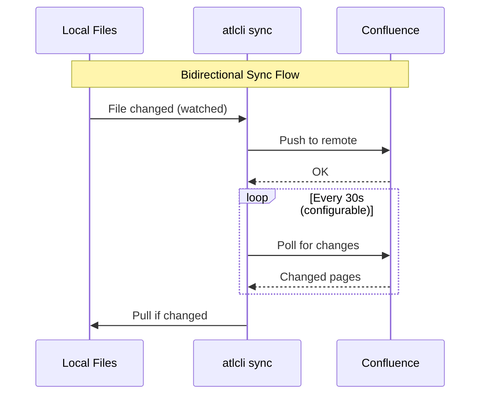

# Sync

Bidirectional synchronization between local markdown files and Confluence pages.

## Overview

atlcli provides powerful sync capabilities:

- **Watch**: Real-time bidirectional sync with file watching and remote polling
- **Pull**: Download Confluence pages as markdown
- **Push**: Upload local changes to Confluence
- **Conflict resolution**: Three-way merge with automatic and manual resolution

## Initialize

Set up a directory for sync:

```bash
atlcli wiki docs init ./docs --space TEAM
```

Options:

| Flag | Description |
|------|-------------|
| `--space` | Space key (required) |
| `--page-id` | Sync single page by ID |
| `--ancestor` | Sync tree under specific page |

### Scope Options

```bash
# Sync entire space
atlcli wiki docs init ./docs --space TEAM

# Sync specific page tree
atlcli wiki docs init ./docs --ancestor 12345

# Sync single page only
atlcli wiki docs init ./docs --page-id 12345
```

## Watch Mode

The most powerful sync mode - automatically syncs changes in real-time using file watching and remote polling:

```bash
atlcli wiki docs sync ./docs
```

### How Watch Mode Works

Watch mode combines two mechanisms for bidirectional sync:

1. **Local file watching**: Detects changes to local markdown files instantly
2. **Remote polling**: Periodically checks Confluence for remote changes



### Sync Command Options

```bash
atlcli wiki docs sync <dir> [options]
```

| Flag | Description |
|------|-------------|
| `--space <key>` | Sync entire space |
| `--ancestor <id>` | Sync page tree under parent ID |
| `--page-id <id>` | Sync single page |
| `--poll-interval <ms>` | Remote polling interval (default: 30000) |
| `--no-poll` | Disable remote polling (local watch only) |
| `--no-watch` | Disable file watching (poll only) |
| `--on-conflict <mode>` | Conflict handling: `merge`, `local`, `remote` |
| `--auto-create` | Auto-create pages for new local files |
| `--label <label>` | Only sync pages with this label |
| `--dry-run` | Preview changes without syncing |
| `--json` | JSON line output for scripting |

### Polling

The poller periodically checks Confluence for changes. Efficiency depends on sync scope:

| Scope | API Calls | Best For |
|-------|-----------|----------|
| `--page-id` | Minimal (1 page) | Editing single document |
| `--ancestor` | Moderate (tree) | Working on a section |
| `--space` | Higher (all pages) | Full documentation sync |

```bash
# Poll single page (most efficient)
atlcli wiki docs sync ./docs --page-id 12345

# Poll page tree
atlcli wiki docs sync ./docs --ancestor 12345

# Poll entire space
atlcli wiki docs sync ./docs --space TEAM
```

### Polling Events

The poller detects three types of remote changes:

| Event | Description | Action |
|-------|-------------|--------|
| `created` | New page added in scope | Pull to local |
| `changed` | Page content or title updated | Pull or merge |
| `deleted` | Page removed from scope | Notify user |

### Configuring Poll Interval

```bash
# Fast polling (every 10 seconds) - more API calls
atlcli wiki docs sync ./docs --poll-interval 10000

# Slow polling (every 2 minutes) - fewer API calls
atlcli wiki docs sync ./docs --poll-interval 120000

# Disable remote polling entirely
atlcli wiki docs sync ./docs --no-poll
```

**Note**: Lower intervals mean faster remote change detection but more API requests. The default (30 seconds) balances responsiveness with API usage.

### Webhooks

For instant remote change detection without polling overhead, use webhooks:

```bash
atlcli wiki docs sync ./docs \
  --webhook-port 8080 \
  --webhook-url https://your-server.com:8080/webhook
```

| Flag | Description |
|------|-------------|
| `--webhook-port` | Local webhook server port |
| `--webhook-url` | Public URL to register with Confluence |

**Webhook Events**:

The webhook server handles these Confluence events:

| Event | Description |
|-------|-------------|
| `page_created` | New page created |
| `page_updated` | Page content changed |
| `page_removed` | Page deleted |
| `page_trashed` | Page moved to trash |
| `page_restored` | Page restored from trash |
| `page_moved` | Page moved to different parent |

**Webhooks vs Polling:**

| Feature | Polling | Webhooks |
|---------|---------|----------|
| Latency | 0-30s (configurable) | Instant |
| Setup | None | Requires public URL |
| API usage | Regular requests | On-demand only |
| Reliability | Always works | Requires connectivity |
| Filtering | By scope | By page ID and space |

For local development, use polling. For production servers with public URLs, webhooks provide better performance.

### Auto-Create Pages

Create Confluence pages automatically for new local files:

```bash
atlcli wiki docs sync ./docs --space TEAM --auto-create
```

Auto-create triggers in two scenarios:

1. **During initial sync**: Untracked local files (no frontmatter ID) are created as new pages
2. **During file watching**: New files added while sync is running are automatically created

**How it works:**

| Aspect | Behavior |
|--------|----------|
| Title | From frontmatter `title`, or filename converted to title case |
| Parent | Space home page (for `--space`) or ancestor (for `--ancestor`) |
| Content | Full markdown content converted to Confluence storage format |

**Example workflow:**

```bash
# Start sync with auto-create
atlcli wiki docs sync ./docs --space TEAM --auto-create

# In another terminal, create a new file
echo "# My New Feature" > ./docs/my-new-feature.md

# Sync automatically:
# 1. Detects new file
# 2. Creates page "My New Feature" in Confluence
# 3. Updates local file with frontmatter containing page ID
```

After auto-create, the file is updated with frontmatter:

```markdown
---
atlcli:
  id: "12345678"
  title: "My New Feature"
---

# My New Feature
```

### Lock File

When sync is running, a lock file is created at `.atlcli/.sync.lock`. This:
- Prevents concurrent sync operations
- Signals to other tools that sync is active
- Is automatically removed on clean shutdown

## Pull

Download pages from Confluence to local markdown files:

```bash
atlcli wiki docs pull ./docs
```

Options:

| Flag | Description |
|------|-------------|
| `--space` | Filter by space key |
| `--page-id` | Pull specific page |
| `--ancestor` | Pull page tree |
| `--label` | Filter by label |
| `--force` | Overwrite local modifications |
| `--comments` | Export comments to sidecar files |
| `--no-attachments` | Skip downloading attachments |
| `--limit <n>` | Maximum pages to pull |

### Examples

```bash
# Pull using saved scope from init
atlcli wiki docs pull ./docs

# Pull pages with specific label
atlcli wiki docs pull ./docs --label api-docs

# Pull with comments exported
atlcli wiki docs pull ./docs --comments

# Force pull (overwrite local changes)
atlcli wiki docs pull ./docs --force

# Pull without attachments
atlcli wiki docs pull ./docs --no-attachments
```

### Comments Export

When using `--comments`, page comments are saved to sidecar files:

```
docs/
├── architecture.md
├── architecture.comments.json   # Comments for architecture.md
└── api-reference.md
```

The comments file contains both footer comments and inline comments with their full thread hierarchy.

## Push

Upload local changes to Confluence:

```bash
atlcli wiki docs push ./docs
```

Options:

| Flag | Description |
|------|-------------|
| `--page-id <id>` | Push specific page by ID |
| `--validate` | Run validation before push |
| `--strict` | Treat warnings as errors |
| `--json` | JSON output |

### Examples

```bash
# Push all tracked files
atlcli wiki docs push ./docs

# Push single file
atlcli wiki docs push ./docs/page.md

# Push by page ID
atlcli wiki docs push --page-id 12345

# Validate before pushing
atlcli wiki docs push ./docs --validate

# Strict validation (fail on warnings)
atlcli wiki docs push ./docs --validate --strict
```

### Validation

Pre-push validation checks for:

| Check | Severity | Description |
|-------|----------|-------------|
| Broken links | Error | Target file not found |
| Untracked pages | Warning | Link to page without ID |
| Unclosed macros | Error | `:::info` without closing `:::` |
| Page size | Warning | Content exceeds 500KB |

```bash
# Run validation separately
atlcli wiki docs check ./docs

# Strict mode (warnings are errors)
atlcli wiki docs check ./docs --strict

# JSON output for CI/scripts
atlcli wiki docs check ./docs --json
```

## Add

Add a new local file to Confluence tracking:

```bash
atlcli wiki docs add <file> [options]
```

| Flag | Description |
|------|-------------|
| `--title <t>` | Page title (default: from H1 or filename) |
| `--parent <id>` | Parent page ID |
| `--template <name>` | Use template for initial content |

```bash
# Add file with auto-detected title
atlcli wiki docs add ./docs/new-page.md

# Add with specific parent
atlcli wiki docs add ./docs/guide.md --parent 12345

# Add using a template
atlcli wiki docs add ./docs/meeting.md --template meeting-notes
```

## Diff

Compare local file with remote Confluence page:

```bash
atlcli wiki docs diff <file>
```

Shows unified diff with colored output:
- Green: additions (local has, remote doesn't)
- Red: deletions (remote has, local doesn't)
- Cyan: file headers and hunk markers

```bash
# Compare single file
atlcli wiki docs diff ./docs/api-reference.md

# JSON output with statistics
atlcli wiki docs diff ./docs/api-reference.md --json
```

## Conflict Resolution

### Detection

atlcli detects conflicts when:
- Local file was modified since last sync
- Remote page was modified since last sync

```
Conflict detected: docs/api.md
  Local:  Modified 2025-01-14 10:30 (version 5 → local changes)
  Remote: Modified 2025-01-14 10:35 (version 5 → version 6)
```

### Resolution Strategies

Control how conflicts are handled in sync mode:

```bash
atlcli wiki docs sync ./docs --on-conflict <strategy>
```

| Strategy | Behavior |
|----------|----------|
| `merge` | Attempt three-way merge (default) |
| `local` | Keep local version, overwrite remote |
| `remote` | Keep remote version, overwrite local |

### Three-Way Merge

With `--on-conflict merge`, atlcli attempts automatic merging:

1. Uses the common ancestor (base) version
2. Computes diffs from both local and remote
3. Merges non-conflicting changes
4. Marks conflicting sections with markers

### Conflict Markers

When merge cannot auto-resolve, conflict markers are inserted:

```markdown
## API Reference

<<<<<<< LOCAL
This endpoint returns user data in JSON format.
=======
This endpoint returns user data. Response format is JSON.
>>>>>>> REMOTE

### Authentication
```

### Resolving Conflicts

```bash
# Edit file to resolve conflicts manually
vim docs/api.md

# Then resolve with chosen strategy
atlcli wiki docs resolve docs/api.md --accept local
atlcli wiki docs resolve docs/api.md --accept remote
atlcli wiki docs resolve docs/api.md --accept merged  # After manual edit
```

## Status

Check sync status of all tracked files:

```bash
atlcli wiki docs status ./docs
```

Output:

```
Sync status for ./docs:

  synced:          12 files
  local-modified:  2 files
  remote-modified: 1 files
  conflict:        1 files
  untracked:       3 files

Last sync: 2025-01-14T10:30:00Z

Modified:
  api-reference.md (local changes)
  getting-started.md (remote changes)

Conflicts:
  troubleshooting.md
```

Options:

| Flag | Description |
|------|-------------|
| `--json` | JSON output |

## Ignore Patterns

Create `.atlcliignore` to exclude files from sync:

```bash
# .atlcliignore (gitignore syntax)

# Ignore drafts
drafts/
*.draft.md

# Ignore specific files
internal-notes.md

# Ignore by pattern
temp-*.md

# Negation (include despite earlier rule)
!important-draft.md
```

**Default ignores** (always excluded):

- `.atlcli/` - sync state directory
- `*.meta.json` - legacy metadata files
- `*.base` - base versions for merge
- `.git/` - git directory
- `node_modules/` - node dependencies

**Note**: Patterns from `.gitignore` are also respected and merged with `.atlcliignore`.

## Directory Structure

After init and pull:

```
docs/
├── .atlcli/
│   ├── config.json         # Sync configuration
│   ├── state.json          # Sync state (versions, timestamps)
│   ├── .sync.lock          # Lock file (when sync running)
│   └── cache/              # Base versions for 3-way merge
│       └── 12345.md        # Base content by page ID
├── getting-started.md
├── api-reference.md
├── api-reference.attachments/
│   └── diagram.png         # Attachments for api-reference.md
├── guides/
│   ├── installation.md
│   └── configuration.md
├── .atlcliignore           # Ignore patterns
└── .gitignore              # Git ignore (also respected)
```

### State File

`.atlcli/state.json` tracks sync state per page:

```json
{
  "lastSync": "2025-01-14T10:00:00Z",
  "pages": {
    "12345": {
      "path": "api-reference.md",
      "title": "API Reference",
      "version": 5,
      "localHash": "abc123",
      "remoteHash": "abc123",
      "baseHash": "abc123",
      "syncState": "synced",
      "parentId": "12340",
      "ancestors": ["12340", "12300"]
    }
  }
}
```

## File Format

Local files use YAML frontmatter with the `atlcli` namespace:

```markdown
---
atlcli:
  id: "12345"
  title: "API Reference"
---

# API Reference

Content here...
```

The frontmatter fields:

| Field | Required | Description |
|-------|----------|-------------|
| `id` | Yes | Confluence page ID (set automatically on pull/create) |
| `title` | No | Page title override (defaults to first H1 heading) |

See [File Format](file-format.md) for details.

## Hierarchy Handling

atlcli maps Confluence page hierarchy to directory structure:

```
Confluence:                    Local:
├── Parent Page               ├── parent-page.md
│   ├── Child A               ├── parent-page/
│   │   └── Grandchild        │   ├── child-a.md
│   └── Child B               │   ├── child-a/
                              │   │   └── grandchild.md
                              │   └── child-b.md
```

When pages move in Confluence, sync detects this and moves local files to match.

## JSON Output

Most commands support `--json` for scripting:

```bash
atlcli wiki docs status ./docs --json
```

```json
{
  "schemaVersion": "1",
  "dir": "./docs",
  "stats": {
    "synced": 12,
    "localModified": 2,
    "remoteModified": 1,
    "conflict": 1,
    "untracked": 3
  },
  "lastSync": "2025-01-14T10:00:00Z"
}
```

Sync command emits JSON lines (one event per line):

```bash
atlcli wiki docs sync ./docs --json
```

```json
{"schemaVersion":"1","type":"status","message":"Starting initial sync..."}
{"schemaVersion":"1","type":"pull","file":"api-reference.md","pageId":"12345","message":"Pulled: API Reference"}
{"schemaVersion":"1","type":"push","file":"guide.md","pageId":"12346","message":"Pushed: Guide"}
```

## Best Practices

1. **Use watch mode** for real-time collaboration on documentation
2. **Use labels** to sync subsets of pages (`--label architecture`)
3. **Enable webhooks** for production servers with public URLs
4. **Commit to Git** - track markdown files in Git for version history
5. **Use `.atlcliignore`** for drafts and local-only content
6. **Run validation** before pushing (`--validate`)

## Troubleshooting

### Lock File Issues

If sync fails due to lock:

```bash
# Check if sync is running
ps aux | grep "atlcli wiki docs sync"

# Force remove stale lock (only if no sync is active)
rm ./docs/.atlcli/.sync.lock
```

### Merge Conflicts

If you get stuck in merge conflicts:

```bash
# Reset to remote version
atlcli wiki docs pull ./docs --force

# Or force push local version
atlcli wiki docs resolve ./docs/file.md --accept local
atlcli wiki docs push ./docs
```

### Permission Errors

```
Error: You don't have permission to edit page 12345
```

Check your Confluence permissions for the space/page.

### Rate Limiting

If you see 429 errors, increase poll interval:

```bash
atlcli wiki docs sync ./docs --poll-interval 60000
```
