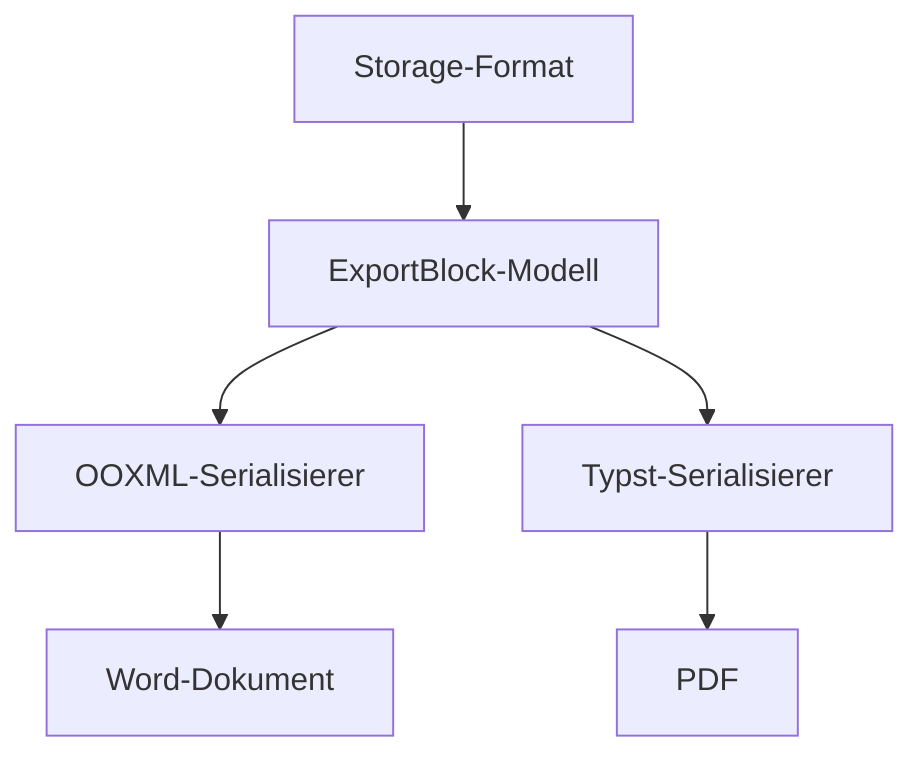

Diese Seite dient als Feature-Zoo für den E2E-Lauf des DOCX-Exports (Spec 004, Task 7). Sie enthält bewusst jedes Element, das die Export-Pipeline abdecken muss, und ist lang genug, um die Exportdauer realistisch zu messen. Sie beginnt absichtlich mit einer Überschrift der Ebene 2 — die Seitenüberschrift ist die implizite Ebene 1, und genau diese Form hat den Heading-Promotion-Fix ausgelöst.

## Ausgangslage und Zielsetzung

Der Export einer Confluence-Seite nach Word ist auf den ersten Blick ein Konvertierungsproblem und auf den zweiten ein Treuhandproblem. Die Kundenvorlage ist die Quelle der Wahrheit für alles Gestalterische: Deckblatt, Kopf- und Fußzeile, Schriftfamilie, Absatzformate, Nummernkreise. Unsere Aufgabe ist nicht, diese Gestaltung nachzubauen, sondern sie unangetastet zu lassen und ausschließlich die Platzhalter zu füllen sowie den Seitenkörper an der dafür vorgesehenen Stelle einzusetzen. Jede Abweichung von diesem Prinzip erzeugt Aufwand bei uns und Misstrauen beim Kunden.

Daraus folgt eine unbequeme Konsequenz, die wir früh akzeptiert haben: Alles, was von der Seitenzahl oder vom Umbruch abhängt, kann nur Word selbst berechnen. Inhaltsverzeichnisse, Querverweise, exakte Zeilenumbrüche — dafür liefern wir Felder und das Aktualisierungs-Flag, mehr nicht. In diesem Punkt sind wir auf Augenhöhe mit dem Wettbewerb, nicht darüber. Sichtbar besser werden wir an anderer Stelle: bei farbigem Code, bei der Optik der Hinweisboxen und, sobald das Bildmodul steht, beim Rendern von Diagrammen.

### Abgrenzung zum bisherigen Vorgehen

Bisher lief der Export über einen Zwischenschritt in Markdown. Das war für die Synchronisation richtig, für den Word-Pfad aber verlustbehaftet: Markdown kennt keine verbundenen Zellen, keine Hinweisbox mit Titel, keine farbigen Code-Läufe. Der Export geht deshalb über ein eigenes strukturiertes Zwischenmodell, das die Makro-Kenntnis des Konverters wiederverwendet, ohne dessen Textform zu erben. Dieses Modell ist bewusst isomorph gehalten — es kennt weder Browser noch Dateisystem — und wird später sowohl den Word- als auch den PDF-Pfad speisen. Ein Modell, zwei Serialisierer.

Die Entscheidung, dieses Modell im Confluence-Paket und nicht in der Erweiterung anzusiedeln, war rückblickend die wichtigste des ganzen Zyklus. Sie hat die Tests billig gemacht: Jeder Blocktyp lässt sich ohne Browser prüfen, und der Zeichentest gegen echtes Storage-Format deckt Randfälle auf, die im Browser nur mit erheblichem Aufwand reproduzierbar wären.

## Platzhalter und ihre Auflösung

Die Vorlage wird beim Hochladen entpackt und nach Platzhaltern durchsucht. Das Panel zeigt anschließend, welche Platzhalter die Vorlage verwendet, welche davon wir auflösen können und welche nicht. Diese Vorschau ist die Vertrauensfläche: Der Nutzer sieht vor dem Export, was ihn erwartet, und nicht erst danach im fertigen Dokument.

### Unterstützte Familien

Aufgelöst werden alle direkten und ableitbaren Felder — Titel, Autor, Datum, Raum, Exporteur, Vorlagenname. Für Datumsangaben unterstützen wir die gängigen Formatmuster. Ableitbare Felder lösen ihre Netzwerkabfragen nur dann aus, wenn die Vorlage sie tatsächlich benutzt; eine Vorlage ohne Raumbezug erzeugt keine Raumabfrage. Das klingt nach einer Kleinigkeit, spart im Alltag aber bei jeder einzelnen Ausführung eine Rundreise.

### Nicht unterstützte Familien

Einige Familien lösen wir bewusst nicht auf: Seiteneigentümer, Rechteanzeigen, Raumlogo, Seiteneigenschaften. Diese Platzhalter werden zu einer leeren Zeichenkette und erzeugen einen Eintrag im Bericht. Was sie ausdrücklich nicht tun: als literaler Text im fertigen Dokument stehen bleiben. Ein Kunde, der im exportierten Angebot ein rohes Platzhalter-Fragment findet, verliert das Vertrauen in den gesamten Export — deshalb ist dieser Fall durch einen eigenen Test abgesichert, der die Abwesenheit solcher Fragmente im Ergebnis prüft.

:::info Zwischenstand
Die Platzhalterauflösung deckt alle Zeilen der normativen Zuordnungstabelle ab. Jede Zeile hat einen eigenen Test gegen einen festen Kontext.
:::

:::note Bewusste Abweichung
Der Änderungszeitpunkt der Vorlage ist der Zeitpunkt des Hochladens, nicht der Zeitstempel der Originaldatei. Für den Machbarkeitsnachweis ist das ausreichend und im Bericht dokumentiert.
:::

:::warning Bekannte Grenze
Tief verschachtelte verbundene Zellen können in der Darstellung degradieren. Das Verhalten ist durch einen Test festgenagelt — es entsteht kein beschädigtes Dokument, sondern ein Bericht.
:::

:::tip Empfehlung für Vorlagen
Vorlagen, deren Inhaltsverzeichnis über Gliederungsebenen sammelt, funktionieren zuverlässiger als solche, die über Formatvorlagennamen sammeln. Wir setzen beides, damit auch Vorlagen mit eigenen Überschriftennamen ein gefülltes Verzeichnis bekommen.
:::

## Der Weg vom Storage-Format zum Dokument

Der Konverter läuft in mehreren Schritten. Zuerst wird das Storage-Format in Blöcke zerlegt. Anschließend werden die Blöcke in OOXML-Fragmente übersetzt. Zuletzt wird das Ergebnis an der Ankerstelle der Vorlage eingesetzt und das Archiv neu geschrieben.

Der heikelste Teil ist nicht die Übersetzung, sondern das Einsetzen. Kundenvorlagen enthalten geschweifte Klammern, Textfelder, Feldfunktionen und gelegentlich SmartArt. Jede dieser Formen kann eine naive Ersetzung aus dem Tritt bringen. Wir haben das gelöst, indem die Template-Engine mit Trennzeichen aus dem privaten Unicode-Bereich konfiguriert wird — solche Zeichen kommen in echten Vorlagen und in echten Inhalten nicht vor, und damit sind Kundenklammern niemals Steuerzeichen.

### Überschriftenebenen

Eine reale Beobachtung aus dem ersten Testlauf: Seiten beginnen selten bei Ebene 1. Die Seitenüberschrift ist die implizite Ebene 1, der Fließtext startet bei Ebene 2. Wer die Ebenen unverändert übernimmt, produziert ein Inhaltsverzeichnis, dessen oberste Ebene leer bleibt. Der Export berechnet deshalb eine dokumentweite Verschiebung: Die flachste vorkommende Ebene wird zur Ebene 1, alle anderen rücken entsprechend nach. Ein Dokument, das bereits bei Ebene 1 beginnt, bleibt unverändert.

### Zeichenkodierung

Das Storage-Format ist XHTML und trägt den vollen Satz benannter Zeichenentitäten. Umlaute wie ü, ö, ä, das scharfe ß, Akzente wie é, typografische Zeichen wie — und … sowie Symbole wie © müssen im Ergebnis als echte Zeichen erscheinen. Eine handgepflegte Liste reicht dafür nicht; wir dekodieren gegen den vollständigen Satz.

### Vorlagen aus der Praxis

Der erste Lauf gegen eine echte Briefvorlage hat mehr über den Export gelehrt als jede synthetische Testvorlage zuvor. Reale Vorlagen sind über Jahre gewachsen. Sie enthalten Formen, die in einer sauber konstruierten Testdatei schlicht nicht vorkommen, weil niemand sie absichtlich bauen würde. Ein Titel steckt in einem Textfeld, das doppelt vorliegt — einmal in der modernen Zeichnungsform und einmal als Rückfallebene für ältere Programmversionen. Beide Kopien müssen bearbeitet werden, sonst erscheint je nach Programmversion ein aufgelöster oder ein roher Platzhalter. Eine Fußzeile trägt ein Logo und unmittelbar dahinter, im selben Absatz, den Platzhalter für die Seitenzahl.

Diese Formen haben eine gemeinsame Ursache: Die naive Annahme, ein Absatz sei ein flacher Behälter aus Textläufen. Tatsächlich kann ein Absatz weitere Absätze enthalten, wenn ein Textfeld im Spiel ist. Die Lösung besteht darin, verschachtelte Bereiche vor der Bearbeitung auszublenden, den äußeren Absatz flach zu bearbeiten und die ausgeblendeten Bereiche anschließend rekursiv zu behandeln. Das klingt umständlich und ist es auch — aber es ist die einzige Variante, die alle beobachteten Formen ohne Sonderfälle trägt.

Eine zweite Lehre betrifft die Grenzen, die wir bewusst nicht überschreiten. Ein Platzhalter, der in der Logik einer Feldfunktion steht, wird nicht ersetzt; nur das angezeigte Ergebnis eines Feldes ist Text im Sinne des Exports. Und ein Platzhalter, der über die Grenze eines Textfeldes hinweg geteilt wäre, wird nicht zusammengesetzt — eine solche Teilung ist beim Verfassen gar nicht herstellbar, und ein Zusammensetzen über Bereichsgrenzen hinweg würde mehr kaputt machen als heilen. Beide Grenzen sind bewusst gesetzt und durch Tests dokumentiert, damit ein späterer Leser sie nicht für eine Lücke hält.

### Was der erste Lauf nicht geprüft hat

Ehrlichkeit gehört zum Bericht: Der erste Lauf hat Fehler gefunden, aber er hat die Korrekturen nicht bestätigt. Jeder Fund wurde behoben und mit einem Test abgesichert, doch geprüft wurde anschließend gegen die Tests, nicht gegen das geöffnete Dokument. Genau deshalb existiert dieser zweite Lauf. Er ist keine Erkundung mehr, sondern eine Bestätigung: Die reparierten Formen müssen im echten Programm korrekt erscheinen, und zwei Punkte der Prüfliste sind bisher überhaupt nicht am echten Programm geprüft worden — die optische Korrektheit von Hinweisboxen, Tabellen und Code sowie der Warnpfad für nicht unterstützte Platzhalter.

## Tabellen

Die folgende Tabelle fasst die Abdeckung zusammen. Sie ist bewusst schlicht gehalten — verbundene Zellen sind über Testfälle abgedeckt und lassen sich in Markdown nicht ausdrücken.

| Element | Abdeckung | Anmerkung |
|---|---|---|
| Überschriften | vollständig | inklusive Ebenenverschiebung |
| Hinweisboxen | vollständig | vier Arten, Titel optional |
| Tabellen | grundlegend | verbundene Zellen grundlegend |
| Listen | vollständig | verschachtelt, Aufgabenlisten |
| Code | vollständig | farbig über kuratierte Sprachen |
| Bilder | Bericht | Einbettung folgt in Spec 005 |
| Diagramme | Quelltext | Rendern folgt in Spec 005a |
| Verweise | vollständig | extern, Seite, Anhang |

## Listen

Die Listenbehandlung deckt Verschachtelung und Aufgabenlisten ab:

- Erste Ebene, einfacher Eintrag
- Zweite Ebene folgt
  - Untereintrag mit etwas mehr Text, damit der Umbruch im Word-Ergebnis geprüft werden kann
  - Ein weiterer Untereintrag
    - Dritte Ebene, um die Einrückung zu prüfen
- Rückkehr auf die erste Ebene

Und nummeriert:

1. Vorlage hochladen
2. Ergebnis der Analyse prüfen
   1. Unterstützte Platzhalter kontrollieren
   2. Nicht unterstützte Platzhalter zur Kenntnis nehmen
3. Export auslösen
4. Ergebnis in Word öffnen und Felder aktualisieren

## Code

Ein Block in einer kuratierten Sprache — hier muss farbige Hervorhebung sichtbar sein:

```typescript
export interface ExportEnv {
  templates: TemplateSource;
  assets: AssetFetcher;
  output: OutputSink;
}

export async function runExport(input: ExportInput, env: ExportEnv): Promise<ExportReport> {
  const bytes = await env.templates.getBytes(input.templateId);
  const scan = scanTemplate(bytes);
  const resolved = await resolvePlaceholders(input.ctx, scan.used);
  return render(bytes, resolved, env);
}
```

Ein Diagrammblock — dieser muss im Ergebnis als **lesbarer Quelltext** erscheinen, nicht als beschädigtes Bild. Das ist das festgenagelte Ausweichverhalten aus Spec 004, das Spec 005a später durch echtes Rendern ersetzt:



Ein Block in einer nicht kuratierten Sprache — unfarbig, mit Berichtseintrag:

```brainfuck
+[-]>+[-]<[->+<]
```

Und ein Block ganz ohne Sprachangabe, der planmäßig unfarbig bleibt:

```
$ atlcli wiki page get --id 12345
```

## Verweise und Zustände

Ein externer Verweis führt zur [Projektseite](https://atlcli.sh), ein weiterer zur [Dokumentation](https://atlcli.sh/docs). Der Status eines Arbeitspakets lässt sich inline darstellen: Spec 004 ist {status:green}erledigt{status}, Spec 005 ist {status:yellow}geplant{status} und Spec 007 ist {status:grey}offen{status}.

## Bilder

Die folgenden drei Verweise müssen im Word-Ergebnis als Berichtszeilen erscheinen — übersprungen, nicht kaputt:


## Ausblick

Der nächste Schritt ist das Bildmodul: Medienteile, Beziehungen, Inhaltstypen und die Größenberechnung in englischen Maßeinheiten. Danach folgt das Rendern von Diagrammen über denselben Einbettungspfad. Der PDF-Pfad kommt anschließend und nutzt dasselbe Zwischenmodell mit einem eigenen Serialisierer.

Die eigentliche Prüfung ist aber keine technische, sondern eine praktische: Ein Angebot, das aus Confluence exportiert und ohne Nacharbeit an einen Kunden geschickt werden kann, ist der Beweis. Alles andere ist Vorarbeit. Diese Seite existiert, um genau diesen Beweis reproduzierbar zu machen — sie enthält jedes Element, das in echten Dokumenten vorkommt, und sie ist lang genug, dass die gemessene Dauer eine belastbare Aussage über das Verhalten bei realen Seiten erlaubt.

Der Bericht am Ende jedes Laufs ist dabei nicht schmückendes Beiwerk, sondern das eigentliche Kontrollinstrument. Er nennt die Zahl der aufgelösten Platzhalter, führt jeden nicht unterstützten Platzhalter mit Namen auf, listet jedes übersprungene Bild und weist die Dauer aus. Ein Export ohne Berichtszeilen ist ein sauberer Export; ein Export mit Berichtszeilen ist ein ehrlicher. Was es nicht geben darf, ist ein Export, der stillschweigend etwas verliert — dieser Fall ist der einzige, den wir als Fehler betrachten.
