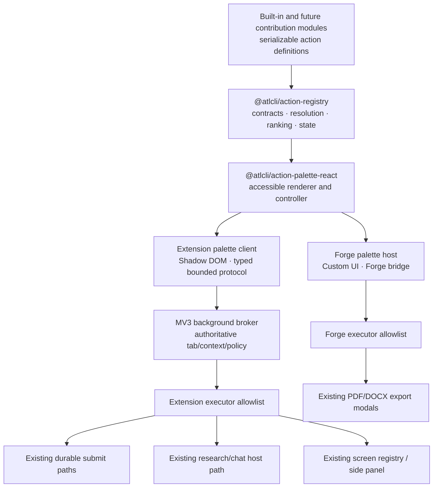
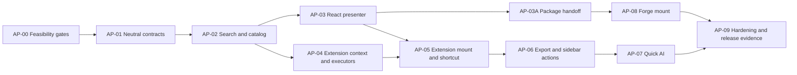

# Atlassian Action Palette MVP

**Status:** Proposed

**Spec ID:** `action-palette-mvp`

**Primary repository:** `atlcli` at `0adae619`

**External consumer:** `/Users/bjoern/code/kiteweave-forge-app` at `f520e66`

**Target surfaces:** Chrome extension on Atlassian Cloud; Forge Custom UI on Confluence Cloud

**Origin:** Product concept for a Raycast-inspired action palette opened from Atlassian pages

## 1. Executive summary

Build a fast, keyboard-first action palette that exposes existing atlcli capabilities without requiring the user to open the sidebar first.

The MVP has one neutral action contract and two host-owned mounts:

1. The Chrome extension injects an isolated overlay on Atlassian Cloud pages and opens it through a configurable `chrome.commands` shortcut.
2. The Forge app mounts the same presentational palette in a Confluence content action and delegates PDF/DOCX choices to its existing export modals.

The palette is a new **action surface**, not a new implementation of export, AI, page loading, or plugin execution. Action definitions are serializable data. Each host advertises capabilities and owns the executors that turn an allowed action intent into an existing port or modal call. This keeps credentials, browser APIs, Forge lifecycle, persistence, and heavy engines at the host boundary.

The first release deliberately does not attempt runtime third-party plugins, Extension-to-Forge discovery, a shared cross-host job broker, Forge AI, or Forge Jira support. The contracts must make later contribution modules possible without committing the MVP to remote code execution or a permanent compatibility layer.

## 2. Outcome and success criteria

The MVP is complete when all of the following are true:

- On a supported Atlassian tab, the configured extension shortcut opens one palette, focuses search, and preserves/restores the user's page focus.
- Search, arrow navigation, `Enter`, `Cmd/Ctrl+Enter`, `Escape`, `Home`, and `End` are usable without a pointer and have automated accessibility coverage.
- Confluence extension users can start a current-page PDF export, start a current-page DOCX export when a valid template exists, open Publishing Studio when more export input is required, open the sidebar, and submit an explicit quick-AI question using the existing research/chat runtime.
- Jira extension users get Jira-aware context for actions that support it; Confluence-only export actions are unavailable with a clear reason rather than failing at execution time.
- Long extension exports survive palette closure and produce a durable activity receipt through the existing job path.
- A Forge Confluence content action renders the same palette UX and opens the existing PDF/DOCX export modals. It does not bundle an export engine, AI runtime, or extension code.
- A synthetic built-in-style contribution module proves that an additional package can add action definitions and a host executor without changing the palette shell.
- Packed extension, Forge development installation, accessibility, performance, security, typecheck, build, and test gates have recorded evidence.

Proposed performance budgets, to be validated and adjusted with measured evidence rather than asserted:

| Measure | MVP budget | Measurement boundary |
| --- | ---: | --- |
| Warm shortcut to focused input | p95 <= 100 ms | Already-injected extension content script |
| Cold shortcut to focused input | p95 <= 200 ms | First open after supported page navigation |
| Local query update over 500 actions | p95 <= 50 ms | Keystroke to updated active row |
| Pure search core over 1,000 actions | p95 <= 16 ms, max <= 50 ms | Query to ranked IDs outside React |
| Eager palette bootstrap | <= 30 KiB gzip | Content-script delta before first open |
| Total lazy palette UI | <= 180 KiB gzip | Palette-specific JS and CSS delta |
| Search-time network requests | 0 | Root list and local filtering |
| AI or page-body work before explicit action | 0 | Palette open and search |

These numbers are release gates once the AP-00 measurement harness is stable. If the harness is noisy, record distributions and fix the harness. A budget may change only through explicit plan approval backed by new baseline evidence; a missed budget otherwise leaves the task open and triggers the performance STOP condition.

## 3. Product scope

### 3.1 Included in the extension MVP

- Atlassian Cloud match scope: `https://*.atlassian.net/*`, top frame only.
- Product/context recognition for Confluence pages, Jira issues, and a safe site-level fallback using `@atlcli/core/entity-url` plus the existing page/tab context machinery.
- Configurable browser command. AP-00 proved the original `Ctrl+K` suggestion unreliable on Linux, so the explicitly approved default is `Ctrl+Shift+K`, which Chrome maps to `Command+Shift+K` on macOS. The installed binding is read through `chrome.commands.getAll()` and documented as user-remappable through Chrome's extension shortcut settings.
- A Shadow DOM overlay with atlcli-owned design tokens, no host-page CSS dependency, no remote iframe, and no remote assets.
- Root suggestions, local search, disabled reasons, an action panel, minimal parameter forms, loading/empty/error/queued states, and a route to the sidebar for larger workflows.
- Extension actions:

  | Action | Context | Execution |
  | --- | --- | --- |
  | Export current page as PDF | Loaded Confluence page | Existing durable job request/submission path; current-page scope and established PDF defaults |
  | Export current page as DOCX | Loaded Confluence page with valid stored template | Existing durable job request/submission path and template library |
  | Configure DOCX export | Confluence page without valid template | Open Publishing Studio with DOCX selected |
  | Open Publishing Studio | Any supported Atlassian context | Open side panel and select Export screen where applicable |
  | Open Research | Any supported Atlassian context | Open side panel and select Research screen |
  | Ask AI about this page/issue | Context supported by current research adapter | Explicit text input; existing `ChatAgentPortV1.startTurn()`; short streamed result with “Continue in Research” |
  | Open Activity | Any context | Open side panel and select Activity screen |

- The palette must use existing request builders or extract a shared pure builder from current extension code. It must not invent a second set of export defaults, template semantics, or AI request preparation.

### 3.2 Included in the Forge MVP

- One new Confluence `contentAction` backed by a lightweight Custom UI entry.
- Search and keyboard navigation over two actions:
  - Export this page as PDF.
  - Export this page as DOCX.
- Each action opens the existing format-specific Forge modal through `openExportModal()`. Existing template selection, progress, attachment, and error flows remain authoritative.
- A development-installation probe of `mod+k`, followed by an enforceable manifest choice: use a distinct static fallback or no Forge shortcut if it can collide with the extension. The Forge shortcut is manifest-defined and therefore not per-user configurable in this MVP.
- Menu access remains available even if the shortcut conflicts with Confluence.

### 3.3 Explicitly deferred

- Forge Jira modules or the Preview `jira:command` module.
- Forge AI/DeepAgent, an AI placeholder, or external-provider scopes in the Forge app.
- Extension-to-Forge installation detection, handshakes, shared state, command arbitration, or cross-frame brokers.
- Automatic merging of Forge and extension actions when both products are installed.
- Runtime installation or execution of third-party JavaScript bundles.
- Remote action catalogs, remote UI, `eval`, dynamic module URLs, or CDN-delivered components.
- A public plugin marketplace, signing, permissions consent, version negotiation, sandboxing, or billing.
- Destructive/write actions such as editing pages or transitioning Jira issues. Their future contract is reserved through effect classes and confirmation policy, but they are not MVP actions.
- A new generic sidebar/screen registry. The existing screen registry remains responsible for full-screen workflows; the palette can request navigation to a registered screen.
- Mobile/touch as a primary interaction model. The overlay must remain responsive and dismissible, but desktop keyboard use is the MVP path.

### 3.4 Current-state anchors

The plan is based on these implemented seams, not on helper names alone:

| Concern | Current authoritative seam | Consequence for the MVP |
| --- | --- | --- |
| Full product surfaces | `apps/extension/utils/screens/registry.ts`, `apps/extension/components/screens/index.ts` | The registry is React/screen-shaped; keep it for large workflows and create a neutral action registry instead of generalizing it |
| Host capabilities | `apps/extension/utils/ports/index.ts`, `apps/extension/entrypoints/sidepanel/ports/index.ts` | Extension actions are enabled from real adapters/capabilities |
| Atlassian identity | `packages/core/src/entity-url.ts`, `apps/extension/utils/tab-observer.ts` | Reuse URL/entity parsing, but make background sender/tab state authoritative |
| Current content script | `apps/extension/entrypoints/confluence-rovo.content/index.ts` | Add a separate all-Atlassian palette entry; do not widen the Rovo script |
| Chrome manifest boundary | `apps/extension/wxt.config.ts`, `apps/extension/tests/manifest.test.ts` | Add `commands` and the new entry while preserving exact permissions, hosts, and CSP |
| Durable PDF/DOCX | `apps/extension/utils/export-jobs/pdf-submit.ts`, `docx-submit.ts`, request builders, Activity store/screen | Submit and return a receipt; the palette does not own polling, compilation, or download lifetime |
| Quick AI | `packages/research/src/chat-agent/port.ts`, background `runResearch`, `ResearchScreen.tsx` disclosure/handoff | Reuse the host runtime and sanitized presentation; do not clone ResearchScreen |
| CLI plugins | `packages/plugin-api/src/types.ts` | Leave unchanged: handlers/argv/flags are the wrong browser trust/lifecycle contract |
| Forge exports | `manifest.yml`, `apps/forge-export/src/modal-launcher.ts`, `forge-bridge.ts` | The Forge palette opens existing modals; it does not execute export engines |
| Forge product boundary | `specs/PRODUCT-SHAPE.md`, `scripts/check-cost-invariants.ts` in the Forge repo | Keep AI, Jira, external providers, functions, remotes, and runtime plugins out of Forge MVP |

## 4. UX concept

### 4.1 Interaction model

The visual language should borrow Raycast's density and progressive disclosure, not copy its branding or desktop-only assumptions.

1. **Open:** The configured shortcut toggles the palette. Search is focused and the current Atlassian context is summarized in compact, non-editable chips such as `Confluence · DOCSY · Page title` or `Jira · ATLCLI-123`.
2. **Discover:** With an empty query, show deterministic contextual suggestions grouped by capability. Do not fetch page bodies or start AI to build this list. Favorites, learned frecency, and query history are deferred.
3. **Search:** Match title, subtitle, keywords, group, and action aliases locally. Contextually available actions rank before disabled matches. Stable ordering must prevent rows from jumping while results stream or availability resolves.
4. **Run:** `Enter` runs the primary action. `Cmd/Ctrl+Enter` opens the action panel for secondary actions such as Open in Sidebar or Copy diagnostic details.
5. **Collect input:** An action may transition within the palette to a small validated form. Quick AI uses a text area and explicit Submit; DOCX configuration exits to Publishing Studio instead of recreating the template UI.
6. **Report:** Immediate actions show a compact success/error state. Durable exports show a queued receipt and links to Activity or the sidebar. Closing the palette never cancels a durable job.
7. **Continue:** Complex results, clarifications, template configuration, history, citations, and multi-turn AI continue in the sidebar.

### 4.2 Keyboard contract

| Key | Root/search list | Action panel or form |
| --- | --- | --- |
| Configured browser command | Toggle palette | Toggle palette closed |
| `ArrowDown` / `ArrowUp` | Next / previous visible row, including unavailable rows | Next / previous panel action or field choice |
| `Home` / `End` | First / last visible row | First / last panel action where applicable |
| `Enter` | Run selected primary action if available | Run selected panel action; submit a single-line form; insert a newline in a multiline prompt |
| `Cmd/Ctrl+Enter` | Open action panel | Submit a valid form, including the multiline Quick AI prompt |
| `Escape` | Clear a non-empty query; otherwise close | Return one level; close only from an empty root |
| `Tab` / `Shift+Tab` | Normal focus traversal inside dialog | Normal focus traversal; never overloaded as “Ask AI” |

IME composition must suppress navigation/submit handling until composition ends. Repeated shortcut events must not mount duplicate overlays or execute an action twice.

Raycast uses `Cmd/Ctrl+K` for its nested Action Panel because its launcher has a different global shortcut. This product uses the configured browser command (approved default `Cmd/Ctrl+Shift+K`) to toggle the palette, so the MVP assigns `Cmd/Ctrl+Enter` to the nested Action Panel and documents that deliberate divergence.

### 4.3 Accessibility contract

- The overlay uses a labelled `role="dialog"` with `aria-modal="true"`.
- Search and results implement a tested combobox/listbox pattern with `aria-activedescendant`, one active option, meaningful group labels, and disabled reasons that are perceivable to assistive technology.
- Unavailable options remain selectable for inspection and expose their reason through the option's accessible name/description; activation is blocked rather than keyboard selection.
- Focus enters the search control on open, remains trapped within the active dialog, and returns to the exact previously focused host element on close when it still exists.
- Result count and async state changes use a restrained live region; streamed AI text must not announce every token.
- Icons are decorative unless they convey status; status also has text.
- Contrast, forced-colors mode, 200% zoom, 320 CSS px width, reduced motion, long localized labels, and keyboard-only operation are release checks.
- Every pointer target is at least 24×24 CSS px; primary close/action controls target 44×44 CSS px where the dense layout permits.
- Host page selection and editor state must remain unchanged when opening or closing the palette.

### 4.4 Visual structure

```text
┌────────────────────────────────────────────────────────────┐
│ Search actions…                          Confluence · DOCSY │
├────────────────────────────────────────────────────────────┤
│ Suggested                                                  │
│  ▸ Export current page as PDF                       ↵      │
│    Export current page as DOCX                Template.docx │
│                                                            │
│ AI                                                         │
│    Ask AI about this page                                  │
│                                                            │
│ Navigation                                                 │
│    Open Publishing Studio                                  │
├────────────────────────────────────────────────────────────┤
│ Esc Close              ↵ Run              ⌘↵ Actions       │
└────────────────────────────────────────────────────────────┘
```

The root viewport should show roughly 7–9 rows at common desktop sizes, keep the selected row visible, and avoid a full-page scrim opacity that makes the Atlassian context unreadable.

## 5. Architecture

### 5.1 Ownership model



The dependencies point inward toward neutral contracts. Neither shared package imports WXT, `chrome`, `@forge/bridge`, `@forge/api`, extension components, credentials, PDF/DOCX engines, or the research worker.

### 5.2 `@atlcli/action-registry`

Create `packages/action-registry` as a strict ESM/browser-safe package with the repository's standard `development`, `types`, and `default` exports.

Minimum public contract:

```ts
export interface ActionDefinitionV1 {
  schemaVersion: 1;
  id: string;                    // namespaced, immutable, e.g. atlcli.export.pdf.current-page
  moduleId: string;
  title: ActionTextV1;            // stable key plus English fallback
  subtitle?: ActionTextV1;
  keywords?: readonly string[];
  group: ActionGroupIdV1;        // stable token; built-ins define suggested/export/ai/navigation
  icon: ActionIconTokenV1;
  intent: ActionIntentV1;         // serializable data, never a function
  secondaryActions?: readonly ActionAffordanceV1[];
  requirements?: readonly ActionRequirementV1[];
  effect: "read" | "download" | "external-navigation" | "write";
  input?: ActionInputSchemaV1;
  order?: number;
}

export interface ActionModuleV1 {
  schemaVersion: 1;
  id: string;
  actions: readonly ActionDefinitionV1[];
}

export interface ActionSurfaceContextV1 {
  siteOrigin: string;
  product: "confluence" | "jira" | "atlassian";
  entity?: { kind: string; id: string; key?: string; title?: string; url: string };
  locale: string;
  capabilities: readonly string[];
}

export type ActionResultV1 =
  | { status: "completed"; messageKey: string; actions?: readonly ActionAffordanceV1[] }
  | { status: "queued"; receipt: ActionReceiptV1; actions?: readonly ActionAffordanceV1[] }
  | { status: "input-required"; input: ActionInputSchemaV1 }
  | { status: "open-surface"; target: ActionSurfaceTargetV1 }
  | { status: "failed"; errorCode: string; messageKey: string; retryable: boolean };

export interface ActionExecutorPortV1 {
  execute(request: ActionExecutionRequestV1, signal: AbortSignal): Promise<ActionResultV1>;
}
```

Contract rules:

- Validate schema versions, namespaced IDs, duplicate IDs, requirement names, effect classes, and input values at the boundary.
- Keep localization host-owned but contract-safe: every visible text token has a stable key and English fallback; extension and Forge provide locale dictionaries and key-parity tests.
- Keep action definitions JSON-serializable. Runtime executor functions live in a host-owned allowlist keyed by intent kind.
- `ActionAffordanceV1` is also versioned/serializable and carries its own stable ID, text, intent, requirements, effect, and availability projection. It is the one contract for root secondary actions and result actions such as Activity/Open Sidebar.
- `ActionSurfaceTargetV1` is a closed, versioned discriminated union for the supported sidebar screens/modal formats plus bounded opaque continuation/session IDs. Arbitrary `Record<string, unknown>` navigation state is forbidden.
- Resolve availability from context and advertised capabilities before ranking. Re-check context, capability, and effect policy immediately before execution.
- Ranking is deterministic and pure: normalized exact/prefix title matches, token-prefix matches, keywords/aliases, fuzzy subsequence, context boost, and declaration order as the final tie-breaker.
- The MVP persists no queries, recents, favorites, AI prompts, page bodies, tenant credentials, or result payloads.
- Unknown schema versions, unknown intent kinds, and unknown effect classes fail closed.

This package is separate from `@atlcli/plugin-api`. The current plugin API is CLI-shaped and carries executable handlers, argv, and flags; using it in the browser would couple the action surface to the wrong lifecycle and trust model.

### 5.3 `@atlcli/action-palette-react`

Create a browser-safe React package containing only presentation and interaction state:

- `ActionPalette`, `ActionList`, `ActionRow`, `ActionPanel`, `ActionInputForm`, `ActionResultView`, and an error boundary.
- A reducer/state machine for `closed -> root -> action-panel | input -> executing -> result`.
- Props for resolved catalog, context summary, executor port, translations, icon resolver, `portalTarget`, and lifecycle callbacks.
- No direct persistence, networking, page parsing, Chrome messaging, Forge bridge, export, or AI imports.
- No raw HTML rendering. Titles, subtitles, results, context chips, and error messages are rendered as text.

Use the smallest dependency set possible. If a dialog/combobox dependency is introduced, record its packed output and browser-graph impact before accepting it. The existing UI code intentionally avoided Radix until a dialog/listbox need existed; this feature is such a need only if the dependency passes output, CSP, and focus-behavior gates.

### 5.4 Extension host adapter

Add an isolated WXT content-script entry, proposed path:

```text
apps/extension/entrypoints/atlassian-action-palette.content/
├── index.tsx
└── style.css
```

The content script is an untrusted renderer/client relative to host-authoritative execution. It may display a bounded context projection, but it must not tell the background which tenant, tab, entity, export scope, credential, or host identity to trust.

Content-script responsibilities:

- Match Atlassian Cloud, run in `ISOLATED` world, top frame only, and create one namespaced host element with a Shadow Root.
- Keep no palette DOM root, polling loop, or `MutationObserver` before first open; lazily mount the presenter on the first toggle.
- Receive typed `ExtMessage` toggle requests from the MV3 service worker. Do not add a parallel page-level `keydown` listener for the configured command.
- Request a bounded, serializable catalog/context projection from the background and send only `requestId`, action ID, locale, and validated user input when executing.
- Dispose listeners, detach streamed views, and restore focus/editor selection on unmount/navigation.

Background-broker responsibilities:

- Use the active tab only when the browser command chooses the initial receiver. For every content-originated catalog or execution request, bind authority to `MessageSender.tab.id`, `documentId`, `frameId === 0`, and origin; re-read and validate that exact tab/document immediately before execution. Never substitute whichever tab is currently active.
- Issue a short-lived opaque catalog/session revision bound server-side to that sender document and authoritative context. An execution request with a stale revision, changed document, changed origin, or changed entity fails closed.
- Resolve the catalog from actual host capabilities and current authoritative context, then re-resolve both immediately before execution.
- Own the executor allowlist and delegate to existing durable submit, research, and side-panel navigation paths.
- Return only serializable action projections and redacted receipts/session IDs. Never send page bodies, artifact/template bytes, provider keys, raw stacks, host identity, or full export/research requests to the content script.
- Keep changes to the large `background.ts` listener thin by extracting a testable `action-palette/background-host.ts` with injected dependencies.

Update `wxt.config.ts`, the typed message union, background command handling, and built-manifest tests. `background.ts` should call `chrome.commands.onCommand`, find the active supported tab, and send one idempotent toggle message. The command handler must not assume a content script receiver exists; unsupported/restricted pages produce a bounded, non-sensitive diagnostic.

#### Opening the sidebar at a target screen

Introduce a revisioned, short-lived `chrome.storage.session` mailbox carrying a host-local request such as `{ requestId, screenId, source: "action-palette", expiresAt }`. This survives the cold `chrome.sidePanel.open()` race, is acknowledged exactly once, and is rejected after expiry. The side panel resolves the ID through the existing screen registry. It must never instantiate a second screen registry, mutate `lastWorkspace` merely to force navigation, or import a screen component into the content script.

Call `chrome.sidePanel.open()` only within a browser-recognized user gesture path. Prove in the packed extension that the action selection/message path retains eligibility. If it does not, stop and redesign the adapter; do not silently replace “Open sidebar” with instructions.

#### Export execution

- PDF: use current-page scope, established defaults, `createExtensionPdfJobRequest()`, and `submitExtensionPdfExport()`. Return once the durable record is accepted; do not attach the palette to `runSubmittedExtensionPdfExport()` polling/downloading.
- DOCX: resolve the active space-specific template and then the global selection, pin its record key, bytes, and digest into `createExtensionDocxJobRequest()`, and submit through `submitExtensionDocxExport()`. Template bytes never cross the palette protocol. If no valid template exists, return `open-surface` for Publishing Studio with DOCX selected. Do not add file upload UI to the palette.
- Reuse or extract pure request-building functions from `PublishingDraftProvider`, `PdfExportPanel`, and `DocxExportPanel`. The screen and palette must receive the same defaults and validation behavior.
- Once a durable job is accepted, return a redacted receipt, let the palette close, and expose Activity/Open Sidebar actions. Palette cancellation after submission must not cancel the job.

#### Quick AI execution

- Show context chips and the existing disclosure before submission; require per-invocation confirmation plus an explicit prompt submission. Palette open/search sends no content to a provider.
- Reuse `ChatAgentPortV1`, the current background `runResearch` host path, and the extension research request/context/host-identity preparation. Do not create another agent, provider client, or history store.
- Render a bounded short response with cancel and “Continue in Research”. If the agent requests clarification, approval, or a tool interaction, route to Research rather than recreating HITL UI.
- Closing detaches the palette view from a handed-off/durable turn; it does not implicitly cancel it. Only an explicit Cancel uses the existing control contract. Never discard or mutate existing sidebar chat history.
- Apply the same provider availability, workspace, permissions, redaction, and error taxonomy as the Research screen.

### 5.5 Forge host adapter

The Forge repository remains a consumer of published/pinned atlcli packages. It must not import `apps/extension`.

Proposed Forge changes:

```text
manifest.yml
package.json
scripts/verify-atlcli.ts
scripts/check-cost-invariants.ts
scripts/check-output.ts
apps/forge-export/palette.html
apps/forge-export/src/palette-main.tsx
apps/forge-export/src/ActionPaletteView.tsx
apps/forge-export/src/action-palette.css
apps/forge-export/src/forge-action-host.ts
apps/forge-export/src/modal-launcher.ts
apps/forge-export/vite.config.ts
apps/forge-export/tests/forge-action-host.test.ts
apps/forge-export/tests/browser-boundaries.test.ts
```

Responsibilities:

- Register a third Confluence content action and a sixth named Vite entry, subject to current-baseline drift verification.
- Consume pinned, built `@atlcli/action-registry` and `@atlcli/action-palette-react` packages; extend `scripts/verify-atlcli.ts` to validate versions, `dist/`, and browser entries.
- Advertise only the two modal-open capabilities needed for PDF and DOCX.
- Map `atlcli.export.pdf.current-page` to `openExportModal("pdf", "palette")` and `atlcli.export.docx.current-page` to `openExportModal("docx", "palette")`; reject every unknown intent.
- Extend the modal origin union with `"palette"` only. The modal remains the authoritative export workflow.
- Extend boundary and cost-invariant tests deliberately. The palette entry may not import engines, workers, AI, extension code, `@forge/api`, external URLs, remotes, or browser persistence.
- Extend `scripts/check-output.ts` so `palette.html` is required, maps to a distinct emitted entry, has an explicit initial-size budget, and is scanned transitively for engine/worker/AI/extension/external-runtime markers.
- Preserve the existing untracked `/Users/bjoern/code/kiteweave-forge-app/design/` directory and all unrelated worktree changes.

### 5.6 Future contribution model, without runtime plugins

The MVP proves compile-time contributions:

```ts
export const publishingActions: ActionModuleV1 = { /* data only */ };
export const researchActions: ActionModuleV1 = { /* data only */ };

const catalog = createActionCatalog([
  publishingActions,
  researchActions,
  syntheticFixtureActions,
]);
```

Adding a module requires:

1. Serializable definitions in a package.
2. Host capability declarations.
3. A host-owned, allowlisted executor for each supported intent.
4. Permission/effect review and tests.

This is the compatibility seam for future plugins and package-provided features. Runtime discovery is a separate product/security project and must not be smuggled into the MVP through dynamic imports or remote JSON that changes executable behavior.

## 6. Security and privacy invariants

- Opening, searching, ranking, or closing the palette never reads a page body and never contacts an AI provider.
- Before every execution, rebuild or validate the current site origin and entity identity. A result selected on one page must not execute against a newly navigated page.
- The extension and Forge adapters use explicit intent allowlists. Unknown intents fail closed and produce no side effects.
- Action definitions contain no executable functions, HTML, URLs outside validated current-tenant navigation, credentials, provider keys, or raw user content.
- The presenter never uses `dangerouslySetInnerHTML` for action or result content.
- Receipts, metrics, and logs contain action IDs, coarse context kinds, duration, and redacted error codes only. They exclude prompts, responses, page bodies, tenant identifiers, attachment bytes, and document titles by default.
- Any future `write` effect requires a preview/confirmation contract and a second authorization check. The MVP registers no write-effect actions.
- The extension CSP remains exact; no remote script, remote iframe, `unsafe-eval`, or new externally connectable surface is introduced.
- Forge scopes, external origins, functions, remotes, and storage stay unchanged unless a separately reviewed task demonstrates necessity. The MVP architecture requires none of them.
- The content-script protocol rejects caller-supplied `apiKey`, `hostIdentity`, `scope`, `siteOrigin`, `url`, `tabId`, `windowId`, template bytes, and raw export/research request fields.

## 7. Repository drift checks

Before implementation, compare the planned baselines with current source:

```bash
rtk git status --short
rtk git diff --stat 0adae619..HEAD -- \
  packages/plugin-api packages/core/src/entity-url.ts \
  apps/extension/utils/ports apps/extension/utils/screens \
  apps/extension/components/app apps/extension/components/screens \
  apps/extension/entrypoints apps/extension/wxt.config.ts

rtk git -C /Users/bjoern/code/kiteweave-forge-app status --short
rtk git -C /Users/bjoern/code/kiteweave-forge-app diff --stat f520e66..HEAD -- \
  manifest.yml package.json scripts/verify-atlcli.ts scripts/check-cost-invariants.ts \
  apps/forge-export
```

If the command/message protocol, screen registry, export request ownership, research port, Forge named entries, or cost invariants changed materially, update this plan before coding.

## 8. Git workflow and implementation strategy

### 8.1 Git workflow

- Recheck both worktrees before every task and preserve unrelated changes. In particular, never add/remove the Forge repo's existing untracked `design/` directory.
- Use an atlcli branch such as `codex/action-palette-mvp`. Use a separate reviewed branch in `kiteweave-forge-app`; never stage or commit across repositories as though they were one change.
- Keep commits conventional and scoped, for example `feat(core): add action palette contracts`, `feat(extension): mount action palette`, `feat(extension): add palette actions`, `docs: document action palette`, and Forge-side `feat: add Confluence action palette`.
- Per repository rules, run the relevant E2E gate before every commit, then inspect the staged diff for generated artifacts, credentials, tenant data, and unrelated files.
- Capture privacy-safe screenshots for every live test, store the image files outside both repositories, and present absolute view/download links in the task conversation. Never stage or commit the screenshots.
- Never push, publish packages, deploy to production, release, or open a PR without explicit authorization. Forge development deployment for AP-08 is test evidence, not release authorization.

### 8.2 Dependency graph



Only one task should be marked in progress at a time in this file. Check a task only when its proof command and evidence are complete.

## 9. Checkable implementation tasks

### AP-00 — Revalidate baselines and prove platform feasibility

**Depends on:** Nothing

**Blocks:** All implementation tasks

- [x] Run the drift checks in Section 7 and record the reviewed commits and relevant diffs in `specs/atlassian-action-palette-mvp/evidence/AP-00-baseline.md`.
- [x] Install workspace dependencies and prove the current focused extension baseline is reproducibly green before palette code:

  ```bash
  bun install
  bun run test \
    apps/extension/tests/app-portability.test.tsx \
    apps/extension/tests/app-shell-layout.test.tsx \
    apps/extension/tests/screens.test.ts \
    apps/extension/tests/i18n.test.ts \
    apps/extension/tests/rovo-visibility.test.ts
  ```

- [x] Create a minimal packed-extension spike declaring the desired `Ctrl+K` command and test actual Chrome Stable on macOS plus Windows or Linux. Observe both `chrome.commands.getAll()` and the real `commands.onCommand` event; a page-level `keyboard.press()` substitute does not count.
- [x] Verify whether Chrome assigns the default or leaves it unbound because of the omnibox conflict. Record the actual installed binding, event receipt, Chrome version, OS, policy context, and `chrome://extensions/shortcuts` behavior. CI counts only when it exercises the browser command itself.
- [x] Prove that a real palette action can call `chrome.sidePanel.open()` through the proposed content-script/background path while preserving user-gesture eligibility.
- [x] Add a temporary Forge development manifest probe for `mod+k`; verify whether Confluence captures it and whether the content action still opens from the page menu.
- [x] From that content-action palette, prove the nested handoff to both existing named export modals: correct page ID/context, replace/close behavior, Escape/focus return, and user-gesture behavior. If nested modal stacking is unsupported, record whether the palette must replace/close itself before opening the export modal.
- [x] Test the simultaneous-installation shortcut case and make an enforceable manifest choice: Forge uses a distinct static accelerator such as `mod+shift+k`, or declares no shortcut. A policy sentence claiming extension ownership is insufficient.
- [x] Capture initial cold/warm timing methodology and a packed-output baseline before choosing UI dependencies.
- [x] Delete or convert throwaway spike code into tests before AP-01; do not leave an alternate implementation path.

**Acceptance evidence**

- `AP-00-baseline.md` states `GO`, `GO WITH FALLBACK`, or `STOP` for Chrome shortcut, side-panel opening, and Forge shortcut separately.
- If `Cmd/Ctrl+K` is not assignable in Chrome or loses to Confluence in Forge, an operator explicitly approves a documented fallback such as `Cmd/Ctrl+Shift+K`. Do not silently change the product promise.
- If both installed products can react to one chord, their shipped manifests do not declare the same accelerator. Forge remains accessible from its content-action menu and may use a distinct static fallback. No install-detection code is added.
- If a Forge content action cannot safely open/replace the existing named PDF/DOCX modal with intact context and focus, AP-08 is `STOP` until an alternative host adapter is explicitly designed.

### AP-01 — Add the neutral action contracts

**Depends on:** AP-00

**Blocks:** AP-02, AP-04, AP-08

- [x] Create `packages/action-registry/package.json`, `tsconfig.build.json`, `src/contracts.ts`, `src/validation.ts`, and `src/index.ts` using current package export conventions.
- [x] Define versioned action, module, context, requirement, intent, input, request, receipt, result, and executor-port types.
- [x] Reserve stable root IDs: `atlcli.export.pdf.current-page`, `atlcli.export.docx.current-page`, `atlcli.export.docx.configure`, `atlcli.sidebar.open`, `atlcli.sidebar.publishing`, `atlcli.sidebar.research`, `atlcli.sidebar.activity`, and `atlcli.ai.quick-ask`. Use a typed navigation intent with a closed target union while keeping each visible command ID distinct.
- [x] Implement validation for schema versions, namespaced action/module/group/capability IDs, duplicates, serializability, bounded strings/keywords, known effects, supported input types, and secondary/result `ActionAffordanceV1` entries.
- [x] Define capability and requirement evaluation as pure functions; unavailable actions return structured reason codes.
- [x] Define a redacted receipt contract and structured-clone-safe public projections.
- [x] Export browser-safe entry points and add only the neutral registry entry to workspace/build/typecheck and `scripts/check-browser-build.ts` coverage; update its exact-entrypoint test.
- [x] Add contract tests including hostile/invalid definitions, unknown versions/intents, duplicate IDs, mutation attempts, and JSON round-trips.
- [x] Add text-key/fallback validation and locale-key parity fixtures without importing the extension's `MessageKey` type into the neutral package.
- [x] Add one synthetic contribution module fixture that is not imported by the palette shell directly.

**Proof**

```bash
bun run test packages/action-registry/src
bun run typecheck
bun run check:browser
```

### AP-02 — Implement deterministic catalog resolution and search

**Depends on:** AP-01

**Blocks:** AP-03, AP-04

- [x] Implement `createActionCatalog()`, duplicate diagnostics, stable group/order resolution, and capability/context availability.
- [x] Implement locale-aware normalization and deterministic local scoring for exact, prefix, token, keyword, alias, and subsequence matches.
- [x] Keep disabled matches discoverable for explicit queries while omitting irrelevant disabled actions from the default suggestion list.
- [x] Implement pure selection transitions across every visible option, including unavailable rows, and selection repair when results change. Execution—not inspection—is blocked for unavailable actions.
- [x] Add property/fixture tests for deterministic ordering, Unicode/diacritics, empty queries, no enabled results, 1,000-action catalogs, duplicate labels, and stable selection.
- [x] Add a benchmark test that reports query latency for 1,000 actions without turning a flaky wall-clock assertion into the sole correctness gate.

**Proof**

```bash
bun run test packages/action-registry/src
bun run typecheck
```

### AP-03 — Build the accessible shared React presenter

**Depends on:** AP-02

**Blocks:** AP-03A, AP-05

- [x] Create `packages/action-palette-react` with browser-safe exports, React/ReactDOM externalized, and a peer range compatible with the extension's React 19 and Forge's React 18 (proposed `>=18 <20`) while using only the common API surface.
- [x] Implement the palette state machine and components for root list, action panel, input form, executing, queued/completed, empty, and failed states.
- [x] Implement the keyboard contract, IME guard, focus trap, focus restoration hook, scroll-into-view, and single-execution guard.
- [x] Implement correct dialog/combobox/listbox semantics, labelled groups, disabled reasons, live-region throttling, and text-only result rendering.
- [x] Accept a host-supplied Shadow DOM/Custom UI portal target, icon resolver, translations, executor, and lifecycle callbacks. Import no host APIs.
- [x] Reuse/adapt current CSS tokens while keeping package styles host-agnostic and themeable.
- [x] Add component tests for every keyboard transition, focus entry/return, Escape hierarchy, no-results recovery, long labels, RTL-safe layout primitives, error boundaries, and double-submit prevention.
- [x] Add English/German host-dictionary parity and placeholder tests; unknown contribution keys render their safe fallback rather than a raw key or blank row.
- [x] Run automated accessibility checks with zero serious/critical violations and add forced-colors/reduced-motion snapshots.
- [x] Compare packed/browser graphs before and after any new dialog/listbox dependency. Reject it if it pulls host, Node, engine, or remote-runtime code into the palette chunk.
- [x] Add a dedicated package boundary test for the React presenter. Do not add it to a neutral graph gate that intentionally rejects React imports.
- [x] Add Extension and Forge consumer-resolution fixtures proving each bundle uses exactly one host-owned React runtime and does not bundle a second React copy.

**Proof**

```bash
bun run test packages/action-palette-react/src
bun run typecheck
bun run check:browser
```

### AP-03A — Produce the cross-repository development package handoff

**Depends on:** AP-03

**Blocks:** AP-08

- [x] After the relevant E2E gate, commit AP-01 through AP-03 on the atlcli feature branch so the handoff has one immutable source SHA; a dirty worktree is not a package source.
- [x] From a clean checkout at that exact SHA, build `@atlcli/action-registry` and `@atlcli/action-palette-react`, record their versions, exported entries, `dist/` hashes, React peer range, and build/test commands in `specs/atlassian-action-palette-mvp/evidence/AP-03-package-handoff.md`.
- [x] Choose and record one development-consumption mechanism consistent with the current private Forge workflow: clean exact-SHA `file:` dependencies to built package roots, or versioned tarballs packed from that clean SHA. Do not point Forge at extension source or a dirty working directory.
- [x] If using the current `file:` model, update the Forge lockfile in AP-08, set `EXPECTED_COMMIT` to the handoff SHA, add both packages to `EXPECTED_PACKAGES`, and verify every resolved entry is under the recorded package `dist/`. If using tarballs, record SHA-256 values and extend the verifier to assert package/version/hash provenance.
- [x] Keep public package publishing outside automatic execution. A later production consumption method requires explicit release authorization, but AP-08 development proof must already be reproducible from this receipt.

**Proof**

```bash
bun run test packages/action-registry/src packages/action-palette-react/src
bun run typecheck
bun run build
bun run check:browser
```

### AP-04 — Add the authoritative extension broker, context, and executor adapters

**Depends on:** AP-02

**Blocks:** AP-05, AP-06, AP-07

- [x] Add `apps/extension/utils/action-palette/protocol.ts`, `context.ts`, `catalog.ts`, and `background-host.ts` with a thin integration in `background.ts`.
- [x] Use the active tab only to route the initial shortcut. Build every later `ActionSurfaceContextV1` from the exact sender `{ tabId, documentId, frameId: 0, origin }`, re-read that tab, and bind an opaque short-lived catalog revision to it; cover Confluence, Jira, generic Atlassian, tab switching, navigation, document replacement, and stale-context cases.
- [x] Define extension action capabilities from actual background/host adapters, not from product assumptions or caller claims.
- [x] Add static extension action modules for publishing, research/AI, navigation, and the synthetic fixture.
- [x] Add a host-local executor registry with an exhaustive allowlist and a second availability/effect check immediately before delegation.
- [x] Define a bounded content-script/background protocol: requests contain only request ID, action ID, locale, and validated user input; responses contain only catalog/context projections and redacted result/session IDs.
- [x] Explicitly reject caller-supplied site origin, URL, scope, tenant, tab/window ID, host identity, provider credential, export request, template bytes, or raw research request.
- [x] Add typed message variants for palette toggle, catalog/list, execute, stream/control, open-surface request, and bounded diagnostics while preserving the discriminated-union protocol.
- [x] Add nullable `ShortcutPort` and `SurfaceNavigationPort` capabilities to `AppPorts`, Chrome adapters, and fake/test ports. `ShortcutPort` exposes assigned/unbound status without a Chrome import in portable Settings; `SurfaceNavigationPort` exposes live request subscription/acknowledgement for an already-mounted `ExportApp` as well as cold-open delivery.
- [x] Add unit tests proving unsupported contexts and missing capabilities cannot reach executors, stale origins are rejected, unknown intents fail closed, spoofed host fields are rejected, abort/control propagation is correct, and projections are structured-clone safe.
- [x] Register the synthetic module plus an allowlisted test executor through the normal host composition, execute it through the unchanged presenter/client contract, and prove that adding it required no palette-shell conditional or import.

**Proof**

```bash
bun run test apps/extension/tests/action-palette-context.test.ts
bun run test apps/extension/tests/action-palette-background-host.test.ts
bun run test apps/extension/tests/action-palette-protocol.test.ts
bun run typecheck
```

### AP-05 — Mount the extension overlay and wire the configurable shortcut

**Depends on:** AP-03, AP-04

**Blocks:** AP-06

- [x] Add the top-frame isolated WXT content script and one Shadow DOM mount for `https://*.atlassian.net/*`.
- [x] Add one manifest `commands` entry using the AP-00-approved default and background `commands.onCommand` handling.
- [x] Read and display the actual assigned command in the palette footer and the existing extension Settings screen, including an honest unbound state and concise instructions/link to Chrome extension shortcut settings. Keep the current toolbar-to-sidebar behavior as the visible recovery path.
- [x] Lazily mount/toggle the palette through typed messages; prevent duplicate mounts/listeners across SPA navigation and service-worker wakeups.
- [x] Keep DOM focus in the combobox input and active-row state in `aria-activedescendant`; preserve host focus plus contenteditable selection range, dismiss through the defined Escape hierarchy/outside pointer interaction, and intercept no Atlassian/editor shortcuts while closed.
- [x] Update `wxt.config.ts` and normative built-manifest tests for command declarations, content-script matches, top-frame behavior, isolated world, output files, permissions, host permissions, and unchanged exact CSP.
- [x] Add a `test:palette-extension-browser:prebuilt` packed Chromium lane based on the existing Rovo persistent-profile harness. Cover Confluence view/editor, Jira issue/board, generic Atlassian, non-Atlassian absence, SPA navigation, adversarial host CSS, missing capabilities, 50 open/close cycles, focus/editor-selection restoration, browser zoom, and no console errors.
- [x] Add `@axe-core/playwright` checks for root, results, empty, loading, error, action panel, and input states with zero A/AA violations in the palette root and zero serious/critical page violations caused by the palette; measure every pointer target (minimum 24×24 CSS px, target 44×44 for primary controls).
- [x] Measure and assert every Section 2 budget for cold/warm open, rendered query latency, pure 1,000-action search, main-thread long tasks, and palette chunk deltas over 30 runs after five warmups; store raw JSON and summarized evidence. A miss keeps AP-05 open.

**Proof**

```bash
bun run test apps/extension/tests/manifest.test.ts
bun run test apps/extension/tests/action-palette-content.test.tsx
bun run --cwd apps/extension build
bun run --cwd apps/extension test:palette-extension-browser:prebuilt
bun run check:extension-output
bun run check:browser
```

### AP-06 — Connect export, sidebar, and activity actions

**Depends on:** AP-05

**Blocks:** AP-07, AP-09

- [x] Reuse `loadConfluencePage()`, `createExtensionPdfJobRequest()`, and `submitExtensionPdfExport()` for the PDF current-page action; preserve established defaults and persistence-before-wake semantics.
- [x] Reuse the IDB template library's active space-specific/global fallback, `createExtensionDocxJobRequest()`, and `submitExtensionDocxExport()` for DOCX; pin the exact record key, bytes, and SHA-256 before queueing. Return `open-surface` when a valid template is unavailable.
- [x] Keep both actions in the background executor. Do not import compiler/engine/job-polling code into the content script or presenter, and never call `runSubmittedExtensionPdfExport()` or `runSubmittedExtensionDocxExport()` from the palette path.
- [x] Return redacted queued/completed receipts and secondary actions for Activity/Open Sidebar.
- [x] Implement one-shot target-screen navigation through the existing screen registry for Export, Research, and Activity.
- [x] Test cold-open delivery, already-open delivery, mailbox expiry, acknowledgement, duplicate suppression, and a host with no navigation capability; do not overwrite workspace preferences to deep-link.
- [x] Verify closing the palette after job submission does not cancel or orphan PDF/DOCX jobs; verify pre-submit cancellation does stop pending non-durable work.
- [x] Add parity tests showing palette and Publishing Studio builders produce equivalent requests for current-page defaults.
- [x] Add regression tests for no template, unreadable template, page navigation during selection, port failure, duplicate submit, service-worker restart, and side-panel gesture loss.

**Proof**

```bash
bun run test apps/extension/tests/action-palette-export.test.ts
bun run test apps/extension/tests/action-palette-navigation.test.ts
bun run test apps/extension/tests/jobs/pdf-run.test.ts
bun run test apps/extension/tests/jobs/docx-run.test.ts
bun run test apps/extension/tests/app-portability.test.tsx
bun run --cwd apps/extension build
bun run --cwd apps/extension test:palette-extension-browser:prebuilt
bun run typecheck
```

### AP-07 — Add bounded quick AI and sidebar continuation

**Depends on:** AP-04, AP-06

**Blocks:** AP-09

- [x] Extract shared browser chat-host identity and pure Quick request/policy preparation from their current side-panel/Research locations, then construct the chat adapter in the background with the existing injected `runResearch`; preserve workspace/provider/permission checks and avoid a broad `background.ts` refactor.
- [x] Add an explicit quick-AI input state with context chips, per-invocation disclosure confirmation, Submit, explicit Cancel, and “Continue in Research”.
- [x] Stream a bounded answer from `ChatAgentPortV1.startTurn()` without announcing each token or blocking keyboard dismissal.
- [x] Define handoff behavior for clarification, approval, tool requests, long output, citations, and multi-turn continuation: open Research with a typed continuation token/state, not duplicated workflow UI.
- [x] Ensure opening/searching the palette emits no provider request and reads no page body. Page/context loading begins only after Submit.
- [x] Ensure closing or navigating detaches the view without implicitly cancelling a handed-off/durable turn; explicit Cancel uses the existing control contract and does not damage Research history or leave a worker lease.
- [x] Keep content requests to prompt, disclosure confirmation, execution ID, and the opaque sender-bound catalog revision. Add tests for unavailable provider, disclosure refusal, permission denial, explicit cancel, close/detach, stream error, clarification handoff, stale page, rejected sensitive protocol fields, prompt redaction in metrics, and zero network work before Submit.

**Proof**

```bash
bun run test apps/extension/tests/action-palette-ai.test.tsx
bun run test packages/research/src/chat-agent
bun run --cwd apps/extension build
bun run --cwd apps/extension test:palette-extension-browser:prebuilt
bun run typecheck
```

### AP-08 — Mount the Forge Confluence palette

**Depends on:** AP-00, AP-03A

**Blocks:** AP-09

- [x] In a reviewed Forge branch, explicitly exclude and preserve the pre-existing untracked `design/` directory, consume the exact AP-03A receipt, update `package.json`/lockfile, and refuse to proceed if the atlcli source is dirty, at a different SHA, has different package versions/hashes, or resolves outside the recorded `dist/` entries.
- [x] Extend `scripts/verify-atlcli.ts` with the handoff commit/package expectations and browser entry resolution; retain its clean-source check.
- [x] Add the `palette.html`/Vite/React entry and a Confluence content action with a stable medium viewport. Register only the distinct static accelerator or no accelerator chosen in AP-00; never ship the same chord as the extension when both could fire.
- [x] Add the two serializable Confluence export definitions and a Forge executor allowlist mapping only PDF/DOCX intents to existing modal launchers.
- [x] Supply Forge English/German action dictionaries (or an explicitly approved English-only beta fallback) and test key parity with the consumed definitions.
- [x] Extend modal origin typing with `"palette"` and keep export modal behavior unchanged.
- [x] Extend browser-boundary tests, `scripts/check-output.ts`, and cost invariants for the intentional third content action/sixth entry. Require a distinct emitted palette entry, an explicit size budget, and transitive scans preserving zero engine, worker, AI, extension, `@forge/api`, remote, function, storage, external-origin, or external-runtime imports.
- [x] Test unknown intents, missing context, double activation, modal failure, Escape/focus behavior, and keyboard navigation.
- [x] Deploy only to a development environment, run `forge lint`, and record menu, shortcut, PDF-modal, and DOCX-modal evidence. Do not release or deploy to production automatically.

**Proof in `/Users/bjoern/code/kiteweave-forge-app`**

```bash
bun run test
bun run check
forge lint
```

### AP-09 — Harden, document, and produce release evidence

**Depends on:** AP-06, AP-07, AP-08

**Blocks:** MVP release decision

- [x] Add `src/content/docs/reference/action-palette.md` using the repository documentation template: intro, prerequisites, UI-first setup, shortcut configuration, actions, examples, troubleshooting, related topics, and feedback/edit link.
- [x] Update extension documentation for browser shortcut remapping, permissions, privacy, quick AI, exports, and sidebar continuation.
- [x] Update Forge documentation for the content action, static shortcut/fallback, Confluence-only scope, and absence of Forge AI/Jira in this release.
- [x] Document the compile-time `ActionModuleV1` contribution seam and explicitly state that runtime plugins are unsupported.
- [ ] Run full root test/typecheck/build/browser/output gates and capture versions plus logs in `specs/atlassian-action-palette-mvp/evidence/AP-09-quality.md`.
- [ ] Run accessibility and performance matrices and attach machine-readable results/screenshots without tenant or document data.
- [ ] Run VoiceOver + Chrome on macOS and NVDA + Chrome on Windows. Record expected/actual dialog label, result count, group, active option, unavailable reason, execution status, Escape hierarchy, and returned host focus in `evidence/AP-09-screenreaders.md`.
- [ ] Run extension E2E on profile `mayflower`, Confluence space `DOCSY`, and Jira project `ATLCLI` as applicable; create only named disposable resources and delete them after proof.
- [ ] Verify a real PDF and DOCX artifact from the palette, durable Activity receipt, quick-AI explicit-submit path, Jira context, and sidebar continuation.
- [ ] Run Forge development-installation E2E on a disposable Confluence page; prove both existing export modals and clean up generated attachments/pages.
- [ ] Scan staged diffs and built output for credentials, tenant identifiers, page content, downloaded/generated artifacts, remote code, and unexpected permissions.
- [ ] Update this plan's status and checkboxes only from recorded evidence. Keep unresolved gates open rather than calling the MVP complete.

**Full atlcli proof**

```bash
bun run test
bun run typecheck
bun run build
bun run check:browser
bun run --cwd apps/extension build
bun run check:extension-output
bun run --cwd apps/extension test:palette-extension-browser:prebuilt
```

## 10. Test matrix

| Layer | Required coverage |
| --- | --- |
| Contract | Versions, serialization, duplicates, invalid IDs, capabilities, effects, inputs, redaction, unknown intent/version |
| Search/state | Ranking, Unicode, aliases, disabled discovery, stable selection, 1,000 actions, IME |
| Presenter | Keyboard map, focus trap/return, Escape stack, live regions, input validation, error boundary, double submit |
| Extension adapter | Confluence/Jira/site fallback, SPA navigation, stale origin/entity, missing ports, typed messages, command wakeup |
| Export integration | Request parity, PDF/DOCX durable submission, missing template, close-after-queue, activity receipt, errors |
| AI integration | No pre-submit work, disclosure/provider/permission gates, streaming, detach/cancel, clarification/handoff, redacted telemetry |
| Packed extension | Manifest/CSP, Shadow DOM isolation, shortcut assignment, side-panel gesture, output graph, console/network audit |
| Forge | Pinned packages, menu/shortcut, modal mapping, fail-closed intents, boundary/cost invariants, development install |
| Accessibility | Screen reader smoke test, keyboard-only, 200% zoom, 320 px, forced colors, reduced motion, contrast |
| Performance | Cold/warm open, query update, bundle/chunk delta, no open-time network/page-body/AI work |
| Security | No remote code/HTML, no widened CSP/scopes/origins, context revalidation, no secrets/content in persistence/logs |

## 11. Manual E2E journeys

### Extension: Confluence publishing

1. Open a disposable page in `DOCSY` with a known attachment/image fixture.
2. Invoke the actual installed shortcut; verify focus, context chip, and measured first paint.
3. Search for PDF, submit once, immediately close the palette, and verify the durable Activity record and downloaded artifact.
4. Repeat for DOCX with a valid disposable template; inspect output and verify no duplicate job.
5. Remove/disable the template, invoke DOCX, and verify the palette routes to Publishing Studio without pretending export started.
6. Return focus to the page editor/view and verify the original selection and keyboard behavior remain intact.

### Extension: Jira and quick AI

1. Open a disposable `ATLCLI` issue and invoke the shortcut.
2. Verify Jira context and an explanatory unavailable state for Confluence-only export matches.
3. Open quick AI and confirm no network/provider activity occurs before Submit.
4. Submit a non-sensitive prompt, verify bounded streaming/cancel, then continue in Research.
5. Confirm that history/continuation is not duplicated and no prompt appears in diagnostics or any palette persistence.

### Forge: Confluence modal delegation

1. Open the palette from the content-action menu and, if AP-00 passed, from the actual shortcut.
2. Verify search focus and keyboard operation.
3. Select PDF and confirm the existing PDF modal opens with unchanged behavior.
4. Select DOCX and confirm the existing DOCX modal opens with unchanged behavior.
5. Verify Escape/focus return, no console errors, no external calls from palette open/search, and unchanged cost invariants.

### Screen readers and host focus

1. With VoiceOver + Chrome/macOS, open the palette from a Confluence editor and verify the dialog label, result count, group, active option, and unavailable reason announcements.
2. Navigate root and Action Panel, execute a safe navigation action, back out through each Escape level, and verify focus plus the editor selection return to the originating control.
3. Repeat the same assertions with NVDA + Chrome/Windows, including queued/success/failure status announcements.
4. Repeat at 200% zoom and Windows Forced Colors; verify no pointer target is smaller than the declared minimum and no control is clipped at 320 CSS px.

## 12. Observability and rollout

Use local, privacy-preserving events only where the product already has an approved telemetry sink. Otherwise keep evidence in test artifacts rather than adding analytics for the MVP.

Allowed coarse events:

- `palette.opened` with host kind and product kind.
- `palette.query_result_count` as a bucket, without query text.
- `palette.action_selected` with action ID and availability.
- `palette.action_result` with action ID, coarse status/error code, and duration.
- `palette.open_performance` with cold/warm classification and duration.

Suggested rollout:

1. Distribute the packed extension only to internal testers through the existing development channel.
2. Validate AP-00 shortcut and side-panel behavior across managed Chrome policies and macOS/Windows.
3. Enable extension publishing/navigation actions, then quick AI after privacy/network assertions pass.
4. Consume released/pinned shared packages in the Forge development app and validate modal delegation.
5. Make a separate release decision for each host. Shared contracts do not require simultaneous production rollout.

Rollback must be host-local: disable/remove the extension command/content script or the Forge content action without reverting export, research, or shared core behavior.

## 13. STOP conditions

Stop implementation and update this plan when any of these occurs:

- Chrome does not assign or reliably deliver `Cmd/Ctrl+K`, and no fallback has explicit product approval.
- Forge `mod+k` conflicts with Confluence, and no static fallback/menu-only decision has explicit product approval.
- The extension and Forge manifests would ship the same accelerator while both handlers can fire; resolve this statically before AP-08.
- A Forge content-action palette cannot open/replace the existing PDF/DOCX named modal while preserving page context, close/Escape behavior, and focus.
- `chrome.sidePanel.open()` loses user-gesture eligibility through the proposed path.
- Both installed products cause duplicate palette activation and resolving it would require cross-product detection or a broker.
- Implementing an action would duplicate an export engine, export-default policy, research agent, history store, or full screen inside the palette.
- A shared package imports Chrome/WXT, Forge, Node-only, engine, worker, credential, or app-specific code.
- Opening the palette loads PDF/DOCX compiler or AI worker chunks, fetches a page body, or makes a provider/network request.
- Any Section 2 performance or bundle budget fails after a valid measurement run; changing the number requires evidence and explicit plan approval.
- The Forge consumer cannot resolve the exact AP-03A handoff from clean pinned `dist/` entries (or an explicitly authorized package release) and instead requires extension source or a dirty/unpinned checkout.
- Forge delivery requires Jira scopes/modules, AI/external-provider access, functions, remotes, storage, a background script, or external origins.
- The MVP requires arbitrary third-party runtime code, remote catalogs that control executable behavior, or a compatibility layer for unknown plugin versions.
- CSP, permissions, scopes, or host origins must be widened without a separate threat-model review.
- E2E would write to non-disposable customer resources or cleanup ownership cannot be proven.
- Baseline drift changes the current port, screen, job, message, Forge entry, or cost-invariant contracts materially.

## 14. Definition of done

- [ ] AP-00 through AP-09, including AP-03A, are checked with linked evidence.
- [ ] The neutral registry and presenter are documented, versioned, browser-safe, and consumed by both hosts.
- [ ] The extension shortcut is truly configurable and its actual binding/unbound state is visible/documented.
- [ ] The extension overlay works on Confluence and Jira without host CSS/keyboard regressions.
- [ ] PDF/DOCX use existing durable paths and request semantics; no duplicate implementation exists.
- [ ] Quick AI is explicit, privacy-gated, bounded, and hands complex interaction to Research.
- [ ] The Forge palette delegates only to existing Confluence export modals and passes boundary/cost gates.
- [ ] Packed extension and Forge development-installation E2E evidence exists and all created resources are cleaned up.
- [ ] Accessibility, performance, security, full test, typecheck, build, browser, and output checks pass.
- [ ] Documentation covers configuration, actions, privacy, limitations, troubleshooting, and future contribution boundaries.
- [ ] No release, production deploy, or push has occurred without explicit authorization.

## 15. Risks and mitigations

| Risk | Impact | Mitigation |
| --- | --- | --- |
| `Cmd/Ctrl+K` is reserved or policy-blocked | Core entry point appears broken | AP-00 live assignment gate; show actual binding; explicit fallback decision |
| Extension and Forge both claim the shortcut | Duplicate or unpredictable UI | Enforce distinct manifest accelerators or menu-only Forge access; no hybrid broker in MVP |
| Content script bloats from engines/AI | Slow every Atlassian page | Separate package/host boundaries, lazy mount/imports, output graph and performance gates |
| Palette request defaults drift from sidebar | Different exported documents | Extract/reuse pure builders and add parity tests |
| DOCX needs template configuration | “One-step export” cannot complete | Clear unavailable/input-required state and route to Publishing Studio |
| AI leaks content before intent | Privacy breach | Zero pre-submit work assertion, context chips, existing permission/provider gates, redacted metrics |
| Shadow DOM breaks focus or theming | Accessibility/host regression | Explicit portal target, focus tests, forced-colors/zoom/SPA packed E2E |
| Forge package pin drifts | Consumer build failure | Extend `verify-atlcli.ts`; consume released/pinned `dist`, never extension source |
| “Plugin-ready” becomes remote code execution | Security and maintenance burden | Compile-time data modules only; runtime plugin system separately threat-modeled |
| Forge scope expands into Jira/AI | Product/security boundary erosion | Explicit defer/STOP gates and existing Forge cost/boundary tests |

## 16. Product decisions

1. **Fallback shortcut — resolved 2026-08-11:** AP-00 proved `Cmd/Ctrl+K` unreliable on Linux. The operator explicitly approved `Cmd/Ctrl+Shift+K` as the extension default; the product displays the actual installed binding. Forge retains the statically distinct `mod+k` accelerator plus menu access.
2. **Product label:** Choose the user-facing name. Recommendation: **Kiteweave Actions** as the surface name, with “Search actions…” as the field placeholder; avoid claiming affiliation with Raycast.
3. **Forge release coupling:** Decide whether Forge parity is required for the first public MVP or may follow the extension beta. Recommendation: treat the Forge mount as an MVP deliverable but allow separate host release decisions after shared-contract compatibility is proven.

## 17. Maintenance notes

- Treat action IDs and result schema versions as public contracts once external contribution modules or durable receipts refer to them. Prefer an explicit migration or clean cutover over permanent dual interpretation.
- Keep full workflows in screens/modals. Add palette forms only for bounded parameters that can be validated without duplicating a product surface.
- Every new action must declare requirements, effect class, input schema, host executors, disabled reason, privacy behavior, tests, and a continuation surface.
- Re-run shortcut, output-graph, performance, and accessibility probes after Chrome/WXT, Forge bridge, React, or dialog/combobox dependency upgrades.
- Update this document when Jira Forge support, runtime plugins, write actions, or hybrid detection are proposed; none are implied by the MVP contracts.

## 18. External references

- [Raycast Search Bar](https://manual.raycast.com/search-bar)
- [Raycast Keyboard Shortcuts](https://manual.raycast.com/keyboard-shortcuts)
- [Raycast Action Panel](https://developers.raycast.com/api-reference/user-interface/action-panel)
- [Chrome Commands API](https://developer.chrome.com/docs/extensions/reference/api/commands)
- [Chrome Side Panel API](https://developer.chrome.com/docs/extensions/reference/api/sidePanel)
- [Chrome Content Scripts](https://developer.chrome.com/docs/extensions/develop/concepts/content-scripts)
- [Forge keyboard shortcuts](https://developer.atlassian.com/platform/forge/manifest-reference/keyboard-shortcuts/)
- [Forge Confluence content action](https://developer.atlassian.com/platform/forge/manifest-reference/modules/confluence-content-action/)
- [Forge Jira command palette Preview module](https://developer.atlassian.com/platform/forge/manifest-reference/modules/jira-command-palette/)
- [WAI-ARIA Combobox Pattern](https://www.w3.org/WAI/ARIA/apg/patterns/combobox/)
- [WAI-ARIA Modal Dialog Pattern](https://www.w3.org/WAI/ARIA/apg/patterns/dialog-modal/)
