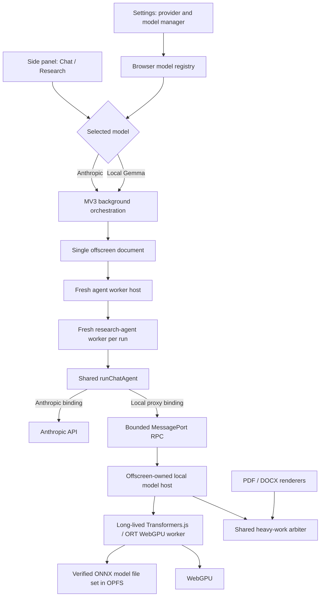

# Browser-local Gemma 4 E4B with Transformers.js implementation plan

Status: **Proposed; Transformers.js selected; implementation has not started.**

Planned against repository commit `878675a3` on 2026-08-10.

## Contents

- [1. Outcome](#1-outcome)
- [2. Current state and constraints](#2-current-state-and-constraints)
- [3. Fixed product decisions](#3-fixed-product-decisions)
- [4. Runtime and model decision](#4-runtime-and-model-decision)
- [5. Target architecture](#5-target-architecture)
- [6. Product and UI contract](#6-product-and-ui-contract)
- [7. Security, privacy, and resource boundaries](#7-security-privacy-and-resource-boundaries)
- [8. Implementation tasks](#8-implementation-tasks)
- [9. Verification matrix](#9-verification-matrix)
- [10. Delivery order and commit boundaries](#10-delivery-order-and-commit-boundaries)
- [11. Definition of done](#11-definition-of-done)
- [12. Out of scope](#12-out-of-scope)
- [13. Measurement-bound decisions and unresolved questions](#13-measurement-bound-decisions-and-unresolved-questions)

## 1. Outcome

Add **Gemma 4 E4B Instruct** as a second model option in the browser extension.
The existing Anthropic option remains supported and retains its current behavior.
After an explicit, one-time model installation, Gemma inference runs in the
extension with WebGPU; prompts, selected Atlassian context, tool messages, and
generated answers are not sent to an LLM provider.

The first releasable slice is deliberately narrow:

| Surface | Anthropic | Local Gemma 4 E4B |
| --- | --- | --- |
| Browser Chat / Quick | Supported, unchanged | **Target for this plan** |
| Browser Chat / Auto | Supported, unchanged | **Target for this plan** |
| Browser Chat / Think deeper | Supported, unchanged | **Target for this plan** |
| Browser Deep Research | Supported, unchanged | Unavailable; not silently downgraded or sent to Anthropic |
| CLI | Supported, unchanged | Out of scope |

“Local” describes the LLM boundary, not an offline clone of Atlassian. Existing
reads from the user's Atlassian tenant still use the tenant network. Model
inference itself has no provider request after the verified model file set has
been installed.

## 2. Current state and constraints

### 2.1 Active browser path

The current extension path is:

```text
ResearchScreen
  -> ChatAgentPort / ResearchPort
  -> background service worker
  -> offscreen document
  -> fresh research-agent Web Worker for one run
  -> runChatAgent(...) or runResearchAgent(...)
  -> Anthropic model binding
```

Important seams and constraints:

- `packages/research/src/chat-agent/model.ts` already defines the
  provider-neutral `ChatModelBindingV1` boundary. The local model must enter the
  shared Chat runtime through this seam, not through a second Chat workflow.
- `packages/research/src/chat-agent/runtime.ts` accepts an injected model or
  model binding and only constructs the Anthropic default when neither is
  supplied.
- `apps/extension/entrypoints/background.ts`,
  `apps/extension/utils/research/worker-protocol.ts`, and
  `apps/extension/workers/research-agent.ts` currently require an Anthropic API
  key. The browser-internal request must become a discriminated provider
  selection rather than making the key optional everywhere.
- `apps/extension/utils/research/worker-host.ts` intentionally creates and
  terminates the agent worker for every run. A multi-gigabyte model must not be
  owned by that worker.
- `apps/extension/entrypoints/offscreen/main.ts` already owns durable browser
  workers and is the correct lifecycle owner for a local inference service.
- `apps/extension/entrypoints/sidepanel/ports/research.ts` currently partitions
  conversation state with an Anthropic-specific `providerCacheIdentity`.
  Provider/model changes must never mix checkpoints or cached evidence.
- `apps/extension/utils/export-jobs/render-reservation.ts` serializes heavy
  PDF/DOCX work. Local WebGPU inference must participate in the same resource
  admission policy so model loading cannot race a memory-intensive export.
- The packed extension enforces MV3 CSP and locally packaged executable code in
  `apps/extension/wxt.config.ts` and
  `apps/extension/scripts/check-output-build.ts`. Runtime JavaScript and WASM
  must remain inside the extension package; only inert model data may be
  downloaded.

### 2.2 Why “normal Chat” still needs an executable proof

The shared Chat runtime is not a plain text-completion UI. Even Quick Chat uses
the host-controlled `eval` capability and ends at a strict structured answer
contract. The model adapter therefore has to prove all of the following:

- LangChain `BaseChatModel` message conversion and streaming;
- valid named tool calls and correctly correlated tool results;
- terminal structured answer production and repair behavior;
- cancellation, context limits, and bounded message sizes;
- citation/evidence invariants of the existing Quick Chat product.

General conversational quality or a successful “hello world” generation is
not release evidence.

## 3. Fixed product decisions

1. **Anthropic remains a first-class option.** No existing Anthropic mode,
   credential flow, or Deep Research behavior is removed or weakened.
2. **Gemma is opt-in.** Selecting, downloading, loading, or removing the model
   always requires an explicit user action.
3. **There is no silent fallback.** If local inference is unavailable or fails,
   the extension reports that failure. It never sends the request to Anthropic.
4. **V1 supports every normal Chat quality mode.** Quick, Auto, and Think
   deeper retain their existing routing, delegation, validation, and completion
   semantics. Deep Research remains unavailable for Gemma and is not silently
   reinterpreted as Chat.
5. **One shared Chat implementation.** Gemma integrates through
   `ChatModelBindingV1`; it does not get separate prompts, retrieval, tools,
   answer contracts, or persistence semantics.
6. **The host executes tools.** The model may propose tool calls, but the
   existing authorized host boundary validates and executes them. A runtime
   convenience API must not autonomously invoke extension or Atlassian tools.
7. **Executable runtime code is packaged.** Transformers.js and its resolved
   ONNX Runtime Web JS/WASM are version-pinned and pass the existing output/CSP
   audit. The model file set is treated as verified data.
8. **Provider choice is host-owned.** Provider settings stay out of the
   presenter-facing `ChatAgentPortV1`; background/offscreen orchestration binds
   the selected provider.
9. **Provider switches create a new active conversation.** Existing history is
   retained and readable, but no durable turn crosses provider/model identity.
10. **The UI is extensible, not speculative.** The selection component and
    descriptors support more providers/models later, while V1 renders only
    Anthropic and Local Gemma. There is no custom endpoint URL, OpenAI-compatible
    configuration, router, gateway, or Ollama integration in this scope.
11. **The feasibility proof is the product path.** It starts in the existing
    browser-extension Settings and Chat UI and traverses the existing presenter,
    background, offscreen, fresh agent-worker, and `runChatAgent` boundaries. A
    separate Gemma chat, demo page, alternate agent, or direct adapter harness
    cannot satisfy the GO gate.

## 4. Runtime and model decision

### 4.1 Selected model

Use the instruction-tuned **Gemma 4 E4B** ONNX export
`onnx-community/gemma-4-E4B-it-ONNX` through Transformers.js. This is the current
small Gemma 4 variant intended for browser/edge use, not the older Gemma 3 4B
model. E4B has roughly 4.5B effective parameters and 8B total parameters because
of its parameter-efficient embedding design. Product copy should say
“Gemma 4 E4B” and may explain it as the approximately 4B effective local option.

Start G0 with `dtype: "q4f16"` and `device: "webgpu"`. Treat the dtype as a
measurement-bound selection until the quality/memory proof freezes it. The
model repository contains multiple precision variants and multimodal component
files; the extension must install only the exact text-Chat file set requested by
the pinned Transformers.js pipeline/model class. It must not mirror or cache the
whole repository.

The exact model commit, selected file inventory, per-file byte lengths and
SHA-256 digests, aggregate installed size, quantization, license, and attribution
must be frozen in a checked-in manifest before production implementation.
Current quantized E4B file sets are expected to be several gigabytes; UI copy
must use the measured manifest total rather than a planning estimate.

Primary model references:

- [Gemma 4 overview](https://ai.google.dev/gemma/docs/core)
- [Gemma 4 model card](https://ai.google.dev/gemma/docs/core/model_card_4)
- [Gemma 4 E4B ONNX collection](https://huggingface.co/collections/onnx-community/gemma-4-onnx)
- [Gemma 4 E4B Transformers.js model](https://huggingface.co/onnx-community/gemma-4-E4B-it-ONNX)

### 4.2 Selected runtime

Use **`@huggingface/transformers` 4.2.x**, pinned to an exact version, with its
ONNX Runtime Web WebGPU backend. Pin the resolved `onnxruntime-web` version in
the lockfile and dependency policy as part of the same runtime revision.
Transformers.js owns processor/tokenizer loading, the Gemma 4 chat template,
generation/KV-cache handling, streaming, and WebGPU model execution; do not add
a second direct ONNX Runtime generation implementation.

- [Transformers.js releases](https://github.com/huggingface/transformers.js/releases)
- [Transformers.js pipelines and streaming](https://huggingface.co/docs/transformers.js/en/pipelines)
- [ONNX Runtime WebGPU guide](https://onnxruntime.ai/docs/tutorials/web/ep-webgpu.html)

Transformers.js 4.1 added Gemma 4 and 4.2 added `tools` support to the text
generation pipeline. Those paths are recent and remain subject to the real
extension proof. Treat model/chat-template output as untrusted: translate valid
model tool calls into LangChain `AIMessage.tool_calls`, return host-produced
`ToolMessage` values, and let the existing Chat runtime retain authorization,
budgeting, and audit ownership. Neither Transformers.js nor the model may
execute extension or Atlassian tools autonomously.

This choice also keeps the model boundary in TypeScript/JavaScript and close to
the LangChain abstractions already consumed by DeepAgentsJS. That reduces the
adapter surface compared with a native-first runtime, but it is not a direct
DeepAgentsJS integration: the repository-owned `ChatModelBindingV1` and local
`BaseChatModel` adapter remain authoritative for message conversion, streaming,
tool-call correlation, aborts, usage, and structured terminal answers.

LiteRT-LM, WebLLM/MLC, wllama/llama.cpp, MediaPipe LLM Inference, and direct ORT
generation are not compatibility targets for this implementation. If the
selected stack records NO-GO, choosing another runtime requires an explicit plan
revision; do not ship or maintain two local runtimes.

### 4.3 Required production-path vertical slice before hardening

Transformers.js v4's WebGPU backend, Gemma 4 implementation, and tool pipeline
are recent. The first work must therefore be a thin vertical slice in the
**existing production browser Chat**, not a disposable chat demo. It may
implement only the happy path for model installation and lifecycle, but every
retained seam must have its target production shape.

The proof starts when the operator selects Gemma in the existing Settings UI,
continues through the existing `ResearchScreen`, `ChatAgentPort`, background,
offscreen document, fresh per-run agent worker, local `BaseChatModel` proxy, and
shared `runChatAgent`, and ends when the existing conversation UI renders and
persists the answer. Tests may exercise individual seams directly, but direct
adapter or model-runtime calls are not product acceptance evidence.

The vertical slice is a **GO** only when a production-packed MV3 extension
proves:

- the exact pinned E4B ONNX file set is explicitly installed from the existing
  Settings UI into extension-owned storage and verified before use;
- packaged Transformers.js and ONNX Runtime Web JS/WASM pass current MV3 CSP and
  output checks;
- the runtime loads only the selected text-Chat model files and does not fetch
  unused precision variants or vision/audio weights;
- the offscreen-owned local runtime serves the fresh agent worker over the
  production-shaped bounded RPC seam;
- Quick, Auto, and Think deeper run through the existing Chat UI and shared
  `runChatAgent`, including direct and agentic trajectories;
- the adapter emits valid `eval` tool calls, consumes host tool results, and
  produces the canonical terminal Chat answer and event stream;
- streaming UI updates, cancellation, conversation persistence, and engine
  disposal work through existing controls;
- no runtime JS/WASM or model file is fetched remotely during inference and no
  prompt/context/output reaches Anthropic or a model origin;
- measured cold load, time to first token, decode rate, and peak memory are
  recorded on the named decision hardware without browser/worker crashes.

Do not implement broad lifecycle recovery, migrations, a hardware matrix, or
polished model-management UX before this GO decision. If the runtime cannot
operate through the existing offscreen/fresh-worker Chat path, or the model
cannot satisfy the real Chat tool/answer contracts, stop and record NO-GO.
Return to architecture selection with the recorded evidence; do not add a second
Chat surface, alternate Chat workflow, or two production runtimes.

## 5. Target architecture



### 5.1 Provider and capability registry

Introduce a browser-only registry. Keep secrets and endpoint data out of the
persisted generic selection.

```ts
type BrowserModelSelectionV1 =
  | {
      schema: "atlcli.browser-model-selection/v1";
      providerId: "anthropic";
      modelId: "claude-sonnet-4-6";
    }
  | {
      schema: "atlcli.browser-model-selection/v1";
      providerId: "local-gemma";
      modelId: "onnx-community/gemma-4-E4B-it-ONNX";
      modelRevision: string;
      dtype: "q4f16";
    };

interface BrowserModelDescriptorV1 {
  providerId: string;
  modelId: string;
  label: string;
  execution: "remote" | "local";
  readiness: "credential" | "installed-model";
  capabilities: {
    chatQuick: boolean;
    chatAuto: boolean;
    chatDeep: boolean;
    deepResearch: boolean;
  };
}
```

Only two descriptors are registered in V1. Future providers can add their own
configuration schema and readiness resolver without changing the selection UI,
but this plan does not define or persist arbitrary base URLs.

The initial Local Gemma descriptor sets `chatQuick`, `chatAuto`, and `chatDeep`
to `true` and `deepResearch` to `false`. These are release claims backed by the
per-mode gates in this plan, not optimistic runtime feature flags.

Credential values remain in the current trusted Anthropic credential storage.
The generic selection contains no API key. Local model metadata contains no
credential and no user-controlled executable URL.

### 5.2 Internal run binding

Replace the current credential-only browser messages with a discriminated,
internal binding:

```ts
type BrowserRunModelBindingV1 =
  | {
      kind: "anthropic";
      modelId: string;
      credentialRef: "session" | "device";
    }
  | {
      kind: "local";
      modelId: "onnx-community/gemma-4-E4B-it-ONNX";
      modelManifestDigest: string;
      dtype: "q4f16";
      device: "webgpu";
      runtimeRevision: string;
    };
```

The background resolves trusted credential or verified model-manifest state and
refuses stale or unready bindings. Raw Anthropic keys should cross only the
existing trusted internal boundary and must never be included for a local
request.

The durable provider cache identity must include at least:

```text
<provider-id>:<model-id>:<model-manifest-digest>:<runtime-revision>:<principal>
```

When the user changes selection, clear only the active conversation pointer and
start a new conversation. Do not delete historical conversations and do not
relabel earlier answers as if another model produced them.

### 5.3 Local model service

Add an offscreen-owned `LocalModelRuntimeHost`. Its public contract is stable
whether Transformers.js/ONNX Runtime Web can run in a dedicated worker or, as a
measured fallback, must temporarily be hosted directly in the offscreen
`Window` context.

Preferred placement:

```text
apps/extension/
  workers/local-model.ts
  utils/local-model/
    manifest.ts
    storage.ts
    runtime-host.ts
    rpc.ts
    messages.ts
    langchain-proxy.ts
    capability.ts
```

The agent worker receives a dedicated transferable `MessagePort` for each
generation. The protocol contains only cloneable values:

- request and stream IDs;
- normalized system/user/assistant/tool messages;
- JSON-schema/tool definitions after host projection;
- text and tool-call deltas;
- usage and timing metadata;
- cancellation and terminal success/error messages;
- explicit context, output, item-count, and byte limits.

The model service serializes generations. A terminated agent worker cancels its
generation. Unknown, late, duplicate, or oversized messages fail closed.

### 5.4 LangChain adapter

Implement one local `BaseChatModel` adapter/proxy over Transformers.js and
expose it as a `ChatModelBindingV1`. G0 freezes the text-only Transformers.js
API shape as `AutoTokenizer` plus `Gemma4ForConditionalGeneration`; this avoids
requiring Gemma's unused image/audio processor configuration while preserving
chat-template processing, streaming, tools, cancellation, and resource disposal.
Do not bypass
Transformers.js with a second direct `onnxruntime-web` generation loop.

This adapter is the only integration point exposed to the shared LangChain/
DeepAgentsJS runtime. Transformers.js owns model execution and Gemma chat-
template processing; the adapter owns repository contracts. DeepAgentsJS must
not depend on Transformers.js pipeline objects, model tensors, caches, or worker
lifecycles directly.

The binding has these initial capabilities:

- `structuredOutput: "tool"`;
- one stable model for every route;
- no provider prompt-cache claim;
- no reasoning-summary presentation grant;
- thinking disabled for the initial release;
- explicit local usage metadata with zero monetary tariff, while retaining
  token, call, time, memory, and thermal budgets.

Message conversion must cover system, human, assistant, tool-call, and tool
result messages. Project the LangChain tool schemas into the pinned Gemma 4 chat
template through the selected Transformers.js tokenizer. Tool-call IDs, names,
incremental arguments, and final arguments must survive streaming and special-
token parsing without guesswork. Unknown tool names or invalid arguments are
returned to the shared repair/error path and never executed.

Use a conservative release corridor instead of advertising the model's nominal
context limit. G0 freezes the initial maximum input, output, and retained
conversation budget that works reliably in the packed extension.

### 5.5 Model lifecycle and storage

Use OPFS (or another measured extension-owned large-object store selected by
G0) for the selected ONNX model file set; keep only the small canonical
manifest/state record in `chrome.storage.local`.

Use Transformers.js `ModelRegistry` to enumerate the exact files and available
dtypes for the pinned model revision before installation. Do not delegate the
product trust boundary to an implicit Hugging Face cache. Install the approved
file inventory through an extension-owned downloader, then configure
Transformers.js `env.fetch` (or the G0-proven equivalent) to serve only verified
local files during model loading. Remote model access is disabled for a ready
installation and throughout inference.

Model state is explicit:

```text
not-installed -> checking-space -> downloading -> verifying -> ready
ready -> loading -> running -> ready
any transient state -> error / cancelled
ready -> removing -> not-installed
```

Requirements:

- request persistent storage and preflight available quota before download;
- add `unlimitedStorage` only if the packed-browser quota proof demonstrates it
  is required, and document why the permission is needed;
- stream every selected file into staging storage without constructing a full
  model-sized `ArrayBuffer`;
- compute and compare each pinned file length and digest before activation;
- activate the complete set atomically by switching a small manifest pointer
  only after every required file verifies;
- support cancel, retry, partial-download cleanup, update, and explicit removal;
- reject missing, extra, partial, stale, mismatched, or tampered model files;
- prove the text-only load requests no unselected dtype and no unused
  vision/audio encoder weights;
- never place weights in Git, the extension package, or sync storage;
- show exact installed size and allow the user to reclaim it.

The model manifest records repository, immutable model revision, selected task/
model class, dtype, every relative path/length/digest, aggregate size, ONNX
format expectations, Transformers.js and ONNX Runtime revisions, license, and
notices. Executable Transformers.js/ORT JS and WASM remain bundled with the
extension and have their own output-build inventory. An extension update must
not silently redownload or activate a different model revision or dtype.

### 5.6 Heavy-work scheduling

Generalize the current browser render reservation into a shared heavy-work
arbiter for PDF, DOCX, and local inference.

Initial policy:

- one GPU/memory-heavy operation at a time;
- local model load and generation hold a cancellable inference lease;
- a completed generation may retain a short, measured warm lease;
- a queued export preempts only the idle warm lease, disposing the engine before
  the export starts; it never interrupts an active answer without user action;
- provider switch, explicit removal, WebGPU loss, offscreen shutdown, and idle
  expiry dispose the engine and release resources;
- acquisition timeouts and queue state are visible to the caller.

No concurrent-load optimization ships until peak-memory measurements prove it
safe on every declared supported hardware class.

## 6. Product and UI contract

### 6.1 Settings

Replace the Anthropic-only settings block with a reusable **Model provider**
selection showing exactly:

1. **Anthropic** — cloud model, existing bring-your-own-key controls.
2. **Gemma 4 E4B (local)** — WebGPU model with install/manage controls.

Provider-specific controls render below the selection:

- Anthropic: existing session/device key state, validation, and removal.
- Gemma: compatibility status, exact download/storage size, privacy boundary,
  license link, install progress, cancel/retry, ready state, and remove action.

Do not show a disabled “custom endpoint” field or accept an arbitrary URL. The
component must be registry-driven so a future provider can be added without
redesigning the page.

### 6.2 Chat and Research surfaces

- Replace the global `hasKey` gate with selected-provider readiness.
- Quick, Auto, and Think deeper are enabled only when the selected provider is
  ready and retain their existing semantics.
- With Gemma selected, Deep Research remains visible but unavailable and offers
  an explicit action to change the model selection. It must not run Anthropic
  implicitly.
- With Anthropic selected, existing mode behavior remains unchanged.
- Conversation headers/history identify the producing provider/model without
  exposing keys, model paths, tenant identifiers, or model source URLs.
- Selection changes do not alter an already running turn. The change applies to
  a newly started conversation after explicit cancellation/completion.

### 6.3 User-facing failure states

Provide actionable German and English copy for:

- WebGPU unavailable or blocked;
- insufficient estimated storage;
- unsupported device/runtime capability;
- download interrupted, corrupt model file set, or digest mismatch;
- model load failure or WebGPU device loss;
- generation cancelled, timed out, or exceeded local context;
- requested mode unavailable for the selected model;
- model update required after a runtime compatibility change.

Errors must not recommend entering an Anthropic key as an automatic recovery.
They may offer the explicit provider selector.

## 7. Security, privacy, and resource boundaries

### 7.1 Privacy contract

For a ready local model and a local Chat run:

- no prompt, page/issue content, tool result, or generated answer is sent to an
  LLM provider;
- no request is made to Anthropic or a model distribution origin during
  inference;
- existing explicitly requested Atlassian reads still reach the user's tenant;
- existing local telemetry/log redaction remains in force;
- no conversation content, tenant identifier, or raw model input is added to
  model lifecycle logs.

The initial model download is a network operation and must be described as
such. “Fully local LLM” starts after verified installation; it does not mean the
entire extension or connected Atlassian product is offline.

### 7.2 Trust boundaries

- Treat model output as untrusted data.
- Validate every tool name and argument with existing host contracts.
- Never permit runtime-controlled network fetches, dynamic imports, script
  URLs, or arbitrary model URLs.
- Restrict model downloads to the pinned repository revision and exact manifest
  file inventory.
- Verify CSP, host permissions, packaged worker/WASM inventory, and digests in
  the production build.
- Keep provider credentials out of generic model selection, conversation
  events, worker errors, logs, and model RPC.
- Recheck the active provider, model-manifest digest, runtime revision,
  principal, conversation, and abort authority when binding a run.

### 7.3 Resource and reliability contract

- Capability preflight is advisory; actual load failures remain handled.
- Enforce one generation at a time and bounded queues.
- Bound input tokens, output tokens, message count, JSON/tool argument bytes,
  and total RPC bytes before allocating GPU work.
- The local monetary tariff is zero, but call/token/time budgets remain active.
- Cancellation propagates UI -> background -> offscreen -> agent worker -> local
  runtime and ends at a terminal event.
- Offscreen recreation detects installed state, rebuilds the service, and never
  treats an unverified staging object as ready.
- A local failure cannot mutate the selected provider or retry remotely.

## 8. Implementation tasks

Parent tasks are checked only after their implementation and proof subtasks are
complete. G0 creates the thin production skeleton that later tasks harden; it
must not create a parallel Chat surface or throwaway agent path. Temporary
instrumentation that is not retained is deleted before its parent task is
checked.

### G0 — Prove Gemma through the existing browser Chat

Goal: reach the earliest trustworthy GO/NO-GO decision through the existing
packed extension and existing Chat system before investing in complete product
hardening.

#### G0a — Build the thinnest production-shaped local binding

- [x] Pin exact `@huggingface/transformers`, resolved `onnxruntime-web`, and
      Gemma 4 E4B ONNX model revisions for the proof; record the selected model
      class/task, `q4f16` file inventory, per-file length/digest, aggregate size,
      license, and notice without yet building the complete lifecycle manager.
- [x] Add `@huggingface/transformers` only to the browser-extension runtime
      dependency boundary; keep Transformers.js/ORT imports out of the shared
      provider-neutral research package and prevent Node-only entry points from
      entering the packed extension.
- [x] Use Transformers.js `ModelRegistry` to enumerate required files and assert
      that the G0 manifest selects only the required text-Chat components and
      dtype; STOP if the runtime insists on downloading the entire repository or
      unused vision/audio weights.
- [x] Add the minimal production `BrowserModelSelectionV1` descriptor and render
      Anthropic plus Gemma in the existing Settings model selector; Anthropic
      remains the migration/default selection.
- [x] Add an explicit, happy-path **Install Gemma** action to the existing
      Settings UI that streams the pinned file set into extension-owned storage,
      verifies every length/digest, atomically activates the manifest, and
      exposes only `not-installed`, `installing`, `ready`, and terminal `error`
      states for G0.
- [x] Package Transformers.js plus the resolved ONNX Runtime Web JS/WASM in the
      real WXT/MV3 build; do not add remote executable code or a separate page/
      application.
- [x] Configure Transformers.js model resolution/fetching so the engine can load
      only the verified local manifest files and cannot contact Hugging Face or
      another model host after installation.
- [x] Add the thin offscreen-owned model host, bounded `MessagePort` transport to
      the fresh per-run agent worker, local `BaseChatModel` proxy, and
      `ChatModelBindingV1` required by the existing `runChatAgent`.
- [x] Replace the API-key-only run gate just enough for the existing background
      and worker path to resolve either the Anthropic binding or a verified local
      binding; do not fork `ChatAgentPortV1` or the Chat workflow.

#### G0b — Prove Quick through the existing UI

- [ ] In the existing side-panel Chat UI, select Quick, submit a synthetic
      context-bound question, and traverse `ResearchScreen` -> `ChatAgentPort` ->
      background -> offscreen -> fresh agent worker -> shared `runChatAgent` ->
      local model RPC.
- [ ] Require the real model to issue the expected `eval` call, consume the
      host-produced tool result, produce the canonical structured Chat answer,
      and render its stream and citations in the existing conversation UI.
- [ ] Prove the completed conversation persists and reopens through the existing
      Chat history path under the local provider/model identity.
- [ ] Repeat the fixed Quick case three times with valid tool and terminal-answer
      envelopes on every run.

#### G0c — Prove Auto and Think deeper through the existing UI

- [ ] Run fixed Auto-direct and Auto-agentic cases through the existing mode
      selector and require the expected strategy decision and trajectory.
- [ ] Run fixed Think-deeper-direct and Think-deeper-agentic cases through the
      existing mode selector and require the expected strategy, delegation,
      validation/repair, synthesis, and terminal Chat events.
- [ ] Repeat each fixed trajectory three times and require valid tool, workflow,
      evidence/citation, and terminal-answer contracts on every run.
- [ ] Keep the existing Deep Research choice visibly unavailable for Gemma and
      prove it neither invokes Anthropic nor silently launches a Chat mode.

Automated proof:

- [x] `bun run check:extension-output` accepts the packed runtime artifacts and
      still rejects remote executable code.
- [x] Focused adapter fixtures reject malformed/unknown tool calls and accept
      the required `eval` plus terminal structured-answer sequence.
- [ ] A caller-path assertion proves every G0 acceptance run entered through the
      existing `ResearchScreen`/port/background path; direct runtime/adapter
      harnesses cannot emit the acceptance receipt.
- [ ] Anthropic regression fixtures prove the G0 binding changes leave existing
      Chat and Deep Research behavior unchanged.

Live proof:

- [ ] A production-packed extension installs the real E4B ONNX file set from
      existing Settings and answers the fixed Quick, Auto, and Think deeper
      cases in the existing Chat UI.
- [ ] Network observation records zero Anthropic and model-origin requests during
      local inference while allowing only expected Atlassian traffic.
- [ ] Existing Chat cancellation reaches a terminal cancelled event, stops local
      generation, and releases the model/resource lease.
- [ ] Record cold load, time to first token, decode rate, peak JS/GPU/process
      memory, and cleanup behavior on the named decision hardware; broad support
      thresholds remain G6 work.
- [ ] Write a sanitized GO/NO-GO receipt under this spec with the exact commit,
      packed extension, Chrome/OS/hardware, Transformers.js/ORT/model revisions,
      selected file manifest, test cases, network evidence, and measurements.

STOP and record NO-GO before G1–G7 if any required mode cannot reliably satisfy
the existing Chat contracts, if the production path needs a separate Chat
surface/workflow, if MV3 requires remote executable code or unsafe CSP, or if
the named decision hardware repeatedly crashes or exhausts memory.

### G1 — Harden the provider/model registry and migration

Goal: make model choice explicit without changing the presenter port or
Anthropic behavior.

Implementation:

- [ ] Add versioned browser model selection and descriptor contracts.
- [ ] Register only Anthropic and Local Gemma E4B in V1.
- [ ] Add pure readiness and mode-capability projection functions.
- [ ] Migrate an absent legacy selection to Anthropic without changing stored
      credentials or existing conversation history.
- [ ] Keep provider credentials outside the generic selection contract.
- [ ] Derive a stable provider cache identity from provider, model-manifest
      digest, runtime, and principal.
- [ ] Start a new active conversation on selection change while retaining old
      history under its original identity.
- [ ] Keep `ChatAgentPortV1` provider-neutral and add a regression test that
      rejects provider configuration on that interface.

Automated proof:

- [ ] Round-trip and reject unknown selection schema/provider/model values.
- [ ] Prove legacy users continue on Anthropic with no credential mutation.
- [ ] Prove provider switches cannot reuse checkpoints, evidence caches, or
      active-turn authority from another model identity.
- [ ] Prove Anthropic's Quick/Auto/Deep/Research capability matrix is unchanged.

### G2 — Implement verified model installation and removal

Goal: own the large inert ONNX model file set safely without expanding
executable-code trust.

Implementation:

- [ ] Add the versioned, pinned multi-file model manifest and license/notice
      metadata.
- [ ] Select OPFS or the measured alternative using the G0 evidence and record
      the decision.
- [ ] Implement quota/persistence preflight and the explicit lifecycle state
      machine.
- [ ] Stream every required file into staging storage with bounded memory and
      aggregate/per-file progress.
- [ ] Verify every exact byte length and SHA-256 before atomically activating
      the complete manifest.
- [ ] Implement abort, retry, interrupted-download cleanup, stale revision
      cleanup, explicit removal, and storage usage reporting.
- [ ] Reject corrupt, missing, extra, partial, unknown, or runtime-incompatible
      model files and unapproved dtype/model-class requests.
- [ ] Decide from evidence whether `unlimitedStorage` is required; if so, add
      the narrow permission and update permission disclosure.
- [ ] Ensure model weights, partial downloads, and device-derived artifacts are
      ignored by Git and excluded from extension packages/test snapshots.

Automated proof:

- [ ] State-machine tests cover every valid transition and reject invalid ones.
- [ ] Storage tests cover low quota, cancel, resume/retry, one-file and multi-file
      digest mismatch, incomplete manifest, atomic activation, update mismatch,
      removal, and offscreen recreation.
- [ ] Memory tests prove download and verification do not allocate a complete
      model-sized JS buffer.
- [ ] Build audit proves Transformers.js/ORT JS/WASM is packaged and ONNX model
      data is not executable or dynamically imported.

### G3 — Harden the offscreen local-model service and resource arbiter

Goal: retain correct MV3 lifecycle and avoid loading weights in the fresh agent
worker.

Implementation:

- [ ] Generalize `BrowserRenderReservationPoolV1` into a shared heavy-work
      arbiter while preserving PDF/DOCX behavior and tests.
- [ ] Add an offscreen-owned `LocalModelRuntimeHost` and preferred dedicated
      local-model worker.
- [ ] Define versioned RPC messages with request IDs, stream sequence numbers,
      byte/item limits, usage/timing, cancellation, and terminal errors.
- [ ] Add transferable `MessagePort` support to the per-run agent-worker host.
- [ ] Serialize local generations and bind every generation to the run abort
      signal and owning agent worker.
- [ ] Implement bounded warm retention, idle disposal, export preemption of an
      idle lease, provider-switch disposal, and shutdown cleanup.
- [ ] Recover predictably from worker crash, offscreen recreation, WebGPU device
      loss, duplicate/late messages, and port disconnect.
- [ ] Keep a measured fallback that locates only the engine in the offscreen
      document if Transformers.js/ORT WebGPU cannot run in a worker; keep the RPC
      contract and authorization boundary identical.

Automated proof:

- [ ] RPC tests cover streaming order, tool-call fragments, cancel races,
      timeout, oversize payloads, duplicate/late messages, and worker loss.
- [ ] Arbiter tests prove PDF, DOCX, model load, and generation obey the initial
      single-heavy-operation rule with no starvation or leaked lease.
- [ ] Lifecycle tests prove a fresh agent worker reuses the offscreen service
      without owning or leaking the model engine.

### G4 — Complete the Gemma binding for every normal Chat mode

Goal: make Quick, Auto, and Think deeper work locally through the real shared
Chat path without a provider-specific workflow.

Implementation:

- [ ] Implement the cloneable LangChain message/tool codec and local
      `BaseChatModel` proxy.
- [ ] Convert Gemma chat-template special tokens and streamed tool-call output
      into stable LangChain tool calls with exact names and arguments; assign a
      collision-free host ID when the model format does not provide one.
- [ ] Create the local `ChatModelBindingV1` with tool structured output, one
      model route, no prompt cache, and no reasoning-summary grant.
- [ ] Add provider-aware zero-dollar tariff metadata without disabling shared
      token/call/time budgets.
- [ ] Apply the measured local context/output corridor before model loading and
      fail early with an actionable error.
- [ ] Replace credential-only background/offscreen/worker messages with the
      discriminated internal run binding.
- [ ] Resolve Anthropic credentials only for Anthropic requests and verified
      model-manifest readiness only for local requests.
- [ ] Require local readiness before creating a durable turn; installation time
      does not consume a conversation run deadline.
- [ ] Preserve Quick's deterministic direct-only path.
- [ ] Preserve Auto's strategy choice between direct and agentic execution and
      prove at least one accepted trajectory of each kind.
- [ ] Preserve Think deeper's explicit strategy decision, agentic delegation
      when useful, independent validation/repair, and Chat completion horizon.
- [ ] Keep only the separate Deep Research product mode capability-disabled for
      Gemma.
- [ ] Prove no local error path invokes, selects, or recommends an automatic
      Anthropic fallback.

Automated proof:

- [ ] Codec fixtures cover system/user/assistant/tool messages, Unicode,
      streamed text, fragmented JSON, multiple tool calls, correlated results,
      malformed arguments, unknown tools, and abort.
- [ ] Contract tests run the real `runChatAgent` Quick, Auto-direct,
      Auto-agentic, Think-deeper-direct, and Think-deeper-agentic paths with the
      local binding and validate `ChatAnswerV1`/current canonical successor,
      citations, evidence refs, delegation/validation events, limits, and
      terminal events.
- [ ] Regression tests run the Anthropic binding through all existing modes.
- [ ] Privacy tests assert the local run binding contains no credential and
      cannot construct an Anthropic client.

### G5 — Implement provider-aware settings and mode UX

Goal: expose a clear additional choice while preserving the current option and
leaving room for future providers.

Implementation:

- [ ] Replace the Anthropic-only Settings section with the registry-driven model
      provider selection and conditional controls.
- [ ] Preserve all existing Anthropic key/session/device operations.
- [ ] Add Gemma compatibility, installed model size/license/privacy, install
      progress, retry/cancel, ready, update-required, and removal states.
- [ ] Replace the global API-key run gate with selected-provider readiness.
- [ ] Enable Quick, Auto, and Think deeper for a ready Gemma installation;
      retain the existing mode labels and explanations.
- [ ] Keep Deep Research visible but disabled for Gemma with an explicit
      explanation and provider-selection action.
- [ ] Show the provider/model identity on current and historical conversations.
- [ ] Prevent model selection changes from rebinding an in-flight turn.
- [ ] Add complete German and English copy, including the precise local privacy
      boundary and one-time network download.
- [ ] Do not add custom endpoint/Ollama fields, placeholder inputs, or arbitrary
      URL persistence.

Automated proof:

- [ ] Component tests cover both provider selections and every readiness/error
      state in German and English.
- [ ] Accessibility tests cover keyboard selection, focus order, progress and
      error announcements, disabled-mode explanations, and destructive removal
      confirmation.
- [ ] Regression tests prove a configured Anthropic user sees the same enabled
      modes and can run Chat and Deep Research as before.

### G6 — Add packed-extension, privacy, quality, and resilience gates

Goal: prove the feature through the production caller path rather than treating
unit/typecheck success as browser support.

Implementation and proof:

- [ ] Extend the synthetic Chat gold set with local cases for each normal Chat
      mode: attached page, attached issue, long page within the declared
      corridor, follow-up, multi-source comparison, no-evidence abstention,
      malformed tool repair, prompt injection, cancellation, and context
      overflow.
- [ ] Add deterministic Auto cases that require direct and agentic routing, and
      Think deeper cases that require an explicit strategy decision,
      delegation, independent critique/repair, and final synthesis.
- [ ] Run the same canonical per-mode answer/evidence/citation/workflow
      invariants used by existing Chat; record provider as an evaluation
      dimension without weakening thresholds for local execution.
- [ ] Add a production-packed MV3 lane for install, cold load, warm turn,
      side-panel close/reopen, offscreen recreation, cancel, corrupted model,
      low quota, WebGPU loss, provider switch, and model removal.
- [ ] Add a network privacy gate: after verified installation, a local model
      turn may make expected Atlassian requests but makes zero Anthropic or
      model-distribution requests and sends no prompt/context to another host.
- [ ] Add a fail-closed gate that blocks local execution on an unverified or
      incomplete model manifest, unsupported runtime revision, or unsupported
      required feature.
- [ ] Measure and publish the accepted hardware/browser matrix, cold/warm load,
      time to first token, decode rate, peak memory, and context corridor.
- [ ] Re-run PDF/DOCX browser memory tests with the shared arbiter and installed
      model to prove no concurrency regression.
- [ ] Run the prescribed private read-only extension E2E against real
      Confluence/Jira context; keep tenant data, traces, outputs, and identifiers
      outside Git and clean up test resources.

Required repository gates:

- [ ] `bun run test <focused test files>` for each task.
- [ ] `bun run test` (never bare `bun test`).
- [ ] `bun run typecheck`.
- [ ] `bun run build`.
- [ ] `bun run check:extension-output`.
- [ ] `bun run check:research-privacy`.
- [ ] `bun run check:chat-performance`.
- [ ] `bun run check:chat-release-candidate` with the local provider dimension.
- [ ] `bun run --cwd apps/extension test:research-extension-browser` and the
      explicit
      `bun run --cwd apps/extension test:research-extension-browser:prebuilt`
      variant required by the extension release lane.

### G7 — Documentation and release readiness

Goal: make support and limitations unambiguous before release.

Implementation:

- [ ] Update `apps/extension/README.md` for model selection, installation,
      storage, removal, privacy, supported hardware, and troubleshooting.
- [ ] Update `src/content/docs/reference/research.md` so Anthropic is no longer
      described as the only Chat prerequisite while remaining required for
      Deep Research.
- [ ] Add a browser-extension configuration reference listing provider/model
      fields, types, defaults, constraints, and migration behavior.
- [ ] Document exact download/installed size, license/notice, WebGPU/Chrome
      requirements, supported normal-Chat matrix, context corridor, and the
      difference between local LLM inference and Atlassian network access.
- [ ] Document symptom/cause/fix paths for WebGPU, quota, interrupted download,
      digest mismatch, device loss, context overflow, and model removal.
- [ ] State explicitly that Deep Research, CLI-local models, and
      custom/OpenAI-compatible endpoints are not supported by this release;
      document Quick, Auto, and Think deeper as supported Chat modes.
- [ ] Add the model/runtime/SBOM/license entries required by repository and
      extension distribution policy.
- [ ] Run `bun run docs:check` and `bun run docs:build` and review both German
      and English UI copy in the packed extension.
- [ ] Complete the final private live E2E and cleanup before any commit is
      proposed for release; never release automatically.

## 9. Verification matrix

| Layer | Required evidence | Failure meaning |
| --- | --- | --- |
| Pure contracts | Selection migration, capability matrix, cache identity, manifest validation | Provider state is not safe to persist |
| Model adapter | Real message/tool/structured-output streams through every `runChatAgent` mode | Local Chat is not compatible |
| Storage | Streamed multi-file download, quota, per-file digests, atomic manifest activation, update, removal | Model installation cannot be trusted or managed |
| RPC/lifecycle | Stream, cancel, disconnect, worker/offscreen recovery, byte limits | MV3 runtime is not durable |
| Resource | Serialized inference/export, unload, device loss, no leak | Browser stability is unproven |
| Product | Anthropic regression; Gemma Quick/Auto/Think deeper success; Deep Research boundary explicit | Additional-option contract is broken |
| Quality | Existing per-mode Chat invariants on committed synthetic cases plus private live proof | A demo response is not sufficient |
| Privacy | Zero LLM-provider/model-origin request after install; expected Atlassian traffic only | “Local LLM” claim is invalid |
| Packed MV3 | Production output/CSP/worker/WASM checks and installed-extension E2E | Dev-server success is not shippable |
| Documentation | Exact support/storage/privacy matrix and troubleshooting | Users cannot make an informed choice |

Release evidence must record the exact extension commit, Chrome version,
runtime/model revisions and digest, hardware/OS, test command, timings, memory,
network observation method, and sanitized result. Private tenant content and
identifiers never enter committed evidence.

## 10. Delivery order and commit boundaries

Continue with G1–G7 only after G0 records GO. Suggested conventional commit
sequence:

1. `feat(extension): prove local gemma through browser chat` — G0 production
   skeleton, focused tests, and GO receipt.
2. `feat(extension): harden browser model selection contracts` — G1.
3. `feat(extension): manage verified local model files` — G2.
4. `feat(extension): harden offscreen local inference` — G3.
5. `feat(research): complete local gemma chat modes` — G4.
6. `feat(extension): add local gemma provider ux` — G5.
7. `test(extension): gate local gemma release behavior` — G6.
8. `docs(extension): document local gemma chat` — G7.

Each commit boundary requires focused tests. Stage boundaries after G0, G4, and
G7 require the full workspace/typecheck/build and applicable packed-browser
gates. Follow the repository workflow for private E2E and cleanup before
committing implementation work. Do not push or release without explicit user
instruction; perform release dry-run first when release is later requested.

## 11. Definition of done

This plan is complete only when all of the following are true:

- [ ] A user can retain Anthropic or explicitly select Gemma 4 E4B locally.
- [ ] Existing Anthropic Chat and Deep Research behavior has regression proof.
- [ ] Gemma installation is explicit, resumable/retryable, digest-verified,
      version-pinned, removable, and truthfully reports storage/privacy impact.
- [ ] A production-packed MV3 extension runs the real shared Quick, Auto, and
      Think deeper Chat paths on the verified local model manifest and file set
      with valid tools, answers, citations, routing, delegation, and validation.
- [ ] The acceptance receipt proves those runs originated in the existing
      Settings and side-panel Chat UI and traversed the existing presenter,
      background, offscreen, and fresh agent-worker path.
- [ ] After installation, local inference sends no prompt/context/output to
      Anthropic or any model/provider origin.
- [ ] No local error or unsupported mode silently falls back to Anthropic or
      silently changes product semantics.
- [ ] Provider/model switching partitions durable conversations and caches.
- [ ] Local inference and PDF/DOCX work obey the proven shared resource policy.
- [ ] Supported browser/hardware/context/performance limits are based on named
      evidence and shown in docs/UI.
- [ ] Quick, Auto, and Think deeper are enabled for Gemma only after their
      individual quality/performance/resource gates pass; Deep Research remains
      visibly capability-disabled.
- [ ] Full repository, privacy, quality, build, packed-extension, and private
      live E2E gates pass with cleanup complete.

## 12. Out of scope

- Local-model support in the CLI.
- Enabling Gemma for Deep Research.
- OpenAI-compatible endpoints, custom base URLs, LLM routers/gateways, or Ollama.
- Additional local models, including a lower-memory Gemma variant.
- Multimodal input or image understanding.
- A second production browser inference runtime.
- A separate Gemma chat screen, demo application, alternate agent, or
  provider-specific Chat workflow.
- Runtime-loaded remote JavaScript/WASM, arbitrary model URLs, or automatic
  provider fallback.
- Reworking the shared Chat or Research product contracts solely to accommodate
  one provider.

## 13. Measurement-bound decisions and unresolved questions

There are no blocking product questions for starting G0. The following choices
must be resolved by its evidence rather than guessed in advance:

- exact E4B model revision, dtype, selected file inventory, per-file byte
  lengths/digests, aggregate size, and distribution origins;
- dedicated worker versus offscreen-window engine placement;
- OPFS versus a measured extension-owned large-object alternative;
- whether `unlimitedStorage` is necessary;
- supported Chrome/OS/GPU/RAM matrix;
- conservative context/output corridor and warm-engine idle duration;
- numerical cold-load, time-to-first-token, decode-rate, and peak-memory release
  thresholds for each supported hardware class.

Failure of any real shared Quick, Auto, or Think deeper tool/answer/workflow
gate is a NO-GO for this plan's release, not permission to ship a text-only or
silently weakened Gemma path. Promotion of Gemma to Deep Research requires its
own plan and quality/performance/resource evidence after the normal Chat slice
is stable.
