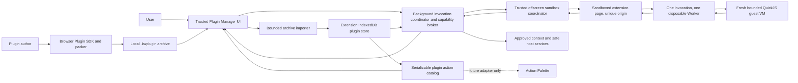

# Browser Plugin Capability MVP

Status: Proposed

Spec ID: `browser-plugin-capability-mvp`

Planned against: `0adae61967e9` (`main` baseline, 2026-08-11)

Primary host: Chrome Manifest V3 extension, minimum Chrome 140

Plan branch: `codex/browser-plugin-capability-mvp-plan`

Implementation branch (recommended): `codex/browser-plugin-capability-mvp`

Decision: **GO WITH CONSTRAINTS**

## 1. Executive summary

The extension can support user-installed TypeScript plugins without rebuilding the extension, but not as arbitrary privileged extension code.

The MVP will accept a locally selected `.kwplugin` ZIP archive containing a manifest, TypeScript source for transparency, assets, and a prebuilt self-contained JavaScript guest bundle. TypeScript compilation and packaging happen outside the extension through an author SDK/CLI. The extension validates and stores the package, presents an explicit capability review, and evaluates the bundle inside a fresh, memory-bounded QuickJS VM hosted by a disposable worker in a unique-origin sandbox page. Every useful operation crosses a small capability broker controlled by trusted extension code.

This design is intentionally narrower than the existing Node/CLI plugin API:

- plugin code never runs in the MV3 service worker, side panel, content script, or any other trusted extension realm;
- plugin code never receives `chrome.*`, Atlassian cookies, API tokens, DeepAgent credentials, raw export ports, unrestricted network access, or arbitrary filesystem-like storage;
- plugin code cannot request permissions or host access that the installed extension did not declare;
- plugin UI is declarative and host-rendered; arbitrary React components and HTML are out of scope;
- the trusted extension-page CSP remains unchanged and must continue to reject `unsafe-eval`;
- DOM automation through `chrome.userScripts` is a conditional follow-up lane, not required for the safe sandbox MVP.

The MVP is independent of the Atlassian Action Palette plan. It exposes a serializable plugin catalog and an invocation service, proves them through a **Plugin Manager** screen, and leaves a future palette adapter as a downstream consumer rather than a dependency.

## 2. Feasibility and platform decision

### 2.1 What is possible

| Requirement | MVP answer | Constraint |
|---|---|---|
| User selects a ZIP-like file with a custom extension | Yes | Local, explicit file selection only |
| Package contains TypeScript and assets | Yes | TypeScript is source material; the extension executes only the prebuilt bundle |
| Install without rebuilding the extension | Yes | The package is imported into extension-owned IndexedDB |
| Add commands/actions | Yes | Actions use a versioned manifest and a closed capability API |
| Execute custom logic | Yes | Only in an isolated sandbox worker with time and size budgets |
| Add arbitrary extension permissions | No | MV3 permissions and hosts remain fixed in the shipped manifest |
| Run code in the service worker or trusted UI | No | Violates the trust boundary and risks Chrome Web Store rejection |
| Import arbitrary npm dependencies in the browser | No | Dependencies must be bundled by the authoring tool |
| Add arbitrary React/HTML UI | No | The host renders declared inputs and structured results |
| Fetch arbitrary URLs | No | Network capability is absent in the MVP |
| Manipulate Atlassian DOM | Conditional | Research-only `chrome.userScripts` lane; requires separate opt-in and safety gate |
| Install from a remote marketplace URL | No | Deferred until policy review, signing, update, and revocation exist |

### 2.2 Why the restrictions are necessary

Manifest V3 normally requires extension logic to be packaged and reviewable. Chrome documents two relevant exceptions: code executed through the purpose-built User Scripts API, and code executed in contexts isolated from extension APIs such as sandboxed pages. Neither exception grants untrusted code extension privileges. Chrome Web Store review must still be able to understand the extension's functionality and data handling.

Therefore, this plan treats uploaded code as untrusted input. The capability broker—not TypeScript types, ZIP validation, source review, or author-supplied hashes—is the authorization boundary.

### 2.3 Product decision for the MVP

Ship **Tier 1: sandboxed action plugins** first:

1. local `.kwplugin` import;
2. manifest-declared actions;
3. explicit capability approval;
4. short-lived execution in a bounded QuickJS guest inside a sandbox worker;
5. brokered read-only context, bounded plugin storage, safe surface opening, and structured results;
6. enable, disable, inspect, test, and uninstall in Plugin Manager.

Keep **Tier 2: page DOM plugins** behind `BP-07`, a conditional research gate. If Chrome cannot reliably prevent or recover from a runaway synchronous user script, the public MVP ships without Tier 2. Sandbox plugins remain useful and complete without it.

## 3. Goals and success criteria

### 3.1 User outcomes

- A plugin author can implement an action in TypeScript, build a deterministic `.kwplugin`, and validate it locally.
- A user can import the package, understand that it is locally installed and unsigned, inspect its requested capabilities, and approve or reject them.
- An enabled plugin action can run without loading plugin code during ordinary extension startup or Atlassian page navigation.
- A plugin can read only the bounded context and storage it was granted and can return only host-rendered structured output.
- Disabling or uninstalling a plugin takes effect immediately and removes its runtime data according to the documented policy.
- A malformed or malicious archive fails closed without corrupting the plugin catalog, weakening the manifest/CSP, leaking credentials, or breaking existing export/research flows.

### 3.2 Release gates

The MVP is releasable only when all of the following are true:

- [ ] The packed extension retains the exact trusted extension-page CSP: `script-src 'self' 'wasm-unsafe-eval'; object-src 'self'`.
- [ ] The sandbox has a separate exact CSP with only the packaged script/worker/WASM allowances proven necessary; native `eval`/`Function` remain rejected everywhere and the trusted extension-page CSP is unchanged.
- [ ] No plugin source or asset is loaded at normal extension startup, content-script startup, or ordinary Atlassian navigation.
- [ ] The broker rejects every undeclared, ungranted, expired, replayed, wrong-plugin, wrong-action, and over-budget request.
- [ ] The QuickJS VM and sandbox worker are destroyed on completion, cancellation, timeout, extension reload, plugin disable, and plugin uninstall.
- [ ] Packed-Chrome tests prove the sandbox has no `chrome.*`, no DOM, no cookie access, and no successful network path.
- [ ] Archive fuzz/property fixtures cover traversal, symlinks, duplicates, case-fold collisions, malformed ZIPs, oversized entries, excessive expansion, forbidden files, and integrity mismatch.
- [ ] Existing PDF, DOCX, research, Rovo, manifest, browser-boundary, and output-scan gates remain green.
- [ ] A Chrome Web Store pre-review/support decision confirms that the exact local-install UX and sandbox design are acceptable before public Store rollout.
- [ ] Documentation accurately says that plugins are user-installed code, describes each capability, and distinguishes sandbox plugins from the conditional DOM tier.

### 3.3 Provisional budgets

Record measured results in `specs/browser-plugin-capability-mvp/EVIDENCE.md`. Change a budget only with a dated rationale and reviewer approval.

| Budget | MVP limit |
|---|---:|
| Compressed archive | 5 MiB |
| Total declared uncompressed bytes | 20 MiB |
| Archive entries | 128 |
| JavaScript entry bundle | 1 MiB |
| Individual asset | 2 MiB |
| Compression ratio per entry and aggregate | 20:1 |
| Manifest JSON | 64 KiB |
| Capability request or response | 64 KiB serialized |
| Final action result | 256 KiB serialized |
| Plugin key/value storage | 1 MiB per plugin |
| Action wall-clock timeout | 5 seconds |
| QuickJS guest memory | 32 MiB |
| QuickJS guest stack | 512 KiB |
| Broker calls | 20 per invocation |
| Concurrent invocations | 1 per plugin, 3 extension-wide |
| Imported-package validation | p95 <= 2 seconds for a 5 MiB valid package on the CI reference machine |
| Sandbox cold start | p95 <= 400 ms before plugin handler entry on the CI reference machine |
| Trusted eager bundle increase | <= 25 KiB gzip, excluding lazy Plugin Manager and sandbox assets |

## 4. Scope

### 4.1 Included

- A new browser-safe contract package that contains only data types, schemas, validators, protocol versions, capability IDs, and result types.
- An author SDK and packer that compile TypeScript outside the extension into one browser-targeted bundle and produce a deterministic `.kwplugin` archive.
- One documented sample plugin and malicious/invalid fixture packages.
- A secure local archive importer with bounded, incremental extraction.
- An IndexedDB plugin catalog, verified bundles/assets store, capability grants, bounded namespaced plugin storage, and local audit log.
- A trusted capability broker and invocation coordinator.
- A sandbox page containing a packaged dedicated-worker runner and a packaged, pinned QuickJS/WASM engine; each invocation receives a fresh bounded VM and is terminated after every invocation.
- A Plugin Manager screen in the existing registry for import, review, enable/disable, inspect, invoke a test action, and uninstall.
- Initial capabilities: `context.read.summary`, `storage.plugin`, and `surface.open`.
- Structured plugin results: `text`, `notice`, `table`, and `open-surface-request`.
- Packed MV3 E2E, security-negative, lifecycle, recovery, size, and performance tests.
- Chrome-focused documentation and a cross-browser compatibility note.

### 4.2 Explicitly deferred

- Action Palette integration. A future adapter may consume the plugin catalog, but this MVP must not import or require palette packages.
- Forge runtime, CLI execution, native host integration, and cross-device synchronization.
- Remote registry/marketplace installation, automatic update, revocation feeds, dependency resolution, and remote code download.
- Signing, publisher identities, trust stores, and organizational allowlists.
- On-device TypeScript compilation or npm installation.
- Arbitrary network access, custom host permissions, OAuth, secrets, API tokens, cookies, or authenticated Atlassian fetches.
- PDF/DOCX export invocation, DeepAgent/AI invocation, Jira/Confluence mutation, shell commands, scheduled/background work, and long-running jobs.
- Arbitrary HTML, CSS, SVG, React components, iframes, or webviews supplied by a plugin.
- `MAIN`-world execution, page-script interop, plugin-supplied WASM, dynamic `import()`, remote imports, source maps containing private source, and native modules. The only MVP WASM is the packaged, pinned QuickJS engine.
- Persistent page hooks. The conditional DOM lane, if accepted, is user-invoked and targets one exact document.

## 5. Current repository anchors

Revalidate these paths at implementation start; line numbers and APIs may drift.

| Area | Current seam | Planning implication |
|---|---|---|
| Extension manifest | `apps/extension/wxt.config.ts` | Chrome 140; exact permissions, hosts, and trusted CSP are already intentional |
| Manifest proof | `apps/extension/tests/manifest.test.ts` | Extend exact assertions; never replace them with substring checks |
| Output proof | `apps/extension/scripts/check-output-build.ts` and root `check:extension-output` | Scan emitted trusted and sandbox artifacts separately |
| Typed messages | `apps/extension/utils/messages.ts`, `router.ts`, `listeners.ts` | Extend the discriminated protocol; do not add ad-hoc runtime channels |
| Trusted background | `apps/extension/entrypoints/background.ts` | Own authorization, invocation leases, and fail-closed routing |
| Durable DOM host | `apps/extension/entrypoints/offscreen/main.ts` | May host the isolated sandbox iframe, but plugin logic must not enter export/research workers |
| Screen registry | `apps/extension/utils/screens/registry.ts`, `components/screens/index.ts` | Add Plugin Manager as a registry entry; do not special-case the shell |
| Host capabilities | `apps/extension/utils/ports/host.ts` | Add a `browser-plugin-management` capability only where the host actually supports it |
| IndexedDB patterns | `apps/extension/utils/templates/library.ts`, `utils/export-jobs/*` | Reuse injectable `IDBFactory`, migration, transaction, and `fake-indexeddb` testing patterns |
| Existing plugin API | `packages/plugin-api` | CLI/Node handlers are a different trust and lifecycle model; do not reuse them |
| Existing QuickJS patterns | `packages/research/src/agent-runtime-core.ts`, `packages/research/src/pinned-runtime-contract.test.ts` | Reuse lessons about brokered tools and independent output limits; do not couple browser plugins to research/DeepAgents |
| Browser boundaries | `apps/extension/tests/boundaries.test.ts`, root `check:browser` | Add browser-contract and SDK direction rules |

Baseline commands:

```bash
git rev-parse --short=12 HEAD
# expected plan baseline: 0adae61967e9

bun --version
# expected toolchain at planning time: 1.3.14

bun run test apps/extension/tests/manifest.test.ts
bun run typecheck
bun run check:browser
bun run build
bun run check:extension-output
```

If the baseline is not green, record the existing failure before implementation and do not attribute it to plugin work.

## 6. Architecture

### 6.1 Component view



### 6.2 Trust zones

| Zone | Trusted? | May access |
|---|---|---|
| Plugin Manager presenter | Yes | Browser plugin port only; no raw bundle evaluation |
| Background broker | Yes | Plugin store, manifest, grants, current tab/context, safe surface router |
| Offscreen coordinator | Yes | Exact invocation payloads and sandbox lifecycle; no policy decisions |
| Sandboxed page | No | Packaged runner, transferred invocation channel, worker construction |
| Plugin worker and QuickJS VM | No | Packaged runtime engine, guest bundle, frozen SDK facade, and granted broker calls only |
| Uploaded source/assets | No | Validation and storage only; never trusted because the user chose the file |
| Atlassian page | No | Existing page detection; no plugin DOM access in Tier 1 |

Rules:

1. Only the background broker decides whether a capability call is authorized.
2. The offscreen coordinator attaches plugin and invocation identity from trusted state; it never accepts those identities from plugin messages.
3. A plugin invocation receives a random single-use nonce, action ID, expiry, request sequence, byte budget, and abort signal.
4. The QuickJS guest has no `chrome`, DOM, network, filesystem, process, module loader, parent window, credentials, or host globals. Clock and randomness behavior must be explicitly pinned or replaced with documented deterministic primitives; it must not be assumed from TypeScript types.
5. A plugin result is data. It is schema-validated and rendered by trusted components without `innerHTML`.
6. Any suspension, navigation mismatch, schema error, timeout, replay, or missing state fails the invocation closed.

### 6.3 Package boundaries

#### `@atlcli/browser-plugin-contract`

Create `packages/browser-plugin-contract/` with no React, Chrome, WXT, Node, filesystem, ZIP, or host implementation dependencies.

It owns:

- `BrowserPluginManifestV1` and Zod/JSON-compatible validation;
- action, input, result, capability, error, and invocation schemas;
- protocol and package schema versions;
- stable size/identifier/semver helpers that are pure and browser-safe;
- serializable `PluginActionProjectionV1` consumed by Plugin Manager and later palette adapters.

It must not own execution, persistence, permissions, UI, or host routing.

#### `@atlcli/browser-plugin-sdk`

Create `packages/browser-plugin-sdk/` as the authoring boundary. Browser-facing exports provide `defineBrowserPlugin()` and typed capability/result helpers. Node/Bun-only exports provide validation and packaging commands.

The packer must:

- compile with a fixed QuickJS-compatible guest target into one self-contained script accepted by the pinned runtime contract;
- reject external, remote, dynamic, Node built-in, WASM, and unresolved imports;
- normalize path separators, timestamps, entry ordering, JSON formatting, and permissions ordering;
- calculate SHA-256 for runtime files and assets;
- include author-selected `src/`, `README.md`, and safe assets for review, but exclude secrets and environment files;
- emit the same bytes for the same inputs/toolchain;
- produce an SBOM-like package inventory in `manifest.json`;
- run the same manifest and limit validators used by the extension importer.

The extension never invokes this compiler. Authors run it locally or in CI.

#### Extension plugin host

Create `apps/extension/utils/plugins/` with modules for:

- importer and archive reader adapter;
- catalog/store/migrations;
- grants and consent decisions;
- broker policy;
- invocation leases, budgets, cancellation, and audit;
- structured result validation;
- host port exposed to Plugin Manager.

Keep all Chrome API calls in the imperative host modules. Pure authorization and transition logic must be unit-testable without Chrome.

### 6.4 `.kwplugin` package contract

The file is an ordinary ZIP with a product-specific extension. Proposed v1 layout:

```text
example.kwplugin
├── manifest.json
├── dist/
│   └── plugin.js
├── src/
│   └── index.ts
├── assets/
│   └── icon.png
└── README.md
```

Required manifest fields:

```json
{
  "schemaVersion": 1,
  "id": "com.example.page-inspector",
  "name": "Page Inspector",
  "version": "1.0.0",
  "description": "Returns a safe summary of the current Atlassian context.",
  "sdkRange": "^1.0.0",
  "runtime": "quickjs-sandbox-worker-v1",
  "entry": "dist/plugin.js",
  "matches": ["https://*.atlassian.net/*"],
  "capabilities": ["context.read.summary", "storage.plugin"],
  "actions": [
    {
      "id": "summarize-context",
      "title": "Inspect current context",
      "description": "Show the page type and title available to the plugin.",
      "keywords": ["context", "inspect"]
    }
  ],
  "files": [
    { "path": "dist/plugin.js", "sha256": "...", "bytes": 1234 },
    { "path": "assets/icon.png", "sha256": "...", "bytes": 456 }
  ]
}
```

Contract rules:

- IDs use reverse-DNS syntax; action IDs are unique within a plugin.
- Versions are valid SemVer; `sdkRange` must intersect an extension-supported range.
- `entry` is exactly one declared `.js` file below `dist/`.
- `matches` is an optional restriction within the extension's already-declared Atlassian hosts, never an expansion.
- Only manifest-declared capabilities can appear in the consent screen or invocation lease.
- `files` covers every runtime-loaded file. Source and README inventory is recorded separately and never executed.
- SHA-256 detects corruption and supports deterministic comparison; it does **not** establish author identity or make an unsigned package trustworthy.
- v1 assets are PNG, JPEG, or WebP only. SVG, HTML, CSS, fonts, audio, video, WASM, source maps, and nested archives are rejected.
- Absolute paths, `..`, dotfiles outside an explicit allowlist, symlinks, hard links, duplicate normalized names, case-fold collisions, and encrypted entries are rejected.

### 6.5 Capability model

Initial grants are deliberately small:

| Capability | Plugin operation | Trusted enforcement |
|---|---|---|
| `context.read.summary` | Read current site origin, product (`jira`/`confluence`), entity type/ID, sanitized title, and canonical page URL | Background derives from current tab/page state; no body, ADF, comments, user, cookies, tokens, or raw HTML |
| `storage.plugin` | Get/set/delete JSON values | Key and quota are namespaced by plugin ID; schema, byte, key-count, and operation-rate limits apply |
| `surface.open` | Request a known extension surface | Closed enum such as `settings`, `plugin-manager`, or `sidebar`; no arbitrary URL or screen ID |

Capability invariants:

- Install consent stores requested capabilities; enable consent stores approved capabilities. Updating to a version with new capabilities disables the plugin pending review.
- Broker policy intersects: contract-known capabilities, manifest request, user grant, action allowance, current host support, current context, and invocation budget.
- Capability grants are data records, not methods injected by the plugin.
- There is no wildcard capability and no generic `action.invoke`, `fetch`, `sendMessage`, `chrome`, or `eval` capability.
- Every call emits a redacted audit event containing plugin/action/version, capability, outcome, reason code, duration, and byte counts—never returned context or storage values.

### 6.6 Invocation protocol

1. Plugin Manager requests `invoke(pluginId, actionId, expectedVersion)` through a browser-plugin port.
2. Background reloads the installed manifest and grants, checks enabled state and exact current context, and creates a five-second invocation lease.
3. Background ensures the existing offscreen document is available and sends a typed invocation message containing verified bundle bytes/hash and trusted lease metadata.
4. The offscreen coordinator creates or resets the sandbox iframe and transfers a fresh `MessagePort` before untrusted code starts.
5. The sandbox page starts a packaged dedicated worker. The worker creates a fresh QuickJS VM, applies hard memory/stack/interrupt limits, evaluates the verified guest bundle, and exposes only a minimal frozen SDK facade through explicit host callbacks.
6. A plugin capability request contains only operation, arguments, and monotonically increasing request number. Trusted layers add identity and lease data.
7. Background re-authorizes every request and returns a bounded structured response.
8. The final result is independently byte-bounded and schema-validated by the host, then QuickJS handles/VM/worker/channel/iframe state are destroyed, the lease is revoked, and Plugin Manager renders the result.
9. Timeout, cancellation, plugin disable/uninstall, extension update, offscreen loss, or protocol error performs the same cleanup and returns a stable reason code.

Do not rely on a hidden token exposed to plugin code. Use transferred message channels and trusted channel-to-lease binding. Do not rely on the interpreter's formatted-result limit alone; the host must bound every packet and final value before serialization/persistence. The sandbox spike must prove that the packaged QuickJS/WASM engine can start, interrupt, dispose, and recover inside the worker under the sandbox CSP without changing `extension_pages` CSP.

### 6.7 Persistence and lifecycle

Use a dedicated database, proposed `atlcli-browser-plugins-v1`, rather than adding plugin objects to export/template databases.

Stores:

- `plugins`: verified manifest, version, state, install/update timestamps, archive digest, compatibility state;
- `bundles`: verified entry bytes and runtime hash;
- `assets`: validated asset bytes and metadata;
- `grants`: approved capability IDs and consent version;
- `plugin-data`: namespaced bounded JSON records;
- `audit`: bounded redacted ring buffer;
- `migrations`: schema migration receipts.

Lifecycle rules:

- Import is transactional: validate everything first, then commit all records or none.
- A same-ID/same-version/same-digest re-import is idempotent.
- A changed digest under the same ID/version is rejected as a version collision.
- An update preserves plugin data but disables the plugin if capabilities or compatibility changed.
- Disable revokes new invocations and cancels active invocations; it retains package and plugin data.
- Uninstall revokes leases first, then deletes bundle, assets, manifest, grants, and plugin data in one recoverable transaction; audit keeps only a redacted tombstone.
- Extension update revalidates installed packages and marks incompatible entries disabled. Sandbox packages do not need `userScripts` re-registration.
- Quota or migration failure leaves the last valid catalog usable and surfaces a recovery action.

### 6.8 Plugin Manager UX

Add a utility screen through the existing screen registry. It is available only when the host advertises `browser-plugin-management`; Forge and test hosts that do not implement it show or hide it according to registry policy.

Primary states:

1. **Empty:** explain local plugins, code risk, and the difference between `.kwplugin` and ordinary archives; offer **Import plugin**.
2. **Validation:** show filename and bounded progress; never execute code while inspecting.
3. **Review:** show unsigned/local origin, author-supplied metadata, package digest, version, actions, requested capabilities, match patterns, size, and warnings. The only import outcome is **Import disabled**; no code runs.
4. **Installed list:** show enabled/disabled, compatibility, version, capabilities, last invocation result, and local/unsigned badge.
5. **Details:** show inventory and hashes, grant decisions, audit outcomes, **Run test action**, **Disable/Enable**, and **Uninstall**. Enabling an unsigned plugin is a separate deliberate confirmation with **Cancel** focused initially.
6. **Update review:** show manifest/capability diff; never silently widen grants.
7. **Failure:** stable reason code plus safe remediation; retain the previously working version after failed update.

Keyboard, accessibility, and safety requirements:

- Every row and dialog is fully keyboard-operable with visible focus and restored focus after close.
- File input is labeled and constrained with `accept=".kwplugin,application/zip"`, while importer validates magic bytes rather than trusting MIME/extension.
- Capability copy describes concrete data, not internal permission names alone.
- Destructive uninstall requires confirmation that names the plugin and states that local plugin data will be removed.
- Result rendering supports text, notices, and tables only; strings remain text nodes.
- No plugin-supplied image is shown before validation; decoded dimensions and byte budgets are enforced.

### 6.9 Conditional DOM tier (`chrome.userScripts`)

Chrome's `userScripts` API is the documented MV3 mechanism for arbitrary user-provided page scripts. Chrome 140 requires the user to enable **Allow User Scripts** for the extension. If implemented after the gate:

- add the exact `userScripts` manifest permission and update manifest tests;
- use on-demand `chrome.userScripts.execute()` against one exact tab and, where available, document ID;
- use `USER_SCRIPT`, never `MAIN`;
- use a distinct `worldId` per plugin;
- keep messaging disabled unless the action requires the broker, then use only `runtime.onUserScriptMessage`/`onUserScriptConnect` and validate sender tab, document, frame, and origin;
- require a separate high-risk grant such as `page.dom.read` or `page.dom.write` and show the Chrome toggle requirement;
- do not register persistent scripts or inject at navigation/startup in the MVP;
- re-check API availability on every invocation and fail with actionable UX when the toggle is off.

Isolation of JavaScript worlds does not prevent a user script from reading or changing the page DOM, and an injected synchronous infinite loop may block the target tab before the extension can cancel it. `BP-07` must demonstrate an acceptable termination/recovery boundary. If it cannot, DOM plugins remain research-only and are excluded from the public MVP.

## 7. Security and privacy threat model

### 7.1 Primary threats

- ZIP bombs, malformed archives, traversal, symlinks, duplicate/case-conflicting paths, and parser differentials.
- Code execution escaping into trusted extension pages or obtaining extension APIs.
- Forged plugin/action identity, replayed capability calls, confused-deputy routing, and stale grants after update.
- Data exfiltration through network, open URLs, images, errors, logs, timing, or oversized results.
- Credential/session leakage from current tabs, export/research ports, storage, or runtime messages.
- Denial of service through infinite loops, memory growth, decompression, message floods, IndexedDB quota, or concurrent invocations.
- UI spoofing through author metadata, Unicode controls, long strings, images, or HTML-like result content.
- Supply-chain ambiguity: an unsigned local package can claim any author/publisher name.
- Chrome Web Store rejection because behavior is not discernible or the sandbox becomes a general remote-code bridge.

### 7.2 Mandatory controls

- Parse central-directory metadata and enforce declared limits before extraction; enforce streaming output budgets during extraction as well.
- Use one reviewed archive implementation behind an adapter. Record version, license, browser bundle cost, known advisories, and adversarial-test results.
- Normalize and validate every path before allocation or persistence.
- Hash runtime bytes after extraction and before every invocation; fail closed on mismatch.
- Keep the trusted CSP exact; sandbox-specific CSP must include `default-src 'none'`, `connect-src 'none'`, no `allow-same-origin`, and only the minimum packaged worker/WASM allowances proven necessary. Do not add a Blob/data worker path unless BP-00 separately proves and approves it.
- Do not expose `fetch`, `XMLHttpRequest`, `WebSocket`, `EventSource`, `sendBeacon`, `importScripts`, `chrome`, DOM, or parent-window handles to the plugin facade. Packed tests must prove network requests fail, not merely omit the API from TypeScript types.
- Authorize capabilities in the background from persisted trusted state on every request.
- Bind a lease to exact plugin/action/version/channel and revoke it on any mismatch.
- Apply request count, byte, storage, concurrency, and wall-clock budgets; destroy the worker on timeout.
- Sanitize and truncate all author metadata before display/logging; reject bidi control characters in identifiers and names.
- Never log page context values, plugin storage values, bundle source, credentials, or result bodies.
- Keep plugins disabled after import when policy, compatibility, or requested capabilities are not accepted.
- Provide immediate disable/uninstall and make their semantics testable under an active invocation.

### 7.3 Security claims the MVP must not make

- An unsigned plugin is not verified, trusted, reviewed, or attributable merely because it has hashes.
- TypeScript types do not sandbox JavaScript.
- A `USER_SCRIPT` world does not isolate the Atlassian DOM.
- A timeout promise does not terminate synchronous code; QuickJS interrupt plus destruction of the VM/worker is the Tier 1 termination boundary and must be proven in packed Chrome.
- Static scanning cannot prove arbitrary code benign.
- Local import does not automatically guarantee Chrome Web Store approval.

## 8. Implementation task graph

```text
BP-00 platform and policy spikes
  ├── BP-01 browser plugin contracts
  ├── BP-02 author SDK and deterministic packer
  └── BP-03 bounded archive importer
BP-01 + BP-03 ── BP-04 catalog, grants, and storage
BP-01 + BP-04 ── BP-05 sandbox runtime and capability broker
BP-04 + BP-05 ── BP-06 Plugin Manager UX
BP-00 + BP-05 ── BP-07 conditional DOM runtime decision
BP-02 + BP-03 + BP-05 + BP-06 ── BP-08 packed security and performance proof
BP-08 ── BP-09 documentation, Store review, and release evidence
```

### BP-00 — Prove the MV3 execution and policy boundary

Dependencies: none

Suggested commit: `docs(extension): record browser plugin runtime spike`

- [ ] Revalidate official Chrome MV3 remote-code, sandbox, User Scripts, permissions, storage, and Chrome Web Store policies; record access date and exact conclusions in `specs/browser-plugin-capability-mvp/SPIKE.md`.
- [ ] Create a throwaway packed-extension spike proving WXT emits a manifest-declared sandbox page with a sandbox-only CSP while the trusted `extension_pages` CSP remains byte-for-byte unchanged.
- [ ] Prove the sandbox page has a unique origin, no `chrome.runtime`, no parent DOM access, and cannot access extension IndexedDB/cookies.
- [ ] Compare the repository's existing QuickJS integration with maintained browser-capable QuickJS/WASM distributions; pin one packaged engine only after license, provenance, browser bundle, API stability, memory/stack/interrupt, async-host-call, disposal, and Store-review evaluation.
- [ ] Prove the sandbox can create the packaged dedicated worker, exchange messages through a transferred channel, run a fresh QuickJS VM with memory/stack/interrupt limits, and terminate an infinite loop without trusting a promise timeout.
- [ ] Prove `fetch`, XHR, WebSocket, EventSource, beacon, and `importScripts` cannot produce an outbound request from the sandbox/worker under the emitted CSP. Observe network events in Playwright rather than relying only on JavaScript errors.
- [ ] Prove the existing offscreen document can coordinate a sandbox iframe without disrupting PDF/DOCX export, research workers, durable jobs, or offscreen recovery.
- [ ] Prove the host applies independent request/final-result byte limits because interpreter result-formatting limits are not an authorization or memory boundary.
- [ ] Measure QuickJS/worker cold start, teardown, guest and host memory recovery, and 100 sequential invocations; capture evidence.
- [ ] Verify `chrome.userScripts` availability behavior on Chrome 140 with **Allow User Scripts** off/on, exact-document `execute()`, `USER_SCRIPT` world, `worldId`, and dedicated sender metadata.
- [ ] Attempt a synchronous runaway user script and document whether the tab can be bounded or recovered. Do not claim cancellation if only the awaiting extension promise times out.
- [ ] Submit the precise local-package/sandbox design for Chrome Web Store pre-review or support guidance; store the correspondence reference without private customer data.
- [ ] Delete all spike runtime code after extracting evidence. No prototype evaluator may remain reachable in production.

Proof commands:

```bash
bun run --cwd apps/extension build
bun run --cwd apps/extension test:plugins-spike-extension-browser:prebuilt
bun run test apps/extension/tests/manifest.test.ts
bun run check:extension-output
```

Acceptance:

- [ ] `SPIKE.md` records PASS/FAIL for each hypothesis with packed-build evidence.
- [ ] Tier 1 is GO only if worker termination and network denial are proven without widening trusted CSP.
- [ ] Tier 2 is GO only if its explicit risk and recovery boundary are accepted; otherwise it is marked deferred without blocking Tier 1.

STOP:

- Stop Tier 1 if it requires `unsafe-eval` in `extension_pages`, same-origin sandboxing, plugin code in a trusted realm, or a general interpreter in the service worker/offscreen parent.
- Stop public rollout if Chrome Web Store guidance rejects or cannot evaluate the design; an explicitly enterprise/private distribution decision requires a separate spec.

### BP-01 — Define neutral browser plugin contracts

Dependencies: BP-00 Tier 1 GO

Suggested commit: `feat(plugin): add browser plugin contracts`

- [ ] Create `packages/browser-plugin-contract/package.json`, strict TypeScript config, browser-safe exports, and README.
- [ ] Define v1 manifest, action projection, capabilities, structured inputs/results, invocation protocol, audit reason codes, and compatibility errors.
- [ ] Implement pure validators for IDs, SemVer/ranges, paths, manifest size/count limits, match-pattern narrowing, metadata length/Unicode policy, and result sizes.
- [ ] Define a closed capability registry with human-facing description keys and risk levels.
- [ ] Define protocol negotiation: reject unsupported major versions; allow only documented compatible minor versions.
- [ ] Add serialization roundtrip, exhaustive-union, boundary, negative, and mutation tests.
- [ ] Add package-boundary tests proving the contract has no Node, Chrome, WXT, React, extension, CLI plugin API, or dynamic-code imports.
- [ ] Export types explicitly from package index files.

Proof commands:

```bash
bun run test packages/browser-plugin-contract
bun run typecheck
bun run check:browser
```

Acceptance:

- [ ] A JSON manifest and structured result can be validated in Bun and a browser with identical outcomes.
- [ ] Unknown fields that affect execution/capabilities are rejected rather than ignored.
- [ ] `packages/plugin-api` and the new browser contract have no imports in either direction.

### BP-02 — Build the author SDK, packer, and sample plugin

Dependencies: BP-00 Tier 1 GO, BP-01

Suggested commit: `feat(plugin): add browser plugin SDK and packer`

- [ ] Create `packages/browser-plugin-sdk` with browser-safe author exports and a separate Bun/Node packaging export.
- [ ] Implement `defineBrowserPlugin()` and the frozen runtime facade types without ambient `chrome`, DOM, Node, or network APIs.
- [ ] Implement a deterministic build command, proposed `bun run browser-plugin:pack -- <dir>`, using a pinned bundler configuration.
- [ ] Reject external/unresolved/dynamic/remote/Node/WASM imports and multiple entry chunks.
- [ ] Generate normalized manifest inventory and SHA-256 values; never include `.env*`, credentials, VCS data, build caches, or undeclared files.
- [ ] Create `examples/browser-plugins/context-inspector/` with TypeScript source, README, safe PNG icon, tests, and expected manifest.
- [ ] Add deterministic snapshot test: two clean builds produce byte-identical `.kwplugin` files.
- [ ] Add malicious authoring fixtures for remote import, Node built-in, dynamic import, WASM, oversized bundle, secret file, invalid asset, and non-deterministic metadata.
- [ ] Document that source inclusion aids inspection but the compiled bundle is authoritative at runtime.

Proof commands:

```bash
bun run test packages/browser-plugin-sdk
bun run browser-plugin:pack -- examples/browser-plugins/context-inspector
bun run browser-plugin:verify -- examples/browser-plugins/context-inspector/dist/context-inspector.kwplugin
git diff --exit-code -- examples/browser-plugins/context-inspector/expected
```

Acceptance:

- [ ] A clean checkout can build and verify the sample with documented commands.
- [ ] The packer reports stable machine-readable reason codes for every rejected fixture.
- [ ] The generated JavaScript has no external imports, source maps, WASM, or remote URL dependencies.

### BP-03 — Implement bounded archive import

Dependencies: BP-00 Tier 1 GO, BP-01

Suggested commit: `feat(extension): add secure browser plugin importer`

- [ ] Evaluate browser ZIP readers against central-directory inspection, streaming budgets, bundle cost, license, maintenance, and known advisories; record the selected adapter and version.
- [ ] Implement magic-byte/ZIP-structure validation independent of filename and MIME type.
- [ ] Inspect metadata before inflation; enforce compressed size, declared expanded size, entry count, path, type, encryption, and ratio limits.
- [ ] Enforce actual output budgets while streaming extraction so lying metadata cannot bypass limits.
- [ ] Normalize paths once and reject traversal, absolute paths, empty names, NUL/control characters, symlinks/hard links, nested archives, duplicates, and case-fold collisions.
- [ ] Parse `manifest.json` only after its own strict byte limit; validate it with BP-01 schemas.
- [ ] Extract only declared runtime files/assets; inventory source/README without executing or rendering them.
- [ ] Decode image headers/dimensions under budget and reject active/unsupported media.
- [ ] Verify lengths and SHA-256 before creating an install candidate.
- [ ] Return a pure `VerifiedPluginCandidateV1`; perform no IndexedDB writes and no evaluation during validation.
- [ ] Add generated/property/fuzz regression fixtures and ensure every rejection cleans partial buffers/references.

Proof commands:

```bash
bun run test apps/extension/tests/plugins/importer.test.ts
bun run test apps/extension/tests/plugins/archive-adversarial.test.ts
bun run test apps/extension/tests/plugins/archive-fuzz.test.ts
bun run typecheck:extension
```

Acceptance:

- [ ] Invalid packages produce no persistent rows and no executable side effects.
- [ ] Peak memory and validation duration remain within the recorded budget corpus.
- [ ] Each OWASP-style archive case has a named regression fixture and stable reason code.

### BP-04 — Add catalog, grants, storage, and lifecycle

Dependencies: BP-01, BP-03

Suggested commit: `feat(extension): persist browser plugins and grants`

- [ ] Implement the dedicated IndexedDB schema with injectable `IDBFactory`, synchronous upgrade callbacks, migration receipts, and close/error handling.
- [ ] Commit verified candidates transactionally across manifest, bundle, assets, and initial disabled state. Import never enables unsigned code.
- [ ] Implement idempotent import, version collision, compatible update, capability-diff review, rollback-on-failure, disable, enable, and uninstall transitions.
- [ ] Implement per-plugin JSON storage with key, value, total-byte, key-count, and operation-rate budgets.
- [ ] Implement a bounded redacted audit ring and tombstones without values or source.
- [ ] Expose a pure, serializable catalog projection; never expose bundle/source bytes to presenters or future palette consumers.
- [ ] On extension update, revalidate compatibility and fail incompatible plugins disabled.
- [ ] Add concurrent transaction, quota, aborted migration, corrupt row, active-invocation uninstall, and recovery tests using `fake-indexeddb`.
- [ ] Add a cleanup proof that uninstall removes every plugin-owned record and revokes active leases before deletion.

Proof commands:

```bash
bun run test apps/extension/tests/plugins/store.test.ts
bun run test apps/extension/tests/plugins/migration.test.ts
bun run test apps/extension/tests/plugins/lifecycle.test.ts
bun run typecheck:extension
```

Acceptance:

- [ ] Catalog reads never return a half-installed or half-updated plugin.
- [ ] New capabilities never inherit old consent.
- [ ] Disable/uninstall immediately prevents new calls and deterministically cancels active calls.

### BP-05 — Implement the sandbox runtime and capability broker

Dependencies: BP-01, BP-04

Suggested commit: `feat(extension): run plugins through capability sandbox`

- [ ] Add the manifest-declared sandbox entrypoint, packaged worker, packaged/pinned QuickJS/WASM engine, and sandbox-specific CSP proven by BP-00.
- [ ] Add a small isolated plugin coordinator module to the existing offscreen host; do not mix plugin execution with PDF, DOCX, research, or durable-job workers.
- [ ] Implement one-invocation/one-worker/one-VM construction, transferred message channel, verified guest-bundle handoff, QuickJS handle/VM/runtime disposal, worker termination, and cleanup.
- [ ] Extend `utils/messages.ts`, router, and listeners with discriminated plugin messages; reject unknown protocol messages.
- [ ] Implement background-owned leases with cryptographic nonce, plugin/action/version/channel binding, monotonic request numbers, expiry, abort, and replay protection.
- [ ] Implement the closed capability broker for `context.read.summary`, `storage.plugin`, and `surface.open`.
- [ ] Re-resolve the current tab/context for relevant calls; do not trust plugin-provided URLs, IDs, origins, or host kinds.
- [ ] Validate every request, response, and final result against BP-01 schemas and byte budgets.
- [ ] Apply QuickJS memory, stack, and interrupt limits plus host-owned concurrency, call count, storage operation, packet, log, result, and wall-clock budgets with stable reason codes.
- [ ] Destroy runtime resources on every terminal path and on offscreen/background reconnect.
- [ ] Add negative tests for forged identity, wrong channel, stale version, revoked grant, replay, sequence gap, oversize, unknown operation, navigation change, timeout, and service-worker restart.
- [ ] Add boundary tests proving no plugin bundle is imported by trusted modules or emitted into normal content scripts.

Proof commands:

```bash
bun run test apps/extension/tests/plugins/broker.test.ts
bun run test apps/extension/tests/plugins/invocation.test.ts
bun run test apps/extension/tests/plugins/runtime-boundaries.test.ts
bun run --cwd apps/extension build
bun run check:extension-output
```

Acceptance:

- [ ] The sample action runs only with an enabled plugin and exact grants.
- [ ] Malicious fixtures cannot observe credentials, Chrome APIs, DOM, parent state, or a successful network request.
- [ ] Infinite-loop, guest-memory, guest-stack, oversized-final-expression, and host-message fixtures are bounded; a subsequent valid action succeeds.

### BP-06 — Add Plugin Manager and host port

Dependencies: BP-04, BP-05

Suggested commit: `feat(extension): add browser plugin manager`

- [ ] Define a narrow `BrowserPluginManagementPort`; presenters receive catalog/actions/results, never raw Chrome or bundle access.
- [ ] Add `browser-plugin-management` to `HostCapability` and implement it only in the extension host.
- [ ] Register `PluginManagerScreen` in the existing utility navigation without shell branching.
- [ ] Add i18n keys for English and German labels, capabilities, warnings, reason codes, confirmation, empty, loading, and recovery states.
- [ ] Implement local file selection, validation progress, consent review, import-disabled, list, detail, separate enable confirmation, audit outcomes, test invocation, update diff, disable/enable, and uninstall.
- [ ] Render author metadata under length/Unicode constraints and all result strings as text.
- [ ] Make every workflow keyboard accessible with correct dialog semantics, focus trapping/restoration, live regions, and visible focus.
- [ ] Add presenter/component tests for every state, denied capability, incompatible package, failed update, unavailable runtime, timeout, and active uninstall.
- [ ] Add screen-registry and host-portability tests proving Forge/test hosts do not accidentally advertise the capability.

Proof commands:

```bash
bun run test apps/extension/tests/plugins/plugin-manager.test.tsx
bun run test apps/extension/tests/screens/registry.test.ts
bun run test apps/extension/tests/app-portability.test.tsx
bun run typecheck:extension
```

Acceptance:

- [ ] A keyboard-only user can import, review, enable, run, disable, and uninstall the sample plugin.
- [ ] No author-controlled string is interpreted as markup or used as an unvalidated URL.
- [ ] Plugin Manager works without Action Palette code or state.

### BP-07 — Decide the optional `chrome.userScripts` DOM tier

Dependencies: BP-00, BP-05

Suggested commit if GO: `feat(extension): add opt-in DOM plugin runtime`

- [ ] Write an explicit decision record from BP-00 evidence: public MVP, experimental-only, or deferred.
- [ ] If deferred, document why, keep `userScripts` out of the production manifest, and close this task with no runtime code.
- [ ] If GO, add the exact `userScripts` permission and exact manifest/output tests; do not add broader hosts.
- [ ] Add onboarding and availability detection for Chrome 140 **Allow User Scripts**.
- [ ] Execute only on explicit user invocation, top frame, exact active tab/document, matching Atlassian origin, and `USER_SCRIPT` world.
- [ ] Allocate a distinct `worldId`, keep `MAIN` forbidden, and use dedicated user-script message listeners.
- [ ] Bind and validate sender tab ID, document ID, frame ID, origin, plugin/action/version, channel, and lease for every message.
- [ ] Add separate `page.dom.read` and `page.dom.write` consent with high-risk wording and update re-consent.
- [ ] Add hostile-page, navigation-race, iframe, toggle-revoked, update-clears-registration, forged-message, DOM mutation, CSP, and runaway-script tests.
- [ ] Ensure Tier 1 plugins still work when `userScripts` is missing or disabled.

Proof commands if GO:

```bash
bun run test apps/extension/tests/plugins/user-scripts.test.ts
bun run --cwd apps/extension test:plugins-extension-browser
bun run test apps/extension/tests/manifest.test.ts
bun run check:extension-output
```

Acceptance if GO:

- [ ] No code executes in `MAIN` or on a non-matching/stale document.
- [ ] Disabled API/toggle produces actionable UX and no partial invocation.
- [ ] The accepted risk and recovery behavior for synchronous runaway code are documented and verified.

STOP:

- If runaway DOM code cannot be acceptably bounded, do not disguise a promise timeout as termination. Defer Tier 2.
- If the feature requires persistent injection, broad hosts, ordinary content-script channels, or page-owned identity, create a new spec.

### BP-08 — Prove the packed extension, security, and performance

Dependencies: BP-02, BP-03, BP-05, BP-06; BP-07 only if GO

Suggested commit: `test(extension): prove browser plugin capability MVP`

- [ ] Add `test:plugins-extension-browser` and `:prebuilt` scripts following existing packed-extension lanes.
- [ ] Load the emitted extension into Chrome 140 and run the complete local sample install/invoke/uninstall flow.
- [ ] Inspect emitted manifest: exact trusted CSP, sandbox entry/CSP, permissions, hosts, resources, and no unexpected content script.
- [ ] Run malicious packages covering network, Chrome API, DOM, parent access, storage escape, forged broker call, infinite loop, QuickJS memory/stack pressure, oversized final expression, message flood, and result spoofing.
- [ ] Observe Chrome requests and prove zero plugin-originated network success.
- [ ] Prove no plugin code/assets load on cold extension startup or ordinary Jira/Confluence navigation.
- [ ] Exercise export, preview, durable jobs, research, Chat, and Rovo before and after 100 plugin invocations; compare failures and memory.
- [ ] Measure all Section 3.3 budgets and record machine/browser/build metadata.
- [ ] Run a live smoke test on a disposable Atlassian Cloud page using the approved test profile; read only bounded context, create no customer-derived fixture, and clean up any created test resource.
- [ ] Add CI jobs for contract/importer unit tests, packed plugin E2E, manifest/output policy, and artifact retention on failure.
- [ ] Record commands, commit, archive hashes, screenshots, traces, measurements, and cleanup receipt in `EVIDENCE.md`.

Proof commands:

```bash
bun run test packages/browser-plugin-contract packages/browser-plugin-sdk apps/extension/tests/plugins
bun run typecheck
bun run check:browser
bun run build
bun run check:extension-output
bun run --cwd apps/extension test:plugins-extension-browser:prebuilt
bun run --cwd apps/extension test:worker-extension-browser:prebuilt
bun run --cwd apps/extension test:jobs-extension-browser:prebuilt
bun run --cwd apps/extension test:research-extension-browser:prebuilt
bun run --cwd apps/extension test:rovo-extension-browser:prebuilt
```

Acceptance:

- [ ] Every security claim has a negative packed-browser test or is removed from product copy.
- [ ] Existing extension capability lanes remain green with no widened permission/host/CSP boundary beyond an accepted Tier 2 decision.
- [ ] Budgets pass or the MVP remains unreleased with a named remediation task.

### BP-09 — Document, review, and prepare release evidence

Dependencies: BP-08

Suggested commit: `docs: document local browser plugins`

- [ ] Add `src/content/docs/reference/browser-plugins.md` using the repository documentation template, with minimal and advanced examples, capability reference, limits, troubleshooting, and related topics.
- [ ] Add the author SDK README and package-format reference with schema/version compatibility policy.
- [ ] Add a security page explaining local/unsigned code, data boundaries, consent, sandbox limitations, disable/uninstall, audit data, and Tier 2 status.
- [ ] Add Plugin Manager screenshots/captions and Chrome 140 toggle instructions only if BP-07 is GO.
- [ ] Document a manual package inspection/verification command and how to report a malicious package.
- [ ] Update privacy disclosures and Chrome Web Store review notes with the exact executed-code sources and brokered data.
- [ ] Obtain security review and Chrome Web Store policy review; resolve every P0/P1 before release.
- [ ] Run a cold reviewer pass against this plan, `EVIDENCE.md`, emitted artifacts, and user docs.
- [ ] Perform a release dry-run only; never publish automatically.

Proof commands:

```bash
bun run docs:check
bun run docs:build
bun run test
bun run typecheck
bun run build
bun run check:browser
bun run check:extension-output
bun scripts/release.ts patch --dry-run
```

Acceptance:

- [ ] A new author can build the sample and a new user can install it from clean-checkout documentation alone.
- [ ] Store/privacy/security descriptions match packed behavior and do not call unsigned packages trusted.
- [ ] Release evidence includes successful cleanup and no customer/plugin source or identifiers.

## 9. Test matrix

| Layer | Positive proof | Negative proof |
|---|---|---|
| Contract | Valid manifest/action/result roundtrip | Unknown capability/version/field, bad ID/path/match, oversized metadata |
| Packer | Deterministic self-contained sample | Remote/dynamic/Node/WASM import, secret file, external chunk, oversized bundle |
| Importer | Valid bounded archive candidate | Bomb, traversal, symlink, duplicate, collision, encrypted/nested ZIP, bad hash/image |
| Store | Transactional install/update/disable/uninstall | Quota, migration abort, corrupt row, version collision, concurrent operations |
| Broker | Exact enabled/granted invocation | Forgery, replay, stale grant/version, navigation change, byte/call/time overrun |
| Sandbox | Structured result from sample | Chrome/DOM/parent/network access, infinite loop, allocation/message flood |
| UI | Keyboard install/review/run/uninstall | Denied grant, incompatible version, failed update, timeout, spoofed metadata/result |
| Packed MV3 | Real `.kwplugin` end to end | Emitted CSP/permission/resource drift and malicious fixtures |
| Regression | Existing extension lanes | Plugin runtime must not alter export/research/job/Rovo behavior |
| Optional DOM | Exact user-invoked `USER_SCRIPT` document | Toggle off, stale document, iframe, MAIN world, forged sender, runaway code |

## 10. Observability and evidence

`EVIDENCE.md` must contain:

- baseline and final commit IDs, clean/dirty status, Bun/WXT/Chrome/OS versions;
- selected ZIP library/version/license/advisory check and why it met bounded extraction requirements;
- manifest/CSP/resource excerpts from the emitted packed extension;
- package/archive digests and deterministic-build receipt for non-sensitive fixtures;
- unit, type, build, boundary, output, packed E2E, and regression command results;
- redacted network observation proving no plugin-originated success;
- worker termination and post-timeout recovery receipt;
- performance and memory table against Section 3.3;
- Store/security review references and their decision;
- live test resource identifiers only in a local ignored receipt, plus cleanup confirmation;
- known limitations and the final BP-07 decision.

Local audit records visible to the user must remain bounded and redacted. CI traces may contain only repository fixtures, never third-party plugin source or customer Atlassian data.

## 11. Cross-browser and future integration notes

- Chrome 140 is the MVP acceptance browser because it is already the extension's tested minimum.
- Edge supports MV3 `userScripts`, but it requires a separate packed acceptance lane before claiming support.
- Firefox has a related `userScripts` API and different optional-permission UX; do not claim package/runtime parity without a Firefox-specific host adapter and E2E.
- A future Action Palette adapter should depend only on `PluginActionProjectionV1` plus an invocation port. The plugin host must not depend on palette UI packages.
- A future Forge adapter cannot execute MV3 sandbox/userScripts code. It may consume declarative metadata or call an independently reviewed remote execution service only under a separate architecture/security spec.
- A future marketplace requires signing, publisher identity, review, transparency, revocation, update atomicity, and Store-policy approval. It is not a URL added to this importer.
- A future AI/export capability must add purpose-specific request/preview/confirmation/result contracts; never expose raw DeepAgent or exporter objects.

## 12. STOP conditions and change control

Stop implementation and request an architecture/security decision when any of the following occurs:

- The solution requires plugin code, `eval`, or dynamic import in a trusted extension page/service worker/content script.
- The trusted `extension_pages` CSP must gain `unsafe-eval`, remote script sources, or a broader object source.
- The sandbox requires `allow-same-origin`, extension APIs, authenticated network, or direct access to trusted storage.
- Archive limits cannot be enforced before and during decompression.
- A capability needs raw `fetch`, runtime messaging, Chrome APIs, credentials, cookies, arbitrary URLs, or a wildcard host operation.
- The extension must declare a new host/permission not explicitly accepted in this plan (except the conditional, separately approved `userScripts` permission).
- Tier 1 cannot forcibly terminate synchronous plugin code and recover the next invocation.
- The offscreen sandbox coordinator destabilizes export/research/job lifecycle or cannot be isolated.
- The implementation makes Action Palette, Forge, CLI plugin handlers, AI, or export code a prerequisite.
- Plugin-supplied UI requires arbitrary HTML/React/CSS/SVG in trusted surfaces.
- Chrome Web Store review rejects the model or cannot discern its full functionality.
- Repository anchors, WXT output, Chrome policy, or `userScripts` behavior materially drift from BP-00 evidence.
- Tests use bare `bun test`, skip the packed build, or call a source-only test proof sufficient for MV3 behavior.

Any scope expansion requires an amendment that updates threat model, capability registry, consent copy, tests, budgets, Store review, and evidence—not only a new TypeScript interface.

## 13. Definition of done

The Browser Plugin Capability MVP is done only when:

- [ ] BP-00 through BP-06 and BP-08 through BP-09 are complete; BP-07 has a documented GO/deferred decision.
- [ ] A clean checkout builds a deterministic sample `.kwplugin` and imports it into the packed Chrome extension.
- [ ] The sample runs through the sandbox broker and produces a safe structured result.
- [ ] Malicious archive/runtime fixtures fail closed and the infinite loop is forcibly terminated.
- [ ] Capabilities, grants, updates, disable, uninstall, storage cleanup, and audit behavior match the contracts.
- [ ] The trusted manifest/CSP/host boundary remains exact and all existing extension lanes pass.
- [ ] Performance, memory, and eager-bundle budgets pass with recorded evidence.
- [ ] Chrome Web Store, security, privacy, accessibility, and cold-review gates are complete.
- [ ] Documentation is sufficient for a new author and user without tribal knowledge.
- [ ] No deferred marketplace, DOM, Forge, palette, AI, export, network, or privileged-runtime feature is presented as implemented.

## 14. Unresolved decisions

These do not block writing the plan; they must be resolved at the named gate.

1. **Package/product name:** adopt `.kwplugin` and `@atlcli/browser-plugin-*`, or align both with the final Kiteweave product name? Resolve before BP-01 freezes public identifiers. Recommendation: reserve `.kwplugin` for the product and keep package names technical until the branding decision.
2. **DOM tier:** include `chrome.userScripts` in the public MVP or keep it experimental? Resolve in BP-07 from termination and Store evidence. Recommendation: ship sandbox-only first.
3. **Distribution:** Chrome Web Store, enterprise/private, or both? Resolve before BP-09. Recommendation: obtain Store guidance for the exact local-import model before promising public availability.
4. **SDK distribution:** publish the author SDK immediately or keep it repository-local during the MVP? Recommendation: repository-local preview until contract, signing, and compatibility policies stabilize.
5. **Plugin review responsibility:** what user/org policy is required for unsigned code? Recommendation: local user consent in MVP; organizational allowlists/signing require a separate follow-up.

## 15. Official references

- [Manifest V3 overview and remotely hosted code](https://developer.chrome.com/docs/extensions/develop/migrate/what-is-mv3)
- [Chrome Web Store: Additional Requirements for Manifest V3](https://developer.chrome.com/docs/webstore/program-policies/mv3-requirements)
- [Chrome User Scripts API](https://developer.chrome.com/docs/extensions/reference/api/userScripts)
- [Chrome sandbox manifest key](https://developer.chrome.com/docs/extensions/reference/manifest/sandbox)
- [Chrome extension permissions](https://developer.chrome.com/docs/extensions/develop/concepts/declare-permissions)
- [Chrome extension storage and IndexedDB](https://developer.chrome.com/docs/extensions/develop/concepts/storage-and-cookies)
- [Firefox `userScripts` API](https://developer.mozilla.org/en-US/docs/Mozilla/Add-ons/WebExtensions/API/userScripts)
- [Microsoft Edge extension API support](https://learn.microsoft.com/en-us/microsoft-edge/extensions/developer-guide/api-support)
