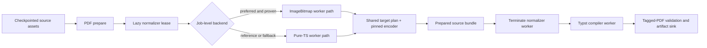

# Browser raster normalizer productization

- Status: Phases 0-3 passed; automated Phase 4 browser/RSS matrix passed;
  branded-Chrome UI gate and Phase 5 rollout remain
- Scope baseline: `0b101e56` (`perf(pdf): add browser raster normalizer ratchet`)
- Evidence: `specs/issue-118-adaptive-browser-pdf-memory/RATCHET.md`
- Productive evidence: `specs/browser-raster-normalizer-productization/RATCHET.md`
- Parent work: [Issue #118](https://github.com/BjoernSchotte/atlcli/issues/118)
- Draft implementation PR: [#201](https://github.com/BjoernSchotte/atlcli/pull/201)

## Decision summary

Only two raster-normalizer paths remain active:

1. **Target-sized `createImageBitmap` in a disposable module worker** is the
   performance candidate. It may become the extension default for eligible
   `standard` and `print` assets only after the quality, determinism, current-
   browser, cancellation, and native-memory gates below all pass.
2. **The existing pinned pure-TypeScript normalizer in the same disposable
   worker architecture** is the canonical reference and fallback. It must be
   byte-identical to the current panel-main implementation. This path can ship
   independently when it proves UI responsiveness and memory non-regression.

Pica and WebCodecs are closed product paths:

- no production adapter, fallback, feature flag, user setting, rollout, or
  recurring CI lane is built for either;
- no Pica or WebCodecs import may enter a productive extension entrypoint;
- their dated benchmark implementation in PR #201 is evidence only. Once the
  measurement receipt is accepted, a productization change may remove those
  executable lanes and the Pica dev dependency rather than maintain them.

The backend is an internal implementation detail. Users continue to choose
`original`, `standard`, `print`, or an explicit PPI; they do not choose a
decoder library.

## Implementation checkpoint

The productive pure worker, conservative ImageBitmap eligibility classifier,
target-sized ImageBitmap backend, typed whole-prepare fallback, neutral quality
corpus, and paired RSS ratchet are implemented on PR #201. macOS arm64 and
required Linux x64 passed repo-pinned Chromium 140 and official Chrome for
Testing Stable 152.0.7977.64. The exact quality digests matched across all four
cells; current-Stable Linux measured 114.40 MiB versus 207.09 MiB normalizer RSS
delta for ImageBitmap versus pure worker, while pinned Linux remained inside
the non-regression gate at 147.31 MiB versus 143.66 MiB.

ImageBitmap is not yet the production default. Phase 4 still requires the
explicit current branded-Chrome unpacked-extension UI run. Phase 5 then changes
the single extension host constant, proves the packed durable-job matrix, and
reruns the final exact-SHA checks before the plan is complete.

## Evidence carried forward

The full ratchet used a deterministic 100.29 MiB corpus with 76 unique assets
and 190 placements through the real unpacked MV3 extension, IndexedDB,
serializer, Typst worker, validator, and tagged-PDF output.

| Path | Prepare | Normalizer RSS delta | RSS after cleanup | Bundle | Whole-Chrome peak |
|---|---:|---:|---:|---:|---:|
| current pure TS, panel main | 39.09 s | +226.05 MiB | baseline/noise | 16.65 MiB | 1617.14 MiB |
| ImageBitmap worker | 13.52 s | +191.83 MiB | +5.72 MiB | 17.21 MiB | 1633.67 MiB |
| Pica worker, closed | 18.89 s | +217.05 MiB | +11.93 MiB | 19.05 MiB | 1643.28 MiB |
| WebCodecs worker, closed | 12.05 s | +672.37 MiB | +405.06 MiB | 14.81 MiB | 2024.92 MiB |

Pure TS, ImageBitmap, and Pica overlap in the observed RSS noise band.
ImageBitmap therefore earned a responsiveness and lifecycle PoC with memory
non-regression; it did not prove another material memory reduction.

The explicit image profile remains the primary memory lever: `standard`
already reduced the image-heavy Typst worker peak by about 75 percent. This
plan must not describe the normalizer backend as replacing that product lever.

## Goals

1. Keep `original` byte-for-byte on the existing no-normalization path.
2. Remove long pure-TS image decode and resize work from the host main event
   loop. Productive durable jobs currently prepare in the offscreen document;
   the benchmark page models the equivalent browser-hosted prepare boundary.
3. Prove whether target-sized ImageBitmap can preserve the existing image
   profile's quality and determinism contracts.
4. Create and destroy at most one raster worker per active prepare attempt,
   before Typst compilation begins.
5. Preserve the shared target planner and pinned PNG/JPEG encoder so only
   decode and resize execution vary.
6. Retain a deterministic, host-neutral pure-TS fallback that requires no
   browser-native decode API.
7. Keep durable retries, cancellation, progress, diagnostics, privacy, and
   PDF accessibility unchanged.
8. Make rollback a host-factory choice with no durable request migration.

## Non-goals

- further evaluation or adoption of Pica, WebCodecs, wasm-vips, jSquash, or a
  Canvas output encoder;
- silently changing `original`, `standard`, `print`, or custom-PPI semantics;
- adding a user-visible "fast decoder" preference;
- raising asset, spool, output, pixel, or render-reservation limits;
- parallel raster decoding;
- retaining a normalizer worker through Typst compilation;
- changing PDF layout, tags, outline, language, links, or alt text;
- normalizing GIF, SVG, animation, unknown color spaces, or unsupported
  raster variants merely because a browser happens to decode them;
- weakening deterministic export guarantees without a separate product
  decision;
- committing customer media, customer PDFs, tenant URLs, account identifiers,
  or customer-derived measurement fixtures.

## Required invariants

### Output and compatibility

- `original` never creates the raster worker.
- Missing host wiring keeps the current pure-TS behavior.
- `planRasterNormalizationV1` remains the sole target-geometry authority.
- `encodeRasterTargetV1` remains the sole output encoder for both active paths.
- JPEG remains JPEG; transparent PNG remains lossless PNG; nothing upscales.
- Assets outside the explicitly proven eligibility matrix remain unchanged.
- A ready-to-render durable checkpoint never invokes normalization again.
- The pure-worker output asset digest equals the current panel-main pure-TS
  digest for every existing and new fixture.

### Ownership and lifecycle

- PDF preparation continues to serialize normalization with its existing
  single-heavy-work limiter.
- At most one normalizer worker and one large decoded/target raster exist per
  prepare attempt.
- The normalizer worker is terminated and its target proven gone before the
  Typst worker reads the bundle.
- Success, kept assets, decode failure, worker error, cancellation, timeout,
  and prepare failure all run the same idempotent release path.
- Versioned worker messages are bounded and reject unknown fields and stale
  request identifiers.
- Bitmap, canvas, ImageData, source copies, response buffers, listeners, and
  pending promises are released explicitly.
- The V1 port remains non-detaching. The first production version copies bytes
  before transfer so an ImageBitmap failure can safely fall back. Any future
  owned-transfer port requires separate attribution and mutation-isolation
  tests.

### Determinism

- A backend is selected once per prepare attempt, not independently for each
  asset.
- Two runs on the same browser build produce identical output-asset digests.
- The existing cross-host deterministic image-profile contract remains a hard
  gate. If ImageBitmap digests differ across the supported Chrome matrix,
  ImageBitmap does not become the default; the pure worker ships alone.
- A failed ImageBitmap attempt never leaves a mixed ImageBitmap/pure bundle.
  The host may retry the complete prepare once with the pure worker, using the
  checkpointed source assets.
- The selected backend and implementation revision are recorded only as
  bounded, body-free evidence; they never enter page content or filenames.

### Security and privacy

- The worker is a statically bundled MV3 module worker created from a build-
  resolved URL. No Blob worker, remote script, dynamic evaluation, nested
  worker, or widened CSP is introduced.
- Worker diagnostics contain only variant, phase, aggregate byte/pixel counts,
  bounded error codes, and timings. They contain no media bytes, filenames,
  page titles, tenant URLs, or source identifiers.
- The existing resolver, origin policy, asset budget, MIME/magic validation,
  checkpoint integrity, and output validation remain before/after the port.
- Synthetic fixtures are the only committed quality and memory corpus.

## Target architecture



The production worker is separate from
`apps/extension/tests/pdf/memory/normalizer-worker.ts`. Benchmark probes,
Pica, WebCodecs, forced-GC holds, and measurement-only messages do not enter
the product bundle.

## Contract changes

### 1. Thread the existing host port through the real job path

Add an optional `rasterNormalizer` to `PreparePdfExportEnv` and forward it in
`preparePdfExport` to `preparePdfDocument`. Existing Node, CLI, preview,
template-authoring, and test callers omit it and therefore remain on the
current pure implementation.

The extension's productive job executor supplies the port only for a
non-`original` request and only when no ready-to-render checkpoint exists.

Acceptance:

- an omitted port is byte-identical to the current path;
- recovered checkpoints create no worker;
- API reports and closure classifications explicitly include the new optional
  reachability;
- no extension-specific type enters `@atlcli/pdf` or `@atlcli/export-media`.

### 2. Add an attempt-scoped lease to the shared job executor

Define a small host-neutral lease owned by `createPdfExportJobExecutor`:

- a `RasterNormalizerPortV1` for the prepare call;
- an idempotent asynchronous `release` operation;
- bounded backend/revision evidence for aggregate telemetry.

The extension supplies a lazy lease factory. The shared executor acquires it
immediately before preparation, releases it in `finally` immediately after
preparation, and never persists the live port or worker handle.

Acceptance:

- release occurs once after success, failure, abort, and pure fallback;
- a compile-only retry from a checkpoint never acquires the lease;
- normalizer release completes before `renderPreparedPdfExport` invokes Typst;
- a release failure is contained and cannot replace the primary export error.

### 3. Create one production worker protocol

Add a versioned protocol and extension-owned adapter under productive
`apps/extension` paths. Required operations:

- initialize and return capability/backend revision;
- normalize one serialized request at a time;
- return normalized bytes or a closed kept/error result;
- cancel one in-flight request;
- shut down and settle every pending promise.

The adapter performs header-only planning before lazy worker creation.
No-op, vector, unsupported, and no-downscale assets therefore return without
starting a worker.

Acceptance:

- malformed, duplicate, late, and unknown messages fail closed;
- output bytes transfer back without an extra response copy;
- source bytes remain valid in the caller after success and failure in V1;
- the worker bundle contains no Pica, WebCodecs, Node, Bun, Forge, network, or
  extension-permission dependency.

## Work packages

### Phase 0 — freeze scope and closed-lane boundaries

1. Keep the dated four-lane measurements in `RATCHET.md` and PR #201.
2. Add a productive-boundary test that rejects Pica and WebCodecs imports
   outside the dated benchmark directory.
3. Do not add their lanes to required CI or renovate/dependency work.
4. When the measurement receipt no longer needs executable reproduction,
   remove the Pica dev dependency and closed worker branches rather than
   upgrading them.

Gate: the productization diff has exactly two backend identifiers:
`image-bitmap` and `pure-ts`.

### Phase 1 — lifecycle seam with no behavior change

1. Thread the port through `PreparePdfExportEnv` and `preparePdfExport`.
2. Add the attempt-scoped lease factory to the shared PDF job executor.
3. Add success/failure/abort/recovery lifecycle tests using a fake lease.
4. Leave the extension factory absent, so all production exports still use
   panel-main pure TS.

Gate: full suite, build, typecheck, API reports, and existing PDF goldens pass
byte-identically.

### Phase 2 — pure-TypeScript worker first

1. Implement the production protocol with only `pure-ts` enabled.
2. Execute `normalizeRasterAssetV1` inside the disposable worker.
3. Serialize requests through one queue and transfer normalized response bytes.
4. Add a host-event-loop heartbeat probe to the productive offscreen prepare
   target so responsiveness is measured rather than inferred.
5. Wire the lease for explicit `standard`/`print`/PPI requests behind an
   internal host switch; `original` still bypasses it.
6. Prove complete-prepare retry and cleanup after worker termination.

Hard gates:

- exact output-asset digest parity with current panel-main pure TS;
- median prepare wall time no worse than 1.15 times current pure TS;
- normalizer RSS and whole-Chrome peak no worse than 1.15 times current;
- productive host heartbeat p95 below 50 ms while normalization runs;
- worker target gone before Typst;
- two consecutive runs produce identical assets and tagged PDFs.

If these pass, the pure worker may ship even if ImageBitmap later fails.

### Phase 3 — ImageBitmap eligibility and quality

1. Add a shared, allocation-bounded eligibility classifier. Start
   conservatively with raster shapes already faithfully handled by the
   deterministic reference:
   - supported 8-bit, non-interlaced PNG color types;
   - supported sequential RGB/grayscale JPEG shapes;
   - no animation;
   - EXIF orientation absent or equal to 1 until a shared orientation policy
     is implemented;
   - no unproven CMYK, wide-gamut, or embedded-profile transformation.
2. For an eligible asset, call target-sized `createImageBitmap` with explicit
   orientation, premultiplication, resize-quality, and color-conversion
   options.
3. Draw once into target-sized `OffscreenCanvas`, extract one RGBA target,
   close the bitmap, shrink/release canvas backing, and invoke the pinned
   encoder.
4. On capability-probe failure select pure TS before the first asset.
5. On a typed native-path failure abort the ImageBitmap prepare, release the
   worker, and retry the complete prepare once using the pure worker. Never
   mix backends within one prepared bundle.

Quality corpus:

- baseline and sequential JPEG subsampling variants;
- grayscale and RGB JPEG;
- EXIF orientations 1, 3, 6, and 8;
- PNG RGB, RGBA, grayscale, grayscale-alpha, palette, and tRNS;
- sharp text, line art, gradients, photographs, transparent edges, and
  high-frequency noise;
- progressive JPEG, 16-bit/interlaced PNG, CMYK/profiled files, GIF, SVG, and
  malformed controls that must remain unchanged.

Hard gates:

- planned and decoded display geometry agree exactly;
- no orientation change, crop, blank output, alpha halo, or transparency loss;
- every unsupported control is kept byte-for-byte;
- reviewed contact sheets pass at 100 and 400 percent zoom;
- automated pixel/color thresholds are pinned only after the neutral corpus
  establishes realistic baselines, then guarded against regression;
- aggregate normalized bundle stays at or below 1.10 times pure-worker bytes,
  with every larger outlier named by neutral fixture ID;
- two-run digest stability passes on every browser/platform cell.

### Phase 4 — deterministic browser and memory ratchet

Measure the productive adapter, not only the test app:

- repo-pinned Chromium 140 on macOS arm64, preserving the existing baseline;
- current Chrome for Testing stable on macOS arm64;
- pinned and current Chrome for Testing on Linux x64 in GitHub CI;
- one release-gate run in current branded Chrome using a normal unpacked
  extension UI load, because branded Chrome ignores command-line loading.

Add a `pure-worker` lane and a productive `image-bitmap` lane. Whole process-
tree RSS remains mandatory; V8 heap alone is not an acceptance signal.

ImageBitmap hard gates relative to pure worker on the same host/run:

- median prepare time at most 0.60 times pure worker;
- normalizer peak RSS at most 1.15 times pure worker;
- post-termination RSS within 32 MiB of the pre-normalizer baseline;
- Typst peak and whole-Chrome peak at most 1.10 times pure worker;
- candidate worker target gone before Typst starts;
- stable output digest across two runs in every matrix cell;
- tagged PDF, complete asset inventory, and unchanged report semantics.

Decision:

- if every hard gate passes, enable ImageBitmap only for the proven eligibility
  set and retain pure worker as fallback;
- if any quality, determinism, lifecycle, or native-memory hard gate fails,
  close ImageBitmap and ship only the pure worker. Do not substitute another
  library within this plan.

### Phase 5 — packed-extension rollout

1. Prove the real WXT production build emits a static module worker and the
   normative CSP remains byte-identical.
2. Run the packed durable PDF job, preview, cancellation, resume, and worker-
   crash tests.
3. First enable pure worker for non-original profiles.
4. Enable ImageBitmap only after Phase 4 GO, initially behind one extension
   host constant with an immediate pure-worker rollback.
5. Remove the switch after one release only if evidence remains green.
6. Update extension export-performance documentation and the issue ratchet
   with exact runtime versions and receipts.

No durable request schema change is needed: the image profile remains the
product contract and a prepared checkpoint already owns the normalized bytes.

## Acceptance matrix

| Concern | Pure worker | ImageBitmap worker |
|---|---|---|
| Current output bytes | exact parity required | different filter allowed only after deterministic matrix GO |
| Host responsiveness | heartbeat p95 < 50 ms | heartbeat p95 < 50 ms |
| Prepare speed | <= 1.15x current pure | <= 0.60x pure worker |
| Native memory | <= 1.15x current pure | <= 1.15x pure worker |
| Cleanup residual | <= 32 MiB | <= 32 MiB |
| Unsupported assets | unchanged | unchanged or whole-attempt pure fallback |
| Cancellation | terminate and settle | close native handles, terminate and settle |
| Retry | exact pure replay | whole-attempt pure retry, never mixed |
| Browser matrix | pinned and current | pinned and current plus digest gate |
| Product fallback | panel-main pure as emergency | pure worker |

## Test plan

### Unit

- eligibility classifier and format controls;
- protocol parsing and stale/duplicate IDs;
- adapter queue, cancellation, timeout, worker error, and idempotent release;
- lease acquisition/release around prepare and checkpoint recovery;
- job-wide backend selection and one bounded pure retry;
- no-worker behavior for `original` and no-op assets;
- pure-worker byte parity;
- EXIF, alpha, geometry, color, and unsupported-source controls.

### Integration

- `preparePdfExport` forwards the port without changing omitted-port output;
- durable asset checkpoints can serve one complete pure retry;
- worker release precedes Typst reservation/compile;
- report notes and asset counts are backend-independent;
- current bundle/result fingerprints remain stable for pure worker.

### Packed MV3

- emitted worker URL exists and loads under the normative CSP;
- no remote/blob/nested worker or widened permissions;
- packed durable job succeeds, cancels, resumes, and recovers from one worker
  failure;
- service-worker/offscreen shutdown leaves no normalizer target;
- output validates as tagged and PDF.js opens it.

### Performance and quality

- deterministic neutral corpus only;
- two-run per-cell digest comparison;
- whole-process RSS at 25 ms sampling;
- forced-GC phase samples as supporting evidence;
- productive offscreen-host heartbeat during prepare;
- reviewed contact sheets and pinned automated quality thresholds.

## Expected implementation files

Shared contracts and lifecycle:

- `packages/pdf/src/run-export.ts`
- `packages/pdf/src/run-export.test.ts`
- `packages/export-wiring/src/jobs/pdf-job-executor.ts`
- `packages/export-wiring/src/jobs/pdf-job-executor.test.ts`

Extension host:

- a new productive raster worker under `apps/extension/workers/`;
- a versioned protocol and adapter under `apps/extension/utils/pdf/`;
- `apps/extension/utils/export-jobs/pdf-executor.ts` for the lease factory;
- packed-extension and memory tests under `apps/extension/tests/pdf/`.

Quality primitives may extend `@atlcli/export-media` only when they are shared,
pure, allocation-bounded inspection/planning rules. Browser API calls remain
inside the extension host.

## Verification commands

Run all commands from the repository root:

```bash
bun run test packages/export-media/src/codec.test.ts packages/pdf/src/prepare.test.ts
bun run test packages/pdf/src/run-export.test.ts packages/export-wiring/src/jobs/pdf-job-executor.test.ts
bun run typecheck
bun run build
bun run --cwd apps/extension test:jobs-extension-browser
bun run --cwd apps/extension test:worker-extension-browser
bun run bench:memory-chrome
bun run test
```

The focused productive raster test and Chrome matrix commands must be added
with their implementation; they must not reuse the four-lane benchmark worker
as the production proof.

## Commit sequence

1. `refactor(pdf): thread raster normalizer lease through prepare`
2. `feat(extension): run pure raster normalization in a worker`
3. `test(extension): pin raster quality and browser matrix`
4. `feat(extension): add gated ImageBitmap raster backend`
5. `test(extension): ratchet productive raster memory and cleanup`
6. `docs(extension): record raster backend decision and rollback`

Each commit runs its focused tests. Before push, run typecheck, build, packed
MV3 evidence, the relevant memory/quality ratchet, and the complete root test
suite. Live Confluence E2E uses only the existing DOCSY/ATLCLI fixtures and
must clean any resources it creates.

## Rollback

The rollback is to stop supplying the ImageBitmap factory and retain the pure
worker. If worker construction itself regresses, omit the worker lease and the
existing panel-main pure implementation remains the emergency path.

Rollback changes no durable request, checkpoint schema, image-profile value,
or output sink. A ready-to-render checkpoint continues with its already
prepared bytes.

## Unresolved questions

None before implementation. ImageBitmap default eligibility is deliberately
an evidence result, not an unresolved design choice: failure of any hard gate
selects the pure worker and closes the native path.
