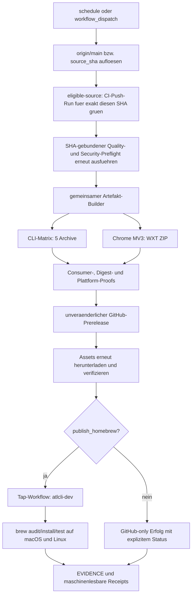

# Dev-Release-Channel: Nightly und manuell ausloesbare, bewiesene Releases

**Status:** In Umsetzung; DR-00 bis DR-05 und DR-08/DR-09 bewiesen; Live-Abnahme fuer DR-06/DR-07/DR-10 offen

**Planungsstand:** 2026-08-12

**Planungs-Baseline:** `e03755e758b5d83cd5f3c6227060fba247f89e29`

**Task-Praefix:** `DR`

**Zielverzeichnis fuer Belege:** `specs/dev-release-channel/evidence/`

> Dieser Plan ist absichtlich beweisorientiert. Kein Task und kein Done-Kriterium
> wird allein aufgrund eines erfolgreichen Producer-Builds abgehakt. Entscheidend
> sind die spaeter erneut heruntergeladenen und als Consumer getesteten Bytes.

## 1. Ziel und nachweisbares Ergebnis

Am Ende existiert neben dem stabilen Release-Kanal ein oeffentlicher
`dev`-Kanal mit folgenden Eigenschaften:

- derselbe GitHub-Actions-Workflow laeuft jede Nacht und bei Bedarf ueber
  `workflow_dispatch` manuell;
- jeder Lauf baut von einem explizit validierten Commit aus `main` und erzeugt
  einen unveraenderlichen GitHub-Prerelease;
- der konkrete Source-SHA besitzt einen abgeschlossenen, erfolgreichen
  kanonischen `CI`-Push-Run auf `main`; ein roter, abgebrochener, uebersprungener,
  fehlender oder noch laufender Required-Status kann niemals publiziert werden;
- der Prerelease enthaelt alle fuenf CLI-Archive, die gepackte Chrome-MV3-
  Browser-Extension, Checksummen, Build-Metadaten und Provenienz-/Security-
  Nachweise;
- die exakt publizierten CLI- und Extension-Bytes werden nach dem Upload wieder
  heruntergeladen und auf den relevanten Plattformen beziehungsweise in Chrome
  getestet;
- im Tap `BjoernSchotte/homebrew-tap` existiert eine separate Formel
  `atlcli-dev`, die exakt auf diesen unveraenderlichen Prerelease zeigt und auf
  macOS und Linux installiert und getestet wurde;
- der stabile GitHub-Release, `/releases/latest`, der stabile Updater und die
  Formel `atlcli` bleiben semantisch unveraendert;
- ein realer manueller Live-Lauf ist mit URLs, Run-IDs, Source-SHA, Digests,
  Installationsausgaben und Browser-Proof in `EVIDENCE.md` belegt; erst danach
  wird der geplante Nightly-Zeitplan als produktiv akzeptiert.

Mit „Artefakte im Repo“ sind **GitHub-Release-Assets dieses Repositories**
gemeint. Kompilierte Binaries und ZIP-Dateien werden nicht in Git committed.
Im Git-Tree landen nur kleine, redigierte und reproduzierbare Belegdateien.

## 2. Executive Decision

1. **Der Kanal heisst `dev`; `nightly` bezeichnet nur den Trigger.** Der Begriff
   `canary` wird nicht verwendet, weil er in der bestehenden CI bereits
   Kompatibilitaets-/Probe-Laeufe bezeichnet.
2. **Jeder Build ist unveraenderlich.** Tags und Release-Namen folgen
   `dev-YYYYMMDD.<run_number>.<run_attempt>-<short_sha>`. Es gibt keinen
   beweglichen `nightly`-Tag und keine ueberschriebenen Assets. Dieses
   Anwendungsversprechen wird nach einem Draft-first-Umbau zusaetzlich durch
   GitHub Release Immutability technisch erzwungen.
3. **Dev-Releases sind GitHub-Prereleases und niemals `latest`.** Sie setzen
   `prerelease: true` und `make_latest: false`.
4. **Schedule und manueller Lauf verwenden denselben Job-Graph.** Manuelle
   Inputs aendern nur Source-Auswahl, Homebrew-Freigabe und explizites
   Rebuild-Verhalten.
5. **Stable und Dev teilen einen getesteten Artefakt-Builder.** Die stabile
   Release-Transaktion haengt aber nicht von Dev-Publishing oder dem Tap ab.
6. **Homebrew erhaelt `atlcli-dev`.** Die Formel kollidiert explizit mit
   `atlcli`, installiert aber weiterhin das Binary `atlcli`.
7. **Rollback ist immer vorwaertsgerichtet.** Fuer einen aelteren freigegebenen
   `main`-SHA wird ein neuer, hoeherer Dev-Build publiziert. Vorhandene Tags,
   Assets und Formelversionen werden niemals rueckwaerts mutiert.

## 3. Aktueller Stand und relevante Ownership-Seams

Die Angaben dieses Abschnitts sind gegen die oben angegebene Baseline zu
pruefen, bevor implementiert wird.

| Bereich | Aktueller Stand | Relevante Dateien |
|---|---|---|
| Stable Release | Tag oder manueller Versions-Input; fuenf CLI-Archive; `prerelease: false`; keine Extension | `.github/workflows/release.yml` |
| Release-Skript | Version/Changelog/Tag/Push/Homebrew-Dispatch; wartet nur auf fuenf CLI-Assets | `scripts/release.ts`, `scripts/release.test.ts` |
| Testaufruf | Repositoryvertrag ist `bun run test`; `scripts/release.ts` startet derzeit noch `bun test` direkt | `CLAUDE.md`, `package.json`, `scripts/release.ts` |
| Extension Build | `wxt build`, Paketversion `0.0.0`; kein kanonisches Release-ZIP | `apps/extension/package.json`, `apps/extension/wxt.config.ts` |
| Extension Gates | Output-Scanner und mehrere echte Packed-Extension-/Browser-Suites existieren bereits | `apps/extension/scripts/check-output-build.ts`, `apps/extension/tests/**` |
| CI | MV3-Output wird gebaut und gegen Worker/Jobs/Rovo getestet; Release-Workflow nutzt ihn nicht | `.github/workflows/ci.yml` |
| Workflow Policy | Prueft bislang vor allem, dass Stable-Builds vom SHA-gebundenen Preflight abhaengen | `scripts/ci/workflow-policy.test.ts` |
| Stable Updater | Fragt GitHub `/releases/latest` ab; Versionsvergleich erwartet rein numerische Komponenten | `packages/core/src/update.ts` |
| Homebrew Stable | Externe Formel `Formula/atlcli.rb` zeigt auf die stabilen Plattformarchive; der generische Update-Workflow prueft derzeit weder Audit noch Installation | Repository `BjoernSchotte/homebrew-tap` |
| GitHub Immutability | Der aktuelle Stable Release ist technisch noch nicht immutable; eindeutige URLs und SHA-256 allein verhindern keinen administrativen Asset-Austausch | Repository-/Release-Einstellung |

Vor dem ersten Patch werden auch die aktuelle Default-Branch-Schutzlogik,
GitHub-Environments, Secret-Owner und der genaue Stand des Tap-Repositories
revisiongebunden erfasst. Der Tap ist eine externe Authority-Grenze; Aenderungen
dort gehoeren in einen separaten, referenzierten Commit/PR.

## 4. Nicht verhandelbare Invarianten

### 4.1 Source und Trigger

- Automatische Laeufe bauen den zum Start aufgeloesten `origin/main`-SHA.
- Ein manueller `source_sha` ist optional, muss aber ein vollstaendiger
  40-stelliger SHA und von `origin/main` erreichbar sein.
- Ein im GitHub-UI ausgewaehlter anderer Branch darf nicht implizit zur
  Release-Quelle werden.
- Pull-Request- oder Fork-Code kann den Workflow nicht ausloesen und bekommt
  keinen Zugriff auf Publish-Credentials.
- `concurrency.group` ist kanalweit konstant, zum Beispiel `dev-release`, und
  `cancel-in-progress` bleibt `false`.
- Zwischen Source-Aufloesung, Preflight, Build und Publish bleibt derselbe SHA
  gebunden. Ein Drift oder Digest-Mismatch stoppt den Lauf.
- Vor dem Release-Preflight wartet ein `eligible-source`-Job mit begrenztem
  Timeout auf den kanonischen `.github/workflows/ci.yml`-Run, der fuer genau
  diesen SHA durch `push` auf `main` ausgeloest wurde. Nur dessen neuester
  Run-Attempt mit `conclusion: success` und erfolgreichem Aggregatjob `required`
  macht den SHA releasefaehig.
- `failure`, `cancelled`, `skipped`, `neutral`, `stale`, `timed_out`,
  `startup_failure`, `action_required`, fehlender Run oder ein nach Ablauf des
  Timeouts weiterhin `queued`/`in_progress` stehender Run blockieren den Release
  fail-closed.
- Nur explizit im Repositoryvertrag als `advisory` klassifizierte Canaries
  duerfen fehlschlagen. Ihr Ergebnis wird im Receipt als `degraded` erfasst;
  beliebige rote Checks werden nicht stillschweigend zu Advisory umgedeutet.
- `force_rebuild` umgeht weder `eligible-source` noch den anschliessenden
  vollstaendigen SHA-gebundenen Release-Preflight.
- Ein Roll-forward aus einem aelteren `main`-SHA verlangt sowohl dessen
  historischen erfolgreichen kanonischen Push-Run als auch die erneute
  erfolgreiche Ausfuehrung aller aktuellen Release-Gates.

### 4.2 Identitaet und Idempotenz

- Oeffentliche Build-ID und Tag:
  `dev-YYYYMMDD.<run_number>.<run_attempt>-<short_sha>`.
- Metadaten enthalten den vollen Source-SHA, GitHub Run-ID, Run-Attempt,
  Eventtyp, UTC-Zeit, Root-Version, Bun-/WXT-Version und `bun.lock`-Digest.
- Ein normaler Wiederholungslauf fuer denselben Source-SHA ist ein sauber
  protokollierter No-op, wenn bereits ein vollstaendig bewiesener Dev-Release
  existiert.
- `force_rebuild=true` erzeugt einen neuen unveraenderlichen Build mit neuer
  Build-ID; es ueberschreibt niemals den alten.
- Ein Run darf vorhandene Tags oder Release-Assets nicht loeschen, verschieben
  oder ersetzen.

### 4.3 Stable-Isolation

- Dev-Releases sind `prerelease=true`, `draft=false`, `make_latest=false`.
- Nach Dev-Publishing liefert GitHub `/releases/latest` weiterhin denselben
  stabilen Release wie vorher.
- Stable Tags, Stable Asset-Namen, Stable Installationspfade und
  `Formula/atlcli.rb` bleiben unveraendert, ausser ein separat reviewter Stable-
  Release-Change verlangt dies.
- Ein Dev-Binary darf dem Nutzer nicht faelschlich `brew upgrade atlcli` fuer
  die stabile Formel empfehlen. Kanal und Installationsmethode sind explizit.

### 4.4 Exakt getestete Artefakte

Der harte Asset-Vertrag eines Dev-Releases umfasst:

```text
atlcli-darwin-arm64.tar.gz
atlcli-darwin-x64.tar.gz
atlcli-linux-arm64.tar.gz
atlcli-linux-x64.tar.gz
atlcli-windows-x64.zip
atlcli-extension-chrome-mv3-<build-id>.zip
checksums.txt
build-metadata.json
security-attestation.json
source-eligibility.json
```

GitHub Artifact Attestations koennen zusaetzlich publiziert werden, ersetzen
aber weder `checksums.txt` noch die repositoryeigene Metadaten-/Security-
Receipt. Dateinamen, Mengen und Digests werden als Schema getestet.

### 4.5 Extension-Version und ZIP-Vertrag

- Das generierte Manifest enthaelt eine Chrome-kompatible numerische `version`
  aus ein bis vier Komponenten mit Werten von 0 bis 65535.
- Stable nutzt die Root-Produktversion, derzeit beispielsweise `0.17.2`.
- Dev nutzt eine vierte, eindeutig validierte Build-Komponente, beispielsweise
  `0.17.2.418`; Ueberlauf oder nicht numerische Werte brechen fail-closed ab.
- `version_name` traegt die lesbare Identitaet, zum Beispiel
  `0.17.2-dev.20260812.418-e03755e7`.
- WXT erzeugt das ZIP ueber einen kanonischen `wxt zip`-Pfad und ein explizites
  Dateinamen-Template. Weil WXT 0.20.27 ZIP-Entries mit der aktuellen Zeit
  versieht, normalisiert ein WXT-Completion-Hook denselben WXT-Output
  deterministisch in-place. `zip:prebuilt` verwendet exakt diesen Normalizer
  ohne zweiten Build; abweichende ZIP-Loops sind verboten.
- `manifest.json` liegt an der ZIP-Wurzel. Absolute Pfade, `..`-Traversal,
  Symlinks, doppelte Entries, unnoetige Source-/Test-/Env-Dateien und Source
  Maps werden abgelehnt.
- Nach dem Entpacken laufen Output-Scanner, Manifest-/CSP-/Permission-Gates und
  Packed-Chromium-Tests gegen **diesen Download**, nicht gegen einen separaten
  `.output/chrome-mv3`-Build.

### 4.6 Homebrew

- Die Formel heisst `Formula/atlcli-dev.rb`, Klasse `AtlcliDev`.
- `conflicts_with "atlcli"` dokumentiert und erzwingt, dass beide Formeln nicht
  gleichzeitig dasselbe Binary verwalten.
- Alle vier Unix-Plattform-URLs zeigen auf den unveraenderlichen Dev-Tag und
  enthalten die Digests aus dem publizierten `checksums.txt`.
- Der Tap-Workflow akzeptiert nur das Source-Repository, das Dev-Tag-Schema und
  Prerelease-Metadaten. Er darf nur `atlcli-dev.rb` aendern.
- Der Tap committed erst nach `brew audit`, Installations- und Formeltests auf
  macOS und Linux.
- Der Source-Workflow verfolgt den **konkreten** Tap-Run bis zum Ergebnis und
  verifiziert danach Formel-Commit, URLs, Digests und Installationsausgabe.
- Fuer den Cross-Repo-Dispatch wird ein kurzlebiges, auf den Tap begrenztes
  GitHub-App-Token verwendet. Ein automatischer PAT-Fallback ist nicht Teil
  dieses Plans. Fehlt die App-Autorisierung, bleibt der GitHub-Prerelease
  sichtbar, der Gesamtworkflow endet aber eindeutig als „Homebrew nicht
  publiziert“ und veraendert die bestehende Formel nicht.

## 5. Workflow-Topologie



Vorgeschlagene neue beziehungsweise erweiterte Seams:

| Pfad | Verantwortung |
|---|---|
| `scripts/ci/release-eligibility.ts` | Kanonischen `main`-Push-Run und `required`-Aggregat fuer den Source-SHA aufloesen; fail-closed Entscheidung plus Receipt |
| `scripts/ci/release-eligibility.test.ts` | Success-/Failure-/Pending-/Missing-/Rerun-/Advisory-Vertraege mit API-Fixtures |
| `scripts/release-artifacts.ts` | Reine Build-ID-, Versions-, Asset-Manifest-, Checksum- und Metadata-Logik |
| `scripts/release-artifacts.test.ts` | Grenzwerte, Determinismus, Idempotenz, Asset-/Schema-Vertraege |
| `scripts/verify-release-artifacts.ts` | Consumer-Verifikation heruntergeladener Archive und Receipts |
| `.github/workflows/reusable-release-artifacts.yml` | Einmaliger SHA-gebundener Build-/Proof-Graph fuer Stable und Dev |
| `.github/workflows/dev-release.yml` | Trigger, Source-Aufloesung, Dev-Publishing, Tap-Orchestrierung, Retention |
| `apps/extension/wxt.config.ts` | Kanal-/Version-Injektion und kanonischer ZIP-Name |
| `apps/extension/package.json` | `zip`-/`zip:prebuilt`-Kommandos ohne doppelten Build |
| `packages/core/src/update.ts` | Explizite Kanal-/Updater-Isolation und korrekte Homebrew-Hinweise |
| `scripts/ci/workflow-policy.test.ts` | Strukturelle Workflow-, Permission- und Stable-Isolationsregeln |
| `specs/dev-release-channel/EVIDENCE.md` | Menschlich lesbarer Index auf reale Release- und Tap-Belege |

Der exakte Zuschnitt darf waehrend `DR-01` leicht angepasst werden, sofern die
Ownership klar bleibt und keine Logik in YAML-Shell-Duplikaten versteckt wird.

## 6. Trigger- und Bedienvertrag

`dev-release.yml` enthaelt:

```yaml
on:
  schedule:
    - cron: "17 2 * * *"
  workflow_dispatch:
    inputs:
      source_sha:
        required: false
        type: string
      publish_homebrew:
        required: true
        type: boolean
        default: true
      force_rebuild:
        required: true
        type: boolean
        default: false
      rollback_from_tag:
        required: false
        type: string
        default: ""
```

`02:17 UTC` ist absichtlich nicht zur vollen Stunde. GitHub-Schedules koennen
verzoegert werden; sie sind kein SLA. Manueller und geplanter Trigger durchlaufen
denselben reusable Workflow und dieselben Gates. Fuer den ersten Dry Run darf
`publish_homebrew=false` verwendet werden; der finale Abnahme-Lauf muss Homebrew
einschliessen.

Ein optionaler `source_sha` ist fuer reproduzierbare Rollbacks gedacht, nicht
fuer beliebige Feature-Branches. Der Workflow prueft `merge-base --is-ancestor`
und akzeptiert `rollback_from_tag` nur bei einem manuellen Live-Lauf mit einem
expliziten aelteren `source_sha`, `force_rebuild=true` und aktiviertem Homebrew.
gegen den frisch geholten `origin/main` und protokolliert den aufgeloesten SHA.

Danach fragt `eligible-source` ueber die GitHub Actions API ausschliesslich den
Workflow `.github/workflows/ci.yml` mit `event=push`, `branch=main` und dem exakt
aufgeloesten `head_sha` ab. Ein erfolgreicher manueller CI-Run, ein PR-Run fuer
denselben Commit oder ein gleichnamiger Check aus einem anderen Workflow ist
kein Ersatz. Bei mehreren Attempts gilt nur der neueste Attempt des passenden
Runs. Das Gate pollt mit dokumentiertem Intervall und maximalem Timeout; nach
dem Timeout wird nicht publiziert. Das Receipt enthaelt Workflow-ID/-Pfad,
Run-ID/-Attempt/-URL, Event, Branch, Head-SHA, Status, Conclusion,
`required`-Job-Ergebnis und die explizit advisory klassifizierten Ergebnisse.

## 7. Retention und Rollback

- Erfolgreiche Dev-Releases: mindestens die letzten 14 beziehungsweise 30 Tage,
  je nachdem, was mehr Releases schuetzt.
- Actions-Zwischenartefakte erfolgreicher Laeufe: 3 Tage.
- Failure-/Diagnose-Receipts: 14 Tage.
- Cleanup startet erst nach einem neuen vollstaendig bewiesenen GitHub- und
  Homebrew-Erfolg.
- Cleanup besitzt einen Dry-Run-Modus, matched ausschliesslich das exakte
  `dev-*`-Schema und darf niemals Stable Tags/Releases oder den aktuell von
  `atlcli-dev` referenzierten Release entfernen.
- Rollback publiziert mit `force_rebuild=true` einen neuen Build aus einem
  aelteren, weiterhin von `main` erreichbaren SHA. Danach wird die Formel auf
  diesen **neuen hoeheren** Build aktualisiert. Alte Belege bleiben erhalten.

## 8. Scope

### In Scope

- gemeinsamer CLI-/Extension-Artefaktvertrag fuer Stable und Dev;
- separater geplanter/manueller GitHub-Dev-Workflow;
- Release-Identitaet im CLI-Binary und Extension-Manifest;
- Checksummen, Build-Metadaten, Security-/Provenienz-Receipts;
- unveraenderliche GitHub-Prereleases und Consumer-Verifikation;
- externe `atlcli-dev`-Formel samt abgesichertem Update-Workflow;
- Dokumentation, Retention, Rollback, No-op-/Force-Verhalten;
- ein realer manueller End-to-End-Release als Abnahmebeweis.

### Out of Scope

- Chrome Web Store Publishing oder automatisches Extension-Update. Das GitHub-
  ZIP wird entpackt und ueber **Load unpacked** beziehungsweise die Test-Harness
  geladen; direkte Nutzerinstallation mit Auto-Update benoetigt spaeter einen
  Store-Kanal.
- Firefox-/Safari-Pakete;
- Publikation in npm, Scoop, Winget oder anderen Package Managern;
- ein Dev-Release aus Pull Requests oder beliebigen Branches;
- Live-Zugriff auf Atlassian-Tenants. Der Release-Beweis ist Distribution-/
  Browser-E2E und benoetigt keine Tenant-Credentials oder Testressourcen.
- Veraenderung des Stable Release-Rhythmus oder automatische Stable-Releases.

## 9. Task-Reihenfolge

| Task | Ergebnis | Abhaengig von | Blockiert |
|---|---|---|---|
| DR-00 | Baseline und Vertraege eingefroren; Test-Runner-Regressionsfehler behoben | - | DR-01 bis DR-10 |
| DR-01 | Reine Identitaets-, Versions-, Metadata- und Asset-Logik | DR-00 | DR-02 bis DR-06 |
| DR-02 | Deterministische CLI- und Extension-Pakete | DR-01 | DR-03, DR-04 |
| DR-03 | Consumer-, Archive-, Browser- und Attestation-Gates | DR-02 | DR-04 bis DR-06 |
| DR-04 | Wiederverwendbarer Artifact-Workflow und Stable-Integration | DR-03 | DR-05 |
| DR-05 | Sicherer Nightly-/Manual-Dev-Workflow mit gruenem Source-SHA-Gate | DR-04 | DR-06, DR-09 |
| DR-06 | GitHub-Publish, Post-Publish-Verifikation und Retention | DR-05 | DR-07, DR-09 |
| DR-07 | Homebrew-Dev-Formel und Tap-Orchestrierung | DR-06 | DR-09, DR-10 |
| DR-08 | Policy-Tests, Runbook, Evidence-Schema und Privacy-Gates | DR-05, DR-07 | DR-09, DR-10 |
| DR-09 | Vollstaendige mutierungsfreie Generalprobe | DR-06 bis DR-08 | DR-10 |
| DR-10 | Autorisierter Live-Release und Consumer-Beweis | DR-09 | Done |

Tasks duerfen parallel vorbereitet, aber nur in dieser Beweisreihenfolge
abgehakt werden. Jeder Task ist ein eigener reviewbarer Commit. Tap-Aenderungen
bleiben ein separater Commit/PR im Tap-Repository.

## 10. Implementation Tasks

### DR-00 - Baseline, Authority-Grenzen und kanonischer Test-Runner

**Depends on:** nichts

**Blocks:** alle weiteren Tasks

- [x] Repository-HEAD, Default-Branch-SHA, aktueller Stable-Tag, Ergebnis von
  `/releases/latest`, Stable-Assetliste und Root-Version in
  `evidence/DR-00-baseline.json` erfassen.
- [x] Den kanonischen Source-Eligibility-Vertrag erfassen: Workflow-Pfad
  `.github/workflows/ci.yml`, Event `push`, Branch `main`, Aggregatjob
  `required`, aktuelle API-Berechtigungen sowie explizit nicht blockierende
  Canaries. Check-Namen allein duerfen nicht als Identitaet dienen.
- [x] Tap-HEAD, `Formula/atlcli.rb`, aktueller Formel-Commit und vorhandener
  Update-Workflow revisiongebunden erfassen; keine Secrets oder lokale absolute
  Pfade aufnehmen.
- [x] Owner und minimal benoetigte Berechtigungen fuer GitHub Environment und
  die dedizierte, ausschliesslich auf dem Tap installierte GitHub App
  dokumentieren.
- [x] `scripts/release.ts` von direktem `bun test` auf `bun run test` umstellen;
  Exit-Code verwenden und die fehleranfaellige Textsuche nach `fail` entfernen.
- [x] `scripts/release.test.ts` um einen Regressionstest fuer den kanonischen
  Testaufruf und die Dry-Run-Ausgabe erweitern.
- [x] Aktuellen Stable-Dry-Run ausfuehren und ohne Mutation belegen.

**Proof**

```bash
bun run test scripts/release.test.ts
bun scripts/release.ts patch --dry-run
git diff --check
```

**Expected:** Tests laufen ueber `bun run test`; der Dry Run mutiert weder Git
noch GitHub noch den Tap und nennt alle geplanten externen Schritte.

### DR-01 - Release-Identitaet, Versionen, Metadata und Asset-Manifest

**Depends on:** DR-00

**Blocks:** DR-02 bis DR-06

- [x] Pure Funktionen in `scripts/release-artifacts.ts` fuer Source-SHA-
  Validierung, Build-ID, Tag, CLI-/Extension-Version, Dateinamen und erwartete
  Asset-Menge implementieren.
- [x] JSON-Schema beziehungsweise Zod-Schema fuer `build-metadata.json` und
  `security-attestation.json` sowie `source-eligibility.json` definieren und
  versionieren.
- [x] Metadatenfelder aufnehmen: Schema, Kanal, Root-Version, voller Source-SHA,
  Ref/Tag, Run-ID/-Attempt/-Event, UTC-Zeit, Bun/WXT/Runner-OS, Lockfile-Digest,
  Dateiname/Groesse/SHA-256 je Asset, sortierter Content-Tree-Digest der
  Extension, Manifest-CSP-/Permission-Fingerprint sowie Digest und kanonische
  Run-Identitaet des Eligibility-Receipts.
- [x] Idempotenzentscheidung als reine Funktion implementieren: create, no-op,
  force-rebuild oder hard conflict.
- [x] Tests fuer Datums-/Run-Grenzen, Short-SHA-Kollisionen, ungueltige/nicht von
  `main` erreichbare SHA-Eingaben, Chrome-Version 0/65535/65536, sortierte
  Checksummen, fehlende/extra Assets und reproduzierbare JSON-Ausgabe schreiben.
- [x] CLI-Build-Identitaet (`version`, `channel`, `sourceSha`, `buildId`,
  `releaseTag`, `homebrewVersion`) zentral als versioniertes Schema
  `atlcli.release-info/v1` definieren.
- [x] Den aktuellen Rueckgabevertrag von `atlcli version --json` zuerst mit Tests
  einfrieren. Falls er wie an der Planungs-Baseline nur einen JSON-String
  liefert, einen neuen expliziten `atlcli release-info --json`-Pfad einfuehren,
  statt den bestehenden Vertrag still in ein Objekt zu brechen.
- [x] Stable-Updater- und Installationshinweise testen: Stable bleibt bei
  `/releases/latest`; Dev meldet den Dev-Kanal und verweist bei Homebrew auf
  `atlcli-dev`, ohne Stable-Upgrades vorzutäuschen.

**Proof**

```bash
bun run test scripts/release-artifacts.test.ts packages/core/src/update.test.ts
bun run typecheck
```

**Expected:** Identische Inputs erzeugen byteidentische Metadata; ungueltige
Identitaeten brechen vor einem Build ab; Stable-/Dev-Updaterpfade sind getrennt.

### DR-02 - Deterministische CLI-Archive und kanonisches MV3-ZIP

**Depends on:** DR-01

**Blocks:** DR-03, DR-04

- [x] CLI-Cross-Compile-/Archivlogik aus `.github/workflows/release.yml` in einen
  lokal und in CI identisch aufrufbaren Builder verschieben; die fuenf
  bestehenden Asset-Namen beibehalten.
- [x] `__ATLCLI_VERSION__` um die getypte Build-Identitaet erweitern, ohne
  reproduzierbare Plattform-Builds zu verlieren.
- [x] `apps/extension/wxt.config.ts` so erweitern, dass numerische `version` und
  lesbare `version_name` ausschliesslich aus dem validierten Release-Kontext
  kommen.
- [x] `wxt zip` als kanonischen Packaging-Schritt mit explizitem Output-
  Dateinamen konfigurieren; `zip:prebuilt` darf keinen zweiten, potentiell
  abweichenden Build anstossen.
- [x] Stable- und Dev-Kontexte lokal bauen und Manifestwerte, Rootstruktur,
  Dateinamen und Content-Tree-Digest testen.
- [x] Reproduzierbarkeit auf demselben Runner pruefen: zwei Builds desselben
  Inputs muessen denselben entpackten Content-Tree-Digest liefern. Falls ZIP-
  Container-Metadaten bytegenaue Reproduzierbarkeit verhindern, wird dies
  explizit normalisiert oder im Schema getrennt ausgewiesen; stillschweigende
  Abweichung ist nicht erlaubt.

**Proof**

```bash
bun run fonts:ensure
bun run vendor:typst
bun run --cwd apps/extension build
bun run --cwd apps/extension zip:prebuilt
bun scripts/release-artifacts.ts build --channel dev --dry-run
bun run test scripts/release-artifacts.test.ts apps/extension/tests/manifest.test.ts
```

**Expected:** Der Dry Run erzeugt lokal die vollstaendige erwartete Asset-
Struktur, aber publiziert nichts. Das ZIP ist genau einmal gebaut und eindeutig
mit Build-ID/SHA identifiziert.

### DR-03 - Tests der exakten Archive, Packed-Extension und Provenienz

**Depends on:** DR-02

**Blocks:** DR-04 bis DR-06

- [x] `scripts/verify-release-artifacts.ts` implementieren; der Verifier nimmt
  nur ein Asset-Verzeichnis plus Metadata und baut nichts nach.
- [x] CLI-Archive auf erwarteten Einzel-Entry, Modus/Executable-Bit, Pfadsicherheit,
  Plattformformat, eingebettete Version/Kanal/SHA und Digest pruefen.
- [x] Extension-ZIP auf Root-Manifest, Traversal, absolute Pfade, Symlinks,
  Duplicate Entries, verbotene Dateien und Metadata-/Tree-Digest-Paritaet pruefen.
- [x] `apps/extension/scripts/check-output-build.ts` gegen das entpackte ZIP
  aufrufen; Interface falls noetig mit Test abhaerten.
- [x] Packed-Extension-Suites fuer Worker, Jobs, Research, Rovo und Palette so
  parametrisieren, dass sie einen expliziten bereits entpackten Release-Pfad
  konsumieren und keinen impliziten Rebuild ausloesen.
- [x] Exakt dieses Extension-Paket in persistentem Chromium laden und Version,
  Service Worker, Side Panel und die bestehenden Kernprobes belegen.
- [x] Attestation/Metadata an Source-SHA und Asset-Digests binden; ein manipuliertes
  Byte, falscher SHA oder fehlender Asset muss einen Negativtest ausloesen.

**Proof**

```bash
bun scripts/verify-release-artifacts.ts --dir .artifacts/dev-release
bun run --cwd apps/extension check:output -- .artifacts/dev-release/extension
bun run --cwd apps/extension test:worker-extension-browser:prebuilt
bun run --cwd apps/extension test:jobs-extension-browser:prebuilt
bun run --cwd apps/extension test:research-extension-browser:prebuilt
bun run --cwd apps/extension test:rovo-extension-browser:prebuilt
bun run --cwd apps/extension test:palette-extension-browser:prebuilt
```

**Expected:** Alle Tests lesen den expliziten Release-Pfad. Ein kontrolliert
veraendertes Archiv scheitert vor dem Browserstart; kein Test ersetzt das
Artefakt durch einen lokalen Rebuild.

### DR-04 - Reusable Artifact Workflow und Stable-Integration

**Depends on:** DR-03

**Blocks:** DR-05

- [x] `.github/workflows/reusable-release-artifacts.yml` mit `workflow_call`
  erstellen; Inputs sind Source-SHA, Kanal und Build-ID, Outputs sind nur
  manifestierte Artefakte/Receipts.
- [x] Bestehenden SHA-gebundenen `reusable-quality.yml`-Preflight als zwingende
  Voraussetzung behalten und Security-Attestation in den Release-Assetvertrag
  uebernehmen.
- [x] Build-Matrix fuer alle fuenf CLI-Plattformen plus Extension-Package und
  Consumer-Proofs implementieren; Build-Jobs haben nur `contents: read`.
- [x] Stable `.github/workflows/release.yml` auf den gemeinsamen Builder umstellen
  und erstmals das gepackte Extension-ZIP, Metadata und Security-Receipt als
  Stable-Assets publizieren.
- [x] `scripts/release.ts::waitForRelease` auf den neuen vollstaendigen Stable-
  Assetvertrag umstellen.
- [x] Regressionstests fuer Stable-Tag, Namen, `prerelease=false`, Latest-
  Verhalten, CLI-Assetnamen und Homebrew-Stable-Dispatch ergaenzen.
- [x] Alle Action-Artefakte eindeutig nach Source-SHA/Run benennen; kein Job darf
  versehentlich Artefakte eines anderen Runs einsammeln.

**Proof**

```bash
bun run test scripts/release.test.ts scripts/release-artifacts.test.ts scripts/ci/workflow-policy.test.ts
bun run typecheck
bun scripts/release.ts patch --dry-run
```

**Expected:** Stable wuerde weiterhin denselben stabilen Tag und dieselben CLI-
Assets erzeugen, jetzt zusaetzlich mit Extension/Receipts. Keine Dev-Publishing-
Berechtigung ist fuer Stable-Builds erforderlich.

### DR-05 - Nightly-/Manual-Workflow, Source-Gate und Concurrency

**Depends on:** DR-04

**Blocks:** DR-06, DR-09

- [x] `.github/workflows/dev-release.yml` mit `schedule` und
  `workflow_dispatch` aus Abschnitt 6 erstellen.
- [x] Default fuer Schedule und leeren manuellen `source_sha` auf den beim Start
  frisch aufgeloesten `origin/main`-SHA setzen.
- [x] Optionalen SHA auf Format, Existenz und Erreichbarkeit von `origin/main`
  pruefen; UI-Branch und Checkout-Ref duerfen ihn nicht still ersetzen.
- [x] `scripts/ci/release-eligibility.ts` implementieren: passenden
  `.github/workflows/ci.yml`-Run fuer `event=push`, `branch=main` und exakten
  `head_sha` bestimmen, dessen neuesten Attempt und Aggregatjob `required`
  abfragen und nur `success` akzeptieren.
- [x] Bei `queued`/`in_progress` mit begrenztem, konfiguriertem Timeout pollen.
  Fehlend, Timeout oder jede andere Conclusion als `success` ergibt
  `decision: blocked`; es wird weder Tag noch Draft noch Homebrew-Dispatch
  erzeugt.
- [x] Einen versionierten Required-/Advisory-Vertrag definieren. Die bereits
  nicht blockierenden Windows-/Floating-Astro-Canaries duerfen nur aufgrund
  dieser expliziten Klassifizierung rot sein und muessen dann als `degraded`
  im Eligibility-Receipt erscheinen.
- [x] `eligible-source` vor Quality-Preflight und Build in den `needs`-Graph
  setzen. Der Publish-Job darf kein `always()` und keine Bedingung besitzen,
  die ein nicht erfolgreiches Eligibility-/Preflight-Ergebnis uebergeht.
- [x] Dem Eligibility-Job nur `actions: read`, `checks: read` und
  `contents: read` geben; Publish-Credentials bleiben unerreichbar.
- [x] API-Fixture-Tests fuer erfolgreichen Main-Push, roten Required-Job,
  fehlenden Run, Pending/Timeout, Cancelled/Skipped/Neutral/Stale, alten gruenen
  plus neueren roten Attempt, gleichnamigen PR-/Manual-Run und advisory-roten
  Canary schreiben.
- [x] Einen kanalweiten Concurrency-Lock mit `cancel-in-progress: false`
  einrichten.
- [x] Vor dem Build ueber GitHub API pruefen, ob derselbe SHA bereits vollstaendig
  publiziert/bewiesen ist; dann No-op. `force_rebuild` erstellt eine neue ID.
- [x] Top-level `contents: read`; `contents: write`, `id-token: write` und
  `attestations: write` nur am kleinstmoeglichen Publish-/Attest-Job. Tap-Secret
  nur in einem geschuetzten Environment und nie in Build-/PR-Jobs.
- [x] Keine PR-, `pull_request_target`- oder Fork-Trigger zulassen.
- [x] Policy-Tests fuer Trigger, Inputs/Defaults, Source-Gate, Concurrency,
  Eligibility vor Preflight/Build, Permission-Scope, Needs-Graph, No-op/Force
  ohne Gate-Bypass und fehlende bewegliche Tags schreiben.

**Proof**

```bash
bun run test \
  scripts/ci/release-eligibility.test.ts \
  scripts/ci/workflow-policy.test.ts \
  scripts/release-artifacts.test.ts
bun run typecheck
```

**Expected:** Schedule und manueller Trigger erreichen denselben reusable
Workflow. Strukturtests schlagen bei breiterem Write-Scope, Branch-Checkout,
fehlendem/rotem Source-Eligibility-Gate, Gate-Bypass, fehlendem Preflight oder
beweglichem Tag fehl. Nur ein erfolgreicher kanonischer `main`-Push-Run fuer den
exakten Source-SHA kann den Release-Preflight freigeben.

### DR-06 - Unveraenderlicher GitHub-Prerelease, Download-Proof und Cleanup

**Depends on:** DR-05

**Blocks:** DR-07, DR-09

- [ ] Publish-Job erstellt exakt den Dev-Tag am gebundenen Source-SHA und einen
  Prerelease mit `make_latest=false`.
- [ ] Stable- und Dev-Publisher auf „Draft erstellen, vollstaendige Asset-Menge
  hochladen/pruefen, Draft veroeffentlichen“ umstellen. Bestehende Releases
  werden niemals als Update-Ziel verwendet.
- [ ] Vor Upload prueft der Job die exakte Asset-Menge, alle Digests und die
  Metadata-/Attestation-Bindung; partielle Releases gelten als Fehler.
- [ ] Nach Upload laedt ein separater Verify-Job alle Assets ueber die Release-
  API erneut herunter und fuehrt `verify-release-artifacts.ts` plus
  Plattform-/Browser-Consumer-Proofs gegen diese Bytes aus.
- [ ] Der Verify-Job prueft Release-Tag-Target, `prerelease=true`,
  `draft=false`, `make_latest=false`, Source-SHA und unveraenderte Stable-
  `/releases/latest`-Antwort.
- [ ] Teilfehler bleiben sichtbar und werden nicht durch Ueberschreiben repariert;
  ein neuer Force-Build ist der Recovery-Pfad.
- [ ] Retention/Cleanup aus Abschnitt 7 mit Dry Run, Schutz der aktuellen
  Homebrew-Referenz und strukturellen Negativtests implementieren.
- [ ] GitHub-Prerelease-URL, Run-ID/-Attempt, Source-SHA, Assetliste und Digests
  als maschinenlesbares Receipt exportieren.
- [ ] Nach einem gruenen Stable-Dry-Run und Dev-Shadow-Run GitHub Release
  Immutability repositoryweit aktivieren; danach im Live-Proof `gh release
  verify` und mindestens ein `gh release verify-asset` ausfuehren. Bis diese
  Einstellung aktiv und belegt ist, darf die Dokumentation nur von eindeutigen,
  SHA-gepinnten Releases sprechen, nicht von technisch immutable Releases.

**Proof**

```bash
bun run test scripts/release-artifacts.test.ts scripts/ci/workflow-policy.test.ts
bun scripts/verify-release-artifacts.ts --dir <downloaded-release-directory>
```

**Expected:** Der Verifier kann den kompletten Release ausschliesslich aus den
heruntergeladenen Assets und oeffentlichen Metadaten bestaetigen. Stable Latest
ist byte-/taggleich zur DR-00-Baseline.

### DR-07 - `atlcli-dev` im Homebrew-Tap

**Depends on:** DR-06

**Blocks:** DR-09, DR-10

Dieser Task wird im Tap-Repository in einem separaten Commit/PR umgesetzt und
hier ueber Commit-SHA/PR/Run-ID referenziert.

- [ ] `Formula/atlcli-dev.rb` mit Klasse `AtlcliDev`, vier unveraenderlichen
  Plattform-URLs/-SHA256, `conflicts_with "atlcli"`, Install- und Versionstest
  anlegen.
- [ ] Eine monoton steigende, Homebrew-kompatible Dev-Formelversion aus Datum
  und Run-Sequenz definieren; ein Rollback-SHA darf die Formelversion nicht
  rueckwaerts setzen.
- [ ] `.github/workflows/update-dev-formula.yml` mit engen Inputs anlegen:
  Source-Repo, Dev-Tag, voller SHA, Request-ID und Metadata-/Checksum-Digests.
- [ ] Der Tap-Workflow laedt GitHub-Release-Metadaten und Assets selbst, validiert
  Prerelease/Tag/SHA/Attestation/Source-Eligibility und schreibt ausschliesslich
  `Formula/atlcli-dev.rb`.
- [ ] Ein maschinenlesbarer Pointer `metadata/atlcli-dev.json` wird aus demselben
  validierten Objekt wie die Formel gerendert. Zulässige Tap-Diffs bestehen nur
  aus diesem Pointer und `Formula/atlcli-dev.rb`.
- [ ] Vor Commit/Push `brew audit --strict`, Formeltest und echte Installation
  nativ auf Linux x64/arm64 und macOS x64/arm64 ausfuehren. Nur ein komplett
  gruener Vierer-Matrixlauf darf mergen/pushen; Runner-Labels werden bei der
  Implementation gegen die aktuell verfuegbaren GitHub-Runner verifiziert.
- [ ] Source-Workflow per kurzlebigem, repositorygebundenem GitHub-App-Token
  dispatchen; konkrete Request-ID mitsenden, exakten Tap-Run finden und bis
  Erfolg verfolgen.
- [ ] Nach Tap-Erfolg Formel-Commit und Remote-Inhalt erneut lesen und gegen Tag,
  SHA, URLs und Checksummen verifizieren. Gleicher Tag/SHA/Digest ist ein
  erfolgreicher No-op; ein bereits supersedierter aelterer Kandidat darf keinen
  Downgrade erzeugen.
- [ ] Wechselpfad dokumentieren/testen: `atlcli` und `atlcli-dev` kollidieren
  kontrolliert; Deinstallation/Installation wechselt den Kanal ohne fremde
  Dateien zu ueberschreiben.
- [ ] Stable-Formel vor/nach dem Lauf vergleichen und Gleichheit belegen.

**Proof**

```bash
brew audit --strict bjoernschotte/tap/atlcli-dev
brew install bjoernschotte/tap/atlcli-dev
brew test bjoernschotte/tap/atlcli-dev
brew info bjoernschotte/tap/atlcli-dev
atlcli release-info --json
```

**Expected:** `release-info --json` meldet Kanal `dev`, exakt den erwarteten
Source-SHA und Build-ID. Die Formel referenziert nur unveraenderliche URLs mit passenden
Digests; `atlcli.rb` ist unveraendert.

### DR-08 - Runbook, Evidence-Schema, CI-Policy und Privacy

**Depends on:** DR-05, DR-07

**Blocks:** DR-09, DR-10

- [x] `docs/` um Dev-Kanal, manuellen Start, Inputs, Installation, Upgrade,
  Wechsel zu Stable, Rollback, Retention und Fehlerdiagnose ergaenzen.
- [x] Klar dokumentieren, dass das GitHub-Extension-ZIP fuer Entwickler/
  Side-Loading gedacht ist und kein Chrome-Web-Store-Auto-Update bietet.
- [x] `specs/dev-release-channel/EVIDENCE.md` als Index und kleine versionierte
  JSON-/Markdown-Receipt-Schemas unter `evidence/` anlegen.
- [x] Pro Receipt Source-SHA, Workflow/Run/Attempt/Event, Build-ID/Tag/URL,
  Toolversionen, Lockfile-Digest, Asset-Digests, Tap-Commit, Formel-Digests und
  Teststatus verlangen. `source-eligibility.json` bindet zusaetzlich den
  kanonischen Main-Push-Run, neuesten Attempt, Aggregatjob `required`,
  Required-/Advisory-Policy-Version und Entscheidung `eligible|blocked`.
- [x] Evidence-Privacy-Gate implementieren: keine Tokens, Credentials, Tenant-/
  Kundendaten, private Identifikatoren, Rohlogs, Source-Bodies oder absolute
  Home-Pfade.
- [x] Runbook fuer partielle GitHub-Releases, fehlgeschlagenen Tap-Dispatch,
  Formula-Testfehler, No-op, Force-Build und vorwaertsgerichteten Rollback
  schreiben.
- [x] Maintenance-Owner, monatlichen manuellen Trigger-Test und quartalsweisen
  Rollback-/Retention-Drill festlegen.

**Proof**

```bash
bun run test scripts/ci/workflow-policy.test.ts
bun run typecheck
git diff --check
git diff --cached | rg -n '(token|secret|Authorization|/Users/|atlassian\.net)'
```

**Expected:** Dokumentation bildet beide Trigger und alle Operatorpfade ab; der
Evidence-Scan ist leer beziehungsweise enthaelt nur explizit reviewte generische
Begriffe, niemals Werte oder lokale Pfade.

### DR-09 - Mutierungsfreie Generalprobe

**Depends on:** DR-06 bis DR-08

**Blocks:** DR-10

- [x] `bun install --frozen-lockfile`, vollstaendigen Testlauf, Typecheck und
  Build von sauberem Checkout ausfuehren.
- [x] Lokalen Dev-Build mit festem Test-SHA/-Run zweimal erzeugen und
  Determinismus/No-op-Entscheidung pruefen.
- [x] Alle CLI-Archive und das Extension-ZIP durch den Consumer-Verifier sowie
  die Plattform-/Packed-Browser-Matrix schicken.
- [x] GitHub- und Tap-Publish-Schritte im Dry-Run/Shadow-Modus ausfuehren; jeder
  geplante externe API-Write muss im Receipt erscheinen, ohne ihn auszufuehren.
- [x] Einen absichtlich manipulierten Digest, eine ungueltige Extension-Version,
  einen nicht von `main` erreichbaren SHA, ein fehlendes Asset und eine simulierte
  Stable-Latest-Aenderung als fail-closed Negativproben belegen.
- [x] Eligibility-Negativproben belegen: roter Required-Run, fehlender Run,
  Pending bis Timeout, Cancelled/Skipped/Neutral/Stale, neuerer roter Re-Run
  nach einem alten gruenen Attempt sowie gleichnamiger PR-/Manual-Check. In
  allen Faellen bleiben GitHub Release und Tap unveraendert.
- [x] Einen explizit advisory klassifizierten roten Canary als Positivprobe
  ausfuehren: Release-Gates duerfen fortfahren, aber Receipt und Abschlussstatus
  muessen eindeutig `degraded` ausweisen.
- [x] Stable Release Dry Run gemaess Repositoryregel erneut ausfuehren.
- [x] Review/Autorisation fuer den ersten echten GitHub- und Tap-Publish
  einholen; bis dahin bleibt DR-10 offen.

**Proof**

```bash
bun install --frozen-lockfile
bun run test
bun run typecheck
bun run build
bun scripts/release.ts patch --dry-run
bun scripts/release-artifacts.ts rehearse --channel dev --publish-homebrew=false
```

**Expected:** Alle lokalen und Shadow-Gates sind gruen, Negativproben scheitern
an der vorgesehenen Stelle, und GitHub Releases sowie Tap sind unveraendert.

### DR-10 - Autorisierter manueller Live-Release und End-to-End-Beweis

**Depends on:** DR-09 und explizite Operator-Freigabe fuer externe Publikation

**Blocks:** Definition of Done

- [ ] `dev-release.yml` auf dem Default Branch manuell ausloesen, ohne
  `source_sha`, mit `publish_homebrew=true` und `force_rebuild=false`.
- [ ] Aufgeloesten `origin/main`-SHA, Workflow-Run-ID/-Attempt, Build-ID und
  unveraenderlichen Prerelease-Tag erfassen.
- [ ] Eligibility-Receipt fuer denselben SHA erfassen und belegen: kanonischer
  `.github/workflows/ci.yml`-Push-Run auf `main`, neuester Attempt und Aggregatjob
  `required` sind erfolgreich; danach ist der separate Release-Preflight gruen.
- [ ] Alle zehn vertraglichen Release-Assets erneut herunterladen,
  `checksums.txt` validieren und den Consumer-Verifier ausfuehren.
- [ ] CLI-Archive in der Linux-/macOS-/Windows-Matrix starten und fuer jedes
  `release-info --json` mit Kanal, Build-ID und Source-SHA belegen; zusaetzlich
  den bestehenden `version --json`-Kompatibilitaetstest ausfuehren.
- [ ] Genau das heruntergeladene Extension-ZIP entpacken, Scanner und Packed-
  Chromium-Suites ausfuehren und Manifest-`version`/`version_name` belegen.
- [ ] GitHub API pruefen: korrekter Tag-Target-SHA, `prerelease=true`,
  `make_latest=false`, exakte Asset-Menge; Stable `/releases/latest` entspricht
  DR-00.
- [ ] Nach aktivierter GitHub Release Immutability `gh release verify` und
  `gh release verify-asset` gegen mindestens ein lokal heruntergeladenes Asset
  ausfuehren und das Ergebnis erfassen.
- [ ] Den korrespondierenden Tap-Run bis zum Abschluss verfolgen, Formel-Commit
  erfassen und `atlcli-dev` auf macOS und Linux installieren/testen.
- [ ] Formelkonflikt und Rueckwechsel zu Stable testen; Stable-Formel-Diff muss
  leer sein.
- [ ] Denselben SHA erneut normal manuell starten und einen belegten No-op ohne
  neuen Release oder Formel-Commit erwarten.
- [ ] Denselben SHA mit `force_rebuild=true` starten; neuer immutable Tag,
  vollstaendige Assets und kontrolliertes Formelupdate muessen entstehen.
- [ ] Rollback-Drill mit einem frueheren weiterhin erreichbaren `main`-SHA als
  neuem hoeheren Build ausfuehren; Installation funktioniert, alte Releases
  bleiben erhalten.
- [ ] Nightly-Schedule danach aktiviert/bestaetigt lassen und einen geplanten
  Lauf beziehungsweise dessen No-op-Pfad belegen.
- [ ] `EVIDENCE.md` und alle DR-10-Receipts mit oeffentlichen URLs, Hashes und
  Status finalisieren; keine Binaries oder sensiblen Rohlogs committen.

**Proof**

```bash
gh workflow run dev-release.yml -f publish_homebrew=true -f force_rebuild=false
gh run watch <run-id> --exit-status
gh release download <dev-tag> --dir <temporary-download-directory>
bun scripts/verify-release-artifacts.ts --dir <temporary-download-directory>
brew install bjoernschotte/tap/atlcli-dev
brew test bjoernschotte/tap/atlcli-dev
atlcli release-info --json
```

**Expected:** Ein realer, installierbarer und reproduzierbar verifizierter Dev-
Release existiert auf GitHub und Homebrew. Der Beleg bindet Producer, publizierte
Bytes, Consumer-Proofs und Tap-Formel an denselben Source-SHA.

## 11. Gesamt-Testmatrix

| Ebene | Positivbeweis | Negativbeweis |
|---|---|---|
| Pure Logic | Build-ID, Versionen, Assetliste, Metadata, Idempotenz | Ueberlauf, ungueltiger SHA, Extra/Missing Asset, Konflikt |
| Source Eligibility | exakter kanonischer `main`-Push-Run und neuester `required`-Attempt erfolgreich | rot/fehlend/pending/timeout/falsches Event/alter Attempt/Gate-Bypass |
| Archive | alle CLI-Archive und MV3-ZIP verifizierbar | Traversal, Symlink, Duplicate, falscher Digest, verbotene Datei |
| CLI Runtime | `release-info --json` plus kompatibles `version --json` auf Linux x64/arm64, macOS x64/arm64, Windows x64 | Kanal/SHA/Build-ID-Mismatch |
| Extension | Output-Scanner, Manifest, Worker/Jobs/Research/Rovo/Palette in Packed Chrome | Manifest-/CSP-/Permission-/Tree-Mismatch |
| Workflow | Schedule und Manual gleicher Graph, Source-Gate, Concurrency, engste Permissions | PR/Fork, fremder Branch, paralleles Publish, beweglicher Tag |
| GitHub Release | immutable Prerelease, exakte Assets, Download-Verifikation | Partial Publish, Latest-Aenderung, Asset-Overwrite |
| Homebrew | audit/install/test auf macOS und Linux, korrekte Identitaet | URL/SHA-Mismatch, Stable-Formel-Aenderung, unsicherer Konflikt |
| Operations | No-op, Force-Rebuild, vorwaerts Rollback, Retention | Loeschen aktueller Formelreferenz oder Stable Release |

## 12. Definition of Done

- [ ] Alle Tasks DR-00 bis DR-10 sind mit revisiongebundenen Receipts abgehakt.
- [ ] Ein realer manueller GitHub-Dev-Prerelease enthaelt alle fuenf CLI-Archive,
  das gepackte MV3-ZIP, Checksummen, Metadata, Source-Eligibility und Security-/
  Provenienz-Beleg.
- [ ] Die erneut heruntergeladenen Bytes bestehen Plattform-, Archive-, Digest-
  und Packed-Chromium-Consumer-Tests.
- [ ] `atlcli-dev` referenziert genau diesen Release und ist auf macOS und Linux
  via Homebrew installiert und getestet.
- [ ] Stable `/releases/latest`, Stable-Updater, Stable Asset-Namen und
  `Formula/atlcli.rb` sind unveraendert belegt.
- [ ] Manueller No-op, Force-Rebuild, Rollback und ein geplanter Nightly-Lauf
  beziehungsweise dessen No-op sind bewiesen.
- [ ] Jeder publizierte Source-SHA besitzt ein versioniertes Eligibility-Receipt
  mit erfolgreichem kanonischem `main`-Push-Run und erfolgreichem aktuellem
  Release-Preflight; `force_rebuild` und Rollback umgehen keines der Gates.
- [ ] Schedule und Manual teilen denselben SHA-gebundenen reusable Workflow.
- [ ] Es existieren weder bewegliche Release-Tags noch ueberschriebene Assets.
- [ ] `bun run test`, `bun run typecheck` und `bun run build` sind auf dem finalen
  Implementierungs-SHA gruen.
- [ ] `specs/dev-release-channel/EVIDENCE.md` verweist auf Run-/Release-/Tap-URLs,
  Source-SHA, Digests und Consumer-Proofs, ohne Secrets oder private Daten.
- [ ] Runbook, Retention, Ownership und Wartungsdrills sind dokumentiert.

## 13. STOP-Bedingungen

Die Implementation oder Abnahme stoppt; der betroffene Task bleibt offen, wenn:

- Release-, Updater-, CI- oder Tap-Vertraege von der DR-00-Baseline abweichen
  und die Auswirkung nicht erneut reviewt wurde;
- fuer den Source-SHA kein abgeschlossener erfolgreicher kanonischer
  `.github/workflows/ci.yml`-Push-Run auf `main` mit erfolgreichem neuestem
  Attempt und Aggregatjob `required` nachgewiesen werden kann;
- ein Required-Status `failure`, `cancelled`, `skipped`, `neutral`, `stale`,
  `timed_out`, `startup_failure`, `action_required`, fehlend oder nach dem
  begrenzten Timeout noch nicht abgeschlossen ist;
- ein Check nur aufgrund seines Namens, eines PR-/Manual-Runs oder eines alten
  gruenen Attempts als Ersatz fuer den aktuellen kanonischen Main-Push-Run
  akzeptiert werden muesste;
- `force_rebuild`, Rollback, `continue-on-error` oder `always()` ein Required-
  Gate umgehen koennte;
- Stable Latest, Stable Tags/Assets, Stable Updater oder Stable-Formel durch den
  Dev-Pfad veraendert wuerden;
- ein beweglicher Tag, Asset-Overwrite oder paralleles Publishing noetig waere;
- derselbe SHA nicht idempotent behandelt werden kann;
- Source-SHA, Lockfile, Metadata, Attestation, Checksumme oder publizierte Bytes
  nicht uebereinstimmen;
- eine CLI-Plattform fehlt oder nicht gestartet werden kann;
- Extension-Version ungueltig ist oder ZIP-Safety-, CSP-, Permission-, Output-
  oder Packed-Runtime-Proof fehlschlaegt;
- Tests andere Bytes konsumieren als spaeter publiziert wurden;
- ein Prerelease beim Stable-Updater oder als GitHub Latest erscheint;
- Homebrew-URLs, Digests, Formelversion, Source-SHA oder Konfliktverhalten nicht
  uebereinstimmen;
- der Tap breitere Write-/Token-Rechte verlangt als freigegeben;
- Dry Run nicht alle externen Mutationen sichtbar macht;
- Evidence Secrets, Tenant-/Kundendaten, private IDs oder absolute lokale Pfade
  enthalten wuerde;
- Cleanup einen Stable Release oder den aktuell von Homebrew referenzierten
  Dev-Release entfernen koennte;
- GitHub- oder Homebrew-Consumer-Belege nicht real ausgefuehrt werden koennen.

Lokale Builds oder gruene Producer-Jobs duerfen in diesen Faellen nicht als
Ersatzbeleg verwendet werden.

## 14. Risiken und Wartung

| Risiko | Gegenmassnahme | Dauerhafter Owner/Check |
|---|---|---|
| Schedule-Verzoegerung/-Ausfall | Manual Trigger ist gleichwertig; Runbook und monatlicher Test | Release Owner, monatlich |
| Main-SHA rot oder CI noch laufend | `eligible-source` wartet begrenzt und akzeptiert nur den neuesten erfolgreichen kanonischen Push-Attempt; ansonsten kein Release | Release Owner, jeder Lauf |
| Advisory-/Required-Drift | Versionierte Klassifizierung plus Workflow-Policy- und API-Fixture-Tests; unbekanntes Gate fail-closed reviewen | CI Owner, bei Workflow-Aenderung |
| WXT-/Chrome-Versionseinschraenkung | Validierter Vier-Komponenten-Builder plus Packed-Test | Extension Owner, bei Dependency-Update |
| Stable-/Dev-Drift | Gemeinsamer Builder plus Stable-Regressionsvertrag | Release Owner, jeder Release-PR |
| Cross-Repo-Credential | Kurzlebiges GitHub-App-Token, Environment, getrennte Jobs | Repository Admin, quartalsweise |
| Homebrew-Version/Rollback | monotoner Build-Zaehler; vorwaertsgerichteter Rollback | Tap Owner, jeder Rollback |
| Unbemerkte kaputte Assets | Post-Publish-Download und Consumer-Proofs | Dev-Workflow, jeder Lauf |
| Unbegrenzte Release-Menge | konservative Retention mit Formula-Referenzschutz | Release Owner, monatlich |
| GitHub-/Homebrew-API-Aenderung | Structural Tests, Shadow-Rehearsal, explizite Receipts | Release Owner, quartalsweise |

## 15. Offene Operator-Entscheidungen vor DR-07/DR-10

Diese Punkte blockieren die Planung nicht, muessen aber vor externen Writes
entschieden und im Evidence-Index festgehalten werden:

- [ ] Dedizierte GitHub App fuer den Tap-Dispatch anlegen, auf den Tap begrenzen
  und den Owner fuer Key-Rotation festlegen; ein PAT-Fallback ist ausgeschlossen.
- [ ] Geschuetztes Environment `dev-release` und erforderliche Reviewer fuer den
  ersten Live-Publish festlegen.
- [ ] Endgueltige Nightly-Uhrzeit bestaetigen; Default dieses Plans ist
  `02:17 UTC`.
- [ ] Retention bestaetigen; Default dieses Plans ist mindestens 14 erfolgreiche
  Builds beziehungsweise 30 Tage, mit Schutz der aktuellen Formelreferenz.
- [ ] Entscheiden, ob `publish_homebrew=true` bei jedem geplanten Lauf bleibt.
  Empfehlung: ja; ein sauberer No-op verhindert unnoetige Formel-Commits.

## 16. Primaerreferenzen

- [GitHub Actions: scheduled workflows](https://docs.github.com/en/actions/reference/workflows-and-actions/workflow-syntax#onschedule)
- [GitHub REST: latest release excludes prereleases](https://docs.github.com/en/rest/releases/releases#get-the-latest-release)
- [GitHub Artifact Attestations](https://docs.github.com/en/actions/how-tos/secure-your-work/use-artifact-attestations/use-artifact-attestations)
- [WXT `zip`](https://wxt.dev/api/cli/wxt-zip)
- [WXT manifest configuration](https://wxt.dev/guide/essentials/config/manifest)
- [Chrome Extension manifest version](https://developer.chrome.com/docs/extensions/reference/manifest/version)
- [Chrome Extension distribution](https://developer.chrome.com/docs/extensions/how-to/distribute)
- [Homebrew versioned formulae](https://docs.brew.sh/Versions)
- [Homebrew taps](https://docs.brew.sh/How-to-Create-and-Maintain-a-Tap)
- [Homebrew Formula Cookbook](https://docs.brew.sh/Formula-Cookbook)
