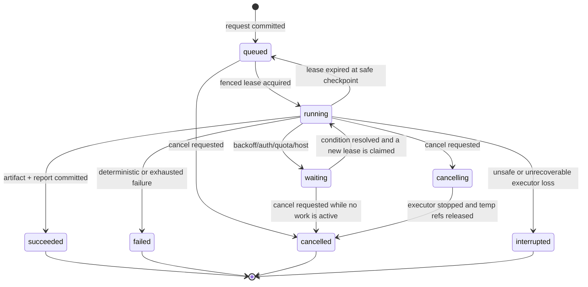
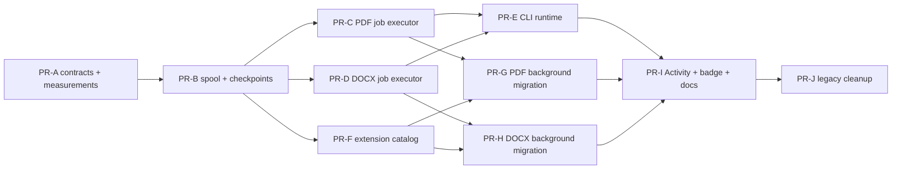

# 013 — Isomorphic export jobs, activity, and bounded background execution

Status: **Plan**, 2026-07-22.

Planned at: `d15e843f876d486d75c8a65d535a42062d942a04`
(`feat(extension): add publishing studio export integration`, PR 75).

This is the follow-up to:

- `specs/009-multi-host-browser-export-runtime/PLAN.md` — engines are reusable
  across hosts but remain independent;
- `specs/export-expansion/010-extension-integration/PLAN.md` — the extension's
  current PDF-only compile handoff, Activity screen, and toolbar badge;
- `specs/export-expansion/011-quality-gates/PLAN.md` — shape parity, large-export
  benchmarks, security, and real-browser gates.

The implementation may land as several reviewable PRs, but this document is the
single architecture contract. Splitting work must not create a PDF job system and
a second DOCX job system that later have to be reconciled.

## Table of contents

1. [Outcome](#1-outcome)
2. [Verified baseline and problem statement](#2-verified-baseline-and-problem-statement)
3. [Scope and non-goals](#3-scope-and-non-goals)
4. [Architecture principles](#4-architecture-principles)
5. [Target ownership and dependency direction](#5-target-ownership-and-dependency-direction)
6. [Versioned contracts](#6-versioned-contracts)
7. [State machine, queue, and recovery](#7-state-machine-queue-and-recovery)
8. [Bounded spool, buffering, and resource scheduling](#8-bounded-spool-buffering-and-resource-scheduling)
9. [Engine-specific executors](#9-engine-specific-executors)
10. [Activity, statistics, logs, and monitoring](#10-activity-statistics-logs-and-monitoring)
11. [Host projections](#11-host-projections)
12. [Migration and delivery sequence](#12-migration-and-delivery-sequence)
    - [PR delivery checklist and landing ledger](#pr-delivery-checklist-and-merge-ledger)
13. [Test and validation plan](#13-test-and-validation-plan)
14. [Definition of Done](#14-definition-of-done)
15. [Risks](#15-risks)
16. [Unresolved questions](#16-unresolved-questions)

---

## 1. Outcome

PDF and DOCX exports shall have the same job-lifecycle guarantees without
becoming one export engine.

A user must be able to:

- submit a PDF or DOCX export before any remote fetch begins;
- navigate away from the source page without cancelling it;
- see queued, running, waiting, completed, failed, interrupted, and cancelled
  jobs in one Activity model;
- inspect the current stage, progress, statistics, warnings, failure phase, and
  a bounded diagnostic log;
- cancel an unfinished job, retry an unsuccessful terminal job, run a successful
  export again as a linked new job, and collect or reveal a completed artifact;
- understand the host's actual lifetime guarantee instead of seeing a generic
  “background” promise that is false in an ordinary tab or Forge iframe.

The same versioned job contracts and transition rules shall be consumed by the
CLI, the Chrome extension, the browser conformance harness, and future browser
or Forge shapes. Each host supplies its own persistence, wakeup, credential, and
artifact adapters.

```text
                         @atlcli/export-jobs
            model · events · transitions · leases · policy
                                |
                    @atlcli/export-wiring/jobs
                         /                 \
                DOCX job executor      PDF job executor
                @atlcli/docx           @atlcli/pdf
                         \                 /
                      host-owned job runtime
                /              |                \
          CLI / Node      Chrome extension    browser / Forge
          file journal      IDB + offscreen    capability-specific
```

The first implementation target is **one bounded heavy export at a time per
host runtime**. Multiple jobs may be queued. This is intentionally conservative:
large spaces with images and diagrams can make one DOCX or Typst compile consume
substantial memory, and queueing is useful only if it actually prevents concurrent
peaks.

---

## 2. Verified baseline and problem statement

### 2.1 What is already correct

- DOCX and PDF are separate engines with separate environment contracts.
  `@atlcli/docx` exposes `TemplateSource`, `AssetFetcher`, `SvgRasterizer`,
  `OutputSink`, and `runExport`; `@atlcli/pdf` exposes `PdfAssetResolver`,
  `PdfCompilePort`, `PdfOutputSink`, and `runPdfExport`.
- Both engines already consume the same upstream `ExportBlock[]`, scope/tree
  orchestration, macro wiring, and cross-engine progress event.
- `@atlcli/export-wiring` is already the browser-safe package that turns host
  clients and policies into DOCX/PDF engine inputs.
- The CLI already maps `SIGINT` to `AbortSignal`, writes progress to stderr, and
  preserves a single report document on stdout in JSON mode.
- The extension already has a PDF IndexedDB record, offscreen compiler host,
  Activity screen, polling re-attach path, cancellation, result retention, and
  a toolbar badge.
- The browser harness already proves real DOCX and PDF execution with public
  package exports and no extension APIs.

These seams are the starting point. This plan does not replace them with a
generic `ExportEngine`.

### 2.2 The current parity gap

The current extension has durable **PDF compilation**, not a durable full export:

1. The side panel performs scope discovery/tree fetch.
2. It composes the full document, resolves mentions and macros, fetches assets,
   and serializes the Typst source bundle.
3. Only `PdfCompilePort.compile()` creates the IndexedDB job and hands its id to
   the service worker/offscreen document.

Closing the surface before step 3 loses the only executor. The user-visible
record begins too late.

DOCX has no durable record at all. Tree fetch, macro resolution, template
processing, image/diagram work, PizZip/docxtemplater rendering, and download all
run in the side-panel document. A page-identity change or panel close aborts it.

At the planned commit, the ordinary CLI command still contains a Python DOCX
default/fallback even though that exporter is deprecated and no longer part of
the product direction. T7.3 removes that stale selection before routing ordinary
DOCX through jobs; the target runtime supports only `@atlcli/docx` TypeScript.

The existing extension job types and stores are PDF-specific even though the
host capability is named `durable-jobs`. Activity therefore describes one
format, not the product's export activity.

### 2.3 The current resource gap

- Tree export currently builds a complete node list and then a complete composed
  `ExportBlock[]` graph.
- PDF prepares all assets and a complete compiler VFS bundle before Typst starts.
- DOCX mutates a complete PizZip archive and generates a complete final
  `Uint8Array`.
- The current PDF compiler queue is an in-memory array in the offscreen document.
  Durable records survive a service-worker restart, but a lost offscreen queue is
  not reconstructed and replayed.
- The PDF store's current 64 MiB per-job and 128 MiB total limits protect quota,
  but a second independent DOCX store could fill another budget beside it.

Queue parity alone does not solve these peaks. The new runtime needs a bounded
spool, admission control, backpressure, and cross-engine resource policy.

### 2.4 Mandatory drift check before implementation

Before the first implementation PR, re-read the current ownership and run:

```bash
git status --short
git rev-parse HEAD
rg -n "ExportRunsProvider|extensionPdfCompilePort|ChromeWorkerCompilerHost|StoredPdfJob|DurableJob|runPdfExport|runExport" apps packages specs
```

STOP and update this plan if:

- a host-neutral export-job package already landed under another name;
- DOCX or PDF engine ownership moved materially;
- the extension no longer uses MV3 offscreen documents;
- a real Forge export runtime has been proven and introduces a conflicting job
  contract;
- a large-export benchmark invalidates the resource assumptions below.

---

## 3. Scope and non-goals

### 3.1 In scope

- One new browser-safe package, `@atlcli/export-jobs`.
- Versioned request, snapshot, event, error, statistics, artifact, and host-
  capability contracts.
- Pure transition, claim/lease/fencing, retention, badge-projection, and resource-
  admission decisions.
- Structural host ports for job metadata, spooled payloads, artifacts, wakeups,
  credentials, and time.
- Separate DOCX and PDF job executors in `@atlcli/export-wiring`.
- A record created before the first source/network read for both formats.
- A bounded page/asset/diagram spool and checkpointed pre-render pipeline.
- Cross-engine queue policy and one initial heavy-render slot.
- A persistent Activity/history projection with statistics and bounded logs.
- CLI foreground execution through the same job runtime, with progressive output
  and inspectable journal/history.
- Chrome extension full-pipeline background execution for both formats.
- Badge count for active work, a bounded completion/failure pulse, and unread
  completion/failure state.
- Browser harness conformance cases for both format executors and job contracts.
- Capability semantics for generic-browser hosts and contract seams reserved for
  a possible, separately evaluated future Forge PoC.
- Migration from the current PDF-only Activity/job records without destructive
  copying of live large blobs.

### 3.2 Out of scope

- Combining DOCX and PDF inputs, reports, engines, renderers, or output sinks.
- A universal persistence implementation shared by Node, IndexedDB, OPFS, Forge
  KVS, and remote services.
- A CLI daemon or `--detach` in the first delivery. A detached process is a
  separate operational product and must not be approximated with an unowned
  child process.
- Claiming that a Web Worker or Forge Custom UI iframe survives closure of its
  last surface.
- Forge app/Remote implementation, pricing, tenancy, data residency, Marketplace
  delivery, or a claim of cost-free operation. Forge is future work; this plan
  supplies only portable contracts and records the questions for a separate PoC.
- Mid-compile resume inside Typst/WASM or mid-mutation resume inside
  PizZip/docxtemplater.
- PDF chapter-by-chapter compilation and merge. That would alter outlines,
  cross-links, page numbering, and determinism and needs its own proof.
- Rewriting DOCX onto a streaming ZIP implementation in this feature.
- Persisting access tokens, session cookies, full page bodies in logs, or signed
  asset URLs in job metadata.

### 3.3 Non-negotiable invariants

1. A job record is committed before any source fetch starts.
2. The record/store is truth. Messages, ports, React state, and push events are
   wakeups or projections only.
3. Bytes do not cross `chrome.runtime.sendMessage`, Forge invocation payloads,
   or generic UI event channels. They move through opaque spool/artifact refs.
4. DOCX and PDF keep separate request DTOs, executors, reports, and engine ports.
5. A terminal job never returns to a running state. Manual **Retry** and
   **Run again** create linked new jobs; automatic transient retries happen
   inside the non-terminal job.
6. A stale worker cannot update progress or commit output after its lease has
   been reclaimed.
7. A running job and a succeeded-but-undelivered artifact are never evicted to
   admit a preview or new job.
8. Cancellation is durable state, not a panel-owned `AbortController`.
9. Final artifact commit is atomic or idempotent. An uncertain commit is never
   retried blindly.
10. Host UI copy is derived from declared capabilities and tested against the
    real host lifecycle.

---

## 4. Architecture principles

### 4.1 Share lifecycle, not engine semantics

`@atlcli/export-jobs` knows that a job has a format, state, stage, progress,
lease, artifacts, statistics, and errors. It does not know how to build OOXML or
Typst.

`@atlcli/export-wiring/jobs` supplies the two browser-safe executors:

- `createTypescriptDocxExportJobExecutor(...)`
- `createPdfExportJobExecutor(...)`

There is no public `runExport(format, anyRequest)` entry point. A host registers
only the format/renderer pairs it actually supports. The deprecated Python DOCX
exporter is not a job backend and receives no compatibility executor.

### 4.2 Submit references, not live objects

The durable request is serializable and contains stable source/configuration
references. It contains no client instance, callbacks, DOM object, token, cookie,
or open stream.

At execution time the host resolves:

- a credential/auth reference into source clients;
- a template reference into immutable bytes;
- a compiler capability into the format-specific engine port;
- a delivery target into an artifact sink.

### 4.3 Separate generation from delivery

A browser background job succeeds when validated staged bytes and its report are
atomically attached to the fenced job snapshot. It does not depend on a live
surface being able to trigger a download.

Delivery is a later operation:

- extension/browser: **Download** from Activity;
- CLI: atomic commit to the requested path as the executor's delivery policy;
- future Forge: browser download, Confluence attachment, or remote artifact URL,
  depending on the host adapter.

`deliveredAt` is metadata on a succeeded job. A download failure does not turn a
successful generation into a failed generation.

### 4.4 Durable queue means replayable claims

An array in a Worker is a scheduling optimization, not the queue of record. A
new executor must be able to discover runnable jobs from `JobStore.claimNext()`.

Every wakeup follows the same sequence:

1. reconcile stale leases;
2. apply cancellation/retention rules;
3. claim the next admissible job atomically;
4. execute from its last safe checkpoint;
5. release or renew the lease with a fenced write.

### 4.5 Buffering must be bounded and measurable

The runtime controls four different budgets:

1. semantic asset limits enforced by the engines;
2. active heap/in-flight bytes;
3. per-job spool bytes;
4. global spool plus retained-output bytes.

One number must not stand in for all four. Concrete product caps remain at their
current values until real Chrome and Node measurements justify a change.

---

## 5. Target ownership and dependency direction

### 5.1 Package graph

```text
@atlcli/export-jobs
  no engine, host, DOM, Node, Chrome, WXT, or Forge dependency
                 ^
                 |
@atlcli/export-wiring/jobs
  depends on confluence + export-macros + docx + pdf + export-jobs
            ^                                  ^
            |                                  |
   @atlcli/export-node                  host browser adapters
            ^                         /          |          \
            |                  extension      harness      future Forge
         apps/cli
```

### 5.2 Ownership table

| Owner | Owns | Must not own |
|---|---|---|
| `@atlcli/export-jobs` | schemas, reducer, transitions, leases/fencing, scheduling policy, stats/event projection, structural ports | engine imports, Chrome/Node/Forge storage, authentication, rendering |
| `@atlcli/export-wiring/jobs` | TypeScript DOCX and PDF executors, shared scope/macro/asset orchestration | host credential construction, persistence backend, UI |
| `@atlcli/docx` | template/OOXML engine and DOCX-specific ports/report | PDF or job-store semantics |
| `@atlcli/pdf` | PDF preparation, serialization, validation, compile/output ports/report | DOCX or job-store semantics |
| `@atlcli/export-node` | file-backed journal/spool/artifacts, atomic file delivery, Node wakeup/locking | CLI formatting or browser storage |
| `apps/cli` | commands, TTY/non-TTY presentation, exit codes, signal handling | a second job state machine |
| `apps/extension` | IndexedDB/optional OPFS adapters, offscreen wakeup/execution, toolbar projection, Activity UI, Chrome delivery | reusable transition/engine logic |
| `apps/browser-export-harness` | in-memory/chunked reference host and lifecycle conformance | production durability claims |
| future Forge host | platform adapter and truthful capabilities | changing the common schemas to mirror one Forge API |

### 5.3 One new package only

Do not introduce both `export-jobs` and `export-runtime` in this wave. The pure
scheduler kernel belongs in `@atlcli/export-jobs`; engine execution assembly
belongs in the existing `@atlcli/export-wiring` package.

---

## 6. Versioned contracts

Names below are normative. Internal filenames may change; collapsing these
boundaries requires a plan update.

### 6.1 Request envelopes

```ts
export type ExportFormat = "docx" | "pdf";

export type ExportScope =
  | { kind: "page" }
  | { kind: "tree"; includeRoot?: boolean; maxDepth?: number }
  | { kind: "space" };

export interface ExportSourceV1 {
  kind: "confluence";
  siteOrigin: string;
  locator:
    | { kind: "page-id"; id: string; version?: number }
    | { kind: "content-key"; value: string }
    | { kind: "space-key"; spaceKey: string };
  scope: ExportScope;
  labels?: LabelFilter;
  completenessMode?: CompletenessMode;
  maxPages?: number;
}

export interface ExportJobRequestBaseV1 {
  schema: "atlcli.export-job-request/1";
  id: string;
  idempotencyKey: string;
  format: ExportFormat;
  source: ExportSourceV1;
  authRef: string;
  displayName: string;
  requestedFilename?: string;
  createdAt: number;
  priority: "interactive" | "retry";
  output: { policy: "collect" | "path" | "host"; targetRef?: string };
}

export interface DocxExportJobRequestV1 extends ExportJobRequestBaseV1 {
  format: "docx";
  renderer: "docx-typescript";
  template: { recordKey: string; sha256: string; name: string };
  options: {
    embedImages: boolean;
    resolveMacros: boolean;
    updateFields?: "auto" | "always" | "never";
    captionLang?: string;
  };
}

export interface PdfExportJobRequestV1 extends ExportJobRequestBaseV1 {
  format: "pdf";
  renderer: "pdf-typst";
  template: { id: string; manifestVersion: string };
  settings: {
    page?: "a4" | "letter";
    orientation?: "portrait" | "landscape";
    cover?: boolean;
    outline?: boolean;
    headerText?: string;
    footerText?: string;
    accentColor?: string;
    organizationName?: string;
    watermark?: { text: string; color?: string; opacity?: number; angle?: number; size?: number };
    logo?: { assetRef: string; sha256: string; byteLength: number; mediaType: "image/png" | "image/svg+xml"; alt: string };
    custom?: Record<string, string | number | boolean | null>;
  };
  options: { resolveMacros: boolean; profile?: string };
}

export type ExportJobRequestV1 =
  | DocxExportJobRequestV1
  | PdfExportJobRequestV1;
```

Rules:

- `siteOrigin` is canonicalized; full source URLs with sensitive query strings
  are not persisted.
- `locator` stores the unresolved CLI/UI input. Resolving `SPACE:Title`, a space
  root, page metadata, or an output filename is part of the claimed job and
  therefore happens after the record commit.
- `scope` describes only page/tree/space intent and traversal options. It never
  requires a remotely resolved page or space identifier before submission.
- `displayName` and `requestedFilename` are locally derived hints. Resolved
  title, page id, space key, version, and filename are checkpointed later.
- `authRef` names a host-local credential/session lookup. It is not a credential.
- A DOCX job pins immutable template identity and hash. Replacing the active
  template after submission cannot change queued output.
- A PDF logo is a pinned, hashed host-asset ref rather than inline bytes; its
  retention follows the replay-safe request. Built-in structured settings and
  manifest-declared scalar `custom` settings remain distinct.
- Settings and option objects are validated before `JobStore.create()` commits.
- The format/renderer discriminator is closed: DOCX accepts only
  `docx-typescript`; PDF accepts only `pdf-typst` in this contract version.
- A terminal history row retains its redacted, replay-safe request for the same
  lifetime as the row so Retry/Run again does not depend on a live UI form.
- An acknowledgement lost after commit is retried with the same
  `idempotencyKey`, returning the existing job instead of duplicating it.

### 6.2 Snapshot

```ts
export type ExportJobState =
  | "queued"
  | "running"
  | "waiting"
  | "cancelling"
  | "succeeded"
  | "failed"
  | "cancelled"
  | "interrupted";

export type ExportJobStage =
  | "discover"
  | "fetch"
  | "compose"
  | "resolve"
  | "assets"
  | "render"
  | "validate"
  | "commit";

export interface ExportJobProgressV1 {
  stage: ExportJobStage;
  done: number;
  total: number | null;
  detail?: string;
  updatedAt: number;
}

export interface ExportJobLeaseV1 {
  ownerId: string;
  epoch: number;
  acquiredAt: number;
  heartbeatAt: number;
  expiresAt: number;
}

export interface ExportJobSnapshotV1 {
  schema: "atlcli.export-job/1";
  id: string;
  revision: number;
  requestRef: string;
  format: ExportFormat;
  renderer: "docx-typescript" | "pdf-typst";
  summary: {
    displayName: string;
    sourceLabel: string;
    siteOrigin: string;
    profileLabel?: string;
    scopeKind: string;
  };
  queue: { priority: "interactive" | "retry"; enqueuedAt: number; groupKey: string };
  state: ExportJobState;
  stage?: ExportJobStage;
  progress?: ExportJobProgressV1;
  waiting?: { reason: "queue" | "backoff" | "auth" | "quota" | "host"; until?: number };
  attempt: number;
  recoveryCount: number;
  /** Last allocated fencing epoch, retained while queued/waiting/terminal. */
  leaseEpoch: number;
  lease?: ExportJobLeaseV1;
  cancelRequestedAt?: number;
  checkpointRef?: string;
  artifact?: ExportArtifactV1;
  reportRef?: string;
  reportSummary?: ExportReportSummaryV1;
  stats: ExportJobStatsV1;
  error?: ExportJobErrorV1;
  createdAt: number;
  startedAt?: number;
  finishedAt?: number;
  deliveredAt?: number;
  acknowledgedAt?: number;
  dismissedAt?: number;
  derivedFrom?: ExportJobDerivationV1;
}

export interface ExportJobDerivationV1 {
  jobId: string;
  relation: "retry" | "rerun";
  actionKey: string;
}
```

`revision` is monotonically increasing. All writes are compare-and-set against
both `revision` and the active lease epoch where applicable. `derivedFrom` is
immutable and forms an inspectable history chain; a new job has at most one
direct predecessor.

### 6.3 Artifact and reports

```ts
export interface ExportArtifactV1 {
  ref: string;
  mediaType: "application/pdf" |
    "application/vnd.openxmlformats-officedocument.wordprocessingml.document";
  filename: string;
  byteLength: number;
  sha256: string;
  committedAt: number;
}

export interface StagedArtifactV1 {
  ref: string;
  mediaType: ExportArtifactV1["mediaType"];
  filename: string;
  byteLength: number;
  sha256: string;
  jobId: string;
  leaseEpoch: number;
  stagedAt: number;
}

export interface ExportJobExecutionResultV1 {
  stagedArtifact: StagedArtifactV1;
  reportRef?: string;
  reportSummary?: ExportReportSummaryV1;
}
```

The generic snapshot carries a canonical bounded `reportSummary` and an optional
`reportRef`. The complete format-specific `ExportReport` or `PdfExportReport`
remains intact behind `reportRef` while its independent report-retention window
is active. Artifact cleanup never leaves a dangling report reference, and report
cleanup clears `reportRef` atomically while retaining the summary.

### 6.4 Statistics

```ts
export interface ExportReportSummaryV1 {
  issues: { info: number; warning: number; error: number };
  topCodes: Array<{ code: string; count: number }>;
  completeness: "complete" | "partial" | "unknown";
  failurePhase?: string;
}

export type ExportJobMetricV1 =
  | "storage.spoolPeakBytes"
  | "memory.heapPeakBytes"
  | "memory.rendererPeakBytes";

export interface ExportJobStatsV1 {
  pages: { discovered: number; fetched: number; composed: number; skipped: number };
  assets: {
    discovered: number;
    fetched: number;
    embedded: number;
    skipped: number;
    deduplicated: number;
    logicalBytes: number;
    physicalBytes: number;
  };
  diagrams: { discovered: number; rendered: number; rasterized: number; failed: number };
  macros: { discovered: number; rendered: number; approximated: number; unresolved: number };
  retries: { total: number; rateLimited: number; network: number; worker: number };
  storage: { spoolBytes: number; spoolPeakBytes: number | null; outputBytes: number };
  memory: { heapPeakBytes: number | null; rendererPeakBytes: number | null };
  metricSupport: Partial<Record<ExportJobMetricV1, "measured" | "derived" | "unavailable">>;
  durationsMs: Partial<Record<ExportJobStage | "queue", number>>;
  warnings: number;
  errors: number;
}
```

Counters are monotonic within one job. Required semantic counters are exact;
host-dependent measurements are nullable and carry `metricSupport`. Activity
renders `null`/`unavailable` as “not measured”, never as zero. Do not fabricate
heap peaks on hosts that cannot measure them.

### 6.5 Event log

```ts
export type ExportJobEventV1 =
  | { kind: "state"; seq: number; at: number; from: ExportJobState; to: ExportJobState }
  | { kind: "stage"; seq: number; at: number; stage: ExportJobStage }
  | { kind: "progress"; seq: number; at: number; progress: ExportJobProgressV1 }
  | { kind: "retry"; seq: number; at: number; code: string; nextAttemptAt: number }
  | { kind: "issue"; seq: number; at: number; level: "info" | "warning" | "error"; code: string; source?: ExportIssueSourceV1 }
  | { kind: "recovery"; seq: number; at: number; fromCheckpoint?: string; leaseEpoch: number }
  | { kind: "artifact"; seq: number; at: number; artifact: ExportArtifactV1 };
```

The durable event log is bounded:

- always retain state/stage/retry/recovery/artifact and warning/error events;
- coalesce progress snapshots to at most one durable write per 500 ms and retain
  the final progress of every stage;
- keep detailed per-page/per-asset facts in the report, not as unlimited log
  lines;
- never store access tokens, cookies, page bodies, rendered blocks, or signed
  URLs in events.

### 6.6 Structural ports

```ts
export type ExportJobUpdateV1 =
  | { kind: "transition"; id: string; expectedRevision: number; to: "waiting" | "cancelling" | "failed" | "interrupted" | "cancelled"; at: number; leaseEpoch?: number; waiting?: ExportJobSnapshotV1["waiting"]; checkpointRef?: string; error?: ExportJobErrorV1 }
  | { kind: "heartbeat"; id: string; expectedRevision: number; ownerId: string; leaseEpoch: number; now: number; leaseDurationMs: number }
  | { kind: "progress"; id: string; expectedRevision: number; leaseEpoch: number; progress: ExportJobProgressV1 }
  | { kind: "reclaim-expired"; id: string; expectedRevision: number; now: number }
  | { kind: "checkpoint"; id: string; expectedRevision: number; leaseEpoch: number; at: number; checkpointRef: string }
  | { kind: "stats"; id: string; expectedRevision: number; leaseEpoch: number; at: number; stats: ExportJobStatsV1 };

export interface ExportJobEventAppendV1 {
  expectedRevision: number;
  leaseEpoch?: number;
  event: ExportJobEventV1;
}

export interface ExportJobStore {
  create(input: {
    request: ExportJobRequestV1;
    derivedFrom?: ExportJobDerivationV1;
  }): Promise<ExportJobSnapshotV1>;
  get(id: string): Promise<ExportJobSnapshotV1 | undefined>;
  getRequest(requestRef: string): Promise<ExportJobRequestV1 | undefined>;
  list(query?: ExportJobQueryV1): Promise<ExportJobSnapshotV1[]>;
  compareAndSet(update: ExportJobUpdateV1): Promise<ExportJobSnapshotV1>;
  claimNext(claim: ExportJobClaimV1): Promise<ExportJobSnapshotV1 | undefined>;
  appendEvent(id: string, input: ExportJobEventAppendV1): Promise<void>;
  finalizeArtifact(finalize: ExportJobFinalizeV1): Promise<ExportJobSnapshotV1>;
  acknowledge(id: string, expectedRevision: number, at: number): Promise<ExportJobSnapshotV1>;
  dismiss(id: string, expectedRevision: number, at: number): Promise<ExportJobSnapshotV1>;
  deliver(id: string, expectedRevision: number, at: number): Promise<ExportJobSnapshotV1>;
  /** Succeeded jobs without `deliveredAt` or `dismissedAt` are never eligible. */
  deleteTerminal(query: ExportJobDeleteQueryV1): Promise<ExportJobDeleteResultV1>;
}

export interface SpoolRefV1 {
  jobId: string;
  leaseEpoch: number;
  namespace: string;
  key: string;
}

export interface ExportSpoolStore {
  put(ref: SpoolRefV1, source: AsyncIterable<Uint8Array>, limits: SpoolWriteLimitsV1): Promise<SpoolObjectV1>;
  read(ref: SpoolRefV1, options?: { signal?: AbortSignal }): AsyncIterable<Uint8Array>;
  stat(ref: SpoolRefV1): Promise<SpoolObjectV1 | undefined>;
  deleteNamespace(jobId: string, leaseEpoch: number): Promise<void>;
}

export interface ExportJobSpool {
  put(ref: Omit<SpoolRefV1, "jobId" | "leaseEpoch">, source: AsyncIterable<Uint8Array>, limits: SpoolWriteLimitsV1): Promise<SpoolObjectV1>;
  read(ref: SpoolRefV1, options?: { signal?: AbortSignal }): AsyncIterable<Uint8Array>;
  stat(ref: SpoolRefV1): Promise<SpoolObjectV1 | undefined>;
}

export interface ExportArtifactStore {
  stage(jobId: string, leaseEpoch: number, artifact: PendingArtifactV1): Promise<StagedArtifactV1>;
  getStaged(jobId: string, leaseEpoch: number): Promise<StagedArtifactV1 | undefined>;
  read(ref: string): AsyncIterable<Uint8Array>;
  deleteStaged(ref: string): Promise<void>;
}

export interface ExportJobArtifacts {
  stage(artifact: PendingArtifactV1): Promise<StagedArtifactV1>;
  getStaged(): Promise<StagedArtifactV1 | undefined>;
}

export interface ExportJobExecutor<Request> {
  readonly format: ExportFormat;
  execute(request: Request, context: ExportJobExecutionContext): Promise<ExportJobExecutionResultV1>;
}
```

Host adapters may add optimized methods, but conformance tests target these
semantics.

`compareAndSet()` accepts only the discriminated commands above, never a
`Partial<ExportJobSnapshotV1>`. The adapter dispatches each command to the same
pure transition, heartbeat, progress, statistics, expired-lease-reclaim, or checkpoint
reducer used by conformance tests. This prevents a host from bypassing revision,
lease-epoch, expiry, monotonic-progress, or terminal-immutability checks with an
arbitrary field patch. Event appends carry the expected snapshot revision and
active lease epoch where applicable. `deliver()` sets `deliveredAt` and, if still unread,
`acknowledgedAt` once without deleting the artifact or history; repeated or
stale delivery attempts cannot rewrite either timestamp.

The execution context receives only `ExportJobSpool` and `ExportJobArtifacts`
facades bound by the host to its immutable `(jobId, leaseEpoch)`. Executor code
cannot choose a future epoch or delete another epoch's namespace. The lower-level
stores remain host-owned for retention and recovery.

Creation atomically enforces uniqueness for both request `idempotencyKey` and,
when present, `(derivedFrom.jobId, relation, actionKey)`. A lost Retry/Run-again
response therefore returns the existing derived job rather than creating a
second export.

Artifact finalization is a fenced two-step protocol:

1. The executor stages bytes under a deterministic `(jobId, leaseEpoch)` ref.
   Staged bytes are not user-visible and are safe for orphan GC.
2. `JobStore.finalizeArtifact()` atomically checks `revision` and lease epoch,
   attaches the staged artifact/report descriptors, and transitions the record
   to `succeeded`.

A crash after staging but before finalization is recovered by inspecting
`getStaged()` for that epoch. A reclaimed/stale executor cannot finalize. The
runtime either validates and reuses the staged bytes under the current fenced
recovery protocol or discards them before rendering again. Delivery occurs only
from the finalized snapshot and is separately idempotent; it is never part of
the engine transaction.

`deleteTerminal()` first writes a deletion tombstone containing the request
idempotency key, optional derivation action key, and every owned artifact,
report, event, and spool ref. Physical deletion is idempotent; only
after all refs are gone may metadata/tombstone cleanup finish. A crash can leak
temporarily reclaimable bytes, but cannot leave an untracked ref or resurrect a
job.

### 6.7 Host capabilities

Replace the single host-wide meaning of `durable-jobs` with an explicit
per-format capability projection:

```ts
export interface ExportJobHostCapabilityV1 {
  format: ExportFormat;
  renderer: "docx-typescript" | "pdf-typst";
  executionLifetime: "surface" | "process" | "browser-session" | "remote";
  survivesSurfaceClose: boolean;
  resumesAfterExecutorLoss: boolean;
  resumesAfterHostRestart: boolean;
  canCancel: boolean;
  canRetry: boolean;
  canRerun: boolean;
  canCollectLater: boolean;
  resultRetentionMs: number;
}
```

Screens render availability and copy from these values. They never branch on
`chrome`, `forge`, or `process` directly.

---

## 7. State machine, queue, and recovery

### 7.1 State machine



Terminal states are immutable except for `deliveredAt`, `acknowledgedAt`,
`dismissedAt`, report/artifact-retention metadata, and retention deletion. Manual
**Retry** creates a new queued job related as `retry` to a failed, interrupted,
or cancelled job. **Run again** creates a new queued job related as `rerun` to a
succeeded job.

Both operations copy the retained replay-safe request into a new request with a
new job id, idempotency key, and `createdAt`. They do not copy state, progress,
attempts, acknowledgement, artifact, report, delivery, or error fields. Current
credentials, source permissions, quotas, and output-conflict policy are evaluated
again. Retry uses `priority: "retry"`; an explicit user Run again uses
`priority: "interactive"`. The original job and artifact remain unchanged.

Retry and Run again each require a caller-stable `actionKey`. Repeating the same
`(sourceJobId, relation, actionKey)` after a lost response returns the existing
derived job; a deliberate second action uses a new key and creates a new job.

### 7.2 Claims, leases, and fencing

- `claimNext()` is atomic in the metadata store.
- Every claim increments a monotonic lease epoch.
- Entering `waiting` atomically checkpoints and releases the execution lease.
  Waiting jobs never retain a lease in contract v1; becoming runnable requires a
  fresh claim/epoch.
- Heartbeat, progress, checkpoint, artifact commit, and terminal writes include
  the current epoch.
- Lease expiry is evaluated against the adapter/store transaction clock, never
  only against an executor-supplied payload timestamp. A message created before
  expiry but persisted after expiry fails closed, including heartbeat and commit.
- A write from an expired epoch fails closed.
- Lease duration is longer than the heartbeat interval and independent of the
  compile timeout.
- A worker that wakes after being terminated cannot overwrite the replacement
  worker's status or artifact.

### 7.3 Queue policy

Initial policy:

1. user exports before retries;
2. FIFO within priority, with round-robin fairness between sites when possible;
3. one global heavy `render` reservation across DOCX and PDF;
4. at most one executing export in the initial extension delivery;
5. PDF previews remain transient, latest-wins work and never appear in Activity;
6. a preview cannot consume the heavy slot while an export is queued.

The pure policy returns a decision; hosts own the mechanism that wakes the next
runner.

### 7.4 Recovery checkpoints

Safe checkpoints:

- durable request accepted;
- discovery cursor/batch committed;
- each ordered page body/block chunk committed;
- each content-addressed asset or diagram artifact committed;
- macro/mention resolution committed per page or bounded batch;
- complete pre-render manifest (`ready-to-render`);
- validated output committed.

Not resumable mid-operation with current engines:

- Typst/WASM compilation;
- PizZip/docxtemplater mutation and final ZIP generation.

After executor loss during either render, restart from `ready-to-render`. Permit
at most one automatic fresh-render retry for a worker crash/timeout; then fail
with an actionable error.

### 7.5 Retry taxonomy

| Failure | Policy |
|---|---|
| HTTP 429, valid `Retry-After` | Persist `waiting/backoff`, bounded delay + jitter, no busy loop |
| HTTP 502/503/504 or transient network error | Bounded automatic retry |
| Auth redirect, 401, expired browser session | `waiting/auth`; user action required |
| Permission 403 with valid auth | terminal `failed`, no retry storm |
| Quota/admission shortfall | `waiting/quota` when user cleanup can resolve it, otherwise deterministic failure |
| Parse/template/compiler diagnostic | terminal `failed` |
| Worker crash/timeout | one render restart from checkpoint, then terminal `failed` |
| Explicit cancellation | never retry |
| Uncertain external commit | terminal `interrupted`; never duplicate automatically |

### 7.6 Cancellation

- `cancelRequestedAt` is committed first.
- Queued and waiting jobs transition directly to `cancelled`.
- Running jobs transition to `cancelling`; the executor's current HTTP, backoff,
  raster, or renderer work receives a local `AbortSignal`.
- Active PDF or DOCX render may be stopped by terminating its dedicated worker
  or host task.
- The stale executor cannot commit because its lease epoch is fenced.
- Temporary job refs are released; shared content-addressed objects are removed
  only when unreferenced.
- Once the artifact commit succeeds, Cancel is replaced with Download/Reveal and
  Dismiss.

---

## 8. Bounded spool, buffering, and resource scheduling

### 8.1 Why a spool is required

Large source bodies, images, diagrams, prepared blocks, engine bundles, and final
artifacts must not all coexist in the surface heap. `ExportSpoolStore` is the
byte channel between checkpointed stages.

Metadata stores hold counts and opaque refs only. Large source/result bytes do
not participate in list/status queries.

### 8.2 Physical backends

- Node/CLI: private job directory with atomic temp-file rename and a small
  journal/index.
- Extension/browser: chunked IndexedDB is the required portable backend.
- OPFS is an optional optimized backend only after a packed-extension spike
  proves offscreen/worker access, quota behavior, upgrade behavior, and fallback.
- Future Forge: host-specific implementation; Forge KVS is not assumed to be a
  file store.

The contract must not expose `IDBObjectStore`, OPFS handles, Node paths, or Forge
keys.

### 8.3 Logical objects

```text
requests/<job>/request.json
discovery/<job>/manifest.json
pages/<job>/<preorder-slot>.storage
blocks/<job>/<preorder-slot>.json
assets/<job>/<sha256>
diagrams/<job>/<source-theme-profile-hash>.svg
diagrams/<job>/<source-theme-profile-hash>.png
render/<job>/manifest.json
outputs/<job>/document.pdf|document.docx
reports/<job>/report.json
```

Content addressing is job-scoped in v1. Cross-job deduplication is deferred
because it introduces site isolation, retention, invalidation, and privacy
questions.

### 8.4 Bounded page pipeline

1. Discovery persists a lightweight ordered manifest: ids, titles, versions,
   hierarchy, anchors, and traversal cursor — not bodies.
2. Body fetch uses a bounded sliding window.
3. Pages normalize and resolve in deterministic preorder slots.
4. Completed slots commit to the spool and release their source body.
5. A slow earlier slot limits how far later slots may buffer, applying
   backpressure.
6. Composition consumes the ordered manifest plus block refs; it does not need
   every page body in memory.

The implementation must add an iterator/cursor seam beside today's
`fetchExportTree()` result API rather than silently changing existing callers.
Existing direct engine paths remain supported until job parity tests pass.

### 8.5 Bounded asset pipeline

- Reserve expected in-flight bytes before starting a fetch when Content-Length
  is known.
- Stream unknown-length responses in exact-owned chunks and enforce limits after
  every chunk.
- Hash incrementally and compare bytes from the spool on the rare hash-collision
  path.
- Store exactly owned byte ranges; never persist a tiny typed-array view backed
  by a much larger buffer.
- Limit concurrent downloads by both count and reserved bytes.
- Keep asset and diagram preparation deterministic; final archive/compiler
  mutation remains document ordered.

### 8.6 Initial concurrency profile

These are starting points to benchmark, not permanent public guarantees:

- page/source fetches: maximum 4 per site;
- asset fetches: maximum 6 and also bounded by in-flight-byte reservation;
- ready but not committed page slots: maximum 8;
- diagram render/raster: 1 CPU task;
- heavy render: 1 globally across DOCX and PDF;
- executing exports in the first extension delivery: 1;
- previews: lower priority, coalesced, no durable history.

Any changed value must come with the 50-page and 500-page benchmark evidence in
the same PR.

### 8.7 Render peak reservations

The scheduler requests a `ResourceEstimateV1` before `render`:

```ts
export interface ResourceEstimateV1 {
  heapBytes: number;
  spoolBytes: number;
  outputBytes: number;
  rasterPixels: number;
  confidence: "measured" | "estimated" | "unknown";
}
```

PDF must reserve for materializing the Typst VFS bundle, warm WASM/fonts, and
output bytes. DOCX must reserve for template/archive mutation, embedded media,
compression, and the final output array.

If a host cannot admit the render safely, the job waits with a named shortfall or
fails deterministically. It does not begin and hope the tab survives.

### 8.8 Retention and eviction

Use one policy across formats and preview cache occupants:

1. expired temp/checkpoint data;
2. regenerable preview cache;
3. delivered/dismissed terminal artifacts;
4. failed/cancelled temp data after diagnostic grace;
5. never evict running work or succeeded-undelivered artifacts.

History/report metadata is separate from artifact retention. Version 1 uses:

- succeeded-undelivered artifacts: never auto-evicted; quota admission waits or
  fails rather than deleting the user's only result;
- delivered or dismissed artifacts: eligible for cleanup after the validated
  24-hour artifact horizon (explicit destructive Clear may remove them earlier);
- full bounded report and event protocol: 7 days, independent of the artifact
  byte horizon;
- compact history/report summary: last 100 jobs or 30 days, whichever is smaller;
- redacted request plus immutable template/config refs: same lifetime as compact
  history; referenced template bytes are reference-counted and cannot be deleted
  while a retained job can be retried or run again;
- warning/error report summary remains with history after full report cleanup;
- report cleanup atomically clears `reportRef`; views fall back to the summary;
- raw debug traces are never retained by default.

---

## 9. Engine-specific executors

### 9.1 Shared orchestration

The executors reuse one isomorphic sequence for source-side work:

1. validate durable request and resolve host credentials;
2. discover scope and persist ordered manifest;
3. fetch/normalize page chunks;
4. resolve mentions and macros with per-page provenance;
5. fetch/deduplicate assets and prepare diagrams under budgets;
6. build format-specific render input;
7. invoke the format-specific engine;
8. validate output;
9. atomically commit artifact and format-specific report.

Credential construction and session policy remain host-owned. The executor sees
the existing structural clients/ports.

### 9.2 PDF executor

- Reuse `@atlcli/pdf` preparation, serializer, validation, and report semantics.
- Reuse the host-injected `PdfCompilePort`; Typst/WASM remains a browser compiler
  implementation, not part of the job package.
- The full export job is the user-visible record. Do not create a second visible
  compile-only PDF job.
- Split the existing extension compile adapter into:
  1. a lower-level compiler transport that compiles the bundle for the already
     claimed outer job id; and
  2. a temporary legacy wrapper that preserves old PDF-only callers during
     migration.
- Materialize the complete compiler bundle only after acquiring the heavy render
  reservation.
- Validate and commit the output in the background executor. Validation must not
  depend on the panel re-attaching.
- On render recovery, rebuild from the `ready-to-render` spool checkpoint.

### 9.3 DOCX executor

- The portable `renderer: "docx-typescript"` executor reuses `@atlcli/docx` template,
  asset, rasterizer, output, and report contracts.
- Resolve the pinned template ref/hash and reject mismatch instead of silently
  falling back to the current active template.
- Execute outside the side panel. The first Chrome target is the offscreen
  document because it provides a DOM/canvas and survives the panel.
- Prove whether DOCX can run in a dedicated module Worker with OffscreenCanvas or
  a WASM rasterizer. Until proven, offscreen-document execution is acceptable;
  it is already isolated from React/UI lifetime.
- Preserve deterministic PizZip mutation order. Parallelize only source fetch,
  image decode/fetch, and diagram preparation.
- Acquire the same global heavy slot as PDF before PizZip/docxtemplater render.
- Capture bytes to `ExportArtifactStore`; never initiate final browser download
  from the engine.
- On render recovery, restart from `ready-to-render`; do not attempt to replay a
  partially mutated archive.
- Before the CLI job cutover, remove any remaining ordinary-command default or
  fallback to the deprecated Python exporter. If a legacy invocation remains
  temporarily addressable, it fails with a migration message; it is not wrapped
  as a job executor.

### 9.4 Direct-path parity

For both formats, the new job executor must produce the same artifact and report
as the current TypeScript DOCX or Typst PDF direct path for the same pinned
inputs:

- PDF: byte identity where the existing deterministic contract requires it;
- DOCX: existing per-part/pixel semantic equality policy;
- canonical report projection: codes, severity, counts, provenance, completeness,
  requested/resolved scope, and failure phase;
- host-only timings and delivery metadata may differ and are excluded explicitly.

---

## 10. Activity, statistics, logs, and monitoring

### 10.1 Activity list

Activity is a projection over `ExportJobSnapshotV1`, not a second store of UI
state. List rows use the denormalized non-sensitive `summary`; executors load the
full request through `getRequest()`.

Default ordering:

1. running/cancelling;
2. waiting;
3. queued;
4. succeeded and not yet acknowledged/delivered;
5. recent failed/interrupted/cancelled;
6. recent acknowledged history.

Each row shows:

- format, title, site/profile, scope, and creation time;
- current stage, or an exact/estimated queue position calculated by the monitor
  from `queue` plus the same pure admission policy;
- done/total and current page/asset when safe to display;
- elapsed time, warning count, and retry/recovery count;
- artifact size when ready;
- concise blocker or failure phase.

Actions:

- **Cancel** for queued/running/waiting/cancelling;
- **Retry** for failed/interrupted/cancelled, creating a linked new job;
- **Download/Reveal** and **Run again** for succeeded jobs; Run again creates a
  linked new job and never mutates or replaces the successful source job;
- **View report/log** for every terminal job while the full report is retained;
  otherwise **View summary**;
- **Dismiss** only for terminal history;
- **Resume after sign-in** for `waiting/auth` where the host supports it.

Acknowledgement, dismissal, and deletion are distinct:

- viewing a terminal job detail, downloading/revealing its artifact, or choosing
  **Mark as read** sets `acknowledgedAt` and clears its unread badge contribution;
- **Dismiss** sets `dismissedAt` and hides the row from the default view, but
  does not acknowledge it or immediately delete its retained artifact/report;
- `jobs clear` or retention cleanup may delete only eligible terminal records
  and their owned refs. It never removes running work or a succeeded,
  undelivered artifact. Destructive CLI clear keeps its confirmation gate.

Filters: status, format, current site, all sites, and time range. The extension
defaults to the current site but offers **All sites** explicitly; it must not make
other-site failures invisible forever.

### 10.2 Job detail and protocol

The detail view contains:

- stage timeline and durations;
- statistics from `ExportJobStatsV1`;
- grouped report issues with source provenance;
- bounded operational events: queued, started, retry/backoff, recovery, cancel,
  artifact commit, delivery;
- engine/compiler/template versions and request fingerprints;
- checkpoint, lease/recovery count, spool peak, and quota snapshot in an
  expandable diagnostics section.

Raw page content, tokens, cookies, and signed URLs never appear.

### 10.3 Monitor semantics

- UI push/BroadcastChannel/runtime messages may reduce latency.
- Mount, reconnect, visibility regain, and host wakeup always read snapshots.
- Polling or `waitForChange(afterRevision)` is the correctness path.
- A progress event never replaces a later snapshot solely because it arrived
  later; revision ordering wins.
- CLI and browser surfaces use the same event codes but different renderers.
- Queue position is a monitor projection, not durable truth. If fair scheduling,
  quota, or another reservation makes an exact position unknowable, UI shows an
  estimated position or named waiting reason instead of a false number.

### 10.4 Extension toolbar projection

Toolbar state is derived from persisted records:

For badge purposes, “active” means every unfinished job: `queued`, `running`,
`waiting`, or `cancelling`. Activity distinguishes work that is actively using a
runner from work blocked on auth/quota/backoff; the compact badge counts both so
unfinished exports do not disappear.

| Condition | Badge | Color/icon behavior |
|---|---|---|
| active jobs > 0 | active count, capped at `9+` | normal active color; a new failure may pulse red without hiding the count |
| no active, unread failed/interrupted > 0 | `!` | red failure state |
| no active/failure, unread succeeded > 0 | `✓` | green completion state |
| nothing active or unread | empty | default icon |

When a job succeeds or fails, the extension may run a short best-effort pulse
using pre-bundled icon frames or bounded badge-color changes. Requirements:

- no remote assets, new permission, continuous interval, or promise of reliable
  animation after service-worker suspension;
- maximum one short pulse per state transition, then a static durable badge;
- active count remains visible if another export is still running;
- opening the panel does not clear the badge automatically; the acknowledgement
  actions defined above do;
- panel animation respects `prefers-reduced-motion`; toolbar pulse has a setting
  to disable it if the platform cannot expose that preference.

The pulse is decoration. The Activity record and static badge are truth.

---

## 11. Host projections

### 11.1 CLI / Node

The default command remains foreground from the user's perspective but runs
through the same queue and journal:

```text
submit -> print job id -> claim -> show stages -> atomic output -> final report
```

Requirements:

- file-backed metadata journal and spool under a private atlcli state directory;
- atomic record/lease updates safe across two CLI processes;
- one global heavy-render lock across concurrent CLI invocations;
- first Ctrl-C requests durable cancellation and waits a bounded grace period;
  second Ctrl-C may terminate immediately;
- abrupt process loss is reconciled to a replayable checkpoint or terminal
  `interrupted`, never left `running` forever;
- stdout contract remains unchanged for ordinary exports;
- TTY stderr renders one updating line plus stage changes;
- non-TTY stderr contains stable lines without carriage returns or ANSI;
- `--json` keeps exactly one final report document on stdout and emits versioned
  job-event JSONL on stderr.

Commands:

```text
atlcli wiki export jobs list [--status ...] [--format ...] [--since ...] [--json]
atlcli wiki export jobs show <id> [--json]
atlcli wiki export jobs watch <id> [--jsonl]
atlcli wiki export jobs cancel <id>
atlcli wiki export jobs retry <id> [--output ...]
atlcli wiki export jobs rerun <succeeded-id> [--output ...]
atlcli wiki export jobs clear --before <duration> --confirm
```

`rerun` reuses the retained logical request. An explicit `--output` may select a
new target; otherwise the existing output-conflict/force policy is applied again.
It never silently overwrites the previous successful artifact.

`--detach` is deferred until a daemon/service/process-ownership design has its
own plan and cross-platform tests.

### 11.2 Chrome extension

Submission path:

1. panel validates user input and commits the request/job;
2. panel sends only a wakeup/job id;
3. service worker ensures the offscreen executor exists;
4. offscreen runtime claims from the durable queue;
5. all fetch/resolve/assets/render/validate/commit work runs outside the panel;
6. Activity re-attaches by reading the common snapshots;
7. the user downloads the retained artifact later.

Recovery triggers:

- job submission;
- service-worker startup;
- extension/browser startup where available;
- offscreen creation;
- panel mount/visibility regain;
- explicit Resume/Retry.

Do not rely on a permanently alive service worker or timer. If periodic recovery
needs `chrome.alarms`, add the permission only with a focused rationale and test;
otherwise startup/message wakeups are the baseline.

Browser-close semantics are stronger than the current implementation: work stops
while Chrome is closed, but a queued/checkpointed job may resume at the next
extension wakeup. User copy may claim this only after a persistent-profile
close/reopen E2E passes for both formats and auth-expiry behavior is settled.

### 11.3 Generic browser host

The browser harness implements the same ports with in-memory and chunked-IDB
reference adapters. It proves contracts, buffering, recovery within a controlled
browser session, and absence of Chrome/Node globals.

A plain tab or module Worker advertises `executionLifetime: "surface"` unless a
Shared Worker, service worker, installed PWA, or remote runner has been proven in
that concrete host. IndexedDB persistence alone does not mean execution continues
after the last view closes.

### 11.4 Future Forge host

Forge is **not an implementation target or delivery dependency of T7**. It is
deliberately future work and currently has no settled product shape, runtime
architecture, lifecycle promise, or cost model.

A later, separately planned PoC may evaluate whether a Forge Custom UI app can:

- reuse the browser-safe contracts and Activity UI without forking the engines;
- execute the TypeScript DOCX engine and Typst/WASM PDF compiler in the user's
  browser under Forge CSP, worker, memory, static-resource, and download limits;
- keep the durable queue and export executor active in a browser-owned background
  context when the user leaves or closes the Forge UI surface, and let Activity
  re-attach later without moving execution to Forge Remote or another backend we
  operate;
- operate without ongoing Forge costs borne by us as the app developer, including
  platform compute, storage, logs, egress, Remote, or other metered services;
- obtain Confluence data and credentials safely without introducing an operated
  backend that shifts cost, tenancy, or data-protection responsibility to us;
- state its real surface-close/reload behavior honestly.

All of those points are hypotheses, not assumptions. A dedicated Worker that
dies with the iframe is not background execution, and browser-side WASM alone
does not prove either lifecycle durability or that the surrounding Forge app is
free for us to operate. The PoC must identify and prove the actual browser-owned
runner mechanism and re-attachment path—for example only if the concrete Forge
origin/scope permits a suitable Service Worker, Shared Worker, installed browser
surface, or equivalent. It must test UI navigation/close, reload, executor loss,
browser close/reopen, auth expiry, cancellation, and completed-artifact recovery.

The PoC must also revalidate the then-current official Forge pricing, quotas,
invocation and payload limits, CSP/WASM/worker support, static-resource limits,
authentication, Custom UI iframe lifetime, storage, artifact delivery, and
Marketplace rules.

Browser-resident background execution is a required success criterion for the
intended Forge shape, not an optional enhancement. If Forge/browser constraints
do not permit it without developer-borne backend costs, the PoC result is no-go
or requires an explicit product/architecture revision.

The PoC produces a dated go/no-go/revise decision. Until it exists and passes,
the repository must not advertise a Forge app, Forge background execution, cost-
free Forge operation, or lifecycle parity with the extension. Failure of the PoC
does not block the CLI/extension job architecture delivered by this plan.

---

## 12. Migration and delivery sequence

Landing order is normative.

### Phase 0 / T7.1 — Measurements and contract freeze

- [x] Record current TypeScript DOCX and Typst PDF direct-path output/report
      fixtures; the deprecated Python exporter is not a baseline.
- [x] Record 50-page and 500-page Node/Chrome memory, spool, and time baselines
      with images and diagrams; distinguish side-panel heap, offscreen heap,
      dedicated worker heap, WASM, and persisted bytes where observable.
- [x] Add `@atlcli/export-jobs` with versioned schemas, pure reducer, transitions,
      lease/fencing, retention, badge, and resource-policy decisions.
- [x] Add an in-memory reference store/spool/artifact implementation for tests.
- [x] Add API Extractor/package boundary and browser-build gates.

Phase 0 freezes and tests byte ownership, quotas, fencing, and admission policy;
it does not claim that an engine pipeline is already memory-bounded. Exact
in-flight byte reservations, streaming windows, and backpressure are PR-B exit
criteria.

Exit: contract review is complete before any second host schema is committed.

### Phase 1 / T7.2 — Engine executors and bounded spool

- [x] Add `@atlcli/export-wiring/jobs` subpath.
- [x] Add the separate `PdfExportJobRequestV1` validator.
- [x] Add the separate `DocxExportJobRequestV1` validator.
- [x] Add the PDF executor using a capture artifact sink.
- [x] Add the DOCX executor using a capture artifact sink.
- [x] Add ordered discovery/page/block checkpoint seams beside the current
      all-in-memory tree API.
- [x] Add bounded page and asset spool pipeline with cancellation and backpressure.
- [x] Add render estimation/reservation hooks.
- [x] Prove direct-vs-job PDF output and report parity in Node and the browser
      harness.
- [x] Prove direct-vs-job DOCX output and report parity in Node and the browser
      harness.

Exit: the second vertical slice is real before Chrome migration.

### Phase 2 / T7.3 — CLI journal, monitor, and activity commands

- [x] Add file-backed metadata, chunk spool, artifact, lock, and lease adapters
      to `@atlcli/export-node`.
- [x] Remove any remaining ordinary-command Python DOCX default/fallback before
      routing; add a regression test that an unqualified DOCX export selects the
      TypeScript executor.
- [x] Route ordinary DOCX and PDF exports through the job runtime while retaining
      stdout/exit/report contracts.
- [x] Add TTY, non-TTY, and JSONL monitor renderers.
- [x] Add `jobs list/show/watch/cancel/retry/rerun/clear`.
- [x] Reconcile stale process leases on every export/jobs command.
- [x] Keep detached execution explicitly unavailable.

Exit: two concurrent CLI processes observe one job and cannot double-render or
double-commit it.

### Phase 3 / T7.4 — Extension central catalog and legacy bridge

- [x] Add one cross-format job catalog and opaque request/checkpoint/artifact refs.
- [x] Ship chunked IndexedDB as the mandatory portable backend. The PR-F packed
      spike found no evidence that OPFS is required; keep OPFS deferred as an
      optional optimization behind the same ports, never as a compatibility or
      correctness dependency.
- [x] Dual-read legacy PDF rows in Activity for one retention/release window.
- [x] Do not copy live large legacy blobs into the new store.
- [x] Legacy in-flight PDF rows may finish under the legacy runtime.
- [x] Route new PDF submissions to the common catalog in PR-G.
- [x] Route new DOCX submissions to the common catalog in PR-H; PR-F
      deliberately introduced no half-migrated submission path.
- [x] A legacy compile subrecord used during transition is private/hidden and
      never produces a second Activity row.

Exit: Activity can project legacy PDF plus new common rows without schema loss.

### Phase 4 / T7.5 — Full-pipeline PDF background execution

- [x] Persist the outer PDF request before discovery.
- [x] Move source/macro/asset/preparation/validation/commit execution off the
      panel.
- [x] Split compiler transport from the current compile-only job wrapper so the
      outer job id remains the sole user-visible job.
- [x] Reconstruct runnable jobs after offscreen loss using claims/checkpoints.
- [x] Prove panel close/navigation/restart during every stage.
- [x] Retain finished PDF bytes/report for Activity delivery.

Exit: no PDF stage before artifact commit depends on panel lifetime.

Evidence (2026-07-23): the lifecycle proof is deliberately layered. The catalog
test checkpoints and recovers a PDF job at each of `discover`, `fetch`,
`compose`, `resolve`, `assets`, `render`, `validate`, and `commit`, while
fencing the old lease and preserving the durable request/checkpoint. UI tests
prove page navigation and panel unmount detach the observer without cancelling
the job, while explicit Cancel still requests durable cancellation. The packed
MV3 Chromium test submits a real PDF, navigates the submitting extension
surface away, changes the active tab, closes the surface, terminates the real
service-worker target, and separately terminates/recreates the real offscreen
target. The recovered PDF has the same SHA-256, byte length, and report summary
as an uninterrupted control export. Because neither the panel nor service
worker owns an executor, those lifecycle losses are stage-independent; the
all-stage catalog recovery matrix covers the only stage-sensitive owner loss.
The affected extension matrix passed 99/99, full typecheck passed, and the
fresh production build plus packed Chromium gate passed 12/12.

### Phase 5 / T7.6 — DOCX background parity

- [x] Add pinned template request/ref semantics.
- [x] Prove session fetch, dynamic imports, PizZip/docxtemplater, and canvas/SVG
      rasterization in a real packed offscreen document.
- [x] Move full DOCX execution off the panel and into the common queue.
- [x] Add DOCX render reservation, timeout, cancellation, artifact/report commit,
      and recovery from `ready-to-render`.
- [x] Replace page-identity/panel-unmount abort with detach/observe behavior.
- [x] Prove output/report parity against uninterrupted direct execution.

Exit: PDF and DOCX expose the same lifecycle actions and Activity semantics.

Evidence (2026-07-23): submission persists only the pinned source/template
identity and verifies the template SHA-256 before queue admission. The
productive offscreen executor reconstructs Confluence input, runs the
TypeScript DOCX engine, owns the common heavy-render reservation, and commits
checkpoint, artifact, and report through IndexedDB. Provider tests prove page
navigation and panel close detach without aborting. The cancellation matrix
drives all eight observable stages (`discover` through `commit`) to a durable
`cancelled` state with no staged artifact. A forced owner loss after the
`ready-to-render` checkpoint is lease-reclaimed and produces the same artifact
SHA-256, byte length, report summary, and semantic report as the uninterrupted
control without resolving source/template twice; ZIP timestamps are pinned as
metadata to the durable export date without copying archive payloads. Packed
Chromium independently proves session fetch, dynamic chunks,
PizZip/docxtemplater, canvas Mermaid rasterization, offscreen restart, and
recovered-vs-control DOCX byte/report parity. Gates: affected DOCX/wiring/job
matrix 670 passed with one optional LibreOffice smoke skipped, full typecheck,
API report guard 5/5, production extension build, packed Chromium 14/14.

### Phase 6 / T7.7 — Unified Activity, badge, docs, and cleanup

- [x] Replace PDF-specific Activity types/store with common snapshots.
- [x] Add format/status/site/time filters and job detail timeline/statistics/log.
- [x] Add Retry, Run again, Resume after sign-in, Download/Reveal, Acknowledge,
      and Dismiss.
- [x] Add active-count badge, durable completed/failed state, and bounded pulse.
- [ ] Remove obsolete panel-owned DOCX run state and legacy PDF job reader after
      its retention plus one release.
- [ ] Update extension, CLI, operations, troubleshooting, and architecture docs.
- [ ] Update CHANGELOG only when the feature is release-ready; never release from
      this plan automatically.

Progress evidence (2026-07-23): Activity reads common PDF/DOCX snapshots through
one format-neutral port, exposes the required filters, bounded detail protocol,
statistics, replay/resume/delivery/acknowledgement/dismissal operations, and
truthful unavailable/expired states. The toolbar projects durable active and
unread records as `1`–`9+`, `!`, `✓`, or empty; terminal transitions can produce
one finite color pulse, checkpointed before animation, with a persisted opt-out.
Opening Activity does not acknowledge work, while viewing the relevant detail,
downloading it, or **Mark as read** does. Packed persistent-profile Chromium
proves mixed PDF/DOCX rows, the full badge transition sequence, finite pulse and
opt-out, acknowledgement persistence, retained Retry/Run-again requests and
original artifact/report preservation, plus bounded parallel blocked-upgrade
opens. Gates: affected unit/UI/catalog matrix 64/64, full typecheck, production
extension build/output scan, packed Chromium 17/17. Documentation, CHANGELOG,
the final non-cleanup audit, and deferred PR-J cleanup remain open.

### PR delivery checklist and merge ledger

There is no external issue tracker for this work. This section is the execution
tracker. Phase checkboxes above track capabilities; the ledger below tracks the
reviewable delivery slices that implement them. PR-A through PR-D landed as
separate prerequisite PRs. PR-E through PR-I are accumulated as reviewable,
individually gated slices in the single large Draft PR
[#85](https://github.com/BjoernSchotte/atlcli/pull/85); that Draft remains open
and unmerged until the complete non-cleanup plan is implemented and verified.
Each slice gets its own logical commits, recorded acceptance evidence, and
checkbox. A slice is marked `[x]` only after every listed gate is green, even
though the shared Draft PR has not landed yet. PR-J remains a separate deferred
cleanup because its retention-plus-one-release precondition cannot truthfully be
satisfied before PR #85 ships.



Independent arrows may be implemented in parallel, but each slice owns a
disjoint file set or coordinates an explicitly named hot file. Combining slices
inside PR #85 does not combine their acceptance gates: each slice remains
separately reviewable and must satisfy its own gate. Splitting a slice into
multiple commits is allowed, but its final commit must retain the slice's gate.

#### Merge ledger

- [x] **PR-A — Contract kernel and measurements** (`T7.1`)
  - PR: [#79](https://github.com/BjoernSchotte/atlcli/pull/79)
  - Scope: baseline artifacts; `@atlcli/export-jobs`; schemas, reducer, leases,
    fencing, scheduling, retention, badge projection, in-memory adapters, package
    and browser/API gates.
  - Acceptance: package imports no engine/host runtime; transition/claim/fencing/
    Retry/Run-again tests pass; 50-/500-page pre-change measurements are attached
    with their reproducible command, fixture, environment, and raw result.

- [x] **PR-B — Bounded spool and checkpointed source pipeline** (`T7.2`)
  - PR: [#80](https://github.com/BjoernSchotte/atlcli/pull/80)
  - Scope: structural spool/artifact ports, chunk semantics, discovery cursor,
    ordered page/block checkpoints, asset streaming, reservations, backpressure,
    retention tombstones, and reference adapters.
  - Acceptance: 500-page fixture stays within configured windows; slow preorder
    slots exert backpressure; exact-owned buffer, quota, cancellation, checkpoint,
    staged-artifact crash, and orphan-cleanup tests pass.

- [x] **PR-C — PDF job executor** (`T7.2`)
  - PR: [#81](https://github.com/BjoernSchotte/atlcli/pull/81)
  - Scope: `createPdfExportJobExecutor`, capture sink, ready-to-render manifest,
    Typst render reservation, validation/report staging, cancellation, and render
    restart without Chrome-specific code.
  - Acceptance: direct-vs-job PDF artifact/report parity in Node and browser
    harness; compiler loss resumes from `ready-to-render` at most once; no second
    user-visible compile job is introduced.

- [x] **PR-D — TypeScript DOCX job executor** (`T7.2`)
  - PR: [#82](https://github.com/BjoernSchotte/atlcli/pull/82)
  - Scope: `createTypescriptDocxExportJobExecutor`, pinned template refs, capture
    sink, ordered PizZip/docxtemplater render, raster ports, reservation,
    cancellation, and render restart without host UI code.
  - Acceptance: direct-vs-job DOCX part/media/report parity in Node and browser
    harness; template mismatch fails closed; no deprecated Python exporter is
    imported, registered, or used as fallback.

- [x] **PR-E — CLI journal, queue, monitor, and commands** (`T7.3`)
  - PR: [#85](https://github.com/BjoernSchotte/atlcli/pull/85)
  - Scope: file journal/spool/artifact/locks, ordinary DOCX/PDF routing, TTY and
    JSONL monitor, `list/show/watch/cancel/retry/rerun/clear`, output delivery,
    stale-process reconciliation, and removal of the Python default/fallback.
  - Acceptance: unresolved request is durable before the first API read; stdout,
    stderr, report, and exit contracts remain stable; two processes cannot
    double-render/commit; cross-process Cancel aborts the owner; successful Rerun
    creates a linked job and obeys output-conflict policy; no detach claim.

- [x] **PR-F — Extension catalog, storage, and recovery foundation** (`T7.4`)
  - Integration PR: [#85](https://github.com/BjoernSchotte/atlcli/pull/85)
  - Scope: common IndexedDB catalog, mandatory chunked-IDB storage (OPFS remains
    a deferred optional optimization), atomic claims/fencing, wakeup/recovery, legacy PDF dual-read, store
    upgrades, quota behavior, and private legacy compile bridge.
  - Acceptance: packed extension proves duplicate wakeups yield one claim; worker
    and offscreen loss reconstruct runnable jobs; `onblocked`, a real browser
    transaction abort, and the enforced browser-storage quota leave no half
    record; native quota override is recorded as a capability probe where Chrome
    does not apply it to extension origins; runtime messages carry refs, never bytes;
    legacy rows produce no duplicate Activity entry.
  - Evidence (2026-07-22): `bun run test` passed outside the filesystem/network
    sandbox; the focused extension suite passed 91/91; `bun run typecheck`,
    `bun run check:browser`, and `bun run check:extension-output` passed; the
    built MV3 Packed-Chromium gate passed 9/9, including independent selective
    setup, real service-worker/offscreen target loss, blocked-upgrade timeout,
    native transaction abort, productive Activity dual-read, and adapter quota.
    Pinned Chromium accepted the CDP native-quota override for the extension
    origin, so that result remains an annotated capability probe rather than a
    false native-quota claim.

- [x] **PR-G — Full-pipeline PDF extension background migration** (`T7.5`)
  - Integration PR: [#85](https://github.com/BjoernSchotte/atlcli/pull/85)
  - Scope: persist request before discovery; move PDF fetch/compose/resolve/assets/
    prepare/render/validate/finalize outside the panel; split compiler transport
    from the legacy visible job wrapper; background artifact collection.
  - Acceptance: navigation, tab change, panel close, service-worker loss, and
    offscreen loss are tested at every stage; one outer Activity row remains
    truth; recovered output/report matches uninterrupted PDF execution.
  - Evidence (2026-07-23): all eight durable stages are covered by the recovery/
    fencing matrix; panel detach and explicit-cancel semantics are covered
    through the real provider; packed Chromium covers navigation, tab change,
    surface close, real service-worker loss, real offscreen loss, the private
    compiler bridge's single Activity row, retained bytes/report, and recovered
    output/report parity. Gates: affected tests 99/99, typecheck, production
    extension build, packed Chromium 12/12.

- [x] **PR-H — DOCX extension background parity** (`T7.6`)
  - Integration PR: [#85](https://github.com/BjoernSchotte/atlcli/pull/85)
  - Scope: packed offscreen/worker execution, session fetch, dynamic chunks,
    PizZip/docxtemplater, canvas/SVG raster path, global heavy slot, retained
    artifact/report, and removal of panel-owned cancellation.
  - Acceptance: the entire DOCX pipeline survives leaving the panel according to
    the declared capability; cancellation works during every stage; template and
    raster behavior is proven in packed Chrome; recovered output/report matches
    uninterrupted TypeScript DOCX execution.
  - Evidence (2026-07-23): pinned template/source requests, productive
    offscreen TypeScript execution, retained artifact/report stores, global
    render reservation, and detach/observe panel behavior are implemented.
    Eight-stage durable cancellation is covered in the extension runtime.
    Forced loss after `ready-to-render` matches the uninterrupted artifact SHA,
    byte length, summary, and semantic report without re-resolving source or
    template. ZIP timestamps are pinned by metadata to the durable export date,
    so parity remains byte-stable across wall-clock boundaries without a second
    archive payload copy. The production build and packed persistent-profile
    Chromium test cover the real DOCX engine, Mermaid canvas rasterization,
    offscreen loss, and a second recovered-vs-control parity comparison. Gates:
    affected matrix 670 passed (one optional LibreOffice smoke skipped),
    typecheck, API report guard 5/5, packed Chromium 14/14.

- [ ] **PR-I — Unified Activity, toolbar state, operations, and docs** (`T7.7`)
  - Integration PR: [#85](https://github.com/BjoernSchotte/atlcli/pull/85)
  - Scope: cross-format list/detail/filters/monitor, statistics/protocol, Retry,
    Run again, Resume, Acknowledge, Dismiss, Download/Reveal, retention/clear,
    active badge, completion/failure pulse, CLI/extension/operations/
    troubleshooting docs, and release-ready CHANGELOG entry.
  - [x] Retention increment: common policy and CAS contract, restart-safe file
    cleanup, one-transaction IndexedDB payload release, stable pagination beyond
    500 rows, replay-safe request pins, compact-summary fallback, background/CLI
    sweep integration, and real packed PDF/DOCX parity are proven.
  - [ ] Remaining PR-I increments: productive statistics/event protocols,
    generic-browser Activity/queue proof, documentation/CHANGELOG, and the final
    non-cleanup audit and gates.
  - Acceptance: packed Chrome covers DOCX/PDF mixed states, `9+`, `✓`, `!`, pulse
    bound, acknowledgement persistence, Retry and Run again; retained request/
    template refs remain replayable; unavailable metrics and expired reports have
    truthful UI; accessibility/reduced-motion and all non-cleanup Definition of
    Done gates pass. Do not release automatically.

- [ ] **PR-J — Legacy reader and obsolete-state cleanup** (`T7.7`, deferred)
  - PR: `TBD`
  - Earliest landing: after the documented legacy retention window plus one
    release with the common runtime enabled.
  - Scope: remove legacy PDF reader/wrapper, PDF-specific Activity models, and
    obsolete panel-owned DOCX state; keep only migration code still required by
    supported persisted schema versions.
  - Acceptance: upgraded persistent profiles retain supported history/artifacts;
    fresh and upgraded packed-extension suites pass; API/bundle scans find no
    obsolete runtime entry point; rollback/support implications are documented;
    remaining Definition-of-Done gates pass.

The future Forge PoC is **not** one of PR-A through PR-J. It requires its own
dated plan and go/no-go/revise evidence after this browser-safe foundation exists.

#### Checklist for every implementation PR

Before coding/opening the PR:

- [ ] Name the owning slice (`PR-A` … `PR-J`) and T7 phase in the PR description.
- [ ] Re-run the mandatory drift check and record the base commit.
- [ ] List in-scope packages/files, shared hot files, schema/API changes, and
      explicitly excluded work.
- [ ] Resolve every open question that blocks this slice; do not encode an
      unrecorded product decision in implementation.
- [ ] Identify the direct-path fixture/baseline and the smallest test that must
      fail before the change.
- [ ] Define migration, compatibility, feature-flag/cutover, and rollback behavior
      for persisted state or user-visible contracts.

While implementing:

- [ ] Add tests with the functionality and regression tests with every bug fix.
- [ ] Keep DOCX/PDF engines and reports separate; share only job lifecycle and
      upstream orchestration.
- [ ] Commit the job before the first source/network read and pass refs—not large
      bytes—across host message boundaries.
- [ ] Thread durable cancellation, revision/lease epoch, timeout, quota, and
      resource reservations through every new asynchronous boundary.
- [ ] Keep secrets, source bodies, signed URLs, and raw artifact bytes out of
      metadata/events/logs.
- [ ] Preserve bounded buffering/backpressure and deterministic output ordering;
      document any changed concurrency/cap with measurement evidence.
- [ ] Derive host UI claims from proven capabilities; do not broaden Chrome,
      generic-browser, or future Forge lifecycle promises by inference.
- [ ] Update user, operations, troubleshooting, architecture, and command docs in
      the same PR when behavior changes.

Before requesting review/merge:

- [ ] Run the slice-specific acceptance gate above and the relevant Section 13
      suites through repository scripts, never bare `bun test`.
- [ ] Run `bun run typecheck`, browser/package gates, and API Extractor where the
      touched package requires them.
- [ ] Run packed-extension lifecycle E2E for every extension lifetime claim; unit
      tests/fake IndexedDB do not substitute for it.
- [ ] Run the required live E2E with profile `mayflower`, space `DOCSY`, and clean
      up every created page/resource.
- [ ] Attach before/after 50-/500-page time, memory, spool, and output evidence to
      every PR that changes resource policy or a heavy pipeline.
- [ ] Verify migration from the previous persisted schema plus fresh install,
      cancellation races, executor loss, and artifact finalization where relevant.
- [ ] Run `git diff --check`; inspect `git status`; confirm the PR contains no
      unrelated files, generated debris, credentials, or unrequested release.
- [ ] Record residual risks, deferred work, exact commands/results, and any gate
      not run with its reason. Never describe an unrun gate as passing.

After merge:

- [ ] Confirm the target branch contains the PR URL, checked ledger entry, and
      only those phase capability checkboxes actually proven by the merge; the
      next dependent PR reconciles any missing tracking update.
- [ ] Rebase dependent slices, rerun their drift checks, and update assumptions
      invalidated by the merged API/schema.
- [ ] Do not publish or release automatically; follow the repository release
      process and perform its dry-run only when explicitly requested.

---

## 13. Test and validation plan

### 13.1 Common contract tests

- Every allowed transition passes; every forbidden transition fails.
- Terminal states cannot return to running.
- Lost submit acknowledgement plus same idempotency key creates one job.
- Two executors claim one job; exactly one lease/epoch wins.
- A transition to `waiting` clears the lease; resumption claims a strictly newer
  epoch and stale waiting-era writes fail closed.
- An expired worker attempts progress and artifact commit after reclaim; both are
  rejected.
- Progress is monotonic within a stage and attempt.
- Manual Retry of an unsuccessful job and Run again of a successful job each
  create a correctly related new job rather than mutating terminal history.
- Repeating Retry/Run again with the same action key returns the same derived job;
  a new deliberate action key creates a second derived job.
- Run again copies only the replay-safe request, generates a new idempotency key,
  revalidates current credentials/permissions, and leaves the old artifact and
  report byte-for-byte untouched.
- Rerunning to an occupied CLI/output target follows the normal conflict policy
  and never overwrites without the existing explicit authorization.
- Cancellation racing completion has one deterministic outcome and no orphan
  artifact.
- Crash after artifact staging but before `finalizeArtifact()` is recovered
  without a second visible artifact or delivery.
- A stale epoch stages bytes after reclaim but cannot finalize them; tombstone/
  orphan cleanup removes the bytes.
- An uncertain external delivery never causes automatic duplicate delivery.
- Acknowledge changes unread projection only; Dismiss hides without immediate
  byte deletion; Clear tombstones and idempotently deletes only eligible terminal
  refs.
- Failed/cancelled diagnostic grace starts at `finishedAt`, not `createdAt`.
- Full-report expiry clears `reportRef` and leaves a renderable summary, never a
  dangling link.
- Unsupported host metrics remain `null`/`unavailable` and Activity never
  renders them as measured zero.
- History/events contain no payload bytes or credentials.

### 13.2 Buffering/resource tests

- 500-page fixture keeps the ready-page window and concurrent fetch counts within
  configured bounds.
- A slow early preorder slot applies backpressure to later pages without changing
  document order.
- Unknown-length asset streams stop at the exact byte cap.
- Typed-array subview accounting matches physically persisted bytes.
- Content-addressed dedupe saves physical bytes without leaving dangling refs.
- Quota exhaustion refuses/waits the new job rather than evicting running or
  succeeded-undelivered work.
- DOCX and PDF cannot hold the heavy-render reservation simultaneously.
- Preview work yields to queued export work.
- Peak heap/spool/output metrics are captured in the benchmark artifact and
  compared to the pre-change baseline.

### 13.3 Engine parity tests

- Direct and job-based PDF output/report parity.
- Direct and job-based DOCX per-part/media/report parity.
- Restart after every safe checkpoint yields the same final result.
- PDF worker loss during compile restarts from `ready-to-render`, at most once.
- DOCX worker/offscreen loss during archive render restarts from
  `ready-to-render`, at most once.
- Cancel during discover, fetch, backoff, asset stream, diagram preparation,
  PDF compile, DOCX render, validate, and pre-commit.
- Auth expiry becomes `waiting/auth`, not a retry storm.
- Format-specific diagnostic codes and source provenance survive the common job
  projection.

### 13.4 CLI tests

- `SPACE:Title`, `--scope space`, and `--out-dir` create a durable unresolved
  request before any API lookup/page-detail fetch; resolved ids/title/filename
  are checkpointed afterward.
- An unqualified DOCX export selects `docx-typescript`; no Python exporter is
  registered or invoked.
- TTY shows stages/progress without additional stdout documents.
- Piped/non-TTY output contains no carriage-return/ANSI spinner fragments.
- `--json` stdout is exactly one valid existing export-report document; every
  stderr line is valid versioned job-event JSONL.
- SIGINT requests cancellation, returns the established cancellation exit code,
  and commits no partial output.
- Process termination after every checkpoint is reconciled on the next command.
- `jobs list/show/watch` observe a job owned by another process.
- Process B runs `jobs cancel` on a job owned by process A; A observes the
  durable request, aborts local work, exits with the established cancellation
  code, and commits no output.
- `jobs rerun <succeeded-id>` creates and executes a new related job; an occupied
  output target follows the established interactive/non-interactive force rules.
- Concurrent invocations never overlap the global heavy render or overwrite an
  output without the existing force policy.

### 13.5 Packed Chrome tests

Use a real persistent-profile Chromium extension, not fake-indexeddb alone:

- job row exists before the first network/source read, DOCX and PDF;
- navigate page, switch tab, switch extension screen, and close panel during
  every stage;
- terminate/recreate service worker during every stage;
- terminate/recreate offscreen document during fetch and render;
- close/reopen the whole persistent browser profile and verify the exact promised
  resume or interrupted behavior;
- expire auth before recovery and resume after sign-in;
- duplicate wakeups produce one claim/one artifact;
- cancel from Activity works for both engines;
- completed artifacts survive panel close and are downloadable;
- Run again on succeeded DOCX and PDF rows creates a fresh job and preserves the
  original row, artifact, report, and acknowledgement state;
- badge projection covers 0, active counts, `9+`, completion `✓`, failure `!`, mixed
  active+completed, acknowledgement, and persistence;
- mixed active+failure keeps the active count and may pulse red; viewing detail,
  Download/Reveal, and **Mark as read** each acknowledge exactly the relevant
  terminal rows;
- Activity rows render their denormalized summary without loading request bytes;
  queue position is exact, estimated, or replaced by a named waiting reason as
  dictated by the monitor projection;
- pulse uses only bundled assets, stops after its bound, and never replaces the
  static state;
- store upgrade, `onblocked`, quota failure, and transaction abort leave no half
  checkpoint or orphan artifact;
- output/report parity matches uninterrupted execution.

### 13.6 Browser/Forge gates

- Generic browser build contains no Chrome, WXT, Node, or Forge runtime imports.
- Surface-only host renders no copy that says work continues after close.
- Reload reads persisted snapshots and offers the supported retry/resume action.
- A future remote adapter re-attaches through snapshot reads, not a stale UI
  port.
- T7 completion requires no Forge implementation or Forge test result.
- A separate future Forge PoC remains blocked until it defines host-specific
  browser/WASM background-runner, UI-close/re-attach, browser-close/reopen, auth,
  timeout, storage, artifact, Marketplace, and developer-cost evidence. A green
  generic browser harness is insufficient.

### 13.7 Proportionate repository checks

Each implementation PR runs the smallest relevant subset plus:

```bash
bun run test
bun run typecheck
bun run check:browser
bun run check:browser-export-harness
bun run test:browser-export-harness
```

Before commit, perform the required live E2E with profile `mayflower`, space
`DOCSY`, and clean up all created test resources. Browser-close and lifecycle
claims require the packed-extension E2E above; unit tests do not substitute for it.

---

## 14. Definition of Done

- One common job schema/state machine is used by PDF and DOCX.
- The job record exists before the first source/network read.
- Engines and reports remain independent.
- The extension executes the entire PDF and DOCX pipeline outside the panel.
- Queue recovery claims runnable work from durable records after executor loss;
  it does not merely leave it until a timeout sweep.
- CLI exports use the same job lifecycle and expose journal/history/monitor
  commands without changing established stdout/report contracts.
- Activity shows running, waiting, queued, succeeded, failed, interrupted, and
  cancelled DOCX/PDF jobs with statistics, reports, and bounded logs.
- Every retained unsuccessful terminal job can be retried and every retained
  successful job can be run again as a separately linked job.
- Active-count and unread completion/failure toolbar states are derived from
  records; no active/unread work means no badge.
- The bounded pulse is best-effort decoration and never the only notification.
- One global heavy-render slot prevents DOCX/PDF memory peaks from overlapping.
- Page/asset buffering has explicit windows, byte reservations, backpressure,
  and measured 50-/500-page evidence.
- Running and succeeded-undelivered artifacts are never evicted to admit new or
  preview work.
- Cancel, lease reclaim, retry, and artifact commit are fenced and race-tested.
- Both job executors match direct output/report contracts.
- Host capability copy matches real lifecycle E2E results.
- No reusable package imports host APIs or persists secrets.
- Docs, troubleshooting, operations, CLI reference, and extension guide are
  updated in the same delivery wave.
- Typecheck, browser gates, harness parity, relevant E2E, and repository test
  suites pass.

---

## 15. Risks

### 15.1 The spool does not remove engine render peaks

Typst currently materializes a complete VFS, and DOCX currently holds a complete
mutable ZIP plus final output. The spool reduces pre-render coexistence and makes
recovery possible; it does not make these compilers streaming. Admission control
and one heavy slot are therefore required even after buffering lands.

### 15.2 Persistent queue without fencing duplicates output

Service-worker/offscreen/CLI recovery can create simultaneous old/new executors.
CAS alone on status is insufficient if a stale worker can still commit bytes.
Lease epoch must reach the artifact commit.

### 15.3 Background auth may not be available

The extension executor cannot assume an active page. Session expiry must become
an observable waiting/failed state. Forge and CLI credential recovery differ and
must stay host-owned.

### 15.4 Template refs can become invalid

A queued DOCX job that only points at a mutable active-template slot is not
deterministic. Template bytes/ref are pinned and reference-counted while any
queued job or retained terminal history row references them. Dismiss does not
release the ref; terminal-history Clear/expiry does.

### 15.5 Storage backends differ materially

IndexedDB, OPFS, local files, and remote object stores have different transaction,
quota, locking, and streaming semantics. Conformance tests define behavior but do
not erase platform limits.

### 15.6 Toolbar animation is not durable

MV3 may suspend a service worker during a visual sequence. A short pulse can be a
nice enhancement, but the static badge/unread record must carry the state.

### 15.7 Forge parity can be overstated

Portable React and package builds prove import/runtime boundaries, not execution
lifetime, background scheduling, large artifact transport, or server economics.
Capabilities and host-specific E2E are the guardrail.

---

## 16. Decisions and unresolved questions

### Resolved for PR-E

- **CLI history location and privacy:** version-1 state lives in
  `~/.atlcli/export-jobs/v1`, with `ATLCLI_EXPORT_JOBS_DIR` as an explicit test
  and managed-host override. Directories use mode `0700`, files use `0600`, and
  logical refs are hashed before they become physical filenames. One global
  catalog is intentional so `jobs list` can show activity across profiles and
  sites; `siteOrigin`, profile labels, and opaque `authRef` values remain fields
  on the request/snapshot rather than directory partitions. Metadata and events
  never contain tokens, source bodies, signed URLs, template bytes, spool bytes,
  artifact bytes, or full reports. Those bytes live in job-scoped private stores
  and are reached only by opaque refs. Ephemeral CLI credentials are process-only
  and therefore require fresh authentication before a later Retry/Run-again.

### Resolved for PR-I

- **Artifact/report/history retention:** version 1 accepts 24 hours after
  delivery or dismissal for artifact bytes, 7 days after completion for the full
  report and event protocol, and the intersection of the newest 100 jobs and
  jobs younger than 30 days for compact history. Succeeded-undelivered artifacts
  remain protected regardless of age or count. Report cleanup preserves the
  compact summary; request/template pins survive payload cleanup so retained
  rows remain replayable. Physical history deletion is authorized by a durable
  tombstone and restart-safe cleanup.
- **Proof:** common transition/planner validation, real file-journal cleanup,
  IndexedDB transaction abort, concurrent sweeps, restart recovery, and 501
  same-timestamp pagination pass in focused tests. The production-packed MV3
  Chromium suite passes 19/19 and creates real PDF and TypeScript-DOCX artifacts
  before proving equal payload release, retained summaries, and the retained
  DOCX request pin.

### Still unresolved

These require explicit decisions before their owning implementation phase:

1. **Chrome physical storage:** one central database with metadata/request/
   checkpoint/result stores, or a central catalog plus opaque engine artifact
   databases? Preferred starting point: central metadata/catalog plus opaque refs;
   decide after the transaction/quota/upgrade spike.
2. **Browser restart promise:** should the extension automatically requeue stale
   leased jobs on the next Chrome start, or mark them `interrupted` with a Retry
   action? Automatic resume is preferred only if auth and packed-profile E2E are
   reliable.
3. **DOCX execution context:** can dynamic chunks, session-authenticated fetch,
   PizZip/docxtemplater, and SVG/canvas rasterization run in a dedicated Worker,
   or must v1 use the offscreen document? The packed spike decides.
4. **Heavy-slot concurrency:** is one global DOCX/PDF render slot sufficient, or
   can measured devices safely run independent format slots? Start with one.
5. **Storage cap values:** retain today's 64/128 MiB physical caps, derive a cap
   from `navigator.storage.estimate()`, or introduce a larger fixed product cap?
   Do not decide without real quota/memory evidence.
6. **CLI detached mode:** daemon, OS service, or explicitly never? It is not part
   of this plan's first release.
7. **Future Forge PoC:** can a browser-only Custom UI shape run both engines,
    including Typst/WASM, plus the durable background queue and Activity
    reattachment after leaving the UI, without ongoing Forge costs borne by us as
    the app developer? The browser-owned runner mechanism, lifecycle, pricing,
    quotas, auth, artifact delivery, Marketplace fit, and whether Forge makes
    this impossible without Remote/another operated runner are all explicitly
    unknown. Decide only through a separate, dated PoC and go/no-go/revise review.
