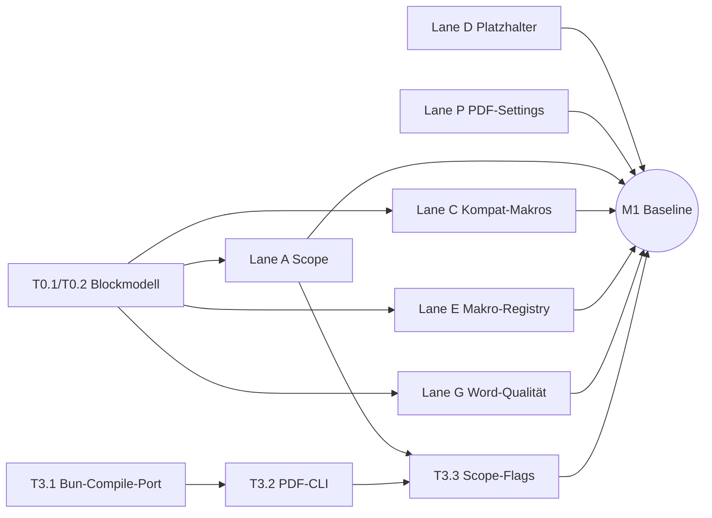

# Spec 010 — Umsetzungsplan: Reihenfolge & Parallelisierung

Status: Plan, 2026-07-18. Companion zu `BASELINE-DESIGN.md` (Task-Details mit
Code-Skizzen stehen dort; hier stehen Reihenfolge, Abhängigkeiten und
Parallelisierungs-Schnitt). Host-spezifische Ausbaustufen jenseits von CLI und
Extension werden außerhalb dieses Repos geplant.

## Feature-Ordner (je einer pro Arbeitsstrang, PLAN.md auf Englisch)

Jeder Strang hat einen Unterordner `NNN-slug/PLAN.md` mit ausführlichem,
abhakbarem Umsetzungsplan inkl. Tests (Unit mit echten Fixtures, E2E via CLI
gegen den Confluence-Space `DOCSY`, Profil `mayflower` — nie mocken):

| Ordner | Inhalt (Task-IDs) | Startbar |
|---|---|---|
| [`001-exportblock-model/`](001-exportblock-model/PLAN.md) | T0.1/T0.2 — Blockmodell + No-op-Renderings (der sequenzielle Kern) | sofort |
| [`002-scope-orchestration/`](002-scope-orchestration/PLAN.md) | A1–A5 Baum/Space/Label/Merge, Headless-Story | nach 001 |
| [`003-content-features/`](003-content-features/PLAN.md) | C1–C9 inkl. `scroll-*`-Kompatmakros, Captions, Tabellen | nach 001 |
| [`004-macro-renderer/`](004-macro-renderer/PLAN.md) | E1–E5 Registry, Jira, draw.io, export_view-Fallback | nach 001 |
| [`005-placeholders/`](005-placeholders/PLAN.md) | D1/D2 includepage & metadata | sofort |
| [`006-word-quality/`](006-word-quality/PLAN.md) | G1–G4 numPr, Spaltenbreiten, SVG, StyleRef | nach 001/003 |
| [`007-pdf-template-settings/`](007-pdf-template-settings/PLAN.md) | T2.1–T2.4 + B-Cluster Settings/Watermark/Library | sofort |
| [`008-pdf-cli/`](008-pdf-cli/PLAN.md) | T3.1–T3.5 Bun-WASM, `--format pdf`, CI/CD-DX | T3.1 sofort |
| [`009-package-publishing/`](009-package-publishing/PLAN.md) | T4.1 Packaging-Readiness (Filesystem-Linking + Tarball; registry publish deferred, product rename pending) + T4.2 API-Freeze | Infra sofort |
| [`010-extension-integration/`](010-extension-integration/PLAN.md) | T5.1–T5.5 Scope-UI, Library-UI, Vorschau, Docs | nach M1 |
| [`011-quality-gates/`](011-quality-gates/PLAN.md) | T4.3–T4.9 Harness, Benchmarks, PDF/UA, Security | wächst mit |
| [`012-pdf-template-migration/`](012-pdf-template-migration/PLAN.md) | T6.1–T6.5 Design-Token-Migration, Bindings, zweites Template | nach 007 (Parity-Gate T6.4 setzt 011s `check-parity.ts`-Harness voraus — 011 selbst läuft "wächst mit", nicht erst ab M1; 012 kann also vor M1 starten, sobald sowohl 007 als auch 011s PDF-Settings-Konformitätsfall gemergt sind) |
| [`013-isomorphic-export-jobs/`](013-isomorphic-export-jobs/PLAN.md) | T7.1–T7.7 Gemeinsame DOCX/PDF-Job-Lifecycle-Contracts, begrenzter Spool, Activity/Monitor und Host-Projektionen | nach 010; Qualitäts- und Last-Gates wachsen in 011 mit |

Leitidee: **Parallelisierung durch Datei-Ownership.** Jede Lane besitzt eine
disjunkte Menge von Paketen/Dateien; Lanes ohne gemeinsame Dateien laufen
gleichzeitig (mehrere Entwickler oder Agent-Worktrees) ohne Merge-Konflikte.
Die Hot-Files mit Mehrfach-Interesse sind explizit sequenziert bzw. per
additiver Konvention entschärft:

- `packages/confluence/src/export-blocks.ts` — gewollt von Block-Modell (C),
  Makro-Registry (E) und Scope-Komposition (A). → Ein Owner, drei geordnete
  Landungen (T1.1 → T1.4 → T1.8).
- `packages/pdf/src/{template.ts, serialize.ts, types.ts, run-export.ts}` —
  gewollt von Settings-Threading/Watermark/Kapitel-Rendering (Lane P, T2.1
  zuerst, alles Weitere baut auf `settings` auf) UND von PDF-CLI (Lane K,
  T3.3) für eine kleine additive Ergänzung (`PdfAssetRef.pageId` in
  `types.ts`, Threading in `prepare.ts`). → 007 beansprucht exklusiven
  Owner-Status für T2.1 auf allen vier Dateien; T3.3s Änderung ist die
  einzige additive Ausnahme, koordiniert per Rebase (siehe
  `008-pdf-cli/PLAN.md`). **Nachfolge-Owner von `template.ts`/
  `serialize.ts` nach 007:** `012-pdf-template-migration/PLAN.md`
  übernimmt beide Dateien für die Design-Token-Migration (T6.3), sobald
  007 gemergt ist — kein weiterer Lane-Zugriff auf diese beiden Dateien
  in 012s Umsetzungsfenster.
- `packages/confluence/src/client.ts` — zwei getrennte Konflikte: (1)
  CQL-Escaping-Helfer `escapeCqlValue` wird sowohl von 002 (Label-Filter,
  T1.2) als auch von 005 (Title-Form-Include-Lookup, D1) neu gebraucht;
  welcher Ordner zuerst landet, exportiert die Funktion, der andere
  importiert sie statt einen zweiten Helfer zu bauen (siehe
  `005-placeholders/PLAN.md`). (2) Der Pagination-Early-Break-Bug in
  `getChildrenWithPosition`/`getPageDirectChildren`/`getFolderChildren`/
  `searchPages` wird von 002 (T1.1) gefixt; `listAttachments`s fehlende
  Pagination ist ein separater Fix durch 008 (PDF-Asset-Lookup).
- `apps/cli/src/commands/export.ts` — Scope-Flags (`--scope`,
  `--label-include`/`--label-exclude`) von 002 (T3.3) und PDF-Format/
  `--label-exclude-mode`/Report-DX von 008 (T3.2–T3.4) landen in derselben
  Datei.
- `packages/confluence/src/resolve-mentions.ts` — von 001 um `orientation`-
  und `caption`-Traversal-Fälle erweitert; wird zusätzlich von 008s
  CLI-PDF-Pfad konsumiert (`resolveExportMentions`-Aufruf in
  `apps/cli/src/commands/export.ts`), ohne die Datei selbst zu ändern.

---

## Phase 1 — Baseline in den atlcli-Paketen (isomorph, alle Shapes)

Ziel: Die Engines sind vor jedem Shape-Ausbau „richtig gut": Baum-Export,
`scroll-*`-Makro-Kompatibilität, Dritt-App-Makros (draw.io, Live-Jira,
ADF-Fallback), Word-Qualität, PDF-Settings — plus CLI als erster Konsument
(CI/CD-JTBD).

### Sync-Punkt 0 (Vorbedingung, ~2 Tage, seriell)

| ID | Task | Dateien/Ort | Warum zuerst |
|---|---|---|---|
| T0.1 | `ExportBlock`-Modellerweiterung in EINEM PR: `caption?`, `pageBreak`, `orientation`, `anchor`, angereicherter `unknown` (params/body/plainBody/macroId), `StorageToBlocksOptions.exporter` | `packages/confluence/src/export-blocks.ts` (+ Typ-Re-Exports) | Alle Lanes C/E/A hängen am Blockmodell; einmal landen verhindert 3-fach-Konflikte. Exhaustive Switches in beiden Serializern erzeugen Compile-Errors = die To-do-Liste der Engines |
| T0.2 | Kompilierende No-op-Renderings für neue Blöcke in beiden Engines (Platzhalter-Verhalten wie heute) | `packages/docx/src/serialize.ts`, `packages/pdf/src/serialize.ts` | Danach ist `main` grün und alle Lanes starten parallel |

### Parallel-Lanes (nach Sync-Punkt 0 gleichzeitig startbar)

**Lane A — Scope & Orchestrierung** (Owner: `packages/confluence`, neue Dateien)
| ID | Task | Abhängig von | Aufwand |
|---|---|---|---|
| T1.1 | `export-scope.ts`, `tree-fetch.ts` (TreeSource-Port, geordneter Walk — pre-order depth-first/Dokumentreihenfolge, nicht BFS —, Zyklen-/Tiefenschutz), `compose-document.ts` (Kapitel, Heading-Offset, Anker-Namespacing) | T0.1 | L |
| T1.2 | Label-Filter (Include/Exclude, OR, prune-subtree) via CQL + lokale Filterung | T1.1 | S |
| T1.3 | Engine-Integration: Kapitel-Merge durch beide Serializer (Kapitel = Heading-Baum; PDF: `pagebreak()` je Kapitel optional) + Golden-Tests Mehrseiten-Dokument | T1.1, T0.2 | M |

**Lane C — Content-Features & Kompatibilitätsmakros** (Owner: `export-blocks.ts`-Walker + Engine-Rendering der neuen Blöcke)
| ID | Task | Abhängig von | Aufwand |
|---|---|---|---|
| T1.4 | `walkMacro` lernt `scroll-*`-Kompatibilitätsmakros: scroll-only/-ignore (exporter-sensitiv), scroll-pagebreak, scroll-landscape/-portrait, scroll-title→`caption` | T0.1 | M |
| T1.5 | Engine-Rendering: DOCX `w:br type=page` + Sektionswechsel (Landscape), Captions via SEQ-Felder; PDF `pagebreak()`, `page(flipped:)`-Region, `figure(caption:)` | T0.2, T1.4 | M |
| T1.6 | Tabellen-Härtung: Typst `table.header(repeat: true)` verifizieren + 200-Zeilen-Golden; Overflow-Strategie breiter Tabellen | T0.2 | S |

**Lane E — Dritt-App-Makros** (Owner: neues Paket `packages/export-macros`)
| ID | Task | Abhängig von | Aufwand |
|---|---|---|---|
| T1.7 | `MacroRendererRegistry`-Port + Async-Resolver-Pass zwischen `storageToBlocks` und Engine; Fallback-Kette (nativ → Renderer → export_view/ADF → Platzhalter+Report) | T0.1 | M |
| T1.8 | **Live-Jira-Renderer**: JQL aus Makro-Params, `@atlcli/jira`-Client, Rendering als echte Tabelle (Differenzierungs-Feature) | T1.7 | M |
| T1.9 | **draw.io/Gliffy-Renderer**: Preview-PNG-Attachment des Makros auflösen (Spike: Attachment-Namenskonvention verifizieren!), sonst export_view-Fallback | T1.7 | M |
| T1.10 | **ADF/export_view-Fallback**: Confluence `body.export_view` (bzw. ADF) für unbekannte Makros rendern → HTML-Subset→ExportBlock-Konverter; deckt „most third-party macros" ab | T1.7 | L |

**Lane D — Platzhalter** (Owner: `packages/docx/src/{placeholder-map,resolver}.ts`)
| ID | Task | Abhängig von | Aufwand |
|---|---|---|---|
| T1.11 | D1 `$scroll.includepage.(…)`: Dokument-Pass (rawxml), `getIncludedPage`-Dep, Zyklenschutz, Berechtigungs-Fehlerbild | — (Dateien disjunkt zu A/C/E) | M |
| T1.12 | D2 `$scroll.metadata.(…)` Reklassifikation + Resolver (Cloud-Evidenz beachten) | — | S |

**Lane G — Word-Qualität** (Owner: `packages/docx/src/{serialize,ooxml,image}.ts` — Achtung: `serialize.ts` auch von T0.2/T1.5 berührt → G startet nach T1.5-Merge oder koordiniert per Rebase)
| ID | Task | Abhängig von | Aufwand |
|---|---|---|---|
| T1.13 | G2 natives `w:numPr`/numbering.xml (Multilevel, List-Styles-Mapping) | T0.2 | M |
| T1.14 | G3 `w:tblGrid` aus `columnWidths` | T0.2 | S |
| T1.15 | G4 SVG-Embedding (svgBlip-Pfad aus `image.ts` wiederverwenden, Sanitizing aus `pdf/prepare.ts` teilen) | — | M |
| T1.16 | G1 StyleRef-Verifikation (OOXML-Invarianten + LibreOffice-Paket/Header-Smoke; Feldsemantik manuell) | — | S |

**Lane P — PDF-Template-System** (Owner: `packages/pdf`)
| ID | Task | Abhängig von | Aufwand |
|---|---|---|---|
| T2.1 | `settings`-Threading: `PdfSerializeOptions`→`main.typ`; Vertrag `wiki.pdf-template/v1` `render(meta, body, settings)` stabilisieren | — | M |
| T2.2 | Settings Level A: Seitenformat A4/Letter, Orientierung, Cover/Outline-Toggles, Header/Footer-Text | T2.1 | S |
| T2.3 | **Watermark** (rotierter Text-Layer; Quick Win) | T2.1 | S |
| T2.4 | TemplateLibrary-Abstraktion (`packages/core/src/template-library.ts`, pure `resolveTemplate` global/space) + `.wiki-pdf-template`-Containerformat (beide Engines) | — | M |

**Lane K — CLI (CI/CD-JTBD, erster Konsument der Baseline)** (Owner: `apps/cli`)
| ID | Task | Abhängig von | Aufwand |
|---|---|---|---|
| T3.1 | **PDF-Compile-Port für Bun/Node**: `BrowserPdfCompiler` unter Bun betreiben (wasm-Init ohne DOM) oder dünnes `pdf-compiler-node`; Spike zuerst | — (kritischer Pfad für PDF-CLI!) | M |
| T3.2 | `atlcli wiki export --format pdf` (Single-Page) mit T3.1 | T3.1 | S |
| T3.3 | `--scope tree|space`, `--label-include/--label-exclude` für DOCX(ts)+PDF | T1.1–T1.3, T3.2 | M |
| T3.4 | CI/CD-DX: `--report json`, deterministische Exit-Codes, `--out-dir`, Doku-Rezepte (GitHub Action/GitLab CI), `--profile`-freier Token-Modus für CI | T3.2 | S |
| T3.5 | ts-Engine als CLI-Default vorbereiten (Parität python→ts messen, Migrationshinweis) | T1.3, T1.13 | S |

### Meilenstein M1 („Baseline richtig gut")
Alle Lanes gemerged; Abnahme: Baum-Export eines 50-Seiten-Baums mit Labels,
`scroll-*`-Makros, draw.io-Diagrammen und Jira-Tabelle aus CLI **und** Harness
(`apps/browser-export-harness`-Konformitätsfälle erweitert, T4.6) — DOCX und
PDF, byte-stabil in Goldens.

---

## Phasen 2+3 — Parallele Welle: CLI+Extension ∥ externer Paket-Konsument

Nach M1 laufen zwei unabhängige Tracks. **Track 1 (CLI+Extension)** ist das
heutige atlcli-Produkt und wird immer zusammen gedacht (gleiche Engines, ein
Release). **Track 2** ist ein extern entwickelter Konsument der publizierten
Pakete. Einzige Kopplung: der Paket-Vertrag (T4.1) — daher zuerst dessen
Freeze.

### Sync-Punkt 1: Paket-Vertrag (damit externe Konsumenten die Pakete versioniert beziehen können)

| ID | Task | Inhalt |
|---|---|---|
| T4.1 | **Packaging-Readiness für `@atlcli/*`** (vormals "Publishing-Pipeline"; registry publish deferred, product rename pending — siehe `009-package-publishing/PLAN.md`, Goal & Deferred-Anhang): Pakete sind heute `private:true`-Workspace-Interna. Nötig: Build-Artefakte (dist statt src-Exports), semver-Disziplin, Konsumierbarkeit via Filesystem-/Workspace-Linking (`file:`/`bun link`) und gepackte Tarballs (`bun pm pack`), inkl. `@atlcli/pdf-compiler-browser` (wasm + Patch!), `.fonts`-Handling (`ensure-fonts` beim Consumer vs. Paket mit Fonts). Ein Publish nach npm/GitHub Packages ist bewusst nicht Teil des aktiven Scopes. |
| T4.2 | API-Stabilisierung: `ExportEnv`/`PdfExportEnv`/`TreeSource`/`MacroRendererRegistry` als dokumentierte öffentliche Schnittstelle (Breaking-Change-Policy) |

### Track 1 — CLI + Browser-Extension (heutiges Produkt)

Parallel-Teilstränge (disjunkte Ownership in `apps/extension`):
| ID | Task | Abhängig von |
|---|---|---|
| T5.1 | Extension-UI: Scope-Auswahl (Seite/Baum/Space), Label-Filter, Fortschritt/Abbruch über `onPhase` (Lane A) | M1 |
| T5.2 | Template-Library-UI: Multi-Slot statt `"current"` (IndexedDB-Migration), global/space-Auflösung, Settings-Formular aus Template-Manifest (Lane P) | M1, T2.4 |
| T5.3 | **Sofort-PDF-Vorschau** im Panel (warmer Worker, erste N Seiten, debounced) | M1 |
| T5.4 | Makro-Renderer-Wiring: Session-Fetch-Adapter für Jira/drawio/export_view in der Extension; CLI: Token-Auth-Adapter | M1 |
| T5.5 | Docs (`docs/` first-class): Feature-Guides Baum-Export, Kompatibilitäts-Matrix der unterstützten `scroll-*`-Makros, CI/CD-Rezepte; Release + CHANGELOG | alle T5.x |

### Track 2 — Externer Paket-Konsument

Ein weiterer, extern entwickelter Host konsumiert die publizierten Pakete;
dessen Planung liegt außerhalb dieses Repos (einzige Kopplung: T4.1/T4.2).

---

## Phase 4 — Sonstiges (nicht vergessen)

| ID | Task | Begründung |
|---|---|---|
| T4.3 | **Benchmark-Suite Groß-Export** (500-Seiten-Fixture, Speicherbudget, Zeit) — Vorstufe zu Kapitel-Streaming (Later) | Versprechen erst nach Messung |
| T4.4 | **PDF/UA-Pfad**: veraPDF im CI, Alt-Text-/Sprach-Audit, ehrliches Conformance-Statement (EAA) | Beschaffungskriterium EU |
| T4.5 | **Audit-Modus** (Provenienz-Metadaten, reproduzierbarer Re-Export, Signatur-Hook) — Differenzierungs-Feature | JTBD Compliance |
| T4.6 | **Konformitäts-Harness ausbauen**: Playwright-Fälle im `browser-export-harness` für jede neue Baseline-Fähigkeit = Shape-Paritätsgarantie (läuft ab Phase 1 mit, pro Lane ein Fall) | verhindert Shape-Drift |
| T4.7 | **Security-Review**: Template-/Font-Import-Härtung (Zip-Traversal, sha256), SVG-Sanitizing im DOCX-Pfad (heute nur PDF), `/security-review` vor jedem Release | Vertrauensbasis für alle Distributionskanäle |
| T4.8 | E2E-Testressourcen & Aufräum-Disziplin (Profil `mayflower`, Space `DOCSY` laut CLAUDE.md) für die neuen Scope-/Makro-Fälle | Workflow-Regel |
| T4.9 | Backlog bewusst geparkt: RTL-Support, Multi-Space-Export, Index/Verzeichnisse (C1/C2), Named Destinations (C7), D4 PDF-Platzhaltersystem, Kapitel-Streaming | bewusst auf „Later" gesetzt |

---

## Kritischer Pfad & maximale Gleichzeitigkeit

- **Kritischer Pfad:** T0.1→T0.2 → T1.1→T1.3 → T3.3 → M1 → T4.1.
- **Sofort und unabhängig startbar (auch vor T0):** T3.1
  (Bun-Compile-Port), T1.16 (StyleRef-Test), T2.1 (Settings-Threading), T2.4
  (TemplateLibrary), T1.11/T1.12 (Platzhalter), T4.6 (Harness-Gerüst).
- **Peak-Parallelität nach T0:** 7 Lanes (A, C, E, D, G, P, K) + Harness =
  bis zu 8 gleichzeitige Arbeitsstränge ohne Datei-Konflikte — geeignet für
  Agent-Worktrees (`isolation: worktree`) oder mehrere Entwickler.
- **Merge-Ordnung bei Konflikt:** T0-PRs zuerst, dann gilt je Hot-File die in
  der Kopfzeile genannte Reihenfolge; Lanes rebasen täglich auf `main`.
