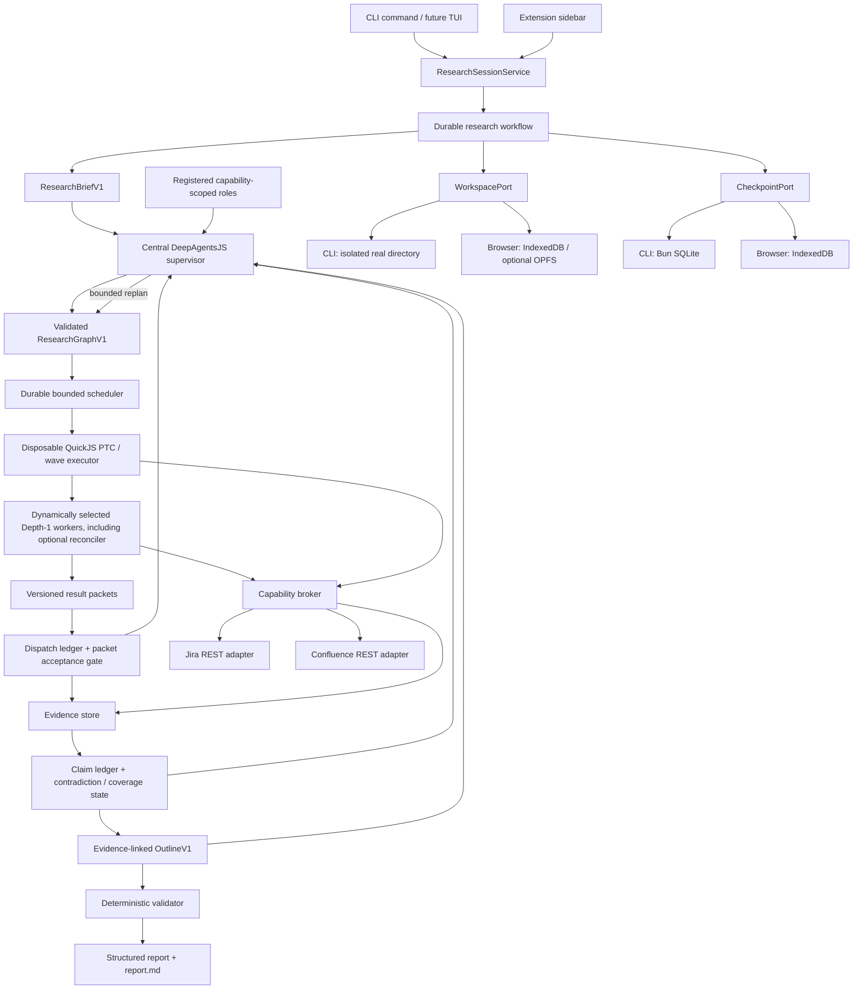

# Host-agnostic durable Jira and Confluence research agent

- Status: Implementation-ready
- Planning baseline: `5fd856a` (`codex/issue-138-deepagents-research`,
  2026-07-31)
- Supersedes: none
- Builds on: issue #138 / Draft PR #139
- Target model for the first implementation: `claude-sonnet-4-6`

## Review summary

Build one evidence-first research runtime that treats the CLI and the
extension/browser as equal product hosts:

- one central DeepAgentsJS supervisor owns the brief, dynamically composes a
  typed research graph from a closed registry of capability-scoped subagent
  roles, replans between bounded waves, accepts or rejects their outputs, and
  owns publication; for report-producing runs exactly one final `synthesizer`
  subagent normally authors the structured report draft;
- the CLI initially accepts one question as a positional argument, uses an
  atlcli profile such as `mayflower`, creates a real isolated session
  directory, and writes the canonical Markdown report;
- the extension keeps its browser-session authentication and sidebar UI, but
  implements the same session, workspace, evidence, progress, and report
  contracts through browser-specific adapters;
- the CLI is the faster real-data E2E lane, while packed and live browser tests
  remain independent acceptance gates. CLI proof never substitutes for MV3
  lifecycle, browser-session, CSP, worker-restart, or IndexedDB proof;
- a logical session survives process or worker loss. No design may depend on a
  CLI process, MV3 service worker, offscreen document, dedicated worker, or
  QuickJS interpreter remaining alive;
- dynamic composition means that the supervisor chooses the number, role,
  objective, dependencies, fan-out, and optional self-critique/reconciliation
  nodes for each question and writes the task-shaped QuickJS orchestration
  program for the accepted graph. It does not mean unbounded role creation,
  arbitrary tools, recursive agent trees, or model-owned durable state;
- Jira project and Confluence space discovery are first-class read-only
  research capabilities. The supervisor and dynamically selected subagents may
  search bounded catalogs, resolve natural-language scope mentions, and
  propose related scopes discovered from exact references. Discovery never
  silently authorizes content retrieval from a new project or space;
- Markdown remains the canonical report artifact. DOCX/PDF conversion consumes
  that artifact in a later plan and does not become part of the research
  runtime.

The first implementation is local-first and pause/resume. Continuing work while
both the CLI and browser are closed requires a later local daemon or remote
runner and is explicitly outside this plan.

The fastest architecture proof ends after T3: one shared runtime, an equal
one-shot CLI/browser contract, a dynamically composed `ResearchGraphV1`,
bounded Depth-1 subagent waves, and an optional fresh-context reconciler. T4
through T9 then add durable steering, full evidence semantics, broader
retrieval, long-session context, product UX, and release evidence without
replacing the T3 contracts.

## Why this is needed

Issue #138 proved that DeepAgentsJS, `@langchain/quickjs`, an Anthropic model,
and four host-owned read capabilities can produce a bounded, cited Markdown
report in a packed MV3 extension and against real Jira and Confluence data.
That spike intentionally excluded chat history, durable memory, subagents,
filesystem tools, and long-running sessions.

The current implementation cannot become a durable research agent merely by
keeping its worker alive:

- `apps/extension/utils/research/agent-runtime.ts` creates a fresh
  `thread_id` from the run ID and disables the filesystem, summarization,
  subagent, and patch middleware.
- `apps/extension/utils/research/worker-host.ts` creates and terminates one
  dedicated worker per run.
- `apps/extension/utils/research/agent-runtime.ts` forces one fixed QuickJS
  acquisition call and reads only the first three Jira and first three
  Confluence details.
- `apps/extension/utils/research/contracts.ts` exposes one `run()` operation,
  not sessions or turns.
- `apps/extension/utils/research/capability-contracts.ts` exposes only four
  capabilities and a single optional text query.
- `apps/extension/scripts/research-agent-live-mayflower.ts` already proves that
  profile-authenticated Node/Bun execution is possible, but it imports runtime
  code from the extension and is not a product CLI path.

The repository also contains reusable lifecycle patterns:

- `packages/export-jobs/src/store-contracts.ts` defines revision-fenced state
  transitions, leases, checkpoints, events, and retention.
- `apps/extension/utils/export-jobs/catalog.ts` implements those patterns over
  IndexedDB and proves recovery across browser lifecycle loss.
- `packages/jira/src/client.ts` and `packages/confluence/src/client.ts` already
  expose richer read operations such as comments, issue fields, page
  hierarchy, labels, versions, and comments.

Reuse the lifecycle principles, not the export-job types. Research sessions
need their own contracts and stores.

## Research-informed architecture decisions

These sources justify the design direction but do not replace repository and
runtime tests:

- LangChain's 2026
  [dynamic-subagent design](https://www.langchain.com/blog/introducing-dynamic-subagents-in-deep-agents)
  and
  [JavaScript contract](https://docs.langchain.com/oss/javascript/deepagents/dynamic-subagents)
  prove that the parent agent writes task-specific JavaScript using QuickJS
  `task()`, fan-out, branching, multiple waves, and structured
  `responseSchema` outputs. The patterns emerge from the task rather than from
  a configured fixed pipeline. The installed package remains the source of
  truth for exact lifecycle and safety behavior.
- Anthropic's 2026
  [dynamic-workflow harness guidance](https://claude.com/blog/a-harness-for-every-task-dynamic-workflows-in-claude-code)
  explicitly describes fan-out-and-synthesize, adversarial verification, and
  deep research that fans out search, verifies claims, and synthesizes a cited
  report. It also cautions that the concrete harness is generated for the task
  and that these patterns should be composed rather than run as a mandatory
  all-role pipeline.
- Anthropic's
  [multi-agent research report](https://www.anthropic.com/engineering/multi-agent-research-system)
  supports isolated breadth-first workers and compact handoffs, but also
  reports materially higher token cost. Subagents therefore remain conditional
  and budgeted rather than universal.
- Google's 2026
  [agent-scaling study](https://research.google/blog/towards-a-science-of-scaling-agent-systems-when-and-why-agent-systems-work/)
  found centralized coordination helpful for parallelizable work and harmful
  multi-agent overhead for sequential work. This plan keeps planning, control,
  gap decisions, acceptance, and publication in one supervisor while
  delegating report authorship to one bounded final synthesizer when a report
  is requested.
- Atlassian's
  [Rovo Deep Research v2 architecture](https://www.atlassian.com/blog/artificial-intelligence/rovo-deep-research-v2)
  motivates a shared editable plan, dynamic outline, evidence/claim memory,
  targeted gap research, proofreader-style reconciliation, async progress, and
  reconnectable execution.

Vendor benchmark numbers are directional self-reports. The T3 and T9
cross-host evaluations decide whether each technique carries for this
Jira/Confluence product and pinned model/runtime.

## Product outcome

After all required phases, a user can:

1. run a one-shot question from the CLI or extension and receive the same
   schema and canonical Markdown report;
2. resume the same research session in the same host after a process, worker,
   offscreen document, service worker, or browser restart;
3. ask follow-up questions without replaying the entire conversation into the
   model;
4. inspect the plan, evidence coverage, sources, claims, limitations, and
   current report;
5. review and approve a proposed deep-research plan, steer priorities or
   exclusions at durable checkpoints, and inspect the resulting plan diff;
6. see which subagent roles were dynamically selected, which tasks they
   received, what budgets they consumed, and why an optional reconciliation
   pass did or did not run;
7. distinguish facts, inferences, hypotheses, stale evidence, contradictory
   evidence, and insufficient evidence;
8. delete a session and all locally retained source material;
9. use the CLI as a fast real-data E2E harness while retaining independent
   packed and live browser gates;
10. name an Atlassian scope naturally, such as "the account management
    space", let the agent resolve a unique accessible candidate, and choose
    among bounded candidates when the name is ambiguous;
11. see whether scope came from an explicit CLI flag, a manually added browser
    context, the question, the active Jira/Confluence page, a profile default,
    or a discovered exact reference; and
12. let the agent discover related projects, spaces, pages, or issues during
    research while retaining central, visible control over every resulting
    content-scope expansion.

This plan does not promise uninterrupted computation while every host is
closed. It promises durable state and correct resumption.

## Required invariants

### Host equality

- Shared packages own all request, session, turn, event, evidence, claim,
  capability, budget, report, and Markdown contracts.
- A shared orchestration path owns the research state machine, DeepAgents
  configuration, QuickJS PTC tools, evidence validation, and report
  finalization.
- CLI and extension hosts supply storage, authentication, lifecycle,
  presentation, and delivery adapters only.
- A browser-only type (`chrome.*`, `IDB*`, `Window`, `Worker`) and a Node-only
  type (`PathLike`, `Buffer`, `BunFile`, real filesystem path) must never appear
  in a shared public contract.
- Shared virtual paths use POSIX-style absolute paths regardless of the host.
  The agent never observes a real CLI path or an IndexedDB key.

### Central supervision and dynamic composition

- Exactly one central supervisor owns `ResearchBriefV1`, the current
  `ResearchGraphV1` revision, replanning, budget allocation, acceptance or
  rejection of subagent proposals, repair decisions, final acceptance, and
  publication. It normally does not author report prose.
- The supervisor dynamically selects only registered subagent roles. The
  initial registry contains focused researcher, document distiller,
  contradiction verifier, coverage moderator, outline planner, and
  reconciler roles plus one `synthesizer` role. No research or critique role is
  mandatory for every run; exactly one synthesizer is mandatory only when the
  requested terminal artifact is a report.
- A role definition fixes its description, allowed capabilities, supported
  versioned output schemas, activation phase, maximum per-node budget, and
  whether it may propose follow-up work. The dispatch ledger selects exactly
  one supported schema per task. The supervisor may vary composition but may
  not widen those boundaries.
- Research and critique subagents may propose evidence, claims,
  contradictions, gaps, outline changes, follow-ups, or reconciliation
  defects. The final synthesizer may author one schema-bound candidate report
  from accepted packets and reconciliation dispositions. No subagent may
  commit a graph revision, accept evidence, finalize an outline, approve a
  claim, render trusted Markdown, or publish a report.
- The general-purpose DeepAgents subagent remains disabled. Initial subagent
  depth is exactly one; subagents cannot spawn subagents.
- `ResearchGraphV1` is authoritative durable state. `/workspace/plan.md` is a
  human-readable projection and must never become the only copy of the plan.
- The host validates every graph revision for acyclicity, known role and
  capability IDs, scope, depth, node count, fan-out, dependency closure,
  budgets, and checkpoint revision before execution.
- The supervisor writes task-specific QuickJS orchestration code for the
  host-validated graph and role catalog. The code may use loops, branches, and
  `Promise.all` groups, but every `task()` dispatch is checked by the
  research-owned dispatch ledger against the accepted node, role, schema,
  capability, concurrency, and budget envelope. The committed graph and
  ledger, not generated JavaScript or the QuickJS heap, remain the durable
  workflow definition.
- Reconciliation is dynamically composed. A fresh-context `reconciler`
  subagent runs only when the graph policy or supervisor identifies material
  complexity, contradictions, weak coverage, high-impact claims, or an
  explicit user request. It returns defects and suggested actions, never the
  authoritative report.
- The supervisor records whether each reconciliation defect was accepted,
  rejected, or converted into a bounded follow-up node. The deterministic
  validator remains the final authority over claims and Markdown.
- After critique and any permitted repair wave, exactly one fresh-context
  `synthesizer` receives only accepted packets, dispositions, unresolved gaps,
  and the report contract. The supervisor accepts or rejects that typed draft
  and hands it to the deterministic finalizer without silently rewriting it.

### Scope discovery and authority

- Catalog discovery and content authority are separate. The host may grant
  `jira.project.search`, `wiki.space.search`, and
  `atlassian.reference.resolve` to any validated PTC or subagent node whose
  task needs them. Catalog results are candidates, not approved content scope.
- Exactly one central supervisor owns scope-resolution and scope-expansion
  proposals. Subagents may return mentions, candidates, exact references, and
  reasons to inspect a related scope; they may not commit a binding or widen
  `ResearchScopeV1`.
- Scope sources have deterministic precedence:
  1. explicit repeatable CLI keys and manually added browser contexts;
  2. explicitly named scopes in the natural-language question;
  3. the extension's detected current Jira project or Confluence space;
  4. profile and global defaults;
  5. related scopes discovered during research.
  A lower-precedence source never silently replaces a higher-precedence
  binding. Explicit CLI and manually added UI bindings are `locked` unless the
  user changes them.
- A unique, exact, accessible key or normalized-name match may resolve
  automatically and remains visible in the brief. Duplicate names, multiple
  plausible aliases, an explicitly requested but unavailable scope, or
  weak-only matches produce a bounded `ResearchClarificationRequiredV1`; the
  model never guesses or receives hidden inaccessible-scope metadata.
- Deterministic ranking considers exact key, exact normalized name, explicit
  alias/acronym, current-host context, and exact link before prefix or fuzzy
  similarity. Fuzzy similarity alone can shortlist candidates but cannot
  auto-resolve one.
- A truncated catalog cannot prove that a name is unique. It returns an
  incomplete resolution unless uniqueness is established by an exact
  provider key/ID lookup or a characterized provider exact-query guarantee.
- A model-proposed natural-language mention must be anchored to an exact
  character range in the accepted user question. The host verifies the range
  and normalization before any catalog call; invented scope names are rejected
  as invalid proposals.
- Discovery has three authority levels:
  1. catalog metadata: bounded key/name/type/status/URL identity and match
     reason, usable without content-scope expansion;
  2. one exact linked entity: a single page or issue, readable only when
     separately preauthorized or approved;
  3. whole-scope search: a Jira project or Confluence space, requiring an
     approved binding in the current envelope.
- The default expansion policy is `ask`: metadata discovery is available,
  while both exact linked-entity reads and whole-scope expansion wait for a
  visible revision-fenced approval. `strict` records candidates but forbids
  out-of-scope reads; `exact-linked` preauthorizes only bounded exact
  linked-entity reads and still asks before whole-project or whole-space
  search.
- The central supervisor may accept an already approved candidate, reject it,
  or emit `ResearchScopeExpansionProposalV1`. An out-of-envelope proposal
  pauses before content retrieval and shows a scope-specific plan diff. No
  tenant-wide automatic expansion is permitted.
- Catalog operations have separate page, candidate, byte, call, timeout, and
  expansion budgets. Only a bounded top-candidate projection reaches a model
  or QuickJS. Provider cursors remain host-owned and opaque.
- Project/space names, descriptions, URLs, and reference labels are untrusted
  source strings. They cannot add tools, change policy, override a locked
  binding, or become instructions.
- Catalog caches are session-, tenant-, and user-bound, record freshness, and
  are invalidated by permission loss. Cross-tenant candidates or references
  fail closed.

### Security and permissions

- The Anthropic key and Atlassian credential/session never enter QuickJS,
  prompts, workspace files, checkpoints, events, evidence, reports, telemetry,
  or logs.
- QuickJS receives no `fetch`, raw HTTP, raw JQL, raw CQL, GraphQL, Chrome API,
  process, shell, module loader, or unrestricted filesystem capability.
- Every Atlassian operation is read-only, allowlisted, tenant-bound,
  user-bound, scope-clamped, paginated, byte-bounded, time-bounded, and
  cancellable.
- Every subagent dispatch has a host-issued task ID and is checked against
  global and per-node call, token, byte, wall-clock, cost, concurrency, and
  attempt budgets before a model call begins.
- Do not rely on `@langchain/quickjs` `maxPtcCalls` to limit `task()`:
  installed version `1.0.0` does not count native subagent dispatches against
  that budget. The host dispatch ledger is mandatory.
- An interpreter timeout is not cancellation. The host propagates abort to
  every provider/model call, quarantines late results from expired attempts,
  and makes retry/replay idempotent.
- Apply a host-side byte and schema limit to every interpreter and subagent
  result. Do not rely on the installed interpreter's `maxResultChars` for
  returned values.
- No correctness, deadline, or replay decision may depend on guest
  `Date.now()` or `Math.random()`. The host injects accepted timestamps and
  deterministic IDs.
- CLI filesystem access is rooted in one newly created session directory and
  rejects absolute-path, parent-traversal, and symlink escapes.
- Browser storage is namespaced by tenant origin, local user identity when
  available, and session ID. A session from one origin must be unreadable from
  another origin.
- Permission loss, session expiry, `401`, `403`, and deleted content invalidate
  the affected cached evidence instead of silently serving it as current.
- Customer content, tenant identifiers, private reports, and Rovo outputs are
  never committed as fixtures, snapshots, logs, specifications, or PR text.

### Durability

- `sessionId`, `turnId`, and `runId` are distinct:
  - `sessionId` identifies the durable conversation and workspace;
  - `turnId` identifies one accepted user question;
  - `runId` identifies one execution attempt and may change after recovery.
- A stable LangGraph `thread_id` derives from `sessionId`, never from `runId`.
- Accepted user input is durably recorded before the first model or Atlassian
  call.
- Recovery guarantees exactly-once acceptance and authoritative state effects,
  not impossible exactly-once external execution. Every call records
  `dispatch_started`, `result_committed`, or `outcome_unknown`; accepted
  packets are reused. After an unknown outcome, a bounded retry may duplicate
  a provider/model invocation and must be counted and disclosed. Use provider
  request IDs or idempotency support only where the provider actually offers
  them.
- Every graph node is persisted as `proposed` or `ready` before dispatch and
  transitions through revision-fenced `running`, terminal, retry, or
  quarantined states. A recovered scheduler reuses accepted packets and never
  blindly redispatches a completed node.
- Checkpoints contain graph state and opaque references, not duplicate copies
  of full evidence bodies.
- QuickJS is disposable. Anything required after one interpreter call is
  written through a host-owned workspace or evidence operation.
- Native `task()` returns only a validated `ResearchPacketBodyV1`,
  `ResearchPacketBodyV2`, or `ReconciliationBodyV1`. The host binds it to the
  dispatch ledger as `ResearchAcceptedPacketV1` before the supervisor sees it.
  Do not depend on child `StateBackend` filesystem updates being merged into
  parent state.
- Every store has bounded list operations, quotas, retention, and idempotent
  deletion.

### Accuracy

- Conversation summaries are navigation aids, never evidence.
- A model-authored workspace file is not a source merely because it persists.
- Every factual claim cites one or more existing evidence IDs and supporting
  spans.
- A relationship is `verified` only when source content contains an exact link,
  issue key, content ID, or another explicitly defined deterministic proof.
  Semantic similarity alone produces a hypothesis.
- Negative claims state their coverage and may not generalize beyond fetched,
  non-truncated evidence.
- Reused evidence records `retrievedAt`, source version or `updatedAt`, content
  hash, scope fingerprint, completeness, and truncation.
- Evidence used after a configured freshness interval is revalidated before a
  report is finalized.
- The deterministic finalizer rejects unknown source IDs, stale source
  references, missing supporting spans, out-of-scope entities, and claims whose
  classification is stronger than their proof.
- Model-authored critique, confidence, coverage, or reconciliation is advisory.
  It may trigger additional bounded research or downgrade a claim, but it may
  not make an unsupported claim valid.
- The final Markdown is rendered by shared deterministic code from a validated
  report. The model never supplies trusted Markdown.

### Time semantics

- Every turn records an explicit `asOf` instant and display timezone.
- Relative phrases such as "last seven days" resolve once against `asOf`; the
  resolved inclusive/exclusive interval is stored in the turn and printed in
  the report.
- Recovery reuses the accepted turn's `asOf`; it does not silently move the
  question's time window.

### Markdown

- `/artifacts/report.md` is the canonical human-readable result on every host.
- The structured report remains the canonical machine-readable result.
- CLI stdout, CLI `--output`, extension formatted view, extension raw view,
  copy, and download all consume the same Markdown bytes.
- Future DOCX/PDF exporters consume the validated structured report or
  canonical Markdown through an explicit adapter. They do not parse a model
  response.

## Target architecture



The DeepAgents filesystem view uses a composite route:

```text
/workspace/       writable session scratch and plans
/artifacts/       writable, versioned user-facing artifacts
/evidence/        host-written and agent-read-only
/session/         host-written session metadata and summaries
```

Do not add cross-session `/memories/` in this plan. Durable per-session state is
required; user preferences or factual memory shared between unrelated sessions
need a separate privacy and product decision.

## Target package and host layout

Create one shared package with environment-specific runtime entrypoints:

```text
packages/research/
  package.json
  src/
    index.ts                     # JSON-safe contracts and pure functions
    contracts.ts
    capability-contracts.ts
    budget.ts
    brief.ts
    session.ts                   # pure state transitions
    session-store.ts             # ports only
    workspace.ts                 # virtual workspace port
    evidence.ts
    claims.ts
    research-graph.ts
    graph-validator.ts
    scheduler.ts
    subagent-registry.ts
    packets.ts
    reconciliation.ts
    outline.ts
    context-projection.ts
    provenance.ts
    query-plan.ts                # typed retrieval intents only
    report.ts
    markdown.ts
    agent-config.ts              # shared prompts/config, no environment import
    agent-tools.ts
    runtime.ts                   # injected harness/backend/checkpointer
    browser.ts                   # browser-safe DeepAgents entrypoint
    node.ts                      # Node/Bun DeepAgents entrypoint
    testing.ts                   # deterministic scenarios/fakes
```

Keep host adapters in their applications:

```text
apps/cli/src/commands/research.ts
apps/cli/src/research/
  command-options.ts
  profile-provider.ts
  filesystem-workspace.ts
  sqlite-checkpointer.ts
  session-catalog.ts
  session-control.ts
  live-e2e.ts

apps/extension/utils/research/
  indexeddb-workspace.ts
  indexeddb-checkpointer.ts
  indexeddb-session-catalog.ts
  session-control.ts
  browser-provider.ts
  worker-host.ts
```

The exact filenames may be consolidated when two files would contain fewer
than roughly 100 meaningful lines, but the dependency directions may not be
changed:

```text
packages/research <- apps/cli
packages/research <- apps/extension

apps/cli -X-> apps/extension
apps/extension -X-> apps/cli
packages/research -X-> chrome / DOM / node:fs / bun:sqlite
```

`packages/research/src/browser.ts` and `node.ts` are allowed to expose
environment-specific factories, but shared contracts and state transitions
must remain importable from the root entrypoint in both environments.

## Versioned contracts

Add versioned JSON-safe contracts rather than widening the issue-138 request in
place.

### Brief, effort, and approval

```ts
type ResearchRequestedEffortV1 = "auto" | "lookup" | "analysis" | "deep";
type ResearchResolvedEffortV1 = "lookup" | "analysis" | "deep";
type ResearchRequestedPlanApprovalV1 = "default" | "automatic" | "required";
type ResearchResolvedPlanApprovalV1 = "automatic" | "required";
type ResearchRequestedReconciliationV1 = "off" | "auto" | "required";

interface ResearchCoverageTargetV1 {
  id: string;
  question: string;
  required: boolean;
  sourceClasses: Array<"jira" | "confluence">;
  minimumDistinctSources: number;
}

interface ResearchClarificationQuestionV1 {
  id: string;
  prompt: string;
  required: boolean;
  scopeMentionId?: string;
  candidateIds?: string[];
}

interface ResearchBriefAssumptionV1 {
  id: string;
  text: string;
  requiresUserDecision: boolean;
  status: "proposed" | "accepted" | "rejected";
}

type ResearchScopeProductV1 = "jira" | "confluence";
type ResearchScopeEntityKindV1 =
  | "project"
  | "space"
  | "issue"
  | "page";
type ResearchScopeSourceV1 =
  | "cli_flag"
  | "ui_added"
  | "natural_language"
  | "current_context"
  | "profile_default"
  | "global_default"
  | "exact_link"
  | "research_discovery";
type ResearchScopeAuthorityV1 =
  | "candidate"
  | "resolved"
  | "approved"
  | "locked";
type ResearchScopeExpansionModeV1 =
  | "strict"
  | "ask"
  | "exact-linked";

interface ResearchScopeMentionV1 {
  schema: "atlcli.research-scope-mention/v1";
  id: string;
  productHint?: ResearchScopeProductV1;
  entityKindHint?: ResearchScopeEntityKindV1;
  source: ResearchScopeSourceV1;
  text: string;
  normalizedText: string;
  questionTextRange?: { start: number; end: number };
  exactReference?: string;
}

interface ResearchScopeCandidateV1 {
  schema: "atlcli.research-scope-candidate/v1";
  id: string;
  tenantOrigin: string;
  product: ResearchScopeProductV1;
  entityKind: ResearchScopeEntityKindV1;
  entityRef: string;
  key?: string;
  name: string;
  canonicalUrl?: string;
  status?: "current" | "archived";
  match:
    | "exact_key"
    | "exact_name"
    | "alias"
    | "current_context"
    | "exact_link"
    | "prefix"
    | "fuzzy";
  accessible: true;
  providerFreshnessAt: string;
}

interface ResearchScopeBindingV1 {
  schema: "atlcli.research-scope-binding/v1";
  id: string;
  tenantOrigin: string;
  product: ResearchScopeProductV1;
  entityKind: ResearchScopeEntityKindV1;
  entityRef: string;
  key?: string;
  name: string;
  source: ResearchScopeSourceV1;
  authority: ResearchScopeAuthorityV1;
  mentionId?: string;
  candidateId?: string;
  approvedAt?: string;
}

interface ResearchScopeResolutionV1 {
  schema: "atlcli.research-scope-resolution/v1";
  mentionId: string;
  state:
    | "resolved"
    | "ambiguous"
    | "not_found"
    | "unavailable"
    | "incomplete";
  candidateIds: string[];
  resolvedCandidateId?: string;
  uniquenessProof?:
    | "exact_key_lookup"
    | "exact_reference_lookup"
    | "provider_exact_query"
    | "complete_catalog";
  catalogComplete: boolean;
  requiresUserChoice: boolean;
}

interface ResearchScopeDiscoveryPolicyV1 {
  schema: "atlcli.research-scope-discovery-policy/v1";
  catalogDiscovery: "on";
  expansionMode: ResearchScopeExpansionModeV1;
  maxCatalogPagesPerCapability: number;
  maxCandidatesPerMention: number;
  maxCatalogResultBytes: number;
  maxExactLinkedEntities: number;
  maxScopeExpansionProposals: number;
}

interface ResearchScopeExpansionProposalV1 {
  schema: "atlcli.research-scope-expansion-proposal/v1";
  id: string;
  sessionId: string;
  turnId: string;
  basedOnBriefRevision: number;
  basedOnGraphRevision: number;
  candidateId: string;
  expansionKind: "exact_entity" | "whole_scope";
  reason: string;
  provenanceRefs: string[];
  status: "proposed" | "approved" | "rejected" | "expired";
  approvedBindingId?: string;
}

interface ResearchBriefV1 {
  schema: "atlcli.research-brief/v1";
  sessionId: string;
  turnId: string;
  revision: number;
  objective: string;
  audience?: string;
  decisionToSupport?: string;
  scope: ResearchScopeV1;
  scopeMentions: ResearchScopeMentionV1[];
  scopeCandidates: ResearchScopeCandidateV1[];
  scopeBindings: ResearchScopeBindingV1[];
  scopeResolutions: ResearchScopeResolutionV1[];
  scopeDiscoveryPolicy: ResearchScopeDiscoveryPolicyV1;
  asOf: string;
  timezone: string;
  resolvedTimeWindow?: ResearchTimeWindowV1;
  requestedEffort: ResearchRequestedEffortV1;
  resolvedEffort: ResearchResolvedEffortV1;
  requestedPlanApproval: ResearchRequestedPlanApprovalV1;
  resolvedPlanApproval: ResearchResolvedPlanApprovalV1;
  requestedReconciliation: ResearchRequestedReconciliationV1;
  expectedSections: string[];
  coverageTargets: ResearchCoverageTargetV1[];
  sourceClasses: Array<"jira" | "confluence">;
  limits: ResearchLimitsV1;
  clarificationQuestions: ResearchClarificationQuestionV1[];
  assumptions: ResearchBriefAssumptionV1[];
}
```

`ResearchScopeV1` remains the backward-compatible, enforcement-ready final set
of project keys, space keys, tenant origin, and time window. Do not widen or
reinterpret its V1 schema. The new mention, candidate, resolution, and binding
contracts record how that final set was obtained. Only the host projects
`approved` or `locked` whole-scope bindings into `ResearchScopeV1`.
Explicit CLI/UI bindings are `locked`. A unique exact accessible
natural-language match becomes `approved` because it is anchored to scope the
user named in the accepted question. A current-context or default seed becomes
`approved` only when no higher-precedence source supplies that product scope.
`resolved` is an intermediate, non-readable authority used for candidates
awaiting policy/approval; research-discovered bindings never skip that stage.

The host constructs scope, resolution provenance, discovery policy, time, and
hard limits. The supervisor may clarify objective, audience, assumptions,
expected sections, and coverage targets and may propose scope candidates, but
cannot widen host-owned fields. `lookup` normally stays in the supervisor;
`analysis` may compose a small parallel graph; `deep` may use multiple waves,
moderation, and conditional reconciliation. The router is a proposal checked
against deterministic complexity and budget ceilings, not a license to spend
unbounded tokens.

A supervisor-created assumption always starts as `proposed`. Only a
revision-fenced user response may set it to `accepted` or `rejected`;
non-required proposed assumptions may remain visible as report limitations.

Automatic approval preserves the one-command CLI path. Required approval
persists the brief and graph, enters `waiting_for_plan_approval`, and makes no
Atlassian detail or subagent call until the exact graph revision is approved.
The request preserves `"default"` until effort resolution. When `auto`
resolves to `deep`, `"default"` resolves to required; an explicitly requested
automatic approval remains automatic and is recorded as such.

### Session and turn

```ts
interface ResearchSessionSnapshotV1 {
  schema: "atlcli.research-session/v1";
  id: string;
  revision: number;
  tenantOrigin: string;
  scope: ResearchScopeV1;
  state:
    | "idle"
    | "running"
    | "waiting"
    | "paused"
    | "failed"
    | "cancelled"
    | "complete";
  phase:
    | "idle"
    | "briefing"
    | "waiting_for_clarification"
    | "planning"
    | "waiting_for_plan_approval"
    | "waiting_for_plan_revision"
    | "waiting_for_scope_approval"
    | "researching"
    | "waiting_for_steering"
    | "pause_requested"
    | "paused"
    | "reconciling"
    | "finalizing"
    | "complete"
    | "failed"
    | "cancelled";
  waitReason?:
    | "clarification"
    | "plan_approval"
    | "plan_rejected"
    | "scope_expansion"
    | "steering"
    | "pause"
    | "auth"
    | "quota";
  createdAt: string;
  updatedAt: string;
  latestTurnId?: string;
  latestCheckpointRef?: string;
  latestBriefRevision?: number;
  latestGraphRevision?: number;
  lease?: {
    ownerId: string;
    epoch: number;
    expiresAt: string;
  };
  retention: {
    expiresAt?: string;
    pinned: boolean;
  };
}

interface ResearchTurnRequestV1 {
  schema: "atlcli.research-turn-request/v1";
  sessionId: string;
  turnId: string;
  question: string;
  acceptedAt: string;
  asOf: string;
  timezone: string;
  scope: ResearchScopeV1;
  scopeBindings: ResearchScopeBindingV1[];
  scopeDiscoveryPolicy: ResearchScopeDiscoveryPolicyV1;
  limits: ResearchLimitsV1;
  requestedEffort: ResearchRequestedEffortV1;
  requestedPlanApproval: ResearchRequestedPlanApprovalV1;
  requestedReconciliation: ResearchRequestedReconciliationV1;
}

interface ResearchClarificationRequiredV1 {
  schema: "atlcli.research-clarification-required/v1";
  sessionId: string;
  turnId: string;
  briefRevision: number;
  questions: ResearchClarificationQuestionV1[];
  assumptionsRequiringDecision: ResearchBriefAssumptionV1[];
}
```

The implementation must define closed update unions for create, accept-turn,
brief, answer-clarification, propose-plan, approve-plan, reject-plan,
request-plan-revision, propose-scope-expansion, approve-scope-expansion,
reject-scope-expansion, request-steering, apply-steering, request-pause,
acknowledge-pause, resume, claim, heartbeat, checkpoint, wait, fail, cancel,
complete, pin, and delete. All user control updates carry the expected session,
brief, graph, binding, and/or expansion-proposal revision applicable to that
transition.

Answering a clarification returns the turn to briefing. Rejecting a plan
records the rejection without executing it. A rejection without a correction
enters `waiting_for_plan_revision`; a rejection carrying a correction, or a
later revision request, returns it to planning in the same revision-fenced
control operation.
Before T4, a one-shot run cannot enter a durable clarification wait. If T3
produces a required clarification or a proposed assumption with
`requiresUserDecision = true`, it returns
`ResearchClarificationRequiredV1`, makes zero detail/subagent calls, and tells
the user to rerun with a clarified question. The CLI emits no Markdown on
stdout, writes sanitized guidance to stderr (or the typed value for `--json`),
and uses a documented nonzero exit code; the extension displays the same typed
outcome. T4 adds revision-fenced answers on the retained session.
Pause is cooperative: `request-pause` stops new dispatch, propagates abort,
and enters `pause_requested`; only a durable checkpoint can
`acknowledge-pause` and enter `paused`. Resume starts from that committed
frontier. Cancellation remains terminal and distinct from pause or rejection.
Use pure reducers and compare-and-swap revisions, following the principles in
`packages/export-jobs/src/transitions.ts` without importing its domain types.

### Dynamic research graph and role registry

```ts
type ResearchNodeStatusV1 =
  | "proposed"
  | "ready"
  | "running"
  | "complete"
  | "failed"
  | "blocked"
  | "pruned"
  | "quarantined";

interface ResearchNodeBudgetV1 {
  maxCapabilityCalls: number;
  maxInputTokens: number;
  maxOutputTokens: number;
  maxResultBytes: number;
  maxDurationMs: number;
  maxCostMicros: number;
}

interface ResearchTaskUsageV1 {
  capabilityCalls: number;
  inputTokens: number;
  outputTokens: number;
  resultBytes: number;
  durationMs: number;
  costMicros: number;
}

interface ResearchNodeCompletionPolicyV1 {
  requiredCoverageTargetIds: string[];
  allowAbstention: boolean;
  stopOnFirstSupportedAnswer: boolean;
}

interface ResearchReconciliationPolicyV1 {
  mode: "off" | "auto" | "required";
  triggers: Array<
    | "multi_branch"
    | "low_coverage"
    | "contradiction"
    | "negative_claim"
    | "high_impact_claim"
    | "stale_or_truncated"
    | "user_requested"
  >;
  maxPasses: 0 | 1;
  minimumRemainingBudget: ResearchNodeBudgetV1;
}

type ResearchCompositionReasonV1 =
  | "simple_lookup"
  | "independent_branch"
  | "cross_product_join"
  | "scope_resolution"
  | "related_scope_discovery"
  | "exact_reference_follow"
  | "large_document_set"
  | "hierarchy_traversal"
  | "coverage_gap"
  | "contradiction"
  | "negative_claim"
  | "high_impact_claim"
  | "user_requested"
  | "budget_pruned"
  | "not_applicable";

type ResearchCapabilityId =
  | "jira.project.search"
  | "jira.issue.search"
  | "jira.issue.get"
  | "jira.issue.comments"
  | "jira.issue.changelog"
  | "jira.issue.links"
  | "jira.issue.children"
  | "wiki.space.search"
  | "wiki.search"
  | "wiki.page.get"
  | "wiki.page.children"
  | "wiki.page.ancestors"
  | "wiki.page.comments"
  | "wiki.page.labels"
  | "wiki.page.links"
  | "atlassian.reference.resolve"
  | "evidence.revalidate";

interface ResearchGraphNodeV1 {
  id: string;
  kind:
    | "resolve_scope"
    | "search"
    | "expand"
    | "distill"
    | "verify"
    | "moderate"
    | "outline"
    | "reconcile";
  executor: "ptc" | "subagent";
  roleId?: ResearchSubagentRoleV1["id"];
  objective: string;
  requestedCapabilityIds: ResearchCapabilityId[];
  grantedCapabilityIds: ResearchCapabilityId[];
  typedIntentRefs: string[];
  dependencies: string[];
  parentNodeId?: string;
  createdFromEvidenceIds: string[];
  reasonCodes: ResearchCompositionReasonV1[];
  status: ResearchNodeStatusV1;
  depth: 0 | 1;
  priority: number;
  attempt: number;
  maxAttempts: number;
  budget: ResearchNodeBudgetV1;
  completion: ResearchNodeCompletionPolicyV1;
  packetRef?: string;
  stopReason?: string;
}

interface ResearchApprovalEnvelopeV1 {
  schema: "atlcli.research-approval-envelope/v1";
  id: string;
  status: "proposed" | "approved";
  basedOnGraphRevision: number;
  basedOnBriefRevision: number;
  scopeFingerprint: string;
  scopeBindingFingerprint: string;
  allowedScopeBindingIds: string[];
  scopeDiscoveryPolicy: ResearchScopeDiscoveryPolicyV1;
  coverageTargetFingerprint: string;
  allowedCoverageTargetIds: string[];
  resolvedEffort: ResearchResolvedEffortV1;
  allowedRoleIds: ResearchSubagentRoleV1["id"][];
  allowedCapabilityIds: ResearchCapabilityId[];
  totalBudgetCeiling: ResearchNodeBudgetV1;
  maxParallelNodes: number;
  maxResearchWaves: number;
  maxReconciliationWaves: number;
  maxDepth: 0 | 1;
  reconciliationPolicy: ResearchReconciliationPolicyV1;
  approvedAt?: string;
}

interface ResearchGraphV1 {
  schema: "atlcli.research-graph/v1";
  sessionId: string;
  turnId: string;
  revision: number;
  basedOnBriefRevision: number;
  status: "proposed" | "approved" | "running" | "revising" | "complete";
  resolvedEffort: ResearchResolvedEffortV1;
  nodes: ResearchGraphNodeV1[];
  roleDecisions: Array<{
    roleId: ResearchSubagentRoleV1["id"];
    decision: "selected" | "omitted";
    reasonCodes: ResearchCompositionReasonV1[];
  }>;
  maxParallelNodes: number;
  maxResearchWaves: number;
  maxReconciliationWaves: number;
  researchWavesCompleted: number;
  reconciliationWavesCompleted: number;
  reconciliationPolicy: ResearchReconciliationPolicyV1;
  totalBudget: ResearchNodeBudgetV1;
  approvalEnvelope: ResearchApprovalEnvelopeV1;
  createdAt: string;
  approvedAt?: string;
}

type ResearchTaskOutputSchemaV1 =
  | "atlcli.research-packet-body/v1"
  | "atlcli.research-packet-body/v2"
  | "atlcli.reconciliation-body/v1"
  | "atlcli.research-agent-draft/v1";

interface ResearchSubagentRoleV1 {
  id:
    | "focused-researcher"
    | "document-distiller"
    | "contradiction-verifier"
    | "coverage-moderator"
    | "outline-planner"
    | "reconciler"
    | "synthesizer";
  description: string;
  phase: "acquisition" | "analysis" | "verification" | "reconciliation" | "synthesis";
  availableFromPhase: "T3" | "T5";
  allowedCapabilityIds: ResearchCapabilityId[];
  supportedOutputSchemas: ResearchTaskOutputSchemaV1[];
  maxBudget: ResearchNodeBudgetV1;
  mayProposeFollowUps: boolean;
}
```

The registry is static, reviewed code. Composition is dynamic data. For every
turn the supervisor may select different roles, create a different graph, and
choose sequential or parallel dependencies. A lookup may omit all research
subagents; when it still produces a report it retains exactly one final
synthesizer. The host may clamp or reject a proposal but must not silently
replace it with a fixed role pipeline.

Each executable node requests the smallest capability set and references only
host-owned typed intents. The host persists `grantedCapabilityIds` after
computing the intersection of the node request, the selected role's allowlist
(or the PTC node-kind policy), the accepted brief and scope, the capabilities
available in the current implementation phase, and host policy. Empty or
unexpected intersections fail before dispatch; a subagent never receives its
role's entire allowlist merely because the role was selected.

The three catalog/reference capability IDs are members of the same reviewed
registry as content capabilities and can be selected dynamically by any role
whose allowlist admits them. They are not a fixed preflight pipeline.
Granting one authorizes only the bounded candidate projection defined below;
it does not add a project, space, issue, or page to the content scope. A
subagent-created `ResearchScopeExpansionProposalV1` is returned as advisory
packet data and becomes actionable only after central-supervisor acceptance
and host validation.

Approval of a graph revision establishes `ResearchApprovalEnvelopeV1`.
Automatic execution establishes the same envelope before the first dispatch.
A supervisor replan may proceed automatically at a durable checkpoint only if
the resulting graph stays within every envelope dimension. Adding a role or
capability that was not visibly allowed, changing the scope-binding set or
expansion policy, widening scope or effort, increasing budget, depth,
parallelism or wave ceilings, or strengthening reconciliation outside that
envelope creates a new proposed revision and requires renewed approval. An
exact linked-entity proposal may proceed without renewed approval only when
the approved policy is `exact-linked`, the entity belongs to the current
tenant, and all exact-entity caps remain available. Any accepted
brief-revision or coverage-target content change also creates a new proposed
envelope and approval wait, even if target IDs are reused. The approved
envelope remains visible beside the initially selected roles and bindings so
dynamic replanning is bounded without becoming a hidden fixed pipeline.

Approving a whole-scope proposal atomically commits the candidate as an
`approved` binding, increments the brief, projects the new project/space into
`ResearchScopeV1`, creates and validates the replacement graph/envelope
revision, and only then makes dependent nodes ready. Approving an exact-entity
proposal commits an `approved` entity binding without widening
`ResearchScopeV1`. Rejection records the decision and resumes gap assessment
without any candidate content call.

The graph stores no independent `selectedRoleIds` field. The visible selected
role set is a deterministic projection of executable subagent nodes. The
validator requires exactly one `roleDecisions` entry for every role available
in the current phase and requires `decision = "selected"` if and only if that
role appears on at least one non-pruned executable node. Execution, approval
display, normalized graph comparisons, and metrics all consume that one
projection.

`/workspace/research-graph.json` and `/workspace/plan.md` are projections of
the committed graph revision. Only graph-store compare-and-swap operations may
change authoritative node state.

### Subagent and reconciliation packets

```ts
interface ResearchTaskAttemptV1 {
  schema: "atlcli.research-task-attempt/v1";
  taskId: string;
  nodeId: string;
  graphRevision: number;
  attempt: number;
  executor: "ptc" | "subagent";
  roleId?: ResearchSubagentRoleV1["id"];
  grantedCapabilityIds: ResearchCapabilityId[];
  typedIntentRefs: string[];
  expectedOutputSchema: ResearchTaskOutputSchemaV1;
  status:
    | "ready"
    | "running"
    | "outcome_unknown"
    | "complete"
    | "failed"
    | "cancelled"
    | "quarantined";
  dispatchState:
    | "not_started"
    | "dispatch_started"
    | "result_committed"
    | "outcome_unknown";
  providerRequestId?: string;
  createdAt: string;
  startedAt?: string;
  finishedAt?: string;
  acceptedPacketRef?: string;
  hostObservedUsage?: ResearchTaskUsageV1;
}

interface ResearchPacketBodyBaseV1 {
  answeredQuestion: string;
  gaps: ResearchGapV1[];
  proposedFollowUps: ResearchFollowUpProposalV1[];
  coverageLimits: string[];
  abstentionReason?: string;
}

interface ResearchPacketBodyV1 extends ResearchPacketBodyBaseV1 {
  schema: "atlcli.research-packet-body/v1";
  sourceIds: string[];
  findingCandidates: ResearchFindingCandidateV1[];
  relationshipCandidates: ResearchRelationshipCandidateV1[];
}

interface ResearchEvidenceSpanV2 {
  evidenceId: string;
  chunkId: string;
  start: number;
  end: number;
}

interface ResearchOutlineProposalV1 {
  id: string;
  sectionId: string;
  title: string;
  question: string;
  claimIds: string[];
  evidenceIds: string[];
  dependsOnSectionIds: string[];
}

interface ResearchPacketBodyV2 extends ResearchPacketBodyBaseV1 {
  schema: "atlcli.research-packet-body/v2";
  evidence: ResearchEvidenceSpanV2[];
  claimCandidates: ResearchClaimCandidateV2[];
  contradictions: ResearchContradictionCandidateV2[];
  outlineProposals: ResearchOutlineProposalV1[];
}

interface ResearchReconciliationInputV1 {
  schema: "atlcli.reconciliation-input/v1";
  briefRevision: number;
  graphRevision: number;
  acceptedPacketRefs: string[];
  coverageTargetIds: string[];
  projection:
    | {
        kind: "v1-packet-set";
        findingCandidateIds: string[];
        relationshipCandidateIds: string[];
      }
    | {
        kind: "v2-outline";
        outlineRevision: number;
        claimIds: string[];
        sectionIds: string[];
      };
}

type ResearchSupportRefV1 =
  | { kind: "source"; id: string }
  | { kind: "evidence"; id: string };

interface ReconciliationBodyV1 {
  schema: "atlcli.reconciliation-body/v1";
  defects: Array<{
    id: string;
    severity: "blocking" | "important" | "minor";
    target: {
      kind:
        | "finding"
        | "relationship"
        | "claim"
        | "section"
        | "node"
        | "coverage";
      id: string;
    };
    code:
      | "unsupported"
      | "contradicted"
      | "missing_coverage"
      | "overstated"
      | "instruction_mismatch"
      | "duplicate"
      | "stale";
    references: ResearchSupportRefV1[];
    explanation: string;
    suggestedAction:
      | "accept"
      | "revise"
      | "downgrade"
      | "add_follow_up"
      | "abstain";
  }>;
  proposedFollowUps: ResearchFollowUpProposalV1[];
}

interface ResearchAcceptedPacketV1 {
  schema: "atlcli.accepted-research-packet/v1";
  packetRef: string;
  taskId: string;
  graphRevision: number;
  attempt: number;
  executor: "ptc" | "subagent";
  roleId?: ResearchSubagentRoleV1["id"];
  grantedCapabilityIds: ResearchCapabilityId[];
  typedIntentRefs: string[];
  expectedOutputSchema: ResearchTaskOutputSchemaV1;
  body:
    | ResearchPacketBodyV1
    | ResearchPacketBodyV2
    | ReconciliationBodyV1
    | ResearchAgentDraftV1;
  hostObservedUsage: ResearchTaskUsageV1;
  acceptedAt: string;
}

interface ResearchReconciliationDispositionV1 {
  schema: "atlcli.reconciliation-disposition/v1";
  id: string;
  reconciliationPacketRef: string;
  defectId: string;
  basedOnGraphRevision: number;
  decision:
    | "reject_defect"
    | "revise"
    | "downgrade"
    | "add_follow_up"
    | "abstain"
    | "no_change";
  reasonCode:
    | "invalid_reference"
    | "already_resolved"
    | "supported_by_evidence"
    | "material_defect"
    | "insufficient_budget"
    | "outside_approval_envelope";
  resultingGraphRevision?: number;
  resultingNodeId?: string;
  resultingClaimIds: string[];
  recordedAt: string;
}
```

The model returns only a bounded body selected through `responseSchema`. It
never authors task identity, graph revision, attempt, executor, role,
capability grants, timestamps, or usage/cost. The host validates the body,
measures usage itself, and constructs `ResearchAcceptedPacketV1` from the
dispatch ledger. Accepted packets are the only child-to-supervisor handoff.
The body is rejected if its exact expected schema, source/evidence references,
scope, or size is invalid; the envelope cannot be constructed if the task is
stale, cancelled, superseded, over budget, or otherwise mismatched. Free-form
subagent prose and implicit child-workspace mutations never become
authoritative state. `roleId` is required in the host envelope when
`executor = "subagent"` and forbidden for a role-less PTC node.

Packet citation semantics do not widen in place. T3 accepts only
`ResearchPacketBodyV1`, whose `sourceIds` refer to the bounded V1 source
objects already used by issue #138. T5 activates `ResearchPacketBodyV2`; every
factual candidate then uses required evidence, chunk, and exact span
coordinates. Historical V1 accepted packets remain inspectable but are never
accepted as current V2 factual support without host retrieval and
revalidation.

`ResearchFindingCandidateV1`, `ResearchRelationshipCandidateV1`,
`ResearchClaimCandidateV2`, `ResearchContradictionCandidateV2`,
`ResearchGapV1`, and `ResearchFollowUpProposalV1` are closed JSON-safe
contracts. Each has a stable ID, target brief/claim/node IDs as applicable,
version-appropriate source/evidence references, a bounded explanation, and no
executable query, credential, provider cursor, free path, or raw source body.
The `outline-planner` role is unavailable before T5 and returns
`ResearchPacketBodyV2.outlineProposals`; proposals reference existing claim
and evidence IDs and never mutate the authoritative outline. A follow-up is
also a proposal only; the supervisor and host validator must turn it into a
new graph revision before it can run.

The reconciler starts with a fresh context containing the accepted brief,
current graph, `ResearchReconciliationInputV1`, coverage and contradiction
state, and only the relevant V1 source projections or V2 evidence spans. T3
uses the `v1-packet-set` projection before report authorship; T5 switches new
turns to the `v2-outline` projection. It does not receive the supervisor's
hidden reasoning, a self-authored provisional report, child trajectories, or
all raw source bodies. In the MVP it may run at most once and may not call
another subagent.

Every validated reconciliation defect receives exactly one durable
`ResearchReconciliationDispositionV1` from the central supervisor. The host
validates its packet/defect/revision references and atomically commits any
resulting graph or claim change with the disposition. The reconciler cannot
author, omit, or overwrite this record; unresolved or invalid dispositions
block finalization.

After all required dispositions and at most one bounded repair wave, the
supervisor dispatches exactly one `synthesizer` task for a report-producing
run. Its fresh context contains the accepted brief, accepted packet bodies,
dispositions, unresolved gaps, source references, and the exact
`ResearchAgentDraftV1` response schema. The typed draft is host-validated and
accepted or rejected as a task result before the existing deterministic
finalizer renders Markdown. The supervisor may retry one schema repair without
new research, but it does not silently rewrite the synthesizer's prose.

### User steering and plan revisions

```ts
type ResearchSessionControlRequestV1 =
  | {
      schema: "atlcli.research-session-control/v1";
      action: "approve_plan";
      sessionId: string;
      turnId: string;
      expectedSessionRevision: number;
      basedOnGraphRevision: number;
      requestedAt: string;
    }
  | {
      schema: "atlcli.research-session-control/v1";
      action: "reject_plan";
      sessionId: string;
      turnId: string;
      expectedSessionRevision: number;
      basedOnGraphRevision: number;
      instruction?: string;
      requestedAt: string;
    }
  | {
      schema: "atlcli.research-session-control/v1";
      action: "request_plan_revision";
      sessionId: string;
      turnId: string;
      expectedSessionRevision: number;
      basedOnGraphRevision: number;
      instruction: string;
      requestedAt: string;
    }
  | {
      schema: "atlcli.research-session-control/v1";
      action: "approve_scope_expansion" | "reject_scope_expansion";
      sessionId: string;
      turnId: string;
      expectedSessionRevision: number;
      basedOnBriefRevision: number;
      basedOnGraphRevision: number;
      proposalId: string;
      requestedAt: string;
    }
  | {
      schema: "atlcli.research-session-control/v1";
      action: "request_pause" | "resume" | "cancel";
      sessionId: string;
      turnId: string;
      expectedSessionRevision: number;
      requestedAt: string;
    };

interface ResearchSteeringRequestV1 {
  schema: "atlcli.research-steering-request/v1";
  sessionId: string;
  turnId: string;
  expectedSessionRevision: number;
  basedOnGraphRevision: number;
  requestedAt: string;
  instruction: string;
}

interface ResearchClarificationResponseV1 {
  schema: "atlcli.research-clarification-response/v1";
  sessionId: string;
  turnId: string;
  expectedSessionRevision: number;
  basedOnBriefRevision: number;
  answers: Array<{ questionId: string; answer: string }>;
  assumptionDecisions: Array<{
    assumptionId: string;
    decision: "accepted" | "rejected";
  }>;
  scopeCandidateSelections: Array<{
    mentionId: string;
    candidateId: string;
  }>;
  submittedAt: string;
}

interface ResearchPlanDiffV1 {
  schema: "atlcli.research-plan-diff/v1";
  fromRevision: number;
  toRevision: number;
  addedNodeIds: string[];
  removedNodeIds: string[];
  reprioritizedNodeIds: string[];
  changedDependencies: string[];
  changedCoverageTargets: string[];
  addedRoleIds: ResearchSubagentRoleV1["id"][];
  removedRoleIds: ResearchSubagentRoleV1["id"][];
  addedCapabilityIds: ResearchCapabilityId[];
  removedCapabilityIds: ResearchCapabilityId[];
  addedScopeBindingIds: string[];
  removedScopeBindingIds: string[];
  scopeExpansionProposalIds: string[];
  briefRevisionChanged: boolean;
  coverageTargetFingerprintChanged: boolean;
  scopeFingerprintChanged: boolean;
  scopeBindingFingerprintChanged: boolean;
  scopeDiscoveryPolicyChanged: boolean;
  effortChange?: {
    from: ResearchResolvedEffortV1;
    to: ResearchResolvedEffortV1;
  };
  budgetDelta: ResearchNodeBudgetV1;
  parallelismDelta: number;
  researchWaveLimitDelta: number;
  reconciliationWaveLimitDelta: number;
  depthDelta: number;
  reconciliationPolicyChanged: boolean;
  exceededApprovalEnvelopeFields: string[];
  requiresApproval: boolean;
}
```

Natural-language steering is interpreted as a proposed graph revision, never
as an immediate side effect. It is applied only at a durable scheduler
checkpoint, against the expected revision, after the host revalidates scope,
capabilities, budgets, and dependencies. Running work is cancelled where
supported or allowed to finish into quarantine. Accepted evidence remains
immutable; excluded evidence can be omitted from later synthesis but is not
silently deleted. The diff covers brief revision, coverage fingerprint, node,
  role, capability, scope binding/provenance, scope-discovery policy, effort,
  budget, concurrency, wave, depth, and reconciliation-policy changes. Any
  change beyond
`ResearchApprovalEnvelopeV1` requires explicit approval; an in-envelope replan
remains visible in revision history but may continue at the next durable
checkpoint.

### Workspace

The shared workspace port operates only on normalized virtual paths:

```ts
interface ResearchWorkspacePort {
  list(path: string): Promise<ResearchWorkspaceEntryV1[]>;
  readText(path: string, range?: ResearchTextRangeV1): Promise<string>;
  writeText(path: string, text: string, options: {
    expectedRevision?: string;
    createOnly?: boolean;
  }): Promise<ResearchWorkspaceWriteV1>;
  search(pattern: string, options: {
    path: string;
    maxMatches: number;
  }): Promise<ResearchWorkspaceMatchV1[]>;
  removeTree(path: string): Promise<void>;
}
```

The host supplies quota enforcement and atomic writes. Binary Atlassian
attachments are not admitted in this version.

### Evidence and claims

```ts
interface ResearchEvidenceRecordV1 {
  schema: "atlcli.research-evidence/v1";
  id: string;
  tenantOrigin: string;
  product: "jira" | "confluence";
  entity: {
    kind: "issue" | "page" | "comment" | "history" | "relationship";
    id: string;
    parentId?: string;
  };
  sourceUrl: string;
  title: string;
  retrievedAt: string;
  sourceVersion?: string;
  updatedAt?: string;
  contentSha256: string;
  scopeFingerprint: string;
  scopeBindingId: string;
  scopeAuthority: "whole_scope" | "exact_entity";
  complete: boolean;
  truncated: boolean;
  chunks: ResearchEvidenceChunkV1[];
}

interface ResearchClaimV1 {
  id: string;
  classification: "fact" | "inference" | "hypothesis";
  text: string;
  support: Array<{
    evidenceId: string;
    chunkId: string;
    start: number;
    end: number;
  }>;
  contradictions: string[];
  freshness: "current" | "stale" | "unknown";
}
```

Source IDs remain opaque to the model. The host resolves them to exact records
and refuses cross-session or cross-tenant reuse.

### Events

Define a bounded ascending event stream shared by CLI and browser:

```ts
type ResearchEventV1 =
  | { kind: "state"; seq: number; at: string; from: string; to: string }
  | { kind: "phase"; seq: number; at: string; phase: string }
  | { kind: "progress"; seq: number; at: string; graphRevision: number; completed: number; maximum: number }
  | { kind: "brief"; seq: number; at: string; revision: number }
  | { kind: "clarification"; seq: number; at: string; briefRevision: number; status: string }
  | { kind: "scope"; seq: number; at: string; briefRevision: number; proposalId?: string; status: string }
  | { kind: "plan"; seq: number; at: string; briefRevision: number; revision: number; status: string; resolvedEffort: ResearchResolvedEffortV1; selectedRoleIds: string[]; nodeCount: number; waveCount: number; maxParallelNodes: number }
  | { kind: "plan_diff"; seq: number; at: string; from: number; to: number }
  | { kind: "control"; seq: number; at: string; action: string; status: string; revision: number }
  | { kind: "task"; seq: number; at: string; taskId: string; status: string; roleId?: string; wave?: number; dependencyTaskIds?: string[]; grantedCapabilityIds?: string[]; resultBytes?: number; capabilityCalls?: number; inputTokens?: number; outputTokens?: number; sourceCount?: number; findingCount?: number; relationshipCount?: number; gapCount?: number; defectCount?: number }
  | { kind: "subagent"; seq: number; at: string; taskId: string; roleId: string; status: string; attempt?: number; durationMs?: number; errorCode?: string }
  | { kind: "capability"; seq: number; at: string; callId: string; toolId: ResearchToolId; inputKind: "search" | "continuation" | "detail"; status: "started" | "completed" | "failed"; itemCount?: number; complete?: boolean; termination?: string; resultBytes?: number; truncated?: boolean; durationMs?: number; errorCode?: string; inputKeys?: string[]; queryKeys?: string[] }
  | { kind: "decision"; seq: number; at: string; decisionId: string; status: "started" | "completed" | "failed"; reasonCode: string; taskId?: string; errorCode?: string; codeBytes?: number; codeHash?: string }
  | { kind: "reconciliation"; seq: number; at: string; taskId: string; status: string; defectCount?: number; proposedFollowUpCount?: number }
  | { kind: "reconciliation_disposition"; seq: number; at: string; dispositionId: string; status: string }
  | { kind: "repair_group"; seq: number; at: string; followUpId: string; taskId?: string; status: string; reasonCode: string }
  | { kind: "steering"; seq: number; at: string; revision: number; status: string }
  | {
      kind: "budget";
      seq: number;
      at: string;
      metric: "capability_calls" | "tokens" | "bytes" | "duration_ms" | "cost_micros";
      consumed: number;
      maximum: number;
    }
  | { kind: "evidence"; seq: number; at: string; evidenceId: string }
  | { kind: "warning"; seq: number; at: string; code: string }
  | { kind: "recovery"; seq: number; at: string; checkpointRef: string }
  | { kind: "artifact"; seq: number; at: string; path: "/artifacts/report.md" };
```

Events must not contain source bodies, prompts, model responses, credentials,
provider cursors, raw errors, customer-specific query text, subagent task
descriptions, critique explanations, hidden chain-of-thought, or plan prose.
Structured decision reason codes are the reviewable reasoning surface; they
must never be reconstructed from or presented as hidden model reasoning.
Consumers fetch sanitized
brief, graph, diff, packet metadata, and artifacts through bounded session
queries. Event cursors are reconnectable and do not assume a living producer.

## CLI contract

The complete target shape is:

```text
atlcli research "<question>" \
  --profile mayflower \
  --project "$ATLCLI_RESEARCH_E2E_PROJECT" \
  --space "$ATLCLI_RESEARCH_E2E_SPACE" \
  --from 2026-07-24 \
  --to 2026-07-31 \
  --as-of 2026-07-31T12:00:00+02:00 \
  --effort auto \
  --plan-approval automatic \
  --scope-expansion ask \
  --reconciliation auto \
  --output /absolute/path/report.md
```

Availability is deliberately phased:

- T2 ships the positional question, profile/scope/time flags, `--output`,
  `--json`, and `--keep-session` on the existing one-shot behavior.
- T3 adds natural-language initial-scope resolution, `--effort`,
  `--scope-expansion`, `--reconciliation`, and the explicitly automatic
  approval path. Required approval and mid-run scope-expansion approval are
  parsed only when the durable T4 control path exists.
- T4 adds `--plan-approval required`, `--plan-only`, `--session`, `--resume`,
  and all revision-fenced session-control commands.

Required behavior:

- the question is one positional string formed from all non-flag arguments;
- `--project` and `--space` may repeat and also accept comma-separated keys;
- explicit `--project` and `--space` values become locked bindings. If one
  product scope remains missing, the host extracts natural-language mentions
  and resolves them through the bounded catalogs before falling back to
  profile/global defaults. The full precedence is explicit flag, named
  question scope, current browser context where applicable, profile default,
  global default, and research-discovered related scope. A lower-precedence
  source never silently replaces a higher one;
- `--scope-expansion strict|ask|exact-linked` defaults to `ask`.
  `strict` permits metadata discovery but no out-of-scope content;
  `ask` creates a revision-fenced approval wait for exact entities and whole
  scopes; `exact-linked` preauthorizes only current-tenant exact linked
  page/issue reads within caps and still asks before whole-project/space
  search;
- `--from`, `--to`, `--as-of`, and `--timezone` are normalized before the
  request enters the shared runtime;
- `--effort auto|lookup|analysis|deep` defaults to `auto`;
- `--plan-approval automatic|required` controls whether the accepted graph may
  execute immediately. If omitted, `lookup` and `analysis` default to
  `automatic`; `deep`, including an `auto` resolution to `deep`, defaults to
  `required`;
- `--reconciliation off|auto|required` defaults to `auto`. `off` disables the
  model reconciler but never the deterministic validator; `required` reserves
  one bounded reconciliation pass or fails explicitly if its budget is
  unavailable;
- `--plan-only` creates the brief and proposed graph, implies
  `--plan-approval required` and `--keep-session`, prints the session ID and
  graph revision to stderr, and makes no Atlassian detail or subagent call;
- the CLI reads `ANTHROPIC_API_KEY` from the process environment for the first
  slice. It never accepts the secret as a command-line flag;
- normal stdout contains only Markdown. Progress and diagnostics go to stderr.
  `--json` returns the structured report or a typed nonterminal control
  outcome such as `ResearchClarificationRequiredV1` through the existing
  `output()` path;
- `--output` atomically writes the exact same Markdown bytes that stdout would
  contain. A nonterminal control outcome writes no report file;
- one-shot runs use a newly created real temporary session directory;
- `--keep-session` retains it and prints its session ID to stderr;
- later phases add `--session <id>` to append a turn and `--resume <id>` to
  recover interrupted work without changing the one-shot contract;
- durable control commands are non-interactive and revision-fenced:
  `research sessions plan <id>`,
  `research sessions clarify <id> --session-revision <s> --brief-revision <b>
  --answer "<question-id>=<value>" --assumption "<assumption-id>=accept|reject"
  --scope "<mention-id>=<candidate-id>"` with repeatable
  answer/assumption/scope flags,
  `research sessions approve <id> --revision <s> --graph-revision <g>`,
  `research sessions approve-scope <id> --revision <s>
  --brief-revision <b> --graph-revision <g> --proposal <p>`,
  `research sessions reject-scope <id> --revision <s>
  --brief-revision <b> --graph-revision <g> --proposal <p>`,
  `research sessions reject-plan <id> --session-revision <s>
  --graph-revision <g> "<instruction>"`,
  `research sessions revise-plan <id> --session-revision <s>
  --graph-revision <g> "<instruction>"`,
  `research sessions steer <id> --session-revision <s> --graph-revision <g>
  "<instruction>"`,
  `research sessions pause <id> --session-revision <s>`,
  `research sessions resume <id> --session-revision <s>`, and
  `research sessions cancel <id> --session-revision <s>`;
- `reject-plan` with its required CLI correction is one aggregate control
  operation: it records rejection and commits `request_plan_revision`, so the
  session returns directly to planning. The separate `revise-plan` command
  handles a plan previously rejected without a correction by another host.
- plan and steering commands show a sanitized `ResearchPlanDiffV1` and never
  widen scope or budget without a second explicit approval;
- the command must work through
  `bun --conditions=development run --cwd apps/cli src/index.ts` and the built
  `bun ./dist/index.js` entrypoint.

The future TUI consumes the same command service and event stream. Do not
choose or add a TUI framework before the session/event contracts and CLI
one-shot path are stable.

## Extension/browser contract

- Keep the Anthropic-key input and `chrome.storage.session` credential
  behavior.
- Keep Atlassian authentication bound to the active browser session. Do not
  import or translate an atlcli profile token into the extension.
- Seed the brief from the currently detected Jira project or Confluence space
  when available, but render it as a removable `current_context` chip rather
  than hidden scope. Contexts manually added by the user are locked; the
  detected page context cannot replace them.
- Let the user search and add Jira projects or Confluence spaces by key or
  natural name using the same neutral catalog capabilities as the CLI and
  agent. Show source, match reason, current/archived status, and authority for
  every context chip.
- When natural-language scope resolution is ambiguous, show the bounded
  `ResearchClarificationRequiredV1` candidates in a picker. Do not fetch
  project/space content until the selection commits a binding.
- Show related-scope discoveries and exact-reference proposals as a
  scope-specific plan diff with **Approve** and **Reject** controls. The
  extension must not auto-approve because the sidebar closes or the active tab
  changes.
- Add a session list with **New research**, **Resume**, **Delete**, and
  **Pin/keep** operations only after durable session storage is complete.
- Add a brief/plan review that shows resolved effort, coverage targets,
  selected roles, optional roles and capabilities allowed for later dynamic
  replans, task dependencies, per-wave/global budgets, assumptions, and why
  reconciliation is planned or omitted. The user can approve, reject with a
  correction, edit focus, exclude a topic, reprioritize a task, lower budgets,
  pause, cancel, or submit a natural-language steering instruction.
- Let the user inspect and change reconciliation mode before approval. A mode
  change creates a new graph revision and updates reserved budget visibly.
- Required clarification questions are answered against the exact brief
  revision before a graph is approved. The sidebar exposes explicit
  accept/reject controls for assumptions requiring user decision. Decisions
  and answers are retained as local revision history, not silently
  overwritten.
- Apply steering only after presenting the validated plan diff. Scope or budget
  expansion requires a separate confirmation; reducing scope or budget may be
  accepted immediately at the next checkpoint.
- The progress view projects task and subagent events from the same shared
  stream as the CLI/TUI seam; it does not infer liveness from a worker object.
- The question, scope, resolved time window, progress events, structured
  report, and Markdown bytes use the same shared contracts as the CLI.
- A dedicated worker may still execute one attempt, but the worker receives
  opaque session/checkpoint/workspace references and can be terminated after
  every attempt.
- A new worker must resume after forced termination without relying on
  in-memory broker cursors or QuickJS state.
- IndexedDB stores graph checkpoints, workspace metadata, evidence chunks,
  claims, events, and artifacts in separate stores or separately keyed
  namespaces so retention can release each class independently.
- Use OPFS only if a measured IndexedDB transaction/size gate justifies it.
  OPFS is not required for semantic parity.
- Packed MV3 tests prove production bundle behavior. An ordinary Vite/browser
  test does not substitute for the packed extension gate.
- Live browser tests use an authenticated session on the same Mayflower tenant
  used by the CLI lane, but do not reuse CLI credentials.

## Research loop

T3 replaces only the issue-138 fixed orchestration while retaining the four
existing V1 content capabilities and their current source/detail bounds. It
also adds the three metadata/reference capabilities needed to resolve initial
scope without broadening content retrieval. T6 later expands content
retrieval breadth, pagination, hierarchy, comments, mid-run scope discovery,
and iterative querying after durable evidence and validation exist. The
target loop is:

```text
accept turn
  -> collect locked CLI/UI scope and current-context/default seeds
  -> extract natural-language scope mentions
  -> resolve bounded catalog candidates and exact references
  -> clarify and stop/wait if ambiguous; otherwise commit visible bindings
  -> project approved/locked whole-scope bindings into ResearchScopeV1
  -> create ResearchBriefV1 and resolve effort
  -> central supervisor proposes ResearchGraphV1
  -> host validates graph, role capabilities, scope, and budgets
  -> optional user plan approval
  -> supervisor writes one task-specific bounded QuickJS workflow for the
     accepted graph and currently available role catalog
  -> QuickJS runs dependency-ordered Promise.all groups; worker-local PTC
     retrieves, joins, filters, and aggregates within host grants
  -> dynamically selected Depth-1 subagents return the dispatch ledger's
     required packet version
  -> host validates and persists accepted packets, phase-appropriate
     source/evidence references, and node transitions
  -> supervisor assesses coverage, contradictions, and marginal value
  -> supervisor accepts/rejects discovered scope candidates
  -> if related content is needed, validate exact-entity or whole-scope
     expansion against the approved policy and envelope
  -> wait for revision-fenced scope approval when the expansion is not already
     authorized
  -> supervisor closes, prunes, or adds bounded graph nodes
  -> repeat bounded waves or stop with an explicit reason
  -> create claim ledger and evidence-linked OutlineV1
  -> optionally compose one fresh-context reconciliation node
  -> supervisor resolves reconciliation defects and bounded follow-ups
  -> exactly one fresh-context synthesizer authors the structured report draft
  -> supervisor accepts or rejects the draft without rewriting report prose
  -> deterministic validation
  -> structured report
  -> deterministic Markdown
  -> checkpoint and complete turn
```

QuickJS PTC remains the programmable join/filter/aggregation surface. It may:

- batch the existing allowlisted read tools;
- paginate bounded project/space catalog pages through opaque host cursors;
- filter and rank scope candidates using deterministic host-supplied match
  signals;
- deduplicate source summaries;
- join exact Jira keys and Confluence links;
- rank or group bounded results;
- calculate coverage and simple statistics.
- execute the supervisor-authored ready-frontier program while a host dispatch
  adapter admits only validated graph nodes and role schemas for that wave.

It may not:

- call the network or authentication APIs;
- receive raw provider pagination tokens;
- write arbitrary workspace paths;
- treat semantic similarity as verified proof;
- convert a catalog candidate into approved content scope;
- retain authoritative state between calls or turns.
- invent or mutate durable task IDs, role definitions, budgets, graph
  revisions, approval state, or accepted packet status.

The normal DeepAgents filesystem tools operate only on the injected virtual
workspace. `/evidence/` is read-only. Native summarization is operational
context only: the checkpointer retains the canonical conversation state, while
summaries never become evidence or a second host-owned transcript system.

### Dynamic subagent composition

The central supervisor composes the workflow at runtime from the accepted
brief and current evidence. There is no fixed `Jira researcher -> Confluence
researcher -> verifier -> writer` pipeline. Examples that must be possible:

- an exact lookup may remain supervisor-only during research and use only the
  final synthesizer when it produces a report;
- a cross-product temporal question fans out into independent Jira and
  Confluence research nodes and joins their packets;
- a hierarchy-heavy question selects a document distiller but no
  contradiction verifier;
- a question naming "the account management space" selects a bounded
  scope-resolution node and either commits one exact accessible match or
  returns candidate clarification before content research;
- an issue linking to a page in a different space lets a researcher return an
  exact-reference candidate; the supervisor decides whether to propose the
  single page or the whole related space under the approved expansion policy;
- conflicting or high-impact claims add a verifier and possibly a final
  reconciler;
- a no-evidence path stops and abstains without launching decorative agents.
- a report-producing path ends with one `synthesizer`; lookup/control outcomes
  that intentionally produce no report do not launch it.

For the T3 MVP:

- maximum three concurrently running nodes;
- maximum two research waves and, separately, at most one reconciliation wave;
- subagent depth exactly one;
- each subagent receives only its validated node objective, the necessary
  brief/coverage slice, host-owned scope and budget, allowed capabilities, and
  relevant source/evidence references; it does not inherit the full supervisor
  transcript or unrelated workspace;
- every node returns a structured packet through `responseSchema`;
- the supervisor receives packet summaries and references, not child
  trajectories or all tool outputs;
- the supervisor writes task-shaped JavaScript that holds compact packets in
  interpreter variables and dispatches native `task({ description,
  subagentType, responseSchema })` calls. Independent tasks use `Promise.all`;
  dependent groups run only after their inputs exist;
- the host does not paste a fixed all-role program into the prompt. The
  task-enabled interpreter remains capability-scoped, one-eval bounded, and
  unable to access network, credentials, arbitrary files, or unregistered
  roles;
- critique precedes report authorship. After the optional bounded repair group,
  exactly one synthesizer authors the structured draft and the supervisor only
  accepts/rejects and publishes it through the deterministic host finalizer.

Dynamic composition is proven only when task-different fixtures produce
structurally different valid graphs and role sets. Merely calling the same
fixed agents with different prompts does not satisfy this plan.

### Task-dependent self-critique and reconciliation

Reconciliation is an optional graph decision, not a hard-coded final agent
call. `ResearchReconciliationPolicyV1` considers at least:

- resolved effort and user request;
- number of independent branches and report sections;
- unresolved contradictions or stale evidence;
- negative or high-impact claims;
- coverage below a brief target;
- claims supported by only one weak or truncated path;
- prior failed or quarantined nodes;
- remaining budget and expected marginal value.

The reconciler performs independent, fresh-context self-critique across the
brief, graph, accepted packets, claim ledger, coverage, contradictions, and
outline before report prose is written. It returns typed defects and proposed
follow-ups. The supervisor reconciles those findings with the existing state,
records an accept/reject/downgrade/follow-up decision per defect, and may add
one bounded follow-up only if both total budget and a research-wave slot
remain. A follow-up after reconciliation consumes one of the same two T3
research waves; there is never a third research wave. If both research waves
were already consumed, the supervisor must accept, revise from existing
support, downgrade, or abstain. The deterministic finalizer runs after
reconciliation and can still reject the result. Exactly one final synthesizer
then receives the accepted material and disposition set; this ordering avoids
asking the supervisor to critique and author its own report.

### QuickJS and dispatch safety for the pinned runtime

The plan is written against `deepagents@1.12.0`,
`@langchain/quickjs@1.0.0`, and `@langchain/langgraph@1.4.8`. The installed
QuickJS middleware supports native `task()`, `Promise.all`, and dynamic
`responseSchema`, but it does not provide durable interpreter snapshots across
agent completion or process/worker restart. It also does not provide a
complete task-count, cancellation, or return-size boundary for native
`task()`.

Implement a research-owned `ResearchSubagentDispatchPort` and task ledger
around the DeepAgentsJS dispatch:

- persist and validate the graph node before dispatch;
- reject unknown, stale, completed, over-budget, or wrong-role task IDs;
- clamp concurrency below the upstream hard cap;
- propagate cancellation to model and provider calls;
- quarantine late results from cancelled, timed-out, or superseded attempts;
- validate the exact response-body schema recorded by the dispatch ledger,
  enforce host-side byte limits, and construct the accepted host envelope;
- record host-observed sanitized usage and terminal status atomically with the
  accepted packet;
- rebuild the next wave exclusively from durable graph and packet state.

Prefer a public extension point or a small research-owned middleware adapter.
Do not patch vendored `node_modules`, monkey-patch DeepAgents internals, or
claim safety from the upstream `maxPtcCalls`, `executionTimeoutMs`, or
`maxResultChars` options alone.

## Retrieval capability roadmap

### Scope catalog and reference capabilities

Ship these as ordinary, dynamically grantable, read-only research
capabilities:

```text
jira.project.search
wiki.space.search
atlassian.reference.resolve
```

The neutral request and result contracts are host-owned and contain neither
raw REST parameters nor query languages:

```ts
interface ResearchScopeCatalogIntentV1 {
  product: "jira" | "confluence";
  entityKind: "project" | "space";
  normalizedQuery?: string;
  includeArchived: boolean;
  cursorRef?: string;
  maxCandidates: number;
}

interface ResearchReferenceResolveIntentV1 {
  reference: string;
  expectedTenantOrigin: string;
  expectedKinds: ResearchScopeEntityKindV1[];
}

interface ResearchScopeCatalogPageV1 {
  candidates: ResearchScopeCandidateV1[];
  nextCursorRef?: string;
  truncated: boolean;
}
```

An omitted `normalizedQuery` means a bounded, paginated accessible-catalog
list, not an unbounded tenant dump. QuickJS may call the capabilities through
the host broker to paginate within the intent budget and deterministically
filter, join, and rank candidates. It receives no `fetch`, client object, raw
JQL/CQL, REST path, or provider cursor.

Implementation facts and choices:

- Jira already exposes paginated/queryable project search through
  `packages/jira/src/client.ts`; adapt that operation rather than adding a
  second transport.
- Keep the existing human-facing Jira project-list and Confluence space-list
  commands, but make them and the research broker share provider behavior
  rather than having the agent shell out through CLI commands.
- Replace or complement the current single-page Confluence v1 `listSpaces`
  wrapper with the
  [Confluence v2 spaces API](https://developer.atlassian.com/cloud/confluence/rest/v2/api-group-space/)
  so opaque cursor pagination, keys, type, status, and permission-filtered
  results are characterized explicitly.
- Confluence has no equivalent generic space-name parameter on that API.
  Bounded client-side normalized matching is the correctness baseline.
  [`space.title` CQL](https://developer.atlassian.com/cloud/confluence/advanced-searching-using-cql/)
  may be measured as a candidate accelerator, but every candidate must be
  validated through the space API and CQL never becomes a model-facing tool.
- `atlassian.reference.resolve` accepts an exact current-tenant Jira or
  Confluence URL/reference and returns only a validated opaque entity
  candidate. Redirects, foreign origins, unsupported routes, and cross-tenant
  IDs fail closed.
- Catalog pages are cached only inside the current user/tenant session with a
  freshness timestamp. The broker caps pages, candidates, bytes, calls, and
  timeout before returning the top bounded metadata projection.
- Exact keys and normalized names resolve deterministically only when one
  accessible candidate remains. Archived matches are not selected unless the
  user explicitly included archived scope. Duplicate names and weak matches
  enter clarification.

Catalog discovery is usable both during initial briefing and from later
research nodes. Mid-run results remain candidates. An exact linked page/issue
or a whole related project/space becomes readable only through the
scope-expansion policy and approval envelope defined above.

### Required on-demand capabilities

Retain the existing four content IDs and add narrowly typed read operations:

```text
jira.issue.comments
jira.issue.changelog
jira.issue.links
jira.issue.children
wiki.page.children
wiki.page.ancestors
wiki.page.comments
wiki.page.labels
wiki.page.links
evidence.revalidate
```

Each operation must use opaque entity references acquired in the current
session, or another explicit host-issued capability. Do not let the model
invent issue keys, content IDs, paths, or URLs for detail calls.

Search inputs become typed intent rather than raw query languages. Candidate
fields include:

```ts
interface ResearchSearchIntentV2 {
  terms: string[];
  exactPhrases?: string[];
  labels?: string[];
  updated?: { from?: string; to?: string };
  entityKinds?: Array<"issue" | "page">;
  sort: "relevance" | "updated";
}
```

The host clamps project, space, tenant, date, page size, pages, items, bytes,
calls, concurrency, timeout, and permitted fields.

### Conditional local index

Do not build an organization-wide index by default. First measure the
on-demand retrieval path against the private gold set.

Build a local profile-scoped hybrid index only if either condition holds:

- source recall at the agreed cutoff remains below 90% after typed query
  expansion plus link/hierarchy traversal; or
- at least 20% of failed gold queries have a relevant source that native
  JQL/CQL cannot retrieve through any permitted on-demand query.

If activated, write a follow-up plan covering incremental crawl, per-user
permissions, content/version deletion, embedding provider and data disclosure,
encryption/retention, browser quota, CLI storage, and index invalidation.
Do not improvise the index inside this plan.

AGG remains excluded unless a frozen read operation proves a measured
call-count, latency, completeness, or field advantage over REST behind the same
normalized capability.

## Implementation phases and checkable tasks

Every phase ends in a green logical commit. Push to a Draft PR only when the
operator has explicitly authorized pushing. Do not combine phases merely to
reduce commit count.

### T0 — Freeze the current behavior and evaluation baseline

Shared:

- [x] Record the current issue-138 request, capability, report, and error
      schemas as V1 compatibility fixtures.
- [x] Extract a customer-free deterministic scenario containing pagination,
      exact Jira-to-Confluence links, hypotheses, truncation, unavailable
      details, conflicting evidence, no-answer behavior, and Atlassian content
      containing instructions that must be treated as untrusted source text.
- [x] Characterize Jira project search and Confluence space listing against
      fake and local authenticated providers: query behavior, cursor/page
      semantics, permission filtering, duplicate normalized names, aliases,
      archived entries, inaccessible/deleted entries, maximum page size,
      ordering stability, rate limits, cancellation, and sanitized errors.
      Proven 2026-07-31 with customer-free fixtures plus a sanitized local
      authenticated run; exact observations and provider contracts are recorded
      in `specs/issue-138-deepagents-research/EVIDENCE.md`.
- [x] Compare the current Confluence v1 `listSpaces` wrapper with v2 cursor
      pagination. Measure optional `space.title` CQL only as a candidate
      accelerator and verify every returned candidate through the space API.
      Freeze the chosen normalized provider-port fixtures before T1.
      Chosen provider: v2 space pagination across current and archived phases.
      The bounded v1 page was incomplete, and current Atlassian CQL documents
      no `space.title` field, so the proposed CQL accelerator is a NO-GO.
- [x] Freeze deterministic scope-resolution fixtures for exact key, exact
      normalized name, alias, duplicate name, weak fuzzy match, current
      context, exact current-tenant link, foreign-tenant link, explicit-scope
      precedence, archived scope, inaccessible scope, and catalog metadata
      containing prompt-injection text.
      Fixtures also preserve multiple explicit project/space bindings at the
      winning precedence instead of collapsing them to a single scope.
- [x] Add a fake model script whose outputs are deterministic and can execute
      through both a Node/Bun runtime and a packed browser runtime.
      Proven 2026-07-31: the 779-byte versioned fake-supervisor output is
      imported by the Bun characterization and bundled into the packed MV3
      worker. Both execute it through the same central `createDeepAgent`,
      native QuickJS `eval`, and parallel declarative `task()` path.
- [x] Define baseline metrics: source recall, detail coverage, citation
      precision, unsupported claims, verified-relationship precision,
      abstention correctness, calls, bytes, tokens, latency, completeness,
      active supervisor context, branch coverage, duplicate work, and
      prompt-injection success plus scope-resolution precision/recall,
      false-auto-resolution, catalog completeness, and unnecessary
      scope-expansion proposals.
      A host-neutral scorer now freezes formulas, empty-denominator behavior,
      operational totals, medians, duplicate detection, claim-to-source
      support, and scope/catalog scoring with customer-free fixtures.
- [x] Add pinned-runtime characterization tests for QuickJS `task()` counting,
      result-size handling, timeout versus cancellation, late results,
      cross-eval/process state, guest clock/randomness, and child-state
      propagation. Assert the locally observed `@langchain/quickjs@1.0.0`
      behavior so an upstream upgrade cannot silently change the safety model.
- [x] Before package extraction, spike the research-owned dispatch interception
      adapter in both Node/Bun and a packed MV3 worker with a synthetic native
      `task()`. Prove host task-ID validation, task counting, concurrency
      admission, abort propagation, result-byte rejection, and quarantine of a
      deliberately late result without patching or monkey-patching upstream
      packages. Exercise the pinned runtime's actual declarative-subagent,
      dynamic-`responseSchema` path; compiled subagents are not an accepted
      substitute. Dispatch two nodes using the same role but disjoint
      `grantedCapabilityIds` and prove that each ungranted tool is absent or
      host-rejected before any provider call. Keep filesystem, skills,
      summarization, and general-purpose subagent middleware disabled in this
      spike and through T6. Preserve the successful adapter as a
      characterization harness.
      Proven 2026-07-31 with one central `createDeepAgent`: the same synthetic
      harness passes in Bun and a packed MV3 worker, dispatches two parallel
      declarative subagents through native `task()` with dynamic
      `responseSchema`, keeps disjoint Jira/Confluence grants isolated, and
      proves task admission, concurrency, abort, late-result quarantine,
      result-byte rejection, and explicit QuickJS PTC config propagation.
      Browser context propagation is supplied by upstream PR
      `langchain-ai/deepagentsjs#717`; the extension pins that PR's official
      `pkg.pr.new` artifacts until released patch versions replace them.
- [x] Generate the exact production `ResearchPacketBodyV1`,
      `ResearchPacketBodyV2`, and `ReconciliationBodyV1` response schemas for
      every applicable role and admit each through the pinned QuickJS
      validator in Node/Bun and the packed MV3 bundle. Record serialized bytes,
      property count, and nesting depth; do not substitute a smaller probe
      schema. These are frozen schema-feasibility fixtures, not prematurely
      exported graph/task domain contracts; T3 owns the typed contracts and
      must reproduce the admitted schemas byte-for-byte.
      Proven 2026-07-31 in Bun and packed MV3 through six native `task()`
      dispatches. Metrics are recorded in the issue-138 evidence document;
      V2 uses 31/32 properties and reconciliation reaches depth 5/5.
- [x] Pre-register the T3 directional value rule: S2/S3 must preserve every
      deterministic safety/accuracy gate and, relative to S1, improve at least
      one of source coverage or supported-claim recall by 10 percentage
      points, peak supervisor context by 25%, or median latency by 20%, while
      median model cost remains at or below 2.0 times S1.
      The executable rule additionally forbids regressions in recall,
      coverage, completeness, branch coverage, scope resolution, catalog
      completeness, duplicate work, and unnecessary expansion proposals.
- [x] Create a local-only Mayflower gold-set format and add its path patterns to
      ignore rules. Commit only a synthetic example schema, never real content.
      The canonical registry is outside the repo under
      `~/Documents/atlcli/research-register/gold-sets/`; tracked files contain
      only the V1 JSON Schema, a customer-free example, format tests, and
      privacy suffixes.
- [x] Record current PoC, native Jira/Confluence search, and Rovo scoring
      instructions. Do not commit private Rovo transcripts.
      `GOLD-SET.md` freezes equal scope/as-of/permissions, comparable budgets,
      blind scoring, repeat policy, missing-control handling, and the exact
      boundary between local artifacts and aggregate repository evidence.

CLI:

- [x] Convert `apps/extension/scripts/research-agent-live-mayflower.ts` into a
      characterization test/harness that records only sanitized metrics and
      emits the full Markdown to an operator-selected path outside the repo.
      Proven 2026-07-31: the harness requires a new absolute `.md` output path
      outside the repository, writes it with mode `0600`, refuses overwrite,
      accepts no API-key flag, and emits only aggregate PTC/subagent/run
      metrics. A real run against operator-supplied scopes wrote its full
      report under the operator-owned `~/Documents/atlcli/artefacts/` tree.
- [x] Prove the fixed-date cross-product question through the `mayflower`
      profile and operator-supplied local project/space keys; preserve the
      generated Markdown for review without committing it.

Extension/browser:

- [x] Re-run the existing packed synthetic research E2E.
      Proven 2026-07-31 from a fresh production WXT build: two packed Chromium
      tests pass, covering native dynamic-schema dispatch plus the complete
      sidebar/background/offscreen/fresh-worker/PTC/report/cancel lifecycle.
      The complete UI run now executes the same standard graph as the CLI:
      central supervisor, capability-scoped Wiki and Jira retrieval, fresh
      reconciler, synthesizer, and parent acceptance through one
      `createDeepAgent` instance (8 model calls, 8 PTC/HTTP reads).
- [x] Re-run one authenticated Mayflower browser-session read and record only
      sanitized evidence in the existing evidence document.
      Proven 2026-07-31 from an already authenticated Confluence browser tab:
      Jira and Confluence each returned HTTP 200, one scope-conforming result,
      and an opaque identity. Only counts, statuses, and booleans were retained.
      This complements rather than replaces the packed MV3 lifecycle proof;
      the later installed-extension live E2E remains a separate release gate.

Gate:

- [x] The Node/Bun and packed-MV3 dispatch adapter spike passes. If there is no
      supported interception point that can enforce the named boundaries,
      STOP before T1 and revise the dispatch design.
      Proven with the one-central-DeepAgent harness and upstream runnable-config
      fix described above.
- [x] Jira and Confluence catalog characterization can enumerate all bounded
      accessible fixture pages without leaking provider cursors, returning
      inaccessible entities as selectable candidates, or treating catalog
      metadata as instructions. Otherwise STOP and redesign the provider port
      before T1.
      Provider cursors remain broker-opaque; inaccessible/trashed candidates are
      unavailable; prompt-like names/aliases are data only.
- [x] Every production response schema stays within the pinned runtime's 4,096
      serialized-byte, 32-property, and depth-5 limits in both hosts. Exceeding
      a limit is a T0 STOP requiring schema redesign before extraction.
      Exact results: V1 2,140 bytes / 23 properties / depth 4; V2 2,806 / 31 /
      4; reconciliation 1,638 / 16 / 5.
- [x] `bun run test apps/extension/tests/research-*.test.ts` passes.
      Proven 2026-07-31 before the final T0 commit: the focused extension and
      package suites include regression coverage for production graph
      enforcement, cross-host standard graph composition, private live
      artifacts, sanitized diagnostics, exact-title CQL, bounded Jira detail
      fields, and deterministic explicit-link relationships.
- [x] `bun run --cwd apps/extension test:research-extension-browser` passes.
      Proven 2026-07-31: production build succeeded and both packed Chromium
      tests passed in 3.4 seconds; provider-native JSON Schema, the productive
      dynamic graph, worker lifecycle, cancellation, and safe Markdown are
      exercised.
- [x] No tracked file contains an Anthropic key, Atlassian credential, tenant
      content, private URL, or customer-derived report.
      Proven 2026-07-31 by the always-on `check:research-privacy` CI gate and
      six focused regression cases. The scanner permits the approved test
      scopes, rejects operator-classified non-test scope identifiers and
      tenant identity values, ignores compressed binary coincidences, and
      reports only file paths plus rule IDs.

### T1 — Create the shared `@atlcli/research` package without changing behavior

Shared:

- [x] Create `packages/research/package.json`, build config, browser-safe export
      map, and public API report.
- [x] Move pure contracts, validation, budgets, redaction, query compilation,
      report finalization, Markdown rendering, the existing V1 capability
      broker logic, and deterministic testing helpers out of
      `apps/extension/utils/research/`. Do not pre-design the T3 graph, task, or
      packet domain during this behavior-preserving extraction.
- [x] Preserve the existing Jira project-list and Confluence space-list public
      behavior while introducing only the normalized provider-port seam proven
      in T0. Do not expose it to the agent before the T3 contracts exist.
- [x] Preserve every V1 schema string and serialized output.
- [x] Split shared agent configuration from environment-specific
      `deepagents` versus `deepagents/browser` construction.
- [x] Move the DeepAgents, LangChain, Anthropic, and QuickJS dependencies to the
      package that owns their imports. Avoid duplicate versions across CLI and
      extension.
- [x] Replace the deprecated backend factory form with injected backend
      instances.
- [x] Add import-boundary tests proving the root package loads with no DOM,
      Chrome, Node filesystem, or Bun globals.

CLI:

- [x] Add a Node/Bun import smoke that creates the synthetic runtime directly
      from `@atlcli/research/node`.

Extension/browser:

- [x] Switch existing research imports to `@atlcli/research` and
      `@atlcli/research/browser`.
- [x] Preserve the current sidebar behavior, session-only key, worker protocol,
      and Markdown bytes.

Gate:

- [x] All existing research unit and packed extension tests pass unchanged or
      with import-only updates.
- [x] `bun run typecheck` passes.
- [x] `bun run build` passes.
- [x] `bun run check:browser` passes.
- [x] The extension production output contains no Node builtin import.

**T1 evidence (2026-07-31):** `@atlcli/research` now owns the shared V1
contracts and deterministic runtime; `/browser` is a model-free browser-safe
REST surface, `/browser/agent` constructs `deepagents/browser`, and `/node`
constructs `deepagents/node` plus the filesystem workspace. The existing V1
compatibility fixtures remained byte-stable. The focused research suite passed
147 tests, the packed MV3 suite passed 2 tests, the monorepo build and
typecheck passed, all 29 browser entrypoints passed the isomorphism gate, and
the built extension output passed its Node/CSP check.

### T2 — Deliver the equal CLI one-shot host

Shared:

- [x] Add an injected workspace backend to the shared runtime while retaining
      the issue-138 one-question behavior.
- [x] Define shared progress/event shapes used by both hosts.
- [x] Persist `/artifacts/report.md` through the workspace before returning the
      final result.

CLI:

- [x] Register `research` in `apps/cli/src/index.ts`, root help, and
      command-specific help.
- [x] Implement positional question parsing and only the T2 flags assigned in
      **CLI contract**; later-phase flags must fail with clear help rather than
      imply unavailable durability.
- [x] Resolve the selected profile and defaults with existing
      `loadConfig()`, `getActiveProfile()`, and `resolveDefaults()` behavior.
- [x] Normalize repeatable explicit project/space keys as locked scope seeds
      and preserve their order and provenance through the shared request.
      T2 does not infer names or discover related scopes.
- [x] Create a unique real temporary session directory with mode-restricted
      access and a virtualized filesystem backend rooted inside it.
- [x] Reject parent traversal, absolute virtual paths outside the root, and
      symlink escape in unit tests.
- [x] Load `ANTHROPIC_API_KEY` only from the environment and redact its presence
      from errors and logs.
- [x] Write Markdown atomically for `--output`; keep stdout and file bytes
      identical.
- [x] Support `--json` without mixing progress into stdout.
- [x] Add `--keep-session`; delete unretained one-shot workspaces after
      successful delivery and after handled failure.
- [x] Replace the extension-owned live script with a CLI-owned E2E harness.

Extension/browser:

- [x] Route the current one-shot extension through the same shared workspace,
      progress, structured report, and Markdown contracts.
- [x] Capture the detected current Jira project or Confluence space as an
      explicit removable `current_context` seed and preserve any manually
      added scope as a locked seed. T2 does not let detected context replace
      manual scope.
- [x] Keep a temporary in-memory/IndexedDB browser workspace implementation
      until T4 adds durable sessions.

Gate:

- [x] Shared deterministic scenario produces schema-equivalent reports and
      byte-identical Markdown in CLI and packed browser hosts.
- [x] CLI command tests cover help, required key, missing profile, scope
      seed provenance and precedence, dates, cancellation, stdout, JSON,
      output file, cleanup, and retained workspace.
- [x] Source-mode and built CLI one-shot commands both pass.
- [x] A real Mayflower CLI E2E against operator-supplied local project/space
      keys succeeds and its complete Markdown is presented to the reviewer.
- [x] The packed extension E2E still passes.

T2 evidence, 2026-07-31: source-mode and built CLI runs completed against the
approved test scopes, including the QuickJS WASM asset materialized beside the
built CLI. The affected unit/integration corridor passed 89 tests, the packed
MV3 suite passed 2 tests, typecheck and docs build passed, all 29 browser
entrypoints passed the isomorphism gate, and the extension output, API report,
privacy scan, and whitespace checks passed. Both hosts expose the same bounded
live activity contract: phase/progress, capability calls with safe result
metadata, subagent lifecycle, supervisor decision reason codes, validation,
and artifact delivery. Raw source bodies, provider errors, prompts, secrets,
and hidden chain-of-thought are not part of that contract.

### T3 — Prove dynamic supervisor composition in a bounded one-shot MVP

This is the fastest proof of the new architecture. It deliberately uses the
T2 one-shot lifecycle and existing V1 source/finalizer path. It must create the
same graph, packet, role, dispatch, and reconciliation contracts that T4 later
persists; do not build a throwaway orchestration path. T3 changes composition
and initial scope resolution, not content-retrieval breadth: content nodes are
limited to `jira.issue.search`, `jira.issue.get`, `wiki.search`, and
`wiki.page.get` with the current V1 pagination/detail ceilings. Initial
briefing may additionally use `jira.project.search`, `wiki.space.search`, and
`atlassian.reference.resolve` under separate catalog budgets. Mid-run
content-scope expansion belongs to T6.

Shared:

- [x] Add `ResearchBriefV1`, effort resolution, `ResearchGraphV1`,
      `ResearchGraphNodeV1`, `ResearchSubagentRoleV1`,
      `ResearchPacketBodyV1`, `ResearchReconciliationInputV1`,
      `ReconciliationBodyV1`, `ResearchAcceptedPacketV1`,
      `ResearchApprovalEnvelopeV1`, graph validation, and deterministic graph
      projection. Do not activate `ResearchPacketBodyV2` in this phase.
- [x] Add scope mention, candidate, resolution, binding, discovery-policy, and
      expansion-proposal contracts without changing `ResearchScopeV1`.
      Implement the documented precedence and authority projection as pure,
      deterministic functions. Proven 2026-08-01: every portable scope object
      now carries its closed V1 schema; the catalog and resolver reject
      unversioned candidates or mentions; expansion proposals are
      revision-fenced, provenance-bound, and cannot claim approval without an
      approved binding. The focused scope corridor passed 58 tests, the broad
      research/host suite passed 208 tests with 787 assertions across 34
      files, and workspace typecheck passed.
- [x] Parse natural-language mention proposals into a bounded structured
      schema, require exact question-text ranges, and host-verify every range
      and normalization before catalog lookup. Reject invented or overlapping
      mentions and keep their text out of the event stream.
- [x] Expose `jira.project.search`, `wiki.space.search`, and
      `atlassian.reference.resolve` through the same typed broker and dynamic
      per-node grant mechanism as other capabilities. An omitted catalog query
      performs only a capped paginated list; QuickJS receives opaque cursor
      references and a bounded candidate projection. Proven 2026-08-01: the
      shared compiler constructs the exact union of content and catalog PTC
      tools, then projects only each node's host-granted allowlist. Real
      QuickJS tests cover omitted-query capped lists, opaque continuations,
      exact tenant-bound reference resolution, and the absence of `fetch`.
      CLI profile-auth and browser session adapters bind the tenant/auth in the
      host; body-free started/success/error diagnostics expose only tool,
      input kind, counts, bytes, and sanitized errors. The shared corridor
      passed 130 tests / 410 assertions, the extension corridor passed 161 /
      576, the production build, browser-isomorphism, pack, output, privacy,
      and API gates passed, and the Node 22.18.0 packed MV3 suite passed 2/2
      with dynamic grants and the full cancellation/recreation report flow.
- [x] Resolve one unique exact accessible key/name match during briefing,
      record the binding provenance, and project only approved/locked
      whole-scope bindings into `ResearchScopeV1`. Return a typed clarification
      with bounded candidate IDs for ambiguous, weak, archived-only,
      unavailable, incomplete/truncated, or not-found mentions. Perform zero
      content-detail or subagent calls before resolution succeeds.
- [x] Register only the closed role set defined above and keep the
      general-purpose subagent disabled. Mark `outline-planner` unavailable
      until T5. Register `synthesizer` as the only role permitted to return
      `ResearchAgentDraftV1`.
- [x] Make the central supervisor return a structured graph proposal whose
      role selection, dependencies, fan-out, and reconciliation policy vary by
      brief. For each accepted frontier, let the same supervisor author the
      task-shaped QuickJS program instead of injecting a host-fixed all-role
      program.
  - [x] Add the body-free `ResearchGraphProposalV1` and host acceptance
        boundary. A proposal may select only catalogued nodes and valid
        dependencies inside the approved role, capability, scope, and budget
        envelope. The dispatch adapter accepts the resulting exact admissions
        only before its first observation and locks them afterwards.
        Proven 2026-08-01: two proposals over one envelope produced different
        executable role graphs; focused graph/dispatch tests passed 22 tests
        with 102 assertions, the broader research suite passed 122 tests with
        529 assertions, root typecheck and the 21-package build passed, and
        API-report, closure, pack, and privacy gates passed. A read-only
        DOCSY/ATLCLI E2E then completed in 114,579 ms with seven PTC/HTTP calls
        and wrote the canonical timestamped Markdown artifact.
  - [x] Expose that boundary as a supervisor-only QuickJS PTC tool inside the
        existing single `createDeepAgent` invocation, then dispatch only the
        accepted graph in the same eval. The accepted projection separates
        generic research/critique waves from exactly one final
        `synthesizerTask`; a proposal-only eval, an omitted/unaccepted task, a
        second eval, and duplicate synthesis all fail closed before duplicate
        model work. Proven 2026-08-01: a synthetic supervisor pruned a
        five-node catalog to three executable nodes before dispatch; Node and
        browser reports remained byte-identical; and a built Sonnet 4.6
        DOCSY/ATLCLI run completed Proposal -> two parallel research tasks ->
        one synthesizer in one 7,481-byte QuickJS eval. It finished in 130,019
        ms with seven PTC/HTTP calls and wrote the canonical timestamped
        Markdown artifact. The final 125-test research/host suite, workspace
        typecheck, browser-isomorphism and privacy gates, public API/closure
        checks, production WXT build, and two-test packed MV3 lifecycle suite
        passed. The packed test executes one atomic proposal plus five accepted
        tasks, performs eight PTC/HTTP reads, and renders the report while
        preserving both approved-envelope and accepted plan events across the
        worker-to-sidebar boundary.
- [x] Before graph proposal, return `ResearchClarificationRequiredV1` and stop
      when the brief contains a required question or user-decision assumption.
      T3 never fabricates an answer or enters an undurable wait. Proven
      2026-08-01: the shared pure brief preflight returns the exact session,
      turn, brief revision, required-question, and proposed-decision-assumption
      projection before graph construction. The CLI emits this closed outcome
      on stderr/`--json` and performs zero key, workspace, graph, provider,
      model, or subagent work; the browser renders the same typed questions and
      assumptions before it stores a key or starts the worker. The focused
      shared/CLI corridor passed 51 tests / 187 assertions, the browser screen
      corridor passed 13 / 56, and workspace typecheck passed.
- [x] Reject cycles, unknown roles/capabilities, Depth greater than 1,
      incompatible dependencies, unapproved content-scope expansion, duplicate
      node IDs, excessive node/wave counts, unavailable roles, and over-budget
      proposals. Persist each node's requested capabilities, host-granted
      intersection, and typed-intent references.
- [x] Derive the selected-role projection from validated executable nodes.
      Require exactly one consistent selected/omitted decision for every
      phase-available role; never accept a separate model-authored visible role
      list.
- [x] Add an in-memory `ResearchSubagentDispatchPort` and task ledger that use
      final graph-node, task-attempt, accepted-packet, and dispatch contracts.
- [x] Implement pure revision-fenced graph/task/packet reducers plus in-memory
      conformance and failure-injection tests in T3. T4 may aggregate and
      persist them but may not replace their transition semantics.
      Proven 2026-08-01: the graph reducer rejects stale revisions, unknown or
      duplicate starts, blocked completion, and late completion after
      quarantine without mutating its input. The task reducer validates its
      complete admission and legal lifecycle, while the atomic packet reducer
      returns the committed attempt and accepted packet together only after
      schema, source-ledger, byte-envelope, and all six usage-budget checks.
      Malformed schema, unknown evidence, and token-overrun injections leave
      the in-memory attempt unchanged and create no packet.
- [x] Execute the supervisor-authored ready frontier in exactly one bounded
      QuickJS eval using native `task()` and per-role `responseSchema`.
      Independent tasks must run in `Promise.all` groups and dependent groups
      must receive only compact typed predecessor results. The dispatch port
      rejects any call not represented by the accepted graph/envelope.
- [x] Enforce at most three concurrent nodes, `maxResearchWaves = 2`,
      `maxReconciliationWaves = 1`, and host-side task count, result size, timeout,
      cancellation, late-result quarantine, token, byte, and cost limits.
      Proven 2026-08-01: graph validation rejects concurrency above three,
      changed research/reconciliation wave counts, and more than eight nodes;
      native task interception rejects excess task count/concurrency and
      oversized results before guest acceptance. Host-owned attempt budgets
      reject capability-call, input-token, output-token, result-byte,
      duration, and cost overruns atomically. Timer expiry is distinguished
      from operator cancellation, aborts the upstream signal, and quarantines
      a deliberately late result.
- [x] Validate every model-returned body against the dispatch ledger's exact
      schema, source/evidence references, scope, and size. Construct the
      accepted packet envelope from host-owned task ID, graph revision,
      attempt, role, grants, timestamps, and observed usage before the
      supervisor sees it.
- [x] Add a task-dependent reconciliation policy and a fresh-context
      `reconciler` that returns defects and suggested follow-ups. Record the
      supervisor's validated `ResearchReconciliationDispositionV1` for every
      defect; an unresolved defect blocks finalization.
  - [x] Add the supervisor-only, body-free disposition PTC boundary. It accepts
        exactly one enum decision/reason pair for every defect in the accepted
        reconciliation packet, while the host supplies packet reference,
        graph revision, record ID, timestamp, and target validation. Missing,
        duplicate, stale, unknown-target, repeated, or decision-incompatible
        sets fail closed; synthesis is blocked until the complete set exists.
        The host injects only accepted records into the sole synthesizer after
        task-envelope admission. Proven 2026-08-01 by direct contract/tool and
        synthesis-gate tests, a full-graph Node/browser parity fixture with one
        material defect, and the packed MV3 sidebar lifecycle with one visible
        `add_follow_up/material_defect` disposition.
  - [x] Add the optional at-most-one repair group. It may execute only from an
        accepted follow-up proposal while a research-wave slot and total budget
        remain; otherwise the disposition must revise from existing support,
        downgrade, abstain, or retain a bounded follow-up without new reads.
        The host precompiles one latent slot inside the approval envelope but
        excludes it from the supervisor's initial graph-proposal catalog and
        keeps dispatch locked until one exact critic follow-up ID is accepted.
        The slot receives only host-validated follow-up data and may cite only
        its approved predecessor source IDs or newly observed detail evidence.
        Its accepted packet gates synthesis and is injected by the host; a
        second repair cannot be authorized. Proven 2026-08-01 by authorized,
        retained-without-execution, single-dispatch, synthesis-order, event
        guard, production-build, and packed MV3 tests; the packed workflow
        completed proposal, parallel acquisition, join, critique, disposition,
        repair, synthesis, cancellation, and sentinel assertions 2/2.
- [x] Give the T3 reconciler stable finding/relationship candidate IDs,
      accepted packets, coverage, and source references through the
      `v1-packet-set` reconciliation projection before any report prose is
      written. It cannot emit trusted Markdown or call another subagent.
      The host builds the closed projection from accepted predecessor packets
      in graph-dependency order after task-envelope admission, deduplicates
      source IDs, and fails before the critic provider call on stale packets or
      duplicate finding, relationship, gap, packet, or task IDs. The projection
      contains only revisions, accepted packet refs, coverage targets, and
      stable IDs; compact packet bodies remain unchanged dependency data and
      child trajectories are never copied. Proven 2026-08-01 by closed-parser,
      deterministic projection, duplicate-ID fail-closed, direct middleware,
      full dynamic graph, Node/browser parity, and typecheck tests.
- [x] After critique and any permitted repair group, dispatch exactly one
      fresh-context `synthesizer` with accepted packets, reconciliation
      dispositions, unresolved gaps, and the exact
      `ResearchAgentDraftV1` response schema. The supervisor accepts or rejects
      the typed draft and does not rewrite it; no second out-of-band agent or
      transcript extraction path is allowed.
- [x] Keep the existing V1 deterministic report finalizer authoritative. In
      this phase `ResearchPacketBodyV1` cites existing V1 `sourceId` values.
      T5 introduces `ResearchPacketBodyV2` with exact chunk spans and the V2
      claim ledger; it does not reinterpret V1 packet semantics.
- [x] Add an S0/S1/S2/S3 comparison harness:
      S0 current single-agent PTC, S1 dynamic graph with one worker, S2 bounded
      dynamic subagents, S3 S2 plus conditional reconciliation. Proven
      2026-08-01 by the host-neutral comparison harness: it serializes all four
      registered runners against one frozen normalized request and exact budget
      envelope, rejects scope/provider/budget drift, verifies the distinct
      single-agent/dynamic worker/reconciliation composition evidence, records
      one report publication plus concurrency and supervisor-context
      token/byte measurements, scores every run, and produces a deterministic
      directional `go`/`hold` decision. This is the measurement harness only;
      the following gates still require actual S0-S3 runtime and private MVP
      observations.

CLI:

- [x] Add `--effort`, `--plan-approval automatic`,
      `--scope-expansion strict|ask|exact-linked`, and
      `--reconciliation off|auto|required` to the one-shot command. Required
      plan approval, mid-run scope approval, and post-start steering wait for
      the durable T4 control path.
      If an omitted approval choice resolves to `required` in T3, fail before
      detail/model research and ask for explicit `automatic`; never silently
      downgrade the resolved approval policy.
- [x] Render the one-shot clarification-required outcome as specified in the
      CLI contract, including rerun guidance and typed `--json` output.
      Proven 2026-08-01: the shared scope preflight returns the closed typed
      outcome before API-key reads, workspace creation, graph composition,
      detail reads, or subagent dispatch; CLI text and JSON paths preserve the
      reason, bounded candidate IDs, and exact rerun guidance.
- [x] Accept questions that naturally name a missing project or space, show
      the resolved key/name/source in sanitized stderr plan output, and keep
      explicit flags locked even when the question or profile names another
      scope.
      The host recognizes only grammar-anchored exact question ranges, then
      verifies them through the tenant-bound REST catalog. Lower-precedence
      profile defaults are replaced by a unique resolved name/key while CLI
      flags suppress conflicting catalog lookup. A real read-only Mayflower
      preflight resolved DOCSY and ATLCLI from the question, printed both as
      `natural_language:approved`, and reached the intentionally absent
      Anthropic-key gate without model, workspace, or content work.
- [x] Emit sanitized brief revision, graph revision, selected role IDs,
      planned waves/dependencies/grants, node and packet status, stop reason,
      bounded tool input/result metadata, reconciliation lifecycle, and budget
      usage to stderr or the shared browser event consumer. Never emit task
      prose, source content, workflow code, prompts, provider payloads, or
      hidden model reasoning into the event stream or tracked artifacts.
- [x] Add the supervisor's validated reconciliation disposition for every
      defect to the same stream after the disposition contract is executable;
      lifecycle and defect/follow-up counts are not a substitute for that
      decision. The shared body-free event carries disposition ID, defect ID,
      decision, reason code, and `recorded` status. Node/browser parity and the
      packed sidebar both preserve it; source bodies, prompts, critic
      trajectories, and hidden reasoning are not representable.
- [ ] Run a small private Mayflower MVP set containing exact lookup,
      cross-product temporal join, a naturally named project/space without
      explicit keys, hierarchy, ambiguity, contradiction, and no-answer
      questions. Present every generated Markdown report and typed
      clarification-required outcome to the operator, and keep all
      inputs/results outside the repository.

Extension/browser:

- [x] Run the same graph compiler, role registry, packet validation, and
      reconciliation scenarios in a packed MV3 fake-provider test.
- [x] Add current-context and manually added scope chips plus the ambiguous
      candidate picker against the shared resolver. Prove that changing tabs
      cannot mutate a submitted brief.
      Proven 2026-08-01: the sidebar renders removable `ui_added` and
      `current_context` chips separately from an immutable submitted-scope
      snapshot. Ambiguous choices carry only a versioned mention/candidate ID
      pair back to the background host; the host repeats the tenant-bound
      catalog read and accepts only a candidate still present in the fresh
      ranked set. Component tests change the active tab after submission and
      prove both the dispatched request and submitted snapshot retain the
      original scope.
- [x] Prove the production bundle can dynamically select and stream different
      role compositions without Node imports. A second live Mayflower browser
      run is not required in this phase because T2 already preserves the live
      one-shot path and T4/T6 prove lifecycle and richer retrieval. Proven
      2026-08-01 by the packed MV3 production-output suite: a Jira-only lookup
      selected and streamed one focused-researcher plus one synthesizer in two
      waves with Jira-only PTC, while the existing cross-product fixture
      selected the independent Jira/Confluence acquisition, join,
      reconciliation, repair, and sole-synthesizer path. The four-test suite
      also retains the Node-import and worker-lifecycle guards.

Gate:

- [x] An exact single-product lookup fixture selects exactly one bounded
      acquisition worker and one synthesizer; a cross-product fixture selects
      at least two independent research nodes and exactly one synthesizer; a
      contradiction fixture selects verification, task-dependent
      reconciliation, and exactly one synthesizer. Their normalized graphs are
      structurally different. The acquisition worker is required even for
      lookup effort: a live T3 gate proved that body-free `ptc` graph nodes
      were not executable task projections and therefore could not produce
      evidence. Productive lookup nodes now use capability-scoped
      `focused-researcher` tasks, while still omitting analysis and critique
      roles when the objective does not require them.
- [x] Graph fixtures reject missing, duplicate, or inconsistent role decisions
      and prove that execution, UI projection, and normalized comparisons
      derive the identical selected-role set from executable nodes.
- [x] No test or production prompt encodes a fixed sequence containing every
      registered role.
- [x] Invocation-level tests prove native dynamic `responseSchema` hand-off,
      parallel `Promise.all` groups, dependency barriers, one parent eval,
      fresh critic context, exactly one final synthesizer, and zero transcript
      scraping or out-of-band synthesis agent. After the successful atomic
      workflow the host revokes `eval` from subsequent supervisor model turns
      while preserving the structured publication mechanism; only a failed,
      still side-effect-free first eval retains the one repair opportunity.
      Proven by capability-lifecycle tests and a read-only DOCSY/ATLCLI live
      run that completed two parallel acquisition workers, one join, one
      synthesizer, 16 bounded PTC/HTTP reads, deterministic finalization, and
      timestamped Markdown publication in 198,358 ms without a second eval.
- [x] T3's generated per-role response schemas are byte-identical to the
      exact schema-feasibility fixtures admitted in T0.
- [x] In a no-fault deterministic branch-coverage fixture, every validated
      ready node dispatches once. Across retry/failure fixtures each logical
      node accepts at most one packet, and failed, outcome-unknown, or
      quarantined attempts are never silently treated as complete.
- [x] Cancellation, timeout, duplicate dispatch, stale graph revision,
      excessive fan-out, oversized packet, unknown evidence, and late-result
      tests all fail closed without duplicate model/provider work being
      accepted.
      Proven 2026-08-01 by the pure graph/task/packet failure matrix, native
      DeepAgentsJS dispatch-adapter tests, and the packed MV3 lifecycle suite.
      The focused reducer/dispatch corridor passed 39 tests with 173
      assertions; the complete Extension research corridor passed 158 tests;
      the packed suite passed 2/2 under nvm Node 22.18.0 after replacing a
      retained service-worker target with lifecycle-correct active-worker
      observation.
- [x] Approval fixtures preserve omitted/default versus explicitly automatic
      intent. A T3 `auto -> deep` run with default approval stops before
      research; the otherwise identical explicit-automatic run may proceed.
- [x] A required-ambiguity fixture returns the same typed clarification outcome
      in CLI and packed browser and performs zero detail/subagent calls. A
      non-required assumption remains visibly proposed in report limitations;
      it is never silently marked user-accepted. Proven 2026-08-01: the CLI
      stop fixture and the packed MV3 service-worker fixture both return the
      closed clarification schema for an ambiguous named project. The packed
      path performs one catalog-only project lookup, writes no Anthropic key,
      and starts no agent worker. The shared runtime projects a non-blocking
      proposed assumption through deterministic finalization as `Proposed
      assumption (not user-confirmed)` in the Markdown limitations; a dynamic
      `createDeepAgent` execution confirms that projection reaches the report.
- [x] Exact key/name, duplicate name, alias, archived-only, inaccessible,
      paginated, explicit-precedence, current-context, exact-link,
      cross-tenant, and catalog prompt-injection fixtures return identical
      normalized resolutions in CLI and packed browser. No weak-only match is
      auto-resolved, no incomplete catalog proves name uniqueness, no
      invented/unanchored mention reaches a catalog, and no catalog result
      widens content scope.
- [x] S0 through S3 run under the same scenario budgets and report calls,
      tokens, latency, maximum concurrency, source coverage, supported claims,
      unsupported claims, reconciliation defects, and maximum supervisor input
      tokens/bytes. Proven 2026-08-01 by a customer-free Node-host runtime
      comparison: S0 uses the existing one-shot QuickJS path; S1 uses one
      dynamic worker; S2 uses two actual concurrent PTC acquisition workers;
      and S3 additionally executes the fresh reconciler. Each receives the
      same frozen normalized request and limits, publishes one deterministic
      report, and records the complete comparison metric envelope.
- [x] S2/S3 introduce no deterministic citation, scope, abstention, or
      unsupported-claim regression versus S0. The private MVP results are
      labelled directional rather than statistically conclusive. The
      customer-free S2/S3 runtime runs have no deterministic gate failure
      versus S0; private Mayflower results remain separately required and
      directional only.
- [x] Apply the value rule pre-registered in T0 and record a go/hold decision.
      T4 durability and the T5/T6 evidence/retrieval foundation proceed either
      way. If S2/S3 miss the rule, keep S1 as the default, leave dynamic
      subagents and model reconciliation experimental/opt-in, and defer
      subagent-specific expansion until T9 supplies stronger evidence. The
      customer-free Node comparison records `go` with S3 preferred: S2 and S3
      preserve the deterministic S0 gates and improve S1's detail/source
      coverage. This is not a production-default decision; the private MVP
      and T9 evaluations remain authoritative for that decision.
- [x] CLI and packed browser produce schema-equivalent graphs, packets,
      reconciliation decisions, reports, and byte-identical Markdown for
      deterministic model/provider inputs.
- [x] Sentinel fixtures in the Node/CLI runtime and packed MV3 prove that
      workers receive no unrelated workspace data or hidden supervisor
      context, the reconciler receives no child trajectories, and child
      traces/raw tool outputs never enter the supervisor projection. Fail the
      gate if any sentinel appears. The supervisor may retain its own generated
      workflow in its private continuation, but it is never passed to a
      specialist worker.
- [x] The T0 dispatch adapter remains green under the real T3 scheduler,
      including disjoint per-node capability grants, dynamic response schemas,
      budgets, cancellation, and late-result quarantine. Any regression is a
      STOP condition before T4.

T3 checkpoint (2026-08-01): the approved read-only test-scope run completed in
214,919 ms through one supervisor eval, two parallel acquisition tasks, one
cross-product join, one fresh-context reconciler, and one final synthesizer.
The host performed 8 bounded PTC/HTTP calls, accepted only non-truncated detail
evidence, rendered the final Markdown deterministically, and emitted the same
sanitized activity contract as the browser host. The focused 183-test suite,
screen test, workspace typecheck, production build, privacy scan, browser
isomorphism gate, and two-test packed MV3 suite passed before this checkpoint.

T3 policy checkpoint (2026-08-01): CLI and extension/browser now consume the
same closed one-shot policy contract. An omitted/default approval that resolves
through `auto` to `deep` produces a typed proposed-plan stop before credential
storage, workspace creation, provider construction, or model execution; the
otherwise identical explicitly automatic policy may execute. Unit, screen,
worker-boundary, API-surface, production-build, browser-isomorphism, privacy,
pack, and packed-MV3 gates passed. An explicitly automatic 10-minute Mayflower
CLI run against the approved DOCSY/ATLCLI test scopes completed in 327,702 ms,
performed 18 bounded PTC/HTTP reads, rendered canonical Markdown, and copied
byte-identical mode-0600 artifacts to the requested timestamped local artifact
directory.

T3 trace checkpoint (2026-08-01): the shared browser-safe event validator now
admits the complete bounded trace fields emitted by the runtime, fixing a wire
guard that previously dropped result-byte/truncation and workflow-code metrics.
It also admits the host-owned `approved-envelope` and `accepted` graph-plan
transitions; the packed MV3 regression test caught that these milestones were
otherwise discarded even though execution completed safely.
CLI and sidebar receive the accepted plan and topological waves, task grants
and dependencies, subagent lifecycle, redacted tool argument shape, item/page
completion and truncation metadata, accepted-packet counts and usage,
reconciliation defect/follow-up counts, cumulative budgets, and artifacts.
The packed MV3 suite proves those fields reach the collapsible sidebar while
API keys, source bodies, prompts, provider payloads, generated workflow code,
and hidden chain-of-thought remain structurally unrepresentable. The focused
55-test trace suite, typecheck, production build, browser-isomorphism, privacy,
API/closure, pack, and two-test packed-MV3 gates passed.

T3 scope-resolution checkpoint (2026-08-01): the shared preflight grammar and
validator now treat the literal `Jira` product qualifier as grammar rather than
a project name, and accept a same-tenant Jira `/projects/...` reference through
the same exact-reference validation path used by the catalog provider. An exact
project/space link named in the accepted question has the same precedence as a
natural-language scope mention: it replaces a profile default or detected
current context, while explicit CLI/UI scope stays locked above it. Production
CLI REST and packed-MV3 background regressions prove that an exact project key
and the equivalent same-tenant project link yield the same ready, exact binding
before an agent worker can start. The packed case begins with a lower-precedence
current-project context; the CLI case begins with a lower-precedence profile
default. The sidebar contributes only manual or detected-current scope seeds:
it must not pre-authorize formal-looking keys extracted from free text. A
productive packed-MV3 regression enters no manual project, asks for `Jira
project DEMO`, proves the background catalog fetch occurs, and only then runs
the Jira-only graph. The full packed cross-product path likewise begins with
neither a manual nor current-context scope, resolves both `Jira project DEMO`
and `Confluence space KB` through the bound background catalog, walks the
current and archived Confluence phases with its exact-key filter, and then
starts the worker. The production CLI and direct packed-background boundaries
also resolve `Confluence space KB` to the same exact-key binding while retaining
the other product's lower-precedence default/current binding. Both boundaries
also resolve one `Knowledge Hub` Confluence alias only after the current and
archived catalog phases complete, and return `archived_only` for a matching
archived `LEGACY` space; the packed UI stops before key storage or agent work.
An inaccessible same-tenant Confluence reference yields the deliberately
non-disclosing `incomplete` stop in both hosts; the packed UI persists no key
and starts no worker. Duplicate Jira natural-language names return the same
typed ambiguity in the production CLI and packed sidebar before key storage or
agent work. A foreign-tenant Jira link is not promoted to a mention in either
host: it retains the already bound scope and triggers neither catalog/reference
nor worker work. Natural scope replaces lower-precedence profile/current
context, while both host boundaries preserve an explicitly locked CLI/UI
project without any catalog work. The production CLI REST and packed-MV3
fixtures now also return the same typed duplicate-alias stop; resolve a
complete two-page `Paged Delivery` catalog only after the second page; stop a
five-page incomplete catalog without treating its name as unique; and return a
`weak_match` choice rather than auto-binding a prefix-only `Loose Delivery`
candidate. In both hosts, the exact `Documentation` name wins over an unrelated
prompt-like catalog entry, and an unanchored phrase reaches neither catalog nor
reference resolution. These catalog-only tests start no worker, so catalog
results cannot widen the content scope. This closes the scope-resolution matrix
gate above; graph/report parity and worker context-sentinel gates remain open.

T3 packed-parity checkpoint (2026-08-01): a time-frozen, customer-free
cross-product fixture now executes the same dynamically proposed two-branch
graph, join, fresh reconciler, disposition and sole synthesizer through the
Node runtime and the production-packed MV3 Background → Offscreen → dedicated
worker path. The packed harness forwards only synthetic, body-free test values:
both hosts produce the identical ordered event projection, three admitted
packet bodies, one critique/disposition, complete structured report and
byte-identical canonical Markdown. It also proves that the fixture performs no
content PTC. The existing Node/browser runtime parity test and dynamic
subagent corridor passed 32 tests / 207 assertions; the Node 22.18.0 packed
MV3 suite passed 15/15. The remaining T3 synthetic gate is the worker/context
sentinel proof below.

T3 isolation checkpoint (2026-08-01): the native task-dispatch adapter now
keeps the authoritative accepted packet host-side while returning a compact,
closed dependency record to QuickJS and each dependent task. A Node-host
sentinel run writes an unrelated value into the actual injected workspace and
places a hidden candidate objective only in the central-supervisor catalog;
all three specialist inputs reject both markers and a deliberately injected
raw child trajectory. The packed MV3 Background → Offscreen → dedicated-worker
fixture executes the same graph with raw child packets and a supervisor-only
workflow marker: five or more specialist-model inputs contain neither marker,
and no model input contains the raw child trajectory. The reconciler's
body-free packet-set assertion remains green. The dispatch/dynamic/host-parity
corridor passed 44 tests / 279 assertions, typecheck and research privacy
passed, and the Node 22.18.0 packed MV3 suite passed 16/16.

### T4 — Add durable session, workspace, graph, and checkpoint stores

Shared:

- [x] Implement pure session reducers and closed update unions with revision,
      lease epoch, heartbeat, brief, graph proposal/approval/revision,
      clarification response, plan rejection, scope-expansion
      proposal/approval/rejection, steering, pause request and acknowledgement,
      task dispatch, packet acceptance/quarantine, reconciliation, checkpoint,
      resume, recovery, cancellation, completion, retention, and deletion.

T4 session-reducer checkpoint (2026-08-01): `ResearchSessionV1` is now a
host-neutral, closed command reducer. It revision- and lease-epoch-fences all
turn, brief, graph, clarification/assumption, scope-expansion, steering,
pause, task, packet, reconciliation, checkpoint, recovery, retention, and
deletion transitions; `heartbeat` retains the owner and epoch, while recovery
can only claim an expired lease at a new epoch. Packet acceptance reduces the
host-validated task envelope and corresponding graph node together before the
caller persists the returned state. The deterministic reducer corridor proves
accepted-turn/plan durability before dispatch, the task/packet/node triple,
stale-writer immutability, recovery fencing, heartbeat, and durable pause.
Physical store adapters and their aggregate CAS/journal transaction remain
the next T4 unit.

T4 store-port checkpoint (2026-08-01): `ResearchSessionStoreV1` now defines
bounded metadata access for the session snapshot, journal, checkpoints,
graph, tasks, accepted packets, per-session virtual workspace, artifacts, and
opaque V1 source references. The test-only in-memory adapter applies the
session reducer through a revision/epoch CAS, constructs a body-free journal
event, and stages both before publication; injected state or journal failure
leaves the prior snapshot and event list untouched. Its physical SQLite/filesystem
and IndexedDB counterparts, shared adapter conformance suite, and restart
tests remain pending.

- [x] Add bounded session/event/checkpoint/workspace/graph/task/packet and
      artifact store ports plus scope-candidate, binding, resolution, and
      expansion-proposal records. T4 retains opaque V1 source references; it
      does not invent the T5 evidence/claim storage model.
- [x] Add an in-memory conformance implementation used only by tests.
- [x] Create a reusable store conformance suite and failure-injection suite.

T4 conformance checkpoint (2026-08-01): the reusable
`verifyResearchSessionStoreConformanceV1` suite now runs against an adapter
factory, rather than testing memory-only internals. It requires an aggregate
session-plus-body-free-event commit, rejects a stale CAS retry without mutation,
and injects failure immediately before journal publication to prove no partial
snapshot or journal state leaks. SQLite/filesystem and IndexedDB adapters must
run this unchanged suite when added.

T4 SQLite catalog checkpoint (2026-08-01): the Bun-only
`SqliteResearchSessionStoreV1` now persists the authoritative session snapshot
and body-free event with one WAL-backed revision/epoch CAS transaction. It
keeps opaque V1 source-ref metadata in SQLite and creates a 0700 directory per
retained session for atomic `manifest.json`, `/workspace/`, and `/artifacts/`
writes. It passes the unchanged shared conformance/failure suite and a close/
reopen test. CLI session commands still remain to complete the CLI portion of
T4.

- [x] Add a LangGraph checkpointer adapter implementing required checkpoint,
      pending-write, lookup, and history operations.
- [x] Derive stable `thread_id` from `sessionId`.

T4 LangGraph checkpoint checkpoint (2026-08-01):
`ResearchSessionMemoryCheckpointerV1` implements the installed public
`BaseCheckpointSaver`/`MemorySaver` contract for the T4 reference backend. It
derives the stable, one-to-one `atlcli:research:<sessionId>` thread identifier,
requires that thread on `put`, pending writes, lookup, history, and deletion,
and rejects a foreign session config before storage access. The test corridor
exercises each operation.

T4 IndexedDB catalog checkpoint (2026-08-01):
`IndexedDbResearchSessionStoreV1` opens an explicit versioned database with a
bounded blocked-upgrade error path and separate session, journal, source-ref,
artifact, and workspace stores. Its revision/epoch CAS updates the session
snapshot and body-free event in one IndexedDB transaction; graph, task, packet,
and checkpoint inspection derives from that committed snapshot. It passes the
same adapter conformance/failure suite as memory and SQLite, plus a real
fake-indexeddb close/reopen test for browser workspace, opaque refs, and a
Markdown artifact. Extension protocol resume/recovery wiring remains pending.

- [x] Persist the native LangGraph checkpoint and pending-write journal inside
      the durable per-session workspace, use it from the one shared runtime,
      and restore it from fresh SQLite/filesystem and IndexedDB hosts.

T4 physical LangGraph checkpoint checkpoint (2026-08-01):
`ResearchSessionWorkspaceCheckpointerV1` preserves the installed
`MemorySaver`/`BaseCheckpointSaver` behavior while journaling serialized
checkpoint and pending-write bytes beneath a private virtual workspace path.
Each bounded blob is stored before the atomically replaced index references
it, so an interrupted write retains the last complete checkpoint journal. The
adapter scopes every operation to the derived session thread, rejects foreign
index/session pairs, uses no Node-only APIs, and limits the journal to 2,000
operations, 64 MB total serialized payload, and 4 MB per blob. The shared
runtime now resolves a durable session's workspace itself instead of silently
falling back to a transient workspace. Tests prove direct checkpoint replay,
SQLite close/reopen replay, IndexedDB close/reopen replay, and a fresh saver
reading the actual message checkpoint produced by a native dynamic
`createDeepAgent` run; the packed MV3 regression suite passes 16/16.

- [x] Ensure accepted turns are durable before execution begins.
- [x] Persist brief and graph revisions before plan approval or execution.

T4 durable-start checkpoint (2026-08-01):
`initializeResearchSessionTurnV1` is the shared execution gate. It records the
accepted turn, brief, and an exact graph proposal before it can return a
`running` session. An explicitly automatic plan is converted to a persisted
proposal and then approved through its own journal event; a required plan
remains durably `waiting_plan_approval` with no approval event. The first host
integration must call this gate before workspace, provider, or agent
construction. Host credentials remain non-durable inputs and are never written
to the session store.

T4 CLI plan checkpoint (2026-08-01): `atlcli research --plan-only` is the
first host integration of that gate. It creates a SQLite-backed durable session
and records the turn, brief, proposed graph, and (when allowed) approval before
it reads an Anthropic key, creates a scratch workspace, constructs a provider,
or invokes a model. It prints only the sanitized brief, scope bindings,
approved/proposed graph, role grants, dependencies, budgets, and approval
envelope. The CLI has no resume or plan-mutation command yet, so this is an
inspectable durable-plan boundary rather than a falsely advertised durable run.

T4 CLI plan-control checkpoint (2026-08-01): `research sessions list`, `show`,
and `plan` page or project the bounded session state without serializing source
refs, source or packet bodies, prompts, provider data, or hidden reasoning.
`approve` and `reject-plan` require the exact stored session revision and commit
through the existing revision/lease-epoch CAS. Approval changes the graph state
but exposes a `not_started` dispatch state and starts no model research until
the durable dispatch lifecycle is wired.

- [x] Persist ready nodes before dispatch. Accept or quarantine a result with
      one aggregate revision-fenced journal/CAS operation covering graph
      revision, graph-node status and packet reference, task-attempt terminal
      status, accepted packet metadata, and event/outbox record. Large
      content-addressed packet or bounded V1 source bodies may be published
      outside that transaction only through an idempotent prepare/commit
      protocol. Before task admission, commit the exact supervisor-selected
      subset under the already-approved envelope and fence that one
      pre-dispatch selection with the session revision. The envelope graph
      revision continues to fence node/task identity.

T4 durable-dispatch checkpoint (2026-08-01):
`ResearchSessionDispatchJournalV1` now serializes concurrent task lifecycle
commits through the existing revision/lease CAS. The native DeepAgentsJS
`task()` interception reserves and records a ready attempt plus
`dispatch_started` before provider work, atomically accepts the packet/task/node
triple before publishing dependency data, and records `outcome_unknown` or a
bounded quarantine on uncommitted outcomes. The production runtime accepts an
optional durable owner and proves the selected graph, six typed task packets,
and terminal completion through the same central `createDeepAgent` workflow;
the CLI/browser session callers remain separate host-integration work.

- [x] Commit every reconciliation disposition atomically with the graph,
      node, or claim mutation it authorizes; finalization rejects missing,
      duplicate, stale, or dangling defect dispositions.

T4 durable-reconciliation checkpoint (2026-08-01): the selected session graph
retains one host-owned latent repair descriptor only when reconciliation is
selected. `record_reconciliation` records the complete validated disposition
set, and—when authorized—activates that exact repair node, blocks synthesis,
and persists the bounded follow-up authorization in one aggregate CAS/event.
The repair therefore survives restart without exposing a free-form graph or
provider capability to QuickJS.
- [x] Add durable wait states for clarification, plan approval, steering,
      rejected-plan revision, scope-expansion approval, pause, authentication,
      and quota; no wait state may require a living process.

  - [x] Make all typed *session* wait transitions lease-releasing and
        restart-observable, including brief clarification after a valid brief
        was accepted.
  - [x] Make a whole-project/space approval one atomic revision-fenced
        transition: persist its approved binding, immutable brief scope,
        replacement graph/envelope, and plan diff together, then return to
        explicit plan approval. Exact page/issue approval retains only the
        approved entity binding and cannot widen `ResearchScopeV1`.
  - [x] Persist unresolved scope-catalog clarification before a brief exists,
        and expose the candidate-choice controls in both hosts.

    - [x] Browser: persist the tenant-bound original request, bounded catalog
          candidates, policy, and exact candidate choice before a brief exists;
          recover the committed choice into the first brief/graph without
          accepting a new scope or policy. The packed MV3 suite proves the
          ambiguity, IndexedDB wait, revision fence, no-key/no-worker boundary,
          and automatic resumable handoff (21/21, 2026-08-02).
    - [x] CLI: expose the same pre-brief choice/recovery controls without
          inventing a free-form scope or policy on resume. The CLI persists a
          catalog-only wait, projects a tenant-bound review, freshly rechecks
          only the revision-fenced candidate ID, and can continue a
          choice-committed pre-brief checkpoint (56 targeted CLI/runtime tests,
          2026-08-02).

T4 durable-wait checkpoint (2026-08-02): the shared reducer records every
named wait as a revision- and epoch-fenced state and immediately releases its
lease. A fresh host can therefore inspect and act on the persisted state rather
than needing the original CLI, side panel, offscreen document, or worker to
survive. The one exception is the bounded in-process automatic plan hand-off:
it retains its lease solely until its next atomic approval transition, while a
crash still leaves the persisted proposed plan actionable. The durable brief
preflight now returns the exact body-free brief on a required clarification;
the shared initializer records its turn and brief before graph, workspace,
provider, or model construction. The CLI invokes that initializer and returns
only the safe session reference. Reducer/runtime/CLI tests cover the released
session clarification, plan approval/rejection, steering, scope, pause,
authentication, and quota mechanisms. Persisting catalog-discovery questions
that arise before a brief exists is now complete in both hosts: each projects
only bounded tenant-bound candidates, accepts only a revision-fenced candidate
ID, and rechecks that choice through the host catalog before creating a brief.
- [x] Persist `dispatch_started`, `result_committed`, and `outcome_unknown`.
      Reuse committed results; after an unknown outcome, apply an explicit
      bounded retry/abstain policy and record any possible duplicate external
      invocation. Guarantee exactly one accepted packet and authoritative
      state transition, not exactly-once provider execution.

T4 durable-lifecycle checkpoint (2026-08-01): the shared runtime now binds the
existing journal to the one central DeepAgentsJS execution path. It persists
the selected graph before admission, `dispatch_started` before every native
`task()` provider call, and the packet/task/node result triple before the local
dependency projection or progress event. It records `outcome_unknown` for
abort, upstream, or persistence failures and quarantines invalid/late results.
The transient local adapter remains disposable; recovery and the bounded
retry/abstain policy still belong to the pending CLI/browser session runner.

T4 durable one-shot host checkpoint (2026-08-01): ordinary CLI runs now create
the SQLite-backed turn, open its retained virtual workspace, and pass its exact
owner to the shared runtime before creating the provider or agent. The runtime
writes the canonical Markdown to the durable artifact store before it records
terminal completion; the CLI still mirrors the completed report to its
operator-selected external artifact path. The MV3 side panel now creates explicit session/turn/run IDs and
the service-worker, offscreen, and dedicated-worker protocols preserve them.
The dedicated worker initializes the IndexedDB turn, uses its virtual workspace,
and passes the same durable owner to the shared runtime. A fresh production
bundle E2E proves the terminal IndexedDB session and Markdown bytes, in addition
to cross-host report equivalence. Resume/retry, expiry recovery, and session UI
remain pending.

T4 CLI authentication-wait checkpoint (2026-08-01): a normal CLI run now
persists its accepted turn, brief, and approved graph before it reads the
non-durable `ANTHROPIC_API_KEY`. If the key is unavailable, it commits the
revision-fenced `waiting_authentication` transition and prints the safe session
reference; it does not create a workspace, provider, agent, task attempt, or
content request. The real Mayflower `DOCSY`/`ATLCLI` preflight proved this
persisted no-dispatch boundary. `atlcli research --resume <session-id>` now
reclaims that released lease with a new epoch and reuses its exact brief, graph,
scope, limits, and virtual workspace; it refuses any session with a dispatched
task until the bounded retry/abstain policy is implemented.

CLI:

- [x] Implement a Bun SQLite session catalog and filesystem-workspace-backed
      physical LangGraph checkpoint journal.
- [x] Use one real directory per retained session, with atomic manifest and
      artifact writes.
- [x] Create and hand off an accepted durable one-shot turn plus its retained
      virtual workspace to the shared CLI runtime, and persist the canonical
      Markdown artifact before completion.
- [x] Add `--session <id>` for a new turn and `--resume <id>` for interrupted
      execution.

T4 CLI new-turn/recovery checkpoint (2026-08-02): `--session` appends one
accepted question only to a terminal retained session, reuses its exact tenant,
scope, policy, limits, and workspace, and cannot accept new scope or policy
flags. `--resume` recovers only a released, approved undispatched turn or a
single host-issued retrieval continuation; it reclaims a new lease and cannot
reinterpret prior provider work. The CLI corridor now proves the second case
through the interrupt boundary: the resumed host receives the persisted brief,
graph, packet/budget checkpoint, and one continuation; the continuation is
atomically consumed exactly once before the report is finalized. General
unknown-outcome retry/abstain remains a separate gate below.
- [x] Add non-interactive `research sessions list` and `show` operations with
      bounded, body-free output.
- [x] Add non-interactive `research sessions delete` with complete owned-data
      cleanup after the durable execution lifecycle is wired.
- [x] Add `--plan-only`; it persists and emits the sanitized durable brief and
      graph before any key, workspace, provider, or model access.
- [x] Add revision-fenced `sessions plan`, `approve`, and `reject-plan`.
      Approval persists only the exact plan revision; it starts no model work
      before durable dispatch is implemented.
- [x] Add revision-fenced `sessions revise-plan`, `approve-scope`, `reject-scope`,
      `clarify`, `steer`, `pause`, `resume`, and `cancel` commands from the CLI
      contract.

  - [x] Add `sessions clarify` for a complete, repeatable answer/assumption
        set. It materializes a new immutable brief revision under the session
        CAS fence, then composes and persists the graph only from that committed
        ready brief. The command is model/provider/workspace-free and releases
        its automatic approval lease so a later `--resume` can claim it.
  - [x] Add revision-fenced `reject-plan` and `revise-plan`. A rejection and
        its user correction are persisted as immutable brief/graph versions;
        the replacement always returns to explicit plan approval. The shared,
        body-free plan diff is journaled and projected after restart, while
        scope, budgets, and capabilities remain unchanged unless a separately
        approved control path changes them.
  - [x] Add revision-fenced `approve-scope` and `reject-scope`. The CLI derives
        an approved binding only from the persisted candidate identity. A whole
        project/space approval invokes the shared atomic replacement-graph
        transition and stops for the new explicit plan approval; an exact
        page/issue approval remains an entity binding and cannot widen scope.
  - [x] Add revision-fenced `pause`, `resume`, and `cancel`. A CLI control
        process acknowledges a pause only before every dispatch; resume claims
        the released pause, returns it to runnable state, and releases it for
        the established `--resume` execution path without constructing a
        workspace, provider, or model (57 CLI/session tests, 2026-08-02).
  - [x] Add revision-fenced `steer`. The command records one bounded
        focus/prioritization request only at a released retrieval checkpoint;
        the existing central supervisor consumes it through exactly one
        in-envelope graph revision during `--resume`.
- [x] Show the sanitized brief, graph, selected roles, dependencies, budgets,
      approval envelope including optional role/capability grants,
      scope bindings/provenance/expansion policy, pending scope proposals,
      stop/reconciliation policy, and plan diff without printing source bodies,
      task prompts, or hidden model reasoning. The `sessions show`/`plan`
      projection and regression test cover the surface and exclude packets,
      source references, task prompts, and hidden reasoning (2026-08-02).
- [ ] Kill the CLI process after each durable boundary in tests and prove
      deterministic recovery without duplicate accepted turns, graph nodes,
      packets, or authoritative effects. Provider/model/source invocations
      after an `outcome_unknown` boundary may repeat only under the configured
      retry policy and must appear in sanitized duplicate-work metrics.

  - [x] A real child process completes a public CLI initialization through a
        journaled, released retrieval checkpoint and is then hard-stopped. A
        second child is hard-stopped immediately after consuming that
        continuation; a fresh public `--resume` reissues it only because the
        captured task/packet frontier is unchanged, consumes it exactly once,
        preserves accepted identities, and writes the exact Markdown report
        (2026-08-02).

Extension/browser:

- [x] Implement IndexedDB session, event, workspace, graph, task,
      packet, and artifact stores.
- [x] Use an explicit database version and blocked-upgrade error path.
- [x] Replace run-local ownership with session/turn/run references in the
      service-worker, offscreen, and dedicated-worker protocols.
- [x] Initialize and hand off an accepted durable one-shot turn to the shared
      browser runtime, use its virtual workspace, and persist the canonical
      Markdown artifact before completion.
- [x] Recover expired leases at offscreen startup and on an explicit session
      resume. Startup recovery may release only an undispatched approved plan
      or convert a fully settled retrieval checkpoint with exactly one issued,
      unconsumed continuation into `paused`; it must leave in-flight or
      outcome-unknown provider work untouched.

T4 browser expiry-recovery checkpoint (2026-08-02): each offscreen-document
startup opens the IndexedDB session store and invokes the shared fenced sweep.
It first claims an expired safe boundary with a fresh epoch, then either
releases the undispatched plan or records the same `request_pause` plus
`acknowledge_pause` transition used by a cooperative pause. The latter preserves
the one issued continuation for the existing explicit-resume path; it does not
retry or infer a lost provider call. Core tests cover a safe checkpoint,
an undispatched plan, a non-expired lease, and an interrupted task.
- [x] Persist plan-approval and steering waits before notifying the sidebar;
      sidebar closure or browser restart must not auto-approve a plan.

  - [x] Persist an initial required browser plan before any Anthropic key write,
        provider construction, worker start, or content retrieval. The
        tenant-bound sidebar review carries only session/brief/graph revisions,
        selected roles, and scope keys; its approval atomically creates the
        existing resumable-session handoff. Packed MV3 tests prove both the
        absent credential write and zero retrieval/worker activity.
  - [x] Persist bounded browser steering at a released retrieval checkpoint.
        The sidebar sends only session ID, session revision, and user text; the
        service worker derives tenant and graph revision from durable state,
        rejects active, foreign, stale, or unsafe sessions, and exposes no
        steering text through its body-free resume projection. Packed MV3
        proof covers concurrent stale fencing, no worker start, and no public
        instruction disclosure (30/30, 2026-08-02).
- [ ] Persist required clarification questions and responses by brief revision
      plus explicit assumption accept/reject decisions by assumption ID.
      Regenerate the graph only after the response transition commits.

  - [x] The shared reducer and CLI persist the original answer/decision history
        plus a new body-free brief revision carrying resolved response context;
        a fresh graph is proposed only in the subsequent commit. The request
        reconstructed for an eventual provider run includes that user-supplied
        context while retaining the original scope, limits, and capabilities.
  - [x] Wire the identical transition and review controls through the extension
        side panel/offscreen host, including recovery after the answer commit
        but before graph proposal. The tenant-bound review exposes only the
        required prompts, explicit assumption decisions, scope keys, and
        revision fences. Packed MV3 proof covers answer persistence, stale
        rejection, the no-key/no-retrieval boundary, and a recovered
        answer-committed planning checkpoint.
- [ ] Persist scope candidates, bindings, resolution decisions, and expansion
      proposals by brief/graph revision. Add candidate selection and
      scope-proposal approval/rejection controls; closing the sidebar or
      changing tabs never accepts one.

  - [x] Add tenant-bound, body-free scope-proposal review to the extension.
        The sidebar sends only a persisted session/brief/graph/proposal
        revision; the background derives the candidate and approved binding,
        atomically commits approve/reject, and never starts retrieval as a
        side effect. Whole-scope approval remains at the renewed plan-review
        boundary rather than silently resuming.
  - [x] Add tenant-bound replacement-plan review for an approved whole scope.
        The sidebar can list and approve only the persisted session/brief/graph
        revision; the background verifies a proposed scope revision, marks the
        graph approved atomically, and merely makes the session resumable. The
        packed MV3 proof confirms that neither approval path starts retrieval.
- [x] Persist plan rejection, correction requests, pause requests,
      checkpoint acknowledgements, and resume transitions. A rejected plan
      never executes, and closing the sidebar while pause is pending never
      converts the request into cancellation or approval.

  - [x] Add tenant-bound, revision-fenced browser plan rejection with a
        required bounded correction. The background derives the stored
        tenant/scope/policy/lease, atomically records rejection and correction,
        proposes a replacement graph, and returns to explicit plan approval;
        it starts neither retrieval nor a worker. The packed MV3 test proves
        the durable three-transition replacement, stale-approval rejection,
        empty task/packet state, and absent credential write (2026-08-02).
  - [x] Separate an explicit sidebar cancellation from an uncorrelated worker
        interruption. The sidebar sends only a run ID; the background resolves
        its owned session from ephemeral routing state, stops the dedicated
        worker, then commits the fenced terminal session cancellation. The
        original worker-only interruption remains recoverable for lifecycle
        tests, and sidebar unmount no longer aborts a durable run. The packed
        MV3 test proves the visible cancellation retains a `cancelled` session
        and rejects a later recovery attempt (23 packed tests, 2026-08-02).
  - [x] Add cooperative browser pause at the retrieval-checkpoint boundary.
        A public pause request carries only an opaque run ID; the background
        resolves the owned session, preserves its lease while the active
        retrieval wave settles, atomically persists an issued continuation,
        then pauses the exact worker and releases the durable session. Resume
        consumes that continuation once in a fresh worker; a sidebar close is
        neither pause nor cancellation. Packed MV3 proof covers request,
        checkpoint acknowledgement, fresh-worker continuation, terminal
        Markdown publication, and cancellation regression (24/24, 2026-08-02).
- [ ] Prove service-worker suspension, offscreen recreation, dedicated-worker
      termination, browser restart, cancellation, and concurrent-resume
      fencing.

  - [x] Packed MV3: two concurrent resumes of one paused retrieval checkpoint
        reserve the session before the first asynchronous recovery step. Exactly
        one fresh worker may consume the issued continuation and publish the
        terminal artifact; the competing request receives `invalid-request`,
        never a provider error.
- [x] Add complete idempotent session deletion, including retained V1 source
      bodies and artifacts. The browser host now accepts only an opaque,
      revision-fenced session ID from the active tenant, refuses active or
      cross-tenant sessions, and commits `request_deletion` → `delete` before
      atomically erasing session, events, source references, artifacts, and all
      virtual-workspace namespaces. A packed MV3 proof seeds every owned
      IndexedDB namespace with synthetic rows, verifies full removal, and
      verifies the repeated request returns the idempotent `deleted: false`
      result (2026-08-02). The user-facing historical-session controls remain
      the separate T8 UI task.

Gate:

- [x] The same store conformance suite passes for memory, SQLite/filesystem, and
      IndexedDB adapters. `verifyResearchSessionStoreConformanceV1` exercises
      aggregate session/event publication, sequential and concurrent CAS
      rejection, and injected pre-journal failure atomicity unchanged in all
      three adapters (17 focused tests, 2026-08-02).
- [ ] Forced-restart tests recover from every named checkpoint boundary.
- [x] Two concurrent attempts cannot both mutate the same session revision.

  - [x] The shared conformance suite submits two `commit`s from the identical
        revision and lease simultaneously against memory, SQLite/filesystem,
        and IndexedDB. Exactly one succeeds; the aggregate advances once and
        retains one matching journal event (17 focused tests, 2026-08-02).
- [x] Two concurrent approvals or steering requests against the same graph
      revision produce one accepted revision and one explicit stale-revision
      result.

  - [x] Packed MV3: two concurrent approvals of the same persisted initial
        plan produce exactly one approved graph revision; the other request is
        fenced as `invalid-request`, with no key write, worker, or retrieval.
  - [x] Packed MV3: two concurrent steering requests against one paused
        retrieval checkpoint produce exactly one `waiting_steering` revision;
        the other request is fenced as `invalid-request`, starts no worker, and
        cannot disclose the user instruction through the resume catalog.
- [x] Required plan approval performs zero detail, subagent, or model research
      calls before the exact revision is approved.

  - [x] Packed MV3: preparing a required initial plan leaves the durable turn
        proposed with no key write, worker start, fetch, task, packet, or
        artifact. Approving its exact revision changes only the graph state;
        the captured event stream remains free of model and content calls (31
        packed tests, 2026-08-02).
- [x] A pending scope expansion performs zero content calls against the
      candidate entity/project/space before the exact proposal revision is
      approved. Metadata discovery remains independently budgeted.

  - [x] Packed MV3: a synthetic `waiting_scope_approval` turn exposes only its
        bounded review projection. Scope and replacement-plan approvals update
        only durable scope/graph state; no report exists and the captured
        stream contains no content fetch (31 packed tests, 2026-08-02).
- [ ] An in-envelope dynamic replan continues only at a checkpoint and remains
      visible in the plan diff; changing brief/coverage content, adding an
      unapproved role/capability, or raising scope, effort, budget, depth,
      parallelism, wave, or reconciliation limits enters a new approval wait
      with zero new dispatches.

  - [x] Packed MV3: a paused V2 checkpoint accepts one revision-fenced user
        steering request, starts a fresh worker, and completes through exactly
        one host-validated in-envelope graph revision. The original approved
        graph catalog remains durable while retained accepted packets preserve
        their original node revision (30/30, 2026-08-02).
- [ ] Forced restart between dispatch and packet acceptance reuses or
      quarantines a committed/late result, marks an unobservable provider
      outcome `outcome_unknown`, and never accepts two packets for one logical
      node completion.

  - [x] Packed MV3: offscreen startup recovers an expired `dispatch_started`
        task through the explicit abstain policy. It records
        `outcome_unknown`, closes the task and graph node together, terminally
        fails the session without a report or accepted packet, and performs no
        automatic provider retry (31 packed tests, 2026-08-02).
  - [x] Shared store conformance injects a failed `accept_packet` immediately
        before both authoritative publication writes (`before_state_commit` and
        `before_event_append`) in memory, SQLite/filesystem, and IndexedDB.
        No partial task, graph, packet, or event leaks; a fresh journal then
        accepts exactly one packet and one journal event (17 focused tests,
        2026-08-02).
  - [x] A post-commit local packet projection failure terminates the disposable
        host for durable recovery rather than reclassifying the provider result
        as uncommitted. The focused dynamic-middleware test injects a failed
        packet projection plus a disconnected diagnostic stream and retains
        exactly one completed task, graph node, packet, and journal event (44
        dynamic-subagent tests, 2026-08-02).
  - [x] A fresh middleware hydrates that same durable packet after the local
        projection failure and rejects a repeat task before any second upstream
        provider call (44 dynamic-subagent tests, 2026-08-02).
- [ ] Failure injection at every result-publication sub-boundary proves that a
      task cannot be terminal while its authoritative graph node remains
      running, and that recovery accepts exactly one packet/outbox event.

  - [x] The host computes the body-free downstream dependency projection before
        packet acceptance. Its focused adapter fault test proves a projection
        failure invokes no durable acceptance callback, records exactly the
        uncommitted outcome, and leaves the task non-terminal (2026-08-02).
  - [x] Shared store conformance injects a failure after the aggregate state
        write but before the accepted-packet journal append. Memory restores
        its prior snapshot and SQLite/IndexedDB roll back their transaction;
        all three adapters then recover to exactly one terminal task, graph
        node, packet, and event (17 focused tests, 2026-08-02).
- [ ] Clarification/candidate selection, plan rejection and replacement,
      scope-expansion approval/rejection, pause request, pause acknowledgement,
      and resume transitions pass revision-race and process/worker-restart
      tests in every store adapter.
- [ ] Unknown/stale question IDs, assumption IDs, session revisions, brief
      revisions, graph revisions, candidate IDs, binding IDs, and
      scope-proposal IDs fail without mutating the brief, scope, or plan.

  - [x] The shared all-store conformance suite rejects unknown clarification
        and assumption IDs plus stale brief and session revisions without a
        session or journal change in memory, SQLite/filesystem, and IndexedDB
        (2026-08-02).
  - [x] The same suite rejects an unknown scope-candidate selection and its
        stale session revision without changing the pre-brief scope
        clarification, request, candidate set, or journal in all three stores
        (2026-08-02).
  - [x] The same suite rejects unknown scope-expansion proposals, a binding
        for the wrong candidate, and stale graph/proposal revisions without
        changing the selected brief, graph, scope proposal, or journal in all
        three stores (2026-08-02).
- [x] A checkpoint/DB scan test finds no Anthropic key, Atlassian credential,
      cookie, raw provider cursor, or unsanitized error.

  - [x] Packed MV3: after a complete synthetic model/PTC/Atlassian run, the
        test serializes every durable IndexedDB namespace (excluding the
        deliberately ephemeral `chrome.storage.session` key holder). The
        result contains neither the entered Anthropic key nor the raw
        provider pagination URL; events remain key-free as well (31 packed
        tests, 2026-08-02).
  - [x] Packed MV3: a provider failure carrying synthetic API-key, Bearer, and
        Atlassian-session-cookie values returns only the classified generic
        error. The response/event stream and every durable IndexedDB namespace
        exclude each sentinel (32 packed tests, 2026-08-02).
- [x] CLI and packed extension each resume the deterministic scenario to the
      same final structured report and Markdown. The shared Node/browser
      recovery proof, the public hard-stop CLI recovery fixture, and the
      packed fresh-worker resume journey all preserve the canonical report
      without replaying accepted work (reverified 2026-08-03).
  - [x] The shared Node and browser runtimes resume one durable checkpoint
        with two already-accepted Jira/Confluence branches, consume its sole
        continuation, and finish the remaining graph with the same structured
        report and byte-identical Markdown (2 focused host-parity tests,
        2026-08-02).
  - [x] Packed MV3 interrupts after the same first retrieval wave, starts a
        fresh dedicated worker through the public resume boundary, and compares
        its complete report plus Markdown bytes to the canonical Node fixture
        (32 packed-extension tests, 2026-08-02).
  - [x] The public CLI `--resume` path consumes one journaled continuation and
        preserves the exact agent report in its JSON projection, external
        Markdown artifact, and session workspace (41 CLI contract tests,
        2026-08-02).

### T5 — Add the evidence store, claim ledger, outline, and report V2

Shared:

- [x] Establish a private, host-neutral immutable evidence-record/chunk store:
      canonical tenant/entity identity independent of display URL, SHA-256
      projected-content and span hashes, approved whole-scope binding fencing,
      bounded chunks, interrupted-index recovery, and retention deletion.
      Proven through memory, SQLite/filesystem reopen, and IndexedDB reopen;
      source text stays private under the session workspace and is not an
      artifact or model transcript.
- [x] Bind durable Jira/Confluence detail acquisition to that evidence sink:
      a detail body enters the broker ledger only after its approved,
      tenant-bound evidence record is durable. Persistence errors fail closed
      before a report can treat that detail as support.
- [x] Establish a private, immutable claim ledger with exact evidence-span
      validation, source-binding inheritance, deterministic claim identity,
      truncated-source fencing, freshness refresh, transitive evidence
      invalidation, and interrupted-index recovery.
- [x] Invalidate dependent claims at the detail-read boundary before publishing
      a newly observed version of the same canonical Jira issue or Confluence
      page. An interrupted new-version write may be conservative, but cannot
      leave an older claim current after a changed provider version was seen.
- [x] Add evidence, chunk, claim, contradiction, freshness, and coverage
      contracts plus evidence-linked `OutlineV1`.
- [x] Add bounded evidence, claim, contradiction, coverage, and outline store
      ports plus cross-host conformance, retention, deletion, quota, and
      failure-injection tests. `verifyResearchDataStoreConformanceV1` runs the
      exact compact-index interruption, span/binding, invalidation, and
      deletion contract against memory, the real SQLite session workspace, and
      separate IndexedDB evidence/claim/outline namespaces; the existing
      IndexedDB adapter test independently proves namespace quota release
      (2026-08-02).

T5 evidence-linked-outline checkpoint (2026-08-01):
`WorkspaceResearchOutlineStoreV1` persists immutable, directly superseding
outline revisions in the private session workspace. Every revision is checked
against current span-validated claims and their retained evidence before it can
be published: target coverage is host-derived from non-truncated current
evidence, open contradictions block every affected section claim, direct
evidence links must descend from the section's claims, and all linked evidence
must be from one tenant. A fresh publication check refreshes claims first, so a
removed source cannot leave a reportable outline current. Outline files retain
only IDs and bounded structural metadata, never source text. Memory tests prove
derived coverage, truncation limits, conflict fencing, source-loss fencing, and
interrupted current-pointer recovery; SQLite/filesystem and IndexedDB reopen
tests recover the same current outline. The shared conformance covers
compact-index failure injection and retention/deletion across hosts; a focused
browser adapter test independently proves quota release. Later V2 report gates
remain below.
- [ ] Canonicalize entity identity independently of display URLs.
- [ ] Hash projected content and record exact source version or `updatedAt`.
- [ ] Store bounded source chunks once and reference them from checkpoints,
      packets, claims, outline nodes, reconciliation defects, and reports.
- [ ] Mount `/evidence/` as agent-read-only and keep `/workspace/` plus
      `/artifacts/` writable.
- [ ] Add deterministic span validation and scope/freshness checks.
- [ ] Bind every evidence record to the approved whole-scope or exact-entity
      binding that authorized retrieval. Reject missing, stale, wrong-tenant,
      superseded, or entity-mismatched binding references and expose the
      authority class in sanitized source metadata.
- [x] Activate `ResearchPacketBodyV2`, its V2 claim/contradiction candidates,
      and the `v2-outline` reconciliation projection for new turns. Require
      exact chunk spans for factual packet/claim support; retain completed T3
      V1 accepted packets for inspection but require host retrieval and
      revalidation before any V1 source pointer becomes current V2 support.

T5 evidence-quote normalization checkpoint (2026-08-01): the broker now
returns a durable evidence ID only after the detail body has passed the
approved-binding evidence sink. `normalizeResearchClaimCandidatesV2` accepts
an ephemeral model quote only when it occurs exactly once in that current
evidence version, derives its own chunk offsets and SHA-256 hash, and stores
the resulting immutable `ClaimV1`. It rejects paraphrases, duplicate matches,
missing durable detail, source/evidence identity mismatch, and a source version
superseded before acceptance. Its return value contains candidate and claim IDs
plus validated spans, never the private quote.

T5 V2 packet-admission checkpoint (2026-08-01): a graph node now persists its
host-selected output schema, and the dynamic DeepAgentsJS dispatch validates a
V2 model body only as transient input. Before task-journal acceptance it calls
the evidence-quote normalizer and replaces that body with canonical claim and
evidence IDs; the returned dependency projection contains claim summaries,
freshness, and source IDs but no raw quote or child trajectory. A malformed or
unverifiable quote rejects the task before publication, and an abstaining V2
packet creates no synthetic claim. The first production activation is limited
to durable, detail-reading `lookup` nodes. Multi-wave analysis and
reconciliation continue to use V1 until their explicit V2 claim-reference and
`v2-outline` reconciliation projections are implemented; this avoids treating
a compact dependency summary as quote-bearing source evidence. The optional
T5 planner receives only admitted Claim IDs through the reference-only schema,
has no read capabilities, and its proposal reaches publication only through a
host acceptance/revision boundary.

T5 V2 report-outline checkpoint (2026-08-01): after one durable V2 run accepts
claim packets, the host builds and persists an immutable evidence-linked
`OutlineV1` before finalization. Its initial section and every coverage status
are derived only from current claim/evidence ledger entries and brief targets;
it contains no source text or model-authored factual prose. The report
revalidates that persisted outline, renders canonical Markdown solely from
current host claims and retained sources, and still accepts legacy V1 reports.
The dynamic `outline-planner` may propose only section structure after V2
claims exist. The host rechecks every claim, derives all evidence and coverage,
fills omitted claims/targets into a host section, and rejects malformed
proposals before the resulting outline passes the same store validation.
- [x] Build and revise `OutlineV1` from brief coverage targets, claim IDs,
      contradiction IDs, and evidence IDs. A section draft receives only its
      linked accepted evidence.
- [x] Activate the `outline-planner` role only now. Validate its
      `ResearchOutlineProposalV1` values and let the supervisor explicitly
      accept, reject, or revise them into a new authoritative outline
      revision.
- [x] Validate every reconciliation defect and follow-up proposal against
      existing claim, section, node, and evidence IDs before the supervisor may
      act on it.
- [x] Introduce `atlcli.research-report/v2` while retaining a V1 reader for
      completed issue-138 reports.
- [x] Generate Markdown solely from validated V2 claims, coverage, limitations,
      and source references.
- [ ] Revalidate evidence before reuse after the configured freshness interval.
- [ ] Invalidate claims transitively when evidence changes, disappears, or is
      no longer readable or its authorizing scope binding is revoked.

CLI:

- [x] Implement the CLI evidence/claim stores inside the session directory
      without exposing real paths to the agent.
- [x] Add `research sessions show <id> --evidence` with metadata only; require an
      explicit path/id request to print source text.
- [x] Add bounded `--claims`, `--outline`, and `--reconciliation` metadata
      views that never dump hidden reasoning.

T5 CLI inspection checkpoint (2026-08-02): all durable V2 private records use
the existing session-owned virtual workspace: filesystem-backed for the Bun
host and IndexedDB-backed in the browser. The CLI now exposes one bounded
metadata view at a time through `research sessions show <id>`; it never emits
source chunks, packet bodies, prompts, or hidden trajectories. A retained
source body requires both its exact opaque evidence ID and the explicit
`sessions evidence <id> --include-text` disclosure command. Synthetic command
tests prove metadata-only evidence, claim, outline, and reconciliation views
and prove source text is absent until that explicit request; a real ATLCLI/DOCSY
plan E2E exercises the bundled command and removes its temporary session.

T5 reconciliation-namespace checkpoint (2026-08-02): the host now projects
one body-free namespace for a critique: accepted V1 findings/relationships and
source IDs, V2 Claim/Evidence IDs, accepted V2 proposed section IDs,
host-authored graph node IDs, coverage targets, and packet-local gaps. The
reconciler validates against that same projection before its packet is
accepted; the later disposition PTC reuses the identical pure validators, so
it cannot broaden the namespace between critique and action. V2 follow-ups
carry no free source IDs; their support is bound only through the corresponding
defect's validated Evidence references. Unit, dynamic composition, TypeScript,
and packed-MV3 tests prove the common contract with synthetic data only.

Extension/browser:

- [x] Implement the IndexedDB evidence/claim/outline stores. Persist evidence
      chunks separately from event/checkpoint rows so quota and retention can
      release them independently.
T5 IndexedDB private-data checkpoint (2026-08-02): the browser session store
now upgrades its versioned database with three session-owned physical stores
for evidence, claims, and outline data. The shared runtime accesses them only
through an optional host-neutral data-workspace capability; CLI/SQLite retains
the same portable workspace contract. Per-namespace byte caps are independent
of the LangGraph/checkpoint workspace, and a deletion releases the relevant
quota without exposing a retained evidence path through that workspace.
Fake-indexeddb close/reopen, cross-namespace isolation, quota-release, focused
evidence tests, TypeScript checks, and the packed MV3 suite passed.

- [x] Display current-claim freshness and exact coverage in the formatted
      report; disclose stale/invalidated claim exclusion as a limitation rather
      than rendering it as factual output.
- [x] Display which reconciliation defects changed, downgraded, or abstained
      from a claim without presenting critique as source evidence.

T5 formatted-report checkpoint (2026-08-02): V2 permits publication only of
claims with `current` evidence; stale or invalidated claims are excluded during
finalization and their exclusion is rendered as a limitation. The formatted
sidebar shows current freshness, exact per-target coverage and retained-source
counts. It now also projects host-recorded reconciliation target, decision and
reason into the report and canonical Markdown. Critic explanations, references,
source bodies and evidence spans are intentionally absent from that projection.
Legacy V2 reports without the new optional reconciliation field remain readable.

Gate:

- [x] Evidence/claim/outline store conformance and failure-injection suites
      pass for memory, CLI filesystem/SQLite, and separate IndexedDB adapter
      namespaces. A failed second evidence, claim, or outline index publication
      exposes only the prior complete state after a fresh store is constructed;
      removed evidence invalidates the linked factual claim and prevents its
      outline from validating (2026-08-02).
- [ ] Every factual claim in deterministic tests has valid supporting spans.
- [ ] Unsupported, unknown, stale, truncated-negative, cross-scope, and
      cross-tenant claims are rejected.
- [x] Updating or deleting a fixture source invalidates dependent claims and
      changes the report limitation deterministically. The V2 integration
      fixture starts with a span-validated factual claim and validated outline;
      a host-observed updated detail invalidates that claim before the new
      evidence publishes, while deletion is detected during finalization. Both
      paths exclude the old claim, leave its coverage uncovered, and emit the
      same deterministic currentness limitation (2026-08-02).
- [ ] V1 completed reports remain readable; new turns use V2.
- [ ] Reconciliation cannot make an unsupported claim pass, and disabling the
      reconciler does not change deterministic validation of identical claims.
- [ ] Every outline section can be traced to accepted claim/evidence IDs, and
      unused evidence remains visible in coverage metadata.
- [ ] CLI and packed browser V2 reports remain schema-equivalent and
      Markdown-byte-identical for deterministic inputs.

### T6 — Replace fixed acquisition with iterative typed retrieval

Shared:

- [ ] Add the required on-demand capability schemas and exact key validation.
- [ ] Extend the Jira and Confluence provider ports without exposing client or
      transport objects to the model.
- [ ] Compile typed search intents into scope-clamped JQL/CQL in the host.
- [ ] Add exact link, issue-key, page-ID, ancestor/child, label, comment, and
      issue-link graph extraction.
  - [x] Resolve an exact, current-tenant Jira issue or Confluence page URL to
        one opaque, read-only candidate through the existing reference
        capability. The REST adapter verifies that the returned Issue/Page is
        the requested identity before emitting a candidate; it neither binds
        the entity nor widens to its parent project/space (2026-08-02).
  - [x] After a user-approved exact-link preflight, retain the validated issue
        key or page ID only in host scope provenance and issue a fresh opaque
        run-local detail candidate through the normal search → rank → get
        sequence. With no whole project/space binding, the broker makes no
        JQL/CQL search, accepts only the exact returned identity, and retains
        evidence under `exact_entity` authority (2026-08-02).
- [x] Let dynamically selected PTC/subagent nodes invoke the catalog/reference
      capabilities during research and return bounded related-scope
      candidates with evidence/reference provenance. They may not return an
      authoritative binding. Relationship/reference-shaped focused-researcher
      nodes receive only the role- and host-granted metadata tools; the
      QuickJS callback persists capped host-observed candidates with task,
      capability, and PTC-call provenance while the admitting task runs.
      The reducer verifies the active task grant and records neither a binding
      nor an expansion proposal (2026-08-02).
- [x] Let the central supervisor accept or reject each related-scope candidate
      and, when content is materially required, create a typed
      `ResearchScopeExpansionProposalV1` for either one exact entity or a whole
      project/space. Record the coverage gap or exact reference that motivated
      it. The host gives the supervisor only a bounded metadata projection at
      a settled discovery frontier; the supervisor submits closed-enum
      dispositions through QuickJS/PTC, while the reducer creates all durable
      IDs, provenance, and proposal text atomically. A proposal releases the
      run into `waiting_scope_approval` before any candidate content read;
      characterization tests cover both the one-eval and checkpointed deep
      `createDeepAgent` paths (2026-08-02).
- [x] Enforce `strict`, `ask`, and `exact-linked` deterministically. A
      preauthorized exact-linked read is current-tenant, exact-identity, capped,
      visible, and cannot fan out into its whole parent scope. The durable
      reducer accepts only an `atlassian.reference.resolve` result with
      `exact_link` identity and a valid issue key/page ID, creates one
      host-derived exact binding, and exposes only its opaque ID to the
      supervisor; the content broker proves it can read that entity without a
      parent-space/project search. `strict` rejects it, `ask` pauses it, and
      every whole-project/space proposal still creates a binding/envelope
      revision and approval wait (2026-08-02).
- [x] Keep catalog budgets independent of content-search budgets and pass only
      the bounded top candidates to the supervisor/subagent. The catalog broker
      now applies a shared catalog-only call and per-call timeout fence across
      project/space pages and exact-reference resolution, alongside its
      existing page, candidate, byte, and opaque-cursor caps. Expired,
      permission-lost, archived-disallowed, foreign-tenant, and superseded
      candidates fail closed at use time (2026-08-03).
- [x] Rank search candidates before detail acquisition and replace the current
      first-N fallback with deterministic question-relevance selection. The
      host accepts only unique opaque refs issued by scoped search, returns
      rank/source-ref metadata without candidate text, and admits only ranked
      refs to the detail capability.
- [x] Remove the legacy fixed three-item detail cap. Its bounded acquisition
      prompt now receives the host-approved per-product detail budget; the
      dynamic path already receives that same host limit. Candidate ranking and
      iterative retrieval remain the following T6 work.
- [x] Implement a bounded plan/retrieve/assess-gaps loop with explicit stop
      reasons. Each settled host-admitted frontier writes a revision-fenced,
      body-free retrieval assessment; `continue`/`replan` issue one durable
      lease for the next disposable supervisor evaluator, while `stop` permits
      only remaining analysis/synthesis. A later coverage-moderator packet is
      authoritative for its already-reviewed targets, so an old acquisition
      gap cannot cause an unbounded replan loop (2026-08-02).
- [x] Let the central supervisor add, prune, reprioritize, or close graph nodes
      after each accepted wave. The checkpoint-authorized continuation may
      submit one in-envelope `researchGraphRevise` proposal; the host accepts
      only catalog nodes, preserves completed task IDs, persists the causal
      evidence/gap-ID projection in the same durable revision, and then
      exposes one fresh ready frontier. A complete deep-run proof executes
      retrieval → host-derived coverage gap → dynamically admitted coverage
      moderator → terminal synthesis (2026-08-03).
- [x] Add a coverage moderator that compares the brief and outline against
      accepted evidence, unused evidence, negative-claim coverage, and open
      contradictions. It is selected dynamically, not called on every loop.
      In a V2 graph the claim-linked outline planner now precedes coverage
      moderation; the moderator receives every selected pre-critique packet,
      including the outline's unselected-claim boundary, gaps/limitations, and
      any contradiction packet. Its reference-only prompt requires an
      abstention or target gap for negative, stale, truncated, or insufficient
      support. V1's T3 topology is unchanged. Graph/DeepAgentsJS focused tests
      and the packed MV3 suite verify the dependency ordering and production
      bundle (2026-08-03).
- [x] Calculate deterministic novelty, duplicate-work, coverage-at-budget,
      unresolved-contradiction, and marginal-evidence signals. The host
      persists new-detail, duplicate-detail, unresolved-coverage, and
      unresolved-contradiction counters beside a closed retrieval action/reason;
      unread ranked candidates, exhausted detail/search/capability budgets, and
      marginal evidence select the terminal outcome deterministically. Each
      fresh ready frontier snapshots accepted V1/V2 source identities before
      dispatch, so a later settled frontier compares its details to prior
      accepted evidence rather than to an empty set. Model confidence has no
      control-flow input (2026-08-03).
- [x] Allow repeated bounded QuickJS calls, but make each call replayable and
      disposable. The host compacts the completed supervisor/tool transcript
      only at a persisted retrieval checkpoint into one body-free continuation
      context; the durable journal, task ledger, workspace, and PTC leases
      retain authority. Synthetic source → replan → moderation → stop →
      synthesis proves fresh evaluator waves, global wave fencing, no duplicate
      task IDs, and that spent supervisor history is not carried into the next
      evaluator wave (2026-08-02).
- [x] Persist body-free, host-bound rationale for each detail fetch (the
      question-relevance rank and source identity); reject mismatched
      provenance before evidence publication.
- [x] Record why the retrieval loop stopped. The host derives a closed-enum
      action/reason from observed candidate, coverage, contradiction, and
      budget counters; it commits that assessment at the settled-wave CAS
      boundary, emits a body-free progress receipt, and retains the same
      projection in the current gap-assessment artifact (2026-08-03).
- [x] Record why each role/node was selected or omitted, why reconciliation
      was triggered or skipped, and why each proposed follow-up was accepted,
      rejected, or pruned. The query-intents current-state artifact projects
      the closed role/node decisions and reason codes; the gap-assessment
      artifact projects the approved reconciliation policy and each
      host-recorded disposition (decision, reason, graph/node/claim outcome),
      without packet bodies or prompts. Node and browser recovery both prove
      the durable projection after a journaled reconciliation (2026-08-03).
- [x] Record why each related scope was discovered, proposed, approved,
      rejected, or left unresolved and identify every report source read under
      an exact-entity versus whole-scope authority. The durable scope reducer
      retains discovery reason/provenance, central closed-enum dispositions,
      expansion status, and any approved binding; the tenant-bound review
      projection retains proposed and rejected outcomes. New V2 reports add a
      deterministic, body-free source-authority section derived only from
      retained evidence records; historical V2 reports remain readable
      without it (2026-08-03).
- [x] Treat native search-index lag and unavailable fields as explicit
      completeness/freshness limitations. Host-authored report limitations now
      distinguish an exhausted native index from an exhaustive tenant result,
      name index freshness for each admitted product, and state that unavailable
      read-capability fields are not inferred (2026-08-03).
- [x] Preserve all existing call, byte, item, concurrency, interpreter, model,
      and wall-clock limits and add per-capability limits where needed. The
      run budget fences PTC/HTTP/response bytes plus per-product pages/items/
      details; QuickJS fences memory, stack, call count, and interpreter time;
      each graph role has a bounded workflow budget; the durable model budget
      reserves conservative worst-case Sonnet input/output spend before every
      billable call and retains uncertain reservations after a failure. CLI
      `--max-cost-usd` and `--max-run-minutes` are bounded and immutable across
      a resumed session. Contract, budget, durable-journal, CLI, and extension
      boundary tests verify the chain (2026-08-03).

CLI:

- [ ] Run the full Mayflower private query suite through the CLI lane.
- [ ] Include a Mayflower query whose initial project/space is named naturally
      and a second case where an exact Jira/Confluence link discovers a related
      scope. Present every resolution and scope-expansion decision before the
      final Markdown.
- [ ] Save reports outside the repository and emit a sanitized metrics JSON
      containing no source text, private title, URL, key, or ID.

Extension/browser:

- [ ] Execute the same capability scenarios through packed fake-provider tests.
- [ ] Exercise current-context, manual-context, ambiguous selection,
      exact-linked approval, and whole-scope approval through packed sidebar
      journeys.
- [ ] Run a bounded live Mayflower browser session for representative exact,
      temporal, hierarchy, comment, and no-answer cases.

Gate:

- [ ] Verified-relationship precision is 100% on the deterministic corpus.
- [ ] Unsupported factual-claim rate is 0 on the deterministic corpus.
- [ ] Correct abstention is 100% for synthetic no-evidence and inaccessible
      evidence cases.
- [ ] Private gold-set source recall at the agreed cutoff is at least 90%, or
      the conditional local-index follow-up is triggered.
- [ ] CLI and browser return the same normalized evidence/claim/report shapes
      for identical provider responses.
- [ ] Task-different retrieval fixtures continue to produce different valid
      graph compositions after richer capabilities are introduced.
- [ ] A dynamically composed subagent can discover a related space/project,
      but only the central supervisor plus host transition can bind it.
      `strict` performs no out-of-scope content calls, `ask` waits durably, and
      `exact-linked` reads only the approved exact entity within caps.
- [ ] Duplicate-name, archived, inaccessible, cross-tenant, stale-candidate,
      pagination, rate-limit/retry, cancellation, and partial-result fixtures
      fail or degrade identically in CLI and packed browser without silent
      scope expansion.
- [x] Repeated queries that add no new evidence stop within the configured
      duplicate/marginal-value policy and report the explicit stop reason. A
      durable DeepAgentsJS proof performs a real Jira PTC search/rank/detail
      read, replans once for a host-approved coverage gap, and then stops the
      analysis frontier as `marginal_evidence` with zero new details before
      terminal synthesis (2026-08-03).

### T7 — Enable long-context DeepAgents behavior safely

Shared:

- [x] Re-enable filesystem middleware against the injected composite backend.
- [x] Re-enable native DeepAgentsJS summarization with its durable backend and
      remove its otherwise misleading model-visible history-file hint. The
      session checkpointer remains the canonical conversation record; no
      parallel host transcript or summary DAG is active at runtime (2026-08-02).
- [x] Treat `/workspace/plan.md` as a projection of the durable graph and
      regenerate it after every accepted graph revision.
- [x] Persist query intents, gap assessments, and schema-validated report
      drafts as bounded current-state artifacts rather than growing the live
      prompt. Concurrent subagent completions serialize their artifact writes;
      the shared, SQLite, and IndexedDB stores retain capacity for 64 reports
      plus the three current operating projections (2026-08-03).
- [ ] Add cross-turn memory only when a real user workflow requires it. It must
      be explicitly user-namespaced, read-only by default, and must not retain
      raw Atlassian content. It is not part of the MVP.
- [x] Add explicit context and storage compaction with retention of canonical
      evidence and accepted reports. Native summarization bounds model context;
      the durable LangGraph journal compacts independently, and the 2,000+
      checkpoint recovery proof verifies it cannot touch evidence or accepted
      report paths (2026-08-03).
- [ ] Compact only completed branches deeply; keep the active frontier and
      recent interaction tail detailed. Deletion from active context never
      deletes canonical messages, packets, evidence, plans, or reports.
- [x] Keep general-purpose and recursively nested subagents disabled. The
      DeepAgents harness profile, bounded task middleware, and QuickJS
      interpreter share explicit false-valued policy constants (2026-08-03).
- [ ] Keep T3 dynamic composition behind an experimental flag until the
      long-session, recovery, and comparative gates below pass; the experiment
      itself no longer waits for the 250-turn soak.

CLI:

- [x] Add a scripted multi-turn harness over one retained session. Its first
      process fixes the full $ cost ceiling; each later process uses only
      `--session`, verifies a complete Markdown artifact, and fails closed if
      the durable session identity changes (2026-08-03).
- [x] Prove interruption and resume while compaction or summarization is in
      progress. A failed compacted-index publication resumes from the preceding
      complete checkpoint on a fresh host and compacts successfully on retry
      (2026-08-03).

Extension/browser:

- [x] Add session resume/new-turn UI without requiring a long-lived worker.
      The side panel lists tenant-filtered terminal sessions and appends a
      follow-up only through a revision-fenced host operation; preparation
      persists the new turn but cannot start a provider or dedicated worker
      (2026-08-03).
- [x] Prove the side-panel document can reload before the next turn without
      losing the report, plan, claims, or evidence. The packed MV3 journey
      completes a synthetic cited report, records nonempty Evidence/Claim/
      Outline stores, reloads the entire side-panel document, verifies the
      report and durable graph byte-for-byte/structurally, then prepares the
      next user turn through the freshly mounted UI while all private stores
      remain unchanged (2026-08-03). Full Chrome-process restart remains a
      separate T4 lifecycle-matrix gate.

Gate:

- [x] A 250-turn deterministic native-summary soak keeps visible model context
      at or below the configured 48-message trigger and retains native durable
      history; a separate fresh-host test proves the same session thread
      restores prior user and agent turns (2026-08-02).
- [x] A 1,000-turn synthetic stretch soak completes with bounded checkpoint and
      active-context growth across fresh DeepAgentsJS hosts (2026-08-03).
- [ ] Repeated planted evaluation questions at turns 1, 50, 100, 250, 500, and
      1,000 show no more than a two-percentage-point score decrease from the
      turn-1 baseline.
- [x] Active model context after compaction stays below 60% of the configured
      model input limit at every 1,000-turn stretch measurement checkpoint
      (2026-08-03).
- [ ] Exact facts planted in early turns can be recovered from canonical
      checkpointed conversation state or cited evidence at turns 50, 250, and
      1,000; summaries themselves never count as evidence.
- [ ] Closed branch compression, graph revision, user steering, and
      reconciliation do not erase unresolved tasks or accepted/rejected defect
      decisions.
- [ ] Source change, source deletion, permission loss, contradiction, and
      deliberate stale-memory scenarios never preserve an invalid fact as
      current.
- [ ] Forced restart at every phase of one turn produces the same accepted
      report as the uninterrupted deterministic run.

### T8 — Add equal session UX and prepare the TUI seam

Shared:

- [ ] Stabilize `ResearchSessionService`, event subscriptions, session queries,
      brief/plan lookup, answer-clarification, approve-plan, reject-plan,
      request-plan-revision, steer, request-pause, cancel, resume, delete, pin,
      reconciliation-disposition inspection, and artifact APIs.
- [ ] Expose sanitized graph and plan-diff projections with selected roles,
      optional approved roles/capabilities, task status, dependencies, coverage
      targets, budgets, stop reasons, and reconciliation dispositions. Do not
      expose chain-of-thought, raw task prompts, or source bodies through
      progress APIs.
- [ ] Keep presentation strings outside the shared domain layer.

CLI:

- [ ] Finalize one-shot, retained-session, resume, list, show, and delete help
      and documentation.
- [ ] Finalize `--plan-only`, effort/approval flags, plan inspection,
      revision-fenced clarification plus assumption decisions, approval,
      rejection, plan revision, steering, pause, cancel, and resume commands.
- [ ] Add a `ResearchEventSubscriber` boundary that a later interactive TUI can
      consume without changing the runtime.
- [ ] Perform a separate TUI-library spike for Bun compatibility, accessibility,
      resize handling, non-TTY fallback, and testability.
- [ ] Do not make TUI mode the only interactive path; positional one-shot
      invocation remains supported.

Extension/browser:

- [ ] Add session list, new turn, resume, cancel, delete, pin, progress,
      formatted report, raw Markdown, copy, and download states.
- [ ] Add brief and plan review, selected-role/task visualization, required
      clarification answers, explicit assumption decisions, plan
      approve/reject/revise controls, natural-language steering input,
      validated plan diff, reconciliation summary, and explicit
      reconciliation-disposition states.
- [ ] Add scope chips with source/authority, project/space catalog search,
      ambiguous-candidate selection, expansion-mode control, and
      approve/reject views for exact-entity and whole-scope proposals to both
      UI-port presentations.
- [ ] Preserve an accessible, inspectable history of user steering and graph
      revisions without presenting internal model reasoning.
- [ ] Add quota, expired-auth, stale-evidence, interrupted-session, and
      incomplete-report recovery UX.
- [ ] Preserve the explicit data-disclosure acknowledgement before the first
      model call in a session.

Gate:

- [ ] A shared UI-port contract test drives both a CLI fake presenter and the
      extension screen.
- [ ] The same scripted journey can create a required-approval plan, inspect
      it, resolve an ambiguous natural-language space, inspect a related-scope
      proposal, approve or reject its exact revision, answer another required
      clarification, accept/reject an assumption, reject and revise or steer
      the plan, approve the replacement revision, pause after one wave, resume,
      inspect reconciliation, and download identical Markdown in both host
      presenters.
- [ ] Stale clarification, assumption, approval, rejection, revision,
      steering, pause, cancel, and resume commands are rejected with the
      current revision and a useful diff; they never mutate state implicitly.
- [ ] A user can see before approval which roles, maximum calls/tokens/cost,
      scope bindings/provenance/expansion mode, time window, coverage targets,
      and optional roles/capabilities later replans may use without renewed
      approval.
- [ ] Keyboard-only and screen-reader labels cover all extension session
      actions.
- [ ] Non-TTY CLI output remains deterministic and contains no control
      sequences.
- [ ] CLI and extension display the same report facts, classifications,
      sources, freshness, coverage, and limitations.

### T9 — Comparative evaluation and release gate

Evaluation:

- [ ] Build at least 50 private, human-labelled Mayflower questions covering
      exact lookup, cross-product join, synonym, hierarchy, comments, temporal
      scope, natural-language project/space names, ambiguous duplicate names,
      current context, exact cross-scope references, related-scope discovery,
      contradiction, stale content, permission denial, deletion, false
      premise, prompt-like source instructions, misleading
      authoritative-looking content, and no-answer cases.
- [ ] Run four equal-budget internal variants: S0 fixed single-agent PTC, S1
      dynamic graph with one worker, S2 dynamically composed bounded
      subagents, and S3 S2 plus task-dependent reconciliation.
- [ ] Score native Jira/Confluence search, issue-138 PoC, S0 through S3, the
      selected durable-agent configuration, and Rovo/Rovo Deep Research with
      the same user permissions and comparable scope.
- [ ] Blind-review answer correctness, source recall, citation precision,
      unsupported claims, abstention, freshness, completeness calibration,
      premise rejection, contradiction detection, task/branch coverage,
      duplicate work, scope-resolution precision/recall, false
      auto-resolution, unnecessary scope-expansion proposals, reconciliation
      defect precision/recall, latency, calls, tokens, active supervisor
      context, concurrency, and cost.
- [ ] Repeat a representative subset three to five times and record variance;
      a single stochastic win does not select an architecture.
- [ ] Compare unconstrained task-shaped generation, policy-prompted generation,
      and reusable reviewed workflow templates that the supervisor may adapt
      rather than execute verbatim. Retain the least restrictive variant that
      preserves quality while satisfying replay, budget, cancellation, and
      security gates; never regress to a fixed all-role pipeline.
- [ ] Add adversarial runs proving Jira/Confluence content and catalog metadata
      cannot alter scope, role capabilities, graph budgets, approval state, or
      report instructions and cannot turn an exact-entity grant into
      whole-scope access.
- [ ] Record methodology and aggregate sanitized numbers in the repository.
      Keep prompts, source material, private reports, and Rovo transcripts
      outside it.
- [ ] Take the conditional local-index decision from measured failure
      categories.
- [ ] Select the default effort/router and reconciliation policies from the
      measured frontier. If S2/S3 do not improve coverage, supported-claim
      recall, context isolation, or latency sufficiently to justify their
      additional cost and failure surface, keep dynamic graph planning but
      leave subagents/reconciliation opt-in.

Cross-host release gates:

- [ ] `bun run test` passes.
- [ ] `bun run typecheck` passes.
- [ ] `bun run build` passes.
- [ ] `bun run check:browser` passes.
- [ ] Source-mode and built CLI commands pass synthetic E2E.
- [x] CLI Mayflower live E2E passes and the full Markdown is shown to the
      reviewer.
- [ ] Packed extension synthetic E2E passes.
- [ ] Authenticated extension Mayflower E2E passes and the full Markdown is
      shown to the reviewer.
- [ ] CLI process-kill and extension worker/offscreen/service-worker/browser
      restart matrices pass.
- [ ] Session deletion leaves no owned workspace, checkpoint, evidence, claim,
      graph, task, packet, reconciliation, event, or artifact rows/files.
- [ ] No secret or private tenant data appears in tracked files, logs, events,
      checkpoints, or diagnostics.

## Test matrix

| Concern | Shared package | CLI host | Extension/browser host |
|---|---|---|---|
| Contracts and reducers | Bun unit/property tests | import smoke | browser import smoke |
| Capability broker | deterministic fake providers | Node/Bun provider adapter | packed worker adapter |
| Scope discovery/resolution | precedence, ambiguity, pagination, policy, injection fixtures | flags/profile + live catalogs | context chips/picker + browser session |
| Scope expansion authority | binding/envelope/revision races | approve/reject commands | scope-specific approval journey |
| Brief and effort router | schema/policy fixtures | flag parsing | sidebar inputs |
| Dynamic composition | graph/role fixtures | one-shot MVP | packed MV3 MVP |
| Dispatch safety | budget/cancel/late-result tests | killed process | killed worker |
| Response schema admission | exact pinned-runtime schemas | Node QuickJS | packed MV3 QuickJS |
| Packet/reconciliation | body/envelope/defect fixtures | metadata inspection | formatted inspection |
| Context isolation | sentinel projection fixtures | supervisor token/byte metrics | packed realm sentinels |
| Workspace semantics | conformance suite | real temp directory | fake-indexeddb + packed IDB |
| Checkpoint semantics | conformance/fault injection | Bun SQLite | IndexedDB |
| Plan approval/steering | reducer and revision races | non-interactive commands | sidebar journey |
| Security boundary | schema and redaction tests | path/auth/log tests | realm/CSP/session tests |
| One-shot result | shared scenario | source + built CLI | packed MV3 |
| Real Atlassian data | sanitized metrics | `mayflower` profile | Mayflower browser session |
| Recovery | state-machine fixtures | killed process | killed worker/offscreen/service worker/browser |
| Long session | 250/1,000-turn native-summary/checkpoint soak | retained real directory | retained browser DB |
| Presentation | structured report/Markdown | stdout/file/JSON | formatted/raw/copy/download |

CLI live E2E is the default fast feedback loop because it avoids extension
packing and browser lifecycle setup. The following remain browser-only proof
and may never be signed off by the CLI lane:

- session-cookie authentication and host permissions;
- MV3 service-worker suspension and offscreen ownership;
- cross-realm error/serialization behavior;
- CSP and production bundle composition;
- IndexedDB upgrade, quota, recovery, and deletion;
- sidebar lifecycle and formatted Markdown safety.

## Verification commands

Use the repository-mandated wrapper for tests:

```bash
bun run test
bun run typecheck
bun run build
bun run check:browser
bun run --cwd apps/extension test:research-extension-browser
```

Focused commands expected as the plan lands:

```bash
bun run test packages/research
bun run test apps/cli/src/commands/research.test.ts
bun run test apps/cli/src/research
bun run test apps/extension/tests/research-*.test.ts
```

Example source-mode live CLI gate:

```bash
bun --env-file=.env --conditions=development run --cwd apps/cli src/index.ts \
  research \
  "Which Confluence contents belong to Jira tickets from the last seven days?" \
  --profile mayflower \
  --project "$ATLCLI_RESEARCH_E2E_PROJECT" \
  --space "$ATLCLI_RESEARCH_E2E_SPACE" \
  --from 2026-07-24 \
  --to 2026-07-31 \
  --as-of 2026-07-31T12:00:00+02:00 \
  --effort analysis \
  --plan-approval automatic \
  --scope-expansion ask \
  --reconciliation auto \
  --output /tmp/atlcli-research-mayflower/report.md
```

The executor must create the explicit `/tmp/atlcli-research-mayflower`
directory safely or select a fresh `mktemp` directory before running the
example. Never write live output into the repository. After every real run,
present the complete generated Markdown to the operator and separately report
sanitized calls, coverage, latency, token usage, and limitations.

## Documentation deliverables

- [ ] Add a user-journey guide for one-shot CLI research.
- [ ] Add a session/resume guide shared conceptually by CLI and extension.
- [ ] Document every CLI option with type, default, precedence, and constraints.
- [ ] Document the browser credential and data-disclosure behavior.
- [ ] Document local data retention, deletion, quota, and troubleshooting.
- [ ] Document fact/inference/hypothesis, freshness, coverage, and citation
      semantics.
- [ ] Document effort routing, dynamic role composition, graph/plan revisions,
      approval, steering, task-dependent reconciliation, budgets, and stop
      reasons.
- [ ] Document scope precedence, natural-language project/space resolution,
      current/manual browser context, candidate ambiguity, the
      `strict|ask|exact-linked` expansion modes, and revision-fenced approval
      of related scopes.
- [ ] Document that subagent critique is advisory, may be conditionally
      omitted, and never replaces deterministic evidence validation.
- [ ] Add minimal synthetic and realistic CLI examples.
- [ ] Add extension screenshots only after the session UI stabilizes.
- [ ] State clearly that local-first sessions pause while their host is closed.
- [ ] Document that Markdown is the canonical export boundary and link a later
      DOCX/PDF integration plan when it exists.

## Commit boundaries

Recommended conventional commits:

1. `test(research): freeze cross-host baseline`
2. `refactor(research): extract shared runtime package`
3. `feat(cli): add one-shot research command`
4. `feat(research): prove dynamic composition and scope resolution`
5. `feat(research): add durable graph and session stores`
6. `feat(research): add evidence claim and outline ledger`
7. `feat(research): add iterative retrieval and related-scope governance`
8. `feat(research): preserve long-session context`
9. `feat(research): add cross-host session control`
10. `test(research): prove comparative and recovery gates`
11. `docs(research): document durable research workflows`

Run focused tests after each commit and the full typecheck before every
authorized push. Run the real CLI E2E after each change that affects shared
runtime, providers, evidence, claims, or reports. Run the packed browser gate
after each change that affects shared browser imports, worker protocols,
storage, or UI.

## Non-goals

- Jira or Confluence writes of any kind;
- raw JQL, CQL, GraphQL, HTTP, browser APIs, or filesystem paths exposed to the
  model or QuickJS;
- AGG without the separate measured A/B admission gate;
- attachment body ingestion in the first capability expansion;
- web search or third-party knowledge connectors;
- organization-wide crawling or indexing without the conditional follow-up;
- automatic tenant-wide scope expansion, bulk content reads triggered only by
  catalog matches, or treating catalog discovery as content authorization;
- cross-session factual memory or automatic user-profile memory;
- continuing execution while both CLI and browser hosts are closed;
- a Kubernetes, SaaS, customer-hosted, or local-daemon runner;
- server-bound async subagents or Agent Protocol deployment;
- recursively nested subagent trees or peer-to-peer agent coordination;
- a multi-model council as the default reconciliation path;
- synchronizing a session between CLI and extension in this plan;
- a claim that any fixed number of turns is universally safe. The soak tests
  prove only the measured scenarios and model/runtime version;
- TUI implementation before the event/service seam is stable;
- DOCX/PDF rendering or publication from the agent;
- changing the pinned model or adding a model picker;
- committing real customer data or private evaluation material.

## STOP conditions

Stop and report instead of improvising if:

- the shared runtime cannot be bundled for both Bun/Node and packed MV3 without
  importing host-only modules through its root entrypoint;
- DeepAgents or LangGraph requires a different checkpoint contract than the
  one verified against the installed pinned versions;
- no supported adapter can enforce host-side task identity, total dispatch
  budget, cancellation, late-result quarantine, and result-size limits around
  QuickJS/DeepAgentsJS subagent execution without patching vendored packages;
- two nodes of the same role cannot be given disjoint host-enforced capability
  grants, or any production response schema exceeds the pinned QuickJS schema
  limits;
- the implementation can produce task-varying prompts but not structurally
  different validated graphs and role compositions;
- a reconciler can mutate accepted evidence, validate its own unsupported
  claim, publish Markdown directly, or bypass the central supervisor;
- required approval or steering cannot survive process/worker/browser loss at
  a durable checkpoint;
- durable graph state or middleware serialization includes the Anthropic key,
  Atlassian credentials, cookies, raw provider cursors, or unbounded evidence
  bodies;
- browser recovery requires a worker, offscreen document, or service worker to
  remain alive;
- CLI correctness requires exposing a real path to the model;
- any new capability needs raw JQL/CQL/GraphQL or unrestricted fetch in
  QuickJS;
- project/space discovery cannot paginate to a declared bound, leaks raw
  provider cursors, returns inaccessible catalog entities as selectable
  candidates, or permits catalog metadata to influence instructions or
  capability grants;
- an explicit CLI/UI scope is silently replaced, a weak or duplicate-name
  candidate is auto-resolved, a subagent can commit a scope binding, or any
  content call occurs outside an approved/locked whole scope or separately
  authorized exact-entity grant;
- a whole-project or whole-space expansion can execute without a visible
  revision-fenced envelope update and, under `ask`, explicit user approval;
- a requested real E2E would write to Jira or Confluence;
- the private gold set cannot be built without committing or logging customer
  material;
- on-demand retrieval misses the 90% source-recall gate. Trigger the explicit
  local-index follow-up rather than adding an ad-hoc cache/index;
- a phase requires modifying the DOCX/PDF engines, Forge host, or a remote
  service;
- a verification command fails twice after a focused correction;
- CLI and packed browser normalized outputs diverge for identical fake
  providers. Resolve the shared-contract divergence before proceeding.

## Resolved review decisions

Confirmed for implementation on 2026-07-31:

- [x] Use `@atlcli/research` as the shared package name.
- [x] Keep exactly one central supervisor responsible for the brief, dynamic
      graph composition, replanning, reconciliation decisions, final
      acceptance, and publication. Delegate report authorship to exactly one
      final synthesizer for report-producing runs.
- [x] Compose subagent roles, nodes, dependencies, fan-out, waves, and optional
      reconciliation dynamically per task from a closed capability-scoped
      registry; do not implement a fixed role pipeline.
- [x] Derive the visible selected-role set from executable graph nodes and
      require one consistent selected/omitted decision per available role.
- [x] Bind every node to host-granted capabilities and every approved graph to
      a visible brief/scope/coverage/role/capability/budget/wave envelope.
- [x] Treat CLI and extension/browser as equal product hosts with independent
      real E2E gates.
- [x] Use the CLI as the faster Mayflower E2E lane, without allowing it to
      replace packed/live browser proof.
- [x] Prove dynamic composition early in T3 with a bounded one-shot MVP, while
      retaining the 250/1,000-turn and recovery gates before default
      activation.
- [x] Use task-dependent fresh-context self-critique as an optional
      reconciliation node. It returns defects/proposals; the supervisor
      reconciles them and the deterministic validator remains authoritative.
- [x] Persist one supervisor-owned disposition per reconciliation defect; no
      defect or child output can bypass deterministic finalization.
- [x] Use a host-validated dynamic graph and let the central supervisor author
      task-shaped QuickJS orchestration with native `task()`, `Promise.all`,
      branching, and dynamic `responseSchema`. Enforce it through the dispatch
      ledger rather than a host-fixed all-role program.
- [x] Require the T0 Node and packed-MV3 spike to prove per-node grants,
      response-schema admission, budgets, cancellation, and late-result
      quarantine before package extraction.
- [x] Ship local-first pause/resume before considering a daemon or remote
      runner.
- [x] Provide automatic one-shot execution plus revision-fenced plan review,
      clarification/assumption decisions, approval, rejection/revision,
      steering, pause, cancel, and resume through the same shared service.
- [x] Keep model output to compact research/reconciliation bodies; the host
      supplies task identity, grants, timestamps, usage, and the authoritative
      accepted-packet envelope.
- [x] Use a real temporary CLI workspace for one-shot runs and Bun SQLite plus
      a retained session directory for resumable CLI sessions.
- [x] Use IndexedDB for browser session/checkpoint/workspace/evidence storage
      and add OPFS only after measurement.
- [x] Keep QuickJS disposable and limited to allowlisted PTC computation plus
      bounded supervisor-authored dynamic subagent waves admitted by the host
      graph, role, schema, capability, and budget envelope.
- [x] Make Jira project search, Confluence space search, and exact Atlassian
      reference resolution freely selectable read-only research capabilities
      within per-node grants and independent catalog budgets.
- [x] Keep catalog discovery separate from content authority: subagents may
      discover candidates, but only the central supervisor plus host-validated
      revision can create an approved binding.
- [x] Resolve scope by explicit CLI/manual UI context, natural-language
      mention, current browser context, profile/global default, then
      research-discovered relation; never let a lower-precedence source replace
      a locked binding.
- [x] Default related-scope expansion to `ask`; support `strict` and
      separately bounded `exact-linked`, and always require approval for a new
      whole project or space.
- [x] Preserve `ResearchScopeV1` as the enforcement-ready compatibility
      contract and add versioned mention/candidate/resolution/binding/policy
      provenance around it.
- [x] Defer cross-session memory, recursive/async subagents, a local hybrid
      index, and the TUI until their explicit gates are reached.
- [x] Keep Markdown plus the structured report as the only canonical outputs
      of this plan.

Unresolved questions: none. If a pinned-runtime assumption fails during
implementation, use the applicable STOP condition rather than silently
changing the architecture.
