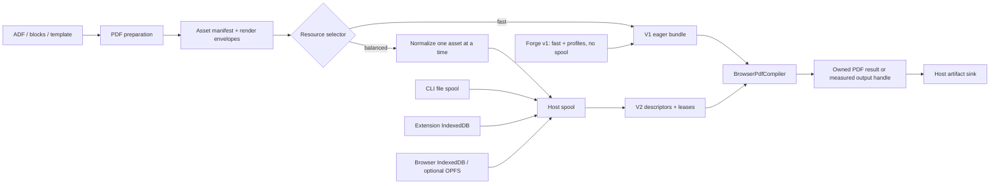

# Issue #118: Adaptive browser PDF memory

- Status: Proposed for review
- Issue: [#118](https://github.com/BjoernSchotte/atlcli/issues/118)
- Related: [#119](https://github.com/BjoernSchotte/atlcli/issues/119), [#116](https://github.com/BjoernSchotte/atlcli/issues/116), [#117](https://github.com/BjoernSchotte/atlcli/pull/117)
- Planning baseline: `b0630fd185dba7f06b023f83bff277034d10ef50` (`main`, 2026-07-27)

## Decision summary

Implement #118 as a host-neutral, additive PDF pipeline with two independent
controls:

- `PdfResourceMode = "auto" | "fast" | "balanced"` controls ownership,
  spooling, copies, and compiler handoff.
- `PdfImageProfile = "original" | "standard" | "print"` controls optional,
  deterministic image normalization.

This separation is normative. Selecting a lower-memory transport must never
silently reduce image quality. Existing callers that pass neither option keep
the current `fast + original` behavior.

Implementation order is evidence-first:

1. Phase 0 attributes the measured peak between host-side JS copies and
   Typst/WASM-internal memory before any transport work is built.
2. The primary product lever is the explicit image-profile path: smaller
   decoded rasters shrink both host handoff and Typst's decoded-raster
   footprint inside WASM.
3. A set of already-identified redundant copies (checkpoint asset copies,
   executor blob double allocation, panel download double materialization,
   duplicate fingerprinting) is removed early so later baselines are honest.
4. The versioned descriptor/lease path that avoids materializing all source
   assets in host memory at once is built only if the Phase 0 attribution
   shows host-side materialization is a large enough share of peak to
   justify it (kill criterion in the benchmark plan).

Typst still needs each individual asset as complete bytes in its VFS, and
still produces a complete PDF. This plan therefore promises fewer redundant
representations and bounded host-side handoff, not streaming Typst
compilation.

The work is shared by:

- durable CLI exports and direct Node consumers;
- extension preview and durable extension jobs;
- normal browser consumers and the browser export harness;
- the downstream Forge adapter in `kiteweave-forge-app`.

Forge APIs and lifecycle rules stay outside shared packages. Issue #119 may
reuse the image and spool contracts, but DOCX packaging is not implemented as
part of #118.

Typst is not upgraded merely to change a version number. The planning baseline
uses the current stable typst.ts wrapper `0.7.0`, which embeds Typst `0.14.2`.
Typst itself has since released
[`0.15.1`](https://typst.app/docs/changelog/0.15.1/); typst.ts
[`0.8.0-rc3`](https://github.com/Myriad-Dreamin/typst.ts/releases/tag/v0.8.0-rc3)
is a prerelease on Typst `0.15.0-rc.1`. The RC, a narrower `web,pdf` build, a
reproducible forward-port to Typst `0.15.1`, and an instrumented memory-mode
build are separate measured candidates. Only a candidate that passes the gates
in this plan may replace the pinned runtime.

## Why this is needed

Issue #116/#117 reduced Confluence acquisition work. Issue #118 starts after
that boundary: prepared media, host copies, Typst VFS population, layout,
Krilla PDF production, JS ownership, and artifact persistence.

The current code carries several complete representations:

1. `packages/pdf/src/prepare.ts` collects `PreparedPdfAsset.bytes`.
2. `PdfSourceBundle.assets` exposes complete `Uint8Array`s.
3. durable job stores persist the arrays but materialize every blob again
   before rendering. The rehydration is a generic untyped `hydrate()` walker
   duplicated in `packages/export-node/src/jobs/executor-stores.ts` and
   `apps/extension/utils/export-jobs/executor-store.ts`; the extension's
   `collectExecutorBytes` additionally double-allocates each blob (chunk list
   plus concatenated copy).
4. the extension's productive compile path still routes through the legacy
   IDB bridge (`createOffscreenPrivatePdfCompilePort`): the complete bundle
   is re-persisted into the old `atlcli-pdf` store (64 MiB per-job cap, the
   tightest limit in the whole chain today) and the complete PDF is read back
   out of it.
5. `BrowserPdfCompiler` maps every asset eagerly into Typst's shadow VFS.
6. the browser-export-harness worker client copies every source asset before
   transfer and its worker copies the complete compiled PDF before returning
   it. The extension worker does neither: bundle and result travel via
   IndexedDB, not messages, so worker-copy removal applies to the harness and
   Forge shapes only.
7. the result is read again as a complete `Uint8Array` for hashing and
   artifact output; the extension side panel then materializes the artifact
   again and `new Blob([bytes])` makes one more full copy for download,
   bypassing the existing `PdfBytesHandle` seam.
8. `packages/export-wiring/src/jobs/checkpointed-assets.ts` copies each
   resolved asset up to four times during prepare (`Uint8Array.from` in
   `publish`, `sha256Hex`, `bytesSource`, and the read-back `collectBytes`).
9. `fingerprintPreparedPdfExport` runs twice per job (after prepare and after
   materialize) and its `canonical()` builds complete string copies of the
   source map and note lists.

The existing 500-page engine fixture is useful for throughput but not a
realistic image-memory proof: it places a small `64 x 48` PNG only every 25
pages. Its documented PDF phase nevertheless reaches roughly 3.0–3.4 GB RSS
outside the browser for a 16–17 MB result. A Chrome trace of the existing
8.33 MiB prepared bundle observed:

- 25.06 MiB backing after VFS population;
- 88.36 MiB while the complete compiled PDF was held;
- only 16.61 MiB released after result handoff.

These measurements locate the problem, but they are not the acceptance corpus.
Phase 0 replaces them with deterministic text, mixed, and realistic
image-heavy browser fixtures.

## Goals

1. Preserve the current fast path for small jobs.
2. Add a balanced path that does not hold every source asset in host memory
   simultaneously.
3. Make any image normalization explicit, deterministic, and shared across
   hosts.
4. Select `auto` from measured input and host capabilities, not page count
   alone.
5. Attribute peak memory between host-side copies and WASM-internal memory
   before investing in transport plumbing, and stop transport work the
   attribution cannot justify.
6. Preserve PDF semantics, accessibility, diagnostics, determinism, and
   cancellation.
7. Give CLI, extension, ordinary browsers, and Forge the same engine contract
   while keeping their lifecycle and storage adapters separate.
8. Measure Typst/runtime candidates independently from pipeline changes.
9. Leave reusable spool and image-profile primitives for #119 without coupling
   the PDF and DOCX implementations.

## Non-goals

- splitting a logical export into chapter PDFs and merging them;
- calling Typst incremental preview a streaming PDF implementation;
- changing document layout, tags, outline, links, language, or alt text to save
  memory;
- silently applying `standard` or `print` under `auto`;
- committing customer documents or customer-derived media as fixtures;
- making OPFS mandatory;
- a Forge session spool in this iteration: Forge v1 ships `fast` plus explicit
  image profiles only (decision 2026-07-27); the spool question is deferred
  until Forge iframe storage capabilities are actually measured and the spike
  invariants are explicitly amended;
- introducing Forge APIs into atlcli packages;
- raising the Forge spike's current attachment/session limits to make the
  benchmark pass;
- forking Krilla before pipeline and Typst measurements justify it;
- implementing #119's streaming OPC/ZIP writer.

## Required invariants

### Compatibility

- Missing options mean `fast + original`.
- `fast + original` remains byte-identical for the existing deterministic
  fixtures.
- The current `PdfSourceBundle` and `PdfCompilePort.compile()` remain supported.
- Existing V1 pending job checkpoints remain readable and resume through the
  eager path. They are not rewritten in place.
- External compile-port implementations do not need to implement leases.
- The V1 asset path scheme is frozen: paths embed the FNV-1a dedup key and
  the insertion index (`packages/pdf/src/prepare.ts`) and are emitted
  verbatim into the generated Typst source, so changing the dedup key or the
  descriptor order changes PDF bytes. SHA-256 digests live in descriptors
  only and never rename asset paths; balanced preparation preserves the
  canonical V1 asset order.

### Quality

- `auto` chooses a resource mode only.
- `original` never resamples a raster image.
- `standard` and `print` never upscale.
- JPEG remains JPEG when possible; transparency remains lossless; SVG and other
  vector sources remain vector.
- One content hash maps to one normalized result for a given versioned profile.
- Normalization may change image streams, but not page geometry or semantics.

### Ownership

- Every opened lease is released exactly once on success, failure, abort, or
  worker termination.
- Once ownership is handed to a spool or worker, the previous owner does not
  retain an avoidable copy.
- Balanced mode may materialize one complete individual asset because Typst's
  current `World.file()`/VFS boundary requires it. It must not materialize the
  entire asset set in the host at once.
- `release()` is idempotent: "released exactly once" means the lease registry
  tolerates duplicate release calls without double-freeing spool objects.
- `read()` is single-pass. Retry after a digest mismatch or transient read
  failure re-opens a fresh lease through `PdfAssetLeaseReader.open()`; it
  never re-reads a consumed lease.
- The fast path keeps today's prepare fetch concurrency
  (`PDF_ASSET_CONCURRENCY = 4`). Balanced mode lowers effective concurrency
  by policy inside its own pipeline; it does not change the shared default,
  so the fast path does not regress.
- Cleanup is idempotent and covers prepared input, normalized derivatives,
  compiler state, output handles, and host object URLs.

### Truthful claims

- Gzip/Brotli size is reported as transfer/archive size, not runtime memory.
- A smaller WASM binary is not accepted as a memory improvement without runtime
  measurements.
- An output handle is not described as streaming unless PDF bytes are actually
  produced incrementally.
- Numeric peak targets are proven in the neutral Chrome harness. Cross-origin
  Forge iframe observations are lifecycle evidence, not a stable heap metric.

## Target architecture



Shared packages own document preparation, selection, profiles, descriptors,
lease semantics, compiler behavior, diagnostics, and reports. Hosts own storage
implementation, capability detection, worker lifecycle, UI, downloads, and
recovery.

## Public and internal contracts

Names below are the intended shape. Exact file placement may change during the
contract implementation, but the semantic split must not.

```ts
export type PdfResourceMode = "auto" | "fast" | "balanced";
export type ResolvedPdfResourceMode = "fast" | "balanced";
export type PdfImageProfile = "original" | "standard" | "print";

export interface PdfResourcePolicyV1 {
  mode: PdfResourceMode;
  imageProfile: PdfImageProfile;
}

export interface PdfAssetDescriptorV2 {
  id: string;
  ref: string;                 // opaque to shared PDF code
  logicalPath: string;
  mediaType: string;
  byteLength: number;
  sha256: string;
  sourcePixels?: { width: number; height: number };
  renderEnvelope?: { widthPt: number; heightPt: number };
  imageProfile: PdfImageProfile;
}

export interface PdfAssetLease {
  readonly descriptor: PdfAssetDescriptorV2;
  read(): AsyncIterable<Uint8Array>;
  release(): Promise<void>;
}

export interface PdfAssetLeaseReader {
  open(descriptor: PdfAssetDescriptorV2): Promise<PdfAssetLease>;
}

export interface PdfPreparedAssetSinkV2 {
  put(
    metadata: Omit<PdfAssetDescriptorV2, "ref" | "byteLength" | "sha256">,
    bytes: AsyncIterable<Uint8Array>,
  ): Promise<PdfAssetDescriptorV2>;
}

export interface PdfLeasedSourceBundleV2 {
  version: 2;
  main: PdfAssetDescriptorV2;
  template: PdfAssetDescriptorV2;
  assets: readonly PdfAssetDescriptorV2[];
}
```

Naming constraints from the existing code:

- The descriptor's image-profile field is `imageProfile`, not `profile`:
  "profile" already means three things in this codebase (`PdfProfile =
  "tagged" | "pdf-ua-1"`, `request.options.profile` carrying the same value,
  and the CLI's auth `--profile`). A fourth bare `profile` is a validation
  and readability hazard.
- `PdfExportLogoV1` in `@atlcli/export-jobs` already carries
  `assetRef/sha256/byteLength/mediaType` — a near-duplicate of
  `PdfAssetDescriptorV2`. The contract implementation either reuses the
  descriptor for the logo or documents why both shapes exist.
- The template logo is a fourth asset source: serialization injects
  `PdfTemplateSettings.logo.bytes` as a synthetic `assets/atlcli-logo.*`
  entry, bypassing `PdfAssetResolver`, `validateResolvedAsset`, and
  `AssetBudget`. The V2 descriptor/sink flow must cover it explicitly or it
  will be dropped or unverified in balanced mode.
- The selector input is not named `PdfResourceEstimateV1`:
  `ResourceEstimateV1` already exists in `@atlcli/export-jobs`
  (`heapBytes/spoolBytes/outputBytes/rasterPixels/confidence`) and is
  threaded through checkpoints, reservations, and recovery keys. The
  selector input is named `PdfSelectorInputV1` and references or extends the
  existing estimate instead of duplicating a near-identical type.
- `rehydratePreparedPdfExportV1` does not exist; the real code is the untyped
  `hydrate()` walker duplicated in both host stores. Phase 2 decides whether
  V2 unifies the two walkers or replaces them with typed manifest
  materialization; it must not add a third copy.

Add an optional leased capability instead of widening the current method into a
breaking union:

```ts
export interface PdfCompilePort {
  compile(bundle: PdfSourceBundle, context?: PdfCompileContext):
    Promise<PdfCompileResult>;
  compileLeased?(
    bundle: PdfLeasedSourceBundleV2,
    reader: PdfAssetLeaseReader,
    context?: PdfCompileContext,
  ): Promise<PdfCompileResult>;
}
```

`compileLeased()` crosses a worker boundary in every browser host: the
compiler runs in a dedicated worker, and the extension protocol deliberately
carries only `{jobId}`-style references. The lease reader is therefore
implemented worker-side: the worker opens spool objects itself (IndexedDB is
available in workers; OPFS synchronous access handles exist only in workers),
exactly as the extension worker already claims bundles from IndexedDB today.
Host-to-worker messages carry descriptors and refs, never asset bytes. A host
that cannot give its worker direct spool access uses an explicit chunk-pull
RPC; that protocol is part of the Phase 2 contract, not an afterthought.

Two facts about the current code bound this contract:

- `BrowserPdfCompiler.compile()` today accepts no `PdfCompileContext` at all;
  signal-awareness is a new capability that must be added to both methods and
  regenerated into the pinned API report
  (`packages/pdf-compiler-browser/etc/pdf-compiler-browser.api.md`).
- `PdfExportJobRequestV1.options` is a closed key set (`onlyKeys` in
  `packages/export-jobs/src/validation.ts`); the new options extend that
  allow-list, its validators, and the round-trip tests.
  `buildResultRecoveryKey` hashes the canonical request, so idempotency
  absorbs the new fields automatically.

The executor resolves the request as follows:

1. explicit `fast` always uses `compile()`;
2. explicit `balanced` requires a spool and `compileLeased()`, otherwise it
   fails before acquisition with an actionable capability error;
3. `auto` uses the versioned selector; if balanced capabilities are unavailable,
   it falls back to fast and reports the reason;
4. the resolved mode, selector version, input summary, image profile, and
   compiler identity are persisted in the checkpoint and final report so a
   retry cannot silently choose a different path.

Do not expose host filesystem paths, IndexedDB keys, Forge URLs, or raw
filenames through descriptors or diagnostics.

## Adaptive selection

The selector receives a privacy-safe `PdfSelectorInputV1` (naming constraints
above):

- serialized main/template byte count;
- asset count, aggregate bytes, largest asset, and deduplicated bytes;
- media types;
- raster width/height, pixel count, transparency, and orientation;
- maximum render envelope across all uses;
- repeat count;
- expected output/page estimate when available;
- host capabilities and storage budget.

Page count alone is insufficient. The selector is a pure, versioned function
with table-driven tests. Thresholds are not hard-coded until Phase 0 produces
the three benchmark curves.

`auto` initially ships report-only: it records the mode it would choose while
executing `fast`. It becomes active for a first-party host only after:

- that host's balanced path passes lifecycle and parity tests;
- the selector has no regression on the small corpus;
- the image-heavy corpus reaches the required reduction;
- the selector thresholds and version are documented.

External consumers must opt into active `auto` until the public contract is
declared stable.

Report-only decisions need a defined sink or nobody reads them: the CLI JSON
report, the extension export diagnostics, and the harness benchmark reports
each record the selector version, the input summary, and the mode that would
have been chosen.

## Image profiles and normalization

Introduce a small format-neutral media package, provisionally
`@atlcli/export-media`, rather than placing shared raster policy in
`@atlcli/pdf`, `@atlcli/confluence`, or a host package. It owns:

- header-only image metadata inspection;
- render-envelope and scale planning;
- content-hash deduplication;
- profile/version definitions;
- a deterministic normalizer port and diagnostics;
- decompression-bomb and pixel-budget checks.

The package is deliberately independent of PDF and DOCX so #119 can consume the
same normalized derivatives.

The implementation is an extraction, not a fork: header-only inspection,
target-size planning, and the decompression-bomb/pixel budgets already exist
in `packages/docx/src/image.ts` (`decodeImageInfo`, `resolveTargetSize`,
`MAX_RASTER_AXIS_PX`, `MAX_RASTER_PIXELS`, `boundRasterTarget`).
`@atlcli/docx` becomes a consumer of the extracted code so exactly one
implementation of inspection, planning, and budgets exists. Content-hash
deduplication must likewise reconcile with the two existing dedup
implementations (`assetKey` FNV-1a in `packages/pdf/src/prepare.ts` and
`AssetBudget` in `@atlcli/confluence`) rather than adding a third.

A new workspace package also carries repo obligations that belong in the
estimate: publish classification (`scripts/publish-classification.test.ts`
fails closed), an API report (`etc/export-media.api.md` via
`scripts/api-closure.ts`), pack checks, dist hygiene, and consumer smoke
coverage.

### Render envelope

Serialization records the largest rendered size of every raster asset across
all uses, in points. For widths that depend on later layout, use a conservative
usable-page-width upper bound. Do not present that upper bound as exact
post-layout measurement.

The target raster size is:

```text
ceil(rendered inches * profile PPI), capped at source pixels
```

Candidate ranges for Phase 0 are:

- `standard`: benchmark 160–200 PPI;
- `print`: benchmark around 300 PPI.

The final value is a measured decision, not a planning assertion.

### Processing rules

- inspect and plan without decoding;
- decode at most one large raster at a time;
- normalize, hash, and spool immediately;
- drop decoder/source buffers before opening the next asset;
- deduplicate source and derivative by deterministic key;
- preserve EXIF orientation in visible output but strip unrelated metadata;
- retain JPEG encoding for photographic JPEG input where the selected codec
  permits it;
- preserve alpha without flattening;
- leave SVG, Mermaid-rendered SVG, and other vector content untouched;
- emit aggregate diagnostics only: counts, bytes, dimensions, selected profile,
  and reasons. Never emit media bytes or customer names.

Run a Phase 1 codec bakeoff before choosing the implementation. The normative
codec must be pinned, deterministic, browser-safe, available to compiled Bun
CLI, extension, normal browser, and Forge, and compatible with their CSPs.
Host-specific Canvas output is not the canonical path if it breaks byte parity.

## Leased compiler handoff

Balanced preparation writes through `PdfPreparedAssetSinkV2` while assets are
resolved and normalized. It does not first construct
`PreparedPdfExportV1.assets[]` and spool that complete array afterward. The sink
computes byte length and digest incrementally, commits the object, returns its
descriptor, and lets preparation release the source buffer. The existing
`ByteReservationSemaphoreV1` (`packages/export-jobs/src/bounded-stream.ts`)
may allow bounded fetch overlap — reuse it, do not add a second semaphore —
but large decode/normalize work remains single-slot.

`BrowserPdfCompiler.compileLeased()` performs:

1. reset the Typst shadow state;
2. open, verify, map, and release main source;
3. open, verify, map, and release template source;
4. for each asset in the manifest's canonical V1-equivalent order:
   - open its lease;
   - collect only that asset's chunks;
   - verify declared length and SHA-256;
   - call `map_shadow`;
   - release the lease and drop the host buffer;
5. compile the complete document;
6. collect diagnostics and the complete PDF result;
7. reset compiler shadow state and release all remaining leases in `finally`.

This removes simultaneous host materialization and avoidable pre-worker copies.
It does not remove Typst's internal copy of mapped assets. Measure VFS
high-water separately so reports do not conflate host and WASM memory.

The compiler checks abort state between lease reads and VFS mappings. Once the
current synchronous Typst compile has started, hard cancellation still requires
termination of its dedicated worker; passing an `AbortSignal` alone cannot
interrupt layout/PDF generation.

A secondary Phase 2 experiment may evaluate typst.ts
`set_access_model(...)` with worker-owned OPFS/synchronous handles. It is adopted
only if it reduces copies without changing diagnostics, determinism, or host
support. It must not become a required Forge capability and must not be called
PDF streaming.

## Checkpoint and artifact changes

Add `PdfReadyToRenderCheckpointV2` in `@atlcli/export-wiring`:

- V2 manifest with separate main, template, and asset descriptors;
- resolved policy and selector version;
- compiler/font/profile identities;
- input fingerprint computed incrementally while spooling;
- ownership state sufficient for idempotent cleanup and retry.

Change executor stores so V2 materialization loads the manifest, not every blob.
The lease reader opens one spool object on demand. V1 remains readable through
its current array hydration path.

`PdfReadyToRenderCheckpointV1` is not greenfield: `validateCheckpoint()`
hard-rejects any schema other than `"atlcli.pdf-ready-to-render/1"`, the
`PdfReadyToRenderStoreV1` interface
(`load/commit/materialize/beginRenderAttempt`) is V1-typed end to end, and
`buildResultRecoveryKey` embeds V1 fields. V2 therefore means threading a
discriminated union through the store contract, both host store
implementations, the recovery key, and the executor test matrix — the plan
budget includes that, not just "add a V2 type".

The existing artifact interface already accepts `AsyncIterable<Uint8Array>`,
but `PendingArtifactV1` requires `byteLength` and `sha256` before the stream
is consumed, and both artifact stores verify the declared values while
consuming. Incremental output hashing therefore needs the digest to exist
before the iterable is handed over: either the compiler/worker computes it
while producing chunks, or the host accepts one extra pass. Do not
concatenate merely to satisfy the sink, and keep the existing one-artifact
cardinality.

The current compiler returns `Uint8Array`. Phase 4 may add an owned output
handle or chunk reader only if Phase 0 shows the JS/worker result copy accounts
for at least 10% of peak. First remove unconditional worker-side `slice()`
copies and test transferable ownership. A WASM-resident reader remains
experimental; the underlying PDF is still complete.

## Shape-specific implementation

### CLI and direct Node consumers

There are two related execution shapes and both must be covered:

- Normal CLI export plus retry/rerun use the durable ordinary-job path. They use
  the existing `FileExportSpoolStore` and V2 descriptors without rehydrating
  every blob.
- Public consumers may call `runPdfExport` (exported by `@atlcli/pdf`, with
  `@atlcli/export-node` supplying the env) directly. They keep the eager
  compatibility path and may supply a file spool for explicit/selected
  balanced mode.

`FileExportSpoolStore` is genuinely streaming with incremental SHA-256, but
every `put`/`stat` currently rescans the objects directory under a global
lock; per-asset balanced spooling makes that O(n²). Phase 3 CLI wiring
includes an indexed or cached listing so a ~1000-asset spool stays linear.

Add options, names subject to CLI review:

```text
--pdf-memory auto|fast|balanced
--pdf-images original|standard|print
```

Persist them in job requests, idempotency input, checkpoints, JSON reports, and
human diagnostics. The compiled Bun artifact must contain or lazily load the
same pinned normalizer used by browsers. Temporary files are private,
collision-safe, cancellation-aware, and deleted after success/failure.

### Browser extension

Treat preview and durable export differently:

- Preview remains `fast + original` by default for latency and supersession.
  It may expose explicit profiles later, but #118 must not make preview queue
  behind a durable balanced export unexpectedly. Preview prepare runs in the
  side panel today, so its peak is a panel concern that executor-store work
  does not touch.
- Durable jobs store V2 descriptors in IndexedDB and read asset blobs inside
  the offscreen/compiler worker. "No source or PDF bytes in runtime messages"
  is already true today and becomes a regression guard, not a work item.
- Retiring the legacy PDF job/IDB bridge is a Phase 3 exit criterion with its
  own commit, not a side effect: today every productive common job
  re-persists its complete bundle into the old `atlcli-pdf` store through
  `createOffscreenPrivatePdfCompilePort`, pays the 64 MiB per-job cap
  (currently the tightest limit in the whole chain), and reads the complete
  PDF back out. V2 spooling gains nothing while that bridge remains on the
  productive path. The bridge stays only as a compatibility path for callers
  that still require V1, and its 64 MiB limit is not raised to make V2
  benchmarks pass.
- Consolidate the limit zoo in one decision table: the legacy 64/128 MiB
  caps, the injected executor spool limits (128/256/512 MiB), the
  executor-store defaults (256/384/512 MiB), and the reservation pool's
  128 MiB persisted-spool budget currently disagree.
- Quota is self-accounted today; there is no `navigator.storage.estimate()`
  in productive code. Phase 3 decides explicitly whether balanced mode adds
  an origin-quota probe or keeps self-accounting.
- Blob-backed IndexedDB storage was already measured and rejected on Chrome
  140 (`packages/pdf/src/bytes-handle.ts` documents the experiment and why
  chunk-retention assumption (ii) failed). Revisiting it starts by re-running
  `bench:memory-chrome`, not by assuming.
- Avoid the current pattern of collecting every stored blob before the
  `hydrate()` walker rebuilds the prepared export.
- Preserve the existing service-worker restart model, single-heavy-work slot,
  cancellation, and job recovery.
- Termination, abort, or quota failure removes partial derivatives and
  releases object URLs/output handles.

Packed-MV3 validation exists today: two Playwright suites drive the packed
`.output/chrome-mv3` build in CI (worker E2E and CDP-driven offscreen job
recovery). Extend those suites for V2 jobs instead of building a new packed
harness.

### Normal browser and public package consumers

The browser export harness is the normative quantitative proof host. Implement
a browser spool adapter with IndexedDB as the portable baseline and OPFS as an
optional measured capability. Provide an in-memory eager fallback for small jobs
and browsers lacking persistent storage.

The public browser entry points expose the additive policy/capability types
without extension imports. A plain Vite consumer must be able to:

- run fast and balanced modes;
- cancel during normalize, spool, VFS handoff, layout, and output;
- recover from a terminated worker;
- load WASM/fonts/codec from same-origin assets under a strict CSP;
- receive one artifact without a host-specific global.

### Atlassian Forge downstream

The Forge app remains a consumer repo, not an atlcli runtime branch.

Decision (2026-07-27): Forge v1 ships `fast` plus explicit image profiles and
lifecycle fixes only — no session spool. The spike's cost/privacy invariants
(`specs/SPIKE.md`: browser RAM, workers, blob URLs, and explicit downloads
only; no caching of generated bytes; no adoption of the extension's
IndexedDB host) stay normative, and the Forge build gate that rejects
`indexedDB`/`localStorage`/`sessionStorage` tokens in app sources stays
unchanged. Revisiting a spool requires, in order: a measurement of what the
cross-origin Forge iframe actually permits for IndexedDB/OPFS (partitioned
storage can accept `open()` and fail later; quota is not knowable up front),
then an explicit spike-invariant and build-gate amendment. Image profiles are
the memory lever that works inside those constraints, and the 16/32 MiB
budgets cap what a spool could save anyway.

Current facts that constrain the rollout:

- the implemented Forge export is page-only; tree/batch/queue are preview
  shapes;
- its attachment adapter caches full bytes for the whole session and makes
  three transient copies per download (arrayBuffer, cache snapshot, returned
  slice);
- its worker client copies source assets before transfer and the worker
  copies the final PDF before posting it back;
- the compile client is a module-scope singleton created at modal mount: the
  warm worker holds the instantiated Typst WASM (~28 MB) plus twelve fonts
  from mount onward, `dispose()` exists but is never called, and unmount only
  aborts in-flight work — an idle warm worker is never terminated;
- the largest single result copy is not in the worker: the host holds the
  borrowed result across validation and `objectUrl()` then mints a
  `new Blob([bytes])` copy (~2x the final PDF; atlcli's own notes measured
  this pattern at +64 MiB for a 64 MiB document);
- runtime assets are decompressed concurrently (WASM plus all twelve fonts,
  ~34 MB materialized at once) at modal mount;
- PDF workers live only as long as the Custom UI iframe; OPFS and a stable
  cross-origin frame heap metric are not assumed;
- the current spike limits a single attachment to 16 MiB and a session to
  32 MiB (stricter than the shared engine's 25 MiB per-asset budget), and the
  16/32 MiB enforcement paths currently have no test coverage.

Already implemented and enforced by existing gates — keep green, do not
re-plan: PDF runtime assets load only from PDF entry points; gzip byte parity
with the pinned atlcli artifacts; CSP/same-origin/no-external-request checks.

The atlcli PR provides the contracts and neutral browser implementation. A
separate pinned consumer PR in `kiteweave-forge-app` then:

- adopts explicit image profiles in the export UI;
- terminates the worker on unmount and after an idle timeout, wires the
  existing `dispose()`, and resets `warmPromise` with it;
- removes the redundant pre/post-worker copies and the attachment adapter's
  triple copy, and bounds or evicts the session byte cache;
- hands the final PDF to the download anchor through the `PdfBytesHandle`
  seam instead of a fresh `Blob` copy;
- staggers runtime-asset decompression instead of materializing WASM and all
  fonts concurrently;
- leaves attachment/session budgets unchanged unless a separate measured
  decision changes them, and adds tests for the 16/32 MiB enforcement paths;
- recreates a clean worker for the next export and ignores late results.

Consumer-PR mechanics the rollout must budget for: `verify-atlcli.ts` is a
hard build gate (exact `EXPECTED_COMMIT`, clean atlcli worktree, exact
`EXPECTED_PACKAGES` versions, built `dist/`), so the consumer PR bumps the
commit and the version map atomically; the `file:` dependency paths are
machine-absolute; and any new spool/lease exports must resolve under the
`browser` condition or Forge silently gets Node code.

Do not claim the 100 MiB tree benchmark as Forge E2E until Forge has an actual
tree/job implementation. For the present spike, production gates are
responsiveness, cancellation, cleanup, fresh-worker recovery, PDF parity, and
resource/CSP integrity.

The downstream verification must reconcile its proof documents before citing
a deployment: `specs/SPIKE.md` (Forge `2.29.0`, atlcli `b0630fd`) and
`proof/README.md` (Forge `2.27.0`, atlcli `36e6456`) currently describe
different baselines, `proof/README.md` has no 2.28/2.29 sections, and the
2.27 proof baseline is a detached-worktree commit the current
`verify-atlcli.ts` gate cannot reproduce. This is a re-proof, not a doc
touch-up.

## Typst/runtime evaluation

### Baseline

Record and reproduce:

- typst.ts wrapper version;
- embedded Typst core version;
- source commit and Cargo feature set;
- Rust, wasm-bindgen, and Binaryen versions;
- CSP patch identity;
- raw/gzip/Brotli sizes and section breakdown;
- WASM and JS glue SHA-256;
- fonts and licenses.

The current vendored WASM is roughly 27 MiB raw and contains no debug/name
sections. Historical `wasm-opt -Oz --converge` reduced it by only about 3%;
post-link optimization alone is not the expected solution.

Typst 0.15 is still worth measuring: its newer Krilla line contains upstream
memory work such as
[Krilla #363](https://github.com/LaurenzV/krilla/pull/363), and can reduce peaks
for some highly structured documents. That is not evidence for #118's
image-heavy workload. The current Typst PDF API and Krilla finish boundary
still return a complete byte vector, and decoded raster and alpha data can
remain fully resident.

### Candidate lanes

Evaluate the same corpus against separately attributable candidates:

1. published baseline: typst.ts `0.7.0` / Typst `0.14.2`;
2. published prerelease: typst.ts `0.8.0-rc3` / Typst `0.15.0-rc.1`, with its
   upstream feature set unchanged;
3. reproducible same-source `web,pdf` build with size-oriented Cargo settings;
4. a newer stable wrapper/core if one exists when implementation begins;
5. otherwise a pinned, reproducible Typst `0.15.1` forward-port only if the RC
   first proves material benefit;
6. an instrumented custom memory-mode build after Phases 0–2.

Do not combine a pipeline change and a runtime upgrade in the same benchmark
commit.

### Adoption gates

A published upgrade must preserve the public `./wasm` subpath, CSP patch,
licenses/notices, deterministic vendor hashes, browser/CLI parity, diagnostics,
and all PDF conformance tests. A 0.15 candidate also gets a pathological layout
convergence fixture because its diagnostics can retain additional document
history when layout does not converge.

The extension's 20 MB minimum-size scanner is not the real gate — the SHA-256
pin beside it is, together with the vendor pins, patch-marker assertions, and
the `no new Function(` check in `vendor-typst.ts`. A narrower build therefore
updates the size floor, the artifact SHA-256 pins, and the vendor assertions
together. Provenance hash, required exports, and a maximum regression budget
are meaningful; rejecting a safely smaller compiler is not.

A custom memory mode is accepted only if it:

- lowers peak by at least 25% on text-heavy and mixed fixtures;
- is not Pareto-dominated on wall time and binary size;
- preserves page count, layout, tags, outline, language, links, fonts,
  diagnostics, and deterministic output;
- has a maintainable upstream-first patch boundary.

Only after that evidence should work investigate bounding/sequentializing
layout or page-run intermediates. Do not fork Krilla as the first move.

## Benchmark and measurement plan

Generate fixtures deterministically at test time; do not commit a 100 MiB blob.
Each recipe has a version, seed, expected hash, and media manifest.

Phase 0 extends existing measurement infrastructure instead of rebuilding it:
the extension Chrome memory harness already instruments phase probes
(baseline, VFS loaded, compiled held, result held, IDB variants) over CDP
with compiler-worker attachment; the Node bench lane measures peak RSS
out-of-process; and `packages/export-fixtures` already ships deterministic
corpus generators (`large-export-corpus` with byte-exact PNG/SVG builders).
The image-heavy corpus needs a pinned deterministic encoder for realistic
compressible JPEG/PNG content — seeded noise does not compress like
photographs.

The current product budget is 50 MiB aggregate and 25 MiB per asset. Phase 0
uses an explicit benchmark-only budget injection for the at-least-100-MiB
corpus. The per-asset half of that budget currently has no injection seam
(`AssetBudget` accepts a `maxTotalBytes` override, but the per-file cap is a
module constant checked in `prepare.ts`); Phase 0 adds a benchmark-only seam
for both halves. Product defaults and Forge's stricter limits remain
unchanged; benchmark configuration must never leak into release
configuration.

| Corpus | Required content | Purpose |
|---|---|---|
| text-heavy | approximately 500 pages, headings, tables, code, links, outlines | layout/Typst high-water |
| mixed | representative chapters, repeated logos, diagrams/SVG, screenshots, captions, wrapped media, JPEG photos | normal export crossover |
| image-heavy | at least 100 MiB aggregate realistic compressed PNG/JPEG, transparency, repeats, inline and full-width media | asset copies, normalization, VFS pressure |

Record cold and warm runs separately. Pin browser, OS/architecture, fixture,
compiler, fonts, profile, selector, and runtime hashes.

Instrument phase boundaries:

1. acquisition complete;
2. metadata/render-envelope planning;
3. normalization;
4. fingerprint and spool;
5. checkpoint materialization;
6. VFS mapping;
7. Typst layout;
8. PDF/Krilla result;
9. worker-to-host handoff;
10. artifact hashing/write;
11. cleanup and warm-runtime remainder.

Collect:

- Chrome CDP used JS heap and backing store;
- WASM linear-memory high-water;
- host-versus-WASM attribution: the share of peak attributable to host JS
  heap plus backing store outside the WASM instance versus WASM linear
  memory, per corpus;
- host spool bytes and maximum simultaneously leased bytes;
- wall and CPU time by phase;
- source, normalized, PDF, raw WASM, gzip, and Brotli bytes;
- count of copies/transfers where instrumentable;
- result after explicit cleanup and after worker termination.

The harness must separate same-input warm reuse from changed-input runs.
Warm-runtime retention is reported, not mistaken for an active-job leak.

Attribution gate (kill criterion): the Phase 0 report states, per corpus,
what share of peak is host-side versus WASM-internal. If the host-side share
on the image-heavy corpus is below the threshold agreed in the Phase 0
review (working assumption: 25%), the descriptor/lease transport work in
Phases 2–3 is re-scoped or dropped, and effort shifts to image profiles plus
the Typst/runtime lanes. The lease pipeline must not be built merely because
it was planned.

## Acceptance criteria

### Functional and parity

- `fast + original` is byte-identical to the baseline fixtures.
- `balanced + original` is byte-identical to fast for the same pinned runtime.
- `standard` and `print` are byte-deterministic across repeated runs and across
  first-party hosts using the same runtime/codec.
- All modes preserve page count, geometry, tags, reading order, outline,
  language, links/targets, embedded fonts, alt text, diagnostics, and
  cancellation.
- Validate PNG alpha, JPEG photos, SVG, Mermaid, code, tables, repeated images,
  captions, wrapped media, and missing/invalid media.
- Result PDFs open without repair and pass the existing structural,
  accessibility, and visual comparison suites.

### Memory and performance

- The Phase 0 attribution report exists, and the lease pipeline is built only
  if its host-share gate passes.
- No balanced checkpoint materialization loads the full asset set.
- At most one unbounded individual source/derivative buffer is leased outside
  Typst at a time; declared asset/pixel budgets still apply.
- On the image-heavy corpus, the mode selected for first-party `auto` lowers
  browser peak by at least 40% relative to fast. If it does not, `auto` must not
  select it.
- Small fast-path exports do not regress beyond the benchmark tolerance agreed
  in Phase 0.
- A Typst custom memory mode needs at least 25% lower peak on text-heavy and
  mixed fixtures.
- An output-handle implementation is pursued only if whole-result handoff is at
  least 10% of measured peak.

### Lifecycle

- Abort at every phase releases leases and partial spool objects.
- Retry uses the persisted resolved policy and produces the same artifact.
- Extension service-worker restart resumes a durable V2 job.
- Worker crash produces a classified failure and a fresh next worker.
- Quota/capability failure occurs before expensive compilation where possible
  and has an actionable fallback.
- No complete asset or PDF byte arrays are posted through extension runtime
  messages.

### Security and privacy

- Verify magic bytes, declared media type, length, digest, dimensions, total
  pixels, and decode budget before compiler mapping.
- Reject decompression bombs and corrupted/truncated spool objects.
- Do not log source text, filenames, URLs, media bytes, tenant identifiers, or
  raw descriptors.
- Runtime, fonts, and codec load locally/same-origin; no new remote code path.
- Vendored runtime/codec changes include hashes, license/NOTICE, provenance, and
  CSP review.

## Test plan

### Unit

- pure selector thresholds, capabilities, fallback, and persisted decisions;
- image metadata, render envelopes, no-upscale math, alpha/orientation, and
  deduplication;
- normalization determinism and privacy-safe diagnostics;
- lease open and single-pass read, idempotent release, and re-open on retry;
- abort/failure/corruption/digest mismatch;
- V1 and V2 checkpoint compatibility;
- incremental fingerprint and output hash parity;
- spool quota and cleanup.

### Package integration

- `@atlcli/pdf` fast/balanced parity with real fixtures;
- real `BrowserPdfCompiler.compileLeased()` with pinned WASM/fonts;
- `@atlcli/export-wiring` V2 prepare, commit, resume, render, retry;
- Node file spool and browser IndexedDB spool contract suites;
- artifact chunk handling without concatenation;
- real PDF conformance and accessibility inspection.

### Shape integration

- CLI durable export/retry plus direct Node consumer, including compiled CLI
  `dist` binary;
- browser harness fast/balanced/profile/cancel/worker-restart cases;
- packed MV3 extension with IndexedDB, offscreen document, service-worker
  restart, quota, cancel, and preview non-regression;
- a plain public Vite consumer under strict CSP;
- downstream Forge production build/deploy without tunnel after pinning the
  candidate.

### Required commands and evidence

During implementation, use focused tests first, then:

```bash
bun run typecheck
bun run test
bun run build
```

Also run the browser memory harness, API/export validation, package-consumer
builds, extension pack/output scans, and the repository-required real E2E
against profile `mayflower`, space `DOCSY`, and project `ATLCLI`. Clean up every
created test page/issue. A green unit suite is not sufficient for a production
memory claim.

## Delivery phases

### Phase 0 — benchmark before behavior

1. Add deterministic fixture generators and manifests, extending
   `packages/export-fixtures` and the existing bench recipes.
2. Add phase probes, CDP collection, WASM high-water, and report schema on
   top of the existing extension memory harness.
3. Reproduce the pinned baseline in cold/warm runs.
4. Publish the host-versus-WASM attribution per corpus and take the lease
   pipeline go/no-go decision against the attribution gate.
5. Record the selector candidate curves and tolerances.
6. Fix documentation that currently treats the full browser 500-page run as
   out of scope.

Exit: committed benchmark reports can distinguish preparation, host copies,
VFS, layout/PDF, result handoff, and retained warm runtime — and state the
host-side share the lease pipeline decision uses.

### Phase 0.5 — copy-elimination quick wins

Remove redundant copies that are independent of any V2 contract, then
re-measure against the Phase 0 baseline so later phases claim only their own
wins:

1. Panel download path: hand artifacts to the download anchor through
   `PdfBytesHandle` instead of collect-plus-`new Blob`.
2. `checkpointed-assets.ts`: eliminate the up-to-four per-asset copies.
3. `collectExecutorBytes`: drop the double allocation per blob.
4. Fingerprint once per job; stop rebuilding full canonical string copies of
   the source map and notes where avoidable.
5. Harness: remove the worker-client bundle copy, the worker result
   `slice()`, and the `MemoryOutputSink` copy (conformance shapes only;
   update the test that currently pins the copy behavior).

Exit: re-measured baseline; each removal is its own commit with before/after
numbers.

### Phase 1 — shared profiles and codec decision

Image profiles are the primary product lever of this plan: smaller decoded
rasters reduce host handoff and WASM-internal decode footprint at once.

1. Add `@atlcli/export-media` contracts and pure planning (extracted from
   `packages/docx/src/image.ts`, not forked).
2. Propagate render envelopes from serialization.
3. Bake off deterministic codecs across Bun and browsers.
4. Implement one-at-a-time normalize/hash/spool.
5. Add `original`, candidate `standard`, and `print` tests.

Exit: explicit profiles are deterministic and parity-tested; exact PPI values
are chosen from evidence.

### Phase 2 — descriptor/lease pipeline (gated by Phase 0 attribution)

Runs only if the Phase 0 attribution gate passes.

1. Add public additive policy, descriptor, lease, and compiler contracts.
2. Add `PdfReadyToRenderCheckpointV2` (discriminated union through the V1
   store contract, both host stores, recovery key, and executor tests).
3. Change V2 stores to materialize manifests only, unifying or replacing the
   duplicated `hydrate()` walkers.
4. Implement `compileLeased()` with the worker-side lease reader and the
   chunk-pull fallback protocol, plus incremental verification.
5. Hash/write artifact chunks without whole-result concatenation where the
   current sink permits it.
6. Measure optional `set_access_model`/OPFS separately.

Exit: balanced/original is byte-identical, lifecycle-complete, and no host
materializes all assets.

### Phase 3 — first-party host wiring

1. Wire CLI durable jobs and the direct Node compatibility path (including
   the spool-store listing fix).
2. Wire normal browser harness and public consumer.
3. Wire extension durable jobs; keep preview fast by default.
4. Retire the legacy extension PDF job/IDB bridge for common jobs.
5. Ship report-only auto selection with defined report sinks.
6. Run real E2E and packed-host checks.

Exit: each first-party host passes its parity and lifecycle matrix, and the
legacy bridge is no longer on the productive path.

### Phase 4 — activate measured auto selection

Runs only if Phases 2–3 shipped balanced mode.

1. Freeze selector thresholds/version from Phase 0–3 results.
2. Enable active `auto` host by host behind a rollback switch.
3. Require the 40% image-heavy target before balanced auto-selection.
4. Publish diagnostics and updated performance guidance.

Exit: auto is predictable, persisted, observable, and safely reversible.

### Phase 5 — optional Typst and output experiments

1. Compare runtime candidate lanes without pipeline changes.
2. Evaluate a gated memory-mode build only after shared pipeline wins are
   measured.
3. Evaluate owned/chunked output only if the 10% gate is met.
4. Upstream viable runtime changes before adopting a long-lived fork.

Exit: adopt, reject, or defer each candidate with a standalone benchmark report.

### Phase 6 — downstream Forge proof

1. Pin the exact atlcli candidate (`EXPECTED_COMMIT` plus `EXPECTED_PACKAGES`
   atomically).
2. Adopt explicit image profiles; no session spool (see the Forge decision).
3. Remove redundant copies, wire worker `dispose()` on unmount/idle, stagger
   runtime decompression, and add cleanup.
4. Keep the existing resource/CSP/gzip-parity gates green.
5. Deploy to production without tunnel and reconcile/refresh the proof
   documentation (re-proof, including the stale 2.27 baseline).

Exit: the current page export passes honest Forge lifecycle and semantic gates;
tree-scale claims remain deferred until that shape exists.

## Proposed change/commit boundaries

Keep results attributable with logical conventional commits:

1. `test(pdf): add deterministic browser memory corpus`
2. `perf(export-wiring): remove redundant checkpoint asset copies`
3. `perf(extension): stream panel downloads through pdf bytes handles`
4. `feat(export-media): add deterministic image profiles`
5. `feat(pdf): add leased source bundle contracts`
6. `feat(export-wiring): persist pdf v2 asset manifests`
7. `feat(pdf-browser): compile leased assets sequentially`
8. `feat(cli): add adaptive pdf resource options`
9. `feat(extension): spool balanced pdf jobs`
10. `perf(extension): retire legacy pdf job bridge`
11. `perf(pdf): enable measured automatic resource selection`
12. optional `perf(pdf-browser): update measured typst runtime`
13. `docs: document adaptive browser pdf memory`

Do not mix the runtime upgrade, pipeline contract, and auto threshold in one
commit. Each should be independently revertible.

## Documentation updates

Update in the same implementation PRs:

- `src/content/docs/reference/pdf-engine.md`: contracts, runtime matrix,
  compiler/font identity (including the current twelve-font set), and capability
  fallback;
- `src/content/docs/reference/export-performance.md`: realistic browser corpus,
  modes/profiles, measured results, and removal of stale scope language;
- CLI reference: options, defaults, reports, and troubleshooting;
- Confluence export guides: quality profile examples and warnings;
- browser package/consumer docs: spool capability and CSP assets;
- extension docs/UI copy: fast preview versus durable balanced jobs;
- changelog and migration notes for additive V2 contracts.

The separate Forge consumer PR updates `specs/SPIKE.md`, proof metadata, runtime
pin, resource hashes, limitations, and production evidence.

## Relationship to issue #119

Share only the format-neutral contracts:

- image profile and render-envelope model;
- deterministic normalizer;
- spool references, leases, budgets, and cleanup;
- fixture media recipes and privacy rules;
- host capability reporting.

Keep PDF compiler/VFS logic out of the DOCX path. Issue #119 independently owns
OPC/ZIP streaming, STORE-versus-DEFLATE policy, relationship writing, customer
template preservation, and DOCX-specific two-pass composition. Neither issue
waits for the other's format engine after the shared primitives land.

## Risks and mitigations

| Risk | Mitigation |
|---|---|
| Balanced mode only moves bytes and Typst VFS still dominates | measure host and WASM high-water separately; gate auto on total peak |
| Host share of peak too small to justify the lease pipeline | Phase 0 attribution gate with an explicit re-scope/kill rule |
| SHA-256 dedup or descriptor order changes asset paths and breaks byte parity | frozen V1 path scheme; digests in descriptors only; canonical order preserved |
| Legacy extension bridge re-materializes bundles behind the new path | bridge retirement is a Phase 3 exit criterion with its own commit |
| Normalization changes layout or visible quality | separate explicit profile; render envelopes; visual and semantic parity |
| Browser codecs differ by platform | pin one deterministic cross-host codec; reject Canvas-only normative output |
| Spool quota fails late | estimate and reserve before normalization; actionable auto fallback |
| V2 recovery breaks existing jobs | additive checkpoint version; retain V1 eager reader |
| OPFS unavailable or lifecycle-sensitive | IndexedDB portable baseline; OPFS optional; Forge eager/session fallback |
| Worker termination leaks objects | lease registry plus idempotent `finally`; crash/restart tests |
| A runtime upgrade hides the real gain | isolated commits and candidate lanes |
| Custom Typst fork becomes permanent | upstream-first boundary and high adoption threshold |
| Benchmarks use synthetic noise unlike real pages | realistic PNG/JPEG recipes, repeated assets, mixed corpus, documented limits |
| Forge proof overstates current product shape | page-only gates now; tree-scale proof only after executable tree/jobs |

## Unresolved questions

No product decision blocks implementation. The conservative defaults are:
`fast + original`, no automatic quality reduction, no mandatory OPFS, and no
Forge session spool (Forge v1 is `fast` plus explicit profiles).

The following questions are intentionally resolved by measured phase gates:

1. What share of the image-heavy peak is host-side versus WASM-internal, and
   does it pass the attribution gate that justifies the lease pipeline?
2. Which exact `standard` PPI in the 160–200 range gives the best visual/peak
   trade-off, and is approximately 300 PPI the correct `print` value?
3. Which deterministic codec satisfies Bun, extension, normal browser, Forge,
   CSP, license, size, and parity requirements?
4. At which input/capability thresholds should selector V1 choose balanced?
5. Does typst.ts access-model plus worker OPFS reduce total peak enough to
   justify the additional capability path?
6. Does a narrower or newer Typst runtime improve runtime peak, not only WASM
   size?
7. Can a maintainable Typst memory mode pass the 25% and parity gates?
8. Is complete-PDF handoff at least 10% of peak, justifying an output-handle
   experiment?
