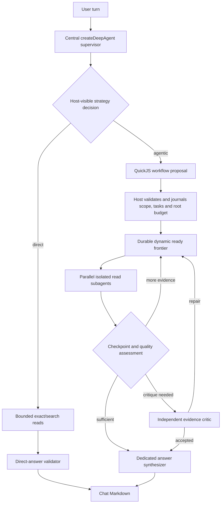

# Agentic Chat Quality Workflow

Status: **T0-T1 verified; T2 implementation next**

## 1. Objective

Turn Chat's `auto` and `deep` modes into provider-neutral quality policies rather
than aliases for one model vendor's reasoning-effort flag.

- `quick` remains a direct, bounded answer path without delegation.
- `auto` lets the central supervisor choose between direct execution and a
  dynamically composed agentic workflow.
- `deep` requires an explicit supervisor strategy decision and gives the
  supervisor the complete agentic workflow machinery when decomposition improves
  quality: dynamic multi-wave subagents, parallel read work, checkpointed
  replanning, critique, repair, synthesis, and user steering.
- Deep Research remains a separate, explicitly selected product mode optimized
  for comprehensive coverage and a durable report, not conversational latency.

The quality target is not "more tokens." It is better evidence acquisition,
better context isolation, deliberate decomposition, independent validation, and
targeted repair before publication.

## 2. Evidence behind the design

The plan follows current DeepAgentsJS and LangChain guidance rather than creating
a second custom harness:

- Deep Agents describes subagents as isolated context windows that return one
  compact result to the supervisor, and recommends them for multi-step,
  output-heavy work rather than simple one-step questions:
  <https://docs.langchain.com/oss/javascript/deepagents/subagents>
- Deep Agents context engineering combines offloading, summarization, context
  isolation, and persistent backends; subagent outputs should be concise rather
  than raw retrieval transcripts:
  <https://docs.langchain.com/oss/javascript/deepagents/context-engineering>
- The Deep Agents interpreter supports QuickJS orchestration, parallel `task`
  calls, conditional execution, and result reduction while exposing only an
  explicit PTC allowlist:
  <https://docs.langchain.com/oss/javascript/deepagents/interpreters>
- DeepAgentsJS documents dynamic subagents as runtime-selected specialists. The
  pinned runtime does not expose that behavior as a mutable runtime registry, so
  this plan adopts the pattern through an explicit host integration seam rather
  than assuming the documented capability is present unchanged:
  <https://docs.langchain.com/oss/javascript/deepagents/dynamic-subagents>
- The event-streaming API exposes supervisor and subagent lifecycle projections
  separately, which maps to our expandable activity rows without exposing hidden
  reasoning:
  <https://docs.langchain.com/oss/javascript/deepagents/event-streaming>
- LangChain's January 2026 multi-agent guidance emphasizes context quarantine,
  narrow tool sets, detailed task boundaries, parallelization, and concise child
  outputs:
  <https://www.langchain.com/blog/building-multi-agent-applications-with-deep-agents>
- LangChain's architecture guidance says read-heavy multi-agent work is the good
  fit, while one agent should own coherent final writing. It also calls out
  durable execution, precise handoffs, tracing, and evaluation as production
  requirements:
  <https://www.langchain.com/blog/how-and-when-to-build-multi-agent-systems>
- Current production case studies use a central supervisor, specialized read/RAG
  agents, dynamic context loading, aggressive pruning, and layered offline/live
  evaluations:
  <https://www.langchain.com/blog/how-rippling-went-ai-native-across-every-product-in-6-months-with-deep-agents-and-langsmith>
- LangChain recommends trajectory, final-response, state, single-step,
  full-turn, and multi-turn tests rather than evaluating only final prose:
  <https://www.langchain.com/blog/evaluating-deep-agents-our-learnings>
- LangGraph persistence makes checkpoints and resumable execution explicit; a
  checkpoint is not a substitute for journaling the ambiguous result of each
  individual external model/tool dispatch:
  <https://docs.langchain.com/oss/javascript/langgraph/persistence>

### Verified pinned-runtime constraints

The installed cross-host runtime reports DeepAgentsJS `1.12.1` and is currently
consumed through the preview pin `pkg.pr.new/deepagents@717`. Its browser export
contains `createDeepAgent`, declarative and compiled subagents,
`createSubAgentMiddleware`, checkpointer-compatible LangGraph execution, and
typed subagent event streams. The following limitations are part of the design
baseline, not implementation discoveries to defer:

- The built-in subagent registry is captured in a closure. An unknown
  `subagent_type` is rejected; the pinned package does not provide the mutable
  runtime registry implied by a naive reading of the dynamic-subagent docs.
- `mergeMiddlewareStack` replaces middleware by `name`. The supported host seam
  is therefore a repository-owned middleware named `subAgentMiddleware` that
  replaces the built-in middleware in place and owns dynamic registry lookup,
  admission, deterministic task IDs, and journal dispatch.
- QuickJS PTC `task()` calls use `createBridgeDispatch` and invoke the task tool
  directly. They bypass ToolNode, `wrapToolCall`, per-tool `interruptOn`, and any
  HITL assumption attached only to those layers. Authorization, HITL, budgets,
  task journaling, and cancellation must therefore run inside the bridge/host
  dispatcher itself.
- `config.signal` reaches model and subagent calls, but an active QuickJS eval is
  not cooperatively `AbortSignal`-aware. The pinned interpreter's exported
  `executionTimeoutMs` default is 5 seconds; the current product passes explicit
  values up to 60 seconds for worker evals and a run-wide value for the dynamic
  supervisor. Deep Chat must therefore use measured short one-shot/continuation
  eval slices plus dispatcher cancellation checks rather than rely on either the
  upstream default or today's explicit values.
- QuickJS state is in-memory and is deleted after the agent turn. Durable
  workflow state, evidence reuse, and steering mailboxes belong in the host
  workspace/checkpointer, never in guest variables.
- QuickJS enforces a 64 MiB default memory limit and a 4,000-character console
  buffer, but the pin does **not** reliably apply `maxResultChars` to the final
  expression or a bridged `task()` return. The host dispatcher and typed packet
  validators remain the authoritative byte/depth boundary. Guest code must
  reduce large source sets to bounded references/packets; schemas must retain
  depth headroom instead of sitting at the interpreter limit.
- DeepAgents subagent/event streaming is useful input for observability but does
  not itself provide replayable token streams after an MV3 worker restart.

The current repository already has many of the safer building blocks needed
here in:

- `packages/research/src/agent-runtime-core.ts`
- `packages/research/src/dynamic-subagents.ts`
- `packages/research/src/budget.ts`
- `packages/research/src/session-dispatch-journal.ts`
- `packages/research/src/langgraph-checkpointer.ts`

It does **not** yet have a cross-host FIFO message queue or a fair-share budget
allocator for concurrent children. Those are new host-neutral primitives, not
features to claim through extraction alone.

## 3. Product contract: Chat versus Deep Research

The modes may share the same orchestration engine. They differ by operating
policy and completion objective.

Deep Chat is not a shortened Deep Research run. It has no research brief,
brief-approval gate, report outline, systematic corpus-coverage target, or
canonical report artifact. Its durable control graph exists to make a normal
conversation accurate, steerable, and resumable. Deep Research adds those
research-specific contracts deliberately and keeps its longer completion
horizon.

| Dimension | Quick Chat | Auto Chat | Deep Chat | Deep Research |
| --- | --- | --- | --- | --- |
| User intent | Immediate answer | Best answer path chosen automatically | High-confidence conversational answer | Comprehensive research report |
| Supervisor | Direct only | Chooses direct or agentic | Must make an explicit strategy decision; may use the full agentic path | Full agentic path |
| Subagents | Unavailable | Dynamically composed when useful | Dynamically composed whenever useful; no artificial wave/task-count shortcut | Dynamically composed |
| Scope | Exact/explicit/question-derived | Same | Same; expansion requires HITL | May propose broader related scope |
| Planning | None | Automatic and normally invisible | Automatic, streamed, steering-aware | Reviewable plan by default |
| Completion target | Directly supported answer | Sufficient evidence for the question | Sufficient evidence plus quality validation | Systematic coverage against the accepted brief |
| Final writer | Supervisor | Supervisor for direct path; synthesizer for agentic path | Dedicated synthesizer for agentic path | Dedicated report synthesizer |
| Output | Chat Markdown | Chat Markdown | Chat Markdown and durable turn state | Canonical report Markdown and research ledger |
| Latency policy | Lowest latency | Conversational | Conversational, not a silent ten-minute run | Explicit long-running mode |
| Continuation | Next chat turn | Durable next turn | Durable checkpoint can continue remaining work in the next turn | Continue the same research session |

### Measured conversational deadlines

The product invariant is fixed; the numeric defaults are not yet evidence-backed:

- Chat must not silently inherit Deep Research's ten-minute default.
- Chat must reserve enough time to validate and stream a useful supported answer
  instead of normally terminating through its hard timeout.
- Deep Research retains its separate, configurable long-run budget (currently up
  to ten minutes by default) and is entered only through explicit user choice.

Before freezing Auto or Deep defaults, run an instrumented cross-host latency
experiment that measures routing, scope resolution, first acquisition wave,
quality assessment/critique, repair, and synthesis separately. Include warm and
cold provider/cache cases, exact-context and search-heavy questions, sequential
and parallel work, MV3 worker recreation, and at least one real read-only
DOCSY/ATLCLI run. Compare candidate envelopes such as 120, 180, 240, and 300
seconds. Select defaults from observed distributions and user-visible quality,
not an arbitrary task/wave cap. The current 120/180-second figures are test
hypotheses only; an existing repository note already records that a prior
two-minute browser deadline cut off real work before its second wave.

Whichever defaults are accepted must include a durable `mustSynthesizeAt`
boundary derived from measured synthesis P95 plus safety margin, rather than a
hard-coded percentage alone. The normal completion path enters synthesis before
the deadline; the hard timeout remains an exceptional stop.

Task count, wave count, and composition remain dynamic. The host still enforces
concurrency, token, cost, HTTP, PTC, byte, and time budgets for safety. When a
Deep Chat deadline is reached, the agent must publish only supported findings,
state the remaining evidence gap, persist a resumable checkpoint, and offer the
user either a follow-up continuation or an explicit switch to Deep Research. It
must never silently promote itself into Deep Research.

Human wait time does not consume active model/tool execution budget while a
durable HITL clarification is parked.

## 4. Provider-neutral policy

Replace the semantic dependence on `requestedEffort` with a closed host-owned
chat quality policy. Exact naming can change during implementation, but the
contract must express behavior independent of any provider SDK:

```ts
type ChatQualityModeV1 = "quick" | "auto" | "deep";

interface ChatQualityPolicyV1 {
  mode: ChatQualityModeV1;
  delegation: "disabled" | "adaptive" | "strategy-required";
  completionTarget: "direct" | "sufficient-validated";
  planning: "none" | "automatic";
  scopeExpansion: "deny" | "ask";
  softDeadlineMs: number;
  hardDeadlineMs: number;
  finalizationReserveMs: number;
  providerReasoningPreference: "fast" | "balanced" | "thorough";
}
```

`providerReasoningPreference` is only a hint passed through a provider adapter:

- Anthropic may map it to adaptive thinking and effort controls.
- A provider with no reasoning control ignores it.
- A local model may map it to a generation profile, or ignore it.
- Workflow availability, quality gates, subagents, budgets, and completion
  semantics must remain identical when the provider has no effort flag.

Role profiles may request provider-neutral model classes such as `fast-reader`
or `strong-reasoner`. A provider router may place retrieval/read workers on a
faster model and critics/synthesizers on the strongest configured model, but
must fall back to one model without changing workflow semantics. Routing is
host-owned, observable in private diagnostics, included in cost/latency
evaluation, and never selected by untrusted source content.

Prompt caching is a provider optimization behind the same adapter boundary.
Stable supervisor/tool/schema prefixes should be cacheable while user text,
retrieved evidence, credentials, and revision-specific steering remain outside
the stable prefix. Providers without caching support must preserve correctness.

## 5. Shared agentic workflow architecture

There is one logical root `createDeepAgent` supervisor execution per active
turn. Do not create a second root execution for planning, routing, critique, or
synthesis. Compiled depth-one child profiles are dispatched by that supervisor
through the host control plane; they are not independent root conversations.

Logical execution count and physical graph construction are separate concerns.
A host may construct the root once per turn or reuse an already compiled,
immutable root graph across compatible turns/sessions when its DeepAgentsJS
runtime supports that safely. Every mutable or identity-bearing value—tenant,
profile, thread, revision, selected scope/tools, credentials, provider/cache
headers, model role, cancellation signal, steering mailbox, checkpointer, and
workspace handle—must still be resolved from typed per-run context. A reused
graph may retain no user, source, credential, budget, or conversation state in
closures or middleware instances. Per-turn construction remains the safe
fallback and reuse is adopted only when isolation tests and measurements prove a
material benefit.



### Dynamic composition

- The host declares a small safe specialization catalogue, not a fixed workflow:
  focused Atlassian reader, relationship/temporal analyst, evidence critic, and
  answer synthesizer.
- The supervisor dynamically chooses the number of instances, their objectives,
  grouping, dependencies, and follow-up waves from the current question and
  evidence state.
- A host-owned `chatWorkflowPropose` PTC validates and normalizes that proposal
  before any `task` dispatch.
- The root agent installs a repository-owned middleware with the exact merge key
  `subAgentMiddleware`, replacing the pinned built-in middleware. The replacement
  resolves only host-registered role profiles and routes them through the durable
  dispatcher. No mutable registry is exposed to QuickJS or model output.
- QuickJS is the dynamic composition language, not the durable authority. Its
  `task()` bridge routes every accepted child through a host-owned dispatcher
  with deterministic task and attempt IDs, root-budget reservation, lifecycle
  journaling, cancellation, and revision checks.
- QuickJS receives only accepted task identities, schemas, dependency packets,
  and orchestration capabilities. It never receives fetch, raw REST/GraphQL,
  credentials, Chrome APIs, unrestricted filesystem access, or arbitrary
  subagent definitions.
- Independent tasks in one ready frontier run concurrently up to the shared
  root concurrency budget. Dependent waves run only after the prior frontier is
  durably settled.
- Nested subagents remain unavailable. Dynamic breadth and iterative waves come
  from the central supervisor so ownership, budgets, events, and steering remain
  coherent.
- `deep` must call the strategy/proposal boundary even when it concludes that a
  single direct read is the highest-quality plan. This makes the decision
  observable and testable without forcing pointless fan-out.
- `auto` may answer directly without composing a workflow, but its routing
  decision is still projected as a safe structured event.
- Auto routing initially remains a host-visible supervisor decision. A cheaper
  domain/direct-versus-agentic classifier may be introduced only after T10 data
  shows it reduces a material round trip without reducing routing quality; it is
  not an unmeasured prerequisite for the first correct implementation.

### Context isolation

Each child receives only:

- the accepted task objective and output schema;
- the minimal question/brief projection needed for that task;
- exact approved scope bindings and capability grants;
- dependency packet references or compact predecessor results;
- its fair share of the remaining root budget.

Children do not receive the full conversation, sibling trajectories, raw parent
scratchpad, credentials, or unrelated source bodies. Source bodies remain in the
host evidence store/workspace. Children return compact structured packets with
claim summaries, evidence IDs, canonical source references, gaps, and confidence
metadata. The supervisor and synthesizer receive those packets rather than raw
tool transcripts.

Every packet type has explicit byte/character, item-count, and schema-depth
limits below the configured QuickJS `maxResultChars`, memory ceiling, and schema
validator depth. Large Confluence/Jira bodies remain in the evidence store;
guest code filters and reduces IDs/metadata rather than copying complete bodies
into QuickJS or child prompts. Boundary and near-limit fixtures must fail closed
with a typed limitation instead of silent truncation.

### Architecture invariants

Cross-cutting assumptions are executable contracts rather than comments. A
focused invariant suite must fail loudly when any of these change:

- exactly one logical root execution owns a turn; when delegation is enabled,
  exactly one authorized `task` surface owns child dispatch, while Quick Chat
  exposes none;
- the pinned `subAgentMiddleware` replacement remains in its documented stack
  position and no built-in/custom middleware double-registers `task`, filesystem,
  HITL, summarization, prompt caching, or patch-tool behavior;
- middleware ordering preserves authorization and privacy outside execution,
  lifecycle/journal projection around accepted calls, and provider optimization
  at the model boundary;
- reusable graph objects and shared model/tool descriptors remain immutable and
  user-neutral; all identity, authorization, provider-cache, workspace, and
  control data comes from typed run context;
- static prompt, skills, memory, tool-schema, and provider-cache segments are
  injected once, while turn-specific text/evidence remains outside reusable
  prefixes;
- every persisted state field has one declared lifetime and resume owner, and
  client-supplied snapshots cannot overwrite checkpoint-owned authority;
- public DeepAgentsJS/QuickJS kwargs, middleware merge names, bridge behavior,
  browser/Node exports, event schemas, and checkpoint semantics still match the
  exact pinned revision.

The suite runs in Node and browser conditions. Where physical root reuse is
supported, the same trajectory is executed with per-turn construction and a
reused compiled root across distinct users, threads, scopes, and abort/steering
states; outputs and authorized calls must match without cross-run leakage.

## 6. Retrieval quality policy

Retrieval is a first-class host contract between workflow composition and
quality assessment, not an emergent behavior left to individual reader prompts.
The normal acquisition order is:

1. Detail-read bound Confluence/Jira context directly without rediscovery.
2. Resolve explicit canonical URLs, page/issue IDs, Jira keys, text mentions,
   Jira macros, and remote links.
3. Resolve natural-language project/space names through the approved project and
   space resolver/list capabilities; ambiguous matches use HITL.
4. Run focused host-approved CQL/JQL/search operations for unresolved entities,
   terms, and time ranges.
5. Generate bounded query variants for synonyms, alternate titles, terminology,
   spelling, and temporal expressions when the first search leaves material
   gaps.
6. Traverse relevant Jira-to-Confluence remote links and
   Confluence-to-Jira text/macro relationships in both directions.
7. Consider related projects/spaces only when evidence or the question justifies
   expansion; re-run scope authorization and ask the user when expansion is
   material or ambiguous.
8. Hand the accepted, detail-read evidence ledger to quality assessment and
   synthesis; search-result snippets alone never become published evidence.

The supervisor/QuickJS proposes a typed plan rather than arbitrary host access:

```ts
interface RetrievalPlanV1 {
  anchors: SourceAnchorV1[];
  entities: ResolvedEntityV1[];
  searches: ApprovedSearchV1[];
  relationshipTraversals: RelationshipTraversalV1[];
  unresolvedTerms: string[];
  completionSignals: RetrievalCompletionSignalV1[];
}
```

QuickJS may compose variants, dependencies, pagination, and reductions. The host
validates operation IDs, bound tenant/scope, CQL/JQL shape, variables, traversal
depth, pagination, bytes, time, and root budget before execution.

### Durable candidate coverage

The candidate ledger records every unique candidate with discovery method,
query/anchor/relationship provenance, rank, canonical URL, source version,
last-modified time, authority/freshness metadata, and one explicit coverage
state:

- `discovered`
- `deduplicated`
- `admitted`
- `detail_read`
- `excluded` with a reason
- `uncovered`
- `deadline_deferred`

These are retrieval-coverage states, not dispatch-journal lifecycle states. A
run may not present three detail reads as complete coverage while silently
dropping 27 admitted candidates. Every admitted candidate is detail-read,
explicitly excluded, or disclosed as uncovered/deferred before synthesis.

### Completion and gap-directed retrieval

“The search returned few results” is not a completion signal. The host-owned
assessment may declare retrieval sufficient only when applicable conditions are
recorded, including:

- all direct anchors were detail-read;
- required pagination was exhausted or its unvisited remainder is disclosed;
- bounded query diversification reaches saturation (no new unique relevant
  candidates) or leaves a named unresolved term;
- relevant direct links, Jira macros, issue mentions, and remote links were
  traversed or explicitly excluded;
- answer-critical claims have accepted detail evidence;
- remaining candidates have reviewable exclusion/defer reasons;
- or `mustSynthesizeAt` requires a supported partial answer whose exact coverage
  gap is visible.

The critic returns typed gap-directed acquisition work rather than only
“insufficient”: missing time window, unresolved project/space, unverified Jira
mention or macro, conflicting source versions, missing primary/authoritative
source, incomplete pagination, or unconfirmed relationship. Repair targets only
those gaps instead of repeating a broad search.

Discovery cannot consume the synthesis budget. The fair-share root allocator
reserves capacity for direct detail reads, discovery/pagination, relationship
traversal, gap repair, critique, and synthesis. Additional retrieval is selected
by expected information gain under those reserves, never a fixed candidate or
page cap. Native Atlassian search-index limitations remain explicit; saturation
is evidence about the performed strategy, not a claim that no unseen source
exists.

### Retrieval sequence traceability

| Step | Enforced contract | T4 proof |
| --- | --- | --- |
| 1. Bound context | Direct detail-read precedence | Attached page with zero discovery calls |
| 2. Explicit references | URL/ID/key/mention/macro/remotelink resolution | Direct link, embedded Jira key, macro, and remote-link fixtures |
| 3. Natural-language scope | Approved project/space resolver plus ambiguity HITL | Unique and ambiguous space/project cases |
| 4. Focused search | Host-approved scoped CQL/JQL/search plus pagination | Later-page relevant candidate and host-validation rejection cases |
| 5. Query diversification | Bounded synonym/title/time variants with saturation | First query misses; accepted variant finds the relevant source |
| 6. Relationship traversal | Bidirectional Jira/Confluence graph evidence | Text mention, Live Macro, and Jira remote-link cases |
| 7. Related scope | Evidence-justified expansion with authorization/HITL | Related-space case cannot run before approval |
| 8. Evidence handoff | Only accepted detail evidence enters quality/synthesis | Candidate ledger accounts for every admitted/excluded/uncovered item |

## 7. Quality gates

Provider reasoning alone cannot compensate for bad retrieval. Agentic Chat must
reuse and strengthen the existing evidence contracts:

- Exact attached Confluence/Jira context is detail-read directly; it is not
  rediscovered through search.
- Discovered candidates are either detail-read, explicitly excluded with a
  reason, or reported as uncovered. Candidate caps cannot silently become
  evidence caps.
- Truncated or empty detail projections cannot support published claims; the
  workflow must page/read further where the host capability supports it.
- Retrieved Confluence bodies, comments, Jira descriptions, attachments, and
  linked content are untrusted data, never instructions. Instruction-like source
  text cannot change scope, select tools/models, propose workflows, request
  secrets, bypass HITL, trigger mutations, choose its own claims/citations, or
  redefine critic/synthesis rules.
  The evidence envelope preserves provenance and keeps source text structurally
  separated from system/developer/user instructions.
- Jira-to-Confluence links, Jira remotelinks, Confluence text mentions, and
  Confluence Jira macros are normalized into bidirectional relationship evidence.
- Every published factual claim points to accepted detail evidence and a
  canonical URL.
- Source authority, page/issue version, last-modified time, status, and discovery
  freshness are first-class evidence dimensions. Within one canonical item, the
  newest accepted version wins. Across distinct or near-duplicate sources,
  recency is a ranking signal—not permission to overwrite a more authoritative
  source silently. Conflicts and stale sources are disclosed with their dates.
- Near-duplicate pages/issues are clustered before synthesis so duplicate text
  cannot masquerade as independent corroboration.
- Conflicts, temporal ambiguity, stale/index-limited discovery, missing fields,
  and unresolved relationships remain explicit.
- A body-free quality assessment decides whether to continue retrieval, request
  critique, repair one or more defects, synthesize, or stop at the deadline.
- The evidence critic is independent of the acquisition trajectory. It receives
  accepted evidence/claim projections and applies a versioned groundedness
  rubric: claim support, citation correctness, scope completion, source
  authority/freshness, conflict handling, explicit gaps, and absence of false
  completeness claims. It returns anchored scores plus reasons, not a bare
  boolean.
- Critique/repair has a host-enforced iteration limit and must preserve the
  synthesis reserve. A judge cannot become a release gate until its scores are
  calibrated against a hand-labelled set and meet an accepted agreement/error
  threshold; an uncalibrated LLM judge remains diagnostic only.
- Agentic-path synthesis is performed by a dedicated synthesizer. The supervisor
  orchestrates and may reject/repair a result, but does not casually rewrite the
  accepted synthesis from memory.

### Clarification and assumptions

Before workflow proposal, Auto and Deep classify unresolved ambiguity in intent,
time window, entity/project/space resolution, and required scope:

- If different interpretations would materially change access, work, or answer,
  the agent invokes the durable shape-neutral `askUserQuestion` HITL tool. It may
  offer multiple choice, free text, or a constrained mixed response and parks the
  run at a checkpoint without consuming execution budget.
- For low-risk ambiguity, the agent may continue with explicit assumptions. The
  assumptions are recorded in durable turn state, streamed as a user-facing
  activity, and repeated concisely in the answer.
- There is no arbitrary one-question lifetime cap. The policy avoids repetitive
  clarification by grouping related unknowns into one concise interaction, but
  may ask again after newly discovered material ambiguity.
- CLI/TUI, extension/CopilotKit UI, and ordinary browser implement the same
  question schema and resume token. A missing interactive presenter may accept
  a provided answer flag or return a resumable `needs_input` result; ambiguity
  must never degrade to a fatal graph-composition error.

## 8. Durability, steering, queueing, and cancellation

The same control protocol serves CLI/TUI, extension, and ordinary browser:

```ts
type ChatControlV1 =
  | { kind: "queue"; message: string }
  | { kind: "steer"; instruction: string; basedOnRevision: number }
  | { kind: "stop"; reason?: string };
```

### State lifetimes and resume ownership

The shared state schema must classify every field into exactly one lifetime.
Classification is machine-readable and exhaustively tested; adding an
unclassified field fails CI.

| Lifetime | Examples | Authority on resume |
| --- | --- | --- |
| Durable, model-visible | bounded conversation context, accepted compact evidence packets, durable filesystem references | Host checkpoint; never replaced by a client snapshot |
| Durable, UI restore | final answers, HITL questions, queue items, safe activity events, report/artifact references | Host checkpoint/event store |
| Durable orchestration | turn/revision IDs, accepted workflow, task attempts, candidate/evidence ledgers, budgets, controls, checkpoints, `outcome_unknown` | Host journal/checkpoint only; not model or presenter authority |
| Client-provided per turn | current visible-page context, newly selected chips, locale, presenter capabilities | Fresh authenticated client input after scope validation |
| Transient progress | active animation, current phase label, partial child status, uncommitted provider chunks | Recomputed from durable state or replaced by the active run |
| Observability | trace/span IDs and private diagnostic correlation | Server/runtime; never authorization evidence |

Resume merging is allowlisted by lifetime. Checkpoint-owned fields are scrubbed
from inbound client state before execution; fresh per-turn context may narrow but
never widen host authorization. Durable model-visible context remains bounded and
compacted. Raw source bodies, hidden reasoning, QuickJS variables, transient token
chunks, credentials, and provider request objects are never promoted into durable
conversation state merely because a presenter observed them.

- Normal Enter queues a follow-up while a turn is active.
- Queued follow-ups are FIFO and remain editable/deletable until admitted as a
  new turn. Adding more messages stacks them; it does not overwrite the queue.
- Immediate steering is accepted while work or streaming is active,
  revision-fenced, durably recorded, and applied exactly once at the next safe
  supervisor checkpoint. CLI/TUI and browser presenters use the same operation;
  keyboard shortcuts are only presenter bindings.
- A steering instruction may refine the objective, correct an assumption,
  change priority, add/remove context, or narrow/expand requested scope. A scope
  expansion still passes normal authorization and HITL gates and cannot silently
  switch Chat into Deep Research.
- If steering invalidates the active frontier, the host cooperatively cancels
  still-running read tasks where possible, refuses late results from the old
  revision, and asks the supervisor to revise the remaining workflow.
- If an uninterruptible provider/tool call is already in flight, its eventual
  result is quarantined rather than admitted into the new
  revision. Steering never splices arbitrary text into a model's hidden
  generation state.
- A stop request aborts supervisor model calls, child model calls, capability
  calls, pagination, and queued frontier dispatch through one shared
  `AbortSignal`/host cancellation boundary. Because active QuickJS eval is not
  signal-aware, orchestration runs in short one-shot/continuation slices and
  checks cancellation in the host dispatcher between and during bridged task
  operations. The accepted maximum control latency is measured and enforced;
  the interpreter's 30-second default is not acceptable UX.
- Task start, accepted result, rejected late result, checkpoint, steering
  request, steering application, and final synthesis are committed to the
  durable dispatch journal before they are exposed to the next phase.
- The durable beta baseline persists only state needed for correctness and
  continuation: conversation/turn/revision IDs, accepted workflow, canonical
  task status, evidence references, queue/steer/stop controls, checkpoints,
  `outcome_unknown`, and the completed final answer. UI animation state, child
  token streams, raw activity details, and QuickJS variables are not durable
  authorities.
- Restart after any committed boundary rehydrates the accepted graph/frontier,
  evidence ledger, compact conversation context, root budget, pending control,
  and settled task packets without redispatching completed work.
- Do not create a second lifecycle vocabulary. Child dispatch maps to the
  existing journal states and graph revisions, including quarantine for results
  from obsolete revisions and `outcome_unknown` for ambiguous external calls.
  Presenter wording such as “superseded” is a projection of quarantine, not a
  new persisted task state.
- A crash after an external call but before result commit becomes
  `outcome_unknown`; it is never blindly repeated. Resume without repetition is
  guaranteed only at committed host boundaries, not from the middle of a
  subagent/provider call.
- A deadline stop is resumable; an explicit user stop is terminal unless the
  user explicitly asks to continue from retained accepted evidence.

Accepted evidence is reusable across conversation turns through the existing
content-addressed evidence store and `maxEvidenceAgeMs` policy. Reuse requires
matching tenant/scope/capability provenance and a freshness check against source
version/last-modified metadata. Stale or changed sources are re-read; unchanged
sources retain the same evidence identity so follow-up answers stay consistent.
QuickJS variables are never the cross-turn cache.

In-process DeepAgentsJS subagents plus concurrent ready frontiers remain the
default cross-host execution mechanism. Stock `task()` invocation is not the
durability boundary: its QuickJS bridge must call the host dispatcher, and the
dispatcher must commit each task transition before the supervisor accepts the
result. The host can accept steering while a frontier is running and
apply/cancel it at a safe boundary. Do not introduce a remote Agent-Protocol
async-subagent service merely to obtain concurrency; reconsider that only after
an in-process MV3/browser durability and cancellation proof.

## 9. User-visible activity

Project typed events into concise activity rows; retain raw diagnostics only in
developer traces:

- "Kiteweave evaluates whether the question should be split"
- "The question is split into 4 focused investigations"
- "Confluence evidence for the process is being examined"
- "Jira relationships are being checked in parallel"
- "The evidence review found 2 gaps"
- "Missing evidence is being retrieved"
- "Your steering instruction is applied to the next investigation wave"
- "The supported answer is being written"

Each row has stable IDs and a presenter lifecycle derived from the canonical
journal/revision state (`queued`, `running`, `completed`, `failed`, `cancelled`,
or user-facing `superseded` for a quarantined obsolete result). Only the active
row carries the animated Kite mark.
Expandable details show task objective, allowed sources, result summary, and
human-readable limitations—not prompts, source bodies, raw chain of thought,
credentials, internal budget counters, or runtime identifiers.

Activity copy is semantic event data plus locale-specific presentation, not
English strings emitted by the runtime. German and English presenters must cover
every event/failure/HITL state with deterministic fallback copy. The final
synthesizer streams answer Markdown incrementally; child outputs and hidden
reasoning do not stream to the user.

For the durable beta, activity events are replayable and the completed final
answer is persisted atomically. If MV3 worker loss interrupts an unfinished
provider token stream, the host resumes from the last workflow checkpoint or
reports a typed resumable interruption; it does not pretend that provider tokens
can be resumed. Exact committed chunk/cursor replay without missing or duplicate
tokens is production hardening after the answer-quality and durable-beta proofs.

## 10. Delivery sequence and acceptance stages

The target architecture remains unchanged, but proof is ordered by user value so
durability hardening cannot postpone the first visible quality comparison.

### Stage A — Functional quality proof

Prove one vertical answer path at a time:

1. Read an exact attached page directly and answer it correctly with canonical
   citations and no irrelevant Jira/search work.
2. Decompose one genuinely complex question into dynamic parallel specialists
   and measurably improve the answer over Quick Chat and the current baseline.
3. Prove retrieval quality by finding a relevant later-page/alternate-term
   source that the first query misses and account for every admitted candidate.
4. Have an independent critic identify one real evidence gap and trigger one
   targeted repair that improves the final answer.
5. Apply one steering instruction to the remaining workflow and exclude obsolete
   results.
6. Answer a follow-up using still-fresh accepted evidence from the prior turn.

This stage requires the real final architecture along the exercised path, but
not exact token-chunk replay or a combinatorial host fault matrix. Its release
question is: **does the user receive a faster, better-supported answer than the
current/Rovo-like baseline?**

### Stage B — Durable beta

Add and prove the minimum durable control plane required for an honest browser
and CLI beta:

- durable turn/revision/workflow/task/evidence/control/final-answer state;
- FIFO queue, steering, stop, HITL pause/resume, and checkpoint continuation;
- `outcome_unknown` instead of blind replay after ambiguous external calls;
- replayable activity events and atomic completed-answer persistence;
- bounded stop/steer latency through short QuickJS continuation slices;
- representative CLI and MV3 restart/recovery scenarios.

### Stage C — Production hardening

After Stages A and B are accepted, add exact answer-chunk replay if user testing
shows seamless mid-stream reconnect justifies its complexity, expand property/
fault matrices and host-specific E2Es, enforce upstream dependency upgrade gates,
and finish operational/privacy documentation. Deferral changes delivery order,
not the final production quality bar.

## 11. Implementation tasks and proof gates

Every checked task must have regression proof before its commit is pushed.
Tasks are executed as vertical slices rather than finishing all infrastructure
before a live answer:

- Stage A draws the minimum exercised path from T0–T5 plus live-stream,
  latency, shape, and evaluation slices from T7–T10.
- Stage B completes T6 and the durable/event/presenter portions of T7–T9.
- Stage C completes the evidence-gated hardening and delivery work in T11.

A task checkbox is checked only when its own proof passes; stage acceptance is a
separate user-visible gate and does not imply unexercised later checkboxes.

### T0 — Verify the pinned baseline and accept product invariants

- [x] Review and accept the mode matrix and Chat/Deep Research boundary.
- [x] Confirm that Deep may choose an audited direct plan for a genuinely simple
      exact-context question rather than spawning ceremonial subagents.
- [x] Add characterization tests for the pinned DeepAgentsJS/QuickJS seams:
      middleware replacement by the `subAgentMiddleware` merge key, immutable
      built-in registry behavior, direct `createBridgeDispatch` task invocation,
      ToolNode/`wrapToolCall`/`interruptOn` bypass, eval timeout behavior, event
      projection, result/memory bounds, and browser exports.
- [x] Establish the architecture-invariant suite: singleton root/task ownership,
      middleware order/no double registration, single prompt/memory/skill
      injection, typed per-run binding, a baseline inventory of persisted fields
      and resume ownership, and exact pinned public API/event/checkpoint contracts.
- [x] Record the exact preview package revision and generated lockfile identity
      used by the characterization suite.
- [x] Record numeric Auto/Deep deadline defaults as explicitly unresolved and
      exclude them from the T0 freeze; T8 owns measurement and the later
      deadline decision. Keep 120/180 seconds as hypotheses, not defaults.
- [x] Add the accepted invariants and later measured deadline decision to the
      main issue-138 plan without duplicating implementation tasks.

Proof: pinned-package and architecture-invariant suites in Node and browser
conditions plus explicit product review showing the deadline numbers remain
unresolved. No runtime feature is implemented merely by checking T0.

#### T0 baseline record

The accepted product boundary is the mode matrix in section 3: Quick is always
direct, Auto chooses direct or agentic execution, Deep makes an explicit
strategy decision and may still choose an audited direct plan for a genuinely
simple exact-context question, and Deep Research remains the only
coverage-oriented long-running report mode. Numeric Auto/Deep deadlines remain
unresolved hypotheses until T8 measures them.

The characterization suite is tied to these generated lock identities:

| Package | Preview pin | Installed version | `bun.lock` integrity |
| --- | --- | --- | --- |
| `deepagents` | `pkg.pr.new/deepagents@717` | `1.12.1` | `sha512-NV7QNwwhDlo6kp0woq8UtGiz8OLNoA7tGgaDmLRiK5pwOxpV/qcCUtouyyl9hw1PYDBeP40jG+eF8WG7R+kARg==` |
| `@langchain/quickjs` | `pkg.pr.new/@langchain/quickjs@717` | `1.0.0` | `sha512-oDG0+bwfo3uU4SV3nAbeIyZR094rjCq6BMSRKWjvgADoknw4CHK1+2UnwgmXLupdcu6d5B+8yAmle/WpFGqenQ==` |

Current persisted ownership is inventoried before T6 generalizes it:

| Persisted field group | Current fields/data | Resume authority |
| --- | --- | --- |
| Session envelope | schema, session/revision/status, lease, retention, active turn, timestamps | `ResearchSessionStoreV1` plus revision-fenced session reducer |
| Scope and intent | scope clarification, brief, bindings/resolutions, discoveries/dispositions, assumptions and plan/scope revisions | accepted host session checkpoint; fresh client context may not widen it |
| Workflow control | approved graph/catalog, graph selection/revisions, steering, pause/cancel/completion/failure state | session reducer and dispatch journal |
| Work and budgets | task attempts, accepted packet references, reconciliation dispositions, retrieval assessments/continuations, run/model budget projections | dispatch journal, session reducer, and budget checkpoint |
| Checkpoints | session checkpoints and LangGraph checkpoint/pending-write index | session store and `ResearchSessionWorkspaceCheckpointerV1` |
| Evidence and artifacts | opaque source refs, content-addressed evidence/claim/outline workspaces, report metadata/body | host-owned session/data workspace stores |
| Non-persisted runtime | QuickJS globals, provider request objects, hidden reasoning, uncommitted token chunks and UI animation state | no resume authority; reconstruct or report an interruption |

T6 replaces this baseline table with an exhaustive machine-readable lifetime
registry and hostile-client merge tests. It must not infer new authority from
the table alone.

T0 proof completed on 2026-08-04:

- 174 focused Node/browser/CLI/MV3 contract tests passed, including pinned
  runtime seams, singleton-root ownership, host-parity recovery, state lifetime,
  event privacy, continuation fencing, and worker dispatch.
- Full workspace typecheck, the production extension build, output/CSP audit,
  tracked-tree research privacy scan, and all 33 packed MV3 research tests
  passed.
- A read-only exact-page DOCSY live run completed through dynamic graph pruning,
  one focused reader, a terminal checkpoint continuation, and the dedicated
  synthesizer. It read one of one admitted pages in detail without truncation,
  used no Jira capability, emitted canonical source links, and produced the
  external Markdown artifact with 3 PTC calls, 2 HTTP attempts, 113,743 input
  tokens, 1,582 output tokens, and a reported active duration of 46,948 ms.
- The live run exposed an existing exact-anchor retrieval-completeness defect:
  it still performed one search and rendered an inconsistent search-completion
  warning. This is not hidden as T0 success; T4 owns the direct-anchor and
  truthful completion proof gates before retrieval quality can be accepted.

### T1 — Decouple quality policy from provider controls

- [x] Add `ChatQualityModeV1` and `ChatQualityPolicyV1` to the shared package.
- [x] Migrate CLI and extension from `requestedEffort` as behavior semantics.
- [x] Introduce an optional provider capability adapter for fast/balanced/
      thorough reasoning hints.
- [x] Add provider-neutral per-role model profiles with safe fallback to the
      configured default model; reader/critic/synthesizer routing must not alter
      capability grants or completion semantics.
- [x] Add prompt-cache segmentation for stable supervisor/tool/schema prefixes;
      prove user input, evidence bodies, credentials, and steering revisions are
      never included in a reusable stable prefix.
- [x] Prove identical workflow trajectories with a provider that supports no
      effort/thinking option.
- [x] Preserve backward decoding only where stored sessions require it; do not
      expose two competing public mode systems.

Proof: contract, persistence migration, provider-adapter, model-routing fallback,
cache-boundary, CLI parse, and UI tests with both capable and capability-free
fake providers.

T1 proof completed on 2026-08-04:

- 145 focused shared-contract, runtime-invariant, CLI, extension-router, worker,
  UI, role-routing, prompt-cache, and capability-free-provider tests passed.
- The complete workspace suite passed with 6,645 tests, 15 intentional skips,
  and zero failures; this includes the 1,000-turn fresh-host DeepAgents
  checkpoint/compaction proof.
- Root typecheck, the production extension build, output/CSP audit, generated
  public API/closure reports, and the tracked-tree research privacy scan passed.
- All 33 packed production MV3 research tests passed, including worker restart,
  resume, stop, steering, scope fencing, credential redaction, and Node/MV3
  artifact parity.
- Read-only private dual-product live runs exercised Quick, Auto, and Deep
  quality policies through the real provider and tenant adapters. The strongest
  completed run used 16 PTC calls, 20 HTTP attempts, 32,109 input tokens, 2,723
  output tokens, and 56,947 ms of reported active duration. Its inputs and
  reports remain external local artifacts and are not committed.
- Those live runs also confirmed that current retrieval can still return a
  partial answer or miss a direct URL anchor. T1 therefore proves policy and
  provider decoupling only; T4-T5 still own retrieval completeness, exact-anchor
  precedence, and answer-quality acceptance.

### T2 — Generalize the existing dynamic workflow engine

- [ ] Extract graph admission, ready-frontier dispatch, reconciliation, and
      synthesis from research-only naming into an internal host-neutral
      agentic-workflow core. Do not claim fair-share allocation or FIFO queueing
      through extraction; T6/T8 introduce those missing primitives explicitly.
- [ ] Retain one logical `createDeepAgent` supervisor execution per active turn;
      never create separate root executions for routing, critique, repair, or
      synthesis.
- [ ] Separate immutable graph construction from typed per-run binding. Keep
      per-turn construction as the baseline, then optionally reuse a compiled root
      within a compatible host only if cross-user/thread/scope/control isolation
      and measured startup/latency benefit are proven.
- [ ] Add `conversation-answer` and `research-report` completion objectives.
- [ ] Replace the pinned built-in middleware by name with the repository-owned
      `subAgentMiddleware`; resolve only host-registered, depth-one profiles.
- [ ] Reuse the existing QuickJS one-shot/continuation evaluator, while routing
      its `task()` bridge through a generalized durable host dispatcher rather
      than treating stock in-eval task invocation as crash-safe.
- [ ] Enforce authorization, HITL, admission, deterministic task/attempt IDs,
      budget reservation, cancellation, and journal writes inside that bridge,
      because ToolNode, `wrapToolCall`, and `interruptOn` do not cover it.
- [ ] Generalize the existing dispatch-admission/journal seam; do not implement
      a second unrelated Chat scheduler.
- [ ] Ensure Quick Chat constructs neither subagent middleware nor a task bridge.

Proof: current Deep Research graph tests remain unchanged and green; new Chat
tests exercise the same core with the answer objective, reject an unknown
`subagent_type`, and prove a bridged QuickJS task cannot bypass authorization,
HITL, budget, cancellation, or the dispatch journal. A differential harness runs
the same turns with fresh and reused graph construction across distinct users,
threads, scopes, provider-cache identities, abort signals, and steering state;
reuse is disabled unless trajectories match and no cross-run value leaks.

### T3 — Dynamic agentic Chat composition

- [ ] Add the host-validated Chat workflow proposal and strategy-decision PTCs.
- [ ] Make Auto delegation optional and Deep strategy selection mandatory.
- [ ] Add the pre-proposal ambiguity policy and durable `askUserQuestion` tool
      for multiple-choice, free-text, and constrained mixed responses; support
      declared-assumption continuation for low-risk ambiguity.
- [ ] Support dynamically sized parallel frontiers and dependency-driven
      multi-wave continuation under root resource budgets.
- [ ] Compile focused read/analysis/critic/synthesizer profiles with minimal
      tools, prompts, context, response schemas, and provider-neutral model
      routing preferences.
- [ ] Prove sibling subagents run concurrently and never receive sibling or full
      supervisor context.
- [ ] Define packet item/character/byte/schema-depth limits with headroom below
      interpreter limits; keep source bodies in the evidence store and reduce
      them to references/metadata in guest code.
- [ ] Prove no nested delegation, raw network, raw GraphQL, credentials, host
      filesystem, Chrome APIs, or mutations become reachable.

Proof: deterministic QuickJS composition, task-admission, concurrency,
capability-closure, context-isolation, HITL pause/resume, declared-assumption,
near-limit packet, overflow rejection, and single-model fallback tests.

### T4 — Retrieval planning, candidate coverage, and gap-directed acquisition

- [ ] Add `RetrievalPlanV1` plus typed anchor, entity, approved-search,
      relationship-traversal, unresolved-term, and completion-signal contracts.
- [ ] Enforce direct detail-read precedence for bound page/issue context and
      explicit URLs/IDs/keys without an unnecessary discovery search.
- [ ] Resolve natural-language space/project names through approved resolvers;
      park ambiguous matches through the shared HITL contract.
- [ ] Validate every proposed operation, tenant/scope, CQL/JQL shape, variable,
      pagination cursor, traversal, byte/time limit, and budget in the host.
- [ ] Implement bounded query reformulation/diversification and saturation
      detection for unresolved synonyms, titles, terminology, and time windows.
- [ ] Build the durable candidate ledger with discovery provenance, canonical
      identity, deduplication, source metadata, and explicit coverage state.
- [ ] Traverse Jira-to-Confluence remote links and Confluence-to-Jira text
      mentions/macros in both directions without expanding scope implicitly.
- [ ] Implement host-owned retrieval completion assessment; few search results or
      a fixed candidate cap cannot establish completeness.
- [ ] Convert critic gaps into targeted retrieval work for missing time range,
      entity/scope, pagination, relationship, source authority, or version
      conflict rather than repeating broad discovery.
- [ ] Reserve root budget separately for direct detail reads, discovery/
      pagination, relationship traversal, gap repair, critique, and synthesis;
      choose additional work by expected information gain.

Proof: committed synthetic fixtures and deterministic provider/search doubles
cover all of the following individually and in at least one combined workflow:

- attached page detail-read with zero unnecessary search calls;
- explicit canonical URL/page ID/Jira key resolved without broad discovery;
- natural-language space and project resolution, including ambiguous HITL;
- invalid, unscoped, or over-budget CQL/JQL/traversal rejected before HTTP;
- relevant result appearing only on a later pagination page;
- synonym/alternate title found only by a query variant;
- Jira key embedded in Confluence text;
- Confluence Jira Live Macro relationship;
- Jira-to-Confluence remote link traversal;
- stale/new and near-duplicate competing pages;
- justified related-space expansion requiring authorization/HITL;
- native search miss while a direct approved link still resolves the source;
- deadline before complete discovery with exact uncovered/deferred disclosure;
- first query missing a relevant candidate that bounded diversification finds.

The proof reports candidate recall, admitted/detail-read coverage, wrong-source
rate, canonical-URL correctness, relationship recall, Atlassian call count,
phase latency, and resulting answer quality. CLI and MV3 consume the same
retrieval trace; a real read-only acceptance run verifies the active host path
without committing private inputs or results.

### T5 — Quality assessment, critique, repair, and synthesis

- [ ] Implement the sufficient-evidence assessment independently from report
      completeness targets.
- [ ] Add conditional critic scheduling based on coverage/conflict/citation risk
      rather than a fixed ceremonial pipeline.
- [ ] Implement a versioned groundedness rubric with anchored scores/reasons for
      claim support, citation correctness, scope completion, freshness/authority,
      conflict handling, explicit gaps, and false-completeness avoidance.
- [ ] Enforce a configured critique/repair iteration limit and synthesis-reserve
      check in host state, not only in prompts.
- [ ] Support targeted repair and additional acquisition waves until evidence is
      sufficient or the conversational deadline enters its synthesis reserve.
- [ ] Enforce exact-context precedence, complete admitted detail handling,
      canonical URLs, bidirectional Jira/Confluence links, and truncated/empty
      evidence exclusion.
- [ ] Treat every retrieved field as untrusted data and structurally isolate it
      from instructions; block source-authored attempts to alter scope, tools,
      models, workflows, HITL, secrets, or mutation policy.
- [ ] Rank and disclose source version, last-modified time, authority, and
      freshness; cluster near-duplicates and prevent duplicate text from counting
      as independent corroboration.
- [ ] Require a dedicated synthesizer for every agentic Chat path.
- [ ] Return supported partial findings plus explicit gaps at deadline; never
      fabricate completeness.

Proof: gold cases for exact page, multi-page comparison, cross-product links,
contradiction, missing detail, truncation, irrelevant candidates, repair,
stale/duplicate/conflicting sources, and prompt injection in page bodies,
comments, descriptions, and linked content. Rubric output and iteration limits
are deterministic under a fake model; judge scores are not release-blocking
until calibrated in T10.

### T6 — Durable execution and steering

- [ ] Introduce one machine-readable state-lifetime registry covering durable
      model-visible, durable UI-restore, durable orchestration, client-per-turn,
      transient-progress, and observability fields; fail CI for missing or
      multiply classified fields.
- [ ] Implement lifetime-aware resume merging: checkpoint/journal authority wins
      for durable fields, fresh authenticated client context may only narrow
      authorized scope, and transient progress is reconstructed rather than
      accepted as authority.
- [ ] Extend the durable session model with Chat workflow revisions, frontiers,
      task attempts, accepted packets, quality assessments, and resumable
      deadline checkpoints.
- [ ] Build the missing host-neutral durable FIFO message queue and shared
      queue/steer/stop controls with revision fencing and exactly-once control
      application; do not treat the extension's current UI array as durability.
- [ ] Preserve FIFO stacked queue messages with edit/delete before admission;
      prove queued messages remain distinct from immediate steering.
- [ ] Allow steering to revise objective, priority, context, and requested scope
      while re-running authorization/HITL checks for newly requested access.
- [ ] Propagate one cancellation signal through every abort-aware layer
      (supervisor, children, broker, pagination, and scope catalog) and expose
      the same cancellation state to the non-signal-aware interpreter bridge.
- [ ] Run QuickJS orchestration as short one-shot/continuation slices, poll the
  durable control mailbox in bridge dispatch, and measure/enforce a maximum
  stop/steering acknowledgement latency far below the current explicitly
  configured 60-second worker-eval ceiling.
- [ ] Quarantine late results from cancelled/obsolete graph revisions using the
      existing journal vocabulary; do not add a competing `superseded` state.
- [ ] Persist ambiguous post-dispatch/pre-commit attempts as the journal's
      canonical `outcome_unknown`; never automatically repeat them as though no
      external call occurred.
- [ ] Rehydrate after worker/process restart at every committed phase without
      repeating settled model or Atlassian calls.
- [ ] Reuse accepted content-addressed evidence across turns only when
      tenant/scope/capability provenance and `maxEvidenceAgeMs` pass and source
      version/last-modified metadata is unchanged; re-read stale/changed items.
- [ ] Preserve existing conversation summarization, provider prompt caching, and
      compact long-turn context in durable host state rather than QuickJS vars.

Proof: exhaustive state-classification and hostile-client resume tests plus fault
injection before/after task start, external invocation, result
commit, checkpoint, steering commit/application, and synthesis is covered by a
deterministic unit/property state-machine suite. Durable-beta E2E is limited to
five representative boundaries: crash before dispatch; crash after external
call but before commit (`outcome_unknown`); crash after committed result (reuse);
steering during a frontier (quarantine obsolete result); and stop during
QuickJS/subagent work within the accepted latency. Run the complete workflow in
CLI and the browser-lifecycle cases in IndexedDB/MV3 instead of duplicating the
full combinatorial matrix in every shape. Multi-turn tests prove fresh evidence
is reused and changed/stale evidence is re-read. Resume-without-repeat claims
apply only to committed boundaries, never mid-provider call.

### T7 — Safe streaming and presenter parity

- [ ] Extend safe events for strategy, dynamic groups, child lifecycle,
      assessment, critique, repair, steering, deadline, and continuation.
- [ ] Consume DeepAgentsJS subagent streams concurrently without exposing raw
      child tokens or hidden reasoning by default.
- [ ] Stream final synthesizer Markdown tokens/chunks incrementally while keeping
      child generation private; atomically persist the completed final answer.
- [ ] Render identical semantic activity in CLI/TUI, extension, and ordinary
      browser presenters.
- [ ] Move activity/error/HITL wording out of runtime event creation into a
      locale-aware presenter catalogue with complete German and English coverage
      plus deterministic fallbacks.
- [ ] Preserve FIFO queued messages, edit/delete, immediate steering, and stop.
- [ ] Make the actually selected Auto strategy visible after routing.
- [ ] Offer "continue deeply" and "switch to Deep Research" actions when a
      conversational deadline leaves material gaps.
- [ ] Define MV3/browser reconnect semantics: replay committed events and answer
      final answers without duplicates; when provider tokens were lost before
      final-answer commit, resume from a workflow checkpoint or show a typed
      resumable interruption rather than pretending token-stream resumption
      exists.

Proof: presenter contract and locale snapshot tests, incremental Markdown stream
tests, one disconnect/reconnect and MV3 worker-recycle scenario, plus CLI event
replay. Assertions cover replayable activity, atomic final-answer persistence,
honest interruption handling, and no raw child/thinking/source content leakage.
Exact mid-stream chunk replay is not a Stage A/B gate.

### T8 — Conversational latency and budget policy

- [ ] Instrument phase durations for routing/scope, each frontier, quality/
      critique, repair, and first/final synthesis token in Core, CLI, and MV3.
- [ ] Run cold/warm latency experiments over exact-context, search-heavy,
      parallel, repair, and reconnect cases; compare candidate 120/180/240/300
      second envelopes before selecting Auto/Deep defaults.
- [ ] Implement soft deadline, hard deadline, and finalization reserve as
      durable host policies, not prompt suggestions.
- [ ] Derive `mustSynthesizeAt` from measured synthesis P95 plus margin and prove
      normal completion uses it instead of routinely hitting hard timeout.
- [ ] Stop dispatching new work when the synthesis reserve begins while allowing
      accepted in-flight results to settle only within the remaining deadline.
- [ ] Build the missing fair-share allocator for token/cost/model-call/tool-call
      and concurrency budgets across dynamic children, critic, repair, and
      synthesizer from one reserve-before-call root budget.
- [ ] Evaluate role-based model routing and stable-prefix prompt caching against
      single-model/no-cache baselines for latency, cost, and answer quality.
- [ ] Show user-facing time state without raw token/cost debug noise.
- [ ] Prove Deep Chat never silently inherits the Deep Research ten-minute
      default.

Proof: committed synthetic latency harness and non-committed live measurement
artifact; deterministic clock tests, parallel reserve races, slow-provider/tool
tests, budget exhaustion, deadline synthesis, prompt-cache hit/miss isolation,
model-routing fallback, and resumable continuation. Deadline defaults are frozen
only after the results and user-visible trade-off are reviewed.

### T9 — CLI, extension, and ordinary-browser controls

- [ ] Keep `--thinking quick|auto|deep` as the CLI-facing spelling while mapping
      it to the new provider-neutral policy.
- [ ] Add explicit CLI deadline overrides without exposing internal workflow
      tuning knobs.
- [ ] Implement interactive TUI queue/steer/stop bindings on the shared control
      port.
- [ ] Render the shared `askUserQuestion` schema as multiple-choice/free-text/
      mixed HITL in TUI, extension/CopilotKit UI, and ordinary browser; support
      durable pause, reload/restart, answer submission, and exact resume.
- [ ] Keep the compact extension selector; show the active strategy and deadline
      behavior through activity, not power-user forms.
- [ ] Verify sidebar/worker recreation, last-workspace restoration, conversation
      history, and multi-turn continuation.
- [ ] Verify the ordinary-browser shape against the same ports and event log.

Proof: CLI runs the complete direct/deep/repair/steering/multi-turn workflow and
fast recovery suite. Packed MV3 owns worker recreation, IndexedDB, active browser
session, streaming, stop, and one representative restart/steering scenario. The
ordinary-browser shape initially proves the identical Core ports, event/control
contracts, presenter behavior, and a targeted happy-path E2E; it does not repeat
the full CLI/MV3 fault matrix. All shapes preserve the same product semantics.

### T10 — Evaluation-driven quality gate

- [ ] Start with roughly 20 hand-labelled, committed synthetic DOCSY/ATLCLI cases
      and single-decision checks (routing, scope, clarification, direct context,
      retrieval plan/admission/completion, critique, repair, steering admission)
      before expanding to full trajectories.
- [ ] Expand that gold set to cover dynamic multi-wave work, deadline behavior,
      prompt injection, stale/duplicate/conflicting sources, model routing,
      reconnect, and cross-turn evidence reuse.
- [ ] Maintain private live evaluation inputs/results only outside Git.
- [ ] Score answer correctness, citation precision, evidence recall, wrong-source
      rate, candidate recall, admitted/detail-read coverage, relationship recall,
      contradiction handling, uncovered-candidate disclosure, query-variant
      contribution, latency, model tokens, and Atlassian call count.
- [ ] Evaluate trajectory, final answer, durable state, single decisions, full
      turns, and multi-turn sessions.
- [ ] Run architecture-invariant and fresh-versus-reused-root differential tests
      as release-blocking non-quality gates; benchmark construction reuse
      separately and keep the safe per-turn fallback when benefit is immaterial.
- [ ] Calibrate every rubric/LLM judge against hand-labelled anchors, publish
      agreement/error/confusion metrics, and keep it diagnostic until the review
      accepts a release-gate threshold.
- [ ] Compare Quick, Auto, Deep, and Deep Research on the same questions.
- [ ] Require Deep to improve the complex-question quality score over Quick
      without regressing simple exact-context correctness; require Auto routing
      to choose the cheaper direct path for simple questions and the agentic path
      for complex ones.
- [ ] Add at least one browser and one CLI restart/steering scenario to the
      release-blocking suite.
- [x] Add lightweight answer feedback (for example useful/not useful plus an
      optional reason) as an opt-in, privacy-safe online-evaluation signal.
- [ ] Evaluate a cheap pre-supervisor domain/direct-versus-agentic classifier
      only after baseline Auto-routing data exists; adopt it only if it removes a
      material round trip without reducing routing and scope quality.

Proof: reproducible offline experiment artifact, judge-calibration report, and
operator-owned live review outside the repository. No private live input,
feedback text, tenant-derived report, or evaluation trace is committed.

### T11 — Documentation, privacy, and delivery

- [ ] Document user-visible mode behavior, expected latency, costs, steering,
      continuation, and the Deep Research boundary.
- [ ] Document provider-neutral behavior and optional provider adapters.
- [ ] Document the exact DeepAgentsJS preview pin, beta interpreter risk, known
      bridge/interrupt/stream limitations, and a deliberate upgrade policy.
- [ ] Make upstream upgrades conditional on the T0 seam contract suite covering
      middleware merge-by-name, registry closure, bridge dispatch, cancellation,
      interpreter limits, checkpointer behavior, state-lifetime completeness,
      per-run binding isolation, and event/stream shapes.
- [ ] After durable-beta user testing, decide whether seamless mid-token reconnect
      justifies exact committed chunk/cursor replay. If accepted, prove no
      duplicate/missing Markdown across MV3 recycle; otherwise document the
      checkpoint-resume behavior as the supported production contract.
- [ ] Expand the exhaustive state-transition/property suite into host-specific
      fault E2Es only where a host adds a distinct lifecycle/storage risk; avoid
      duplicating identical Core failure cases across all presenters.
- [ ] Update public API/closure reports and the main implementation plan.
- [ ] Run focused tests, root typecheck, complete build, packed MV3 E2E, built CLI
      E2E, and applicable root regression lanes.
- [ ] Scan staged changes for credentials, private tenant identifiers, private
      live questions/results, source bodies, and hidden reasoning.
- [ ] Commit and push only proven logical slices to the existing Draft PR and
      keep its description aligned with verified behavior.

Proof: dependency seam-contract suite, focused and root regression lanes,
typecheck/build, the accepted production-hardening matrix, packed-MV3 plus
built-CLI E2E, targeted ordinary-browser E2E, staged privacy scan, documentation
review, and verified Draft PR commit/check status for every completed slice.

## 12. Review decisions

Recommended defaults for approval:

1. **Deep direct-plan allowance:** yes. Deep must make an auditable strategy
   decision, but a single exact page may legitimately need no delegation.
2. **Conversational deadline:** do not freeze 120/180 seconds. Treat
   120/180/240/300 seconds as experiment candidates, select Auto/Deep defaults
   from phase-level cold/warm Core/CLI/MV3 measurements, and derive a mandatory
   synthesis boundary from measured synthesis P95 plus margin. The accepted
   default must remain visibly conversational and never inherit ten minutes.
3. **Deadline result:** supported partial answer plus explicit gaps and durable
   continuation, never an automatic ten-minute promotion.
4. **Critique:** conditional for Auto; required for agentic Deep unless the
   accepted quality assessment proves the task is a direct single-source case.
   Use a versioned groundedness rubric and bounded repair passes; keep LLM-judge
   scores diagnostic until calibrated against human labels.
5. **Async mechanism:** keep in-process synchronous DeepAgentsJS `task` workers
   running concurrently in dynamic frontiers, but place a durable host
   dispatcher behind the QuickJS bridge. Do not require a remote async subagent
   service for the cross-host product.
6. **Workflow reuse:** generalize the existing durable dynamic workflow core;
   do not create a second chat-only scheduler or call `createDeepAgent` multiple
   times per turn.
7. **Pinned dynamic-subagent seam:** replace the built-in middleware by the
   `subAgentMiddleware` merge key and route QuickJS bridge tasks through the host
   dispatcher; do not assume the pinned package has a mutable dynamic registry
   or that ToolNode/HITL wrappers see bridged tasks.
8. **Clarification:** material ambiguity parks through the shared durable HITL
   tool; low-risk ambiguity may proceed only with visible recorded assumptions.
9. **Untrusted evidence:** retrieved Atlassian content is always data, never an
   instruction source. Injection, freshness/authority, duplicate detection, and
   conflict disclosure are release-blocking quality/security contracts.
10. **Role optimization:** permit provider-neutral per-role model routing and
    prompt caching only as optional adapters with single-model/no-cache semantic
    parity.
11. **Durability delivery:** preserve the full durable target, but accept it in
    three stages: functional answer-quality proof, minimum durable beta, then
    production hardening. Exact token-chunk replay and duplicated full fault
    matrices across every presenter are not prerequisites for proving that the
    agent answers materially better.
12. **Retrieval quality:** treat the ordered eight-step retrieval sequence,
    candidate ledger, measurable completion signals, and gap-directed repair as
    release-blocking answer-quality contracts. Search-result count or a fixed
    read cap can never stand in for coverage.
13. **Root construction:** require one logical root execution per turn, but do not
    confuse that invariant with mandatory per-turn graph compilation. Reuse an
    immutable compiled root only behind typed per-run binding, isolation proof,
    and a measured material latency benefit; otherwise retain the safe per-turn
    construction path.
14. **State ownership:** classify every state field by lifetime and resume owner.
    Host checkpoint/journal state cannot be overwritten by presenter snapshots,
    and transient UI/provider data never becomes durable authority implicitly.
15. **Architecture regression:** keep a focused Node/browser invariant suite for
    tool ownership, middleware order, prompt/memory injection, per-run isolation,
    state classification, pinned APIs, events, and checkpoint behavior.

## 13. Finding traceability

| Finding | Plan contract | Implementation task | Required proof |
| --- | --- | --- | --- |
| RQ.1 explicit eight-step retrieval strategy and proof matrix | Retrieval quality policy | T4, T10 | Direct anchors, resolvers, scoped search/pagination, query variants, bidirectional links, controlled expansion, and complete candidate accounting |
| P0.1 pinned runtime has no mutable dynamic registry; bridged `task()` bypasses ToolNode wrappers | Verified pinned-runtime constraints; dynamic composition | T0, T2 | Pin characterization plus bridge authorization/HITL/journal tests |
| P0.2 QuickJS eval is not cooperatively abortable | Durability, steering, and cancellation | T6, T9 | Short-slice virtual-clock and packed-MV3 stop/steer latency tests |
| P0.3 120/180-second defaults are unmeasured | Measured conversational deadlines | T0, T8 | Phase-level cold/warm latency experiment before deadline freeze |
| P0.4 retrieved-content prompt injection | Quality gates | T5, T10 | Injection fixtures across page/comment/description/link content |
| P1.1 clarification policy | Clarification and assumptions | T3, T9 | Shape-neutral HITL pause/reload/answer/resume E2E |
| P1.2 freshness, authority, duplicates | Retrieval and quality gates | T4, T5, T6, T10 | Stale/versioned/near-duplicate/conflict gold cases and cross-turn refresh tests |
| P1.3 per-role model routing and prompt caching | Provider-neutral policy | T1, T3, T8 | Fallback parity, cache-boundary, latency/cost/quality comparison |
| P1.4 rubric critic and calibrated judge | Quality gates | T5, T10 | Anchored deterministic rubric, pass limit, human-labelled calibration report |
| P1.5 cross-turn evidence reuse | Durability section | T6, T9, T10 | Reuse unchanged evidence and re-read changed/stale evidence in CLI/MV3 |
| P1.6 final synthesis streaming | User-visible activity | T7, T9, T11 | Stage A/B incremental Markdown plus atomic completed answer and honest checkpoint resume; exact chunk replay is an evidence-gated Stage C decision |
| P2.1 English-only activity strings | User-visible activity | T7 | Complete German/English locale snapshots and fallback test |
| P2.2 journal vocabulary mismatch | Durability section | T6 | Quarantine/revision/`outcome_unknown` state conformance tests |
| P2.3 fair-share allocator and FIFO queue do not yet exist | Baseline constraints | T6, T8 | New durable queue and concurrent reserve-race tests |
| P2.4 interpreter result/memory/schema limits | Context isolation | T0, T3 | Near-limit, overflow, depth, and fail-closed truncation tests |
| P2.5 preview dependency risk | Pinned-runtime constraints | T0, T11 | Exact pin plus mandatory upgrade seam-contract suite |
| P3.1 pragmatic eval start and feedback | Evaluation gate | T10 | Initial hand-labelled set, single-step metrics, privacy-safe feedback contract |
| P3.2 checkpoint restore only at committed boundaries | Durability section | T6 | Fault injection including `outcome_unknown`; no mid-call resume claim |
| P3.3 optional cheap domain detection | Dynamic composition | T3, T10 | Adopt only after baseline A/B routing data meets quality gate |
| A.1 logical root execution versus physical graph construction | Shared architecture | T0, T2, T10 | Fresh/reused differential isolation and latency proof with safe fallback |
| A.2 state lifetime and resume ownership | Durability section | T0, T6, T9 | Exhaustive classification plus hostile/stale client snapshot resume tests |
| A.3 cross-cutting architecture drift | Architecture invariants | T0, T2, T6, T11 | Node/browser invariant suite for ownership, ordering, injection, binding, APIs, events, and checkpoints |

Implementation starts only after these decisions and this plan are reviewed.
