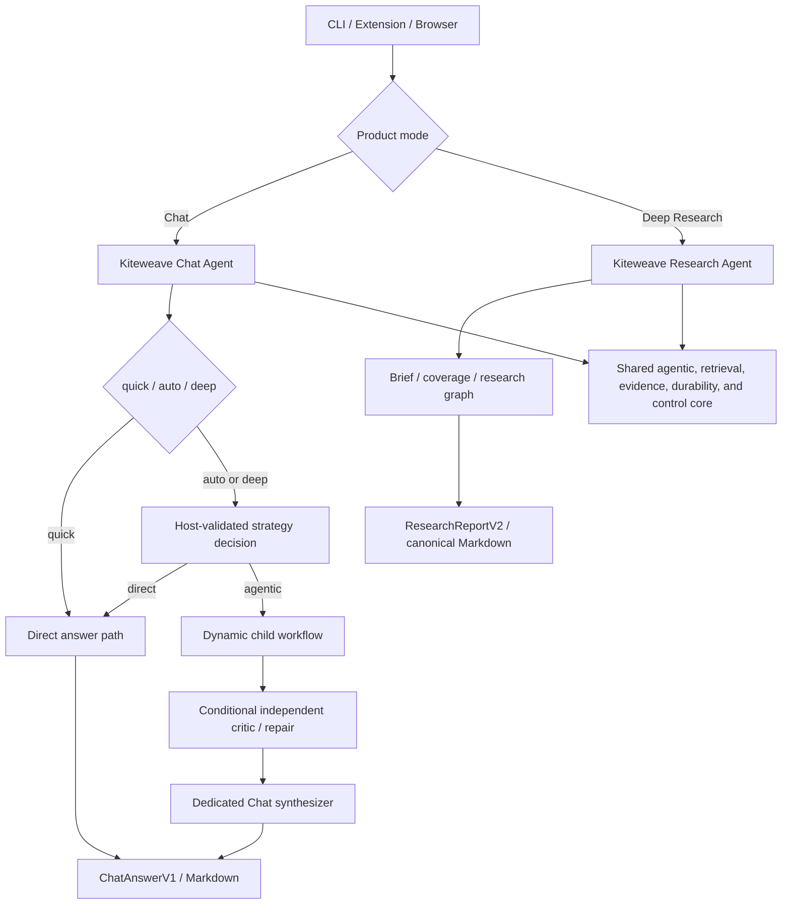

# Kiteweave Chat Agent Recovery Plan

Status: **In progress; C0-C3A proven, C4 live MV3 proof pending**

## Contents

- [1. Purpose](#1-purpose)
- [2. Corrective diagnosis](#2-corrective-diagnosis)
- [3. Fixed product contract](#3-fixed-product-contract)
- [4. Target architecture](#4-target-architecture)
- [5. Implementation and proof rules](#5-implementation-and-proof-rules)
- [6. Corrective implementation tasks](#6-corrective-implementation-tasks)
- [7. Delivery stages and commit boundaries](#7-delivery-stages-and-commit-boundaries)
- [8. Decisions deliberately deferred to measurement](#8-decisions-deliberately-deferred-to-measurement)
- [9. Definition of success](#9-definition-of-success)

## 1. Purpose

This plan corrects the current implementation direction for ordinary Chat.
The existing runtime exposes `quick`, `auto`, and `deep` quality labels, but the
active Chat path is still a constrained single-agent research-report path.
`deep` currently increases provider reasoning effort without changing the
workflow, retrieval strategy, independent validation, or completion objective.
That is not the product contract we intend to ship.

The corrected product has two separate top-level DeepAgentsJS agents:

- **Kiteweave Chat Agent** for conversational answers in `quick`, `auto`, or
  `deep` quality mode.
- **Kiteweave Research Agent** for explicitly selected, long-running Deep
  Research with an accepted brief, systematic coverage targets, a research
  ledger, and a canonical report artifact.

Both agents use the same DeepAgentsJS harness, host-owned QuickJS/PTC boundary,
read-only Atlassian capabilities, evidence stores, durable control ports, and
presenter-neutral events. They do not share root prompts, completion schemas,
workflow policy, or finalization logic.

This document is the canonical implementation order for repairing ordinary
Chat. It supersedes the **execution order** of Chat work in
`AGENTIC-CHAT-QUALITY-PLAN.md`. It does not invalidate that document's security,
durability, retrieval, evaluation, or Deep Research requirements. Research-only
tasks remain on the Research track.

## 2. Corrective diagnosis

The current Chat path has five structural defects:

1. `deep` changes provider controls but not agent behavior. It does not enable a
   strategy decision, dynamic decomposition, independent critique, repair, or a
   dedicated synthesizer.
2. Chat still uses a research-agent prompt, research draft schema, and research
   report finalizer. A conversational answer is forced into findings,
   relationships, limitations, and report-oriented presentation.
3. Retrieval is a fixed search-rank-detail program. It cannot directly read a
   bound entity, formulate a focused query, inspect a document outline, fetch a
   missing section, diversify a failed query, or perform gap-directed repair.
4. Conversation history exists, but accepted evidence is not yet durable
   cross-turn Chat memory. Every new turn starts another acquisition boundary,
   even when unchanged evidence could be safely reused.
5. Existing proof emphasizes contracts, isolation, budgets, and recovery. Those
   are necessary, but they do not prove that a user receives the right source,
   a useful answer, correct citations, or a coherent follow-up.

The recovery track therefore starts with the smallest visible quality proof:

> Read one explicitly attached Jira issue or Confluence page directly, answer
> the user's actual question as a normal Chat response, cite the canonical
> source, and reuse that evidence correctly in a follow-up turn.

Dynamic subagents are added only after that direct path is correct. More agents
must never amplify weak retrieval or turn a simple question into ceremonial
workflow overhead.

## 3. Fixed product contract

### 3.1 Outer product modes

| Product mode | Root agent | Completion objective | Default output |
| --- | --- | --- | --- |
| Chat | Kiteweave Chat Agent | Sufficiently supported conversational answer | Chat Markdown |
| Deep Research | Kiteweave Research Agent | Coverage against an accepted research brief | Canonical report Markdown |

Deep Research is entered only by explicit user choice. Chat may offer a
continuation or suggest switching to Deep Research, but it may never silently
promote itself.

### 3.2 Chat quality modes

| Chat quality | Root behavior | Delegation | Validation | Completion horizon |
| --- | --- | --- | --- | --- |
| `quick` | Direct bounded answer | Disabled; task bridge is not constructed | Deterministic evidence/citation boundary | Lowest conversational latency |
| `auto` | Supervisor chooses direct or agentic execution | Adaptive | Conditional quality assessment, critic, and repair | Conversational |
| `deep` | Supervisor must make an explicit strategy decision | Dynamically available when useful | Strong quality assessment; agentic paths use an independent critic and synthesizer | Conversational, never the Research ten-minute default |

Provider reasoning controls are optional accelerators behind a provider adapter.
They may not determine workflow availability or completion semantics. A provider
without an effort flag must run the same accepted trajectory.

### 3.3 Root construction invariant

The public factories are:

```ts
createKiteweaveChatAgent({ qualityMode, hostBindings })
createKiteweaveResearchAgent({ hostBindings })
```

The Chat factory owns two audited internal root configurations:

- a direct-only configuration for `quick`, without subagent middleware or a
  QuickJS `task()` bridge;
- an agentic-capable configuration for `auto` and `deep`, with the repository-
  owned `subAgentMiddleware` and durable bridge dispatcher.

Only one configuration is selected for a turn and only one logical root
`createDeepAgent` execution runs for that turn. `auto` and `deep` may finish
directly without dispatching a child. Routing, critique, repair, and synthesis
must not create additional root agents.

Immutable root construction may be cached only after typed per-run binding and
cross-user, thread, scope, cache, abort, and steering isolation are proven. Safe
per-turn construction remains the fallback.

## 4. Target architecture



### 4.1 Module boundary

Implement the separation inside the current package first. Do not begin with a
large workspace-package migration.

```text
packages/research/src/
  agentic-workflow-core.ts
  dispatch-adapter.ts
  chat-agent/
    contracts.ts
    runtime.ts
    prompts.ts
    strategy.ts
    retrieval.ts
    profiles.ts
    quality.ts
    answer.ts
    session.ts
  research-agent/
    runtime.ts
```

Move a primitive into a shared directory only when both roots consume the same
contract. Do not create a second capability broker, dispatcher, evidence store,
queue, or checkpointer for Chat.

### 4.2 Chat answer contract

Chat must not use a Research draft or report contract. Introduce a small typed
completion boundary similar to:

```ts
interface ChatAnswerV1 {
  schema: "atlcli.chat-answer/v1";
  messageMarkdown: string;
  citations: ChatCitationV1[];
  evidenceRefs: string[];
  gaps: ChatAnswerGapV1[];
  continuation?: ChatContinuationOfferV1;
}
```

The Markdown is the conversational response. Sources may also be projected as
UI source cards, but source cards never replace canonical inline or adjacent
citations. A Chat answer has no mandatory title, executive summary, findings
section, relationship section, limitation appendix, or report artifact.

## 5. Implementation and proof rules

- Parent task checkboxes are checked only after every implementation, automated
  test, and live acceptance checkbox in that task is complete.
- Complete and push one conventional commit after each proven parent task.
- Run the focused tests, root typecheck, production extension build, output/CSP
  audit, and tracked-tree research privacy scan before each pushed task commit.
- Run the full workspace suite at the Stage A, B, and C exit gates.
- Every runtime task requires a real read-only CLI run and a packed or installed
  MV3 run through the active production caller path.
- Private tenant questions, page/issue content, traces, reports, identifiers, and
  derived fixtures remain outside Git, PR descriptions, comments, and CI logs.
- Synthetic committed fixtures use only neutral test tenants, spaces, projects,
  pages, issues, people, and business content.
- No task may be accepted from mock-only proof when the task changes an active
  runtime path.

## 6. Corrective implementation tasks

### C0 — Freeze the failing baseline and establish quality measurements

Goal: make the current failure observable before replacing the path.

Implementation:

- [x] Define a versioned Chat evaluation observation containing answer outcome,
      selected sources, detail reads, citations, gaps, mode, strategy, model/PTC/
      HTTP calls, tokens, latency, and final Markdown length.
- [x] Add customer-free gold cases for an attached page, attached issue, long
      page, follow-up, Jira reference in a page, multi-source comparison,
      contradiction, no-evidence abstention, and context switch.
- [x] Capture the current direct Chat result as the `legacy-chat` comparison
      variant without freezing its implementation as desired behavior.
- [x] Record provider-effort-only `quick`, `auto`, and `deep` trajectories so the
      recovery work can prove that workflow changes, not only token increases,
      improve quality.

Automated proof:

- [x] Gold labels and metric calculations are deterministic and reject unknown
      source IDs, unsupported citations, or non-normalized requests.
- [x] The comparison harness proves that every variant receives the same scope,
      source corpus, question, and root budget envelope.
- [x] Evaluation artifacts cannot contain credentials, raw private source bodies,
      hidden reasoning, or committed private tenant identifiers.

Live acceptance:

- [x] Run one private read-only CLI baseline and one MV3 baseline through the
      production Chat path; retain artifacts only in the external artifact root.
- [x] Human review records the concrete wrong-source, answer-shape, retrieval,
      citation, completeness, latency, and follow-up defects without committing
      private input or output.

Acceptance criteria:

- [x] We can reproduce and score the current quality failure before changing the
      runtime.
- [x] The baseline distinguishes provider reasoning effort from orchestration and
      retrieval quality.

Proof record (2026-08-05): the focused Chat evaluation suite and workspace
typecheck pass; the production extension builds and passes its output gate; the
packed MV3 Chat E2E passes; private read-only CLI, follow-up, effort-comparison,
and installed-MV3 observations are retained only in the external artifact root.

### C1 — Split the Chat root from the Research root

Goal: stop running ordinary Chat through `runResearchAgent` and Research report
finalization.

Implementation:

- [x] Add `ChatTurnRequestV1`, `ChatQualityPolicyV1`, `ChatAnswerV1`, citation,
      gap, strategy, continuation, and typed error contracts.
- [x] Add `createKiteweaveChatAgent` and `runChatAgent` as a separate root runtime.
- [x] Rename or wrap the existing production entry as
      `createKiteweaveResearchAgent`/`runResearchAgent` without changing Research
      semantics.
- [x] Give Chat its own system prompt and user-turn prompt. Remove the terms
      research brief, research graph, report outline, research coverage, and
      canonical report from the Chat prompt.
- [x] Add a Chat finalizer that validates evidence/citations and returns
      `ChatAnswerV1` without invoking Research report schemas or finalizers.
- [x] Route CLI and extension Chat worker calls to `runChatAgent`; keep Deep
      Research routed to `runResearchAgent`.
- [x] Version persisted Chat state so an old Research-shaped Chat checkpoint
      cannot be resumed under the new contract as though it were compatible.

Automated proof:

- [x] Import-boundary test proves the Chat runtime does not import
      `ResearchBriefV1`, Research graph composition, Research draft schemas, or
      Research report finalization.
- [x] Root-spy tests prove one Chat `createDeepAgent` root per turn and a separate
      Research root factory.
- [x] Chat structured-output repair returns only `ChatAnswerV1`; it cannot fall
      back to findings/relationships/limitations arrays.
- [x] Existing Deep Research graph, report, resume, and privacy tests remain green.

Live acceptance:

- [x] CLI and MV3 answer a simple synthetic question as natural Chat Markdown.
- [x] The response contains no research-report heading or empty report sections.
- [x] Explicit Deep Research still produces its canonical report artifact.

Acceptance criteria:

- [x] Chat and Research have separate roots, prompts, completion objectives, and
      finalizers while sharing the same secure host infrastructure.

Proof record (2026-08-05): 184 focused contract, CLI, extension, Chat-root,
Research graph/report/resume, host-parity, and privacy regressions pass; root
typecheck, the production MV3 build, output/CSP audit, and privacy scan pass. A
read-only CLI Chat run produced natural cited Markdown through the new root. In
one packed production-bundle sequence, the separate Chat path produced a
natural cited answer while explicit Deep Research produced and durably retained
its canonical report across reload/resume; its deliberate stop was persisted as
cancelled without being presented as a provider failure.

### C2 — Prove exact-context direct reading

Goal: make the most common current-page/current-issue question correct before
adding agentic complexity.

Implementation:

- [x] Add a host-issued exact-anchor reference for the bound Confluence page or
      Jira issue. The model may use the opaque reference but may not substitute an
      arbitrary page ID, issue key, URL, tenant, or scope.
- [x] Add a direct bound-entity read capability that validates tenant, binding,
      entity kind, authorization, byte budget, timeout, and cancellation before
      HTTP.
- [x] Remove search and candidate ranking from the exact-anchor path.
- [x] Treat the containing project/space only as validation authority; do not
      search it unless the question or an explicit added context requests a
      broader scope.
- [x] Trigger Jira acquisition from a Confluence-only turn only when the question
      requires Jira or the retrieved page exposes a Jira key, structured Jira
      macro, or Jira link that is material to the answer.
- [x] Preserve the canonical URL and exact source identity from the host response;
      never let the model construct them.

Automated proof:

- [x] Attached-page test performs one matching detail read and zero search HTTP
      calls.
- [x] Attached-issue test performs one matching detail read and zero search HTTP
      calls.
- [x] A hostile or stale presenter-supplied anchor cannot widen or replace the
      host binding.
- [x] A mismatched detail response fails closed and cannot fall back to another
      search result.
- [x] Confluence-only input produces zero Jira calls unless an admitted Jira
      signal is observed and relevant.
- [x] Canonical URL tests cover personal-space keys, renamed titles, encoded
      paths, and issue keys without trusting model-authored URLs.

Live acceptance:

- [x] In CLI and MV3, summarize one exact attached page correctly with its
      canonical citation and no unrelated source.
- [x] In CLI and MV3, answer one exact issue question correctly with no unrelated
      page or project search.
- [x] The user-visible activity says the named attached entity is being read; it
      does not claim that the containing space/project is being searched.

Acceptance criteria:

- [x] Exact-context wrong-source rate is zero in the committed gold set.
- [x] Exact-context retrieval performs no unnecessary search operation.

Proof record (2026-08-05): focused exact-anchor broker, QuickJS, UI, event, and
evaluation tests, the workspace typecheck, the production extension build and
output/privacy checks, and a packed MV3 exact-page/exact-issue lifecycle test
passed. Separate approved private read-only CLI exact-page and exact-issue runs
each used the opaque direct-read capability, performed no search or ranking,
returned the correct sole canonical source, and retained their outputs only
outside Git.

### C3 — Add navigable long-document reading

Goal: prevent long or structurally complex Confluence pages from collapsing into
an unhelpful truncated excerpt.

Implementation:

- [x] Add a bounded document-outline projection containing canonical section
      identities, headings, ordering, content byte estimates, and structured
      macro/link metadata without full bodies.
- [x] Add an authorized section/chunk read capability using only host-issued
      section references.
- [x] Let the direct Chat root choose relevant sections from the outline and fetch
      additional sections until the question is supported or the Chat budget
      enters finalization reserve.
- [x] Preserve exact visible support spans and section identity for citations.
- [x] Distinguish source truncation, projection truncation, unread sections, and
      genuinely empty content. Do not turn any of them into a claim that content
      is absent from the complete page.
- [x] Bound section count, characters, bytes, nodes, depth, calls, concurrency,
      and cumulative retained evidence.

Automated proof:

- [x] The relevant evidence exists only in a late section and is still found.
- [x] A large irrelevant section is not loaded when the outline identifies a
      narrower relevant section.
- [x] Section references cannot be forged, replayed across tenants, or used after
      their turn/scope revision is obsolete.
- [x] Truncation tests distinguish a supported positive excerpt from an
      unsupported whole-document negative claim.
- [x] Near-limit and overflow cases fail with a supported partial answer or typed
      gap, never silent clipping or an invented completion claim.

Live acceptance:

- [x] CLI and MV3 correctly answer a question whose support is beyond the first
      projection of a long read-only page.
- [x] The answer cites the correct page and states only material residual coverage
      gaps in user language.

Acceptance criteria:

- [x] A long attached page can produce a useful supported answer without treating
      the whole page as unusable solely because one projection was truncated.

Proof record (2026-08-05): 151 focused document-navigation, exact-section,
answer-contract, CLI, event, evidence, extension UI, and broker tests pass,
including late-section selection, irrelevant-section exclusion, hostile,
cross-tenant, and stale opaque references, and typed overflow/coverage behavior.
The workspace typecheck, production MV3 build, output/CSP gate, privacy scan, and
packed MV3 long-page lifecycle pass. One approved private read-only CLI run used
one exact bound-page read followed by one opaque late-section read with no search
or ranking, returned the sole canonical citation, and disclosed the material
residual coverage limit; its artifact remains outside Git.

### C3A — Harden structured Confluence reading and context-sensitive HITL

Goal: preserve the meaning and identity of structurally complex Confluence
content before agentic Chat strategies multiply retrieval paths. Ask the user
only when unresolved ambiguity is material; never replace an exact anchor with
search or clarification ceremony.

Implementation:

- [x] Pin every outline and section projection to one verified content identity,
      version, representation, and capture boundary. A section reference must
      become stale when any of these change and mixed-version evidence must fail
      closed.
- [x] Add conformance projections for tables, Expand macros, Jira Live macros,
      Smart Links, and Include/Excerpt structures. Preserve semantic structure,
      link/macro identity, and explicit unresolved content without flattening it
      into misleading prose.
- [x] Keep Storage as the required baseline representation. Isolate the parser
      behind a representation-neutral document port so a later measured ADF or
      AGG adapter can supply the same normalized outline/section contracts
      without changing Chat tools or prompts. The deferred provider experiment
      is specified in
      [`CONFLUENCE-REST-AGG-AB-PLAN.md`](./CONFLUENCE-REST-AGG-AB-PLAN.md).
- [x] Enforce question-directed auxiliary acquisition: comments, attachments,
      labels, ancestors, properties, and versions are absent from the default
      tool surface and may be admitted only by an explicit typed need derived
      from the question or a material evidence gap.
- [x] Implement a context-sensitive clarification policy: consume exact anchors,
      explicit IDs/URLs/keys, already approved scope, and safe catalog resolvers
      before asking. Create a durable, revision-fenced HITL checkpoint only when
      the remaining ambiguity would materially change authorized scope or the
      answer. Exact page/issue anchors never trigger title resolution or HITL.
- [x] Project typed coverage states for source-limit overflow, parse-budget
      overflow, unsupported structures, unresolved includes, projection
      truncation, and unread sections. None may be represented as empty content
      or as proof that information is absent from the complete page.

Automated proof:

- [x] Outline and section reads are rejected if their source identity, page
      version, representation, tenant, turn, or scope revision differs from the
      captured document snapshot.
- [x] A section read performs zero additional search calls and zero additional
      page-detail HTTP calls; it reads only the retained verified snapshot under
      the existing PTC, byte, concurrency, cancellation, and evidence limits.
- [x] An exact anchor with an ambiguous or renamed title still reads the bound
      entity directly and performs neither title search nor clarification.
- [x] A missing term in the visible projection or selected sections cannot become
      a negative whole-document claim while any section, include, or structural
      projection remains unread or unresolved.
- [x] Source and parser limits produce a supported partial answer plus a typed,
      user-meaningful gap; they never produce `genuinelyEmpty`, silent clipping,
      or an invented completeness claim.
- [x] Auxiliary reads are admitted only for gold questions that require them and
      remain at zero for ordinary page-summary and exact-section cases.
- [x] Synthetic Storage fixtures cover tables, nested Expand macros, Jira Live
      macros, Smart Links, and Include/Excerpt structures with exact normalized
      metadata, visible support spans, and explicit unresolved-state assertions.
- [x] HITL tests cover no-question exact anchors, safe automatic resolution,
      ambiguous material scope, free-text and multiple-choice answers, stale
      answers, cancellation, reload, and identical CLI/MV3 continuation.

Live acceptance:

- [x] CLI and packed MV3 answer an approved read-only structurally complex page
      question from the same normalized evidence and canonical source without an
      unnecessary search, auxiliary read, or clarification.
- [x] CLI and packed MV3 pause on one genuinely material ambiguity, present the
      same user-facing question, durably resume after an answer, and do not start
      provider or Atlassian work before the accepted revision.
- [x] A private read-only structured-page run confirms useful answer quality,
      correct source identity, honest residual gaps, and body-free diagnostics;
      its inputs and artifacts remain outside Git.

Acceptance criteria:

- [x] Structured Confluence content is preserved well enough for supported Chat
      answers, and clarification is evidence-driven rather than a default escape
      from retrieval or scope resolution.

Proof record (2026-08-05): 730 focused browser-boundary, Confluence-structure,
document-navigation, Chat contract, durable session, CLI, and extension tests
pass, including tables, nested Expand macros, Jira macros, Smart Links,
Include/Excerpt gaps, capture/version invalidation, zero-HTTP section reads,
auxiliary-read admission, and revision-fenced clarification lifecycles. The root
typecheck, all 29 browser-entrypoint gates, research privacy scan, production MV3
build, and output/CSP gate pass. Three packed MV3 lifecycle tests pass against
the production build for same-session scope choice, direct exact anchors, and a
late long-page section. Approved private read-only CLI runs proved direct
structured reading and durable ambiguity/resume without constructing Research;
their inputs, source material, diagnostics, and answer artifacts remain outside
Git. The browser gate also has a regression proof that quoted dependency help
text is not confused with an executable Node import.

### C4 — Implement real `quick`, `auto`, and `deep` Chat strategies

Goal: make quality modes change host-validated workflow behavior rather than only
provider reasoning controls.

Implementation:

- [x] Keep `quick` on the direct-only Chat root. Do not construct subagent
      middleware, a task registry, or QuickJS task bridge.
- [x] Add `ChatStrategyDecisionV1` and a host-validated strategy-decision PTC for
      the agentic-capable root.
- [x] Include direct-versus-agentic execution, closed reason codes, ambiguity
      disposition, required capability classes, expected complexity, and quality
      risks in the strategy contract.
- [x] In `auto`, permit either direct or agentic execution based on the question,
      anchors, source count, comparison/relationship intent, contradiction risk,
      and unresolved ambiguity.
- [x] In `deep`, require an explicit strategy decision. Permit a direct strategy
      for a genuinely simple exact-context question, but require additional
      quality work when material complexity or evidence risk is present.
- [x] Map provider-neutral `fast`, `balanced`, and `thorough` preferences only
      after the host accepts the workflow policy.
- [x] Add a capability-free provider adapter that ignores reasoning preference
      without changing the accepted trajectory.

Automated proof:

- [x] Quick never exposes or dispatches `task()`.
- [x] Auto selects direct execution for simple exact-context gold cases.
- [x] Auto selects agentic execution for multi-source comparison, relationship,
      and contradiction gold cases.
- [x] Deep always records one accepted strategy decision and does not imply that
      subagents are mandatory for a trivial case.
- [x] Identical host trajectories result with a provider that has no reasoning-
      effort feature.
- [x] Provider controls cannot enable delegation or alter authorization, scope,
      budgets, completion objective, or finalization.

Live acceptance:

- [ ] Run the same simple and complex private read-only questions in Quick, Auto,
      and Deep through CLI and MV3.
- [x] Inspect body-free trajectories and confirm that mode-specific workflow
      behavior, not only token usage, differs as designed.

Acceptance criteria:

- [ ] Auto is cheaper/faster on simple cases than an unnecessary agentic run.
- [ ] Deep improves complex-question quality over Quick without regressing exact-
      context correctness.

Proof record (2026-08-05): 106 focused Chat strategy, answer-contract, CLI,
extension-host, quality-policy, API-surface, and export-registry tests pass. The
production MV3 build passes a packed-browser trajectory test covering Quick,
Auto, and Deep. The root typecheck passes, including the extension, browser PDF
compiler, and browser export harness. Approved private read-only CLI comparisons
used the same simple and complex questions across all three modes: Quick stayed
direct, simple Auto/Deep stayed direct after a host decision, and complex
Auto/Deep performed the accepted agentic strategy plus final evidence review.
The complex Deep CLI run read materially more relevant detail evidence and disclosed
fewer unresolved coverage gaps than Quick without weakening exact-context
identity. All private inputs, source material, trajectories, and artifacts remain
outside Git. Packed MV3 proves the same provider-neutral mode contract in the
browser shape; no private tenant material is embedded in browser fixtures. The
real provider-backed MV3 comparison remains open and the acceptance criteria stay
unchecked until that browser run is observed successfully.

### C5 — Add dynamic Chat subagent composition

Goal: let one central Chat supervisor dynamically isolate complex work while
keeping simple answers direct.

Implementation:

- [x] Register narrow host-owned profiles for exact-context reading, Confluence
      search, Jira search, relationship tracing, comparison analysis,
      contradiction checking, answer critique, and Chat synthesis.
- [x] Give each profile the minimum PTC capabilities, response schema, prompt,
      context projection, model preference, budget slice, and duration required
      by its role.
- [x] Add a host-validated Chat workflow proposal using the generalized
      `AgenticWorkflowV1` core and `conversation-answer` objective.
- [x] Let QuickJS compose dynamically sized parallel frontiers and dependency-
      driven continuation from only the host-returned admitted tasks.
- [x] Route bridged `task()` calls through the shared durable dispatcher with
      authorization, HITL, deterministic task/attempt IDs, reserve-before-call
      budgets, cancellation, and journal writes.
- [x] Keep child depth at one. A child cannot delegate, access sibling context,
      inspect the full supervisor history, or receive another child's trajectory.
- [x] Keep source bodies in the evidence workspace; guest code and child packets
      carry bounded references, metadata, support spans, claims, and gaps.
- [x] Dispatch exactly one dedicated Chat synthesizer for every agentic Chat path.

Automated proof:

- [x] Deterministic composition tests cover direct, two-sibling parallel, multi-
      wave dependency, optional critic, repair, and synthesis topologies.
- [x] Sibling timing proves real concurrency under the host concurrency ceiling.
- [x] Context-isolation tests prove no sibling/full-supervisor/source-body leak.
- [x] Unknown profile, forged task, duplicate dispatch, dependency violation,
      nested delegation, raw network, GraphQL, filesystem, Chrome API, credential,
      and mutation attempts fail before provider execution.
- [x] Packet item/character/byte/depth limits have explicit near-limit and
      overflow rejection tests.
- [x] Exactly one root and one agentic-path synthesizer execute per turn.

Live acceptance:

- [ ] A real read-only complex CLI question produces a dynamically composed
      workflow whose child tasks materially match the question.
- [x] The equivalent MV3 run uses the same accepted topology and capability
      closure.
- [x] A simple exact-page Deep turn may remain direct and dispatch no ceremonial
      children.

Acceptance criteria:

- [x] Dynamic composition reduces supervisor context and improves the complex
      answer without changing scope or exposing extra capabilities.

Proof record (2026-08-06): the production Chat root now registers exactly eight
host-owned, depth-one profiles. QuickJS proposes only profile IDs, objectives,
and dependencies; the host admits the graph and returns immutable dispatch
envelopes. The provider sees one `eval` surface while the host-audited `task()`
bridge remains inside the interpreter, and every child receives only its bounded
turn context, admitted dependency packets, response schema, capability subset,
model preference, duration, and byte limits. The shared dispatcher proves real
sibling concurrency, dependency hydration, cancellation, single-dispatch
semantics, and one dedicated final synthesizer. Explicit tests accept schema and
byte values at their limits and reject item, character, byte, and nested-shape
overflow before synthesis.

A complete provider-backed Deep CLI proof over synthetic read-only Jira and
Confluence adapters dynamically dispatched acquisition, analysis, critique, and
synthesis work. It emitted 21 summarized-reasoning deltas, 33 provisional
Markdown deltas, 13 bounded PTC calls, and one host-validated final answer in
176.1 seconds. The packed production MV3 bundle proves the same direct and
agentic decisions for Quick, Auto, and Deep, including the internal `task()`
bridge, child read, accepted topology, closure, summarized-reasoning stream, and
provisional-answer stream. No private tenant content, source body, credential,
provider payload, or raw chain of thought enters fixtures, packets, journals, or
committed proof text.

### C6 — Implement Chat retrieval planning and candidate accountability

Goal: replace fixed search-rank-detail behavior with question-directed retrieval
that stops at sufficient evidence rather than pretending a fixed cap is complete.

Implementation:

- [x] Add `ChatRetrievalPlanV1` with anchors, resolved entities, admitted searches,
      relationship traversals, unresolved terms, completion signals, and budget
      reservations.
- [x] Enforce the retrieval order: bound anchors; explicit URL/ID/key; approved
      natural-language resolver; focused scoped search; query variants;
      relationship traversal; controlled related-scope proposal; completion
      assessment.
- [x] Add a durable candidate ledger containing discovery provenance, query
      variant, rank, canonical identity, version, authority, deduplication,
      admission, detail-read state, exclusion reason, and deferred state.
- [x] Add bounded query reformulation and saturation detection for alternate
      titles, synonyms, terminology, and time windows.
- [x] Traverse Confluence-to-Jira text keys, structured Jira macros, and links,
      plus Jira-to-Confluence remote links, without implicitly granting broader
      whole-project or whole-space access.
- [x] Resolve natural-language project/space names through approved catalog tools;
      pause through HITL when a material ambiguity remains.
- [x] Reserve separate root capacity for direct reads, discovery/pagination,
      traversal, repair, critique, and synthesis. Rank further work by expected
      information gain rather than a fixed candidate count.
- [x] Add a host-owned sufficient-evidence assessment for Chat that remains
      distinct from Research corpus completeness.

Automated proof:

- [x] Relevant later-page candidate, alternate title, synonym, explicit link,
      search-index miss, Jira text key, Jira macro, Jira remote link, stale/new
      duplicate, and ambiguous resolver scenarios all have individual tests.
- [x] Every admitted candidate ends in detail-read, excluded-with-reason, or
      deferred-with-disclosed-reason state.
- [x] Few search results, index exhaustion, or a read cap cannot alone set
      sufficient evidence to true.
- [x] Invalid CQL/JQL, cursor, tenant, scope, traversal, or budget proposals fail
      before HTTP.
- [x] CLI and MV3 consume the same retrieval plan and candidate trace.

Live acceptance:

- [ ] A private read-only case demonstrates a relevant source found only by a
      later page or bounded query variant.
- [ ] The resulting answer and diagnostics account for every admitted candidate
      without exposing private source bodies in committed output.

Acceptance criteria:

- [x] Retrieval recall, wrong-source rate, detail-read coverage, canonical URL
      correctness, Atlassian calls, and latency are measurable per turn.

Proof record (2026-08-06): the separate Chat root now persists a typed retrieval
plan, candidate ledger, and sufficient-evidence assessment before and during
content access. An agentic supervisor may attach a bounded retrieval proposal to
its dynamic workflow: at most three typed variants per already-bound product,
ordered by expected information gain. The host rejects raw CQL/JQL, invented or
foreign cursors, unavailable products, scope changes, traversal depth greater
than one, late replanning, and budget overflow before HTTP. Every discovered
candidate retains query/page/rank provenance, canonical identity, observed
versions, authority, and a terminal detail-read, exclusion, or disclosed
deferral state. Per-turn run metadata exposes recall when a labelled proof corpus
exists, wrong-source rate, detail-read coverage, canonical URL correctness,
Atlassian calls, and latency.

Synthetic proof covers a later pagination page, alternate title and synonym,
query saturation, exact anchors that bypass search-index discovery, Confluence
text keys, structured Jira macros, tenant-local Jira-to-Confluence links,
foreign-space proposal, duplicate versions, natural-language scope resolution,
and durable ambiguity clarification. A tenant-local exact page link whose space
is not bound now produces only a body-free `pending-user-approval` record; it
does not create an anchor, candidate admission, or HTTP read, and it forces the
sufficient-evidence assessment to remain false. Cross-tenant links are rejected.
The real CLI SQLite/filesystem and MV3 IndexedDB conversation workspaces pass the
same conformance scenario with byte-identical retrieval plan, candidate ledger,
and assessment artifacts. The focused suites and packed production MV3 proof
also cover the same dynamic replan, agentic workflow, summarized-reasoning
stream, and provisional-Markdown stream. Only the private read-only live
acceptance remains unchecked rather than being inferred from synthetic data.

### C7 — Add sufficient-evidence assessment, critic, repair, and synthesis

Goal: prevent a single model from acquiring, judging, and publishing its own
unsupported interpretation without an independent quality boundary.

Implementation:

- [ ] Define a versioned groundedness rubric for question coverage, claim support,
      citation correctness, source authority/freshness, contradiction handling,
      wrong-source risk, uncovered candidates, and false completeness.
- [ ] Run deterministic host checks before any model critic: known source IDs,
      canonical URLs, admitted details, scope, evidence version, and citation
      references.
- [ ] Schedule an independent critic conditionally for Auto and for every
      materially complex agentic Deep path. Skip it only when an accepted direct
      single-source assessment proves low risk.
- [ ] Return typed defects such as unsupported claim, wrong source, missing
      context, incomplete retrieval, unresolved contradiction, or question not
      answered.
- [ ] Convert material defects into one bounded targeted repair wave; do not repeat
      generic discovery or allow unbounded self-critique loops.
- [ ] Reserve time and model budget for final synthesis before admitting repair.
- [ ] Give the final Chat synthesizer only the user objective, accepted evidence/
      claim references, supported spans, dispositions, explicit gaps, and answer
      style contract.
- [ ] At deadline, publish supported partial findings plus explicit material gaps
      and an optional continuation; never fabricate completeness.

Automated proof:

- [ ] Gold cases cover unsupported claim, wrong source, missing detail,
      truncation, contradiction, stale/duplicate sources, irrelevant candidates,
      prompt injection, repair success, and repair-budget exhaustion.
- [ ] The critic catches an intentionally wrong citation and the repair improves
      the final scored answer.
- [ ] Maximum critic/repair iterations and synthesis reserve are host-enforced,
      not prompt-only.
- [ ] Retrieved content cannot alter tools, scope, models, workflow, HITL, secrets,
      mutation policy, or rubric decisions.
- [ ] A synthesizer cannot cite rejected evidence or omit a blocking unresolved
      gap without deterministic rejection.

Live acceptance:

- [ ] One private complex run shows a real critic defect, targeted repair, and
      improved final answer through both CLI and MV3 production paths.
- [ ] Human review confirms the final answer addresses the question rather than
      merely enumerating limitations.

Acceptance criteria:

- [ ] Agentic Chat has an independent quality loop and a single coherent final
      author without becoming a fixed always-on pipeline.

### C8 — Add durable multi-turn Chat and evidence memory

Goal: preserve conversational continuity without treating summaries or stale tool
transcripts as factual authority.

Implementation:

- [x] Add `ChatSessionV1` and `ChatTurnV1` with versioned objective, quality mode,
      accepted strategy/workflow, controls, final answer, and compact activity
      references.
- [x] Keep conversation memory, operational summaries, and evidence memory as
      separate state classes with explicit resume ownership.
- [x] Persist accepted evidence by tenant, scope/capability provenance, canonical
      identity, version/last-modified, capture time, content hash, and supporting
      claim references.
- [x] Reuse unchanged evidence only inside the accepted freshness window and
      authorized scope; revalidate or re-read changed, stale, or newly material
      evidence.
- [x] Build each new supervisor context from the current user turn, compact
      conversation summary, recent messages, accepted evidence/claim references,
      unresolved gaps, and controls. Do not replay raw historic tool transcripts
      by default.
- [x] Keep DeepAgentsJS conversation summarization as non-authoritative operational
      context and preserve provider prompt-cache privacy boundaries.
- [x] Fence user, thread, tenant, scope, provider-cache identity, revision, abort,
      and steering state across root reuse or worker recreation.

Automated proof:

- [x] A fresh follow-up reuses accepted evidence with zero unnecessary HTTP reads.
- [x] A changed or stale source is revalidated and dependent claims are refreshed
      or invalidated.
- [x] A context switch cannot retain obsolete evidence as answer authority.
- [x] A 1,000-turn synthetic conversation remains bounded and semantically stable
      across native compaction.
- [x] Cross-user/thread/tenant isolation and hostile stale-client resume tests fail
      closed.

Live acceptance:

- [ ] Run at least three connected read-only turns in CLI and MV3: initial answer,
      evidence-based follow-up, then a materially different follow-up requiring
      new acquisition.
- [ ] Reload/restart between turns and verify that the correct conversation and
      evidence state resume without repeating settled calls.

Acceptance criteria:

- [x] Conversation continuity and factual evidence reuse are both durable, but
      neither can overwrite the other's authority boundary.

Proof status on 2026-08-06: the real Chat root completed three connected turns
through a fresh CLI host over one durable store; fresh accepted evidence produced
zero repeated provider reads, while a materially different turn acquired new
Jira evidence. The packed production MV3 bundle repeated the same three-turn
lifecycle across two offscreen-worker recreations and persisted all turns and
evidence authority in IndexedDB. Focused Chat session, native compaction,
prompt-cache privacy, broker freshness/invalidation, protocol-fence, full CLI,
typecheck, privacy, exact-context, strategy, and streaming E2Es pass. The two
private live-acceptance gates remain intentionally open until a separately
authorized tenant-data run is performed; no private source content is embedded
in committed fixtures or proof output.

### C9 — Add shared HITL, steering, stop, queue, and streaming

Goal: make Chat interactive and inspectable across shapes without leaking debug
state or hidden reasoning.

Implementation:

- [x] Add the shared durable `askUserQuestion` tool for multiple-choice, free-text,
      constrained mixed answers, and declared-assumption continuation.
- [x] Add one host-neutral FIFO queue with edit/delete-before-admission and a
      separate immediate steering command applied at a durable checkpoint.
- [ ] Propagate stop through root, children, broker, pagination, catalog,
      interpreter bridge, and provider calls; quarantine obsolete late results.
- [x] Project semantic events for strategy, direct read, search, selected sources,
      child work, critique, repair, synthesis, gap, HITL, steering, stop,
      continuation, and completion.
- [x] Consume DeepAgentsJS v3 message streams concurrently and project only an
      explicitly provider-approved summarized-reasoning channel as bounded,
      ephemeral presentation data. Never infer a summary from ordinary assistant
      text, tool arguments, signatures, redacted blocks, or raw provider events.
- [x] Show the current summarized-reasoning stream in the collapsed activity row
      with a two-line bound while retaining its accumulated text in the optional
      per-step details.
- [x] Stream provisional Chat Markdown incrementally and replace it atomically
      with the host-validated final answer. Do not stream hidden reasoning,
      unsummarized chain of thought, raw child output, credentials, raw source
      bodies, provider payloads, or budget/debug counters to the normal user view.
- [x] Persist replayable activity and the completed final answer atomically. Treat
      exact mid-provider token replay as later hardening unless evidence justifies
      its cost.
- [x] Provide complete German/English presentation copy and deterministic fallback
      for every event and error state.

Automated proof:

- [x] HITL pause/reload/answer/resume works with every supported question shape.
- [x] Queue messages remain FIFO and separately editable/deletable; immediate
      steering does not become an ordinary queued follow-up.
- [x] Steering revises only eligible remaining work and re-runs scope/HITL checks.
- [x] Stop acknowledgement meets an evidence-backed bound and no cancelled result
      can enter synthesis.
- [x] Event snapshots contain no raw private/debug/reasoning fields and cover both
      locales.
- [x] Synthetic Anthropic SSE, DeepAgentsJS v3, runtime-gate, UI, and packed-MV3
      tests prove that summarized thinking and the projected Markdown field
      stream independently while the structured-output envelope, signatures,
      redacted thinking, ungated model reasoning, and source bodies remain
      outside the presentation channel and durable journal.
- [x] Streaming interruption resumes from the last durable workflow checkpoint or
      reports a typed resumable interruption without pretending token replay.

Proof note (2026-08-06): the production MV3 bundle passes all 38 packed lifecycle
tests, including the bounded ephemeral summary channel. A real Sonnet 4.6 model
smoke emitted 1,619 summary characters through the native model stream. The
Anthropic adapter now uses LangChain's native JSON-schema response path instead
of forcing the terminal answer through a ToolStrategy call. A synthetic provider
contract test proves that the request contains `output_config.format`, omits a
forced `tool_choice`, streams the summarized reasoning through DeepAgentsJS v3,
and still yields host-parseable structured output. A complete provider-backed
Deep Chat run over hardcoded synthetic Jira and Confluence data then emitted eight
summary deltas across multiple model steps while producing a host-finalized
answer. The completed synthetic Deep Chat proof now emits eight reasoning-summary
deltas and 42 provisional Markdown deltas in 49.1 seconds. The incremental JSON
projector exposes only `messageMarkdown`; the final host validator remains
authoritative and atomically replaces the provisional UI content. Manual extended
thinking is intentionally not forced because it is
incompatible with forced tool choices and is not needed on the native path.
The later durable-interruption proof below closes that gate; remaining live
interactive-control acceptance stays open.

Core and packed-MV3 HITL checkpoint proof (2026-08-06): ordinary Chat now owns a dedicated
workspace-backed LangGraph checkpoint thread, separate from every Deep Research
checkpoint namespace. The host-neutral interaction state revision-fences the
FIFO queue, immediate steering, stop request, pending question, and resolved
answers. A production Chat-root test pauses through the native
`ask_user_question` tool, recreates the complete DeepAgentsJS host and
checkpointer, resumes the same tool node with `Command(resume=...)`, invokes the
model only once after resume, and completes the waiting turn. All five supported
question shapes pause and resume through fresh-host checkpoints. The production
Chat model surface exposes only `eval` and `ask_user_question`, never the
DeepAgents filesystem/task scaffold or direct Atlassian reads. Typed questions,
answers, and exact resume envelopes now cross worker, offscreen, background, and
sidepanel boundaries. The sidepanel restores a pending question from IndexedDB,
blocks queued-message admission while waiting, and supports free text, single
choice, multiple choice, mixed, and declared-assumption presentation. A packed
production MV3 E2E pauses on a model-selected question and resumes the same turn
through a freshly constructed worker. The CLI now presents and validates the
same five question shapes through a line-oriented interactive adapter and
resumes the exact conversation and turn with the accepted answer; focused CLI
integration tests prove this without constructing a second agent. A manual CLI
terminal demonstration and the other controls remain open, so the parent
live-acceptance boxes stay unchecked.

Cooperative stop proof (2026-08-06): cancellation now crosses the extension
boundary as a worker control message instead of immediately terminating the
worker. The shared Chat AbortSignal reaches the root model stream, agentic child
runtime, QuickJS bridge, and capability broker; the broker propagates it to
pagination and REST provider calls. The Chat runtime durably records and
acknowledges the stop before returning its typed cancelled result. The host drops
all post-cancel progress, presentation, and completion messages and has a
two-second hard-termination fallback. A packed production MV3 test completed the
cooperative cancellation and durable acknowledgement in 120 ms, while a worker-
host regression test proves that a late completion cannot enter the result. All
41 packed lifecycle tests pass after the transport change. Catalog cancellation
and the remaining implementation-wide propagation box stay open pending the
shared host-port slice.

Durable queue and steering-envelope proof (2026-08-06): one shared interaction
contract now revision-fences FIFO enqueue/edit/delete and the separate immediate
steering envelope. The active Chat worker serializes mutations while it owns the
turn; a fresh host can restore and mutate the same state after worker loss. The
sidepanel persists ordinary follow-ups instead of keeping a presenter-local
queue, admits them in FIFO order only after the current turn settles, and keeps
immediate steering out of that queue. Focused core, worker, background-router,
offscreen, message-boundary, and React tests pass. A packed production MV3 E2E
held an active model call, enqueued and edited a follow-up through the owning
worker, cancelled the run cooperatively, then reopened the workspace and found
the edited message with its durable revision. The complete production bundle
passes all 42 packed lifecycle tests after this change. Steering-directed
replanning and user-language semantic event replay remain separate open gates.

Semantic stream and replay proof (2026-08-06): the Chat runtime now consumes the
native DeepAgentsJS v3 stream throughout model and child-agent execution. It
projects provider-approved reasoning summaries and provisional Markdown only as
ephemeral live presentation, while a separate strict journal retains body-free
strategy, direct-read, search, selection, child-work, critique, repair,
synthesis, gap, HITL, steering, stop, continuation, and completion milestones.
The accepted final answer and its stable activity references are committed in
the same durable Chat-session revision. Reopening a legacy conversation remains
read-only and does not create a journal as a side effect. Exact-key validators,
German and English catalogue coverage, React replay, and runtime trajectory
tests pass. A packed production MV3 E2E restored the third connected turn,
semantic activity, and final answer after offscreen-worker recreation without
persisting reasoning summaries, source bodies, or credentials. The complete
packed production extension suite passes all 42 lifecycle tests.

Checkpointed steering proof (2026-08-06): immediate steering is now bound by the
active host to the original turn, normalized request, quality policy, and opaque
exact-anchor capability set before the model checkpoint is paused. A fresh
DeepAgentsJS host resumes the same LangGraph `thread_id` with
`Command(update=...)`; it retains the original objective, injects only the
host-accepted steering instruction, and re-enters the normal strategy,
scope/HITL, retrieval-plan, and final-review fences. Opaque exact-anchor refs are
restored only when their host-private binding IDs still exist in the same
accepted scope; changed-scope and forged resumes fail before provider I/O. The
packed production E2E pauses during a model call, persists and consumes the
revision-fenced steering request through the background after the first worker
has exited, constructs a fresh worker, reads the original exact page, and
completes the same turn without claiming token replay. Core continuation,
interaction, broker, session, runtime, protocol, presenter, typecheck, and all
43 packed MV3 lifecycle tests pass. The test also exposed and fixed an IndexedDB
lifecycle race: persisted background controls now settle before their connection
is closed.

Model-stream interruption proof (2026-08-06): the ordinary Chat runtime now
records a typed, revision-fenced interruption envelope after a provider stream
fails inside a model checkpoint. The envelope retains the normalized request,
quality policy, original turn, and only opaque host-private exact-anchor binding
identifiers; it persists neither partial provider tokens nor hidden reasoning.
A fresh DeepAgentsJS host resumes the same LangGraph `thread_id` with a bounded
host continuation message, re-enters the failed model node, and atomically clears
the interruption only after the host-finalized answer is committed. The
sidepanel performs at most one automatic retry and otherwise exposes the durable
resumable state instead of presenting a terminal research failure. Core tests
prove first failure, repeated-failure fencing, fresh-runtime recovery, and
checkpoint clearing. A packed production MV3 E2E emitted a provisional SSE text
delta, severed the response stream, persisted the checkpoint, recreated the
worker, restored the exact attached-page capability, completed the same turn,
and proved that the provisional fragment was absent from the final answer. All
44 packed MV3 lifecycle tests, focused React/runtime tests, typecheck, and the
tracked-tree privacy scan pass.

Live acceptance:

- [ ] Demonstrate queue, edit, delete, steering, stop, HITL, and resume in CLI and
      packed/installed MV3 against read-only operations.
- [ ] Confirm that the visible activity explains useful work in user language and
      expandable details remain concise and privacy-safe.

Acceptance criteria:

- [ ] All interaction controls use the same core contract in every host shape.

### C10 — Complete CLI, extension, and ordinary-browser parity

Goal: expose one Chat product with identical semantics rather than separate host-
specific agents.

Implementation:

- [ ] Define one `ChatAgentPortV1` for start, stream, answer-HITL, queue, edit,
      delete, steer, stop, resume, history, and artifact/source access.
- [ ] Keep `--thinking quick|auto|deep` in CLI and expose only user-meaningful
      deadline overrides, not workflow internals.
- [ ] Make Chat with `auto` the clear extension default; keep Deep Research as a
      separate explicit selector.
- [ ] Route the extension Chat worker to the Chat root and Research worker/resume
      paths to the Research root.
- [ ] Render conversation history, context chips, strategy/activity, sources,
      queue, steering, stop, HITL, and streamed Markdown through the same event and
      control contracts.
- [ ] Implement the ordinary-browser adapter against the same ports; do not create
      a browser-only agent or capability policy.
- [ ] Keep BYOK/provider configuration outside the composer and independent from
      Chat quality mode.

Automated proof:

- [ ] Contract tests run the same deterministic Quick, Auto-direct, Auto-agentic,
      Deep-direct, Deep-agentic, HITL, follow-up, steering, and stop scenarios
      through every adapter.
- [ ] CLI owns the fast complete workflow/recovery matrix; packed MV3 owns worker
      recreation, IndexedDB, active browser session, streaming, and representative
      control recovery; ordinary browser owns port/presenter parity plus targeted
      E2E.
- [ ] Presenter input cannot alter scope, durable state, strategy, evidence,
      budgets, or completion authority.

Live acceptance:

- [ ] The same read-only question and context produce equivalent source choice,
      strategy, supported claims, citations, and gaps in CLI and MV3.
- [ ] Switching to Deep Research visibly changes product mode and creates a report;
      changing Chat quality never does so.

Acceptance criteria:

- [ ] Chat semantics, controls, and evidence boundaries are shape-neutral.

### C11 — Establish release-blocking Chat quality gates and remove the legacy path

Goal: ship only after ordinary Chat is materially better than the legacy path and
the mode promises are empirically true.

Implementation:

- [ ] Expand the committed synthetic gold set to roughly twenty hand-labelled
      scenarios spanning routing, exact context, long documents, discovery,
      relationships, contradiction, clarification, repair, multi-turn reuse,
      steering, deadline, and injection.
- [ ] Score answer correctness, supported-claim recall, citation precision,
      wrong-source rate, source/candidate recall, detail coverage, relationship
      recall, contradiction handling, false completeness, latency, tokens, cost,
      model/PTC/HTTP calls, and peak supervisor context.
- [ ] Compare `legacy-chat`, Quick, Auto, Deep, and explicit Deep Research on the
      same eligible questions and budget disclosures.
- [ ] Calibrate any model judge against hand-labelled anchors and keep it
      diagnostic until human agreement/error thresholds are reviewed and
      accepted.
- [ ] Add privacy-safe optional answer feedback without committing tenant-derived
      text.
- [ ] Remove the old Chat branch from `runResearchAgent`, its legacy research
      prompt, compatibility-only UI routing, and obsolete tests only after all
      migration and release gates pass.
- [ ] Update user, architecture, provider, security, troubleshooting, and
      operations documentation in the same delivery commit.

Automated proof:

- [ ] Exact-context gold cases have zero wrong sources and canonical citations.
- [ ] Auto chooses the cheaper direct path for simple cases and an agentic path
      for complex cases at the accepted routing threshold.
- [ ] Deep materially improves the accepted complex-question quality score over
      Quick without regressing simple exact-context correctness.
- [ ] No Chat mode inherits the Deep Research brief, report finalizer, systematic
      coverage contract, or ten-minute default.
- [ ] Restart, steering, HITL, evidence reuse, and prompt-injection gates pass in
      the release-blocking suite.
- [ ] Full tests, typecheck, production builds, API/closure reports, output/CSP
      audit, and tracked-tree privacy scan pass after legacy deletion.

Live acceptance:

- [ ] Operator-reviewed private CLI and MV3 evaluation compares all modes on
      realistic read-only questions; all artifacts remain outside Git.
- [ ] The review explicitly accepts answer usefulness, citations, source choice,
      follow-up coherence, visible activity, latency, and cost trade-offs.
- [ ] A user can complete a multi-turn Chat session without seeing Research
      terminology or receiving a report-shaped answer unless Deep Research was
      explicitly selected.

Acceptance criteria:

- [ ] The legacy Chat-through-Research path is deleted, not retained as a hidden
      fallback.
- [ ] Quick, Auto, Deep, and Deep Research have empirically distinct and truthful
      behavior.

## 7. Delivery stages and commit boundaries

### Stage A — Correct direct Chat

Tasks: C0-C3A.

Exit gate:

- [ ] Exact page and exact issue answers are correct, natural, canonically cited,
      and use no unnecessary search.
- [ ] Long-page questions can fetch relevant sections instead of failing solely
      on one truncated projection.
- [ ] CLI and MV3 production paths pass the same direct-answer acceptance.
- [ ] Complex Storage structures preserve their source/version identity and
      unresolved portions become typed gaps rather than false negatives.
- [ ] Exact context never asks a ceremonial question; material unresolved scope
      pauses and resumes through the shared durable HITL contract.

Commit boundaries:

1. `test(chat): establish legacy quality baseline`
2. `refactor(chat): separate chat and research roots`
3. `feat(chat): read exact context directly`
4. `feat(chat): navigate long confluence content`
5. `feat(chat): preserve structured confluence evidence`

### Stage B — Real agentic Chat quality

Tasks: C4-C7.

Exit gate:

- [ ] Quick, Auto, and Deep execute different host-validated policies.
- [ ] Complex Auto/Deep questions use dynamic context-isolated children when
      useful, plus bounded independent quality validation.
- [ ] Retrieval accounts for candidates and repairs material evidence gaps.
- [ ] Deep improves complex-answer quality without degrading simple answers.

Commit boundaries:

6. `feat(chat): implement provider-neutral chat strategies`
7. `feat(chat): compose dynamic specialist workflows`
8. `feat(chat): add accountable retrieval planning`
9. `feat(chat): validate and repair chat answers`

### Stage C — Durable multi-turn product parity

Tasks: C8-C11.

Exit gate:

- [ ] Evidence-aware follow-ups, HITL, queue, steering, stop, streaming, restart,
      and conversation history work through shared ports.
- [ ] CLI, MV3, and ordinary browser preserve the same product semantics.
- [ ] Release-blocking quality and privacy gates pass and the legacy path is gone.

Commit boundaries:

10. `feat(chat): persist conversation and evidence memory`
11. `feat(chat): add durable interactive controls and streaming`
12. `feat(chat): align cli and browser chat shapes`
13. `feat(chat): enforce quality gates and remove legacy routing`

## 8. Decisions deliberately deferred to measurement

The following are not permission to leave behavior ambiguous. They require a
documented experiment before their production defaults are frozen:

- Auto and Deep soft/hard conversational deadlines.
- Mandatory synthesis reserve derived from observed synthesis P95 plus margin.
- Provider/model routing by role versus one-model fallback.
- Prompt-cache TTL and measured benefit.
- Maximum dynamic concurrency within host/device limits.
- Whether exact token-chunk replay after MV3 interruption is worth production
  complexity beyond durable checkpoint continuation.
- Whether a cheap pre-supervisor Auto classifier materially reduces latency
  without harming routing or scope quality.
- Whether either curated Confluence AGG operation passes the frozen REST/AGG
  A/B GO gates after C3A and C6.

Until measurement is accepted, correctness uses safe explicit limits, one-model
fallback, per-turn root construction, and honest resumable interruption.

## 9. Definition of success

This recovery is complete only when all of the following are true:

- [ ] Ordinary Chat never runs through the Research brief/report pipeline.
- [ ] One attached entity is read directly and cannot be replaced by a ranked
      unrelated candidate.
- [ ] Chat Markdown answers the actual question before presenting material gaps.
- [ ] Quick, Auto, and Deep change workflow semantics independently of provider
      reasoning controls.
- [ ] Auto and Deep use one central Chat supervisor and dynamically selected
      depth-one specialists only when they improve the task.
- [ ] Retrieval is question-directed, candidate-accountable, and capable of
      targeted repair.
- [ ] Agentic paths have an independent quality boundary and one coherent final
      synthesizer.
- [ ] Multi-turn Chat preserves conversation state and safely reusable evidence
      without replaying all historic source bodies.
- [ ] HITL, queue, steering, stop, streaming, and restart use shared shape-neutral
      contracts.
- [ ] CLI, extension, and ordinary browser pass the accepted quality and control
      gates.
- [ ] Deep Research remains a separate explicit agent and product mode.
- [ ] Private live data and artifacts never enter Git or public collaboration
      surfaces.

Implementation begins with C0 and proceeds in order. No later infrastructure
task may be used to declare Chat quality complete before the Stage A direct-answer
proof is accepted.
