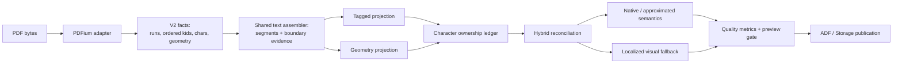

# PDF import quality: evidence-based text and structure reconstruction

Status: **Reopened after acceptance review** (PIQ-00 through PIQ-10 implemented;
PIQ-11 through PIQ-18 required before the native-table goal is complete,
2026-08-27)

Planned at: `cb981dea1f83d4dd5e17932239e42f99a1a607c7`
(`feat(drawio): add Draw.io previews and Confluence sync integration (#197)`)

Spec ID: `pdf-import-quality`

Priority: **P1**

Estimated effort: **XL / 5-8 implementation weeks**

Risk: **HIGH** - public PDF facts contracts, tagged reading order, geometry
heuristics, semantic digests, fallback policy, producer-specific structures,
and cross-host PDFium parity all change together.

## Implementation status

| Task | Status | Evidence |
|---|---|---|
| PIQ-00 | DONE | `DRIFT.md`; `EVIDENCE.md#piq-00` |
| PIQ-01 | DONE | `EVIDENCE.md#piq-01` |
| PIQ-02 | DONE | `EVIDENCE.md#piq-02` |
| PIQ-03 | DONE | `EVIDENCE.md#piq-03` |
| PIQ-04 | DONE | `EVIDENCE.md#piq-04-production-cutover` |
| PIQ-05 | DONE | `EVIDENCE.md#piq-05` |
| PIQ-06 | DONE | `EVIDENCE.md#piq-06` |
| PIQ-07 | DONE | `EVIDENCE.md#piq-07` |
| PIQ-08 | DONE | `EVIDENCE.md#piq-08` |
| PIQ-09 | DONE | `EVIDENCE.md#piq-09` |
| PIQ-10 | DONE | `EVIDENCE.md#piq-10` |
| PIQ-11 | OPEN | identify page-external structure children deterministically |
| PIQ-12 | OPEN | preserve usable siblings of page-external or unresolved children |
| PIQ-13 | OPEN | support intentional empty native table cells |
| PIQ-14 | OPEN | reconstruct safe punctuation line boundaries |
| PIQ-15 | OPEN | reconcile native table continuations across pages |
| PIQ-16 | OPEN | detect geometric tables as local connected grids |
| PIQ-17 | OPEN | contain unresolved fallbacks to affected regions |
| PIQ-18 | OPEN | prove the complete neutral and private-live acceptance scenario |

> **Executor instructions:** Read this plan completely before changing code.
> Run the drift and privacy checks in Task PIQ-00 first. Execute tasks in
> dependency order and run every verification gate. A task is complete only
> when its neutral fixtures, exact expected results, commands, and sanitized
> evidence are recorded in `specs/pdf-import-quality/EVIDENCE.md`.
>
> Never commit or copy a customer PDF, customer-derived text, customer-derived
> images, tenant identifiers, live URLs, raw API receipts, browser captures, or
> hashes that identify private input. The private document that motivated this
> work is not a fixture and must not be used to manufacture one.
>
> **Drift check:**
>
> ```bash
> git diff --stat cb981dea1f83d4dd5e17932239e42f99a1a607c7..HEAD -- \
>   packages/import-pdf packages/import-confluence \
>   apps/cli/src/e2e/wiki-import-pdf-live.e2e.test.ts \
>   scripts specs/import-pdf-mvp src/content/docs/confluence/import-pdf.md \
>   package.json bun.lock
> ```
>
> If an in-scope contract or algorithm changed, compare the current code with
> Section 3 and reconcile the plan before implementation. Do not silently fit
> new work onto stale excerpts.

---

## 1. Outcome

AtlCLI shall reconstruct text and producer-typical structure from born-digital
PDFs without silently joining words, reordering tagged content, dropping
partially tagged content, or replacing a whole page with an image when a safe
localized repair is possible.

The implementation is successful when all of the following are true:

1. Tagged and untagged text use one versioned reconstruction engine rather
   than separate character-concatenation rules.
2. The PDF facts contract preserves stable text-run identity and the relative
   order of mixed structure-element and MCID children.
3. Every inserted space, line join, retained or removed hyphen, and unresolved
   boundary has source indexes, evidence, confidence, and a deterministic
   decision code.
4. A block with an unresolved material word boundary is never reported as
   fully `native` with confidence `1`.
5. Tagged pages are repaired region by region with qualified geometry. Text is
   neither duplicated nor dropped, and a page image is the last safe fallback.
6. Producer-typical `THead`/`TBody`/`TFoot` tables and multi-block list items are
   preserved when their evidence is complete; unsupported shapes remain
   explicit fallbacks.
7. Preview reports boundary and ownership quality without exposing extracted
   body text.
8. Neutral fixtures from multiple producer families enforce exact block text,
   word-boundary quality, reading order, structure quality, no duplication,
   and fallback localization.
9. Bun source execution, built CLI execution, public-package reports, Node and
   browser facts parity, and neutral Cloud publication remain proven.
10. No private source or derived artifact enters Git, logs, fixtures, specs,
    commit messages, PR text, or CI artifacts.

This work improves semantic reconstruction. It does not promise pixel-perfect
reflow: PDF remains a final-layout format, and uncertain regions must stay
visible through explicit evidence or visual fallbacks.

---

## 2. Decisions

### 2.1 Reconstruct boundaries; do not post-correct language

Do not add a spellchecker, dictionary, language model, compound-word splitter,
or regex list of known phrases. Such post-processing would hide provenance and
break valid German compounds, names, code, CJK, and other scripts.

Boundary reconstruction must use evidence already present in or derived from
the PDF facts:

- literal and PDFium-generated whitespace;
- stable PDF text-run identity;
- tag-tree order and MCID ownership;
- baseline, character angle, bounding boxes, and relative gaps;
- font size and median glyph dimensions;
- punctuation and opening/closing delimiter classes;
- script and logical text direction;
- `ActualText`, soft hyphen, and PDFium's `hyphen` signal.

The engine may infer only a bounded set of deterministic decisions. Ambiguity
is an output, not permission to guess.

### 2.2 Introduce explicit V2 facts; do not mutate V1 semantics in place

The existing exported contracts and literal `/1` revisions are part of the
public package report. Do not change their meaning while retaining their names
and revision strings.

Add V2 contracts for facts that need the new information. Keep V1 exports for
the repository's deprecation window and update the committed API report.
PIQ-02 adds V2 facts, factories, and an internal V2-to-V1 projection without
changing the production factory or V1 digests. PIQ-04 then moves the production
adapter, semantic schemas, policy revision, and dependent digests atomically to
V2 after the shared assembler can consume the new facts. A V1-to-V2 adapter is
required only if Task PIQ-00 finds a persisted V1 consumer. There is no reason
to persist or round-trip V1 merely for the implementation itself.

### 2.3 Keep source order and visual order distinct

For tagged content, the ordered structure tree supplies logical ownership and
order. Character geometry qualifies boundaries and regions; it must not
silently reorder RTL or otherwise override a trustworthy logical order.

For untagged content, geometry establishes physical lines, fragments, columns,
and block order. Literal CR/LF characters are strong evidence but are not the
only way to identify a physical line.

### 2.4 `auto` becomes hybrid; explicit modes remain explicit

- `--reading-order auto`: tags first, then geometry only for unclaimed or
  demoted characters and regions.
- `--reading-order tags`: tagged projection plus explicit fallback; do not
  silently run geometry as if the user selected `auto`.
- `--reading-order geometry`: geometry-only qualification, including for a
  tagged source when explicitly requested.

No new public CLI flag is required.

### 2.5 Preserve safety while reducing fallback scope

Hybrid recovery is allowed only when character ownership is bijective and the
geometry region qualifies. A repaired untagged residual paragraph is normally
`approximated`, not automatically `native`, because its text may be editable
without carrying trustworthy source semantics.

If localized repair fails, retain a bounded region image. Escalate to a page
image only when residual characters cannot be localized, are dispersed across
the page, have invalid geometry, or overlap accepted native content
ambiguously.

### 2.6 Neutral fixtures are product evidence

The new quality corpus may contain committed neutral PDFs and authoring sources
created expressly for this repository. It must not contain the motivating
private PDF, any excerpt from it, a transformed copy, screenshots, metadata,
or a digest of private bytes.

Producer-exported binaries that cannot be reproduced in CI are acceptable only
when their manifest records neutral authoring source, producer/version,
platform, export settings, SHA-256, license/ownership, and expected semantics.
CI consumes the pinned bytes; it never tries to automate proprietary desktop
software.

---

## 3. Current state at the planning baseline

### 3.1 Raw character concatenation loses boundaries

`packages/import-pdf/src/text.ts` currently correlates tagged content by MCID,
sorts the resulting characters by page index, and concatenates their values:

```ts
// packages/import-pdf/src/text.ts:77-94
const characters = charactersForMcids(page, descendantMcids(node));
const extracted = normalizePdfText(
  characters.map((character) => character.value).join(""),
);
```

`packages/import-pdf/src/links.ts:26-53` independently repeats character
concatenation while creating link runs. `packages/import-pdf/src/reading-order.ts:53-90`
splits physical lines only at literal CR/LF and creates fragments only after a
large horizontal gap. Improving only one caller therefore cannot fix published
paragraphs, links, lists, tables, and untagged text consistently.

### 3.2 PDFium exposes run identity but the adapter discards it

`packages/import-pdf/src/adapter/pdfium.ts:524-539` obtains the PDF text object
for every character to read its MCID, but stores no deterministic run identity:

```ts
const textObject = module.FPDFText_GetTextObject(textPage, index);
const mcid = textObject
  ? module.FPDFPageObj_GetMarkedContentID(textObject)
  : -1;
```

Raw PDFium handles must never leave the adapter. The adapter can instead assign
the first previously unseen handle a deterministic per-page ordinal such as
`pdf:p0:text-run:3`.

### 3.3 Mixed structure-child order is discarded

`packages/import-pdf/src/adapter/pdfium.ts:439-448` reads the ordered child list
but stores structure elements in `children` and marked-content IDs in
`childMcids`. `packages/import-pdf/src/contracts.ts:39-50` has no common ordered
sequence. `descendantMcids()` then deduplicates and numerically sorts IDs.

Consequently, interleaved MCID and structure-element children cannot be
reconstructed in their logical tag order when content-stream order differs.

### 3.4 Successful tagged projection overstates text confidence

`packages/import-pdf/src/normalize.ts:111-178` checks missing or duplicate MCIDs,
Unicode errors, and empty text, then reports accepted tagged paragraphs with
confidence `0.99` or `1`. It has no word-boundary evidence.

`packages/import-confluence/src/publisher.ts:178-192` correctly verifies that
Confluence retained the generated ADF. That readback cannot prove the generated
text still matches the PDF source; source fidelity and transport fidelity are
separate gates.

### 3.5 `auto` is binary and unclaimed text is page-scoped

`packages/import-pdf/src/review.ts:174-193` chooses either the full tagged
normalizer or the full geometry normalizer. It does not repair residual tagged
regions.

`packages/import-pdf/src/normalize.ts:182-185` only treats visible characters
with an MCID as eligible tagged text. Conversely,
`packages/import-pdf/src/fallback-policy.ts:100-106` turns any recorded unclaimed
text into a whole-page fallback, even when every residual character has a
usable bounding box.

### 3.6 Producer structures are narrower than the documented contract

- `packages/import-pdf/src/tables.ts:107-162,225-232` accepts only direct
  `Table -> TR -> TH|TD`; it does not flatten `THead`, `TBody`, or `TFoot`.
- `packages/import-pdf/src/lists.ts:28-68` selects only the first paragraph and
  first nested list from an `LBody`.
- `packages/import-pdf/src/figures.ts:368-371` removes all deferred Figure
  evidence before proving that every deferred Figure produced a materialized
  candidate.

These paths can linearize, omit, or over-fallback otherwise valid producer
output.

### 3.7 Existing tests do not exercise the failure class

`packages/import-pdf/src/text.test.ts` contains two normalization tests.
`packages/import-pdf/src/tagged.test.ts:49-67` creates characters from already
correct strings containing their spaces. `packages/import-pdf/src/untagged.test.ts:28-63`
adds CR/LF after every synthetic line.

The tagged fixture generator emits each semantic text item as one complete `Tj`
operation and creates only direct table rows. `specs/import-pdf-mvp/fixtures/truth.json`
checks a few contained tokens rather than exact block strings.

At this baseline:

```text
bun run test packages/import-pdf
55 pass
0 fail
```

The green suite proves current deterministic behavior, not cross-producer text
fidelity. `specs/import-pdf-mvp/EVIDENCE.md:493-496` explicitly records that the
Word, LibreOffice, browser-print, and expanded Unicode/layout corpus was not
covered by the earlier evidence phase.

---

## 4. Target architecture



The PDFium adapter owns unsafe parser handles and emits deterministic facts.
The shared assembler owns text boundaries but no Confluence types. Tagged and
geometry projectors own semantic interpretation. The hybrid reconciler owns
character uniqueness and fallback scope. Publication remains unchanged and
continues to verify target transport semantics.

---

## 5. Target contracts

Names may be adjusted to match repository style, but the information and
version boundaries below are required.

### 5.1 V2 character and structure facts

```ts
export const PDF_FACTS_SCHEMA_V2 = "atlcli.pdf-facts/2" as const;
export const PDF_FACTS_ADAPTER_REVISION_V2 =
  "atlcli.pdfium-public-fpdf/2" as const;
export const PDF_ANALYSIS_POLICY_REVISION_V2 =
  "atlcli.pdf-analysis-policy/2" as const;

export interface PdfTextCharacterFactV2 {
  index: number;
  unicode: number;
  value: string;
  bbox: PdfNormalizedRect | null;
  fontSizePoints: number;
  fontWeight: number;
  angleRadians: number;
  mcid: number | null;
  /** Stable first-seen ordinal; never a PDFium pointer value. */
  textRunId: string | null;
  generated: boolean;
  hyphen: boolean;
  unicodeMapError: boolean;
}

export type PdfStructureKidFactV2 =
  | { kind: "mcid"; index: number; mcid: number }
  | { kind: "element"; index: number; node: PdfStructureNodeFactV2 }
  | {
      kind: "unresolved";
      index: number;
      reason: "child-handle-and-mcid-unavailable";
    };

export interface PdfStructureNodeFactV2 {
  id: string;
  type: string;
  title: string;
  alt: string;
  actualText: string;
  language: string;
  elementId: string;
  /** Direct IDs retained for provenance/fallback when the child API is empty. */
  directMcids: number[];
  /** Exact CountChildren order, including interleaved MCIDs and elements. */
  kids: PdfStructureKidFactV2[];
  attributes: PdfStructureAttributeFact[];
}
```

Rules:

1. The adapter assigns `textRunId` from a per-page `Map<PdfiumHandle, ordinal>`.
   The handle itself is never serialized, compared across pages, or exposed.
2. `kids` follows `FPDF_StructElement_CountChildren` index order exactly.
3. If a child index yields neither an element nor a usable MCID, retain an
   `unresolved` kid at that exact index. If the complete child API yields no
   usable entries, `directMcids` is the explicit fallback. Do not append both
   sources and duplicate the same MCID.
4. Logical MCID traversal preserves first occurrence. It does not numerically
   sort IDs.
5. PIQ-02 adds the complete V2 facts surface and factories while the existing
   production factory continues to emit V1 through an internal V2-to-V1
   projection. PIQ-04 performs the production policy/semantic cutover and all
   dependent digest changes atomically.
6. Update both `packages/import-pdf/etc/import-pdf.api.md` and its reachable
   closure with the repository scripts; do not edit either report by hand.

### 5.2 Boundary decisions and assembly

Add a source-neutral module such as
`packages/import-pdf/src/text-assembly.ts`:

```ts
export type PdfTextBoundaryActionV2 =
  | "preserve-explicit-space"
  | "insert-space"
  | "join-line"
  | "dehyphenate"
  | "retain-hyphen"
  | "no-space"
  | "unresolved";

export interface PdfTextBoundaryDecisionV2 {
  id: string;
  leftCharacterIndex: number | null;
  rightCharacterIndex: number | null;
  action: PdfTextBoundaryActionV2;
  basis: Array<
    | "literal-whitespace"
    | "generated-whitespace"
    | "text-run"
    | "structure-order"
    | "baseline"
    | "glyph-gap"
    | "script"
    | "punctuation"
    | "hyphen"
    | "actual-text"
  >;
  confidence: number;
}

export interface PdfTextAssemblyV2 {
  text: string;
  segments: Array<{
    text: string;
    characterIndexes: number[];
    synthesized: boolean;
  }>;
  characterIndexes: number[];
  boundaries: PdfTextBoundaryDecisionV2[];
  unresolvedBoundaryCount: number;
  bbox: PdfNormalizedRect | null;
  direction: PdfTextDirection;
  hasUnicodeError: boolean;
  usedActualText: boolean;
}
```

The assembler must implement these rules in this order:

1. Preserve and canonicalize explicit whitespace before considering geometry.
2. Use ordered tag children for tagged sequences and page character order only
   inside each referenced marked-content item.
3. Cluster physical lines from baseline/vertical overlap and angle. Treat
   literal CR/LF as strong hints, not the only line boundary.
4. At a same-line run boundary, compare the horizontal gap with versioned
   thresholds derived from median glyph width and font size. Thresholds are
   calibrated from the neutral corpus and live in one policy object.
5. Insert a space only for word-like neighbors when punctuation/script rules
   permit it. Never insert before closing punctuation or after an opening
   delimiter solely because the run changed.
6. Do not infer spaces inside CJK solely from a text-run change. Preserve
   logical RTL order; geometry may qualify a boundary but must not reverse the
   string.
7. Remove a line-end soft/generated hyphen only when the `hyphen`/soft-hyphen
   evidence and adjacent same-script word characters agree. Retain an authored
   visible hyphen when that proof is absent.
8. Expand only an explicit allowlist of Unicode presentation ligatures; do not
   apply broad NFKC compatibility normalization.
9. Mark a material alphanumeric boundary `unresolved` when evidence conflicts.
   Do not repair it with a dictionary.
10. If `ActualText` is present, use its normalized author-provided value and
    record `actual-text` boundaries. Preserve link marks only when source
    characters align exactly; otherwise report the unmapped link rather than
    silently applying a wrong mark.

Synthesized separators normally receive no link mark. They may remain inside a
link only when both adjacent source characters resolve to the same allowlisted
annotation.

### 5.3 Character ownership and hybrid outcome

Add an ownership ledger to the semantic result:

```ts
export interface PdfCharacterOwnershipV2 {
  pageIndex: number;
  characterIndex: number;
  ownerSourceId: string;
  targetNodeId?: string;
  basis: "tagged" | "geometry" | "fallback" | "reported";
  outcome: ImportOutcome;
}
```

Non-whitespace visible characters must have exactly one final owner. Boundary
decisions account separately for spaces and joins; whitespace must no longer be
ignored as irrelevant to source fidelity.

The hybrid result adds per-page counts for:

- visible characters and uniquely owned characters;
- explicit, inferred, and unresolved boundaries;
- geometry-repaired characters and regions;
- duplicate ownership attempts;
- residual reported characters;
- fallback scope and normalized fallback area.

All counts and revisions participate in the semantic and review digests.

### 5.4 Quality report without source-body disclosure

Extend `PdfPageReviewSummaryV1` through a versioned review schema. Standard
terminal and JSON output may include counts, decision codes, confidence,
source-character indexes, and normalized bounding boxes. It must not emit the
extracted source body merely to explain a quality warning.

`--unsupported fail` blocks publication when a material unresolved boundary,
duplicate ownership, unlocalized visible character, or false-native structure
remains. With `--unsupported report`, the result stays publishable only when
the ambiguity is covered by an explicit localized/page fallback or a reported
outcome allowed by the existing acknowledgment policy.

---

## 6. Scope

### In scope

- `packages/import-pdf/src/contracts.ts` and public exports;
- `packages/import-pdf/src/adapter/pdfium.ts` and adapter parity tests;
- a shared text-assembly module and tests;
- tagged correlation, link runs, geometry reading order, and untagged
  projection;
- tagged/geometry hybrid ownership and reconciliation;
- fallback localization and presentation policy;
- tagged table wrapper normalization;
- complete representable tagged list-item traversal;
- Figure deferred-evidence correctness;
- neutral quality fixtures, truth manifest, and an executable quality gate;
- PDF review JSON/terminal quality summaries;
- exact-text neutral built-CLI Cloud E2E and cleanup proof;
- public API reports, importer documentation, and sanitized implementation
  evidence;
- `package.json` only for the quality-check script if needed.

### Out of scope

- the motivating private PDF or any transformed/derived version of it;
- modifying or deleting the already published wiki page;
- OCR, scan recognition, language models, dictionaries, or spellchecking;
- changing PDFium version or adding a second production PDF parser;
- modifying the Extension PDF.js viewer;
- changing Confluence publisher transaction or rollback semantics;
- adding new CLI flags or changing default split behavior;
- broad DOCX importer refactoring;
- Data Center live certification;
- automatic release, merge, or cleanup of production content;
- optimistic native support for nested/continued/rotated tables that lacks a
  complete bijective proof.

---

## 7. Commands and repository conventions

Run tests through the root script so workspace imports resolve against source:

| Purpose | Command | Expected result |
|---|---|---|
| Install | `bun install --frozen-lockfile` | exit 0; no manifest/lock drift |
| Focused importer tests | `bun run test packages/import-pdf` | all pass |
| Quality corpus | `bun run check:import-pdf-quality` | every family passes; no raw bodies in output |
| Public API guard | `bun run build && bun run test scripts/api-report.test.ts` | build and report guard pass |
| Regenerate API report | `bun scripts/api-report.ts --update` | only reviewed package reports change |
| Typecheck | `bun run typecheck` | exit 0 |
| Full tests | `bun run test` | all pass |
| Build | `bun run build` | all tasks pass |
| Import performance | `bun run bench:import-pdf` | all existing budgets pass |
| Docs | `bun run docs:check` | exit 0 |
| Neutral live E2E | `bun run test:e2e:import-pdf` | create/readback/delete/404 proof passes |

Never use bare `bun test`. Use the current checkout through Bun; do not depend
on an installed AtlCLI release.

TypeScript is strict ESM. Keep pure decisions separate from PDFium IO and
Confluence IO. Use `output()`/`fail()` conventions only if a CLI presentation
change is necessary. Confluence features require both ADF and Storage contract
coverage where the shared semantic document changes.

Commit logical units with conventional messages such as:

- `test(import-pdf): add neutral quality corpus`
- `feat(import-pdf): preserve ordered text evidence`
- `fix(import-pdf): reconstruct word boundaries`
- `fix(import-pdf): localize tagged geometry repairs`
- `docs(import-pdf): explain source fidelity gates`

Do not push or open another PR unless the operator explicitly instructs it.

---

## 8. Implementation tasks

### PIQ-00 - Record drift, privacy boundary, and baseline

**Status: DONE (2026-08-27).** The sanitized proof is recorded in
`specs/pdf-import-quality/DRIFT.md` and
`specs/pdf-import-quality/EVIDENCE.md#piq-00`.

Create:

- `specs/pdf-import-quality/DRIFT.md`;
- `specs/pdf-import-quality/EVIDENCE.md`.

Record the starting commit, the Section 7 command versions, and sanitized
aggregate results. Do not record private source titles, text, IDs, URLs,
digests, or screenshots.

Run the mandatory drift command and inspect public API consumers before
choosing the V1 deprecation path:

```bash
rg -n "PdfFactsV1|PDF_FACTS_SCHEMA_V1|PdfFactsAdapter" \
  apps packages scripts --glob '!packages/import-pdf/etc/**'
```

If any consumer persists V1 facts outside an in-memory preview/publication run,
STOP and add an explicit V1 reader/migration contract to this plan before
continuing.

Capture the current green baseline:

```bash
bun run test packages/import-pdf
bun run typecheck
git status --short
```

Expected: importer tests and typecheck pass; the worktree contains only the
planned spec/evidence files.

### PIQ-01 - Add the neutral fragmented-text and producer corpus

**Status: DONE (2026-08-27).** Four byte-deterministic Bun fixtures and three
pinned neutral producer exports are bound by
`specs/pdf-import-quality/fixtures/manifest.json`. The sanitized proof is in
`specs/pdf-import-quality/EVIDENCE.md#piq-01`.

Create `specs/pdf-import-quality/fixtures/` with a manifest and neutral
authoring sources where practical. Extend the existing generator or add a
focused generator in this directory; do not overload unrelated MVP fixtures.

Required fixture families:

1. Tagged paragraph split across text objects with an omitted space glyph.
2. Tagged paragraph with interleaved MCID and `Span` children whose tag order
   differs from numeric MCID and physical stream order.
3. Font/style change and safe-link boundary within one sentence.
4. Wrapped lines with literal CR/LF, generated CR/LF, and no CR/LF.
5. Soft/generated hyphen, authored hard hyphen, ligatures, German umlauts, and
   punctuation/delimiters.
6. LTR, logical RTL, and CJK examples.
7. Partially tagged page with localized unmarked text and a separate
   unlocalizable negative case.
8. Tables using direct rows, `THead`/`TBody`/`TFoot`, absent default-one spans,
   multiple tables on one page, and malformed/nested negative cases.
9. Multi-paragraph list items, a supported nested list, and an unrepresentable
   multiple-nested-list negative case.
10. A tagged Figure without a directly correlatable image/path object.
11. At least one neutral export each from Word, LibreOffice, browser print, and
    an independent PDF generator.

The truth manifest must contain exact ordered block text, expected boundary
actions, structure outcomes, ownership/fallback expectations, producer
provenance, and file digests. Token-only truth is insufficient.

Add manifest/generator determinism tests first. Runtime exact-text assertions
land with the implementation task that makes them pass; do not commit a
permanently skipped release fixture.

**Verify:**

```bash
bun run test packages/import-pdf/src/fixtures.test.ts
git diff --check
```

Expected: neutral fixture provenance and digests pass; no private data is
present.

### PIQ-02 - Introduce V2 facts with ordered kids and stable text runs

Modify `packages/import-pdf/src/contracts.ts` and
`packages/import-pdf/src/adapter/pdfium.ts` to implement Section 5.1
additively. Add separate Node and browser V2 factories plus an internal
V2-to-V1 projection for the existing factory. Do not change V1 contract
semantics, the production factory return type, V1 revision literals, or V1
digests in this task; PIQ-04 owns that atomic cutover.

Update all test fact builders explicitly; do not fill required V2 evidence via
unsafe casts. Add adapter tests proving:

- two characters from the same PDF text object share a stable `textRunId`;
- distinct text objects get distinct first-seen ordinals;
- repeated analysis emits identical V2 facts and digest;
- raw pointer values never appear in canonical facts;
- mixed structure kids retain exact index order;
- an unusable child index remains an explicit `unresolved` kid;
- direct-MCID fallback does not duplicate IDs;
- browser and Node adapters produce equal canonical V2 facts;
- lifecycle, cancellation, and hard budgets still pass.

Review `packages/import-pdf/src/package-boundary.test.ts`. If implementation
needs an additional public PDFium function, add it to the explicit allowlist
only after verifying it exists in the pinned declaration surface and does not
introduce a network/private API. Do not call undocumented `EPDF_*` functions.

Regenerate the public API report and review the complete diff.

**Verify:**

```bash
bun run test packages/import-pdf/src/pdfium.test.ts \
  packages/import-pdf/src/package-boundary.test.ts
bun run build
bun scripts/api-report.ts --update
bun scripts/api-closure.ts --update
bun run test scripts/api-report.test.ts
bun run build:browser-export-harness
bun run test:browser-export-harness
```

Expected: deterministic V2 parity passes; only intended import-PDF public
contracts and their reachable closure change. Existing V1 factories and
digests remain byte-for-byte stable.

### PIQ-03 - Implement the shared text assembler

**Status: DONE (2026-08-27).** The assembler is additive and exported for
Node/browser consumers. Production V1 routing remains unchanged until the
atomic PIQ-04 cutover; see `DRIFT.md` and `EVIDENCE.md#piq-03`.

Create `packages/import-pdf/src/text-assembly.ts` and its focused test file.
Move layout-sensitive assembly out of `normalizePdfText`, `correlateTaggedText`,
`taggedRuns`, and geometry fragment construction.

Keep `normalizePdfTextFragment` limited to safe Unicode/control/whitespace
canonicalization. It must not make layout decisions after character provenance
has been discarded.

Implement the ordered rules in Section 5.2 as pure functions. All thresholds
belong to one frozen, revisioned policy. Tests must assert not only final text
but the exact boundary action, basis, confidence band, character indexes, and
deterministic decision ID.

Minimum tests:

- explicit space is preserved once;
- a same-line run gap inserts exactly one space;
- a style or MCID change with no word gap does not invent a space;
- a missing-space line continuation becomes one space;
- closing punctuation and opening delimiters remain attached correctly;
- generated/soft hyphen dehyphenates only with complete proof;
- authored hard hyphen remains;
- allowlisted ligature expansion is explicit and NFC remains stable;
- CJK does not gain spaces from run changes;
- RTL logical order is not geometrically reversed;
- conflicting geometry returns `unresolved`;
- `ActualText` remains authoritative and an unalignable link is reported;
- three identical runs produce the same assembly and digest.

**Verify:**

```bash
bun run test packages/import-pdf/src/text.test.ts \
  packages/import-pdf/src/text-assembly.test.ts
```

Expected: all boundary families pass with exact evidence snapshots or
structural assertions; no source body is printed on failure beyond neutral
fixture expectations.

### PIQ-04 - Route tagged, links, geometry, lists, and tables through one assembler

**Status: DONE (2026-08-27).** Tagged and geometry semantics, figures,
fallback evidence, split planning, review reporting, and the CLI production
route now carry V2 facts and boundary evidence together. V1 entry points and
`/1` schema meanings remain available; see
`EVIDENCE.md#piq-04-production-cutover`.

Replace independent text joining in:

- `packages/import-pdf/src/text.ts`;
- `packages/import-pdf/src/links.ts`;
- `packages/import-pdf/src/reading-order.ts`;
- `packages/import-pdf/src/untagged.ts`;
- `packages/import-pdf/src/lists.ts`;
- `packages/import-pdf/src/tables.ts`.

At the start of this task, move the production facts factory and semantic
pipeline atomically to V2. Change the analysis-policy and semantic schema
revisions here, not in PIQ-02, and review every dependent digest change.

Tagged correlation follows ordered V2 structure kids. Geometry analysis first
clusters physical lines, then forms fragments and blocks. Adjacent physical
lines that belong to one paragraph must be joined as one paragraph when the
qualified continuation rules pass; do not publish each line as a paragraph by
default.

`taggedRuns` consumes assembly segments. It applies safe annotations to source
characters and synthesized separators according to Section 5.2, so fixing
`correlateTaggedText` cannot diverge from the final published run text.

Propagate boundary decisions into semantic evidence and policy digests. Any
material unresolved boundary lowers the outcome/confidence and creates a
stable issue with a locator. It must not remain a `native` confidence-1 block.

Add exact ADF and Storage text assertions for the neutral fragmented corpus.

**Verify:**

```bash
bun run test packages/import-pdf/src/tagged.test.ts \
  packages/import-pdf/src/untagged.test.ts \
  packages/import-pdf/src/tables.test.ts \
  packages/import-pdf/src/text-assembly.test.ts
```

Expected: exact text and boundary evidence pass for tagged and untagged paths;
existing simple fixtures remain semantically unchanged except for planned
revision/digest updates.

### PIQ-05 - Add character ownership and hybrid tagged/geometry recovery

Add a pure reconciliation module such as
`packages/import-pdf/src/hybrid.ts`. Do not embed the ownership algorithm in
`review.ts`.

Algorithm:

1. Project accepted tagged nodes and record every claimed character index.
2. Account for all visible characters, including `mcid === null`.
3. Partition unclaimed/demoted characters into localized geometry regions
   using line clusters and touching/nearby normalized boxes.
4. Reject a geometry repair if it overlaps a tagged owner, claims a character
   twice, crosses an unqualified column/rotation boundary, or contains an
   unresolved material text boundary.
5. Insert accepted repair blocks in deterministic page/bbox/source order and
   mark them `approximated` unless a stricter existing native geometry contract
   is fully met.
6. Send rejected but localized regions to region fallback.
7. Escalate to page fallback only for missing/invalid boxes, dispersed residual
   regions, conflicting overlap, or an existing page-level safety condition.
8. Assert a final ledger invariant: every non-whitespace visible character has
   exactly one native, approximated, fallback, or reported owner.

Wire `--reading-order auto` to this hybrid path in
`packages/import-pdf/src/review.ts`. Preserve the explicit `tags` and `geometry`
mode decisions from Section 2.4.

Update `packages/import-pdf/src/fallback-policy.ts` and
`packages/import-pdf/src/visual-fallbacks.ts` so unclaimed text with usable
localized boxes no longer forces a page image. The full-page safety behavior
must remain for the negative fixtures.

Tests must prove:

- localized untagged residue becomes one editable repair or region crop;
- an unlocalizable residue remains page-scoped;
- no source character is duplicated across tagged and geometry blocks;
- fallback coverage closes the corresponding reported issues;
- two distant residual regions do not merge into an oversized crop;
- repeated execution yields equal semantic, issue, and plan digests;
- split planning still assigns every source page exactly once.

**Verify:**

```bash
bun run test packages/import-pdf/src/hybrid.test.ts \
  packages/import-pdf/src/fallback-policy.test.ts \
  packages/import-pdf/src/visual-fallbacks.test.ts \
  packages/import-pdf/src/review.test.ts \
  packages/import-pdf/src/split.test.ts
```

Expected: all ownership invariants pass; localized positive fixtures avoid a
page fallback; unlocalized negative fixtures retain it.

### PIQ-06 - Normalize producer tables, complete list items, and retain Figure evidence

#### Tables

In `packages/import-pdf/src/tables.ts`, add a pure ordered row collector that:

- accepts direct `TR` children;
- flattens allowlisted `THead`, `TBody`, and `TFoot` wrappers in source order;
- may pass through neutral containers only when they contain rows and no other
  semantic content;
- treats absent `RowSpan`/`ColSpan` as `1` only when the remaining grid is
  complete and non-overlapping;
- continues to reject invalid, overlapping, nested, rotated, or continued
  tables without sufficient proof.

Group rendered fallback candidates by table source ID, not all approximated
tables on a page, so separate tables do not become one large crop.

#### Lists

In `packages/import-pdf/src/lists.ts`, traverse the complete ordered `LBody`.
Represent every supported paragraph and one compatible nested list in order.
If multiple nested lists or unknown children cannot fit the current neutral IR,
demote/report the residual content; never select only the first node and drop
the rest.

#### Figures

In `packages/import-pdf/src/figures.ts`, replace deferred Figure issues/evidence
only for the `sourceId`s that produced a verified materialized candidate. An
unmatched Figure remains reported and participates in fallback assessment.

Add positive and negative tests for every shape above, including exact text,
character ownership, structure outcome, and fallback region count.

**Verify:**

```bash
bun run test packages/import-pdf/src/tables.test.ts \
  packages/import-pdf/src/tagged.test.ts \
  packages/import-pdf/src/figures.test.ts \
  packages/import-pdf/src/fallback-policy.test.ts
```

Expected: producer wrappers and complete representable list bodies project
without loss; unsupported cases retain explicit non-native evidence and the
smallest safe fallback.

### PIQ-07 - Make the documented quality thresholds executable

Add `scripts/quality/import-pdf-quality.ts` plus a root
`check:import-pdf-quality` script. The evaluator reads only the neutral truth
manifest and reports fixture names plus aggregate/body-free metrics.

Required gates:

| Metric | Tagged gate | Qualified untagged gate |
|---|---:|---:|
| Accounted pages | 100% | 100% |
| Unreported visible-character loss | 0 | 0 |
| Duplicate character ownership | 0 | 0 |
| False `native` on negative fixtures | 0 | 0 |
| Exact text on fragmented simple fixtures | 100% | 100% |
| Word-boundary precision / recall | >= 99.5% / 99.5% | >= 98.0% / 98.0% or fallback |
| Exact ordered block pairs | >= 99.0% | >= 96.0% or fallback |
| Tagged list item/nesting F1 | >= 0.99 | existing qualified gate |
| Tagged table cell-text F1 | >= 0.99 | existing qualified gate |
| Explicit span F1 | 1.00 or fallback | 1.00 or fallback |
| Unresolved boundary in a `native` text block | 0 | 0 |
| Unsafe link promoted | 0 | 0 |

No aggregate may hide a failed producer or critical negative family. A fixture
with unqualified semantics passes only when the expected reported/fallback
outcome is exact.

Keep this gate separate from `bench:import-pdf`, which measures time, memory,
cancellation, and determinism rather than semantic quality. Add a focused test
that proves the quality evaluator fails when an expected boundary or block
string is deliberately perturbed.

**Verify:**

```bash
bun run check:import-pdf-quality
bun run test scripts/quality/import-pdf-quality.test.ts
bun run bench:import-pdf
```

Expected: every producer family passes its own quality row; the guard-the-guard
mutation fails for the expected reason; existing performance budgets pass.

### PIQ-08 - Surface source-fidelity quality in preview and policy

Version the review/report schema in `packages/import-pdf/src/review.ts`. Add
per-page body-free metrics for:

- explicit, inferred, dehyphenated, and unresolved boundaries;
- tagged and geometry-owned characters;
- duplicate/unowned characters;
- repaired region count;
- fallback scope and normalized area.

Add issue/decision codes for unresolved boundaries and ownership failure.
`--unsupported fail` must block them as described in Section 5.4. Standard
output must identify page label, decision code, counts, and fallback scope
without echoing the affected private text.

Update `src/content/docs/confluence/import-pdf.md` to:

- distinguish extraction/source fidelity from Confluence semantic readback;
- explain inferred and unresolved boundary diagnostics;
- describe hybrid repair and localized fallback;
- add troubleshooting for merged words and boundary blockers;
- repeat the prohibition on committing customer PDFs or derived bodies.

Do not change Confluence publisher readback semantics; it remains the correct
transport-integrity check.

**Verify:**

```bash
bun run test packages/import-pdf/src/review.test.ts \
  apps/cli/src/commands/wiki-import.test.ts
bun run docs:check
```

Expected: reports expose bounded quality metrics, blockers follow policy, and
docs compile without publishing extracted bodies.

### PIQ-09 - Strengthen neutral publication proof

Extend `apps/cli/src/e2e/wiki-import-pdf-live.e2e.test.ts` with the neutral
fragmented fixture. The test must build and run the current checkout, not an
installed release.

Replace body-wide text concatenation for this case with an independent ordered
block summarizer. Compare exact neutral strings or manifest-derived digests,
not a few `toContain()` tokens. Keep extraction fidelity separate from the
existing publisher semantic-readback assertion.

The live test must:

1. publish only neutral generated fixtures to `DOCSY` through the current Bun
   build;
2. read back ordered ADF block text, links, table/media identity, and fallback
   scope as applicable;
3. compare against independent neutral truth;
4. delete every owned attachment/page in `finally`;
5. verify page deletion with the existing 404/no-current-state proof;
6. emit only sanitized success/failure evidence.

No private PDF is needed or permitted for certification.

**Verify:**

```bash
bun run test:e2e:import-pdf
git status --short
```

Expected: all neutral live cases pass, cleanup is complete, and no live receipt
or generated artifact is tracked.

### PIQ-10 - Run final release gates and close evidence

Run in this order:

```bash
bun run test packages/import-pdf
bun run check:import-pdf-quality
bun run typecheck
bun run build
bun run test scripts/api-report.test.ts
bun run test
bun run bench:import-pdf
bun run docs:check
bun run test:e2e:import-pdf
git diff --check
git status --short
```

Record versions, neutral fixture digests, aggregate metrics, command results,
and live cleanup result in `specs/pdf-import-quality/EVIDENCE.md`. Do not record
tenant IDs, page IDs, URLs, raw ADF, source bodies, timestamps tied to a tenant,
or local credential/profile contents.

Before every implementation commit and push, inspect staged paths and content:

```bash
git diff --cached --name-only
git diff --cached --check
git diff --cached -- specs/pdf-import-quality packages/import-pdf \
  apps/cli/src/e2e/wiki-import-pdf-live.e2e.test.ts \
  scripts/quality src/content/docs/confluence/import-pdf.md package.json
```

Expected: only neutral source, implementation, tests, generated public API
reports, docs, and sanitized evidence are staged.

---

## 9. Test matrix

| Layer | Required proof |
|---|---|
| Pure unit | Every boundary action, script/punctuation guard, line cluster, ownership invariant |
| Adapter | Stable run IDs, ordered structure kids, no raw handles, V2 determinism |
| Tagged integration | Exact paragraph/link/list/table text and ordered MCID traversal |
| Geometry integration | Physical line clustering without CR/LF, paragraph joins, column order |
| Hybrid integration | Residual repair without duplicate text; localized versus page fallback |
| Target encoders | Exact ADF and Storage text/marks/structure for neutral fixtures |
| Review | Body-free metrics, blockers, digest changes, deterministic reports |
| Quality gate | Per-producer exact truth and guard-the-guard failure |
| Package | Public API report/closure, built consumer, browser/Node parity |
| Performance | Existing time, RSS, cancellation, lifecycle, determinism budgets |
| Live Cloud | Built current CLI, independent exact-text oracle, cleanup/404 |

Every regression test uses neutral data. When a producer case cannot be
constructed deterministically, commit a minimal neutral exported PDF with
documented provenance instead of recording private production input.

---

## 10. Done criteria

All must hold:

- [x] V2 facts preserve deterministic text-run identity and ordered mixed
      structure kids.
- [x] V1 public contracts are either retained with reviewed deprecation or a
      documented consumer migration exists; no `/1` literal silently changes
      meaning.
- [x] Tagged, link, geometry, list, and table text use one shared assembler.
- [x] Exact neutral fragmented-text cases contain the expected word boundaries
      in IR, ADF, Storage, preview digest, and Cloud readback.
- [x] No material unresolved boundary is classified as confidence-1 `native`.
- [x] Every visible character has exactly one final ownership outcome.
- [x] `auto` performs tags-first localized geometry recovery without text
      duplication.
- [x] Localized residuals avoid page fallback; unlocalizable negatives still
      require it.
- [x] `THead`/`TBody`/`TFoot` tables and complete supported list bodies pass
      exact neutral tests.
- [x] Unmatched tagged Figures retain explicit evidence/fallback.
- [x] The quality gate runs from one Bun command and enforces every producer
      family separately.
- [x] Preview shows body-free boundary/ownership metrics and policy blockers.
- [x] Public API reports and reachable-closure guards pass.
- [x] `bun run test packages/import-pdf`, `bun run check:import-pdf-quality`,
      `bun run typecheck`, `bun run build`, `bun run test`,
      `bun run bench:import-pdf`, and `bun run docs:check` pass.
- [x] Neutral built-CLI Cloud E2E passes and cleans every owned resource.
- [x] `specs/pdf-import-quality/EVIDENCE.md` contains only sanitized neutral
      evidence.
- [x] Git contains no customer PDF, derived content/media, private digest,
      tenant identifier, live URL/receipt, or browser capture.

---

## 11. STOP conditions

Stop and revise the plan rather than improvising if:

1. V1 facts or semantic results are persisted by a consumer not identified in
   Task PIQ-00.
2. Stable text-run identity appears to require serializing a raw PDFium pointer
   or calling an undocumented/private PDFium API.
3. A boundary rule needs a dictionary, customer phrase, language model, or
   producer-specific content exception to pass.
4. CJK or RTL quality regresses while fixing Latin-script spacing.
5. Hybrid repair cannot prove one-to-one character ownership or changes source
   page assignment.
6. A localized repair overlaps accepted tagged content ambiguously.
7. Supporting a table/list shape requires silently flattening content the
   neutral IR cannot represent.
8. Any fixture, log, evidence file, commit, or PR material contains private
   document content or tenant data.
9. A new PDFium function is absent from the pinned public declarations or
   breaks the reviewed WASM/package boundary.
10. The quality gate passes only through an aggregate that hides a failing
    producer or negative fixture.
11. Live E2E cleanup cannot prove deletion of every owned resource.
12. A verification command fails twice after one scoped correction.

---

## 12. Review guidance and maintenance notes

Reviewers should focus on false-positive spaces and false-native outcomes, not
only on whether the motivating spacing symptom disappears.

In particular, scrutinize:

- deterministic run IDs and ordered-child traversal;
- punctuation, CJK, RTL, and hyphen decisions;
- synthesized separators at link boundaries;
- character ownership across tagged, geometry, table, list, and fallback paths;
- region merging that could create oversized visual fallbacks;
- policy/schema revision and digest propagation;
- public API report and browser/Node parity;
- CI/log data minimization;
- exact cleanup in the live test.

Future PDFium upgrades must rerun the entire quality corpus because generated
characters, boxes, text-object grouping, and hyphen flags may change even when
the public API signatures do not. New producer fixtures must extend, not weaken,
per-family gates. Threshold changes require a policy revision plus before/after
neutral metrics; they are never an unreviewed test-data adjustment.

The existing Confluence semantic readback remains valuable but proves target
transport fidelity only. Source-fidelity tests must remain independent so the
same extraction error cannot appear in both expected and actual values.

---

## 13. Unresolved questions

No product decision is required before PIQ-11. The implementation must first
prove that structure paths and child indexes are stable across page-scoped
PDFium views for the neutral multi-page producer corpus. If that invariant
does not hold, revise the facts design rather than inferring page-external
children from unstable paths.

---

## 14. Acceptance correction: multi-page native tables

The PIQ-00 through PIQ-10 evidence proves the original neutral corpus, but the
corpus is too narrow to close the product outcome. In particular, its table
cases do not prove a producer-authored table that continues across PDF pages,
repeats its header, contains an intentional blank cell, shares a page with
ordinary body content or a real figure, and is exposed through PDFium's
page-scoped structure view.

The current implementation has four independent fail-closed decisions that
combine into a false whole-page fallback:

1. `structureNodeV2()` records a child as generically `unresolved` whenever
   both page-scoped PDFium child lookups return no value. The fact contract
   cannot distinguish a child that belongs to another page from a malformed
   or unavailable child.
2. `projectNodeV2()` returns before visiting any resolved children when their
   semantic container has one unresolved child position. A document-level
   container can therefore discard otherwise usable on-page paragraphs,
   lists, headings, figures, and tables.
3. `validTaggedGridV2()` rejects intentional blank cells and any unresolved
   text boundary. Safe punctuation transitions across physical lines are not
   yet qualified consistently when the producer emits no whitespace marker.
4. `nativeUntaggedGridV2()` pools thin paths over the whole page, derives one
   global bounding box, consumes already assembled page fragments, and
   requires every cell to contain a fragment. Decorative rules, fragments
   spanning cell boundaries, and valid blank cells can therefore suppress an
   otherwise complete local grid. The downstream geometry qualifier can then
   turn the local table ambiguity into a page fallback.

The eight open work packages in Section 15 are required work, not optional
hardening.

### 14.1 Required behavior: page-external structure children

Reconcile V2 structure facts across all analyzed pages before computing the
facts digest:

- classify an unresolved child position as `page-external` only when the same
  canonical structure path and child index resolves consistently on another
  page;
- retain `unresolved` for positions that remain unavailable everywhere or
  conflict across page views;
- include the classification and referenced page indexes in deterministic,
  body-free facts;
- let semantic containers visit every resolved on-page child even when a true
  unresolved sibling remains; hybrid ownership, not a container-wide early
  return, decides whether visible content is missing;
- skip proven page-external children in current-page table row groups without
  counting them as corruption;
- revise all affected facts, policy, and semantic digests and refresh the
  public API report only after Node/browser parity passes.

If cross-page structure paths are not stable across the neutral producer
corpus, stop. Do not guess based on role counts or private-document shapes.

### 14.2 Required behavior: qualified tagged tables with blank cells

Change tagged-table qualification so an intentional empty `TH` or `TD` is a
native empty cell when its role, position, spans, child state, and surrounding
grid are complete. Empty text alone is not corruption. A cell with unresolved
children, invalid Unicode, ambiguous ownership, rotation, a nested table, or
an invalid span still fails closed.

Extend the shared text-boundary policy with producer-neutral physical-line
rules for punctuation transitions such as word-to-opening punctuation and
closing punctuation-to-word. The rule must use structure order, baseline,
script, and punctuation evidence; it must not use document phrases, a
dictionary, or a language model. Exact CJK, RTL, hyphen, and link-boundary
negatives remain mandatory.

After cross-page structure reconciliation and these boundary rules, a complete current-page table segment
must become an editable `ImportBlock` table even when another segment of the
same logical table is on an adjacent page.

### 14.3 Required behavior: table continuations across pages

Add a document-level table-continuation pass after page-local tagged
projection and before split planning:

- derive a stable logical table key from reconciled structure identity, never
  from extracted body text;
- merge only adjacent segments with the same logical table, compatible column
  count, spans, roles, and qualified ownership;
- retain the first header and remove only a later header proven to be a
  repeated `THead` for that logical table;
- preserve source references and page provenance for every merged row;
- when continuation proof is incomplete, emit two editable tables at the page
  boundary instead of replacing either page with an image.

The target encoders already support native ADF and Storage tables. The
continuation work must
prove their output and semantic readback for the merged multi-page result.

### 14.4 Required behavior: local grids before global reading order

Replace the one-page-one-grid assumption with connected orthogonal path
components. For each candidate component:

- validate its own horizontal and vertical extent, ignoring unrelated page
  rules and borders;
- derive cell rectangles before assembling page-level fragments;
- assign source characters or text runs bijectively to cells, so a fragment
  cannot bridge table columns;
- allow geometrically proven empty cells;
- remove the accepted table region from general column detection;
- scope an unresolved table fallback to the table bounding box. Page fallback
  remains valid only for unlocalizable, overlapping, or dispersed residual
  content.

Tagged structure remains the primary route when it qualifies. This geometry
work is the independent recovery lane and cross-check, not permission to
override trustworthy tags.

### 14.5 Required behavior: product proof without private fixtures

Add a neutral, licensed multi-page producer fixture and independent oracle
covering all of these in one document:

- ordinary heading, paragraph, and list content before a table;
- a tagged table continued onto the next page with a repeated header;
- an intentional blank header or body cell;
- punctuation-bearing wrapped cell content without an emitted whitespace
  marker;
- a decorative page rule outside the table;
- a real raster figure followed by body text and a second native table.

Required assertions:

- all ordinary body content is editable and ordered;
- the continued table is one native table with exact rows, cells, spans, and a
  single header, or two native page-local tables only in the explicitly
  unmerged negative case;
- the figure is the only image for its source region;
- no table page or mixed-content page receives a page-fallback image;
- every visible character has one ownership outcome and every fallback is
  localized;
- ADF, Storage, preview, split planning, Node/browser facts, built package,
  and Bun source execution agree;
- the neutral DOCSY publication has exact semantic readback and is deleted in
  `finally` with the existing absence proof.

Only after PIQ-18 passes may a private, local acceptance document be imported
again with the current Bun source. Its bytes and derived content remain outside
Git, PR text, logs, CI, and committed evidence. The product goal is complete
only when that local acceptance import contains editable tables and ordinary
content without table-driven page images.

---

## 15. Open implementation work packages and proof gates

This section turns the eight missing capabilities from the acceptance review
into independently reviewable changes. The executor must not collapse them
back into one heuristic patch: each package has a distinct failure mode,
contract boundary, and proof gate. Dependencies are explicit:

| Task | Depends on |
|---|---|
| PIQ-11 | PIQ-00 through PIQ-10 |
| PIQ-12 | PIQ-11 |
| PIQ-13 | PIQ-11, PIQ-12 |
| PIQ-14 | PIQ-11, PIQ-12 |
| PIQ-15 | PIQ-11 through PIQ-14 |
| PIQ-16 | PIQ-13 |
| PIQ-17 | PIQ-12, PIQ-16 |
| PIQ-18 | PIQ-11 through PIQ-17 |

PIQ-11 through PIQ-14 establish trustworthy tagged extraction. PIQ-15 joins
page-local table segments without losing provenance. PIQ-16 provides an
independent geometry recovery lane. PIQ-17 contains the remaining loss. PIQ-18
proves the complete product outcome against a neutral fixture and, only after
that passes, a private local acceptance document.

### PIQ-11 - Identify page-external structure children

**Goal.** Distinguish a structure child that PDFium exposes only from another
page view from a genuinely broken or unavailable child. A page-external child
must not make the current page corrupt, while a genuinely unresolved child
must remain explicit and fail closed.

**Implementation.**

1. Extend `PdfStructureKidFactV2` in
   `packages/import-pdf/src/contracts.ts` with a deterministic
   `page-external` variant. It records the original child index, the sorted
   page indexes on which the child resolves, and whether the resolving fact is
   an element or MCID. It must not contain source text, object bodies, parser
   pointers, or page-specific memory addresses.
2. Keep `structureNodeV2()` in `packages/import-pdf/src/adapter/pdfium.ts`
   page-local. After every page has been analyzed, run a new pure
   `reconcileStructureKidsAcrossPagesV2()` pass before facts and semantic
   digests are finalized.
3. Key an observation by canonical structure path, parent role, and child
   position. Strip only the generated page prefix from the path. Do not match
   by extracted text, role counts, visual proximity, or knowledge of the
   private acceptance PDF.
4. Classify a current-page `unresolved` kid as `page-external` only when the
   same parent identity and child position resolve consistently in another
   page view. Multiple conflicting roles, elements, or child shapes remain
   `unresolved`.
5. Sort every reconciled page-index list and make the reconciliation
   independent of page traversal order. Update the facts, adapter, analysis
   policy, and semantic digest revisions affected by the new variant.
6. Update the public API report and browser bundle only after Node and browser
   facts are byte-for-byte semantically equal. Because V2 is currently branch
   work, it may be revised in this PR. If execution discovers a released or
   persisted V2 consumer, stop and add a V3 contract instead.

**Repository proof.**

- [ ] A unit fixture proves that the same parent path/child position is
  unresolved on page A and consistently resolved on page B, producing
  `page-external` with the exact sorted page indexes.
- [ ] A negative fixture unresolved on every page remains `unresolved`.
- [ ] Conflicting role, path, element, or child-shape observations remain
  `unresolved`; no majority or text-based guess is made.
- [ ] Reversing input page order produces the same normalized facts and
  semantic digest.
- [ ] `bun run test packages/import-pdf/src/pdfium.test.ts
  packages/import-pdf/src/tagged.test.ts` passes.
- [ ] `bun run test packages/import-pdf/src/package-boundary.test.ts` proves
  Node/browser contract parity.

**Completion gate.** `EVIDENCE.md#piq-11` records the neutral fixture IDs,
exact variants, digest revision, commands, and results. No customer-derived
fact or hash may appear in the evidence.

### PIQ-12 - Preserve usable siblings in semantic containers

**Goal.** A document, section, table-row group, list, or similar container may
contain one child that belongs to another page or one genuinely unresolved
child. Every independently valid current-page sibling must still be visited,
projected, and owned exactly once.

**Implementation.**

1. Update `indexTaggedStructureV2()` in
   `packages/import-pdf/src/structure.ts` to index page-external and genuinely
   unresolved child states separately. Do not overload the existing
   `unresolvedNodeIds` set.
2. Refactor `projectNodeV2()` in `packages/import-pdf/src/normalize.ts` so a
   container does not return before visiting its resolved element and MCID
   children. Skip a proven page-external child for the current page. Record a
   diagnostic for a genuine unresolved child, then continue with safe
   siblings.
3. Keep leaf semantics fail closed: an unresolved child inside a text leaf,
   link, figure, or table cell must not be silently treated as complete. The
   ownership audit decides whether the affected visible characters require a
   localized fallback.
4. Apply the same rule to `THead`, `TBody`, `TFoot`, and other row wrappers in
   `collectTaggedTableRowsV2()`. Page-external wrapper children are skipped;
   genuine non-element content still produces a typed table issue.
5. Preserve stable source order by iterating original child positions. Never
   append recovered siblings after the container or reorder them by geometry.
6. Do not emit a page-level corruption reason when all visible characters on
   the page are owned and the only skipped children are proven
   page-external.

**Repository proof.**

- [ ] A semantic root containing page-external, paragraph, table, figure, and
  list siblings projects the usable siblings in exact original order.
- [ ] A row group with an off-page row plus valid current-page rows produces a
  native page-local table segment.
- [ ] A genuine unresolved leaf is still reported and cannot claim visible
  characters as native.
- [ ] The ownership audit reports zero duplicate claims and accounts for every
  visible character in the mixed-container positive fixture.
- [ ] The positive fixture has no page fallback and no spurious corruption
  count.
- [ ] `bun run test packages/import-pdf/src/tagged.test.ts
  packages/import-pdf/src/hybrid.test.ts
  packages/import-pdf/src/tables.test.ts` passes.

**Completion gate.** `EVIDENCE.md#piq-12` contains the exact projected block
order, ownership aggregate, and fallback scope for neutral positive and
negative cases.

### PIQ-13 - Support intentional empty table cells

**Goal.** Preserve a structurally valid empty `TH` or `TD` as an editable
native cell. Empty content is data; it is not by itself evidence that the grid
is damaged.

**Implementation.**

1. Replace the unconditional `mcids.length === 0` and empty-correlated-text
   rejection in `validTaggedGridV2()` with an explicit
   `qualified-empty-cell` decision.
2. Qualify an empty tagged cell only when its row/column position and spans are
   valid, it contains no genuinely unresolved child, no visible unowned
   character, no invalid Unicode, no rotation, and no unsupported nested
   table. Whitespace-only owned characters and generated separators may
   normalize to empty but remain covered by ownership evidence.
3. Keep an empty-looking cell with an unresolved kid, ambiguous ownership, or
   invalid span rejected. Do not infer emptiness merely from the lack of
   extracted text.
4. Produce the existing native `ImportTableCell` with an empty paragraph run.
   Verify that ADF encodes it as an empty `tableHeader` or `tableCell` paragraph
   and Storage encodes a valid empty `th` or `td`; do not insert placeholder
   spaces or non-breaking spaces.
5. Retain source references for the cell and its structural position so a
   blank cell remains distinguishable from a missing cell in evidence and
   semantic readback.
6. Reuse the same emptiness predicate in PIQ-16 only after a geometry cell is
   independently bounded on all required sides.

**Repository proof.**

- [ ] Tagged header and body fixtures each contain an intentional blank cell
  and preserve the exact row/column count.
- [ ] A blank cell with `rowSpan` or `colSpan` is accepted only when the full
  grid remains rectangular and non-overlapping.
- [ ] A blank-looking cell with an unresolved child is rejected and produces
  an explicit issue code.
- [ ] ADF readback contains the exact `tableHeader`/`tableCell` sequence and an
  empty paragraph for the blank cell.
- [ ] Storage output contains a valid empty `th`/`td` without placeholder text.
- [ ] Ownership remains exact once; the blank cell creates neither an unowned
  character nor a duplicate claim.
- [ ] `bun run test packages/import-pdf/src/tables.test.ts
  packages/import-pdf/src/review-v2.test.ts` passes.

**Completion gate.** `EVIDENCE.md#piq-13` records exact grid dimensions, span
decisions, blank-cell coordinates, encoder summaries, and the fail-closed
negative result for neutral fixtures only.

### PIQ-14 - Reconstruct safe punctuation line boundaries

**Goal.** Reconstruct a missing separator at a physical line boundary only
when structure order, geometry, script, and punctuation class make the action
deterministic. This fixes wrapped cell text without introducing a dictionary,
language model, or document-specific phrase rule.

**Implementation.**

1. Add a pure token-transition classifier in
   `packages/import-pdf/src/text-assembly.ts`. Its input is limited to adjacent
   source character facts, their physical-line relation, writing direction,
   script class, punctuation class, generated-separator state, and normalized
   gap evidence.
2. On different physical lines with no emitted whitespace, synthesize a space
   for a word-to-opening-punctuation transition and for a
   closing-punctuation-to-word transition when the script normally separates
   words. Record the exact source indexes, action, basis, and confidence.
3. Preserve no-space attachment for opening-punctuation-to-word and
   word-to-closing-punctuation. Same-line joins continue to use measured gap
   evidence rather than the cross-line rule.
4. Keep CJK, RTL, combining-mark, soft-hyphen, explicit-hyphen,
   generated-separator, and link boundaries on their existing specialized
   paths. A transition with conflicting evidence remains unresolved rather
   than being silently joined.
5. Use the same boundary engine for ordinary text and table-cell text. No
   table-only string repair is allowed after text assembly.
6. Increment the boundary-policy revision and refresh expected decisions only
   where the new neutral evidence changes them.

**Repository proof.**

- [ ] Exact tests cover word-to-opening punctuation and closing
  punctuation-to-word across physical lines with no source whitespace.
- [ ] Exact tests preserve opening punctuation attached to its following word
  and closing punctuation attached to its preceding word.
- [ ] CJK, RTL, combining-mark, soft-hyphen, explicit-hyphen, and link
  negatives retain their expected decisions.
- [ ] Every synthesized space exposes both source indexes and a deterministic
  decision code; no unresolved material boundary is reported as native with
  confidence `1`.
- [ ] The tagged blank-cell table fixture has zero unresolved material
  boundaries after assembly.
- [ ] `bun run test packages/import-pdf/src/text-assembly.test.ts
  packages/import-pdf/src/text.test.ts
  packages/import-pdf/src/tables.test.ts` passes.

**Completion gate.** `EVIDENCE.md#piq-14` records the exact boundary-action
matrix and policy revision without copying private phrases.

### PIQ-15 - Reconcile multi-page native table continuations

**Goal.** Join adjacent page-local segments of the same producer-authored
table into one editable table, remove only a structurally proven repeated
header, and retain complete page provenance. When continuation identity is not
proven, preserve two native tables rather than falling back to images.

**Implementation.**

1. Introduce an internal page-local table-segment representation after tagged
   projection and before split planning. It carries canonical structure
   identity, page index, column count, cell roles and spans, header-group
   identity, source row IDs, cell source references, ownership result, and the
   projected native table block.
2. Derive the logical table key from reconciled canonical structure identity
   and stable structural attributes. Never use header text, row text, a fuzzy
   string match, or visual similarity as the primary identity.
3. Add a pure document-level reconciliation pass, preferably in a dedicated
   `packages/import-pdf/src/table-continuation.ts`. Merge only segments on
   adjacent source pages with the same logical key, compatible column count,
   non-overlapping spans, compatible header/body roles, and fully qualified
   ownership.
4. Remove a later header only when it is proven to be the repeated `THead` of
   the same logical table. Identical text is insufficient. If the structural
   identity is ambiguous, retain the later header and record the reason.
5. Preserve the source references of every cell. The merged table block must
   contain references covering every contributing page, so `matchingPages()`
   and `atomicIntervals()` treat it as one multi-page atomic unit without a new
   public row model.
6. Remove the continuation segment's page-boundary marker only after a
   successful merge. If any merge precondition fails, emit two ordered native
   tables at the page boundary with explicit non-merge evidence.
7. Verify ADF and Storage encoders without adding image fallback logic. Both
   target paths already support native tables; the change belongs in import
   normalization and split provenance.

**Repository proof.**

- [ ] A neutral two-page tagged fixture becomes exactly one native table with
  the exact combined body-row count and one structurally proven header.
- [ ] Every output cell retains source references to its original page-local
  structure facts; the merged block covers both source pages.
- [ ] Split planning never separates the merged table and assigns each source
  page exactly once to the resulting page tree.
- [ ] Incompatible column count, spans, role shape, logical identity, or
  non-adjacent pages produce two editable tables with an exact non-merge code.
- [ ] Equal header text with different structural identity is not deduplicated.
- [ ] ADF and Storage semantic summaries contain the same row, cell, span, and
  header structure.
- [ ] `bun run test packages/import-pdf/src/tables.test.ts
  packages/import-pdf/src/split.test.ts
  packages/import-pdf/src/review-v2.test.ts` passes.

**STOP condition.** If canonical structure paths and child positions are not
stable across independent neutral exports from the selected producer, stop
and revise the facts identity design. Do not replace structural identity with
content matching.

**Completion gate.** `EVIDENCE.md#piq-15` records the neutral producer and
version, exact merge/non-merge decisions, table summaries, provenance, and
split result.

### PIQ-16 - Detect geometric tables as local connected grids

**Goal.** Recover an untagged table from its own orthogonal path component
without letting decorative page rules, a second table, global page extent, or
preassembled text fragments contaminate the grid.

**Implementation.**

1. Replace the one-page-one-grid assumption in `nativeUntaggedGridV2()` with a
   pure `detectOrthogonalGridComponentsV2()` phase. Cluster horizontal and
   vertical path segments by connectivity using versioned join, thickness,
   and axis tolerances.
2. Validate each connected component independently: required intersections,
   closed cell rectangles, monotonically ordered axes, non-overlapping cells,
   supported spans, and bounded extent. Ignore an isolated decorative rule or
   page border that is not connected to the component.
3. Detect and validate grid rectangles from raw path and character facts
   before page-level reading-order fragments are assembled. Assign characters
   or text runs bijectively to a cell by bounded overlap/center rules, so a
   previously assembled fragment cannot bridge columns.
4. Support more than one valid grid component on a page. Sort accepted tables
   by the same deterministic page-order policy used for other blocks.
5. Accept a geometry-empty cell only when its rectangle is fully proven and no
   visible character ambiguously intersects it. Use the PIQ-13 native empty
   cell representation.
6. Remove characters claimed by an accepted grid before general column and
   paragraph assembly. A character may not be owned by both a table and body
   text.
7. Return structured rejection data containing component bounding box,
   relevant character indexes, and reason. PIQ-17 consumes this data to choose
   a local fallback.

**Repository proof.**

- [ ] A page with a title underline plus one table detects only the table
  component.
- [ ] Two disconnected complete grids on one page produce two ordered native
  tables.
- [ ] A valid grid with an intentional blank cell preserves the exact shape.
- [ ] One source text object spanning visual columns is split/assigned from
  character facts without merging cells or duplicating ownership.
- [ ] An incomplete grid, overlapping cells, or ambiguous character
  intersection is rejected with a bounded component reason.
- [ ] An isolated line and page border do not enlarge a table bounding box.
- [ ] `bun run test packages/import-pdf/src/tables.test.ts
  packages/import-pdf/src/untagged.test.ts
  packages/import-pdf/src/hybrid.test.ts` passes.

**Completion gate.** `EVIDENCE.md#piq-16` records exact component counts,
bounding-box summaries, grid shapes, ownership aggregates, and rejection codes
for neutral cases.

### PIQ-17 - Contain fallbacks to the affected region

**Goal.** If a table still cannot be reconstructed, render only the table
region. Valid headings, paragraphs, lists, figures, and other tables on the
same page remain editable and ordered. Whole-page fallback is reserved for
unlocalizable, overlapping, or dispersed residual content.

**Implementation.**

1. Make tagged and geometry table projection return a common structured
   failure containing a stable issue code, affected character indexes,
   candidate bounding box, and whether the region is safe to isolate.
2. Update `normalizeHybridPdfFactsV2()` and the fallback policy so a bounded
   table failure becomes one atomic residual region. It must not automatically
   add a page reason such as generic column overlap.
3. Exclude accepted native content and actual raster figures from the fallback
   crop. The same source region must never be emitted as both native media and
   a fallback screenshot.
4. Preserve reading order by inserting the region fallback at the failed
   table's structural/geometric position. Body content after the table must not
   move before it.
5. Escalate to page fallback only when the residual cannot be localized,
   overlaps accepted content materially, crosses incompatible regions, or
   violates an explicit safety budget. Record the exact escalation reason.
6. Keep fallback presentation explicit in preview, ADF, Storage, semantic
   readback, and the source-fidelity report. A localized fallback is still a
   loss outcome and cannot be counted as a native table.

**Repository proof.**

- [ ] A page with editable body text plus one rejected table produces one
  region fallback and no page fallback.
- [ ] Body text before and after the rejected table remains native and ordered.
- [ ] A native raster figure remains exactly one media item and is excluded
  from the table fallback crop.
- [ ] Two disjoint rejected table regions produce two region fallbacks without
  a full-page image.
- [ ] An unlocalizable or materially overlapping residual escalates to one page
  fallback with the exact reason.
- [ ] A fully solved tagged or geometry fixture produces zero fallback scopes
  and zero fallback attachments.
- [ ] `bun run test packages/import-pdf/src/hybrid.test.ts
  packages/import-pdf/src/fallback-policy.test.ts
  packages/import-pdf/src/visual-fallbacks.test.ts
  packages/import-pdf/src/fallback-presentation.test.ts` passes.

**Completion gate.** `EVIDENCE.md#piq-17` records exact native block order,
fallback scopes, media counts, ownership outcome, and escalation reasons for
neutral fixtures.

### PIQ-18 - Add the missing acceptance fixture and live proof

**Goal.** Prove in one producer-realistic, repository-safe scenario that the
importer creates editable body content and native multi-page tables rather
than succeeding by hiding the difficult pages inside screenshots. Then repeat
the acceptance privately against the motivating document without putting its
bytes or derivatives in Git.

**Neutral fixture and oracle.**

1. Add an independently authored, licensed neutral source and pinned exported
   PDF under `specs/pdf-import-quality/fixtures/`. It must not be derived from
   the private document in wording, layout, row counts, dimensions, images, or
   metadata.
2. The document must contain ordinary heading/paragraph/list content, a tagged
   table continued across adjacent pages with a repeated header, an
   intentional blank header or body cell, wrapped punctuation-bearing cell
   text without an emitted whitespace marker, a decorative rule outside the
   table, one genuine raster figure followed by body text, and a second native
   table.
3. Extend `manifest.json` and
   `scripts/quality/import-pdf-quality.ts` with an explicit versioned oracle
   for logical table count, source pages, row/column count, header count,
   blank-cell coordinates, spans, native-figure count, region/page fallback
   count, ordered blocks, boundary actions, and ownership totals.
4. Keep the expected result independent from importer output. Do not generate
   the oracle by serializing the implementation under test. Review fixture
   structure through PDFium facts and the authoring source.
5. Extend `scripts/quality/import-pdf-quality.test.ts`,
   `packages/import-pdf/src/fixtures.test.ts`, and the package tests from
   PIQ-11 through PIQ-17 so a later heuristic regression cannot be hidden by a
   digest refresh.

**Neutral repository proof.**

- [ ] `bun run test packages/import-pdf scripts/quality/import-pdf-quality.test.ts`
  passes through the root script and the development export condition.
- [ ] `bun run check:import-pdf-quality` reports the exact expected table,
  header, blank-cell, figure, fallback, boundary, and ownership metrics.
- [ ] `bun run bench:import-pdf` remains within the existing documented
  performance and memory budgets; any accepted threshold change includes a
  policy revision and before/after neutral measurements.
- [ ] `bun run typecheck` passes.
- [ ] `bun run build` passes and the built package produces the same semantic
  fixture result as the Bun source path.
- [ ] The repository privacy scan finds no PDF outside the approved neutral
  fixture allowlist and no private URL, tenant ID, page ID, title, text,
  derived image, or identifying hash in staged content.

**Automated DOCSY live proof.** Extend
`apps/cli/src/e2e/wiki-import-pdf-live.e2e.test.ts` rather than adding a
one-off publication script. The test must use the current checkout, publish a
temporary page in `DOCSY`, read it back independently through the Confluence
client, and clean it up in `finally`.

- [ ] Local pre-publication extraction with `buildPdfImportReviewV3()` proves
  exact ordered blocks, one merged continuation table, the second native
  table, exact rows/cells/spans/header counts, the intentional blank cell, one
  genuine native figure, zero fallback scopes, zero unresolved material
  boundaries, zero unowned visible characters, and zero duplicate ownership.
- [ ] Publication runs from the current checkout through
  `bun run test:e2e:import-pdf` with profile `mayflower` and space `DOCSY`; it
  does not use an installed or released `atlcli` binary.
- [ ] The live case publishes with `--split off --scan-policy fail
  --unsupported fail` and without `--attach-source`. Any required fallback or
  reported loss therefore fails the test instead of producing a misleading
  successful page.
- [ ] Independent ADF readback proves exact ordered text blocks, exact native
  table count and shapes, a single repeated header in the continued table, the
  blank cell at the expected coordinate, and exactly one native figure media
  node.
- [ ] Attachment readback proves only expected native figure assets; there is
  no attached source PDF and no region/page fallback image.
- [ ] The E2E resource tracker deletes every created page and attachment in
  `finally`, reports zero cleanup failures, and the subsequent absence check
  proves the page IDs no longer exist.
- [ ] `EVIDENCE.md#piq-18` records only the run ID class, neutral fixture ID,
  aggregate semantic results, command, cleanup result, and date. It does not
  contain the live page URL, page ID, account data, raw receipt, or attachment
  digest.

**Private local acceptance proof.** This checkpoint is deliberately not a CI
fixture and must not become PR evidence. Use the current Bun source and the
existing local PDF only after every neutral and DOCSY check above passes.

- [ ] Before the run, `git status --short` proves the private PDF and all of
  its derivatives are outside tracked/staged paths; no copy is made under the
  repository.
- [ ] Run the source CLI with
  `bun --conditions=development run --cwd apps/cli src/index.ts wiki import
  <local-private-pdf> --space DOCSY --split off --scan-policy fail
  --unsupported fail --confirm`; do not use the installed release and do not
  add `--attach-source`.
- [ ] Import into a new acceptance page. Do not update, delete, or repurpose
  the user's existing page unless the user explicitly requests that mutation.
- [ ] Independently inspect Confluence ADF: all expected tables are native
  table nodes, ordinary text remains editable and ordered, intentional empty
  cells remain cells, repeated continuation headers are not duplicated, and
  genuine document images remain native media.
- [ ] Prove that no table-driven page fallback or table-region screenshot was
  created. If a non-table visual requires a fallback, report it separately and
  do not claim the all-native goal.
- [ ] Return the acceptance page URL to the user in chat only. Do not put the
  URL, page ID, title, content counts, PDF hash, screenshot, extracted text,
  or attachment metadata into Git, `EVIDENCE.md`, commit messages, or PR text.
- [ ] Leave the accepted page in place for the user unless they explicitly ask
  for cleanup; the automated neutral E2E resources are still always deleted.

**Completion gate.** PIQ-18 and the product goal are complete only when the
neutral source-fidelity oracle, built/current-source parity, automated DOCSY
publication/readback/cleanup, and private local acceptance all pass. A page
that contains screenshots where the source contains reconstructable tables is
not an accepted result.

### 15.1 Proof-gated commit and push protocol

The existing Draft PR is the audit trail. After each PIQ task reaches its
completion gate:

1. update its row in this plan and add the sanitized proof to `EVIDENCE.md`;
2. run the task's focused tests plus `bun run typecheck`;
3. inspect `git diff --check`, `git status --short`, the staged filenames, and
   the staged diff for private PDF content or derivatives;
4. create one conventional commit for that proven logical unit; and
5. push the branch to the existing Draft PR immediately.

Do not mark a task `DONE`, commit a generated PDF, or push a claimed result
when its proof checkbox is still open. A failing live gate stays `OPEN` with a
sanitized failure reason. Do not paste raw live receipts into GitHub.

### 15.2 Final acceptance checklist

- [ ] PIQ-11 distinguishes page-external children from true unresolved facts.
- [ ] PIQ-12 preserves every usable current-page sibling in source order.
- [ ] PIQ-13 preserves intentional empty cells as native editable cells.
- [ ] PIQ-14 reconstructs only structurally and geometrically safe punctuation
  boundaries.
- [ ] PIQ-15 produces one native continued table when identity is proven and
  two native tables when it is not.
- [ ] PIQ-16 detects local geometric grids independently of page decorations
  and global reading order.
- [ ] PIQ-17 limits unresolved table loss to the smallest safe region.
- [ ] PIQ-18 proves exact neutral source fidelity, DOCSY publication/readback,
  cleanup, current-Bun execution, and private local acceptance without
  committing private material.
