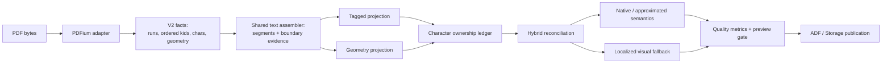

# PDF import quality: evidence-based text and structure reconstruction

Status: **Implementation in progress** (PIQ-00 complete, 2026-08-27)

Planned at: `cb981dea1f83d4dd5e17932239e42f99a1a607c7`
(`feat(drawio): add Draw.io previews and Confluence sync integration (#197)`)

Spec ID: `pdf-import-quality`

Priority: **P1**

Estimated effort: **XL / 5-8 implementation weeks**

Risk: **HIGH** - public PDF facts contracts, tagged reading order, geometry
heuristics, semantic digests, fallback policy, producer-specific structures,
and cross-host PDFium parity all change together.

## Implementation status

| Task | Status | Evidence |
|---|---|---|
| PIQ-00 | DONE | `DRIFT.md`; `EVIDENCE.md#piq-00` |
| PIQ-01 | TODO | - |
| PIQ-02 | TODO | - |
| PIQ-03 | TODO | - |
| PIQ-04 | TODO | - |
| PIQ-05 | TODO | - |
| PIQ-06 | TODO | - |
| PIQ-07 | TODO | - |
| PIQ-08 | TODO | - |
| PIQ-09 | TODO | - |
| PIQ-10 | TODO | - |

> **Executor instructions:** Read this plan completely before changing code.
> Run the drift and privacy checks in Task PIQ-00 first. Execute tasks in
> dependency order and run every verification gate. A task is complete only
> when its neutral fixtures, exact expected results, commands, and sanitized
> evidence are recorded in `specs/pdf-import-quality/EVIDENCE.md`.
>
> Never commit or copy a customer PDF, customer-derived text, customer-derived
> images, tenant identifiers, live URLs, raw API receipts, browser captures, or
> hashes that identify private input. The private document that motivated this
> work is not a fixture and must not be used to manufacture one.
>
> **Drift check:**
>
> ```bash
> git diff --stat cb981dea1f83d4dd5e17932239e42f99a1a607c7..HEAD -- \
>   packages/import-pdf packages/import-confluence \
>   apps/cli/src/e2e/wiki-import-pdf-live.e2e.test.ts \
>   scripts specs/import-pdf-mvp src/content/docs/confluence/import-pdf.md \
>   package.json bun.lock
> ```
>
> If an in-scope contract or algorithm changed, compare the current code with
> Section 3 and reconcile the plan before implementation. Do not silently fit
> new work onto stale excerpts.

---

## 1. Outcome

AtlCLI shall reconstruct text and producer-typical structure from born-digital
PDFs without silently joining words, reordering tagged content, dropping
partially tagged content, or replacing a whole page with an image when a safe
localized repair is possible.

The implementation is successful when all of the following are true:

1. Tagged and untagged text use one versioned reconstruction engine rather
   than separate character-concatenation rules.
2. The PDF facts contract preserves stable text-run identity and the relative
   order of mixed structure-element and MCID children.
3. Every inserted space, line join, retained or removed hyphen, and unresolved
   boundary has source indexes, evidence, confidence, and a deterministic
   decision code.
4. A block with an unresolved material word boundary is never reported as
   fully `native` with confidence `1`.
5. Tagged pages are repaired region by region with qualified geometry. Text is
   neither duplicated nor dropped, and a page image is the last safe fallback.
6. Producer-typical `THead`/`TBody`/`TFoot` tables and multi-block list items are
   preserved when their evidence is complete; unsupported shapes remain
   explicit fallbacks.
7. Preview reports boundary and ownership quality without exposing extracted
   body text.
8. Neutral fixtures from multiple producer families enforce exact block text,
   word-boundary quality, reading order, structure quality, no duplication,
   and fallback localization.
9. Bun source execution, built CLI execution, public-package reports, Node and
   browser facts parity, and neutral Cloud publication remain proven.
10. No private source or derived artifact enters Git, logs, fixtures, specs,
    commit messages, PR text, or CI artifacts.

This work improves semantic reconstruction. It does not promise pixel-perfect
reflow: PDF remains a final-layout format, and uncertain regions must stay
visible through explicit evidence or visual fallbacks.

---

## 2. Decisions

### 2.1 Reconstruct boundaries; do not post-correct language

Do not add a spellchecker, dictionary, language model, compound-word splitter,
or regex list of known phrases. Such post-processing would hide provenance and
break valid German compounds, names, code, CJK, and other scripts.

Boundary reconstruction must use evidence already present in or derived from
the PDF facts:

- literal and PDFium-generated whitespace;
- stable PDF text-run identity;
- tag-tree order and MCID ownership;
- baseline, character angle, bounding boxes, and relative gaps;
- font size and median glyph dimensions;
- punctuation and opening/closing delimiter classes;
- script and logical text direction;
- `ActualText`, soft hyphen, and PDFium's `hyphen` signal.

The engine may infer only a bounded set of deterministic decisions. Ambiguity
is an output, not permission to guess.

### 2.2 Introduce explicit V2 facts; do not mutate V1 semantics in place

The existing exported contracts and literal `/1` revisions are part of the
public package report. Do not change their meaning while retaining their names
and revision strings.

Add V2 contracts for facts that need the new information. Keep V1 exports for
the repository's deprecation window and update the committed API report. The
production adapter and semantic pipeline move atomically to V2; a V1-to-V2
adapter is required only if Task PIQ-00 finds a persisted V1 consumer. There is
no reason to persist or round-trip V1 merely for the implementation itself.

### 2.3 Keep source order and visual order distinct

For tagged content, the ordered structure tree supplies logical ownership and
order. Character geometry qualifies boundaries and regions; it must not
silently reorder RTL or otherwise override a trustworthy logical order.

For untagged content, geometry establishes physical lines, fragments, columns,
and block order. Literal CR/LF characters are strong evidence but are not the
only way to identify a physical line.

### 2.4 `auto` becomes hybrid; explicit modes remain explicit

- `--reading-order auto`: tags first, then geometry only for unclaimed or
  demoted characters and regions.
- `--reading-order tags`: tagged projection plus explicit fallback; do not
  silently run geometry as if the user selected `auto`.
- `--reading-order geometry`: geometry-only qualification, including for a
  tagged source when explicitly requested.

No new public CLI flag is required.

### 2.5 Preserve safety while reducing fallback scope

Hybrid recovery is allowed only when character ownership is bijective and the
geometry region qualifies. A repaired untagged residual paragraph is normally
`approximated`, not automatically `native`, because its text may be editable
without carrying trustworthy source semantics.

If localized repair fails, retain a bounded region image. Escalate to a page
image only when residual characters cannot be localized, are dispersed across
the page, have invalid geometry, or overlap accepted native content
ambiguously.

### 2.6 Neutral fixtures are product evidence

The new quality corpus may contain committed neutral PDFs and authoring sources
created expressly for this repository. It must not contain the motivating
private PDF, any excerpt from it, a transformed copy, screenshots, metadata,
or a digest of private bytes.

Producer-exported binaries that cannot be reproduced in CI are acceptable only
when their manifest records neutral authoring source, producer/version,
platform, export settings, SHA-256, license/ownership, and expected semantics.
CI consumes the pinned bytes; it never tries to automate proprietary desktop
software.

---

## 3. Current state at the planning baseline

### 3.1 Raw character concatenation loses boundaries

`packages/import-pdf/src/text.ts` currently correlates tagged content by MCID,
sorts the resulting characters by page index, and concatenates their values:

```ts
// packages/import-pdf/src/text.ts:77-94
const characters = charactersForMcids(page, descendantMcids(node));
const extracted = normalizePdfText(
  characters.map((character) => character.value).join(""),
);
```

`packages/import-pdf/src/links.ts:26-53` independently repeats character
concatenation while creating link runs. `packages/import-pdf/src/reading-order.ts:53-90`
splits physical lines only at literal CR/LF and creates fragments only after a
large horizontal gap. Improving only one caller therefore cannot fix published
paragraphs, links, lists, tables, and untagged text consistently.

### 3.2 PDFium exposes run identity but the adapter discards it

`packages/import-pdf/src/adapter/pdfium.ts:524-539` obtains the PDF text object
for every character to read its MCID, but stores no deterministic run identity:

```ts
const textObject = module.FPDFText_GetTextObject(textPage, index);
const mcid = textObject
  ? module.FPDFPageObj_GetMarkedContentID(textObject)
  : -1;
```

Raw PDFium handles must never leave the adapter. The adapter can instead assign
the first previously unseen handle a deterministic per-page ordinal such as
`pdf:p0:text-run:3`.

### 3.3 Mixed structure-child order is discarded

`packages/import-pdf/src/adapter/pdfium.ts:439-448` reads the ordered child list
but stores structure elements in `children` and marked-content IDs in
`childMcids`. `packages/import-pdf/src/contracts.ts:39-50` has no common ordered
sequence. `descendantMcids()` then deduplicates and numerically sorts IDs.

Consequently, interleaved MCID and structure-element children cannot be
reconstructed in their logical tag order when content-stream order differs.

### 3.4 Successful tagged projection overstates text confidence

`packages/import-pdf/src/normalize.ts:111-178` checks missing or duplicate MCIDs,
Unicode errors, and empty text, then reports accepted tagged paragraphs with
confidence `0.99` or `1`. It has no word-boundary evidence.

`packages/import-confluence/src/publisher.ts:178-192` correctly verifies that
Confluence retained the generated ADF. That readback cannot prove the generated
text still matches the PDF source; source fidelity and transport fidelity are
separate gates.

### 3.5 `auto` is binary and unclaimed text is page-scoped

`packages/import-pdf/src/review.ts:174-193` chooses either the full tagged
normalizer or the full geometry normalizer. It does not repair residual tagged
regions.

`packages/import-pdf/src/normalize.ts:182-185` only treats visible characters
with an MCID as eligible tagged text. Conversely,
`packages/import-pdf/src/fallback-policy.ts:100-106` turns any recorded unclaimed
text into a whole-page fallback, even when every residual character has a
usable bounding box.

### 3.6 Producer structures are narrower than the documented contract

- `packages/import-pdf/src/tables.ts:107-162,225-232` accepts only direct
  `Table -> TR -> TH|TD`; it does not flatten `THead`, `TBody`, or `TFoot`.
- `packages/import-pdf/src/lists.ts:28-68` selects only the first paragraph and
  first nested list from an `LBody`.
- `packages/import-pdf/src/figures.ts:368-371` removes all deferred Figure
  evidence before proving that every deferred Figure produced a materialized
  candidate.

These paths can linearize, omit, or over-fallback otherwise valid producer
output.

### 3.7 Existing tests do not exercise the failure class

`packages/import-pdf/src/text.test.ts` contains two normalization tests.
`packages/import-pdf/src/tagged.test.ts:49-67` creates characters from already
correct strings containing their spaces. `packages/import-pdf/src/untagged.test.ts:28-63`
adds CR/LF after every synthetic line.

The tagged fixture generator emits each semantic text item as one complete `Tj`
operation and creates only direct table rows. `specs/import-pdf-mvp/fixtures/truth.json`
checks a few contained tokens rather than exact block strings.

At this baseline:

```text
bun run test packages/import-pdf
55 pass
0 fail
```

The green suite proves current deterministic behavior, not cross-producer text
fidelity. `specs/import-pdf-mvp/EVIDENCE.md:493-496` explicitly records that the
Word, LibreOffice, browser-print, and expanded Unicode/layout corpus was not
covered by the earlier evidence phase.

---

## 4. Target architecture



The PDFium adapter owns unsafe parser handles and emits deterministic facts.
The shared assembler owns text boundaries but no Confluence types. Tagged and
geometry projectors own semantic interpretation. The hybrid reconciler owns
character uniqueness and fallback scope. Publication remains unchanged and
continues to verify target transport semantics.

---

## 5. Target contracts

Names may be adjusted to match repository style, but the information and
version boundaries below are required.

### 5.1 V2 character and structure facts

```ts
export const PDF_FACTS_SCHEMA_V2 = "atlcli.pdf-facts/2" as const;
export const PDF_FACTS_ADAPTER_REVISION_V2 =
  "atlcli.pdfium-public-fpdf/2" as const;

export interface PdfTextCharacterFactV2 {
  index: number;
  unicode: number;
  value: string;
  bbox: PdfNormalizedRect | null;
  fontSizePoints: number;
  fontWeight: number;
  angleRadians: number;
  mcid: number | null;
  /** Stable first-seen ordinal; never a PDFium pointer value. */
  textRunId: string | null;
  generated: boolean;
  hyphen: boolean;
  unicodeMapError: boolean;
}

export type PdfStructureKidFactV2 =
  | { kind: "mcid"; index: number; mcid: number }
  | { kind: "element"; index: number; node: PdfStructureNodeFactV2 };

export interface PdfStructureNodeFactV2 {
  id: string;
  type: string;
  title: string;
  alt: string;
  actualText: string;
  language: string;
  elementId: string;
  /** Direct IDs retained for provenance/fallback when the child API is empty. */
  directMcids: number[];
  /** Exact CountChildren order, including interleaved MCIDs and elements. */
  kids: PdfStructureKidFactV2[];
  attributes: PdfStructureAttributeFact[];
}
```

Rules:

1. The adapter assigns `textRunId` from a per-page `Map<PdfiumHandle, ordinal>`.
   The handle itself is never serialized, compared across pages, or exposed.
2. `kids` follows `FPDF_StructElement_CountChildren` index order exactly.
3. If the child API yields no usable entries, `directMcids` is the explicit
   fallback. Do not append both sources and duplicate the same MCID.
4. Logical MCID traversal preserves first occurrence. It does not numerically
   sort IDs.
5. V2 facts, adapter revision, analysis policy, semantics schemas, and all
   dependent digests change atomically.
6. Update `packages/import-pdf/etc/import-pdf.api.md` with
   `bun scripts/api-report.ts --update`; do not edit it by hand.

### 5.2 Boundary decisions and assembly

Add a source-neutral module such as
`packages/import-pdf/src/text-assembly.ts`:

```ts
export type PdfTextBoundaryActionV2 =
  | "preserve-explicit-space"
  | "insert-space"
  | "join-line"
  | "dehyphenate"
  | "retain-hyphen"
  | "no-space"
  | "unresolved";

export interface PdfTextBoundaryDecisionV2 {
  id: string;
  leftCharacterIndex: number | null;
  rightCharacterIndex: number | null;
  action: PdfTextBoundaryActionV2;
  basis: Array<
    | "literal-whitespace"
    | "generated-whitespace"
    | "text-run"
    | "structure-order"
    | "baseline"
    | "glyph-gap"
    | "script"
    | "punctuation"
    | "hyphen"
    | "actual-text"
  >;
  confidence: number;
}

export interface PdfTextAssemblyV2 {
  text: string;
  segments: Array<{
    text: string;
    characterIndexes: number[];
    synthesized: boolean;
  }>;
  characterIndexes: number[];
  boundaries: PdfTextBoundaryDecisionV2[];
  unresolvedBoundaryCount: number;
  bbox: PdfNormalizedRect | null;
  direction: PdfTextDirection;
  hasUnicodeError: boolean;
  usedActualText: boolean;
}
```

The assembler must implement these rules in this order:

1. Preserve and canonicalize explicit whitespace before considering geometry.
2. Use ordered tag children for tagged sequences and page character order only
   inside each referenced marked-content item.
3. Cluster physical lines from baseline/vertical overlap and angle. Treat
   literal CR/LF as strong hints, not the only line boundary.
4. At a same-line run boundary, compare the horizontal gap with versioned
   thresholds derived from median glyph width and font size. Thresholds are
   calibrated from the neutral corpus and live in one policy object.
5. Insert a space only for word-like neighbors when punctuation/script rules
   permit it. Never insert before closing punctuation or after an opening
   delimiter solely because the run changed.
6. Do not infer spaces inside CJK solely from a text-run change. Preserve
   logical RTL order; geometry may qualify a boundary but must not reverse the
   string.
7. Remove a line-end soft/generated hyphen only when the `hyphen`/soft-hyphen
   evidence and adjacent same-script word characters agree. Retain an authored
   visible hyphen when that proof is absent.
8. Expand only an explicit allowlist of Unicode presentation ligatures; do not
   apply broad NFKC compatibility normalization.
9. Mark a material alphanumeric boundary `unresolved` when evidence conflicts.
   Do not repair it with a dictionary.
10. If `ActualText` is present, use its normalized author-provided value and
    record `actual-text` boundaries. Preserve link marks only when source
    characters align exactly; otherwise report the unmapped link rather than
    silently applying a wrong mark.

Synthesized separators normally receive no link mark. They may remain inside a
link only when both adjacent source characters resolve to the same allowlisted
annotation.

### 5.3 Character ownership and hybrid outcome

Add an ownership ledger to the semantic result:

```ts
export interface PdfCharacterOwnershipV2 {
  pageIndex: number;
  characterIndex: number;
  ownerSourceId: string;
  targetNodeId?: string;
  basis: "tagged" | "geometry" | "fallback" | "reported";
  outcome: ImportOutcome;
}
```

Non-whitespace visible characters must have exactly one final owner. Boundary
decisions account separately for spaces and joins; whitespace must no longer be
ignored as irrelevant to source fidelity.

The hybrid result adds per-page counts for:

- visible characters and uniquely owned characters;
- explicit, inferred, and unresolved boundaries;
- geometry-repaired characters and regions;
- duplicate ownership attempts;
- residual reported characters;
- fallback scope and normalized fallback area.

All counts and revisions participate in the semantic and review digests.

### 5.4 Quality report without source-body disclosure

Extend `PdfPageReviewSummaryV1` through a versioned review schema. Standard
terminal and JSON output may include counts, decision codes, confidence,
source-character indexes, and normalized bounding boxes. It must not emit the
extracted source body merely to explain a quality warning.

`--unsupported fail` blocks publication when a material unresolved boundary,
duplicate ownership, unlocalized visible character, or false-native structure
remains. With `--unsupported report`, the result stays publishable only when
the ambiguity is covered by an explicit localized/page fallback or a reported
outcome allowed by the existing acknowledgment policy.

---

## 6. Scope

### In scope

- `packages/import-pdf/src/contracts.ts` and public exports;
- `packages/import-pdf/src/adapter/pdfium.ts` and adapter parity tests;
- a shared text-assembly module and tests;
- tagged correlation, link runs, geometry reading order, and untagged
  projection;
- tagged/geometry hybrid ownership and reconciliation;
- fallback localization and presentation policy;
- tagged table wrapper normalization;
- complete representable tagged list-item traversal;
- Figure deferred-evidence correctness;
- neutral quality fixtures, truth manifest, and an executable quality gate;
- PDF review JSON/terminal quality summaries;
- exact-text neutral built-CLI Cloud E2E and cleanup proof;
- public API reports, importer documentation, and sanitized implementation
  evidence;
- `package.json` only for the quality-check script if needed.

### Out of scope

- the motivating private PDF or any transformed/derived version of it;
- modifying or deleting the already published wiki page;
- OCR, scan recognition, language models, dictionaries, or spellchecking;
- changing PDFium version or adding a second production PDF parser;
- modifying the Extension PDF.js viewer;
- changing Confluence publisher transaction or rollback semantics;
- adding new CLI flags or changing default split behavior;
- broad DOCX importer refactoring;
- Data Center live certification;
- automatic release, merge, or cleanup of production content;
- optimistic native support for nested/continued/rotated tables that lacks a
  complete bijective proof.

---

## 7. Commands and repository conventions

Run tests through the root script so workspace imports resolve against source:

| Purpose | Command | Expected result |
|---|---|---|
| Install | `bun install --frozen-lockfile` | exit 0; no manifest/lock drift |
| Focused importer tests | `bun run test packages/import-pdf` | all pass |
| Quality corpus | `bun run check:import-pdf-quality` | every family passes; no raw bodies in output |
| Public API guard | `bun run build && bun run test scripts/api-report.test.ts` | build and report guard pass |
| Regenerate API report | `bun scripts/api-report.ts --update` | only reviewed package reports change |
| Typecheck | `bun run typecheck` | exit 0 |
| Full tests | `bun run test` | all pass |
| Build | `bun run build` | all tasks pass |
| Import performance | `bun run bench:import-pdf` | all existing budgets pass |
| Docs | `bun run docs:check` | exit 0 |
| Neutral live E2E | `bun run test:e2e:import-pdf` | create/readback/delete/404 proof passes |

Never use bare `bun test`. Use the current checkout through Bun; do not depend
on an installed AtlCLI release.

TypeScript is strict ESM. Keep pure decisions separate from PDFium IO and
Confluence IO. Use `output()`/`fail()` conventions only if a CLI presentation
change is necessary. Confluence features require both ADF and Storage contract
coverage where the shared semantic document changes.

Commit logical units with conventional messages such as:

- `test(import-pdf): add fragmented text quality corpus`
- `feat(import-pdf): preserve ordered text evidence`
- `fix(import-pdf): reconstruct word boundaries`
- `fix(import-pdf): localize tagged geometry repairs`
- `docs(import-pdf): explain source fidelity gates`

Do not push or open another PR unless the operator explicitly instructs it.

---

## 8. Implementation tasks

### PIQ-00 - Record drift, privacy boundary, and baseline

**Status: DONE (2026-08-27).** The sanitized proof is recorded in
`specs/pdf-import-quality/DRIFT.md` and
`specs/pdf-import-quality/EVIDENCE.md#piq-00`.

Create:

- `specs/pdf-import-quality/DRIFT.md`;
- `specs/pdf-import-quality/EVIDENCE.md`.

Record the starting commit, the Section 7 command versions, and sanitized
aggregate results. Do not record private source titles, text, IDs, URLs,
digests, or screenshots.

Run the mandatory drift command and inspect public API consumers before
choosing the V1 deprecation path:

```bash
rg -n "PdfFactsV1|PDF_FACTS_SCHEMA_V1|PdfFactsAdapter" \
  apps packages scripts --glob '!packages/import-pdf/etc/**'
```

If any consumer persists V1 facts outside an in-memory preview/publication run,
STOP and add an explicit V1 reader/migration contract to this plan before
continuing.

Capture the current green baseline:

```bash
bun run test packages/import-pdf
bun run typecheck
git status --short
```

Expected: importer tests and typecheck pass; the worktree contains only the
planned spec/evidence files.

### PIQ-01 - Add the neutral fragmented-text and producer corpus

Create `specs/pdf-import-quality/fixtures/` with a manifest and neutral
authoring sources where practical. Extend the existing generator or add a
focused generator in this directory; do not overload unrelated MVP fixtures.

Required fixture families:

1. Tagged paragraph split across text objects with an omitted space glyph.
2. Tagged paragraph with interleaved MCID and `Span` children whose tag order
   differs from numeric MCID and physical stream order.
3. Font/style change and safe-link boundary within one sentence.
4. Wrapped lines with literal CR/LF, generated CR/LF, and no CR/LF.
5. Soft/generated hyphen, authored hard hyphen, ligatures, German umlauts, and
   punctuation/delimiters.
6. LTR, logical RTL, and CJK examples.
7. Partially tagged page with localized unmarked text and a separate
   unlocalizable negative case.
8. Tables using direct rows, `THead`/`TBody`/`TFoot`, absent default-one spans,
   multiple tables on one page, and malformed/nested negative cases.
9. Multi-paragraph list items, a supported nested list, and an unrepresentable
   multiple-nested-list negative case.
10. A tagged Figure without a directly correlatable image/path object.
11. At least one neutral export each from Word, LibreOffice, browser print, and
    an independent PDF generator.

The truth manifest must contain exact ordered block text, expected boundary
actions, structure outcomes, ownership/fallback expectations, producer
provenance, and file digests. Token-only truth is insufficient.

Add manifest/generator determinism tests first. Runtime exact-text assertions
land with the implementation task that makes them pass; do not commit a
permanently skipped release fixture.

**Verify:**

```bash
bun run test packages/import-pdf/src/fixtures.test.ts
git diff --check
```

Expected: neutral fixture provenance and digests pass; no private data is
present.

### PIQ-02 - Introduce V2 facts with ordered kids and stable text runs

Modify `packages/import-pdf/src/contracts.ts` and
`packages/import-pdf/src/adapter/pdfium.ts` to implement Section 5.1.

Update all test fact builders explicitly; do not fill required V2 evidence via
unsafe casts. Add adapter tests proving:

- two characters from the same PDF text object share a stable `textRunId`;
- distinct text objects get distinct first-seen ordinals;
- repeated analysis emits identical V2 facts and digest;
- raw pointer values never appear in canonical facts;
- mixed structure kids retain exact index order;
- direct-MCID fallback does not duplicate IDs;
- browser and Node adapters produce equal canonical V2 facts;
- lifecycle, cancellation, and hard budgets still pass.

Review `packages/import-pdf/src/package-boundary.test.ts`. If implementation
needs an additional public PDFium function, add it to the explicit allowlist
only after verifying it exists in the pinned declaration surface and does not
introduce a network/private API. Do not call undocumented `EPDF_*` functions.

Regenerate the public API report and review the complete diff.

**Verify:**

```bash
bun run test packages/import-pdf/src/pdfium.test.ts \
  packages/import-pdf/src/package-boundary.test.ts
bun run build
bun scripts/api-report.ts --update
bun run test scripts/api-report.test.ts
```

Expected: deterministic V2 parity passes; only intended import-PDF public
contracts and their reachable closure change.

### PIQ-03 - Implement the shared text assembler

Create `packages/import-pdf/src/text-assembly.ts` and its focused test file.
Move layout-sensitive assembly out of `normalizePdfText`, `correlateTaggedText`,
`taggedRuns`, and geometry fragment construction.

Keep `normalizePdfTextFragment` limited to safe Unicode/control/whitespace
canonicalization. It must not make layout decisions after character provenance
has been discarded.

Implement the ordered rules in Section 5.2 as pure functions. All thresholds
belong to one frozen, revisioned policy. Tests must assert not only final text
but the exact boundary action, basis, confidence band, character indexes, and
deterministic decision ID.

Minimum tests:

- explicit space is preserved once;
- a same-line run gap inserts exactly one space;
- a style or MCID change with no word gap does not invent a space;
- a missing-space line continuation becomes one space;
- closing punctuation and opening delimiters remain attached correctly;
- generated/soft hyphen dehyphenates only with complete proof;
- authored hard hyphen remains;
- allowlisted ligature expansion is explicit and NFC remains stable;
- CJK does not gain spaces from run changes;
- RTL logical order is not geometrically reversed;
- conflicting geometry returns `unresolved`;
- `ActualText` remains authoritative and an unalignable link is reported;
- three identical runs produce the same assembly and digest.

**Verify:**

```bash
bun run test packages/import-pdf/src/text.test.ts \
  packages/import-pdf/src/text-assembly.test.ts
```

Expected: all boundary families pass with exact evidence snapshots or
structural assertions; no source body is printed on failure beyond neutral
fixture expectations.

### PIQ-04 - Route tagged, links, geometry, lists, and tables through one assembler

Replace independent text joining in:

- `packages/import-pdf/src/text.ts`;
- `packages/import-pdf/src/links.ts`;
- `packages/import-pdf/src/reading-order.ts`;
- `packages/import-pdf/src/untagged.ts`;
- `packages/import-pdf/src/lists.ts`;
- `packages/import-pdf/src/tables.ts`.

Tagged correlation follows ordered V2 structure kids. Geometry analysis first
clusters physical lines, then forms fragments and blocks. Adjacent physical
lines that belong to one paragraph must be joined as one paragraph when the
qualified continuation rules pass; do not publish each line as a paragraph by
default.

`taggedRuns` consumes assembly segments. It applies safe annotations to source
characters and synthesized separators according to Section 5.2, so fixing
`correlateTaggedText` cannot diverge from the final published run text.

Propagate boundary decisions into semantic evidence and policy digests. Any
material unresolved boundary lowers the outcome/confidence and creates a
stable issue with a locator. It must not remain a `native` confidence-1 block.

Add exact ADF and Storage text assertions for the neutral fragmented corpus.

**Verify:**

```bash
bun run test packages/import-pdf/src/tagged.test.ts \
  packages/import-pdf/src/untagged.test.ts \
  packages/import-pdf/src/tables.test.ts \
  packages/import-pdf/src/text-assembly.test.ts
```

Expected: exact text and boundary evidence pass for tagged and untagged paths;
existing simple fixtures remain semantically unchanged except for planned
revision/digest updates.

### PIQ-05 - Add character ownership and hybrid tagged/geometry recovery

Add a pure reconciliation module such as
`packages/import-pdf/src/hybrid.ts`. Do not embed the ownership algorithm in
`review.ts`.

Algorithm:

1. Project accepted tagged nodes and record every claimed character index.
2. Account for all visible characters, including `mcid === null`.
3. Partition unclaimed/demoted characters into localized geometry regions
   using line clusters and touching/nearby normalized boxes.
4. Reject a geometry repair if it overlaps a tagged owner, claims a character
   twice, crosses an unqualified column/rotation boundary, or contains an
   unresolved material text boundary.
5. Insert accepted repair blocks in deterministic page/bbox/source order and
   mark them `approximated` unless a stricter existing native geometry contract
   is fully met.
6. Send rejected but localized regions to region fallback.
7. Escalate to page fallback only for missing/invalid boxes, dispersed residual
   regions, conflicting overlap, or an existing page-level safety condition.
8. Assert a final ledger invariant: every non-whitespace visible character has
   exactly one native, approximated, fallback, or reported owner.

Wire `--reading-order auto` to this hybrid path in
`packages/import-pdf/src/review.ts`. Preserve the explicit `tags` and `geometry`
mode decisions from Section 2.4.

Update `packages/import-pdf/src/fallback-policy.ts` and
`packages/import-pdf/src/visual-fallbacks.ts` so unclaimed text with usable
localized boxes no longer forces a page image. The full-page safety behavior
must remain for the negative fixtures.

Tests must prove:

- localized untagged residue becomes one editable repair or region crop;
- an unlocalizable residue remains page-scoped;
- no source character is duplicated across tagged and geometry blocks;
- fallback coverage closes the corresponding reported issues;
- two distant residual regions do not merge into an oversized crop;
- repeated execution yields equal semantic, issue, and plan digests;
- split planning still assigns every source page exactly once.

**Verify:**

```bash
bun run test packages/import-pdf/src/hybrid.test.ts \
  packages/import-pdf/src/fallback-policy.test.ts \
  packages/import-pdf/src/visual-fallbacks.test.ts \
  packages/import-pdf/src/review.test.ts \
  packages/import-pdf/src/split.test.ts
```

Expected: all ownership invariants pass; localized positive fixtures avoid a
page fallback; unlocalized negative fixtures retain it.

### PIQ-06 - Normalize producer tables, complete list items, and retain Figure evidence

#### Tables

In `packages/import-pdf/src/tables.ts`, add a pure ordered row collector that:

- accepts direct `TR` children;
- flattens allowlisted `THead`, `TBody`, and `TFoot` wrappers in source order;
- may pass through neutral containers only when they contain rows and no other
  semantic content;
- treats absent `RowSpan`/`ColSpan` as `1` only when the remaining grid is
  complete and non-overlapping;
- continues to reject invalid, overlapping, nested, rotated, or continued
  tables without sufficient proof.

Group rendered fallback candidates by table source ID, not all approximated
tables on a page, so separate tables do not become one large crop.

#### Lists

In `packages/import-pdf/src/lists.ts`, traverse the complete ordered `LBody`.
Represent every supported paragraph and one compatible nested list in order.
If multiple nested lists or unknown children cannot fit the current neutral IR,
demote/report the residual content; never select only the first node and drop
the rest.

#### Figures

In `packages/import-pdf/src/figures.ts`, replace deferred Figure issues/evidence
only for the `sourceId`s that produced a verified materialized candidate. An
unmatched Figure remains reported and participates in fallback assessment.

Add positive and negative tests for every shape above, including exact text,
character ownership, structure outcome, and fallback region count.

**Verify:**

```bash
bun run test packages/import-pdf/src/tables.test.ts \
  packages/import-pdf/src/tagged.test.ts \
  packages/import-pdf/src/figures.test.ts \
  packages/import-pdf/src/fallback-policy.test.ts
```

Expected: producer wrappers and complete representable list bodies project
without loss; unsupported cases retain explicit non-native evidence and the
smallest safe fallback.

### PIQ-07 - Make the documented quality thresholds executable

Add `scripts/quality/import-pdf-quality.ts` plus a root
`check:import-pdf-quality` script. The evaluator reads only the neutral truth
manifest and reports fixture names plus aggregate/body-free metrics.

Required gates:

| Metric | Tagged gate | Qualified untagged gate |
|---|---:|---:|
| Accounted pages | 100% | 100% |
| Unreported visible-character loss | 0 | 0 |
| Duplicate character ownership | 0 | 0 |
| False `native` on negative fixtures | 0 | 0 |
| Exact text on fragmented simple fixtures | 100% | 100% |
| Word-boundary precision / recall | >= 99.5% / 99.5% | >= 98.0% / 98.0% or fallback |
| Exact ordered block pairs | >= 99.0% | >= 96.0% or fallback |
| Tagged list item/nesting F1 | >= 0.99 | existing qualified gate |
| Tagged table cell-text F1 | >= 0.99 | existing qualified gate |
| Explicit span F1 | 1.00 or fallback | 1.00 or fallback |
| Unresolved boundary in a `native` text block | 0 | 0 |
| Unsafe link promoted | 0 | 0 |

No aggregate may hide a failed producer or critical negative family. A fixture
with unqualified semantics passes only when the expected reported/fallback
outcome is exact.

Keep this gate separate from `bench:import-pdf`, which measures time, memory,
cancellation, and determinism rather than semantic quality. Add a focused test
that proves the quality evaluator fails when an expected boundary or block
string is deliberately perturbed.

**Verify:**

```bash
bun run check:import-pdf-quality
bun run test scripts/quality/import-pdf-quality.test.ts
bun run bench:import-pdf
```

Expected: every producer family passes its own quality row; the guard-the-guard
mutation fails for the expected reason; existing performance budgets pass.

### PIQ-08 - Surface source-fidelity quality in preview and policy

Version the review/report schema in `packages/import-pdf/src/review.ts`. Add
per-page body-free metrics for:

- explicit, inferred, dehyphenated, and unresolved boundaries;
- tagged and geometry-owned characters;
- duplicate/unowned characters;
- repaired region count;
- fallback scope and normalized area.

Add issue/decision codes for unresolved boundaries and ownership failure.
`--unsupported fail` must block them as described in Section 5.4. Standard
output must identify page label, decision code, counts, and fallback scope
without echoing the affected private text.

Update `src/content/docs/confluence/import-pdf.md` to:

- distinguish extraction/source fidelity from Confluence semantic readback;
- explain inferred and unresolved boundary diagnostics;
- describe hybrid repair and localized fallback;
- add troubleshooting for merged words and boundary blockers;
- repeat the prohibition on committing customer PDFs or derived bodies.

Do not change Confluence publisher readback semantics; it remains the correct
transport-integrity check.

**Verify:**

```bash
bun run test packages/import-pdf/src/review.test.ts \
  apps/cli/src/commands/wiki-import.test.ts
bun run docs:check
```

Expected: reports expose bounded quality metrics, blockers follow policy, and
docs compile without publishing extracted bodies.

### PIQ-09 - Strengthen neutral publication proof

Extend `apps/cli/src/e2e/wiki-import-pdf-live.e2e.test.ts` with the neutral
fragmented fixture. The test must build and run the current checkout, not an
installed release.

Replace body-wide text concatenation for this case with an independent ordered
block summarizer. Compare exact neutral strings or manifest-derived digests,
not a few `toContain()` tokens. Keep extraction fidelity separate from the
existing publisher semantic-readback assertion.

The live test must:

1. publish only neutral generated fixtures to `DOCSY` through the current Bun
   build;
2. read back ordered ADF block text, links, table/media identity, and fallback
   scope as applicable;
3. compare against independent neutral truth;
4. delete every owned attachment/page in `finally`;
5. verify page deletion with the existing 404/no-current-state proof;
6. emit only sanitized success/failure evidence.

No private PDF is needed or permitted for certification.

**Verify:**

```bash
bun run test:e2e:import-pdf
git status --short
```

Expected: all neutral live cases pass, cleanup is complete, and no live receipt
or generated artifact is tracked.

### PIQ-10 - Run final release gates and close evidence

Run in this order:

```bash
bun run test packages/import-pdf
bun run check:import-pdf-quality
bun run typecheck
bun run build
bun run test scripts/api-report.test.ts
bun run test
bun run bench:import-pdf
bun run docs:check
bun run test:e2e:import-pdf
git diff --check
git status --short
```

Record versions, neutral fixture digests, aggregate metrics, command results,
and live cleanup result in `specs/pdf-import-quality/EVIDENCE.md`. Do not record
tenant IDs, page IDs, URLs, raw ADF, source bodies, timestamps tied to a tenant,
or local credential/profile contents.

Before every implementation commit and push, inspect staged paths and content:

```bash
git diff --cached --name-only
git diff --cached --check
git diff --cached -- specs/pdf-import-quality packages/import-pdf \
  apps/cli/src/e2e/wiki-import-pdf-live.e2e.test.ts \
  scripts/quality src/content/docs/confluence/import-pdf.md package.json
```

Expected: only neutral source, implementation, tests, generated public API
reports, docs, and sanitized evidence are staged.

---

## 9. Test matrix

| Layer | Required proof |
|---|---|
| Pure unit | Every boundary action, script/punctuation guard, line cluster, ownership invariant |
| Adapter | Stable run IDs, ordered structure kids, no raw handles, V2 determinism |
| Tagged integration | Exact paragraph/link/list/table text and ordered MCID traversal |
| Geometry integration | Physical line clustering without CR/LF, paragraph joins, column order |
| Hybrid integration | Residual repair without duplicate text; localized versus page fallback |
| Target encoders | Exact ADF and Storage text/marks/structure for neutral fixtures |
| Review | Body-free metrics, blockers, digest changes, deterministic reports |
| Quality gate | Per-producer exact truth and guard-the-guard failure |
| Package | Public API report/closure, built consumer, browser/Node parity |
| Performance | Existing time, RSS, cancellation, lifecycle, determinism budgets |
| Live Cloud | Built current CLI, independent exact-text oracle, cleanup/404 |

Every regression test uses neutral data. When a producer case cannot be
constructed deterministically, commit a minimal neutral exported PDF with
documented provenance instead of recording private production input.

---

## 10. Done criteria

All must hold:

- [ ] V2 facts preserve deterministic text-run identity and ordered mixed
      structure kids.
- [ ] V1 public contracts are either retained with reviewed deprecation or a
      documented consumer migration exists; no `/1` literal silently changes
      meaning.
- [ ] Tagged, link, geometry, list, and table text use one shared assembler.
- [ ] Exact neutral fragmented-text cases contain the expected word boundaries
      in IR, ADF, Storage, preview digest, and Cloud readback.
- [ ] No material unresolved boundary is classified as confidence-1 `native`.
- [ ] Every visible character has exactly one final ownership outcome.
- [ ] `auto` performs tags-first localized geometry recovery without text
      duplication.
- [ ] Localized residuals avoid page fallback; unlocalizable negatives still
      require it.
- [ ] `THead`/`TBody`/`TFoot` tables and complete supported list bodies pass
      exact neutral tests.
- [ ] Unmatched tagged Figures retain explicit evidence/fallback.
- [ ] The quality gate runs from one Bun command and enforces every producer
      family separately.
- [ ] Preview shows body-free boundary/ownership metrics and policy blockers.
- [ ] Public API reports and reachable-closure guards pass.
- [ ] `bun run test packages/import-pdf`, `bun run check:import-pdf-quality`,
      `bun run typecheck`, `bun run build`, `bun run test`,
      `bun run bench:import-pdf`, and `bun run docs:check` pass.
- [ ] Neutral built-CLI Cloud E2E passes and cleans every owned resource.
- [ ] `specs/pdf-import-quality/EVIDENCE.md` contains only sanitized neutral
      evidence.
- [ ] Git contains no customer PDF, derived content/media, private digest,
      tenant identifier, live URL/receipt, or browser capture.

---

## 11. STOP conditions

Stop and revise the plan rather than improvising if:

1. V1 facts or semantic results are persisted by a consumer not identified in
   Task PIQ-00.
2. Stable text-run identity appears to require serializing a raw PDFium pointer
   or calling an undocumented/private PDFium API.
3. A boundary rule needs a dictionary, customer phrase, language model, or
   producer-specific content exception to pass.
4. CJK or RTL quality regresses while fixing Latin-script spacing.
5. Hybrid repair cannot prove one-to-one character ownership or changes source
   page assignment.
6. A localized repair overlaps accepted tagged content ambiguously.
7. Supporting a table/list shape requires silently flattening content the
   neutral IR cannot represent.
8. Any fixture, log, evidence file, commit, or PR material contains private
   document content or tenant data.
9. A new PDFium function is absent from the pinned public declarations or
   breaks the reviewed WASM/package boundary.
10. The quality gate passes only through an aggregate that hides a failing
    producer or negative fixture.
11. Live E2E cleanup cannot prove deletion of every owned resource.
12. A verification command fails twice after one scoped correction.

---

## 12. Review guidance and maintenance notes

Reviewers should focus on false-positive spaces and false-native outcomes, not
only on whether the motivating spacing symptom disappears.

In particular, scrutinize:

- deterministic run IDs and ordered-child traversal;
- punctuation, CJK, RTL, and hyphen decisions;
- synthesized separators at link boundaries;
- character ownership across tagged, geometry, table, list, and fallback paths;
- region merging that could create oversized visual fallbacks;
- policy/schema revision and digest propagation;
- public API report and browser/Node parity;
- CI/log data minimization;
- exact cleanup in the live test.

Future PDFium upgrades must rerun the entire quality corpus because generated
characters, boxes, text-object grouping, and hyphen flags may change even when
the public API signatures do not. New producer fixtures must extend, not weaken,
per-family gates. Threshold changes require a policy revision plus before/after
neutral metrics; they are never an unreviewed test-data adjustment.

The existing Confluence semantic readback remains valuable but proves target
transport fidelity only. Source-fidelity tests must remain independent so the
same extraction error cannot appear in both expected and actual values.

---

## 13. Unresolved questions

None before implementation. Task PIQ-00 may discover a persisted V1 consumer;
if it does, the required migration path is a STOP condition and must be added
to this plan before code changes continue.
