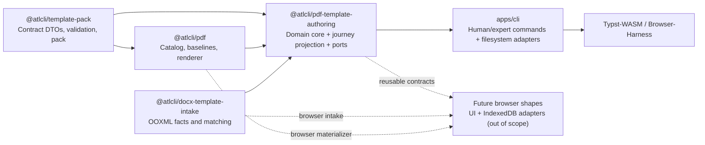

# PDF Template from DOCX: Design Token Intake, Decisions, and Visual Assets

Status: **Proposed / Review**, 2026-07-27

Planning baseline: commit `a290e84`

Directory: `specs/pdf-template-docx-intake`

## Summary decision

This slice does **not** build a DOCX-to-Typst converter or a visual template
editor. It builds a traceable authoring pipeline:

```text
PDF capability catalog + complete baseline
                         │
DOCX ──► facts ──► candidates ──► user decisions
                         │                  │
                         └──────────► authoring snapshot
                                              │
                         runtime snapshot + canonical Typst + accepted assets
                                              │
                         deterministic .wiki-pdf-template
                                              │
                         real PDF export / Typst-WASM
```

The DOCX may only propose values and assets for capabilities explicitly
supported by the PDF renderer. Every adoption remains explainable, reversible,
and backed by source, rule, confidence, and compatibility evidence.

The initial trust boundary covers only **Typst templates generated canonically
by atlcli**. Typst code is never generated or imported from the DOCX.
Arbitrary hand-written Typst templates require a separate trust, resource, and
compatibility policy in a future slice.

## Plan map

- [Product scope and user journey](#personas-and-normative-user-journey)
- [Analyzer claims and confidence](#what-the-analyzer-may-claim)
- [Architecture and package boundaries](#target-architecture-and-package-boundaries)
- [Versioned contracts](#versioned-contracts)
- [CLI journey and project model](#authoring-project-and-cli)
- [Task dependency graph](#task-dag)
- [Implementation tasks and proof](#technical-implementation)
- [Cross-cutting quality rules](#security-privacy-and-quality-invariants)
- [Definition of done](#definition-of-done)
- [Confirmed decisions](#confirmed-implementation-decisions)

## Context and confirmed current state

- `specs/export-expansion/007-pdf-template-settings/PLAN.md` provides
  `wiki.pdf-template/v1`, Level A settings, deterministic
  `.wiki-pdf-template` archives, and the security foundations.
- `specs/export-expansion/012-pdf-template-migration/PLAN.md` moved the
  built-in template's presentation values into the manifest and proved a
  second curated baseline with "Manuscript."
- This plan takes on the B6 scope "stationery/backgrounds," which 007
  explicitly deferred, in a bounded, proof-gated form. It does not silently
  replace the earlier contract: T6 therefore includes a mandatory
  Typst/artifact spike and a STOP/scope-reduction gate.
- `packages/template-pack/src/design.ts` currently describes the validated
  render snapshot `WikiPdfTemplateDesignV1`. The maps for roles, colors,
  layout, and ratios accept safe additional keys; this does not prove that the
  PDF renderer actually reads those keys.
- `packages/pdf/src/template.ts` generates the canonical `atlcli.typ`.
  Consumed keys are currently named at their respective read sites. The layout
  helper `L()` still falls back implicitly to the built-in design when values
  are missing.
- `packages/pdf/src/settings.ts` clones the manifest design, applies declared
  bindings, and then overwrites `ink`, `paper`, and `contrast.minimum` with the
  resolved theme. Multiple writes through bindings are already rejected.
- `packages/template-pack/src/bindings.ts` has a fixed, versioned allowlist for
  Level A bindings.
- `packages/template-pack/src/pack.ts` can pack a manifest and arbitrary safe
  payload files byte-deterministically.
- `packages/docx/src/scan.ts` already provides the security-critical ZIP/OPC
  entry point through `unzipDocx()`: size budgets, path validation,
  compression plausibility, and rejection of the VBA, ActiveX, altChunk, and
  DDE classes handled there. OLE, embedded packages, unknown relationship
  types, and decoder complexity require additional allowlists and resource
  limits in the intake.
- `packages/docx/src/ooxml.ts` currently reads only style IDs and names with a
  regular expression for export. This is not an adequate analyzer for
  inheritance, themes, namespaces, or DrawingML.
- `packages/docx/src/export.ts` currently considers only the final `w:sectPr`
  for page settings; the intake must instead capture every section and its
  header/footer inheritance.
- `packages/pdf/src/types.ts` currently supports a logo and a text watermark as
  template assets. A typed model for page backgrounds, decorations, and
  image-based watermarks is missing.
- `apps/cli/src/commands/export.ts` currently rejects `--template` for PDF
  explicitly, referring to a later PDF template version. This plan is the
  intended follow-up stage.
- `packages/pdf-compiler-browser` and `apps/browser-export-harness` already
  compile real PDFs with the pinned Typst-WASM and check determinism,
  browser/CLI parity, embedded fonts, outlines, and tagged-PDF properties.

### Drift check before implementation

Before T0, the implementing agent must compare the plan with the then-current
branch. If anything has drifted, update this plan first; do not silently
implement historical assumptions.

```bash
git status --short
git rev-parse --short HEAD
rg -n "createAtlcliTypstTemplate|resolveTemplateDesign|BINDING_TARGET_ALLOWLIST" \
  packages/pdf packages/template-pack
rg -n "unzipDocx|parseStyleNames|sectPr" packages/docx
rg -n "PDF templates arrive|hasTemplateFlag" apps/cli/src/commands/export.ts
```

**STOP:** If `wiki.pdf-template/v1`, the PDF resolver, the pack container, or
the PDF CLI path has been replaced in the meantime, the package and schema
architecture must be reconfirmed.

## Goals

1. A versioned, engine-owned catalog identifies every design capability the
   PDF renderer supports, including its type, bounds, writability, and runtime
   behavior.
2. "Editorial Indigo" is the default baseline; every baseline is complete and
   validated for all required capabilities.
3. A browser-compatible DOCX analyzer resolves OOXML structurally and creates
   candidates only for known capabilities.
4. Candidates carry evidence, value nature, semantic confidence,
   compatibility, conflict group, and stable fingerprints.
5. Users can adopt candidates safely or individually, reject them, replace
   them with custom values, and reset them to the baseline.
6. Internal graphics, backgrounds, logos, and page decorations are analyzed as
   assets and scenes rather than forced into scalar design tokens.
7. The build produces a complete immutable runtime snapshot, canonical Typst,
   accepted assets only, and a deterministic `.wiki-pdf-template`; the render
   snapshot is created only after explicit export layers are applied.
8. A host-neutral journey, review projection, action model, and storage ports
   sit above the pure analyzer/decision core. The CLI proves this application
   layer; later browser-based shapes can reuse it without inheriting
   file-system or terminal semantics.
9. The human CLI path explains what was found, what changed, what remains open,
   and what to do next without requiring candidate IDs, design paths, JSON
   editing, or knowledge of OOXML/Typst.
10. The vertical slice is not complete until the generated pack has compiled
   with Typst-WASM through the real PDF export path.

## Non-goals

- No visual Studio, browser import UI, extension integration, or
  Studio-specific state management in this slice.
- No full-screen TUI. Human CLI mode remains a conventional line-oriented,
  resumable command workflow.
- No IndexedDB implementation for the authoring project in this slice. The
  browser-compatible contracts, reducers, projections, and ports are required;
  concrete browser persistence is a follow-up.
- No pixel-perfect reproduction of a Word document.
- No Word-compatible pagination or layout engine.
- No conversion of arbitrary DOCX content into a Typst document template.
- No import of macros, fields, text-box content, or DOCX text into Typst code.
- No automatic download of external relationships, images, or fonts.
- No automatic embedding of fonts from the DOCX and no assumptions about font
  licenses.
- No automatic rasterization of EMF/WMF, charts, SmartArt, WordArt, complex
  VML, or Office effects.
- No unrestricted execution of arbitrary Typst sources from imported packs.
- No global template-library management or extension UI. The initial export
  integration accepts an explicit pack path.
- No generic "analyzer framework" with a plugin lifecycle. Boundaries are
  chosen so another intake adapter can reuse the same authoring core later.

## Personas and normative user journey

### Primary and secondary personas

The primary persona is a **template owner** who understands the organization's
Word document and brand but does not need to understand OOXML, Typst,
capability paths, candidate fingerprints, catalog digests, or package
internals. Examples include a communications owner, documentation lead, brand
manager, or Confluence administrator who is comfortable running a documented
CLI workflow.

The secondary persona is an **automation integrator** who needs deterministic
commands, machine-readable schemas, explicit policies, and non-interactive
operation. The same domain decisions serve both personas; only the
presentation and command composition differ.

A future browser Studio or extension user follows the primary journey through
a visual host. That host is explicitly out of scope here, but it must not need
to reinterpret candidates, duplicate workflow state, or invent different
completion rules.

### Canonical journey

The product journey is deliberately simpler than the internal pipeline:

```text
Import Word document
  → Review detected design
  → Preview the result
  → Save the template
  → Use it for PDF exports
```

The CLI proves the journey with conventional commands:

```text
import → review → preview → build
```

The lower-level technical pipeline remains available to automation and
debugging:

```text
analyze → diff/decide/set → validate → materialize → pack
```

The application layer exposes these user-visible stages:

```ts
type TemplateImportStage =
  | "analyzing"
  | "review-required"
  | "ready-to-preview"
  | "ready-to-build"
  | "built"
  | "source-changed"
  | "blocked";
```

Every stage has a summary, blockers, and ordered next actions. Hosts render the
same stage/action contract differently but may not change its semantics.

### User-facing completion rules

- Import never silently applies a DOCX suggestion. Until the user or an
  explicit non-interactive policy acts, the effective draft uses the complete
  baseline.
- "Ready to apply" means high-confidence and renderer-native; it does not mean
  licensed, accessible, or visually approved.
- A build may not silently ignore unanswered review items. Before building,
  the user must either decide them or explicitly choose "Keep the current
  design for all remaining suggestions." This creates persisted baseline
  tombstones.
- Unsupported Word constructs are reported and preserved in the inventory but
  do not block a build once the user has acknowledged the summary, unless they
  remove essential meaning or violate a security/accessibility gate.
- Every mutation is reversible through the immutable generation history. Human
  output names the undo action after a successful mutation.
- Technical identifiers and evidence remain available through `--details`,
  `--json`, and the expert commands, but they are not required in the primary
  journey.

### Vocabulary projection

Internal precision is retained while the normal user experience uses plain
language:

| Internal term | Human-facing term |
|---|---|
| candidate | suggestion |
| `conclusive` + `native` + type-valid | Ready to apply |
| `corroborated` | Check before applying |
| `unsupported` / `blocked` | Cannot be transferred |
| `use-baseline` | Keep the current design |
| `override` | Customize |
| stale decision | The Word source changed — review again |
| candidate fingerprint / capability path | Details only |

The phrase "Accept recommendations" is not used in the primary journey because
it obscures why a change is being proposed. The human action is "Apply ready
changes"; lower-level policy and JSON names remain stable and technical.

## Product model

### Four separate artifacts

| Artifact | Purpose | May contain | Must not contain |
|---|---|---|---|
| Design capability catalog | Vocabulary supported by the renderer | Paths, types, bounds, groups, runtime bindings | DOCX-specific values |
| `docx-analysis.json` | Reproducible facts and proposals | Candidates, counters, hashes, OOXML locators, typed diagnostics | Document text, XML fragments, image bytes |
| `template-authoring.json` | Durable user intent | Baseline reference, decisions, overrides, policy | Implicit last-write-wins merges |
| Runtime pack | Distributable and executable template | Manifest, canonical Typst, accepted assets | Analysis, rejected candidates, source paths, `.intake` |

### Layers and precedence

For authoring values:

```text
manual override
  > frozen, accepted DOCX candidate
  > complete baseline
```

Separate export layers follow:

```text
authoring snapshot
  ──materialize──► runtime snapshot in the pack
  ──apply declared, explicitly present Level A bindings──►
  ──apply explicitly configured engine policy──►
  ──complete validation──► render snapshot
```

This is an execution order, not a global merge priority. A later layer may
write only the targets permitted to it by the capability descriptor:

| Target class | Pack | Level A | Engine policy | Conflict rule |
|---|---:|---:|---:|---|
| authoring-only token | yes | no | no | Pack value remains |
| runtime-bindable token | default | only when present | optional only when separately permitted | last **permitted** layer, fully traced |
| engine-policy token | default | no | explicit only | Policy wins with a trace |
| asset/decoration | yes | only its own declared slot | security rejection only | No generic merge |

Important:

- A candidate by itself is **not active**.
- "Apply ready changes" creates the same explicit, persisted
  `accept-candidate` decisions as accepting suggestions individually.
- An accepted candidate value is frozen. Reanalysis never changes it silently.
- The Typst serializer sees only the complete render snapshot, not the
  baseline, candidates, or decisions.
- Runtime bindings remain visible. An `accentColor` set at export time may
  override an authoring default; the UI/CLI must identify this path as
  runtime-overridable.
- Level A bindings distinguish "not provided" from "normalized to the public
  default." `page`, `orientation`, `cover`, `outline`, `accentColor`, and
  other bindable values may override the pack design only when the caller
  explicitly set them. The existing built-in default remains byte-identical
  because its baseline already contains these values.
- Theme values override the template only when explicitly provided. Today's
  injection of a fully defaulted theme must not make imported `ink` and
  `paper` values ineffective.

### Adoption actions

Human and automation actions are intentionally distinct:

- **Apply ready changes**: only unambiguous, native, type-valid,
  `conclusive` candidates without conflicts or asset/license decisions.
  Internally this uses the versioned `acceptSafeCandidates()` policy.
- **Review suggestions**: presents `corroborated`, conflicting,
  conversion-dependent, asset, font, and accessibility-sensitive suggestions
  as individual decision units with explanations.
- **Decide individually**: use the Word value, keep the current design, enter a
  custom value, or confirm an asset role and placement.
- **Keep the current design for all remaining suggestions**: creates explicit
  baseline tombstones for every unanswered review unit and completes the
  review. It is reversible and never hides the unsupported inventory.
- There is intentionally no undifferentiated "Accept all."

The default policy is `suggest-only`. A non-interactive `apply-ready` policy may
materialize only the "Apply ready changes" set and must record every
automatically created decision with a policy ID, policy version, and stable
input digest. Timestamps do not belong in the canonical deterministic decision
state. The lower-level `acceptRecommendedCandidates()` remains an expert API;
the primary journey does not present it as a one-click action.

## What the analyzer may claim

Reliability here concerns **reading Word facts**. Mapping a fact that was read
to PDF semantics has a separate, visible confidence level.

### Structurally reliable or resolvable

- internal OOXML parts, content types, relationships, and internal target
  paths;
- `docDefaults`, style definitions, `basedOn` chains, and direct formatting
  when the chain is complete and cycle-free;
- explicit paragraph/run properties such as font family, size, bold, color,
  spacing, indentation, and alignment;
- theme colors including color mapping, tint, and shade;
- page size, orientation, and margins per section;
- header/footer references for `first`, `default`, and `even`, plus effective
  inheritance per section;
- internal PNG/JPEG/SVG bytes, media type, SHA-256, and intrinsic dimensions;
- DrawingML crop, local transform, rotation, relative size, `behindDoc`, wrap
  mode, and documented page/margin-relative anchors;
- `w:background` solid/theme color and fully described page-border source
  facts;
- AlternateContent variants as **one** logical scene with choice/fallback, not
  as two images.

### Only with evidence and confidence

- which paragraph style actually represents body, `h1`, `h2`, `h3`, code, or
  caption;
- whether `accent1` is truly the brand accent color;
- whether dominant direct formatting is intentional or incidental;
- whether a small repeated header image is the logo;
- whether a page-filling `behindDoc` graphic is a background or watermark;
- whether a background drawing/VML object is actually rendered as a Word page
  background; such occurrences always carry a compatibility warning;
- whether first, even, and odd Word pages map meaningfully to the page masters
  supported by the PDF template;
- whether a font is available in the target system or only substitutable with
  a similar font;
- which table formatting belongs to generic PDF table tokens.

### Not reliable; inventory or block only

- Word-exact line breaks, page numbers, and pagination;
- translating section-specific first-page masters or odd/even masters across
  page-number restarts into a global PDF page master;
- paragraph/line-relative absolute positions whose final coordinates exist
  only after Word layout;
- visual equivalence of complex VML/DrawingML groups, WordArt, glow, shadow,
  3D, charts, or SmartArt;
- the semantic meaning of an image and its correct accessibility role;
- font or image licenses;
- currently calculated field values, linked external content, or resources
  that are not embedded;
- intent behind revisions, hidden content, or invisible master elements;
- a "corporate design" meaning that the DOCX does not express explicitly.

The report therefore always distinguishes:

```ts
type ValueNature = "source-explicit" | "source-derived" | "source-inferred";
type SemanticConfidence = "conclusive" | "corroborated" | "suggestive";
type Compatibility = "native" | "needs-conversion" | "unsupported";
type AdoptionClass = "safe" | "review" | "blocked";
```

## Target architecture and package boundaries



### `packages/template-pack`

Engine-neutral, browser-compatible contracts:

- descriptor types for capability catalogs;
- typed asset references and bounded page decorations;
- manifest extensions for accepted assets/decorations;
- validation of referenced payload files;
- the existing deterministic packer/unpacker.

The concrete PDF catalog does **not** live here. A pack must not itself claim
that an arbitrary token is supported by the renderer.

### `packages/pdf`

Engine-owned source of truth:

- `PDF_TEMPLATE_CAPABILITIES_V1`;
- complete "Editorial Indigo" and "Manuscript" baselines;
- catalog-based design reads and writes in `template.ts`, `serialize.ts`,
  `settings.ts`, theme/binding code, and the later asset/decoration consumers;
- explicit runtime/theme layers;
- rendering of bounded asset slots and page decorations;
- canonical generation of `atlcli.typ`.

### `packages/pdf-template-authoring` (new, browser-compatible)

DOCX-independent functional core:

```ts
analyzeCandidatesAgainstCatalog(...)
createLayerState(...)
reduceTemplateDecision(...)
resolveTemplateLayers(...)
diffTemplateLayers(...)
reconcileTemplateDecisions(...)
projectTemplateImportView(...)
deriveTemplateImportActions(...)
reduceTemplateImportAction(...)
buildTemplateProject(...)
```

The package receives the catalog and baseline as inputs. A later Figma, HTML,
PDF, or manual intake can use the same core without introducing DOCX
dependencies. It does not import `@atlcli/pdf`: `buildTemplateProject()`
receives a small `TemplateRuntimeMaterializer` port that the host wires to the
PDF catalog and `createAtlcliTypstTemplate()`. This avoids both a package cycle
and a hidden engine dependency in the generic resolver.

The package also defines, but does not implement for every host:

```ts
interface TemplateProjectRepository {
  read(projectId: string): Promise<TemplateProjectGenerationV1>;
  commit(input: TemplateProjectCommitV1): Promise<TemplateProjectGenerationV1>;
  listHistory(projectId: string): Promise<readonly TemplateProjectHistoryItemV1[]>;
  undo(input: TemplateProjectUndoV1): Promise<TemplateProjectGenerationV1>;
}

interface TemplateAssetStore {
  put(candidate: VerifiedAssetCandidateV1): Promise<TemplateAssetHandleV1>;
  get(handle: TemplateAssetHandleV1): Promise<Uint8Array>;
  verify(handle: TemplateAssetHandleV1): Promise<void>;
}

interface TemplatePreviewCompiler {
  render(input: TemplatePreviewRequestV1): Promise<TemplatePreviewResultV1>;
}
```

These are application ports, not file-system interfaces. The CLI supplies a
directory-backed repository and content-addressed asset store in this slice.
Future browser shapes can supply IndexedDB and browser-compiler adapters while
reusing the same reducers, project schema, stage derivation, review grouping,
completion rules, and action availability.

### `packages/docx-template-intake` (new, browser-compatible)

DOCX-specific adapter:

- secure OPC graph based on `@atlcli/docx` `unzipDocx()`;
- namespace-aware OOXML facts;
- style/theme/section/usage resolution;
- asset, scene, and role suggestions;
- versioned DOCX-to-PDF mapping rules.

The package writes no files and generates no Typst.

### `apps/cli`

Imperative shell:

- reads DOCX files, projects, and packs;
- writes project directories transactionally;
- renders the human journey and expert commands over the same application
  actions;
- displays status, grouped review, diffs, decisions, and exact next steps;
- supports TTY-guided review without requiring a full-screen TUI;
- builds, validates, packs, and renders previews;
- connects the completed pack to `wiki export --format pdf --template`.

No workflow rule lives only in the CLI handler. The CLI may format,
localize, prompt, and choose defaults, but it delegates action validity and
state transitions to `@atlcli/pdf-template-authoring`.

## Versioned contracts

The following types indicate the intended direction, not names that have
already been finalized. T0/T1 freeze the actual exported names through an API
report.

### Capability catalog

```ts
type PdfTemplateCapabilityV1 =
  | {
      kind: "token";
      path: PdfDesignPath;
      value: TokenValueDescriptor;
      required: boolean;
      group?: string;
      writers: {
        authoring: "writable" | "read-only";
        runtimeBindings?: readonly string[];
        enginePolicies?: readonly string[];
      };
    }
  | {
      kind: "asset-slot";
      id: PdfAssetSlotId;
      required: false;
      mediaTypes: readonly ("image/png" | "image/jpeg" | "image/svg+xml")[];
      limits: {
        maxBytes: number;
        maxWidth: number;
        maxHeight: number;
        maxPixels: number;
        maxSvgElements: number;
        maxSvgPathDataBytes: number;
        maxSvgFilters: number;
      };
    }
  | {
      kind: "page-decoration";
      id: PdfDecorationCapabilityId;
      required: false;
      supportedScopes: readonly ("all" | "first" | "odd" | "even")[];
    };

interface PdfTemplateCapabilityCatalogV1 {
  schema: "wiki.pdf-design-catalog/v1";
  id: "wiki.pdf";
  version: string;
  capabilities: readonly PdfTemplateCapabilityV1[];
  digest: string;
}

type TemplateReviewSectionId =
  | "page"
  | "typography"
  | "colors"
  | "headings"
  | "tables"
  | "brand-assets"
  | "backgrounds"
  | "unsupported";

interface PdfTemplateCapabilityPresentationV1 {
  target: PdfCapabilityTarget;
  section: TemplateReviewSectionId;
  order: number;
  labelCode: string;
  descriptionCode?: string;
  valueFormat:
    | "color"
    | "length"
    | "font"
    | "boolean"
    | "enum"
    | "asset"
    | "decoration";
  compare: "scalar" | "atomic-group" | "visual";
  edit: "choice" | "bounded-value" | "asset-review" | "read-only";
}
```

Token types are validated data only: color, length, bounded number, Boolean,
enum, safe string, or font family. Conversion and rounding rules are fixed per
type (twips/half-points/EMU, `pt`/`mm`, no more than four decimal places).
"Complete baseline" means every `required` token or structure descriptor is
present. Optional asset slots and decorations have the explicit default "not
set" and do not require a dummy payload.

Presentation descriptors are a separate PDF-owned registry keyed by capability
target. They define grouping and formatting, not localized prose or renderer
behavior. Hosts map stable `labelCode`/`descriptionCode` values into their own
locale catalogs. A capability without a presentation descriptor remains usable
through expert/JSON APIs but fails the primary-journey coverage gate until it is
deliberately classified as details-only.

### Typed diagnostics and explanations

Portable engine output never relies on free English strings for business-facing
copy:

```ts
type TemplateMessageCodeV1 = string;

interface TemplateMessageDefinitionV1 {
  code: TemplateMessageCodeV1;
  params: Readonly<Record<
    string,
    { type: "string" | "number" | "boolean"; maxLength?: number }
  >>;
}

interface TemplateMessageV1 {
  code: TemplateMessageCodeV1;
  params: Readonly<Record<string, string | number | boolean>>;
}

interface TemplateDiagnosticV1 extends TemplateMessageV1 {
  severity: "info" | "warning" | "error";
  related?: {
    semanticKey?: string;
    sceneId?: string;
    target?: PdfCapabilityTarget;
  };
  recoveryActions: readonly TemplateImportActionId[];
  technicalRef?: string;
}

interface TemplateExplanationV1 extends TemplateMessageV1 {
  evidenceRefs: readonly string[];
}
```

Each package owns a versioned registry of the codes it can emit and the exact
allowed parameter names, types, and string bounds. The CLI and future browser
hosts may supply localized summary/error catalogs; shared default copy can be
reused without becoming workflow logic. Unknown codes or parameters fail
contract tests, while a missing locale string falls back visibly to the stable
code rather than hiding the diagnostic. Technical references remain available
under `--details` and in support reports, but portable messages never include
raw document text, source paths, URLs, or credentials. Every blocking
diagnostic names at least one valid recovery action unless the project is
irrecoverably unreadable.

### Candidate

```ts
interface TemplateCandidateV1 {
  id: string;                  // stable handle within an analysis set
  semanticKey: string;         // stable reconciliation key
  candidateFingerprint: string;// rule + locator + canonical writes
  group: {
    id: string;
    cardinality: "zero-or-one" | "many";
    atomic: boolean;
  };
  writes: readonly {
    target: PdfCapabilityTarget;
    value: unknown;
  }[];
  valueNature: ValueNature;
  confidence: SemanticConfidence;
  compatibility: Compatibility;
  adoption: AdoptionClass;
  evidence: readonly {
    partRef: string;             // known role/ordinal, otherwise fingerprint
    locator: string;             // ordinal/IDs; free source strings are hashed
    styleChain?: readonly string[]; // standard IDs or fingerprints of free IDs
    themeRef?: string;
    sectionIndex?: number;
  }[];
  rule: { id: string; version: string };
  sourceFingerprint: string;
  explanations: readonly TemplateExplanationV1[];
  diagnostics: readonly TemplateDiagnosticV1[];
}
```

A candidate may bundle multiple writes atomically. For example, a page master
writes size, orientation, and four margins together. An H1 candidate can write
font, size, weight, color, and spacing. Partial adoption of an atomic candidate
is possible only when the user creates explicit overrides from it.

### Decisions and staleness

```ts
type TemplateDecisionV1 =
  | {
      kind: "use-baseline";
      semanticKey: string | "*";
      scope:
        | { kind: "target"; target: PdfCapabilityTarget }
        | { kind: "group"; groupId: string };
    }
  | {
      kind: "accept-candidate";
      semanticKey: string;
      candidateFingerprint: string;
      frozenWrites: readonly CandidateWrite[];
      sourceSha256: string;
      importerVersion: string;
      mappingVersion: string;
      decidedBy:
        | { kind: "user" }
        | { kind: "policy"; id: string; version: string; inputDigest: string };
    }
  | {
      kind: "reject-candidate";
      semanticKey: string;
      candidateFingerprint: string;
      groupId: string;
    }
  | {
      kind: "acknowledge-inventory";
      analysisDigest: string;
      diagnosticCodes: readonly string[];
    }
  | { kind: "override"; target: PdfCapabilityTarget; value: unknown }
  | { kind: "clear-optional"; target: PdfCapabilityTarget }
  | {
      kind: "accept-asset";
      semanticKey: string;
      candidateFingerprint: string;
      assetSha256: string;
      role: PdfAssetSlotId;
      rightsConfirmed: true;
      accessibility:
        | { decorative: true }
        | { decorative: false; alt: string };
      rendering:
        | { kind: "slot-default" }
        | {
            kind: "candidate-placement" | "custom-placement";
            placement: WikiPdfTemplateImageDecorationV1["placement"];
          };
    };

type DecisionStaleness =
  | "current"
  | "candidate-changed"
  | "candidate-missing"
  | "mapping-changed"
  | "source-changed-same-value"
  | "catalog-migration-required";
```

`use-baseline` is a tombstone for a target or atomic group. It prevents a new
candidate fingerprint with the same `semanticKey` from becoming active during
the next lower-level `acceptRecommendedCandidates()` operation. `"*"` means
intentionally rejecting all current and future candidates in the scope; only
an explicit reset-group or reset-target action removes it. `clear-optional` is
allowed only for optional capabilities and differs from "reset to baseline."
Rejections, policy audit data, and confirmed asset role, rights, and
accessibility are therefore part of the implementable decision contract, not
special CLI-only state. `acknowledge-inventory` is source-analysis-specific and
becomes stale on reanalysis; it cannot suppress a security or accessibility
blocker.

### Graphics model

Asset identity, occurrences, and semantic role remain separate:

```ts
interface AssetCandidateV1 {
  sha256: string;
  mediaType: string;
  byteLength: number;
  intrinsic?: { width: number; height: number; unit: "px" | "svg-user-unit" };
}

interface SceneCandidateV1 {
  id: string;
  kind: "picture" | "shape" | "textbox" | "group" | "chart"
      | "smartart" | "background";
  scope: { story: string; section: number; master?: "first" | "default" | "even" };
  representations: readonly {
    kind: "drawingml" | "svg" | "raster-fallback" | "vml";
    assetSha256?: string;
    sourceUse:
      | {
          kind: "relationship";
          sourcePartRef: string;   // known role/ordinal, no free source path
          relationshipRef: string;// ordinal + fingerprint, no free source ID
          targetFingerprint: string;
          alternateContent?: { groupId: string; branch: string };
          altText?: { present: boolean; fingerprint?: string };
        }
      | {
          kind: "inline-xml";
          sourcePartRef: string;
          elementFingerprint: string;
          alternateContent?: { groupId: string; branch: string };
        };
  }[];
  placement?:
    | { kind: "inline"; width: number; height: number; unit: "emu" }
    | {
        kind: "anchor";
        horizontal: {
          relativeFrom: string;
          value: { kind: "align"; align: string } | { kind: "offset"; emu: number };
        };
        vertical: {
          relativeFrom: string;
          value: { kind: "align"; align: string } | { kind: "offset"; emu: number };
        };
        extent: { width: number; height: number; unit: "emu" };
        simplePos?: { x: number; y: number; unit: "emu" };
        useSimplePos: boolean;
        effectExtent?: {
          top: number; right: number; bottom: number; left: number; unit: "emu";
        };
        distance: {
          top: number; right: number; bottom: number; left: number; unit: "emu";
        };
        wrap: { kind: string; polygonFingerprint?: string };
        relativeHeight?: number;
        behindDoc?: boolean;
        allowOverlap?: boolean;
        layoutInCell?: boolean;
        resolution: "local-exact" | "page-resolved" | "layout-dependent";
      };
  transform?: {
    xfrm?: {
      offset: { x: number; y: number; unit: "emu" };
      extent: { width: number; height: number; unit: "emu" };
      flipH: boolean;
      flipV: boolean;
    };
    rotation?: { value: number; unit: "degree" };
    crop?: {
      left: number; top: number; right: number; bottom: number; unit: "percent";
    };
  };
  paint?: { opacity?: number; fill?: string; stroke?: string };
  compatibility: Compatibility;
}

interface RoleSuggestionV1 {
  sceneId: string;
  role: "logo" | "page-background" | "cover-art" | "watermark"
      | "header-decoration" | "footer-decoration";
  confidence: SemanticConfidence;
  explanations: readonly TemplateExplanationV1[];
}
```

The same asset may occur through multiple source uses and in multiple sections
with different crops or positions. Relationship/source use therefore belongs
to the representation, not to the deduplicated byte identity.
`mc:AlternateContent` and SVG/PNG fallbacks produce one scene candidate with
multiple variants, not duplicate assets. Horizontal and vertical anchors each
retain their own reference system.

### Bounded runtime decoration

```ts
interface WikiPdfTemplateImageDecorationV1 {
  kind: "image";
  id: string;
  scope: "all" | "first" | "odd" | "even";
  layer: "page-background" | "header" | "footer";
  asset: string;
  placement: {
    relativeTo: "page" | "margin";
    fit?: "contain" | "cover" | "stretch";
    x: DesignLength;
    y: DesignLength;
    width: DesignLength;
    height: DesignLength;
    opacity?: number;
    rotation?: number;
    crop?: { left: number; top: number; right: number; bottom: number };
  };
  decorative: boolean;
  alt?: string;
}

interface WikiPdfTemplatePageBorderV1 {
  kind: "page-border";
  id: string;
  scope: "all";
  offsetFrom: "page";
  inset: { top: DesignLength; right: DesignLength; bottom: DesignLength; left: DesignLength };
  stroke: {
    style: "single";
    color: DesignColor;
    width: DesignLength;
  };
}

type WikiPdfTemplatePageDecorationV1 =
  | WikiPdfTemplateImageDecorationV1
  | WikiPdfTemplatePageBorderV1;
```

V1 supports:

- `asset.logo`;
- `asset.pageBackground`;
- `asset.coverBackground`;
- `asset.headerDecoration`;
- `asset.footerDecoration`;
- `decoration.pageBorder`;

Paragraph/line-relative scenes, free text boxes, and arbitrary z-stacks are
analyzed but not materialized into V1 decorations. Image and foreground
watermarks remain inventory-only because of the existing v1 contract. Page
borders are allowed only as a uniform `single` stroke relative to the page;
individual side styles, border art, `offsetFrom=text`, and section-specific
variants remain unsupported.

### Three separate snapshots

Authoring provenance must not leak into the runtime pack. There are therefore
three clearly separated DTOs:

```ts
interface AuthoringResolutionSnapshotV1 {
  schema: "wiki.pdf-template-authoring-resolution/v1";
  catalog: { id: string; version: string; digest: string };
  baseline: { id: string; version: string; digest: string };
  sourceDigest: string;
  decisionDigest: string;
  design: WikiPdfTemplateDesignV1;
  assets: Record<string, ResolvedTemplateAssetV1>;
  decorations: readonly WikiPdfTemplatePageDecorationV1[];
  staleness: readonly DecisionStaleness[];
  trace: Record<string, {
    source: "baseline" | "candidate" | "override";
    decisionId?: string;
  }>;
}

interface PdfTemplateRuntimeSnapshotV1 {
  schema: "wiki.pdf-template-runtime/v1";
  catalog: { id: string; version: string; digest: string };
  canonicalSource: { api: "wiki.pdf-canonical-typst"; revision: string };
  design: WikiPdfTemplateDesignV1;
  assets: Record<string, RuntimeTemplateAssetRefV1>;
  decorations: readonly WikiPdfTemplatePageDecorationV1[];
}

interface ResolvedPdfRenderSnapshotV1 {
  schema: "wiki.pdf-template-render/v1";
  runtimeDigest: string;
  design: WikiPdfTemplateDesignV1;
  assets: Record<string, ResolvedTemplateAssetV1>;
  decorations: readonly WikiPdfTemplatePageDecorationV1[];
  trace: Record<string, {
    events: readonly {
      source:
        | "template-runtime"
        | "runtime-binding"
        | "engine-policy";
      action: "set" | "overridden" | "rejected";
      settingOrPolicy?: string;
      valueFingerprint: string;
    }[];
    finalSource:
      | "template-runtime"
      | "runtime-binding"
      | "engine-policy";
  }>;
}
```

- The authoring snapshot is local, deeply immutable, fully validated, and
  contains no unresolved conflicts.
- Only the runtime snapshot is materialized in the manifest/pack. It contains
  no baseline, source, or decision digest and no candidate or authoring trace.
- The render snapshot is created only after Level A bindings and explicit
  engine policy have been applied. Only this snapshot is consumed by the
  serializer and compiler.

### Host-neutral journey and review projection

The four persisted/build artifacts remain the source of truth. A derived,
non-persisted projection makes them usable without duplicating product logic
in each host:

```ts
type TemplateImportActionId = string;

type TemplateDisplayValueV1 =
  | {
      kind: "scalar";
      format: "color" | "length" | "font" | "boolean" | "number" | "text";
      value: string | number | boolean | null;
      unitCode?: string;
    }
  | { kind: "choice"; valueCode: string }
  | {
      kind: "asset";
      assetId: string;
      mediaType: string;
      width?: number;
      height?: number;
      thumbnailRef?: string;
    }
  | { kind: "not-set" };

interface TemplateImportViewV1 {
  schema: "wiki.pdf-template-import-view/v1";
  generation: string;
  stage: TemplateImportStage;
  summary: {
    readyToApply: number;
    needsReview: number;
    cannotTransfer: number;
    blockers: number;
    unanswered: number;
  };
  sections: readonly TemplateReviewSectionV1[];
  diagnostics: readonly TemplateDiagnosticV1[];
  availableActions: readonly TemplateImportActionDescriptorV1[];
  nextActions: readonly TemplateImportActionId[];
  preview: {
    designReview: "missing" | "stale" | "ready";
    compatibilityProof: "missing" | "stale" | "ready";
  };
}

interface TemplateReviewSectionV1 {
  id: TemplateReviewSectionId;
  itemCount: number;
  attentionCount: number;
  items: readonly TemplateReviewItemV1[];
}

interface TemplateReviewItemV1 {
  id: string; // stable presentation handle, not a candidate fingerprint
  semanticKey: string;
  labelCode: string;
  state: "ready" | "review" | "decided" | "cannot-transfer";
  baseline: TemplateDisplayValueV1;
  proposed?: TemplateDisplayValueV1;
  effective: TemplateDisplayValueV1;
  explanations: readonly TemplateExplanationV1[];
  diagnostics: readonly TemplateDiagnosticV1[];
  actions: readonly TemplateImportActionDescriptorV1[];
  details: {
    candidateIds: readonly string[];
    targets: readonly PdfCapabilityTarget[];
  };
}

interface TemplateImportActionDescriptorV1 {
  id: TemplateImportActionId;
  kind:
    | "apply-ready"
    | "use-word-value"
    | "keep-current-design"
    | "customize"
    | "review-asset"
    | "keep-current-for-remaining"
    | "acknowledge-inventory"
    | "reanalyze"
    | "preview"
    | "build"
    | "undo";
  enabled: boolean;
  confirmation: "none" | "summary" | "rights" | "accessibility";
  affectedItems: number;
  disabledReason?: TemplateDiagnosticV1;
}
```

`projectTemplateImportView()` is deterministic and side-effect free. It groups
by business concept, shows only meaningful differences by default, derives
stage and completion state, and returns actions that
`reduceTemplateImportAction()` can execute. A CLI, React UI, or other host may
not manufacture an enabled action that the projection disabled.

Technical fields under `details` are omitted from normal text output and may be
collapsed by graphical hosts. They remain available to automation and support.
Display values are structured values plus presentation codes; they never embed
terminal formatting or HTML. Asset and thumbnail references are opaque,
content-addressed handles, never a host path or URL.

### Progress and recovery contract

Long-running operations emit one host-neutral progress vocabulary:

```ts
interface TemplateImportProgressEventV1 {
  schema: "wiki.pdf-template-import-progress/v1";
  operationId: string;
  phase:
    | "opening"
    | "scanning"
    | "resolving"
    | "matching"
    | "extracting-assets"
    | "rendering-preview"
    | "validating"
    | "packing";
  completed: number;
  total: number | null;
  detailCode?: string;
  detailParams?: Readonly<Record<string, string | number>>;
}
```

Cancellation leaves the last committed generation active. Every failed
mutation reports what happened, confirms that the active draft was retained,
and supplies recovery actions. CLI human mode renders progress on stderr;
`--json` keeps exactly one result document on stdout and writes progress events
as JSONL to stderr, matching the existing export convention.

## Authoring project and CLI

### Logical project and CLI filesystem layout

`TemplateProjectGenerationV1` is the canonical aggregate. The directory below
is the CLI repository adapter's representation, not the application API.
Business rules must not inspect paths, dotfiles, rename behavior, or
process-local locks. A future browser repository can store the same generation
and asset handles in IndexedDB without changing reducers or the journey
projection.

```text
<project-dir>/
  .atlcli-pdf-template-project   # JSON: Schema + currentGeneration
  .gitignore
  state/
    <generation-digest>/
      docx-analysis.json
      template-authoring.json
  .intake/
    <generation-digest>/
      assets/<sha256>.<ext>      # local candidates, never included in the pack
      source-private.json        # paths/alt text, never portable/in the pack
  assets/
    <slot>/<sha256>.<ext>       # explicitly accepted assets
  dist/
    <runtime-digest>/
      wiki-pdf-template.json
      atlcli.typ
      assets/...
      <template-id>.wiki-pdf-template
  proof/
    design-review.pdf
    compatibility-proof.pdf
    asset-contact-sheet.pdf
    results.json
```

The `docx-analysis.json` and `template-authoring.json` files in a state
generation are portable and contain no absolute source paths. The marker
atomically points to exactly one completely written generation, avoiding a
non-portable rename over a non-empty project directory. `.intake/`, `dist/`,
and `proof/` are ignored automatically. Before extraction, analysis informs
the user that embedded graphics will be stored locally under `.intake`.
`--metadata-only` suppresses extraction; accepting an asset then requires
reanalyzing the source DOCX. Source alt text counts as document content: the
portable analysis JSON contains only presence and fingerprint, and a confirmed
or newly written alt text is stored in `template-authoring.json` only as an
explicit user decision.

The packer includes only `dist/` and the accepted `assets/`. Analysis,
decisions, source hashes, and rejected assets are not part of the distributable
pack.

### Primary human CLI

The primary surface follows user tasks rather than exposing pipeline stages:

```bash
atlcli pdf-template import brand.docx
atlcli pdf-template status ./brand-pdf-template
atlcli pdf-template review ./brand-pdf-template
atlcli pdf-template preview ./brand-pdf-template
atlcli pdf-template build ./brand-pdf-template \
  --output ./brand.wiki-pdf-template
atlcli pdf-template undo ./brand-pdf-template

atlcli wiki export <page-id> --format pdf \
  --template ./brand.wiki-pdf-template \
  --output ./example.pdf
```

Defaults and behavior:

- `import <docx>` creates `./<docx-basename>-pdf-template` unless `--dir`
  is provided, uses Editorial Indigo unless `--baseline` is provided, performs
  analysis, commits the baseline-only draft, and prints a summary. It applies
  no suggestion.
- `status <project>` is side-effect free and is the canonical way to resume a
  project. It prints the stage, decision counts, preview freshness, blockers,
  output paths, and ordered next actions.
- `review <project>` is a line-oriented guided review when stdin and stderr are
  interactive TTYs. It groups by business concept, shows only differences by
  default, explains each suggestion, and offers "Use Word value," "Keep current
  design," and "Customize." It never requires a candidate ID.
- `review --apply-ready` explicitly applies the ready set. The final review
  step can persist "Keep the current design for all remaining suggestions" and
  acknowledgement of the unsupported inventory. In non-interactive mode these
  require explicit flags; no default answer is assumed.
- `preview <project>` creates both a user-facing design review and the
  compatibility proof. It also creates an asset contact sheet when visual
  candidates exist.
- `build <project>` validates, materializes, compiles the exact runtime
  snapshot, and writes the final archive. It replaces the human need to call
  both `build` and `pack`; the low-level `pack` command remains available to
  experts.
- `undo <project>` creates a new generation whose authoring intent equals the
  previous committed generation. It never rewinds or deletes immutable state.
  Human output prints the corresponding `undo` command after every mutation.
- `--details` reveals candidate IDs, capability paths, rule versions, locators,
  digests, and technical diagnostics. Normal output does not.
- `--non-interactive` forbids prompts. `--json` implies
  `--non-interactive`.

The normal import result is specified, not left to implementation taste:

```text
Analyzed brand.docx

12 design choices are ready to apply
 4 need your review
 3 Word features cannot be transferred

No Word suggestions have been applied yet.
The draft currently uses Editorial Indigo.

Project: ./brand-pdf-template
Next: atlcli pdf-template review ./brand-pdf-template
```

Every successful mutation says what changed, what remained unchanged, where
the draft is stored, and how to undo it. Every error says what happened,
whether the active draft was retained, and an exact recovery action. Status is
never communicated through color alone.

### Visual review contract

Preview is both a user decision surface and a technical quality gate:

1. `design-review.pdf` presents the baseline and current draft with the same
   short and long semantic sample content. It includes page, typography,
   headings, colors, tables, code, first/body page transitions, and accepted
   decorations. The first page summarizes applied, retained, open, and
   unsupported choices.
2. `compatibility-proof.pdf` renders the neutral feature zoo used by automated
   conformance tests. It is not the primary business-user artifact.
3. `asset-contact-sheet.pdf` appears when visual candidates exist. Each item
   has a generated safe thumbnail, occurrence count, sanitized location
   description, proposed role, and explanation code. It contains no raw
   document text.

The preview result returns typed page/region references so a future browser
host can display the same artifacts inline. The CLI prints their paths; it does
not start a local web server or introduce a canvas/TUI.

Asset review is a deliberate sequence:

```text
inspect thumbnail and placement
  → choose role or Do not include
  → confirm rights
  → choose Decorative or Meaningful
  → provide alt text when meaningful
  → confirm placement in the design review
```

"Do not include" is the default. A role suggestion never implies rights,
accessibility, or visual approval. Any placement change invalidates the
design-review preview and returns the project to `ready-to-preview`.

### Expert and automation CLI

Composable commands expose the full technical model:

```bash
atlcli pdf-template analyze brand.docx \
  --dir ./brand-template \
  --baseline builtin.editorial-indigo
atlcli pdf-template diff --dir ./brand-template
atlcli pdf-template reanalyze updated-brand.docx --dir ./brand-template
atlcli pdf-template decide --dir ./brand-template --accept-safe
atlcli pdf-template decide --dir ./brand-template \
  --candidate <candidate-id> --accept
atlcli pdf-template decide --dir ./brand-template \
  --candidate <candidate-id> --reject
atlcli pdf-template decide --dir ./brand-template \
  --candidate <asset-candidate-id> --accept-asset \
  --role page-background --rights-confirmed --decorative \
  --use-candidate-placement
atlcli pdf-template set --dir ./brand-template \
  --target typography.roles.h1.size --value '"20pt"'
atlcli pdf-template clear-override --dir ./brand-template \
  --target typography.roles.h1.size
atlcli pdf-template decide --dir ./brand-template \
  --group page-master --use-baseline
atlcli pdf-template decide --dir ./brand-template \
  --keep-baseline-for-remaining --acknowledge-unsupported
atlcli pdf-template validate --dir ./brand-template
atlcli pdf-template preview --dir ./brand-template \
  --output-dir ./brand-template/proof
atlcli pdf-template pack --dir ./brand-template \
  --output ./brand-template/dist/brand.wiki-pdf-template
```

Primary and expert commands dispatch the same `TemplateImportAction` requests
and use the same `TemplateImportViewV1`. There is no second implementation of
review completion, undo, action availability, or stage derivation in the CLI.

All read-only commands support `--json`. In JSON mode, mutating commands also
return input/output digests, changed decisions, diagnostics, the current
journey view, and next actions. No command prompts interactively in `--json`
mode.

### Machine-readable CLI contract

Every result contains `schema: "atlcli.pdf-template-result/1"`, `command`,
`ok`, diagnostics, and `exitCode`. Input/output digests are present when an
input or committed output exists. Project-backed results also contain `view`
and `nextActions`; usage errors and unreadable inputs that cannot yield a
project view carry typed recovery actions in their diagnostics instead. In
JSON mode exactly one document is written to stdout; progress uses the
versioned JSONL contract on stderr and debug output also goes exclusively to
stderr.

| Case | Exit | Stable code | Meaning |
|---|---:|---|---|
| Success, including `status`/`diff` with open suggestions | 0 | – | Command completed semantically |
| Unknown/bare/duplicate/conflicting flags | 1 | `ATLCLI_ERR_USAGE` | No mutation |
| Invalid source/project or conflict/staleness during `validate` | 5 | `ATLCLI_ERR_VALIDATION` | Build not permitted |
| Safe local write not possible | 1 | `ATLCLI_ERR_IO` | Active generation unchanged |
| Typst compile/executable gate failed | 5 | `ATLCLI_ERR_VALIDATION` | No pack committed |
| Cancellation | 130 | `ATLCLI_ERR_CANCELLED` | No partially active generation |

`analyze` only creates a new project. `reanalyze` requires an existing marked
project, replaces only derived/private intake data, reconciles retained
decisions, and activates the new generation transactionally. A project reset
is not an alias for reanalysis and is outside V1. `import` is the human
orchestrator over initial `analyze`; it does not change these creation
semantics.

## Task DAG

| Task | Scope | Depends on |
|---|---|---|
| T0 | Engine + UX contracts, personas, characterization, fixtures, proof format | – |
| T1 | Capability catalog, presentation registry, baselines, explicit runtime layers | T0 |
| T2 | Authoring core: candidates, decisions, journey projection, actions, ports | T1 |
| T3 | Secure OPC/OOXML facts layer | T0 |
| T4 | Style/theme/section resolution and token matching | T1, T2, T3 |
| T5 | Visual assets, scenes, roles, and review projection | T2, T3 |
| T6 | Asset slots/page decorations in the PDF renderer | T1, T5 |
| T7 | Host-neutral project repository contract, CLI filesystem adapter, deterministic pack build | T2, T4, T6 |
| T8 | Human and expert CLI journeys, review, preview, status, and undo | T7 |
| T9 | Pack loader and real PDF export | T7, T8 |
| T10 | Browser-contract parity, visual/live E2E, usability evidence, documentation, final proof | T9 |

T1/T2 and T3 may be developed in parallel after T0. T4 and T5 may run in
parallel after the facts layer. `template.ts`, `settings.ts`, the
`template-pack` manifest, and `apps/cli/src/commands/wiki.ts` are hot files;
only one task owns each at a time.

### UX and portability proof matrix

| Product promise | Implemented by | Proved by |
|---|---|---|
| A business user sees tasks and outcomes, not the internal pipeline | T0, T1, T2, T8 | Transcript goldens and T10 usability run |
| Import applies nothing silently and build omits nothing silently | T2, T7, T8 | State-machine, readiness, and non-interactive mutation tests |
| Interrupted work can be understood, resumed, and undone | T2, T7, T8 | Repository contract, process-restart status, and undo generation tests |
| Design and graphics can be judged visually without claiming Word fidelity | T5, T6, T7, T8 | Design review, compatibility proof, contact sheet, and raster oracle |
| Automation receives deterministic, non-blocking contracts | T2, T3, T8 | JSON/JSONL, non-TTY, cancellation, and digest parity tests |
| Later browser shapes reuse workflow semantics instead of recreating them | T2, T6, T7, T10 | Dependency gate, structured-clone suite, in-memory ports, and Node/browser conformance |

## Technical implementation

### T0 — Freeze engine and UX contracts, characterize behavior, and establish proof scaffolding

**Implementation**

- Plan new neutral synthetic DOCX fixtures under
  `packages/docx-template-intake/src/fixtures/`: styles/themes/sections and a
  visual feature zoo. Do not use customer or tenant data.
- Add one brand-neutral fixture saved by Word and one saved by LibreOffice.
  Document their provenance and reproduction steps in `fixtures/README.md`.
- Define a shared text-free `AnalysisResult` golden format and a
  `specs/pdf-template-docx-intake/RESULTS.md` template for final proof.
- Freeze the primary/secondary personas, canonical
  `import → review → preview → build` journey, vocabulary projection, stage
  state machine, completion rules, and human CLI examples from this plan as
  normative UX fixtures. Treat changes to them as product-contract changes,
  not incidental copy edits.
- Add text-mode golden transcripts for:
  first import, resumable status, ready-change review, uncertain review,
  asset review, source-changed recovery, build blocker, successful preview,
  successful build, and undo. Each transcript includes what happened, current
  state, retained data, and the exact next action.
- Define a synthetic usability script with four tasks: import the brand DOCX,
  explain what will change, decide a background asset, and produce a preview.
  It uses no customer data and records task success, assistance, time to first
  preview, and whether the participant correctly understood applied/open/
  unsupported choices.
- Run the existing default parity cases for "Editorial Indigo," "Manuscript,"
  and `pdf-settings` unchanged as characterization, and record their digests in
  the first results entry.
- Fix API names, schema identifiers, and JSON canonicalization. Sort JSON
  objects recursively by key; keep arrays in semantic order.
- Freeze message-code namespaces, parameter schemas/bounds, and the visible
  missing-translation fallback. Copy changes do not alter domain digests.
- Measure real fixtures for XML characters, elements, depth, attributes,
  raster dimensions/pixels, and SVG complexity. Before T3/T5, derive
  documented hard-cap constants with at least four times the headroom of the
  largest legitimate fixture without increasing existing aggregate ZIP
  budgets.

**Acceptance criteria / proof**

- [ ] `fixtures/README.md` lists the source, generator version, expected OOXML
      features, and SHA-256 for every binary fixture.
- [ ] A test proves that fixture/golden files contain no prohibited customer
      names, URLs, account IDs, or copied real document text; all permitted
      synthetic marker text is listed in the fixture README.
- [ ] `bun run test packages/pdf/src/template.test.ts
      packages/pdf/src/settings.test.ts
      packages/pdf-compiler-browser/src/compiler.test.ts` passes.
- [ ] `bun run build:browser-export-harness &&
      bun run assert:conformance-cases &&
      bun run check:parity` passes before the resolver is changed.
- [ ] `RESULTS.md` records the commit, Bun/Typst versions, commands, digests,
      and artifact paths; no capability is marked "proven" merely by citing a
      unit-test count.
- [ ] `RESULTS.md` records measurements and selected parser, pixel, and SVG
      hard caps; each cap has a `limit-1`, `limit`, and `limit+1` test plan.
- [ ] `fixtures/ux/` contains the versioned journey/state table and text-mode
      transcripts. The primary happy path uses no candidate ID, capability
      path, JSON editing, explicit built-in baseline ID, or knowledge of OOXML
      or Typst.
- [ ] Every transcript ends with an allowed next action derived from the
      documented stage, and every failure transcript confirms whether the
      active draft was retained.
- [ ] Every message code used by a normative transcript exists in an owning
      package registry with a bounded parameter schema; deleting its default
      copy displays the stable code and does not remove the diagnostic.
- [ ] The usability script has explicit success criteria: reach a rendered
      design review with at most four primary commands and correctly identify
      applied, retained, open, and unsupported choices.

**STOP:** If existing default parity is red before changes, do not continue
implementation.

### T1 — Add a versioned PDF capability catalog and complete baselines

**Implementation**

- Add only engine-neutral descriptor/snapshot types and validators to
  `packages/template-pack/src/capabilities.ts`.
- Implement `PDF_TEMPLATE_CAPABILITIES_V1` in
  `packages/pdf/src/design-catalog.ts` as the sole list of token, asset, and
  decoration targets actually consumed by the renderer.
- Implement a separate
  `PDF_TEMPLATE_CAPABILITY_PRESENTATION_V1` registry with section, order,
  message codes, value formatting, comparison kind, and edit kind. It contains
  no localized prose and cannot change renderer validation.
- Add `flattenDesign`, `unflattenDesign`, `validateDesignAgainstCatalog`, and
  `validateCompleteBaseline` as pure functions.
- Make `createAtlcliTypstTemplate()` read through the catalog. Remove the
  hidden layout fallback to `BUILTIN_PDF_DESIGN` for new snapshots. Catalog
  direct design reads and other fallback chains in `serialize.ts`, or move
  them into an explicit compatibility adapter.
- Separate legacy mode from authoring mode:
  - Known historical built-in/curated IDs may be materialized through their
    exactly characterized historical baseline.
  - A foreign sparse V1 manifest without baseline identity is not filled with
    Editorial Indigo. It remains structurally readable but is not
    `canonical-executable` in this slice.
  - Newly built authoring snapshots must be complete and reject unknown
    targets.
- Validate "Editorial Indigo" and "Manuscript" against the same catalog. A new
  required catalog entry may not land without a migration and updated
  baselines.
- Mark runtime bindings and engine policy in the descriptor. Apply theme
  overrides field by field only for explicitly set values.
- Alongside normalized values, make `resolvePdfSettings()` retain a presence
  mask from raw Level A input. `applyBindings()` writes only explicitly present
  setting keys; baseline values provide the defaults.
- Compute the catalog digest from canonical JSON and pin it in snapshots and
  projects.

**Acceptance criteria / proof**

- [ ] A coverage/lint test proves that every design value read or written by
      `template.ts`, `serialize.ts`, `settings.ts`, theme/binding code, and,
      from T6 onward, asset/decoration renderers has exactly one catalog
      descriptor. A direct design read outside catalog-based accessors makes
      the test fail.
- [ ] Every primary-journey capability has exactly one presentation
      descriptor. Missing, duplicated, or unknown targets fail with the exact
      capability path; explicitly details-only capabilities are allowlisted
      and documented.
- [ ] Reordering localized message catalogs does not change the capability or
      runtime digest; changing presentation grouping changes only the
      presentation-registry revision.
- [ ] A counterexample with a syntactically valid but unconsumed map key is
      rejected as `unknown-capability` in authoring mode and reported as
      ignored in legacy mode.
- [ ] `flattenDesign(unflattenDesign(flat))` and
      `unflattenDesign(flattenDesign(design))` are canonically identical for
      both baselines.
- [ ] Both curated baselines satisfy every required descriptor; removing a
      value fails the test with the exact path.
- [ ] Two logically identical catalog objects with different key order produce
      the same digest.
- [ ] Three cases prove presence semantics for every bindable Level A path: no
      setting preserves the manifest value, one setting overrides only its
      targets, and a partial settings object does not pull in adjacent defaults.
- [ ] DOCX/authoring values for `tokens.colors.ink`,
      `tokens.colors.paper`, and `tokens.contrast.minimum` remain effective
      when the respective theme field was not explicitly set; partial themes
      override only present fields with a trace.
- [ ] Descriptors reject undeclared multiple writers; for every target path
      intentionally writable by both a runtime binding and engine policy, an
      overlap test proves the documented order and both trace entries.
- [ ] Editorial Indigo remains byte-identical to T0. Manuscript remains
      byte-identical if its bindable manifest values already equal the former
      normalized defaults; otherwise, document the one-time digest change as a
      presence bug fix with a field trace, raster comparison, and updated
      browser/CLI parity golden. No unexplained drift is accepted.
- [ ] `bun run test packages/template-pack/src/capabilities.test.ts
      packages/pdf/src/design-catalog.test.ts
      packages/pdf/src/template.test.ts
      packages/pdf/src/settings.test.ts` passes.

### T2 — Build the browser-compatible authoring core

**Implementation**

- Create a new workspace package `packages/pdf-template-authoring` with browser
  and Node entry points and no `node:` or `bun:` imports.
- Implement versioned DTOs for Candidate, Evidence, CandidateGroup, Decision,
  Staleness, LayerDiff, `AuthoringResolutionSnapshot`,
  `TemplateImportViewV1`, typed diagnostics/explanations, progress events,
  action descriptors, and the repository/asset/preview ports.
- Derive candidate ID (analysis-local handle), `candidateFingerprint`
  (rule+locator+writes), `sourceFingerprint`, semantic reconciliation key, and
  digests separately from canonical representations.
- Implement `reduceTemplateDecision()` as the only state mutation; inputs
  remain immutable.
- Make `resolveTemplateLayers()` implement the documented precedence, atomic
  groups, and explicit conflict errors. There is no generic deep merge and no
  last-write-wins behavior.
- Give `acceptSafeCandidates()` and `acceptRecommendedCandidates()` separate,
  versioned policies.
- Validate rejection, baseline tombstones, policy origin, and asset-use
  decisions in the core reducer; CLI and future browser shapes do not have
  parallel decision semantics.
- Implement `projectTemplateImportView()` as the sole derivation of stage,
  grouped review items, counts, blockers, preview freshness, enabled actions,
  and next actions. It uses presentation codes and structured values, never
  terminal formatting, HTML, or localized prose.
- Implement `reduceTemplateImportAction()` over the same decisions. It rejects
  actions that are not enabled in the view and implements apply-ready,
  individual use/keep/customize, asset review, keep-current-for-remaining,
  inventory acknowledgement, reanalysis, preview freshness, build readiness,
  and undo semantics.
- Define `TemplateProjectRepository`, `TemplateAssetStore`, and
  `TemplatePreviewCompiler` ports plus deterministic in-memory test adapters.
  No port leaks `File`, `Blob`, `PathLike`, IndexedDB, or Node streams into the
  core contract.
- Make `reconcileTemplateDecisions()` freeze accepted values and mark
  staleness instead of silently updating decisions.
- Provide a complete trace naming baseline, candidate/policy, or override for
  every effective target.

**Acceptance criteria / proof**

- [ ] Baseline-only produces a complete authoring snapshot with only
      `source: "baseline"` in the trace.
- [ ] An override wins over an accepted candidate; `clear-override` removes
      only the override and exposes the accepted candidate again.
- [ ] `use-baseline` blocks the same candidate after
      `acceptRecommendedCandidates()`; a new candidate ID with the same
      semantic key and target/group scope remains blocked.
- [ ] A semantic-key tombstone blocks only that key; a `"*"` tombstone blocks
      the entire scope. Reset removes exactly the addressed tombstone and no
      neighboring override or rejection.
- [ ] `reject-candidate` excludes exactly the fingerprint-bound candidate,
      leaves alternatives in the same group visible, and round-trips stably.
- [ ] Two equal-ranked candidates with different values are reported as
      `ambiguous-conflict`; input order does not change the result.
- [ ] An atomic candidate writes all targets or none.
- [ ] `acceptSafeCandidates()` accepts only unambiguous +
      `source-explicit`/`source-derived` + `conclusive` + `native` +
      type-valid candidates; assets, fonts, conflicts, and `needs-conversion`
      remain open.
- [ ] `acceptRecommendedCandidates()` extends the set only with
      `corroborated`, never with `blocked`.
- [ ] The primary view labels the `acceptSafeCandidates()` set as ready to
      apply and exposes `acceptRecommendedCandidates()` only through
      details/expert APIs; no primary action is called "Accept recommendations."
- [ ] Policy-created accept decisions contain ID, version, and input digest;
      user decisions contain no invented policy origin or timestamp.
- [ ] Asset acceptance cannot be created without a role, rights confirmation,
      and unambiguous accessibility/rendering decision; a layout-dependent
      scene cannot be frozen as candidate placement.
- [ ] Reanalysis cases prove all six staleness states without changing frozen
      values.
- [ ] A table-driven state-machine test covers every stage and allowed action.
      No impossible combination such as `ready-to-build` with unanswered
      review items, stale acknowledgement, stale preview, or a blocker can be
      constructed.
- [ ] "Keep current design for all remaining suggestions" creates explicit
      scoped tombstones; it changes `unanswered` to zero without hiding the
      unsupported inventory. A fresh source digest makes the inventory
      acknowledgement stale.
- [ ] Blocking diagnostics have at least one recovery action unless the source
      is unreadable. Message params contain no raw document text, source path,
      URL, credentials, terminal escapes, or HTML.
- [ ] Every authoring message code and parameter is accepted by exactly one
      versioned owning registry; an unknown code, parameter, wrong type, or
      overlong string fails validation.
- [ ] The same generation projected twice yields byte-identical canonical
      view JSON. Reordered candidates and locale choice do not change stage,
      grouping, action availability, or next actions.
- [ ] In-memory repository tests prove commit, optimistic generation conflict,
      history, and undo-as-new-generation without any Node/browser API.
- [ ] Mutation tests prove that baseline, candidates, decisions, and snapshot
      do not mutate one another after resolution.
- [ ] `bun run test packages/pdf-template-authoring/src` and
      `bun run check:browser` pass.

### T3 — Add a secure, namespace-aware OPC/OOXML facts layer

**Implementation**

- Create a new workspace package `packages/docx-template-intake` with dual
  entry points; keep all file operations outside the package.
- Reuse `@atlcli/docx` `unzipDocx()` as the mandatory entry point. Do not add a
  second, weaker ZIP reader.
- Extend the shared preflight so `DOCX_TEMPLATE_INTAKE_BUDGET` checks
  part-specific XML byte/character limits from central-directory/part metadata
  **before** `assertNoActiveContent()` or any other path calls `asText()`.
  `unzipDocx(bytes, intakeBudget)` remains the single entry point; the stricter
  intake mode must not weaken the existing export mode.
- Use a namespace-aware streaming parser (`saxes`, direct pinned dependency,
  `xmlns` mode) instead of building complete XML parts as DOM trees. Treat
  `DOCTYPE`/`ENTITY`, parser warnings, and well-formedness violations
  fail-closed.
- Normalize OPC relationships relative to their source part; report traversal,
  missing parts, duplicate IDs, and external targets as typed diagnostics.
- Store external targets in the portable report only as relationship ID,
  classified scheme, and fingerprint; full URIs, query strings, and
  credentials are unnecessary for matching or diagnostics.
- Read Transitional and Strict OOXML through namespace URIs and local names,
  not fixed prefixes.
- Apply an intake allowlist after `unzipDocx()`: only known
  WordprocessingML/theme/drawing/internal-image relationship types may be read
  semantically. Diagnose OLE, embedded packages, audio/video, unknown binary
  types, and external data parts only by type and declared size; their bytes
  never enter `.intake`.
- Define understood namespace and Office feature sets in a versioned
  `MarkupCompatibilityProfileV1`. Process `mc:Ignorable`, `MustUnderstand`,
  `ProcessContent`, `PreserveElements`, `PreserveAttributes`, and
  `mc:AlternateContent` according to that profile or block them with a named
  diagnostic. When multiple choices exist, actively interpret the first fully
  understood branch in document order; retain all variants as fingerprinted
  provenance.
- Produce facts for styles, themes, settings, numbering, font table, sections,
  headers/footers, background, borders, drawings, and media.
- Emit only versioned `TemplateDiagnosticV1`/`TemplateExplanationV1` codes and
  safe parameters for business-facing output. Parser exception text may be
  retained behind a private technical reference but never becomes the only
  explanation or recovery guidance.
- Emit host-neutral progress phases while scanning and resolving. The parser
  does not write terminal output or assume a browser progress component.
- Before and during streaming parse, enforce separately measured limits per XML
  part for decoded characters, element count, depth, attributes, attribute
  length, and total nodes. Keep the limits below the general ZIP part budget,
  calibrate them from real fixtures in T0, and freeze them before T3 as named
  constants with boundary tests.
- Make the usage profile count style/format signatures per story and section.
  It stores neither `w:t`/`a:t` text nor raw XML; evidence uses a part and
  structural locator.
- Do not count deleted revisions as visible usage. Count insertions; existing
  revisions reduce usage confidence and emit a warning.

**Acceptance criteria / proof**

- [ ] All existing `unzipDocx()` security-corpus cases remain green; intake
      cannot bypass size, path, or active-content gates.
- [ ] In intake mode, an over-limit XML part is rejected by preflight before
      `asText()`, the active-content scan, or the streaming parser reads it; an
      instrumented read spy proves zero full-text reads.
- [ ] OLE, embedded packages, audio/video, unknown binary relationships, and
      external data parts are diagnosed only; a byte-read spy proves that
      their payloads are neither read nor extracted.
- [ ] The same logical DOCX content with permuted ZIP entry order produces
      byte-identical canonical analysis JSON.
- [ ] Identical OOXML documents with different namespace prefixes produce
      identical facts.
- [ ] Malformed XML, `DOCTYPE`, and entity declarations are rejected with a
      typed part/parser error and are not analyzed after "repair."
- [ ] Transitional and Strict fixtures resolve the same supported page/style
      facts.
- [ ] Relative internal relationships resolve correctly; traversal, missing
      target, and duplicate relationship ID produce named errors.
- [ ] External relationships appear only as `external-unresolved`; a fetch spy
      proves that no network call occurs.
- [ ] For an external test URL, the portable analysis JSON contains no host,
      path, query, or credentials, only a scheme class and fingerprint.
- [ ] AlternateContent with a DrawingML choice and VML fallback counts exactly
      one scene; both variants remain visible as evidence.
- [ ] Multiple choices, unknown `Requires`, missing fallback, nested
      AlternateContent, and relevant MCE attributes either follow the pinned
      compatibility profile or end in a named diagnostic.
- [ ] Oversize input, extreme depth, excessive nodes/attributes, overlong
      attributes, and a maximum-valid control prove the streaming budgets;
      memory does not grow as it would for a complete DOM.
- [ ] A golden scan of analysis JSON finds no document text, raw XML, Base64,
      or absolute source path.
- [ ] Every fixture warning/error has a stable code, severity, safe params, and
      recovery action where recovery is possible. Locale selection changes
      rendered host copy but not analysis JSON or diagnostic identity.
- [ ] Progress events are monotonic within a phase, serializable through
      structured clone, and identical in Node and browser test entries.
- [ ] `bun run test packages/docx/src/scan.test.ts
      packages/docx-template-intake/src/opc.test.ts
      packages/docx-template-intake/src/ooxml-facts.test.ts
      packages/docx-template-intake/src/privacy.test.ts` passes.

### T4 — Resolve styles, themes, sections, and usage, then match tokens

**Implementation**

- Implement the resolution order:
  `docDefaults → basedOn → style → direct formatting`.
  Cycles, missing parents, and incorrectly typed values produce diagnostics,
  not silent defaults.
- Resolve theme fonts per script (`ascii`, `hAnsi`, `eastAsia`, `cs`) and theme
  colors including `clrSchemeMapping`, tint, and shade deterministically.
- Derive a page master per section from `pgSz`, `pgMar`, `titlePg`,
  `evenAndOddHeaders`, page-number start/restart, and header/footer
  inheritance.
- Resolve numbering and conditional table-style regions as far as required for
  usage classification and known PDF table tokens.
- Make semantic style detection use combined evidence from `styleId`,
  localized name, `qFormat`, `uiPriority`, `outlineLvl`, inheritance, and
  actual usage. Names alone are never sufficient.
- Make versioned mapping rules create candidates only against the injected PDF
  catalog.
- Add structured explanations to every semantic match. Explanations identify
  evidence such as standard style identity, outline level, effective usage
  count, theme mapping, repeated occurrence, or section uniformity through
  codes and numeric/sanitized parameters.
- Implement consistent candidate groups for page, body, H1–H3, code, tables,
  and central colors/spacing.
- Classify page geometry as `native` only when the catalog can represent it
  (currently A4/Letter plus orientation and margins). Preserve custom paper
  sizes as precise facts but mark them `unsupported`/review until the PDF
  contract explicitly supports them.
- Propose aggregate direct formatting only when minimum usage and a dominance
  threshold are met; freeze thresholds in the rule version.
- Report non-bundled fonts as `unsupported` or requiring an explicit
  substitution decision; never extract or pack font bytes.

**Acceptance criteria / proof**

- [ ] Fixtures prove `docDefaults`, three levels of `basedOn`, direct
      override, missing parent, and cycle, including diagnostics.
- [ ] Theme colors with tint and shade produce the expected canonical
      `#RRGGBB` values; two equivalent representations produce the same
      candidate fingerprint.
- [ ] `Heading 1`, a localized display name, and a custom style with
      `outlineLvl=0` are distinguished correctly from combined evidence.
- [ ] An unused style coincidentally named `Heading 1` is not automatically
      classified as a safe H1 candidate.
- [ ] A uniform multi-section document produces a native global page
      candidate; conflicting sections produce separate review/unsupported
      candidates, never an arbitrary winner.
- [ ] A4 and Letter normalize deterministically within the defined tolerance;
      a custom size is never rounded to the "nearest" format or accepted as
      safe.
- [ ] Header/footer fixtures cover missing `first/default/even` references in
      the first and later sections, `titlePg` on/off, `evenAndOddHeaders`
      on/off, and page-number restarts.
- [ ] `first` decorations are native only with exactly one section.
      Default/even decorations across multiple sections are native only when
      the effective variant and geometry are uniform and no page-number
      restart changes odd/even semantics; all other cases explicitly become
      `unsupported-section-scope` and are never globalized.
- [ ] Usage evaluation ignores deleted revisions and reports the presence of
      revisions.
- [ ] Candidates include value nature, confidence, compatibility, adoption,
      rule version, at least one verifiable evidence locator, and at least one
      structured explanation suitable for "Why this was suggested."
- [ ] The review projection renders Heading 1, body, page, and color matches as
      business concepts with baseline/proposed/effective values. Candidate IDs,
      fingerprints, and capability paths appear only in the details payload.
- [ ] A matcher cannot write a path absent from the injected catalog.
- [ ] A non-bundled DOCX font is never accepted by `--accept-safe`.
- [ ] `bun run test packages/docx-template-intake/src/style-resolution.test.ts
      packages/docx-template-intake/src/theme-resolution.test.ts
      packages/docx-template-intake/src/section-resolution.test.ts
      packages/docx-template-intake/src/matching.test.ts` passes.

### T5 — Analyze graphics, backgrounds, and page scenes

**Implementation**

- Capture internal image parts deduplicated by byte hash; verify media type
  against magic bytes and content type.
- Read PNG/JPEG intrinsic dimensions without rendering; route SVG through the
  existing PDF SVG security validation.
- Also enforce byte, width, height, total-pixel, and SVG-complexity budgets
  from the same PDF capability descriptor later used by the pack loader. A
  small raster with extreme declared dimensions and a byte-small, path/filter
  heavy SVG must fail before Typst-WASM.
- Resolve DrawingML `inline`/`anchor`, `a:blip`, `srcRect`, `xfrm`,
  `positionH/V`, `simplePos` plus its activation flag, `extent`,
  `effectExtent`, flips, wrap, `relativeHeight`, `allowOverlap`,
  `layoutInCell`, and `behindDoc`.
- Assign header/footer scenes to the effective `first/default/even` section
  master.
- Reliably capture `w:background` solid/theme colors. Inventory background
  drawing/VML, image-based watermarks, and border variants fully as
  review/unsupported scenes; only the tightly bounded uniform `single` page
  border can later be materialized.
- Generate rule-based role suggestions:
  - small repeated header graphic → logo;
  - page-filling + `behindDoc` → page background;
  - first-only → cover art;
  - large + rotated/transparent → watermark.
- Inventory VML, groups, text boxes, charts, SmartArt, EMF/WMF, and complex
  effects with counts and locators, but do not materialize them in V1.
- Never infer rights or accessibility state. Keep `rights: unknown` and
  `semanticRole: unconfirmed` open for later acceptance.
- Include source alt text in portable analysis JSON only as
  presence/fingerprint. The actual text may exist only in the private
  `.intake` area and is persisted as an authoring value only after user
  confirmation.
- Replace free source part names, relationship targets, shape names, titles,
  and descriptions in portable JSON with roles, ordinals, or fingerprints.
  Raw values may exist only in `source-private.json`.
- Maintain an independently curated visual oracle for Word and LibreOffice
  fixtures: asset hashes, source use/relationship, AlternateContent group,
  crop, horizontal/vertical anchors, section master, and expected adoption.
- Produce `AssetReviewDescriptorV1` values containing a safe asset handle,
  occurrence count, sanitized story/master location, proposed role,
  structured explanations, supported placement choices, and whether a
  thumbnail/contact-sheet render is possible. Rights and accessibility remain
  unanswered.

**Acceptance criteria / proof**

- [ ] Identical image bytes from two parts produce one asset and two scenes.
- [ ] Different crops of the same asset remain two separate scenes.
- [ ] Relationship-free shape/text-box scenes are representable through
      `inline-xml`; anchor goldens preserve separate H/V references,
      `simplePos`, `effectExtent`, complete `xfrm`, flips, and units.
- [ ] PNG/JPEG/SVG with the wrong content type or magic bytes is rejected or
      reported as corrupt.
- [ ] Over-wide/over-high rasters, total-pixel excess, and SVG-complexity excess
      are rejected before compiler invocation; maximum-valid controls remain
      renderable.
- [ ] The existing hostile-SVG corpus is also rejected for SVGs extracted from
      DOCX.
- [ ] First/default/even header images are assigned to the expected page
      masters and are not globalized.
- [ ] Non-uniform sections, `titlePg` across multiple sections, and odd/even
      with page-number restart become `unsupported-section-scope`, never a
      global decoration.
- [ ] Page/margin-relative anchors are classified as native;
      paragraph/line-relative anchors remain `unsupported` for V1.
- [ ] Role suggestions include concrete reasons; no suggestion is classified
      as `conclusive` based solely on the filename `logo.*`.
- [ ] Every asset review item defaults to "Do not include." No role suggestion
      changes the design until role, rights, accessibility, and placement have
      each been decided.
- [ ] Asset review descriptors contain no free part name, relationship target,
      shape title, description, source alt text, or absolute path; their
      handles survive structured clone and can be consumed by CLI and browser
      preview adapters.
- [ ] A feature zoo inventories charts, SmartArt, VML, and EMF/WMF without
      generating asset slots or Typst code for them.
- [ ] External images are not loaded, not written to `.intake`, and not
      proposed as native candidates.
- [ ] Random Unicode values in alt text, shape title/name, and internal
      relationship targets are entirely absent from portable analysis JSON but
      remain inspectable only in the private intake sidecar.
- [ ] The independent oracle agrees for every supported scene on asset hash,
      relationship, AlternateContent, crop, H/V anchor, and section master.
      Mutations to crop, relationship target, branch, and section assignment
      each make exactly the responsible test fail.
- [ ] `bun run test packages/docx-template-intake/src/assets.test.ts
      packages/docx-template-intake/src/drawingml.test.ts
      packages/docx-template-intake/src/visual-roles.test.ts` passes.

### T6 — Add asset slots and page decorations to the manifest and PDF renderer

**Implementation**

- Extend `packages/template-pack` with typed asset descriptors, references, and
  `WikiPdfTemplatePageDecorationV1`.
- Implement three-phase validation without creating a package cycle:
  1. `@atlcli/template-pack` `validateManifest()` checks only engine-neutral
     shape, path, descriptor, and bounds syntax.
  2. `@atlcli/pdf` `validatePdfTemplateManifest(manifest,
     PDF_TEMPLATE_CAPABILITIES_V1)` checks known PDF slots, scopes, the writer
     allowlist, and engine-specific geometry.
  3. `@atlcli/pdf` `validatePdfTemplatePack(manifest, files)` checks present
     payloads, actual hashes/media magic, byte/dimension/pixel/SVG-complexity
     budgets, unreferenced files, and VFS collisions.
  `loadPdfTemplatePack()` must orchestrate all three phases.
- Reject unreferenced, generator-foreign payload files in canonical authoring
  packs; continue to read legacy packs under the existing container policy.
- Extend `packages/pdf` with resolved asset slots and decorations. Reuse
  existing logo/SVG security logic.
- Mount template assets under fixed VFS paths; no asset may freely choose a
  compiler path.
- Before expanding the contract, run an isolated Typst-WASM spike for page
  backgrounds, header/footer, `first`/`odd`/`even`, and artifact semantics,
  and record results in `RESULTS.md`.
- Implement Typst rendering: `pageBackground`/`coverBackground` in the
  background layer, header/footer decorations in bounded page/margin-relative
  boxes, and the tightly bounded uniform page border as a declarative shape.
- Implement the PDF-side `TemplatePreviewCompiler` adapter. It renders a
  baseline/current design review, the neutral compatibility proof, and an
  asset contact sheet from structured requests without knowing whether the
  caller is CLI or browser. Results contain digests, page counts, typed
  page/region references, and bytes/asset handles, not file paths or DOM nodes.
- A meaning-bearing asset requires non-empty `alt`; purely decorative
  backgrounds/ornaments are marked as artifacts and must not replace essential
  text.
- Keep font families restricted to the bundled, verified set.

**Acceptance criteria / proof**

- [ ] Engine-neutral manifest tests reject shape/path/bounds errors; PDF
      manifest tests reject unknown slots/scopes/writers/geometry; pack
      integrity tests reject missing payloads, actual hash/magic mismatches,
      byte/dimension/pixel/SVG-complexity excess, unreferenced files, and VFS
      collisions. No test claims PDF catalog or file integrity from
      engine-neutral JSON alone.
- [ ] Only cataloged slot and decoration IDs are allowed.
- [ ] Logo, page background, cover background, header decoration, footer
      decoration, and the bounded uniform page border each compile for real
      with Typst-WASM.
- [ ] A multi-page feature zoo proves `first`, `odd`, `even`, and `all` through
      rendered page images; scope errors would be visible in the raster diff.
- [ ] The same preview request through Node and browser compiler entries yields
      equivalent metadata and byte-identical PDF bytes where the existing
      compiler parity contract requires it.
- [ ] A design-review fixture visibly distinguishes baseline from current
      typography, color, page geometry, and accepted background. The first
      page summary counts match `TemplateImportViewV1`.
- [ ] Two pack assets with the same VFS target are rejected, not overwritten.
- [ ] Hostile SVG, external references, and non-bundled fonts fail before the
      compiler.
- [ ] Tagged-PDF, outline, and font assertions in existing harness cases remain
      green; backgrounds and decorations are classified as decorative.
- [ ] Image/foreground watermarks, individual border sides, border art,
      `offsetFrom=text`, and section-specific decorations are explicitly
      rejected by the V1 builder and retained only in the analysis inventory.
- [ ] A page border is materialized only when all relevant sections use the
      same `single` stroke relative to the page; one differing section makes
      the builder fail with `unsupported-section-scope`.
- [ ] `bun run test packages/template-pack/src/manifest.test.ts
      packages/pdf/src/settings.test.ts
      packages/pdf/src/template.test.ts
      packages/pdf-compiler-browser/src/docx-template-assets.test.ts` passes.

**STOP before expanding the manifest/renderer:** If the pinned Typst stack
cannot reproducibly support `first`/`odd`/`even`, safe artifact semantics, or
the required background placement, reduce T6 to the smaller slot scope proven
to work and move remaining capabilities to a follow-up plan. Do not publish an
apparently supported manifest shape without render proof.

### T7 — Implement the project ports, CLI repository, previews, and deterministic packs

**Implementation**

- Make the pure `buildTemplateProject()` function return a complete build
  description without performing file-system I/O. Inject the catalog,
  baseline, and `TemplateRuntimeMaterializer` so
  `@atlcli/pdf-template-authoring` does not depend on `@atlcli/pdf`.
- Implement the directory-backed `TemplateProjectRepository` and
  `TemplateAssetStore` as CLI adapters. All generation, action, completion,
  and undo semantics remain in `@atlcli/pdf-template-authoring`; the adapter
  owns only safe persistence, locking, and file paths.
- For initial creation, make the Node-side project writer write to an adjacent
  staging directory and rename it only to a target that does not yet exist.
  There is no recursive `--force` that replaces a non-empty project directory.
- Mutations to existing projects write a new immutable
  `state/<generation-digest>` generation and only then update the small
  marker/current pointer with an atomic file rename. Accepted assets are
  content-addressed. A crash or cross-device rename therefore cannot create a
  partially active generation.
- Before every mutation, acquire a project-wide exclusive lock using atomic
  create semantics. Under the lock, reread the current pointer and compare it
  with `baseGeneration`; drift ends as `generation-conflict`, never
  last-write-wins. The lock file contains only private owner/lease data. Stale
  recovery is explicit, allowed only after lease expiry plus an unchanged
  current pointer, and has dedicated crash/PID-reuse tests.
- Never follow symlinks or special files. Do not delete or overwrite
  generator-foreign files in the project root.
- Make `reanalyze` retain authoring decisions and accepted assets, replace only
  derived analysis/private intake data in a new generation, and run
  `reconcileTemplateDecisions()` before the pointer swap.
- Implement undo by reading repository history and committing a new generation
  with the selected previous authoring intent. Never move the current pointer
  backward and never delete the intervening generation.
- Use stable JSON for analysis, authoring snapshot, runtime snapshot, and
  manifest.
- An accepted asset decision copies a hash-verified asset from `.intake` to
  `assets/<slot>/...`; rejection removes no source bytes outside the
  generator-owned area.
- Resolve decisions against the exactly pinned catalog/baseline digest during
  build. Drift requires explicit migration/reconciliation.
- Refuse human `build` while the journey projection has unanswered review
  items, stale inventory acknowledgement, unresolved blockers, or stale/missing
  design-review and compatibility-proof results. The low-level pack helper
  remains deterministic and side-effect free but is not a bypass around
  authoring readiness.
- Materialize `design-review.pdf`, `compatibility-proof.pdf`, and, when needed,
  `asset-contact-sheet.pdf` through the injected `TemplatePreviewCompiler`.
  Store preview digests against the exact generation; any relevant mutation
  invalidates them.
- Generate `atlcli.typ` exclusively with
  `createAtlcliTypstTemplate(runtimeSnapshot.design,
  fallbackLocaleLabels)`. The pack source is therefore locale-independent;
  the concrete document locale enters the render through `settings.labels` as
  it does today. The packer verifies that entry source, manifest, and asset
  references represent the same runtime snapshot.
- Give source generation its own contract:
  `canonicalSource: { api, revision }`. A cosmetic or semantic generator
  change increments the revision; the loader retains supported older
  revisions or provides an explicit migration.
- Pack content consists of the manifest, canonical Typst, and accepted assets.
  It contains no authoring, analysis, or source files.
- Require an explicit `confirm-use` decision for an adopted source asset.
  Meaning-bearing assets additionally need a role and alt text; decorative
  assets require `decorative: true`.
- After structural/canonical validation, make
  `buildGeneratedPdfTemplatePack()` perform a real compile of the concrete
  runtime snapshot with a neutral feature zoo and the pinned Typst-WASM. The
  generic `packTemplate()` container helper remains byte-only, but the
  authoring CLI does not create a distributable pack without the executable
  gate.

**Acceptance criteria / proof**

- [ ] Two builds from logically identical projects with different JSON/file
      order produce byte-identical snapshot, Typst, and pack bytes.
- [ ] Entry inventory proves that a pack contains only
      `wiki-pdf-template.json`, `atlcli.typ`, and accepted asset paths.
- [ ] Pack manifest and payload contain no `decisionDigest`, `sourceDigest`,
      baseline reference, candidate/decision data, or authoring trace; a
      privacy golden checks these prohibited fields.
- [ ] Rejected and undecided `.intake` assets are absent from the pack.
- [ ] A DOCX or mapping-rule change makes affected decisions stale; build
      fails until they are reconciled.
- [ ] Catalog/baseline digest mismatch fails with a migration hint.
- [ ] A failure between generation write and pointer swap leaves the previous
      generation active; a failure after the swap points only to a fully
      hash-verified generation.
- [ ] Symlink, concurrent-writer, no-clobber, and marker tests prove
      file-system safety.
- [ ] Two writers with the same `baseGeneration` cannot both commit: exactly
      one updates the pointer, while the other ends with `project-busy` or
      `generation-conflict`; no decision is lost through last-write-wins.
- [ ] Crash lock, expired lease, PID reuse, and stale recovery never change the
      current pointer or foreign files without another base-generation check.
- [ ] `reanalyze` retains decisions and accepted asset bytes, replaces only
      derived/private intake data, and marks every affected decision current or
      stale before the atomic commit.
- [ ] Directory and in-memory repositories pass the same repository contract
      suite for read, commit, optimistic conflict, history, and undo. The
      shared suite imports no CLI module.
- [ ] Undo creates a new generation, restores only prior authoring intent,
      retains analysis/private source safety boundaries, invalidates previews,
      and leaves all earlier generations readable.
- [ ] Builds with unanswered review items, stale inventory acknowledgement,
      unresolved blockers, or stale/missing previews fail before pack output
      with typed recovery actions.
- [ ] A successful preview stores all required artifact digests against the
      current generation. Changing a token, asset, placement, source, catalog,
      or baseline makes the relevant preview stale deterministically.
- [ ] The design review contains baseline/current samples and summary counts;
      the asset contact sheet exists only when visual candidates exist and
      contains no raw document text or private source metadata.
- [ ] Initialization into an existing non-empty target fails even with foreign
      marker files; there is no recursive force-replace path.
- [ ] A manually modified `atlcli.typ` is rejected as non-canonical.
- [ ] A pack with `canonicalSource.revision=N` remains executable under loader
      revision `N+1` while N is supported; otherwise it receives a specific
      documented migration diagnostic rather than a generic source mismatch.
- [ ] `packTemplate` → `unpackTemplate` → validation → repack produces
      byte-identical bytes.
- [ ] Every archive created by `pdf-template pack` has just compiled its own
      runtime snapshot for real; an intentionally broken generator/feature
      combination prevents pack output.
- [ ] `bun run test packages/pdf-template-authoring/src/project.test.ts
      packages/template-pack/src/pack.test.ts
      apps/cli/src/commands/pdf-template-project-writer.test.ts` passes.

### T8 — Prove the human and expert CLI journeys

**Implementation**

- Extend `apps/cli/src/index.ts` with the top-level `pdf-template` domain
  already reserved in
  `specs/export-expansion/007-pdf-template-settings/TEMPLATE-UX.md`; update
  root help and completions. Do not mix it with `wiki template`, which manages
  page templates.
- Implement the primary commands `import`, `status`, `review`, `preview`,
  `build`, and `undo` exactly as specified above. They orchestrate
  host-neutral actions and render `TemplateImportViewV1`; they do not implement
  their own decision or readiness rules.
- Implement the expert commands `analyze`, `reanalyze`, `diff`, `decide`,
  `set`, `clear-override`, `clear-optional`, `validate`, and `pack`.
- Make `import` default to Editorial Indigo and a no-clobber
  `./<docx-basename>-pdf-template` directory. `--baseline`, `--dir`,
  `--metadata-only`, and `--policy suggest-only|apply-ready` remain advanced
  options. Import applies no suggestion under the default policy.
- Make `status` the side-effect-free resume surface. It prints stage, grouped
  counts, preview freshness, blockers, current generation, output locations,
  and ordered next actions. Default output omits digests and technical IDs.
- Build a line-oriented review driver over action descriptors. It checks
  TTY capability, groups by presentation section, shows baseline/proposed/
  effective values and "Why this was suggested," and performs one explicit
  action at a time. It supports back, skip, stop-and-resume, and confirmation
  before a batch mutation; it is not a full-screen TUI.
- In primary review, name actions "Apply ready changes," "Use Word value,"
  "Keep current design," "Customize," and "Do not include." Keep
  `--accept-safe`/candidate IDs only in expert commands.
- Implement the asset review sequence as separate prompts for role, rights,
  accessibility, alt text, and placement. Show the contact-sheet path before
  requesting visual approval. Never preselect inclusion.
- Implement non-interactive primary flags `--apply-ready`,
  `--keep-current-for-remaining`, and `--acknowledge-unsupported`. They are
  explicit action requests and may be combined only when the state machine
  permits them. Individual automation continues to use expert IDs/JSON.
- `--json` implies `--non-interactive`. If prompts would be required with
  non-TTY stdin/stderr, print the current view and exact explicit alternatives
  without mutation; never hang waiting for input.
- Add a shared text presenter that formats structured values and message codes,
  respects terminal width, disables decoration under `NO_COLOR`/non-TTY, uses
  symbols plus words rather than color alone, and hides details unless
  `--details` is present.
- Ship complete default CLI copy for every presentation, authoring, intake, and
  pack-loader code reachable in this slice. Missing localized copy renders the
  stable code and safe parameters; it never drops a blocker or recovery action.
- Reuse the existing export progress convention: human progress and JSONL
  progress go to stderr; result output stays on stdout. Handle SIGINT as exit
  130 and retain the active generation.
- Make `preview` produce design review, compatibility proof, and conditional
  asset contact sheet through `TemplatePreviewCompiler`; no Confluence
  connection is required.
- Make human `build` orchestrate readiness validation, runtime
  materialization, real compile, and deterministic archive output. Expert
  `pack` retains the explicit lower-level name but cannot bypass readiness or
  executable gates.
- Keep `diff` as the detailed baseline/proposal/effective view and
  `reanalyze` as the explicit updated-source operation. Reanalysis output uses
  plain language first and technical staleness under details/JSON.
- Distinguish usage, unreadable DOCX, unresolved review, stale source/
  decisions/previews, invalid project, compiler failure, and I/O through the
  fixed error-code table. Every recoverable error renders at least one
  recovery action from the diagnostic.

**Acceptance criteria / proof**

- [ ] CLI help leads with the four-step
      `import → review → preview → build` story and actual example output,
      then lists expert commands separately. It documents default policy, local
      asset extraction, pack boundary, and the distinction from
      `wiki template`.
- [ ] `import brand.docx` with no advanced flags creates a deterministic
      baseline-only project at `./brand-pdf-template`, applies no suggestion,
      and matches the T0 transcript including grouped counts and exact next
      action.
- [ ] A first-time user can reach a real design review with at most
      `import`, `review`, and `preview`; producing the archive adds only
      `build`. None of these commands requires a candidate ID, capability
      path, JSON edit, or explicit built-in baseline ID.
- [ ] `status` reconstructs the same stage, counts, blockers, preview
      freshness, and next actions after a fresh process start and at every
      committed generation in the journey fixture.
- [ ] Interactive `review` offers only actions enabled by
      `TemplateImportViewV1`, supports stop/resume without losing a decision,
      and shows business grouping plus explanations. A transcript scan finds
      no candidate fingerprint or capability path unless `--details` is used.
- [ ] `review --apply-ready` materializes exactly the T2 ready set.
      `--keep-current-for-remaining` produces explicit tombstones, and
      `--acknowledge-unsupported` records the current analysis digest. No naked
      `--all` exists.
- [ ] TTY, stdin-non-TTY, stderr-non-TTY, `--non-interactive`, and `--json`
      cases are covered. Non-interactive cases never prompt or hang and never
      assume a default mutation.
- [ ] Every successful mutation prints the changed count, unchanged/open
      count, new stage, project path, next action, and exact undo command.
      `undo` restores prior authoring intent through a new generation and
      prints the resulting stage.
- [ ] Human errors state what happened, whether the active draft was retained,
      and how to recover. Golden messages use plain language; technical codes
      remain available in `--details`/JSON.
- [ ] A catalog coverage test reaches every emitted message code in fixtures.
      Removing one default CLI string makes the test fail; forcing a missing
      non-default locale proves the visible stable-code fallback.
- [ ] Output at 80 and 120 columns remains readable, Unicode can be disabled,
      and every status remains understandable with color disabled.
- [ ] Text and JSON modes derive from the same view/action result and have the
      same semantic counts, stage, blockers, and next actions. JSON contains
      exactly one stdout document; progress is valid JSONL on stderr.
- [ ] `--metadata-only` writes no asset bytes; later asset review explains that
      source reanalysis is required and provides that action.
- [ ] Asset inclusion without rights confirmation, with no role, with
      `decorative` plus `alt`, or with neither is rejected. Missing/multiple
      placement modes and layout-dependent candidate placement are rejected.
      A valid round trip freezes hash, role, accessibility, and normalized
      placement.
- [ ] `set` rejects type errors, bound violations, and unknown paths;
      `clear-override`, `clear-optional`, `use-baseline`, and `reset-group`
      have separate round-trip tests and do not alter another decision class.
- [ ] `preview` creates a valid tagged `design-review.pdf` and
      `compatibility-proof.pdf`, plus `asset-contact-sheet.pdf` only when
      needed, and records generation, digest, compiler version, and page
      references in `proof/results.json`.
- [ ] `build` refuses unanswered review, stale acknowledgement, blockers, or
      stale/missing preview with exact recovery commands. A successful build
      creates one deterministic verified archive without requiring a separate
      human `pack` invocation.
- [ ] `analyze`/`reanalyze` retain decisions/assets and report
      current/stale/removed/added deterministically; initial analyze on an
      existing project and reanalyze on an unmarked target fail without
      mutation.
- [ ] Expert `--accept-safe` and `--accept-recommended` materialize exactly the
      different T2 policy sets, while the primary help and normal transcripts
      never call the latter a recommendation action.
- [ ] Unknown, bare, repeated, and conflicting flags produce the documented
      exit/machine codes and mutate no generation.
- [ ] CLI integration tests run from a path with spaces and Unicode.
- [ ] `bun run test apps/cli/src/commands/pdf-template*.test.ts` passes.

### T9 — Add a verified pack loader and use it in real PDF export

**Implementation**

- Add browser-compatible `loadPdfTemplatePack(bytes)` in the
  PDF/template-pack layer to validate container budgets, manifest,
  compilerRange, catalog digest, asset references, and canonical Typst.
- In this slice, make the loader accept only packs whose `atlcli.typ` can be
  regenerated byte-identically from the validated snapshot and labels for the
  manifest fallback locale. Generator provenance alone is not proof of trust.
- Make `canonicalSource.revision` select the matching supported generator
  implementation. An unknown revision is a migration diagnostic; never apply
  the current generator blindly to an old pack.
- Define a structured-clone-compatible `PdfTemplateRuntimeV1` containing the
  manifest, `PdfTemplateRuntimeSnapshotV1`, verified canonical source, and
  accepted asset bytes. The authoring snapshot, free source paths, and free
  Typst source are not part of the host API.
- Introduce a separate host-wide `TemplatePackStoreV1` port available before
  claim/execution and distinct from the lease/job-bound `ExportJobSpool`. It
  provides budgeted atomic `put/get/verify`, content-addressed deduplication,
  and reachability/orphan reconciliation.
- Before accepting a durable job, write pack bytes through
  `TemplatePackStoreV1.put()` and verify SHA. Change the request schema to the
  exact union `{kind:"builtin", id, manifestVersion}` or
  `{kind:"pack", archiveSha256, recordKey}`. A local path is never persisted
  job identity.
- Use the order store put → request create → reachability link. If request
  creation fails, leave an unreferenced content-addressed record that
  reconciliation may delete only after a grace period and a complete scan of
  job references. Multiple jobs may safely share the same hash/record.
- Update the store port, validator, request builder, executor, replay, and CLI,
  extension, and browser-harness constructors to support the new reference
  backward-compatibly. Retention and cleanup follow the lifetime of referencing
  jobs.
- Also freeze the runtime snapshot and asset bytes in the
  `runPdfExport`/prepared-job path. Changing the original pack file after the
  request is persisted must not change pre-prepare restart behavior, results,
  or replay.
- Make `apps/cli/src/commands/export.ts` accept
  `--template <path.wiki-pdf-template>` with `--format pdf` instead of today's
  guard error. Keep DOCX semantics of `--template` unchanged.
- Validate the pack path before network access. Invalid local packs must not
  trigger a Confluence request.
- Keep Level A settings applicable and show them in the resolution trace as an
  export layer over the pack default.
- Make the serializer use the already validated canonical pack source;
  document locale and runtime-bindable values are passed as settings. Do not
  generate a different static template source per locale.

**Acceptance criteria / proof**

- [ ] A pack built by T7 is loaded, unpacked, and compiled for real through the
      normal `runPdfExport` path.
- [ ] Mutating the manifest, Typst, or one asset byte produces a specific
      validation error before compile in each case.
- [ ] The PDF pack loader rejects a formally correctly hashed pack containing
      extreme raster dimensions or an over-complex SVG before Typst-WASM; the
      direct pack path cannot bypass intake budgets.
- [ ] A syntactically valid pack with free Typst code is rejected as
      `non-canonical-template-source`.
- [ ] German and English use the same `atlcli.typ` digest but demonstrably
      receive different localized document labels through `settings.labels`.
- [ ] `wiki export --format pdf --template <pack>` demonstrably uses the
      pack's design/background; without `--template`, Editorial Indigo remains
      active.
- [ ] An engine integration test with `runPdfExport({ settings:
      { accentColor: ... } })` proves that Level A settings override only
      declared runtime-bindable targets. This plan introduces no new Level A
      export flags.
- [ ] An invalid pack path or pack causes zero API calls.
- [ ] Replacing the pack file after prepare changes neither render nor replay;
      digest and assets are frozen in the job.
- [ ] Replacing/deleting the original pack file immediately after request
      persistence and restarting **before** prepare does not change rendering;
      the executor loads only through `recordKey + archiveSha256`.
- [ ] TemplatePackStore retention keeps bytes while a referencing active or
      replayable job exists; cleanup deletes neither foreign nor still
      referenced records.
- [ ] Store put followed by failed request creation leaves at most one
      unreferenced record; orphan reconciliation deletes it only after the
      grace period. Two jobs with the same pack share the record, and
      deleting/completing one job does not remove it for the other.
- [ ] Built-in requests round-trip unchanged; pack requests accept neither
      built-in fields nor local paths nor a hash without a verified store
      record.
- [ ] The PDF template path works in Node/CLI and the browser harness with the
      same runtime DTO.
- [ ] `bun run test packages/pdf/src/template-pack.test.ts
      packages/pdf/src/run-export.test.ts
      packages/export-jobs/src/request.test.ts
      packages/export-jobs/src/template-pack-store.test.ts
      packages/export-jobs/src/validation.test.ts
      packages/export-wiring/src/jobs/pdf-job-executor.test.ts
      apps/cli/src/commands/export-job-request.test.ts
      apps/cli/src/commands/export-pdf-template.test.ts` passes.

**STOP:** If the current `PdfExportJobRequestV1` cannot be extended
backward-compatibly with the discriminated template reference, create an
explicit request-v2/migration plan before T9. Reloading a path in the executor
is not an acceptable substitute.

### T10 — Prove cross-shape contracts, usability, E2E behavior, and maintainability

**Implementation**

- Add a browser conformance case `docx-template-intake`: synthetic DOCX →
  candidates → import view → host-neutral actions + confirmed background asset
  → design review → pack → real compile. Use in-memory repository/asset
  adapters; do not build React UI or IndexedDB persistence.
- Verify Node/browser parity for analysis digest, import view, stage, grouped
  counts, action availability, snapshot digest, preview metadata, and PDF
  bytes. The harness proves reusable packages and flow, not a browser Studio.
- Add a browser-entry dependency gate that fails on `node:`, `bun:`,
  file-system paths, process locks, terminal formatting, or CLI imports in the
  authoring/intake/application contract graph.
- Convert preview PDF pages to images with Poppler/the renderer and compare
  them with approved tolerance-bounded goldens.
- Document Word and LibreOffice fixtures in `RESULTS.md` with expected
  accepted/open/blocked candidates.
- Record the complete independent proof chain for both visual fixtures:
  `DOCX oracle → fact/scene → decision → runtime snapshot → pack entry →
  rendered page/BBox`.
- Add a pack case to the live E2E harness
  `apps/cli/src/commands/export-pdf.e2e.test.ts`, gated by `ATLCLI_E2E=1`,
  profile `mayflower`, space `DOCSY`.
- Add user documentation following repository standards: minimal workflow,
  exact primary CLI transcript, resume/undo, advanced automation workflow,
  JSON schemas, TTY/non-TTY behavior, troubleshooting, security/privacy
  notice, graphics limits, and related topics. Lead with user tasks; place
  candidate IDs, digests, and schema internals in the reference section.
- Run the T0 usability script with at least five representative people who
  understand business documents but were not involved in implementation. Use
  the synthetic brand fixture. Record anonymized task outcomes and revise
  wording/journey defects before declaring the slice complete.
- Update API reports and the browser build.

**Acceptance criteria / proof**

- [ ] `bun run build:browser-export-harness &&
      bun run test:browser-export-harness &&
      bun run assert:conformance-cases &&
      bun run check:parity` passes.
- [ ] The new harness case proves a byte-identical warm repeat, Node/browser
      parity, a valid tagged PDF, outline, embedded fonts, expected page count,
      and visible background/header asset.
- [ ] Given the same source, baseline, catalog, decisions, and action sequence,
      Node and browser runs produce the same stage, section order, item counts,
      diagnostics, enabled/disabled action IDs and reasons, next actions,
      snapshot digest, and preview-freshness metadata.
- [ ] A browser dependency test proves that the authoring, intake, and
      application-contract graph contains no Node/Bun/file-system/terminal/CLI
      dependency. It uses only structured-clone-safe DTOs and explicit ports.
- [ ] Raster goldens show the expected `first`/`odd`/`even`/`all` scopes with a
      documented tight tolerance; an intentionally shifted asset makes the
      test fail.
- [ ] The oracle and pack/raster proof agree on asset hash, relationship,
      AlternateContent branch, crop, H/V anchor, and section master. The test
      therefore proves not only a stable renderer but the correct
      DOCX→candidate→snapshot chain.
- [ ] `ATLCLI_E2E=1 ATLCLI_E2E_PAGE_ID=<DOCSY-fixture-id>
      bun run test apps/cli/src/commands/export-pdf.e2e.test.ts` exports once
      without and once with a generated pack using profile `mayflower`.
- [ ] E2E creates no persistent remote resources; if the harness creates
      temporary pages, marker, `finally` cleanup, and breakers from
      `apps/cli/src/e2e/` run.
- [ ] Human-output goldens cover first import, resume, ready and uncertain
      suggestions, asset review, source-change recovery, preview, blocked and
      successful build, and undo at 80 and 120 columns with and without color.
      Every state names what happened, what remains, and one valid next action.
- [ ] At least four of five usability participants complete import, review,
      asset decision, and first design review without facilitator intervention;
      successful participants can distinguish applied, kept, open, and
      unsupported items without using an internal ID or capability path.
- [ ] Any journey or wording defect that blocks the same task for two
      participants is fixed and that task is rerun before completion. The
      anonymized evidence records attempts and outcomes, not participant or
      source-document content.
- [ ] `bun run test` passes.
- [ ] `bun run typecheck` passes.
- [ ] `bun run check:browser` passes.
- [ ] `bun run build` passes.
- [ ] `bun run docs:check` and `bun run docs:build` pass.
- [ ] `git diff --check` passes.
- [ ] `specs/pdf-template-docx-intake/RESULTS.md` links all generated anonymous
      proof artifacts and separates unit, compile, browser-contract, visual,
      usability, and live E2E evidence.

## Security, privacy, and quality invariants

- **No silent loss within the allowlist scope:** Every reachable recognized
  visual occurrence becomes exactly one scene or a named diagnostic. Unknown
  relationship types and namespaces are counted and reported; the analyzer
  does not claim to understand arbitrary unknown payload semantics.
- **No code from DOCX:** Text, field codes, macros, expressions, and XML never
  become Typst source.
- **No network during intake:** External relationships are inventoried only.
- **Budget before inflate/parse:** The existing `unzipDocx()` gate remains
  mandatory; streaming parse runs only on additionally budgeted parts and
  structures.
- **No raw text in reports:** Usage is based on counters and format signatures.
- **No silent completion:** A build requires an explicit decision for every
  actionable item or an explicit "keep current design for remaining" action
  tied to the current analysis digest. Unsupported inventory must be
  acknowledged separately and blockers cannot be acknowledged away.
- **Assets are locally visible:** Extraction to `.intake` is announced and can
  be suppressed with `--metadata-only`.
- **Accepted assets only in the pack:** No analysis or source artifact is
  distributed.
- **SVG fails closed:** Use the same BOM/encoding-aware policy as the PDF asset
  path.
- **No automatic font handling:** Embedded DOCX fonts are at most inventoried;
  they are never extracted or claimed to be licensed.
- **Reproducibility:** Catalog, baseline, rules, source, decisions, assets, and
  compiler are pinned by version/digest.
- **No last-write-wins conflicts:** Conflicts remain open until a user or
  policy decides explicitly.
- **Host-neutral journey semantics:** Stage, action availability, readiness,
  undo, and recovery rules live in the authoring core. CLI and future browser
  adapters may present them differently but may not reinterpret them.
- **Typed, localizable communication:** Portable contracts carry stable
  message codes and bounded structured parameters, never localized prose,
  terminal control sequences, raw document text, or source paths.
- **Automation never waits for input:** `--json`, non-TTY execution, and expert
  automation commands never prompt or silently choose a default mutation.
- **Preview truth is explicit:** A design review proves the chosen design and
  a compatibility proof exposes renderer limits; neither is described as a
  Word pagination reproduction. Both become stale after a relevant change.
- **Accessibility:** Decorations are artifacts; meaning-bearing assets require
  a role and alt text.

## Performance and size budgets

- Intake adopts at least the existing DOCX archive budgets and must not
  increase them without updating the security corpus.
- Analysis JSON contains no image bytes. Candidate assets are deduplicated.
- Journey projection is linear in candidate, diagnostic, and decision count,
  returns only bounded display descriptors, and never loads or clones asset
  bytes. A benchmark covers a document at the supported candidate limit.
- Contact sheets use bounded thumbnails and pages; a large accepted image is
  decoded once per preview generation and cannot expand the portable view
  contract.
- The in-memory browser conformance adapter serializes every public project,
  view, action, and progress DTO through `structuredClone()` within documented
  size limits before reuse.
- Record analysis time, peak RSS, and result size for the neutral Word feature
  zoo in `RESULTS.md`.
- `scripts/bench/docx-template-intake.ts` uses the fixed fixture, the same Bun
  version, two warm-ups, and seven measurement runs; report median,
  minimum/maximum, and peak RSS. Until a dedicated stable runner exists, the
  25 percent regression signal is informational and becomes blocking only
  after two reproduced series on the same machine. Hard security/size budgets
  remain blocking independently.
- Compiler/PDF asset budgets remain unchanged unless T6 proves a justified,
  separately tested need for change.

## Migration and compatibility rules

"Readable" is split into three classes:

1. `unpackable`: container budgets, paths, and JSON can be read safely.
2. `structurally-valid`: manifest and declared payloads have valid structure.
3. `canonical-executable`: complete runtime snapshot, supported
   catalog/generator revision, and canonical source have been proven.

- Existing `wiki.pdf-template/v1` packs remain at least
  `unpackable`/`structurally-valid` under the previous rules. This is not a
  promise to execute free legacy Typst source within this trust slice.
- Materialize known historical built-in/curated IDs with their characterized,
  field-exact historical fallbacks. Do not fill a foreign sparse V1 manifest
  without baseline identity wholesale with Editorial Indigo; it is not
  `canonical-executable` without migration.
- Before implementing the adapter, use fixtures to characterize historical
  layout fallbacks, missing non-fallback tokens, unknown keys, and free Typst
  source.
- Newly generated authoring packs carry a catalog digest and
  `canonicalSource.revision`; their runtime snapshot must be complete.
- `TemplateImportViewV1` is derived and never persisted as authority.
  Persisted projects store source/catalog/rule digests, decisions, preview
  provenance, and schema versions; reopening recomputes stage and available
  actions.
- Message codes, action IDs, and presentation-registry revisions are versioned
  contracts. Hosts may localize or lay them out differently but cannot rename
  an existing semantic action without a project/API migration.
- A project migration preserves compatible explicit decisions and undo
  generations, invalidates derived views and previews, and surfaces any
  decision that can no longer be reconciled as stale rather than dropping it.
- A future browser repository or asset-store adapter is supportable only after
  it passes the same repository, action-reducer, structured-clone, and
  conformance suites as the CLI adapters. This plan does not implement that
  adapter.
- Diagnose unknown legacy keys but do not report them as renderer-supported.
- New required capabilities need:
  1. a catalog version;
  2. baseline values for every curated template;
  3. snapshot migration;
  4. updated conformance/parity proof.
- Never transfer old decisions to a new catalog by path alone; descriptor type,
  rule version, and semantic key must be compatible.

## Risks and mitigations

| Risk | Mitigation / proof |
|---|---|
| Word style names appear more definitive than they are | Combined evidence, usage, confidence, and negative fixtures |
| Direct formatting dominates incidentally | Minimum count/dominance threshold, review only |
| Theme/runtime layers neutralize imported values | Explicit layers, field-level overrides, trace test |
| A graphic is misclassified as logo/background | Separate asset/scene/role; no safe batch acceptance |
| AlternateContent is counted twice | Variant group and dedup golden |
| DOCX contains sensitive images | Visible local extraction, `--metadata-only`, never in the pack without acceptance |
| Pack contains manipulated Typst | Check source against canonical regeneration |
| Open maps imply renderer support | Engine-owned capability catalog and coverage test |
| Reanalysis changes accepted values | Frozen writes + staleness/reconciliation |
| Multi-section DOCX does not fit global PDF geometry | Uniform is native; differences are explicitly review/unsupported |
| Word pagination is accidentally promised | Block paragraph/line-relative placement; document visual limits |
| Project writer overwrites user data | Marker, no-clobber, symlink gate, staging + atomic commit |
| A pipeline-shaped CLI overwhelms a business user | Task-oriented `import`/`review`/`preview`/`build`, resumable `status`, plain-language sections, and one next action |
| CLI and future browser shapes drift in workflow semantics | Shared view/action reducer, repository ports, structured-clone DTOs, and cross-host conformance |
| Raw English strings make reuse and localization brittle | Stable message codes + bounded parameters; localized copy belongs to each host |
| Open suggestions disappear during build | Explicit completion action tied to the current digest; unanswered and stale items block |
| A polished preview is mistaken for compatibility proof | Separate design review and neutral compatibility proof with named limitations |
| Asset selection is mistaken for rights or accessibility approval | Separate inclusion, role, rights, decorative/meaningful, alt-text, and placement decisions |
| Interactive behavior hangs CI or scripts | Non-TTY and JSON modes never prompt; missing decisions fail with recovery actions |
| CLI directory layout leaks into reusable packages | Repository/asset/preview ports plus a browser dependency gate |

## Definition of done

The slice is complete only when:

- [ ] all T0–T10 tasks and their acceptance criteria are checked;
- [ ] one real Word DOCX and one real LibreOffice DOCX have been analyzed;
- [ ] candidates, conflicts, and unsupported features are traceable in the
      report;
- [ ] a first-time business-document user can complete the primary
      `import → review → preview → build` journey without candidate IDs,
      capability paths, JSON editing, or knowledge of OOXML/Typst;
- [ ] `status` resumes interrupted work, `undo` restores the previous
      generation, and every blocked state explains retained work and the next
      valid action;
- [ ] the project cannot become build-ready while actionable suggestions are
      unanswered, unsupported inventory is unacknowledged, a blocker exists,
      or required proof is stale;
- [ ] at least one page background and one header/footer graphic have been
      explicitly accepted and rendered correctly;
- [ ] accepted graphics have explicit inclusion, role, rights, accessibility,
      and placement decisions;
- [ ] the design review, neutral compatibility proof, and asset contact sheet
      are generated, provenance-pinned, and invalidated after relevant changes;
- [ ] the baseline-only path does not change existing Editorial Indigo output;
- [ ] the generated pack is deterministic, minimal, and free of
      authoring/source artifacts;
- [ ] the pack loader rejects manipulated and non-canonical Typst;
- [ ] CLI, browser harness, and real Typst-WASM compiler process the same
      snapshot;
- [ ] Node and browser contract tests project identical journey stages, review
      sections, diagnostics, action availability, next actions, and preview
      freshness through host-neutral DTOs and ports;
- [ ] no browser Studio, browser-extension UI, IndexedDB adapter, or full-screen
      TUI is required for completion; their reusable contracts and conformance
      boundary are proven;
- [ ] at least four of five representative usability participants complete the
      defined primary tasks without facilitator intervention and understand
      applied, kept, open, and unsupported outcomes;
- [ ] `wiki export --format pdf --template <pack>` works in a live E2E run;
- [ ] `RESULTS.md` documents the proof and the remaining explicitly
      unsupported Word constructs;
- [ ] documentation and API reports are current.

## Proposed commit sequence

1. `test(pdf-template): freeze engine and UX contracts` — T0
2. `feat(pdf): add versioned capability and presentation catalogs` — T1
3. `feat(pdf-template): add host-neutral authoring journey` — T2
4. `feat(docx-template): add secure OOXML facts` — T3
5. `feat(docx-template): map styles and page masters` — T4
6. `feat(docx-template): analyze visual assets and scenes` — T5
7. `feat(pdf): render template assets and page decorations` — T6
8. `feat(pdf-template): add project ports and deterministic packs` — T7
9. `feat(cli): add task-oriented pdf-template import journey` — T8
10. `feat(pdf): load generated template packs in export` — T9
11. `test(pdf-template): prove browser contracts visual parity and usability` — T10
12. `docs(pdf-template): document DOCX intake workflow and limits` — T10

Run task-specific tests before each commit. Run all T10 gates and the required
live E2E acceptance before the final commit.

## Confirmed implementation decisions

The following decisions are confirmed for this plan. Changing one alters the
scope or trust model and requires an explicit plan amendment before T0:

1. **Trust:** V1 loads only canonically generated Typst sources; free Typst
   packs remain a separate follow-up. **Confirmed for this plan.**
2. **Asset intake:** Supported internal graphics are visibly extracted to
   `.intake/<generation>/assets` by default; `--metadata-only` is the opt-out.
   **Confirmed for this plan.**
3. **Export integration:** This slice does not stop at pack generation; it
   enables `--template` for PDF with an explicit pack path.
   **Confirmed for this plan.**
4. **Automation:** The default remains `suggest-only`; automatic adoption is
   an explicit expert `--apply-ready` action or `--policy apply-ready` at
   import.
   **Confirmed for this plan.**
5. **V1 graphics scope:** Render demonstrably globalizable page/margin-relative
   backgrounds, logo, header/footer, and a uniform `single` page border.
   Inventory image/foreground watermarks, section-specific or
   paragraph/line-relative elements, and complex Office graphics only.
   **Confirmed for this plan.**
6. **Shape scope:** This slice delivers the CLI end-to-end journey and reusable
   host-neutral packages, views, actions, ports, and browser conformance. A
   full-screen TUI, browser Studio/extension UI, and IndexedDB adapters are
   follow-ups. **Confirmed for this plan.**
7. **Completion model:** Preview and build require explicit decisions for
   actionable items, explicit baseline retention for the remainder, separate
   acknowledgement of unsupported inventory, and fresh visual proof.
   **Confirmed for this plan.**

## Primary references for product and CLI behavior

- [Command Line Interface Guidelines](https://clig.dev/)
- [GOV.UK Design System: Error messages](https://design-system.service.gov.uk/components/error-message/)
- [`specs/export-expansion/007-pdf-template-settings/TEMPLATE-UX.md`](../export-expansion/007-pdf-template-settings/TEMPLATE-UX.md)

## Primary references for OOXML implementation

- [WordprocessingML styles](https://learn.microsoft.com/en-us/office/open-xml/word/working-with-wordprocessingml-styles)
- [Document defaults](https://learn.microsoft.com/en-us/dotnet/api/documentformat.openxml.wordprocessing.docdefaults)
- [Table styles](https://learn.microsoft.com/en-us/dotnet/api/documentformat.openxml.wordprocessing.tablestyleproperties)
- [Document background](https://learn.microsoft.com/en-us/dotnet/api/documentformat.openxml.wordprocessing.documentbackground)
- [DrawingML anchor](https://learn.microsoft.com/en-us/dotnet/api/documentformat.openxml.drawing.wordprocessing.anchor)
- [DrawingML source rectangle / crop](https://learn.microsoft.com/en-us/dotnet/api/documentformat.openxml.drawing.sourcerectangle)
- [Markup compatibility](https://learn.microsoft.com/en-us/office/open-xml/general/introduction-to-markup-compatibility)
- [Header/footer reference](https://learn.microsoft.com/en-us/dotnet/api/documentformat.openxml.wordprocessing.footerreference)
- [Page borders](https://learn.microsoft.com/en-us/dotnet/api/documentformat.openxml.wordprocessing.pageborders)
