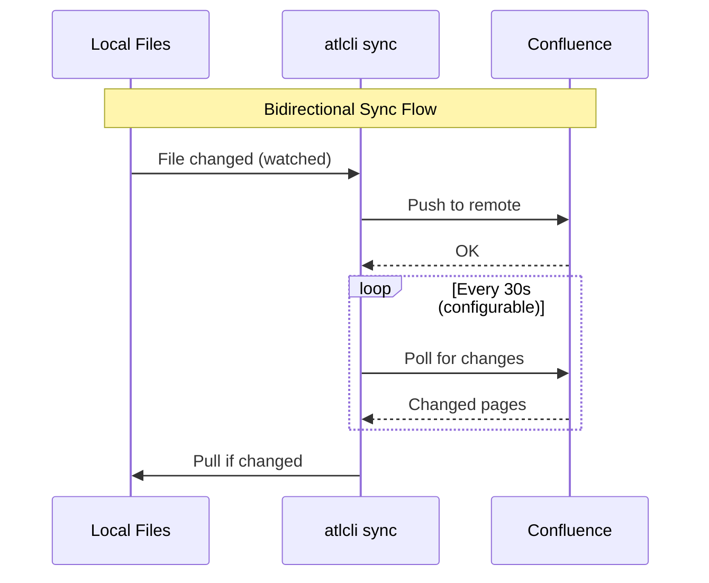

# Sync

Bidirectional synchronization between local markdown files and Confluence pages.

## Prerequisites

- Authenticated profile with Confluence access (`atlcli auth login`)
- **Space permission**: View for pull, Edit for push operations
- Initialized sync directory (`atlcli wiki docs init`)

## Overview

atlcli provides powerful sync capabilities:

- **Watch**: Real-time bidirectional sync with file watching and remote polling
- **Pull**: Download Confluence pages as markdown
- **Push**: Upload local changes to Confluence
- **Conflict resolution**: Three-way merge with automatic and manual resolution

## Initialize

Set up a directory for sync:

```bash
atlcli wiki docs init ./docs --space TEAM
```

Options:

| Flag | Description |
|------|-------------|
| `--space` | Space key (required) |
| `--page-id` | Sync single page by ID |
| `--ancestor` | Sync tree under specific page |

:::note[Where to run subsequent commands]
`init` creates the `.atlcli/` folder inside the directory you pass. Every later command (`pull`, `push`, `status`, `sync`, ...) then either takes that same path or walks up from your current directory to find the nearest `.atlcli/`. In practice: pass the same path you used for `init`, or `cd` into it and drop the path argument.
:::

### Scope Options

```bash
# Sync entire space
atlcli wiki docs init ./docs --space TEAM

# Sync specific page tree
atlcli wiki docs init ./docs --ancestor 12345

# Sync single page only
atlcli wiki docs init ./docs --page-id 12345
```

## Watch Mode

The most powerful sync mode - automatically syncs changes in real-time using file watching and remote polling:

```bash
atlcli wiki docs sync ./docs
```

### How Watch Mode Works

Watch mode combines two mechanisms for bidirectional sync:

1. **Local file watching**: Detects changes to local markdown files instantly
2. **Remote polling**: Periodically checks Confluence for remote changes



### Sync Command Options

```bash
atlcli wiki docs sync <dir> [options]
```

| Flag | Description |
|------|-------------|
| `--space <key>` | Sync entire space |
| `--ancestor <id>` | Sync page tree under parent ID |
| `--page-id <id>` | Sync single page |
| `--poll-interval <ms>` | Remote polling interval, `100`–`86400000` (default: 30000) |
| `--no-poll` | Disable remote polling (local watch only) |
| `--no-watch` | Disable file watching (poll only) |
| `--on-conflict <mode>` | Conflict handling: `merge`, `local`, `remote` |
| `--auto-create` | Auto-create pages for new local files |
| `--label <label>` | Only sync pages with this label |
| `--dry-run` | Report the plan and exit without changing anything |
| `--json` | JSON line output for scripting |

Run `atlcli wiki docs sync --help` for the same list from the CLI.

:::note[Invalid values are rejected]
`--on-conflict`, `--poll-interval` and `--webhook-port` are validated before the
daemon starts. An unrecognized mode or a non-numeric interval exits with a usage
error instead of silently falling back to `merge` or to the default interval.
:::

### Previewing a Sync

```bash
atlcli wiki docs sync ./docs --page-id 12345 --dry-run
```

`--dry-run` reports the plan and exits. It performs **no** filesystem writes at
all:

- No pages are pulled; no local file is created, moved or overwritten.
- Legacy `<file>.meta.json` / `<file>.base` sidecars are reported as
  `Would migrate:` and left on disk — they are neither migrated nor deleted.
- No `.atlcli/` directory, state store or cache is created, and the target
  directory itself is not created if it does not exist.
- The sync daemon is not started, so no watcher and no poller run.

:::caution[Behavior changed]
Earlier versions migrated legacy sidecars for real under `--dry-run`: they
deleted `<file>.meta.json` and `<file>.base` and created a `.atlcli/` store. If
you ran a dry run against a directory still in the pre-v2 format, check version
control for missing sidecar files.
:::

### Polling

The poller periodically checks Confluence for changes. Efficiency depends on sync scope:

| Scope | API Calls | Best For |
|-------|-----------|----------|
| `--page-id` | Minimal (1 page) | Editing single document |
| `--ancestor` | Moderate (tree) | Working on a section |
| `--space` | Higher (all pages) | Full documentation sync |

```bash
# Poll single page (most efficient)
atlcli wiki docs sync ./docs --page-id 12345

# Poll page tree
atlcli wiki docs sync ./docs --ancestor 12345

# Poll entire space
atlcli wiki docs sync ./docs --space TEAM
```

### Polling Events

The poller detects three types of remote changes:

| Event | Description | Action |
|-------|-------------|--------|
| `created` | New page added in scope | Pull to local |
| `changed` | Page content or title updated | Pull or merge |
| `deleted` | Page removed from scope | Notify user |

### Configuring Poll Interval

```bash
# Fast polling (every 10 seconds) - more API calls
atlcli wiki docs sync ./docs --poll-interval 10000

# Slow polling (every 2 minutes) - fewer API calls
atlcli wiki docs sync ./docs --poll-interval 120000

# Disable remote polling entirely
atlcli wiki docs sync ./docs --no-poll
```

**Note**: Lower intervals mean faster remote change detection but more API requests. The default (30 seconds) balances responsiveness with API usage.

### Webhooks

For instant remote change detection without polling overhead, use webhooks:

```bash
atlcli wiki docs sync ./docs \
  --webhook-port 8080 \
  --webhook-url https://your-server.com:8080/webhook
```

| Flag | Description |
|------|-------------|
| `--webhook-port` | Local webhook server port |
| `--webhook-url` | Public URL to register with Confluence |

**Webhook Events**:

The webhook server handles these Confluence events:

| Event | Description |
|-------|-------------|
| `page_created` | New page created |
| `page_updated` | Page content changed |
| `page_removed` | Page deleted |
| `page_trashed` | Page moved to trash |
| `page_restored` | Page restored from trash |
| `page_moved` | Page moved to different parent |

**Webhooks vs Polling:**

| Feature | Polling | Webhooks |
|---------|---------|----------|
| Latency | 0-30s (configurable) | Instant |
| Setup | None | Requires public URL |
| API usage | Regular requests | On-demand only |
| Reliability | Always works | Requires connectivity |
| Filtering | By scope | By page ID and space |

For local development, use polling. For production servers with public URLs, webhooks provide better performance.

### Auto-Create Pages

Create Confluence pages automatically for new local files:

```bash
atlcli wiki docs sync ./docs --space TEAM --auto-create
```

Auto-create triggers in two scenarios:

1. **During initial sync**: atlcli creates untracked local files (no frontmatter ID) as new pages
2. **During file watching**: New files added while sync is running are automatically created

**How it works:**

| Aspect | Behavior |
|--------|----------|
| Title | From frontmatter `title`, or filename converted to title case |
| Parent | Space home page (for `--space`) or ancestor (for `--ancestor`) |
| Content | Full markdown content converted to Confluence storage format |

**Example workflow:**

```bash
# Start sync with auto-create
atlcli wiki docs sync ./docs --space TEAM --auto-create

# In another terminal, create a new file
echo "# My New Feature" > ./docs/my-new-feature.md

# Sync automatically:
# 1. Detects new file
# 2. Creates page "My New Feature" in Confluence
# 3. Updates local file with frontmatter containing page ID
```

After auto-create, the file is updated with frontmatter:

```markdown
---
atlcli:
  id: "12345678"
  title: "My New Feature"
---

# My New Feature
```

### Lock File

When sync runs, atlcli creates a lock file at `.atlcli/.sync.lock`. This:
- Prevents concurrent sync operations
- Signals to other tools that sync is active
- Is automatically removed on clean shutdown

:::tip[Stale lock file?]
If sync fails to start with "lock file exists" but no sync is running, the lock may be stale from a crash. Remove it with `rm ./docs/.atlcli/.sync.lock`.

:::

## Pull

Download pages from Confluence to local markdown files:

```bash
atlcli wiki docs pull ./docs
```

The path argument is optional and defaults to the current directory. Pass the same path you used for `init` (or `cd` into it and omit the path) so files land where the state expects them. `--dir <path>` does the same thing as the positional argument and is the spelling to use from scripts.

Options:

| Flag | Description |
|------|-------------|
| `--dir <path>` | Target directory (same as the positional path; use it when running from elsewhere) |
| `--out <path>` | Legacy alias for `--dir` |
| `--space` | Filter by space key |
| `--page-id` | Pull specific page |
| `--ancestor` | Pull page tree |
| `--label` | Filter by label |
| `--force` | Overwrite local modifications - markdown **and** attachments |
| `--comments` | Export comments to sidecar files |
| `--no-attachments` | Skip downloading attachments |
| `--limit <n>` | Maximum pages to pull |

### Local modifications are never overwritten silently

Pull compares each file it is about to write against the hash recorded at the
last sync. Anything you changed locally is left alone and reported:

```
Skipping architecture.md (local modifications, use --force)
Skipping architecture.attachments/diagram.png (local modifications, use --force)
```

This applies to markdown files and to attachments alike. Skipped attachments are
counted as `attachmentsSkipped` in `--json` output. Use `--force` to discard the
local version and take the remote one.

:::caution[`--force` discards local edits]
`--force` overwrites locally modified markdown files *and* attachments,
including attachments currently in conflict. Run `atlcli wiki docs status`
first to see what you would lose.
:::

### Examples

```bash
# Pull using saved scope from init
atlcli wiki docs pull ./docs

# Pull into ./docs from an unrelated working directory
atlcli wiki docs pull --dir ./docs

# Pull pages with specific label
atlcli wiki docs pull ./docs --label api-docs

# Pull with comments exported
atlcli wiki docs pull ./docs --comments

# Force pull (overwrite local changes, attachments included)
atlcli wiki docs pull ./docs --force

# Pull without attachments
atlcli wiki docs pull ./docs --no-attachments
```

### Comments Export

When using `--comments`, page comments are saved to sidecar files:

```
docs/
├── architecture.md
├── architecture.comments.json   # Comments for architecture.md
└── api-reference.md
```

The comments file contains both footer comments and inline comments with their full thread hierarchy.

## Push

Upload local changes to Confluence:

```bash
atlcli wiki docs push ./docs
```

The path argument is optional. When omitted, push walks up from the current directory to find the nearest `.atlcli/` — so from inside your synced tree `atlcli wiki docs push` and `atlcli wiki docs push --page-id 12345` both work without any path.

Options:

| Flag | Description |
|------|-------------|
| `--dir <path>` | Target directory (same as the positional path) |
| `--page-id <id>` | Push specific page by ID |
| `--validate` | Validate the files being pushed before pushing |
| `--strict` | Treat warnings as errors |
| `--json` | JSON output |

### Examples

```bash
# Push all tracked files
atlcli wiki docs push ./docs

# Push single file
atlcli wiki docs push ./docs/page.md

# Push by page ID (from anywhere inside the synced tree)
atlcli wiki docs push --page-id 12345

# Validate before pushing
atlcli wiki docs push ./docs --validate

# Strict validation (fail on warnings)
atlcli wiki docs push ./docs --validate --strict
```

:::note[Pushing by page ID]
`--page-id` looks the file up from `.atlcli/state.json`. If you renamed or moved the file locally, push scans the tree for the matching frontmatter ID and heals the state automatically — you don't have to re-pull.
:::

:::caution[Permission errors on push?]
If you see "You don't have permission to edit page", verify your Confluence space/page permissions. You need Edit permission for push operations.

:::

### Validation

Pre-push validation checks for:

| Check | Severity | Description |
|-------|----------|-------------|
| Broken links | Error | Target file not found |
| Untracked pages | Warning | Link to page without ID |
| Unclosed macros | Error | `:::info` without closing `:::` |
| Page size | Warning | Content exceeds 500KB |

`--validate` checks exactly what the push will send: the single file for
`push <file>` or `push --page-id <id>`, and the collected (ignore-filtered) set
for a directory push. Errors in files you are not pushing do not block the push,
and `--validate` works outside an initialized tree too - it validates the named
file rather than doing nothing.

```bash
# Run validation separately
atlcli wiki docs check ./docs

# From an unrelated working directory
atlcli wiki docs check --dir ./docs

# Strict mode (warnings are errors)
atlcli wiki docs check ./docs --strict

# JSON output for CI/scripts
atlcli wiki docs check ./docs --json
```

:::note[`check` never passes by checking nothing]
If the resolved path contains no markdown files, `check` exits non-zero with
"nothing was validated" instead of reporting a green run. A missing path fails
the same way.
:::

## Add

Add a new local file to Confluence tracking:

```bash
atlcli wiki docs add <file> [options]
```

| Flag | Description |
|------|-------------|
| `--title <t>` | Page title (default: from H1 or filename) |
| `--parent <id>` | Parent page ID |
| `--template <name>` | Use template for initial content |

```bash
# Add file with auto-detected title
atlcli wiki docs add ./docs/new-page.md

# Add with specific parent
atlcli wiki docs add ./docs/guide.md --parent 12345

# Add using a template
atlcli wiki docs add ./docs/meeting.md --template meeting-notes
```

## Diff

Compare local file with remote Confluence page:

```bash
atlcli wiki docs diff <file>
```

Shows unified diff with colored output:
- Green: additions (local has, remote doesn't)
- Red: deletions (remote has, local doesn't)
- Cyan: file headers and hunk markers

```bash
# Compare single file
atlcli wiki docs diff ./docs/api-reference.md

# JSON output with statistics
atlcli wiki docs diff ./docs/api-reference.md --json
```

## Conflict Resolution

### Detection

atlcli detects conflicts when:
- Local file was modified since last sync
- Remote page was modified since last sync

```
Conflict detected: docs/api.md
  Local:  Modified 2025-01-14 10:30 (version 5 → local changes)
  Remote: Modified 2025-01-14 10:35 (version 5 → version 6)
```

### Resolution Strategies

Control how conflicts are handled in sync mode:

```bash
atlcli wiki docs sync ./docs --on-conflict <strategy>
```

| Strategy | Behavior when the three-way merge fails |
|----------|----------------------------------------|
| `merge` | Write conflict markers into the local file and stop (default) |
| `local` | Local wins: push the local file over the remote page in one update |
| `remote` | Remote wins: overwrite the conflicted local file in place; the local edit is discarded and never pushed |

All three emit a `conflict` event first, so `--json` consumers see which
strategy was applied:

```json
{"schemaVersion":"1","type":"conflict","message":"Conflict (1 regions), keeping remote (--on-conflict remote): ./docs/api.md","file":"./docs/api.md","pageId":"12345","details":{"conflictCount":1,"resolution":"remote"}}
```

:::caution[Behavior changed]
Earlier versions handled only `merge` correctly. `local` looped between the push
and merge paths without ever pushing (thousands of API requests, no result), and
`remote` wrote the remote content to a *new* file (`api-2.md`) while leaving
`api.md` on the local edit. Both now behave as documented above.
:::

### Three-Way Merge

With `--on-conflict merge`, atlcli attempts automatic merging:

1. Uses the common ancestor (base) version
2. Computes diffs from both local and remote
3. Merges non-conflicting changes
4. Marks conflicting sections with markers

### Conflict Markers

When merge cannot auto-resolve, conflict markers are inserted:

```markdown
## API Reference

<<<<<<< LOCAL
This endpoint returns user data in JSON format.
=======
This endpoint returns user data. Response format is JSON.
>>>>>>> REMOTE

### Authentication
```

### Resolving Conflicts

```bash
# Edit file to resolve conflicts manually
vim docs/api.md

# Then resolve with chosen strategy
atlcli wiki docs resolve docs/api.md --accept local
atlcli wiki docs resolve docs/api.md --accept remote
atlcli wiki docs resolve docs/api.md --accept merged  # After manual edit
```

:::tip[Stuck in merge conflicts?]
Reset to remote version with `atlcli wiki docs pull ./docs --force`, or force your local version with `--accept local` followed by push.

:::

## Status

Check sync status of all tracked files:

```bash
atlcli wiki docs status ./docs
```

Output:

```
Sync status for ./docs:

  synced:          12 files
  local-modified:  2 files
  remote-modified: 1 files
  conflict:        1 files
  untracked:       3 files
  folders:         2

Attachments:
  synced:          8
  local-modified:  1
  conflict:        0
  missing:         0

Last sync: 2025-01-14T10:30:00Z

Modified:
  api-reference.md (local changes)
  getting-started.md (remote changes)
  architecture.attachments/diagram.png (attachment local changes)

Conflicts:
  troubleshooting.md
```

The file counters cover markdown only. Attachments are counted separately (they
have their own base hashes) and appear in `--json` output under
`attachmentStats`; individual files show up in `modified` with the type
`attachment local changes`, or `attachment deleted locally` when the file is
gone.

Options:

| Flag | Description |
|------|-------------|
| `--dir <path>` | Target directory (same as the positional path) |
| `--links` | Analyze link changes vs stored links |
| `--json` | JSON output |

## Ignore Patterns

Create `.atlcliignore` to exclude files from sync:

```bash
# .atlcliignore (gitignore syntax)

# Ignore drafts
drafts/
*.draft.md

# Ignore specific files
internal-notes.md

# Ignore by pattern
temp-*.md

# Negation (include despite earlier rule)
!important-draft.md
```

**Default ignores** (always excluded):

- `.atlcli/` - sync state directory
- `*.meta.json` - legacy metadata files
- `*.base` - base versions for merge
- `.git/` - git directory
- `node_modules/` - node dependencies

**Note**: Patterns from `.gitignore` are also respected and merged with `.atlcliignore`.

## Directory Structure

After init and pull:

```
docs/
├── .atlcli/
│   ├── config.json         # Sync configuration
│   ├── state.json          # Sync state (versions, timestamps)
│   ├── .sync.lock          # Lock file (when sync running)
│   └── cache/              # Base versions for 3-way merge
│       └── 12345.md        # Base content by page ID
├── getting-started.md
├── api-reference.md
├── api-reference.attachments/
│   └── diagram.png         # Attachments for api-reference.md
├── guides/
│   ├── installation.md
│   └── configuration.md
├── .atlcliignore           # Ignore patterns
└── .gitignore              # Git ignore (also respected)
```

### State File

`.atlcli/state.json` tracks sync state per page:

```json
{
  "lastSync": "2025-01-14T10:00:00Z",
  "pages": {
    "12345": {
      "path": "api-reference.md",
      "title": "API Reference",
      "version": 5,
      "localHash": "abc123",
      "remoteHash": "abc123",
      "baseHash": "abc123",
      "syncState": "synced",
      "parentId": "12340",
      "ancestors": ["12340", "12300"]
    }
  }
}
```

## File Format

Local files use YAML frontmatter with the `atlcli` namespace:

```markdown
---
atlcli:
  id: "12345"
  title: "API Reference"
---

# API Reference

Content here...
```

The frontmatter fields:

| Field | Required | Description |
|-------|----------|-------------|
| `id` | Yes | Confluence page ID (set automatically on pull/create) |
| `title` | No | Page title override (defaults to first H1 heading) |

See [File Format](file-format.md) for details.

## Hierarchy Handling

atlcli maps Confluence page hierarchy to directory structure:

```
Confluence:                    Local:
├── Parent Page               ├── parent-page.md
│   ├── Child A               ├── parent-page/
│   │   └── Grandchild        │   ├── child-a.md
│   └── Child B               │   ├── child-a/
                              │   │   └── grandchild.md
                              │   └── child-b.md
```

When pages move in Confluence, sync detects this and moves local files to match.

### Folders

atlcli supports Confluence Cloud folders (introduced September 2024):

```
Confluence:                    Local:
├── My Folder (folder)        ├── my-folder/
│   ├── Page A                │   ├── index.md      (type: folder)
│   └── Page B                │   ├── page-a.md
                              │   └── page-b.md
```

atlcli represents folders as directories with an `index.md` file containing `type: folder` in frontmatter. See [Folders](folders.md) for full details on folder support and limitations.

## JSON Output

Most commands support `--json` for scripting. Apart from the two streaming
commands noted below, `--json` writes **exactly one JSON document** to stdout —
`JSON.parse(stdout)` is always safe. Progress notes, skip messages and warnings
are suppressed in this mode; the counters in the result document report the same
information (a skipped file shows up in `results.skipped`, not as a log line).

```bash
atlcli wiki docs status ./docs --json
```

```json
{
  "schemaVersion": "1",
  "dir": "./docs",
  "stats": {
    "synced": 12,
    "localModified": 2,
    "remoteModified": 1,
    "conflict": 1,
    "untracked": 3
  },
  "lastSync": "2025-01-14T10:00:00Z"
}
```

### Streaming commands

`sync` and `watch` are the exception: they run until done (or until you stop
them) and emit **JSON Lines** — one complete document per line. Parse these line
by line, not as a whole.

```bash
atlcli wiki docs sync ./docs --json
```

```json
{"schemaVersion":"1","type":"status","message":"Starting initial sync..."}
{"schemaVersion":"1","type":"pull","file":"api-reference.md","pageId":"12345","message":"Pulled: API Reference"}
{"schemaVersion":"1","type":"push","file":"guide.md","pageId":"12346","message":"Pushed: Guide"}
```

### Failures

A command that exits non-zero reports the reason in an `error` object. For
`docs check` this is folded into the report document so there is still only one
document to parse — see [Validation](validation.md#json-output).

## Best Practices

1. **Use watch mode** for real-time collaboration on documentation
2. **Use labels** to sync subsets of pages (`--label architecture`)
3. **Enable webhooks** for production servers with public URLs
4. **Commit to Git** - track markdown files in Git for version history
5. **Use `.atlcliignore`** for drafts and local-only content
6. **Run validation** before pushing (`--validate`)

## Troubleshooting

### Lock File Issues

If sync fails due to lock:

```bash
# Check if sync is running
ps aux | grep "atlcli wiki docs sync"

# Force remove stale lock (only if no sync is active)
rm ./docs/.atlcli/.sync.lock
```

### Merge Conflicts

If you get stuck in merge conflicts:

```bash
# Reset to remote version
atlcli wiki docs pull ./docs --force

# Or force push local version
atlcli wiki docs resolve ./docs/file.md --accept local
atlcli wiki docs push ./docs
```

### Permission Errors

```
Error: You don't have permission to edit page 12345
```

Check your Confluence permissions for the space/page.

### Rate Limiting

If you see 429 errors, increase poll interval:

```bash
atlcli wiki docs sync ./docs --poll-interval 60000
```

## Related Topics

- [File Format](file-format.md) - Frontmatter structure and directory conventions
- [Ignore Patterns](ignore.md) - Exclude files from sync with `.atlcliignore`
- [Validation](validation.md) - Pre-push validation rules
- [Attachments](attachments.md) - Sync images and file attachments
- [Webhooks](webhooks.md) - Real-time sync without polling
- [Pages](pages.md) - Direct page operations (create, move, delete)
